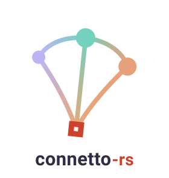
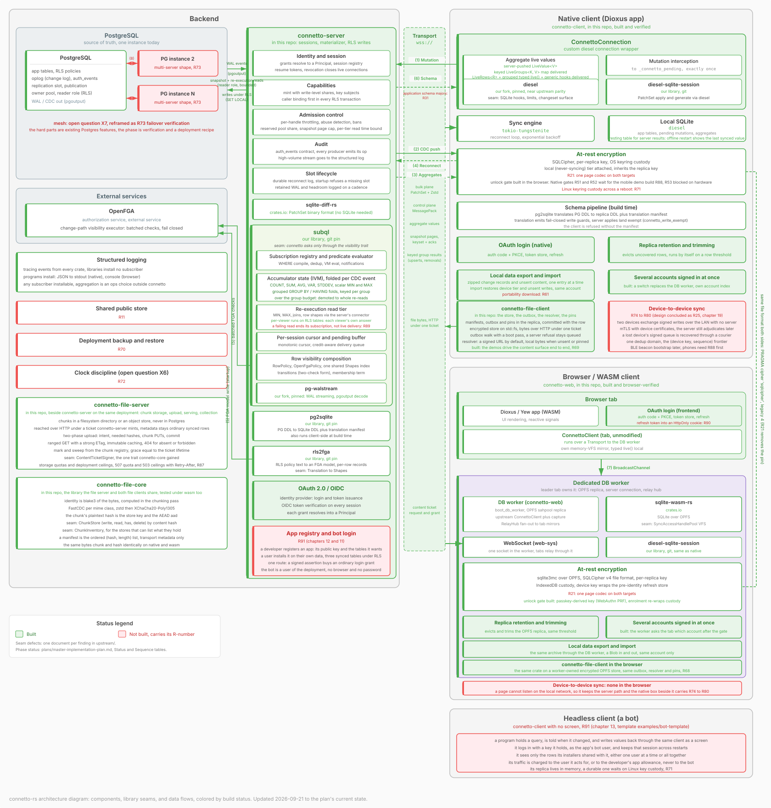

# connetto-rs

connetto is the core of a data-driven application, built once so that each application does not have to build it. A team writes its PostgreSQL schema with the row-level security policies that say who sees what, its UI, and whatever the service itself does. connetto takes care of everything between the database and the screen.

On the server, the database's logical replication stream is the source of every update. `subql`, the change data capture engine connetto hosts, matches each committed change against every open subscription in process, folds aggregates incrementally, and re-executes only the query shapes that need it, so a change costs the server one evaluation rather than a query per client. Every row is authorized on every path, by Postgres RLS on snapshots and writes, and on the change path by the same policies translated by `rls2fga` into an OpenFGA model, so a change reaches only the callers allowed to see the row as it was. Login is OAuth 2.0 and OIDC against any provider, and connetto mints the sessions, the grants, and the capabilities through which an application shares a row.

On the client, a SQLite replica on native and in the browser is read with Diesel and written optimistically. Every write applies on the server under the database's own policies and comes back to every subscribed device, every subscribed read stays live, and the replica is encrypted at rest and keeps working offline.

## What works today

| Area | Built |
|---|---|
| Sync loop | Optimistic writes applied under RLS, CDC through `subql`, live row subscriptions, reconnect with catch-up or resync |
| Aggregates | `COUNT`, `SUM`, `AVG`, variance and grouped folds per change, `MIN`, `MAX`, joins and rows re-executed per viewer |
| Identity | OAuth 2.0 and OIDC login, durable sessions, grants, shareable capabilities, audit table, throttling and bans |
| Authorization | RLS on snapshots and writes, the same policies as an OpenFGA model on the change path |
| Clients | Native Diesel connection, browser client on a worker over OPFS, Dioxus and Yew hooks |
| At rest | SQLCipher and `sqlite3mc` with keyring or IndexedDB custody, passkey unlock, a device-private tier, retention, several accounts |
| Portability | Streamed device archives that restore the tier, unsent writes and unsent content |
| Files | Chunked, encrypted content with a file server and a client for both platforms |
| Schema | Postgres DDL translated to the replica at build time by `pg2sqlite`, with write guards |
| Operations | `tracing` logs everywhere, Docker and headless Chrome suites, CI over seven workspaces |

## Where it stands

The plan in `plans/master-implementation-plan.md` tracks 87 phases, 65 done and 22 open. The core is built and proven, and what remains is the last mile around it.

| Remaining | Phases |
|---|---|
| Native unlock gates and the mobile demo build | R51 to R53, R88 |
| One page codec, Linux key custody across a reboot | R21, R71 |
| Schema majors, shared public store, portability download | R31, R11, R61 |
| Backup and restore, clock discipline, failover verification | R70, R72, R73 |
| Refresh token in an `HttpOnly` cookie, re-execution read failure scope, demo gaps | R90, R89, R57 |
| Device-to-device sync without a server | R74 to R80 |

A per-check consistency token, Zanzibar's zookie, is not supported and owned by no phase, since OpenFGA lists it as future work. A withdrawn permission therefore takes effect on the change path within the read cache lifetime, while writes and teardowns are refused at once (chapter 08).

## The design

`docs/architecture/README.md` indexes the chapters. `00-overview.md` is the entry point, `open-questions.md` the index of every numbered question and its decision. Every statement in a chapter carries a status marker, and a chapter outranks the plan on decisions while the plan outranks a chapter on phases.

The drawing below is the whole system coloured by build status. It is too dense to read inline, so open it in the browser and zoom.

## Layout

| Crate | Role |
|---|---|
| `connetto-core` | Wire protocol, framing, and the traits every side agrees on |
| `connetto-server` | Session manager, subscription materializer, auth stack, mutation handler |
| `connetto-client` | Native Diesel connection, background sync, live queries, teardown, archives |
| `connetto-web` | Browser platform on wasm32, the DB worker, the relay, storage and custody |
| `connetto-dioxus`, `connetto-yew` | Framework adapters exposing live queries as hooks |
| `connetto-file-core`, `connetto-file-server`, `connetto-file-client` | The file stack, which depends on connetto and never the reverse |
| `connetto-test-harness` | The in-process CDC loop and the browser stack runner behind the tests |

`examples/` holds a Dioxus desktop demo, Dioxus and Yew web demos, the browser smoke suite, and the passkey unlock proof.
