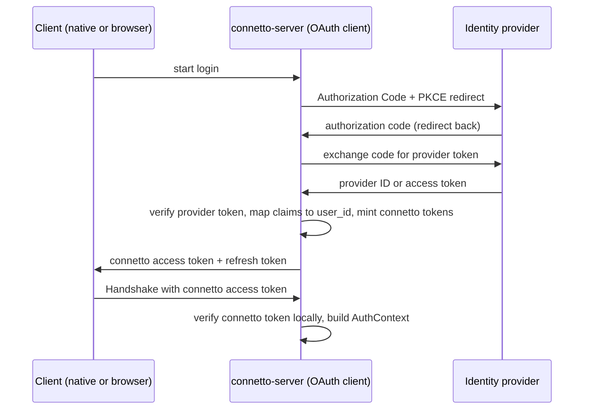

# 11: Authentication

**Status**: draft

---

> **See also:** `12-identity-session-capability.md` is the canonical model for session, identity, and capability. Where this chapter and chapter 12 disagree, chapter 12 governs.

## Purpose

Define how a caller proves who it is, end to end, from the moment a user logs in to the moment the server binds a verified identity onto a session. This chapter is about authentication only, proving identity. Authorization, deciding which rows an identity may read or write, is a separate concern that already has its own chapter (`08-authorization.md`) and is not redesigned here.

The single fact that connects the two chapters: authentication produces a `Principal`, and the authorization layer consumes it. Where that `Principal` carries an identity, `PgSnapshotSource` and `PgWriteTarget` bind its user id into `SELECT set_config('app.user_id', $1, true)`, so whatever this chapter resolves as the identity becomes the RLS principal directly. Where it carries none, the setting is left unbound for the whole transaction, which is what makes an owner-scoped policy hide every row while a public one still returns its own. That is why authentication is load-bearing for security.

---

## The gap this closes

**Closed (R1, R2, R3).** The trust-the-client-id line is gone from `run_handshake`, and so is every way back to it. The stand-in that reproduced the old behaviour, taking the string the client presented and using it verbatim as the user id, was deleted in R2, and no constructor supplies a default, so a deployment states its identity story or the server refuses to start. R3 finished the shape: each grant resolves into a `Principal` from a token connetto signed itself, and a caller presenting nothing is unidentified rather than whoever it claimed to be, which is the case the old default could not express and therefore faked. The one remaining stand-in checks nothing and lives behind a test-only feature no production build enables.

---

## The authN and authZ boundary

Authentication answers "who is this caller." Its output is a `Principal` carrying an optional identity plus resolved capabilities. An identity carries a user id and nothing else. Authorization answers "may this caller see or write this row," and it reads that `Principal`. This chapter defines the first and stops at the boundary. It does not touch RLS mirroring, per-row checks, OpenFGA, or `rls2fga`, all of which live in `08-authorization.md`. The only obligation this chapter carries across the boundary is that the identity's `user_id` be trustworthy and stable, because a weak or spoofable mapping reintroduces the current hole one layer up.

---

## Principles

1. **Identity is derived from a credential the server can verify, never from a client-supplied string.** The client id is a logging and correlation label to the server, which keys nothing on it. **One exception, and it is not the server (R35).** The browser relay hub keys each tab's durable write counter and its lock on the tab's client id, so there it is an identity and the hub requires a UUID, refusing a handshake that does not parse as one. A tab that cannot name itself uniquely would otherwise share another tab's write counter, which decides whether its writes count as already applied.
2. **connetto is the OAuth client, not the browser or the native app.** The backend runs the OAuth flow and mints its own session credential. Provider tokens never reach the frontend.
3. **Authentication gates sync, never local reads.** The local replica is readable and writable offline with no valid credential. Only the server connection requires authentication.
4. **Token expiry while offline is a designed state, not an error.** The app keeps working locally, and re-authentication resumes sync.
5. **Asymmetric algorithms only, with issuer and audience pinned.** The `none` algorithm is rejected, and a symmetric algorithm verified with a public key is rejected. Issuer and audience are always checked.
6. **The verification seam is pluggable and mirrors the authorization one.** A trait with a real implementation behind it and a test double that refuses whatever it was not told to accept, so tests and local loops need no live identity provider. **Corrected (R9, 2026-08-16):** this used to read "a permissive stand-in", which neither seam has now.

---

## Architecture: Backend-For-Frontend

connetto uses the Backend-For-Frontend (BFF) topology. connetto-server is registered with each identity provider as a confidential OAuth client and holds the provider client secret. The frontend, native or browser, is not an OAuth client at all.

The token shape at the identity provider follows OAuth 2.0 Authorization Code with PKCE. Both OIDC ID tokens and JWT access tokens are accepted at the provider boundary, because a single-audience first-party deployment can pin the issuer and audience for either, and some providers (Google, for one) issue opaque access tokens whose only verifiable signed artifact is the ID token. That choice lives entirely inside each provider configuration and never reaches the client.

The login flow:



connetto verifies the provider token at the login callback, maps its claims to a `user_id`, and mints its own tokens. It retains the provider token in the auth store rather than discarding it, because the store that holds a user's identity also holds that user's provider tokens, so an application that configured the right scopes on the provider can read a fresh token back through the lazy accessor (see below) and call the provider's own APIs such as a calendar. What the client carries afterward is a connetto-minted credential, and what the server verifies on every handshake is a token it signed itself. Provider verification runs once per login, not per connection.

This topology is the current recommended shape for browser applications precisely because the provider tokens never touch frontend JavaScript, which removes the cross-site-scripting exfiltration surface that storing tokens in the page creates. It also fits connetto, which already runs a session subsystem (subql subscription state is session-scoped) and already mints its own short-lived signed tokens (the file access token in `08-authorization.md`), so the session-issuance machinery is largely already present rather than new.

---

## Identity resolution

### Providers

One struct implements an `IdentityProvider` trait per identity provider (Google, Microsoft, Apple, a generic OIDC fallback, and others added over time). Each provider struct carries its own confidential-client configuration (client id, client secret, issuer, expected audience, tenant where relevant, and the OAuth scopes to request) and knows how to recognize and verify its own token shape. Providers differ in ways that justify per-provider code: Microsoft embeds the tenant in the issuer URL and ends it in `/v2.0`, so exact-string issuer matching is insufficient, whereas Google emits a fixed issuer. Provider structs quarantine that knowledge.

The enabled providers are held in a runtime collection indexed by issuer. A token names its issuer, so routing is an index lookup, with a matcher fallback for a provider that deliberately accepts a pattern of issuers such as any-tenant Microsoft. Routing on the unverified issuer only selects a provider, and nothing in the token is trusted until the selected provider has cryptographically verified the signature and re-confirmed the issuer and audience it expects. There is no blessed default provider. A deployment composes the set it enables. A typed tuple was considered and rejected: routing is a runtime match either way and every provider yields the same `AuthContext`, so a static tuple would add type machinery for no functional or performance gain over a boxed collection.

### Identity mapping and the auth store

The globally unique identifier for a user is the pair of the issuer claim and the subject claim, per OpenID Connect Core section 5.7, which states that the subject alone is only locally unique within the issuer and that the combination of issuer and subject is the only guaranteed unique identifier. Human-readable fields (email, phone, username) are never used as identity, because they change and are reused.

The identity mapping, connetto's own sessions and refresh tokens, and the user's retained provider tokens all live in one pluggable store, and connetto ships two implementations. The choice is not only where this state lives, it is also the deployment topology, because a store that is not shared cannot back more than one server.

1. **In-memory store.** Holds the state in the server process. Identity is resolved by a deterministic mapping from `(iss, sub)` with no lookup, for example a name-based (version 5) UUID over issuer and subject. Revocation and the handshake liveness check are instant local operations. This variant is single-server by nature, because in-memory state is not shared, and it is ephemeral, because a restart drops the sessions and tokens and forces clients to log in again. It suits development and simple single-server deployments.
2. **Database store.** `DbAuthStore<S>` is generic over a `ConnettoStoreSchema` trait that carries the deployment's `sessions` and `provider_tokens` tables, their columns, and the typed distributed `Id` type, plus a handful of opaque pre-built statements (the `FOR UPDATE` rotate read and the two UPDATEs, which the diesel trait solver cannot name generically). connetto keeps every query and security decision (rotation, reuse-is-theft, liveness, deadline capping) and emits no schema. Identity is resolved by a deployment-supplied `IdentityResolver` that maps the verified claims to a typed `user_id` in the deployment's own users table (creating or linking the row so the `sessions.user_id` foreign-key target exists), which lets one human hold several linked logins and gives the deployment full ownership of its ids. The sessions row stores the typed `user_id` in its own column plus one opaque `attrs` JSONB blob holding the rest of the `AuthContext` (tenant, roles, claims) with no `user_id` duplicated. It is durable across restart and is the only variant that supports a mesh, where its rows replicate like any other. The resolver runs against the same Postgres as the store.

Retained provider tokens live in whichever store, and connetto exposes a lazy refreshing accessor that returns a currently-valid provider access token, refreshing inline against the provider when the stored one has expired, persisting the rotated refresh token in the same store transaction, and serializing concurrent callers on that token row so two of them cannot double-refresh and trip the provider's rotation-reuse defense. connetto runs no background refresh job, a token is refreshed only when it is about to be used, which is fewer provider requests and avoids a mesh-wide scheduler.

Mapping runs once, at the login callback, when connetto mints the session, not on the handshake hot path. Account linking (attaching a second provider identity to an existing user) uses the standard safe procedure: the user must be authenticated on both accounts at link time, and identities are never linked on a shared email address alone.

### Migrations: the tables are the deployment's

connetto emits no server DDL on any path a deployment runs, and the one exception is worth naming so the rule is not read as absolute: `PgOplog::ensure_schema` in `crates/connetto-server/src/oplog.rs` does emit `CREATE TABLE IF NOT EXISTS` for the oplog table. It is opt-in, nothing in the server calls it, and only a test does. So it is a convenience for bringing up a scratch database, not a migration mechanism, and it is not a precedent for connetto owning a deployment's schema. The tables below are the deployment's to create and migrate, and `ConnettoStoreSchema` is the real contract, implementable by hand against whatever tables (and column names, extra columns, foreign keys, or indexes) the deployment wants. The `connetto_auth_tables!(Id, IdSqlType)` macro is a convenience default only: it expands to these `diesel::table!` blocks and a `ConnettoStoreSchema` impl for the default shape, parameterized by the developer's `Id` type and its diesel SQL type. A deployment that wants a different shape skips the macro and implements the trait.

The `user_id` type is a placeholder the deployment fills for its `Id` (for example `BYTEA` for a `uuid`, or `TEXT` for a string id as the reference binary uses). The reference SQL:

```sql
CREATE TABLE connetto_sessions (
    session_id           UUID PRIMARY KEY,
    user_id              <IdSqlType> NOT NULL REFERENCES your_users (id),
    current_refresh_hash BYTEA NOT NULL,
    idle_deadline        TIMESTAMPTZ NOT NULL,
    absolute_deadline    TIMESTAMPTZ NOT NULL,
    revoked              BOOLEAN NOT NULL DEFAULT FALSE
);

CREATE TABLE connetto_provider_tokens (
    session_id    UUID PRIMARY KEY REFERENCES connetto_sessions (session_id) ON DELETE CASCADE,
    issuer        TEXT NOT NULL,
    access_token  TEXT NOT NULL,
    refresh_token TEXT,
    expires_at    TIMESTAMPTZ
);

CREATE TABLE _connetto_mutations (
    session_id UUID PRIMARY KEY,
    last_seq   BIGINT NOT NULL
);

CREATE TYPE connetto_change_op AS ENUM ('insert', 'update', 'delete', 'truncate');

CREATE TABLE connetto_oplog (
    lsn          BIGINT PRIMARY KEY,
    table_name   TEXT NOT NULL,
    op           connetto_change_op NOT NULL,
    pk           BYTEA NOT NULL,
    is_tombstone BOOLEAN NOT NULL,
    event        BYTEA NOT NULL,
    appended_at  TIMESTAMPTZ NOT NULL DEFAULT now()
);
```

**Built (R2).** The watermark keys on the session handle alone. It needs a stable per-client handle, which is what a session is, and it does not need to know who the client is, so the earlier `user_id` column only widened the shape the table has to satisfy.

**The reconnect log is on this list as of R32 (2026-08-09), and the server refuses to start without it.** It holds what a returning client missed, and it used to live only in the server's memory, so it was empty on every boot and answered "you have missed nothing" to every client that came back after a restart, which sent them nothing and left them silently stale. Durable, it answers from evidence. `CONNETTO_OPLOG_TABLE` names it, defaulting to `connetto_oplog`, and `PgOplog::ensure_schema` emits exactly the two statements above for a scratch database.

**A boot-time check on that shape existed and was deleted on 2026-08-06.** It read Postgres's catalogue and refused a table carrying a leftover `user_id`. Two things were wrong with it. It hardcoded connetto's default column names while being generic over `ConnettoWatermarkSchema`, so it would have refused exactly the application-owned table the trait exists to permit, and the trait already carries the typed upsert the compiler checks. And its stated reason, that a mis-keyed record stays silent until a replay, was false: the pre-R2 two-column key fails on the first write with `there is no unique or exclusion constraint matching the ON CONFLICT specification`, and a missing table with `relation "_connetto_mutations" does not exist`. Both are loud, verified against Postgres.

**Decided (R3), and it is why the watermark table references nothing.** It used to declare `session_id` as a foreign key into `connetto_sessions`, cascading on delete. Every run has a handle, and only a login has a row in `connetto_sessions`, so the first write by a caller with no identity violated that constraint. Widening `connetto_sessions` to hold an unidentified visit was considered and rejected: its `user_id` and `current_refresh_hash` would both have to become nullable, which weakens the shape for every real login, and four of its six columns would be permanently empty for a visit with nothing to keep alive and nothing to revoke. Keeping unidentified callers away from the watermark was also rejected, because it breaks the uniformity the minted handle was chosen to buy and makes an anonymous write no longer exactly-once. So the reference drops the key. A table that still declares one refuses the first write by a caller with no identity, loudly, which is the same treatment every other stale shape now gets. The tidy-up it provided was doing no work: nothing in connetto deletes a session row, so an application pruning old watermark rows always had to do it deliberately.

`session_id` is connetto-minted and connetto-owned (a `Copy` uuid value type, stored in a native `uuid` column and rendered to text only at the JWT `sid` claim and the refresh token). The `_connetto_mutations` table is the durable exactly-once watermark: the server keys it on the `session_id` from the verified access token (never the client-fabricated `client_id`), so a worker restart or leader failover reusing the same session does not replay already-committed mutations. Its `ConnettoWatermarkSchema` impl and `diesel::table!` come from the `connetto_watermark_table!(Id)` convenience macro, the watermark counterpart to `connetto_auth_tables!`. A deployment with a different shape implements the trait by hand.

### Multi-factor assurance

OIDC standardizes assurance signaling. A deployment can require step-up authentication with the `acr_values` and `max_age` request parameters and verify what the login actually reached through the `amr` (methods used) and `acr` (assurance level) claims. connetto's provider configuration exposes an assurance requirement, and the login callback rejects a provider token whose `amr` or `acr` does not meet the configured bar. This makes "force MFA" a deployment setting rather than bespoke code.

---

## Server verification seam

Two seams, both mirroring the authorization pattern of a trait with a real implementation behind it. **Corrected (R9, 2026-08-16):** this used to read "a trait plus a permissive stand-in", and no seam has one now.

At the login callback, the `IdentityProvider` registry verifies the provider token and the mapper resolves the identity. **Built (R1).** `PermissiveProvider` is deleted. The replacements are the `oauth2-test-server` fixture and the `dev_idp` example. An unrecognised `CONNETTO_OIDC_<NAME>_KIND`, including an unset or miscapitalised one, is a startup error rather than a fall-through to a permissive default, because the old fall-through meant a capitalised kind name yielded a deployment that minted real signed tokens in which every user was the same dev identity.

At the handshake, the seam used to turn one access token into an `AuthContext`. **Built (R3).** It is now `HandshakeAuthority`: it checks each grant on its own and the accepted subjects fold into a `Principal`, which may carry no identity at all. It is held as a runtime trait-object field on the server rather than as a generic type parameter, because checking fires once per connection and is off any hot path, so static dispatch buys nothing, and a trait object keeps the server's public type signature stable no matter how a deployment configures identity.

**The two rules about lookups are both true, and this is where they are reconciled.** `02-protocol.md` says checking a grant is arithmetic with no database lookup. The paragraph above says the handshake also confirms the run is still live in the auth store. They do not conflict, because the lookup is not what recognises the grant. The signature already did that, and it is what makes an unrecognised string cost arithmetic and nothing more. What the store answers afterwards is a different question, whether the login this grant names has since been revoked, which is what makes revocation authoritative rather than bounded by the token's remaining lifetime. Reading which kind of subject a grant names is not sniffing either: the kind is a claim inside the signed payload, so one `decode` handles both kinds and no order of attempts exists. A capability grant makes no store call at all, because withdrawing one is deleting the relation that grants it and there is nothing to keep alive. An implementer who reads only one of those two sentences builds the wrong thing, which is why both are stated here together.

**Built (R3).** The concrete shape at `run_handshake`: derive the run's handle first, then check every grant inside that logging context, fold what resolved into a `Principal`, and continue. A grant that fails to check does **not** end the connection and produces no field on the reply. The earlier version of this paragraph said the opposite, that no resolved grant should send a `FatalError` and terminate. That was wrong twice over: it contradicted the resolution rule in `12-identity-session-capability.md`, and it made an empty grant list illegal, which would have erased the unidentified caller the whole phase is built around. `FatalErrorReason::AuthenticationFailed` is deleted, because after this nothing can send it.

**A capability grant is checked for signature, issuer, audience and expiry, and nothing else. Stated explicitly 2026-08-06, because a phase was designed against the opposite.** There is no store call, deliberately, since withdrawing a capability is deleting the relation that grants it. So **revoking a share produces no grant refusal**: the token still checks out, the subject still enters the `Principal`, and the rows simply stop matching the policy. Only expiry, a bad signature, or a wrong issuer or audience make a capability fail here.

---

## connetto session credential

connetto mints two tokens at login.

The **access token** is short-lived and asymmetrically signed. **Decided (R8).** It carries only the identity (`user_id`). `tenant_id`, `roles`, and `claims` are deleted because nothing ever read them. The handshake trusts the identity from the signature alone with no store round-trip, and separately checks that the session is still live so a revoked session is refused even while the token is time-valid. It is verified once at handshake, so a healthy long-lived connection is not dropped when the token expires mid-session. **Built (R3).** It is one grant in `Handshake.grants` rather than a single credential field, which is a wire change carrying no version bump before the first release. The lifetime is short by default and server-configurable, and it is a re-auth cadence, not the revocation bound.

The **refresh token** is longer-lived and stored server-side in a PostgreSQL table (diesel typed queries, not a separate store such as Redis, because the data is low-volume, read once per connection, and connetto is already PostgreSQL-centric). It rotates on every use: each refresh mints a new refresh token and invalidates the old, and a reuse of an invalidated token is treated as theft.

Revocation invalidates the session in the store, and because the handshake checks session liveness, a revoked session is refused on the next connection even while its access token is still time-valid, and a live connection is dropped by the node holding it as soon as that node sees the invalidation. Revocation is therefore authoritative rather than bounded by the access-token lifetime. Its reach is instant in the in-memory and single-server cases and propagates at replication speed across a mesh, following the store variant above.

The refresh-token and local-session lifetime is server-side configuration owned by the application layer, with a sane default. It is set at the mint seam, so a deployment that wants per-user or per-device variation computes it there without any protocol involvement. It is never requested by the client and never appears on the wire.

**The recommended default shape is a bound on staleness, not on age. Decided.** The clock measures the time since the identity provider last confirmed the user, and it resets on every successful provider refresh. It does not measure how old the session is. A continuously connected user therefore never reaches it, for months or for years, and a user the provider has deactivated is cut off at their next reconnect, sooner than any fixed deadline would manage.

**Why the previous shape was wrong.** It was a sliding window under an absolute ceiling on total session age. That ceiling was the only thing that ever forced a fresh check with the provider, because mapping runs once at the login callback and never on the handshake path. So it was doing one job, bounding how stale connetto's knowledge of the provider could become, and charging every active user a forced re-login to do it. connetto's own revocation is already authoritative and instant per the paragraph above, so the ceiling was never what protected against connetto-side revocation. A staleness bound does the one job the ceiling actually had, better, and stops charging users who are doing nothing wrong.

**What counts as a check, and what a failure means. Decided.** A successful provider refresh resets the clock. A failure does not end the session and does not touch local data: it means the provider's answer is unknown, and the clock simply keeps running until the bound is reached, at which point an interactive login is required. That login is where the answer becomes unambiguous, because a genuinely removed user fails it and everyone else succeeds and resets the clock. This is forced by the protocol rather than chosen: RFC 6749 defines a single `invalid_grant` code covering a token that is "invalid, expired, revoked, does not match the redirection URI... or was issued to another client", and Google documents its own causes as including a password change, six months of disuse, and exceeding a cap on live tokens. Most are benign, none are distinguishable from the error, so no destructive action may depend on that signal.

**Long-lived access is always requested, so the check always exists. Decided.** Without a retained provider refresh token there is no probe, and the staleness bound silently degenerates into the session-age ceiling it replaced. connetto therefore requests offline access at login even when the application never calls provider APIs, and treats the probe as part of the session mechanism rather than a side effect of whatever scopes were configured. The cost is not uniform: Microsoft lists `offline_access` among the scopes a user consents to, while Google grants the refresh token through a request parameter with no separate consent line.

The server-issued resume credential stays distinct from the login grant. The identity credential is a signed grant, and the resume credential is the key to the operational session state subql already tracks (subscriptions, cursors, pending patches). They do different jobs and are not the same value. **Built (R3):** the request carries `resume_token` and the reply carries both the handle in the clear and the credential for next time.

**Decided (R2).** The code is made to match this. The handle persists independently of the local replica, because an unidentified session's replica is in memory and would not survive a reload.

The token endpoints hand the client its `user_id` as the deployment's own typed id, serialized by serde and deserialized straight back into that type, never as an opaque string the client re-parses. That keeps the identity path typed end to end. Text survives only at the two edges that are inherently textual: the JWT `sub` claim, and the `app.user_id` GUC the write path binds for RLS. Nothing else on the `user_id` path goes through `Display` or `FromStr`, which is why the client can name a replica file from an id it has never rendered.

---

## Client acquisition

### Native

The native client uses Authorization Code with PKCE against connetto-server's login endpoint over a loopback redirect (a listener on `127.0.0.1`) and the system browser. connetto's refresh token is stored in OS secure storage (Keychain, Windows Credential Manager, libsecret). The access token lives in process memory and is regenerated from the refresh token as needed.

### Browser and worker topology

The browser topology from `09-wasm.md` forces custody. The dedicated DB worker owns the single server connection and is the only context with OPFS access, but a worker cannot navigate, so interactive login must happen in a tab. connetto's tokens are held by the worker, never retained by the page.

Login is a redirect (or a popup carrying the redirect, to avoid tearing down the leader tab and its worker) to connetto-server's login endpoint. connetto-server runs the whole OAuth flow server-side and returns connetto's own tokens to the worker. The browser is not an OAuth client, so it runs no PKCE and holds no provider token. The access token lives in worker memory and is attached to the handshake. The refresh token persists worker-only in OPFS so a cold start or a leader failover silently refreshes and resumes with no user interaction.

The enforced invariant that makes worker custody a real boundary: the worker's message protocol has no path that ever emits either token back to a tab. Page cross-site-scripting, while resident, can drive the app as the user, which is unavoidable for any in-page attacker, but it cannot read the durable credential to use it off-device or after the tab closes. Worker custody bounds the blast radius to the live session rather than a portable, persistent account takeover.

**That invariant holds for the credentials and is qualified for the replica key, by `14-at-rest-encryption.md`.** The gate on locally stored secrets derives a key from a passkey, and `PublicKeyCredential` is `[SecureContext, Exposed = Window]`, so the derivation cannot happen in the worker and the key must cross from a tab. What crosses is a non-extractable `CryptoKey` rather than bytes, so script arriving after the unlock can ask the browser to use it while the page lives but cannot export it, persist it or take it off the device, which is the property this paragraph claims. The exception is narrow and real: the raw bytes exist in page script between the assertion resolving and the import, and script already resident at that instant obtains exportable material. The window is irreducible because the extension returns a buffer and no path leads from a PRF result directly to a key object. Refresh tokens are unaffected and still never leave the worker.

Because connetto is the OAuth client (BFF), no OAuth or OIDC crate needs to cross-compile to `wasm32-unknown-unknown` at all, and BFF is the only sanctioned model, so client-side OAuth and client-side ID-token verification do not arise. The dependency verification below stands as evidence that the client-as-OAuth-client alternative is buildable in the browser, not as a supported path.

---

## Offline-first and token expiry

Local reads and writes never depend on a valid credential. There are two distinct paused-sync states that behave identically for local work: offline (no network) and unauthenticated (network present, no valid credential). In both, the replica is fully usable and mutations queue in `_connetto_pending`.

On reconnect, the client refreshes before the handshake: it presents connetto's refresh token to connetto-server's refresh endpoint and obtains a fresh access token, then proceeds into the existing catchup or resync cases of `06-reconnect.md`, and pending mutations replay through the exactly-once machinery. This is the common case and is invisible to the user, because the short-lived access token is almost always stale after any real offline gap while the refresh token is still good.

**The session's end and the replica's end are different events. Decided, and this corrects a contradiction this chapter carried.** Reaching the staleness bound ends the session. It does not touch the replica, which stays on disk, encrypted, with its cursor and its queued mutations intact, and reopens on the next successful login. Access-token expiry remains invisible and silently refreshed. A provider failure of any kind changes nothing about local data, since no destructive action may hang off a signal that cannot distinguish revocation from a password change.

A replica is destroyed only by a deliberate act: logout with clear, or the key destruction `14-at-rest-encryption.md` defines. **A plain logout does not purge.** The previous text here said logout and expiry shared one teardown that purged the replica, which contradicted the paragraph below it and `14-at-rest-encryption.md`, both of which say the key survives logout so a returning user resumes rather than re-syncs. The code already behaves as those two say: `NativeAuthenticator::logout` in `crates/connetto-client/src/auth.rs` clears the refresh store only, and destroying a key record happens exclusively in `wipe_replica`.

Resuming a replica requires the same identity, and that is enforced by which replica file the client opens rather than by any marker inside it. The client derives the replica's name from the authenticated `user_id` before it opens any transport, hashing the id's own serde encoding so the name is deterministic per identity, fixed length, and does not spell the id out in a directory listing. Deriving before connecting is what makes a cross-identity resume unrepresentable instead of merely detected: a re-authentication that yields a different `user_id` names a different file, so the new identity can neither adopt the previous one's rows nor upload its pending mutations, which would misattribute writes and violate the RLS boundary. The connection itself stores no identity and is not generic over it. Account linking is what lets the same human re-authenticate through a different provider and still resolve to the same `user_id`, so a provider switch resumes rather than being seen as a different account.

Each identity keeps its own replica, encrypted at rest per `14-at-rest-encryption.md`, so a device may hold several at once and switching back resumes from that replica's persisted cursor instead of re-snapshotting, with any mutation it never uploaded still queued to replay. Destroying a replica is therefore an explicit data wipe (logout with clear, or the key destruction the encryption plan defines), never a side effect of another identity signing in. That is deliberate and it is what the per-replica encryption key exists to support: the key survives logout so a returning user is fast, and at-rest protection comes from the key rather than from deleting the file. Until that encryption lands the resident replicas are plaintext, which is a known gap owned by `docs/handoff-auth-at-rest-encryption.md` and not something file selection was ever going to close.

**The data-loss edge this chapter used to record is dissolved rather than mitigated.** It existed only because expiry purged: a device offline past its session length ended with unsynced mutations still queued and about to be discarded. Now expiry ends the session and leaves the replica alone, so that device simply re-authenticates on return and its queued mutations are still there. The proactive expiry warning is therefore unnecessary. The rule that a purge blocks on unsynced data rather than discarding it silently survives and applies to the one deliberate act that can still destroy anything.

**A passkey verified by connetto-server as a login credential is rejected, not deferred. Decided.** It is the only way to start a session when the provider is unreachable and the staleness bound has already passed, and it is bad practice. Federating to a provider exists to make one system the source of truth about who has access, so a second credential that mints sessions without it means the provider's decisions no longer bind, which defeats the reason an organisation chose single sign-on. It would also make connetto responsible for enrolment, recovery and revocation of a credential competing with the provider's own, contradicting the sanctioned model in which connetto is the provider's client rather than an identity authority. The availability it would buy is small: with a staleness bound, an outage must outlast the entire staleness window before any user is affected, and an offline user is unaffected regardless. Recorded here so the idea is not re-derived.

**Biometric unlock of the locally stored credential is a different mechanism and is adopted.** It is what `14-at-rest-encryption.md` specifies. The server verifies nothing and sees nothing, because the gate protects the stored refresh token at rest rather than authenticating anybody. Session lifetime, revocation and the provider's authority are all untouched by it.

---

## Protocol impact

**Decided (R2, R3).** Three breaking wire changes (`PROTOCOL_VERSION` stays frozen until the first release with one deliberate bump then, see the version-bump decision in `02-protocol.md`). First, the single credential field is replaced by `Handshake.grants`, a list of zero or more opaque grants. Second, the handle becomes real: the reply carries it in the clear beside a signed credential the client persists and presents on reconnect, replacing the connection-scoped placeholder that was there before. Third, `FullResyncReason` gains a variant for an authorization change, sent when the change log delivers a grant change for a live subscription. `FatalErrorReason::AuthenticationFailed` from the earlier seam work remains and covers the case where the connection is refused entirely.

---

## Deployment shape

**Multi-provider and multi-tenant.** Configuration is the set of per-provider structs, each with its confidential-client settings, issuer, audience, tenant, and assurance bar. A deployment points connetto at its identity providers by composing that set.

**The PostgreSQL mesh.** A mesh is an optional multi-server deployment where each connetto-server has its own PostgreSQL kept in sync by replication (the oplog is already replicated across it per `06-reconnect.md`). Only the database store variant can back a mesh, because the in-memory store is not shared. The access token's authenticity is checked locally with connetto's public key, which is not a secret, so no secret is shared across nodes. Session liveness and revocation are read from the store, so across a mesh they take effect on a peer node as soon as the store rows replicate, on the same replication that already carries the oplog. A single-server deployment, in-memory or database, needs none of this and revokes with a local lookup.

**Revocation.** Revocation invalidates the session, and the handshake liveness check makes it authoritative: a revoked session is refused even with a time-valid access token, and a live connection is dropped when its node sees the invalidation. The reach is a local instant operation on a single server and propagates at replication speed across a mesh. The access-token lifetime is a re-auth cadence, not the revocation bound, and a deployment needing tighter reach shortens it. connetto adds no separate revocation channel.

**Audit.** Authentication events (login success and failure, token issuance, revocation) reuse the `auth_events` table from `08-authorization.md`, with structured logging for the high-volume path, no new mechanism. R12 part A built the structured logging and emits all four: `AuthService` logs a created session, a rotated refresh token, and a revocation, and the single point where every login, callback, token, and refresh failure renders its response logs the reason, which the wire deliberately withholds. **The table is built too (R13, 2026-08-06)**, and this chapter's half of it is the three ways a login can end, each recording its own kind: `logged_out`, `session_revoked` and `token_replayed`. A login succeeding records nothing, because it changes nobody's access. R3 is blocked on part A because a refused grant is silent on the wire and the log line is what makes it loud.

**Throttling the endpoints. Built (R19, 2026-08-06).** Before it they counted no attempts at all. A refresh names its session inside the token it presents (`<session>.<secret>`), so a caller guessing a secret still says which session it is guessing at, and that is the key. Two counters, because the two attacks differ: per session opposes guessing at one, and per account opposes working through several sessions of one person. The account behind a session is learned from the attempts this process has seen succeed, never by asking the store, since a lookup per guess is the cost the limit exists to avoid. Over the limit the endpoint answers `429` with `Retry-After` and never reaches the store, so a caller past its allowance cannot interleave guesses with valid attempts to keep going.

**Only a credential failure counts.** A store that is down fails the honest attempts too, so charging those would turn an outage into a lockout outliving it, refusing real users for the whole window after the store came back. A backend error and a resolver error spend nothing.

**The password surface is not connetto's.** Under the BFF flow the identity provider owns it, so connetto never sees a password or a caller-chosen account name and cannot meter attempts against one. What it can meter is what it can name, which is why the keys are the session and the account behind it rather than the login being attempted. Everything else at these endpoints (a guessed login code, a bad state value, a token that does not parse) names nothing by construction, so its flood control belongs to the edge and connetto's obligation is to keep those paths arithmetic before any store work.

---

## Dependency evaluation

Every capability and cost cell below is either verified against crate source at the stated version or explicitly marked unverified. Verified cells come from reading each crate's source (and, for `oauth2` and `openidconnect`, their CI configuration).

| Crate | Version | Role | wasm32-unknown-unknown | HTTP transport | Crypto | Notes |
|---|---|---|---|---|---|---|
| `oauth2` | 5.0.0 (2025-01-21) | OAuth flow primitives (PKCE, authorize URL, token exchange and refresh) | Verified: CI runs `cargo check --target wasm32-unknown-unknown`. `getrandom` auto-enabled with `js` on wasm32 by the crate | Verified: fully decoupled via `AsyncHttpClient`/`SyncHttpClient` traits blanket-implemented for closures, and `default-features = false` strips all networking crates | Verified: PKCE S256 via `sha2` (RustCrypto), randomness via `rand` and `getrandom` | Actively developed. The `curl` feature is a hard `compile_error!` on wasm32, avoid it |
| `openidconnect` | 4.0.1 (2025) | OIDC discovery, JWKS, ID-token verification | Verified: CI runs `cargo check --target wasm32-unknown-unknown` (check, not full build) | Verified: same decoupled traits, custom client for discovery, JWKS, token, userinfo | Verified: pure-Rust RustCrypto (`rsa`, `p256`, `p384`, `ed25519-dalek`, `hmac`, `sha2`). No `ring` on the verification path | Built on `oauth2` 5. Carries RUSTSEC-2023-0071 (a Marvin timing side channel in `rsa`), a constant-time weakness not a build blocker, unaffecting the EC and EdDSA paths |
| `reqwest` | 0.12.28, **verified against source** | HTTP client for the backend, and the browser fetch backend under the client-as-OAuth-client alternative | Verified: the native TLS, HTTP, and socket deps (`h2`, `h3`, `hickory-resolver`, the cookie stores) are gated `cfg(not(target_arch = "wasm32"))`, and the wasm client drives the browser Fetch API (`src/wasm/client.rs`, `js_fetch`) | native async client fitting tokio | delegates TLS | Fits the existing tokio and diesel-async stack on the backend |
| `jsonwebtoken` | 9.3.1, **verified against source, in use** | Mints and verifies connetto's own Ed25519 session access token: `TokenAuthority` in `crates/connetto-server/src/authn/token.rs`, `Algorithm::EdDSA` pinned, issuer, audience, and expiry validated | not applicable (backend only) | not applicable (local verification) | `ring` 0.17.4 on every target per its manifest, acceptable because it never enters the browser build | Selected and shipped. The earlier candidate-only note predated the authn work, and `openidconnect` still covers provider verification |
| `keyring` | 3.6.3, **verified against source** | Native OS secure storage for the refresh token and the per-replica key | not applicable (native only) | not applicable | delegates to OS keystore | Backends present: macOS, **iOS** (`src/ios.rs`, `security-framework`), Windows, Linux, FreeBSD, OpenBSD. **No Android backend exists**, zero occurrences of `android` in its manifest. **No access-control surface anywhere**: no `SecAccessControl`, no biometry, no user-authentication attribute, and the Apple backends call `set_generic_password` and `find_generic_password` plainly. So it cannot express a user-verified item, which `14-at-rest-encryption.md` requires. Its Secret Service backend also calls `item.unlock()` itself, defeating the per-item lock that specification does provide |

Under BFF, the load-bearing dependency is `openidconnect` on the backend (native), where wasm is irrelevant and the pure-Rust crypto and tokio-friendly decoupled HTTP both fit. The wasm verification of `oauth2` and `openidconnect` stands as proof that the client-as-OAuth-client alternative was viable, but the BFF choice means the browser links neither.

---

## Upstream and fork work

None warranted. The handoff pre-registered wasm cross-compilation of an OIDC or OAuth crate as the primary risk and the most likely place a fork would be needed. Source verification of `oauth2` 5.0.0 and `openidconnect` 4.0.1 shows both are CI-tested for `wasm32-unknown-unknown`, decouple HTTP so a browser fetch closure drives every request, and verify signatures with pure-Rust crypto rather than `ring`. Independently, the BFF architecture keeps every OAuth crate on the backend, so the wasm path is not even exercised. There is therefore no upstream or fork proposal to make. Should a future deployment insist on the client-as-OAuth-client model, the verified findings above show it is buildable with the stock crates and still needs no fork.

---

## Phased implementation plan

This is a plan for a later session. No code is written in this chapter.

1. **Core seams. Superseded, and recorded because the shape changed.** This step built a single-credential verifier, a trusting stand-in, and a fatal reason for a refused credential. None of the three survives: R2 deleted the stand-in, and R3 replaced the verifier with `HandshakeAuthority` over a list of grants and deleted the fatal reason, because a refusal now leaves the connection open and says nothing. The step is left here because the sequence it belongs to is history rather than a plan.
2. **Session authority and the auth store.** Implement the in-memory and database store variants, connetto token minting and verification (asymmetric signing, a handshake that checks signature and expiry plus session liveness, access plus rotating refresh), and the server-side lifetime configuration. Add the login and refresh endpoints.
3. **Provider verification and token retention.** Implement the `IdentityProvider` trait and registry on the backend using `openidconnect`, the deterministic and linking-table identity mappings, per-provider scopes, the MFA assurance check, and the lazy refreshing accessor for retained provider tokens. Add the first concrete provider (a generic OIDC provider), then Google and Microsoft.
4. **Native client acquisition.** Loopback redirect, system browser, OS secure storage for the refresh token, silent refresh on reconnect.
5. **Browser client acquisition.** Login redirect or popup to the backend, worker-only token custody, OPFS persistence of the refresh token, silent resume on cold start and leader failover, and the message-protocol invariant that tokens never leave the worker.
6. **Offline and teardown.** The re-auth-on-reconnect path, the shared logout and expiry teardown with replica purge, identity-continuity enforcement, and the unsynced-data warning and purge block.

---

## Open Questions

See `open-questions.md` section 11, where Q11.1 through Q11.4 are resolved: conservative overridable lifetime defaults with numbers deferred to implementation, provider tokens retained in the store and reused through a lazy accessor with no background job, BFF as the only sanctioned model, and revocation made authoritative by the handshake liveness check, propagating at store speed.

---

## Decisions

- **Backend-For-Frontend, and it is the only sanctioned model.** connetto-server is the OAuth client, provider tokens never reach the frontend, and connetto mints and verifies its own session credential. The client-as-OAuth-client alternative is documented as buildable but not supported.
- **One pluggable auth store, two variants.** An in-memory store (single-server, ephemeral) and a database store (`DbAuthStore<S>` generic over a `ConnettoStoreSchema` trait, durable, mesh-capable, connetto emitting no schema). The store holds connetto's sessions and refresh tokens and the user's retained provider tokens. Identity resolves through an `IdentityResolver`: a deterministic `(iss, sub)` to UUID v5 mapping by default (the in-memory store), or the deployment's own users-table mapping (creating or linking rows) in the database case, the latter supporting account linking.
- **Runtime provider registry, indexed by issuer**, with per-provider structs (client credentials, issuer, audience, tenant, scopes, assurance bar) added over time and no blessed default.
- **Signed access token plus stored rotating refresh token.** The handshake checks the signature and expiry locally and checks session liveness in the store, so revocation is authoritative. Refresh and revocation live in the store.
- **Provider tokens are retained in the store and reused through a lazy refreshing accessor**, with no background refresh job. An application calls provider APIs with the scopes it configured.
- **Token lifetimes are server-side application configuration with conservative overridable defaults.** The architecture prescribes the shape and defers exact numbers to implementation. **The shape is a bound on staleness, not on session age**: the clock measures time since the provider last confirmed the user and resets on every successful provider refresh, so a continuously connected user never reaches it and a deactivated one is cut off at their next reconnect.
- **A failed provider refresh means unknown, never revoked.** It ends nothing and destroys nothing, it only stops resetting the clock, because `invalid_grant` cannot distinguish revocation from a password change or six months of disuse. The interactive login at the bound is where the answer becomes unambiguous.
- **Offline access is always requested**, even when the application calls no provider APIs, because without a retained provider refresh token there is no probe and the staleness bound degenerates into the session-age ceiling it replaced.
- **A passkey verified by connetto-server as a login credential is rejected as bad practice**, not deferred. It would make the provider's decisions non-binding and connetto an identity authority. Biometric unlock of the locally stored credential is a different mechanism, is adopted, and involves the server not at all.
- **Authentication gates sync, never local reads.** The session's end and the replica's end are different events: staleness ends the session, and only logout-with-clear or explicit key destruction removes a replica. Resume requires the same identity.
- **Revocation is authoritative and propagates at store speed**, local and instant on a single server and at replication lag across a mesh, with no separate revocation channel. **Decided (R2).** `FatalErrorReason::SessionRevoked` is wired so a live connection is closed rather than only refused at its next handshake. **This was true of every revocation except the one that mattered most, until 2026-08-05.** The theft defence revoked inside the store, below the layer holding the revocation observer, and the error it returned named no session, so `AuthService::refresh` had nothing to close: a replayed refresh token revoked the session and left the connection streaming, while an ordinary logout closed it. The error now names its session and every revocation path notifies through one place, so the claim above holds without exception.
- **Multiple wire changes in R2 and R3.** `Handshake.auth_token` is replaced by a grant list, `session_token` becomes a real server-minted handle, and `FullResyncReason` gains a variant for an authorization change. See the Protocol impact section and `02-protocol.md`.
- **No upstream or fork work**, verified against `oauth2` 5.0.0 and `openidconnect` 4.0.1 source.
- **Built (R3).** The handshake carries zero or more opaque grants, each checked independently into an identity, a capability subject, or a refusal. `Principal` holds an optional identity plus the accepted capability subjects, on a handle that is never absent.
- **Decided (R3).** A grant that fails to resolve does not end the connection. The reply says nothing about the failure, not the reason and not which grant it was.
- **Decided (R8).** An identity carries a user id and nothing else. `AuthContext.tenant_id`, `.roles`, and `.claims` are deleted because nothing ever read them.
- **Built (R3).** A caller with no identity gets an in-memory local copy, always, with no opt-in, and the device-private database beside it is in memory too, enforced in the type.
- **Built (R1).** `PermissiveProvider` is deleted, and an unrecognised or unset `CONNETTO_OIDC_<NAME>_KIND` refuses startup.

---

## Notes

- The verifier seam mirrors the authorization seam deliberately, so authentication and authorization share one pluggability idiom (a trait with a real implementation behind it) even though authentication is resolved once per connection and authorization fires per row. **Corrected (R9, 2026-08-16):** the idiom used to be written here as "a trait, a real implementation, a permissive stand-in", and the authorization half no longer has a permissive stand-in. Its test double is `RosterAuth` (`crates/connetto-test-harness/src/roster.rs`), which is told which callers it grants and refuses everybody else, so a test installing it still fails if the authorization path stops asking.
- The two store variants are not only a storage-location choice, they are the single-server-ephemeral versus durable-and-mesh-capable choice, and the deterministic-mapping versus account-linking choice. A single-provider or simple deployment uses the in-memory store and deterministic mapping. The moment one human may hold several logins, or the deployment needs durability or a mesh, the database store is required, which is why both ship.
- Putting connetto on the OAuth-client side is what makes the browser story simple. Every hard part (secrets, provider verification, token minting, JWKS handling) lives on the backend where it is trivial, and the frontend holds only a credential connetto can revoke by deleting a row.
