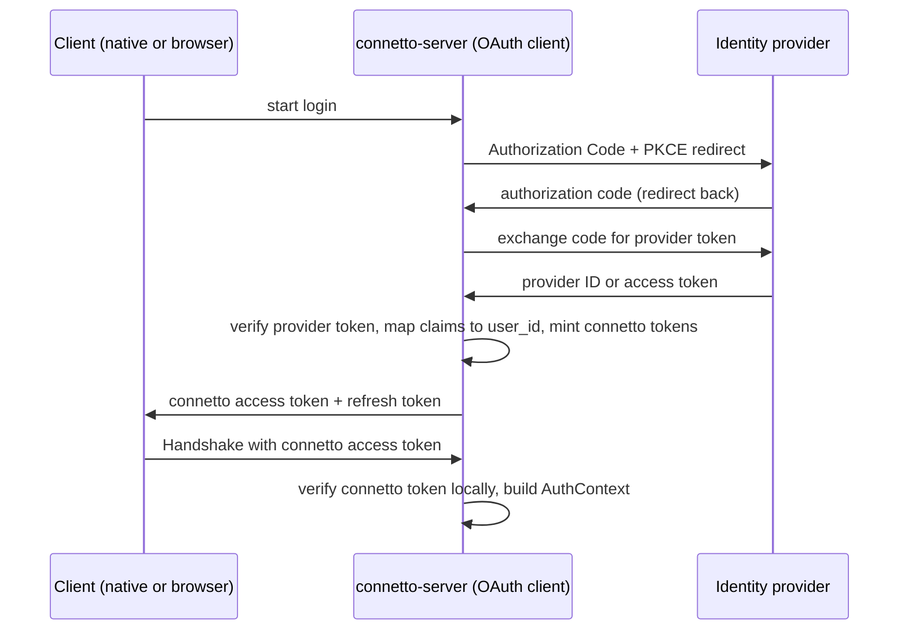

# 11: Authentication

**Status**: draft

---

## Purpose

Define how a caller proves who it is, end to end, from the moment a user logs in to the moment the server binds a verified identity onto a session. This chapter is about authentication only, proving identity. Authorization, deciding which rows an identity may read or write, is a separate concern that already has its own chapter (`08-authorization.md`) and is not redesigned here.

The single fact that connects the two chapters: authentication produces the session `AuthContext`, and the authorization layer and PostgreSQL RLS consume it. `RlsAuth`, the write path, and the snapshot path all run `SELECT set_config('app.user_id', $1, true)` binding `auth_ctx.user_id`, so whatever this chapter resolves as the identity becomes the RLS principal directly. That is why authentication is load-bearing for security and why the current gap is a real hole rather than a missing feature.

---

## The gap this closes

The wire and the types already anticipate a verified identity, but nothing verifies it. `Handshake` carries an `auth_token`, `AuthContext` is documented as established from that token, and yet `run_handshake` in `crates/connetto-server/src/session.rs` (around line 771) does `let auth_ctx = AuthContext::new(handshake.client_id.clone())` and ignores `auth_token` entirely. The client id is attacker-chosen, so today any client can assume any identity, and because that string flows straight into `app.user_id`, RLS then trusts it. Closing this means the server must derive the identity from a credential it can cryptographically trust, never from a client-supplied string.

---

## The authN and authZ boundary

Authentication answers "who is this caller." Its output is an `AuthContext { user_id, tenant_id, roles, claims }`. Authorization answers "may this caller see or write this row," and it reads that `AuthContext`. This chapter defines the first and stops at the boundary. It does not touch RLS mirroring, per-row checks, OpenFGA, or `rls2fga`, all of which live in `08-authorization.md`. The only obligation this chapter carries across the boundary is that `user_id` be trustworthy and stable, because a weak or spoofable mapping reintroduces the current hole one layer up.

---

## Principles

1. **Identity is derived from a credential the server can verify, never from a client-supplied string.** The client id stays a logging and correlation label only.
2. **connetto is the OAuth client, not the browser or the native app.** The backend runs the OAuth flow and mints its own session credential. Provider tokens never reach the frontend.
3. **Authentication gates sync, never local reads.** The local replica is readable and writable offline with no valid credential. Only the server connection requires authentication.
4. **Token expiry while offline is a designed state, not an error.** The app keeps working locally, and re-authentication resumes sync.
5. **Asymmetric algorithms only, with issuer and audience pinned.** The `none` algorithm is rejected, and a symmetric algorithm verified with a public key is rejected. Issuer and audience are always checked.
6. **The verification seam is pluggable and mirrors `AuthPolicy`.** A trait with a real implementation and a permissive stand-in, so tests and local loops need no live identity provider.

---

## Architecture: Backend-For-Frontend

connetto uses the Backend-For-Frontend (BFF) topology. connetto-server is registered with each identity provider as a confidential OAuth client and holds the provider client secret. The frontend, native or browser, is not an OAuth client at all.

The token shape at the identity provider follows OAuth 2.0 Authorization Code with PKCE. Both OIDC ID tokens and JWT access tokens are accepted at the provider boundary, because a single-audience first-party deployment can pin the issuer and audience for either, and some providers (Google, for one) issue opaque access tokens whose only verifiable signed artifact is the ID token. That choice lives entirely inside each provider configuration and never reaches the client.

The login flow:



connetto verifies the provider token at the login callback, maps its claims to a `user_id`, and mints its own tokens. It retains the provider token in the auth store rather than discarding it, because the store that holds a user's identity also holds that user's provider tokens, so an application that configured the right scopes on the provider can read a fresh token back through the lazy accessor (see below) and call the provider's own APIs such as a calendar. What the client carries afterward is a connetto-minted credential, and what the server verifies on every handshake is a token it signed itself. Provider verification runs once per login, not per connection.

This topology is the current recommended shape for browser applications precisely because the provider tokens never touch frontend JavaScript, which removes the cross-site-scripting exfiltration surface that storing tokens in the page creates. It also fits connetto, which already runs a session subsystem (subql subscription state is session-scoped) and already mints its own short-lived signed tokens (the file access token in `08-authorization.md`), so the session-issuance machinery is largely already present rather than new.

---

## Identity resolution

### Providers

One struct implements an `IdentityProvider` trait per identity provider (Google, Microsoft, Apple, a generic OIDC fallback, and others added over time). Each provider struct carries its own confidential-client configuration (client id, client secret, issuer, expected audience, tenant where relevant, and the OAuth scopes to request) and knows how to recognize and verify its own token shape. Providers differ in ways that justify per-provider code: Microsoft embeds the tenant in the issuer URL and ends it in `/v2.0`, so exact-string issuer matching is insufficient, whereas Google emits a fixed issuer. Provider structs quarantine that knowledge.

The enabled providers are held in a runtime collection indexed by issuer. A token names its issuer, so routing is an index lookup, with a matcher fallback for a provider that deliberately accepts a pattern of issuers such as any-tenant Microsoft. Routing on the unverified issuer only selects a provider, and nothing in the token is trusted until the selected provider has cryptographically verified the signature and re-confirmed the issuer and audience it expects. There is no blessed default provider. A deployment composes the set it enables. A typed tuple was considered and rejected: routing is a runtime match either way and every provider yields the same `AuthContext`, so a static tuple would add type machinery for no functional or performance gain over a boxed collection.

### Identity mapping and the auth store

The globally unique identifier for a user is the pair of the issuer claim and the subject claim, per OpenID Connect Core section 5.7, which states that the subject alone is only locally unique within the issuer and that the combination of issuer and subject is the only guaranteed unique identifier. Human-readable fields (email, phone, username) are never used as identity, because they change and are reused.

The identity mapping, connetto's own sessions and refresh tokens, and the user's retained provider tokens all live in one pluggable store, and connetto ships two implementations. The choice is not only where this state lives, it is also the deployment topology, because a store that is not shared cannot back more than one server.

1. **In-memory store.** Holds the state in the server process. Identity is resolved by a deterministic mapping from `(iss, sub)` with no lookup, for example a name-based (version 5) UUID over issuer and subject. Revocation and the handshake liveness check are instant local operations. This variant is single-server by nature, because in-memory state is not shared, and it is ephemeral, because a restart drops the sessions and tokens and forces clients to log in again. It suits development and simple single-server deployments.
2. **Database store.** `DbAuthStore<S>` is generic over a `ConnettoStoreSchema` trait that carries the deployment's `sessions` and `provider_tokens` tables, their columns, and the typed distributed `Id` type, plus a handful of opaque pre-built statements (the `FOR UPDATE` rotate read and the two UPDATEs, which the diesel trait solver cannot name generically). connetto keeps every query and security decision (rotation, reuse-is-theft, liveness, deadline capping) and emits no schema. Identity is resolved by a deployment-supplied `IdentityResolver` that maps the verified claims to a typed `user_id` in the deployment's own users table (creating or linking the row so the `sessions.user_id` foreign-key target exists), which lets one human hold several linked logins and gives the deployment full ownership of its ids. The sessions row stores the typed `user_id` in its own column plus one opaque `attrs` JSONB blob holding the rest of the `AuthContext` (tenant, roles, claims) with no `user_id` duplicated. It is durable across restart and is the only variant that supports a mesh, where its rows replicate like any other. The resolver runs against the same Postgres as the store.

Retained provider tokens live in whichever store, and connetto exposes a lazy refreshing accessor that returns a currently-valid provider access token, refreshing inline against the provider when the stored one has expired, persisting the rotated refresh token in the same store transaction, and serializing concurrent callers on that token row so two of them cannot double-refresh and trip the provider's rotation-reuse defense. connetto runs no background refresh job, a token is refreshed only when it is about to be used, which is fewer provider requests and avoids a mesh-wide scheduler.

Mapping runs once, at the login callback, when connetto mints the session, not on the handshake hot path. Account linking (attaching a second provider identity to an existing user) uses the standard safe procedure: the user must be authenticated on both accounts at link time, and identities are never linked on a shared email address alone.

### Migrations: the tables are the deployment's

connetto emits zero server DDL. The tables below are the deployment's to create and migrate, and `ConnettoStoreSchema` is the real contract, implementable by hand against whatever tables (and column names, extra columns, foreign keys, or indexes) the deployment wants. The `connetto_auth_tables!(Id, IdSqlType)` macro is a convenience default only: it expands to these `diesel::table!` blocks and a `ConnettoStoreSchema` impl for the default shape, parameterized by the developer's `Id` type and its diesel SQL type. A deployment that wants a different shape skips the macro and implements the trait.

The `user_id` type is a placeholder the deployment fills for its `Id` (for example `BYTEA` for a `uuid`, or `TEXT` for a string id as the reference binary uses). The reference SQL:

```sql
CREATE TABLE connetto_sessions (
    session_id           TEXT PRIMARY KEY,
    user_id              <IdSqlType> NOT NULL REFERENCES your_users (id),
    attrs                JSONB NOT NULL,
    current_refresh_hash BYTEA NOT NULL,
    idle_deadline_ms     BIGINT NOT NULL,
    absolute_deadline_ms BIGINT NOT NULL,
    revoked              BOOLEAN NOT NULL DEFAULT FALSE
);

CREATE TABLE connetto_provider_tokens (
    session_id    TEXT PRIMARY KEY REFERENCES connetto_sessions (session_id) ON DELETE CASCADE,
    issuer        TEXT NOT NULL,
    access_token  TEXT NOT NULL,
    refresh_token TEXT,
    expires_at_ms BIGINT
);

CREATE TABLE _connetto_mutations (
    user_id    <IdSqlType> NOT NULL REFERENCES your_users (id),
    session_id TEXT NOT NULL REFERENCES connetto_sessions (session_id) ON DELETE CASCADE,
    last_seq   BIGINT NOT NULL,
    PRIMARY KEY (user_id, session_id)
);
```

`session_id` is connetto-minted and connetto-owned (a `String` today, see the roadmap for making it a `Copy` uuid). `user_id` foreign-keys the deployment's own users table, the row the `IdentityResolver` produced. The `_connetto_mutations` table is the durable exactly-once watermark: the server keys it on `(user_id, session_id)` from the verified access token (never the client-fabricated `client_id`), so a worker restart or leader failover reusing the same session does not replay already-committed mutations. Its `ConnettoWatermarkSchema` impl and `diesel::table!` come from the `connetto_watermark_table!(Id, IdSqlType)` convenience macro, the watermark counterpart to `connetto_auth_tables!`; a deployment with a different shape implements the trait by hand. Row cleanup (deleting revoked and absolute-expired sessions) is the deployment's, since it owns the tables; a recommended cleanup is a periodic `DELETE FROM connetto_sessions WHERE revoked OR absolute_deadline_ms < <now_ms>`.

### Multi-factor assurance

OIDC standardizes assurance signaling. A deployment can require step-up authentication with the `acr_values` and `max_age` request parameters and verify what the login actually reached through the `amr` (methods used) and `acr` (assurance level) claims. connetto's provider configuration exposes an assurance requirement, and the login callback rejects a provider token whose `amr` or `acr` does not meet the configured bar. This makes "force MFA" a deployment setting rather than bespoke code.

---

## Server verification seam

Two seams, both mirroring the `AuthPolicy` pattern of a trait plus a permissive stand-in.

At the login callback, the `IdentityProvider` registry verifies the provider token and the mapper resolves the identity. A `PermissiveProvider` stand-in accepts a configured identity for tests and local loops so no live provider is needed.

At the handshake, a `SessionVerifier` trait turns connetto's own access token into an `AuthContext`. It verifies the token's signature and expiry, which needs no store because the signature is self-contained, and it checks that the session is still live in the auth store, which is what makes revocation authoritative rather than bounded by the token's remaining lifetime. It is held as a runtime trait-object field on the server rather than as a generic type parameter, because verification fires once per connection and is off any hot path, so static dispatch buys nothing, and a trait object keeps the server's public type signature stable no matter how a deployment configures identity. This differs deliberately from `AuthPolicy`, which stays a generic because it fires per row on the CDC hot path where monomorphization pays. A `TrustingSessionVerifier` stand-in reproduces today's trust-the-client-id behavior for tests, under an honest name that makes clear it must not front production.

The concrete edit at `run_handshake`: replace `let auth_ctx = AuthContext::new(handshake.client_id.clone())` with a call to the session verifier over `handshake.auth_token`, and on failure send a `FatalError` and terminate before any subscription or catchup work.

---

## connetto session credential

connetto mints two tokens at login.

The **access token** is short-lived and asymmetrically signed. It carries the identity (`user_id`, `tenant_id`, `roles`, `claims`), so the handshake trusts the identity from the signature alone with no store round-trip, and separately checks that the session is still live so a revoked session is refused even while the token is time-valid. It is verified once at handshake, so a healthy long-lived connection is not dropped when the token expires mid-session. It is the value carried in `Handshake.auth_token`, which needs no wire change. The lifetime is short by default and server-configurable, and it is a re-auth cadence, not the revocation bound.

The **refresh token** is longer-lived and stored server-side in a PostgreSQL table (diesel typed queries, not a separate store such as Redis, because the data is low-volume, read once per connection, and connetto is already PostgreSQL-centric). It rotates on every use: each refresh mints a new refresh token and invalidates the old, and a reuse of an invalidated token is treated as theft.

Revocation invalidates the session in the store, and because the handshake checks session liveness, a revoked session is refused on the next connection even while its access token is still time-valid, and a live connection is dropped by the node holding it as soon as that node sees the invalidation. Revocation is therefore authoritative rather than bounded by the access-token lifetime. Its reach is instant in the in-memory and single-server cases and propagates at replication speed across a mesh, following the store variant above.

The refresh-token and local-session lifetime is server-side configuration owned by the application layer, with a sane default. It is set at the mint seam, so a deployment that wants per-user or per-device variation computes it there without any protocol involvement. It is never requested by the client and never appears on the wire. The recommended default shape is a sliding window (each successful online refresh extends it) under an absolute ceiling (a hard maximum regardless of use).

The existing server-issued `session_token` field on the handshake stays distinct from the auth credential. The identity credential is the signed `auth_token`, and `session_token` remains the resume key for the operational session state that subql already tracks (subscriptions, cursors, pending patches). They do different jobs and are not the same value.

---

## Client acquisition

### Native

The native client uses Authorization Code with PKCE against connetto-server's login endpoint over a loopback redirect (a listener on `127.0.0.1`) and the system browser. connetto's refresh token is stored in OS secure storage (Keychain, Windows Credential Manager, libsecret). The access token lives in process memory and is regenerated from the refresh token as needed.

### Browser and worker topology

The browser topology from `09-wasm.md` forces custody. The dedicated DB worker owns the single server connection and is the only context with OPFS access, but a worker cannot navigate, so interactive login must happen in a tab. connetto's tokens are held by the worker, never retained by the page.

Login is a redirect (or a popup carrying the redirect, to avoid tearing down the leader tab and its worker) to connetto-server's login endpoint. connetto-server runs the whole OAuth flow server-side and returns connetto's own tokens to the worker. The browser is not an OAuth client, so it runs no PKCE and holds no provider token. The access token lives in worker memory and is attached to the handshake. The refresh token persists worker-only in OPFS so a cold start or a leader failover silently refreshes and resumes with no user interaction.

The enforced invariant that makes worker custody a real boundary: the worker's message protocol has no path that ever emits either token back to a tab. Page cross-site-scripting, while resident, can drive the app as the user, which is unavoidable for any in-page attacker, but it cannot read the durable credential to use it off-device or after the tab closes. Worker custody bounds the blast radius to the live session rather than a portable, persistent account takeover.

Because connetto is the OAuth client (BFF), no OAuth or OIDC crate needs to cross-compile to `wasm32-unknown-unknown` at all, and BFF is the only sanctioned model, so client-side OAuth and client-side ID-token verification do not arise. The dependency verification below stands as evidence that the client-as-OAuth-client alternative is buildable in the browser, not as a supported path.

---

## Offline-first and token expiry

Local reads and writes never depend on a valid credential. There are two distinct paused-sync states that behave identically for local work: offline (no network) and unauthenticated (network present, no valid credential). In both, the replica is fully usable and mutations queue in `_connetto_pending`.

On reconnect, the client refreshes before the handshake: it presents connetto's refresh token to connetto-server's refresh endpoint and obtains a fresh access token, then proceeds into the existing catchup or resync cases of `06-reconnect.md`, and pending mutations replay through the exactly-once machinery. This is the common case and is invisible to the user, because the short-lived access token is almost always stale after any real offline gap while the refresh token is still good.

The refresh-token lifetime defines the local session lifetime and therefore the replica lifetime. Access-token expiry is invisible and silently refreshed and never touches the replica lifecycle. When the refresh token is gone, the local session is over. Logout and refresh-token expiry are the same event, sharing one teardown path: surface any unsynced pending mutations, then purge the identity's replica, and require a fresh interactive login, which rebuilds the replica through the full-resync-from-template path that `06-reconnect.md` already defines.

Resuming a replica requires the same identity. If a re-authentication yields a different `user_id`, that is account switching, and the new identity gets its own fresh replica and does not adopt the previous identity's data or upload its pending mutations, because attributing one user's writes to another both misattributes data and violates the RLS boundary. Account linking is what lets the same human re-authenticate through a different provider and still resolve to the same `user_id`, so a provider switch resumes rather than being seen as a different account.

The one honest data-loss edge: a device that stays continuously offline past its entire session length ends the session with unsynced mutations still queued. This is handled by making it loud, a proactive warning as the session nears expiry when unsynced changes exist, and a purge that blocks on unsynced data rather than discarding it silently.

---

## Protocol impact

One wire addition. `FatalErrorReason` gains an `AuthenticationFailed` variant so the client can distinguish a rejected credential from every other fatal condition and route to re-login rather than a generic reconnect (cross-reference `02-protocol.md`). The client refreshes before connecting, so reaching this variant means even a freshly minted access token was rejected, which is genuinely fatal for that attempt. `Handshake.auth_token` already exists and carries connetto's access token, so no other wire change is required.

---

## Deployment shape

**Multi-provider and multi-tenant.** Configuration is the set of per-provider structs, each with its confidential-client settings, issuer, audience, tenant, and assurance bar. A deployment points connetto at its identity providers by composing that set.

**The PostgreSQL mesh.** A mesh is an optional multi-server deployment where each connetto-server has its own PostgreSQL kept in sync by replication (the oplog is already replicated across it per `06-reconnect.md`). Only the database store variant can back a mesh, because the in-memory store is not shared. The access token's authenticity is checked locally with connetto's public key, which is not a secret, so no secret is shared across nodes. Session liveness and revocation are read from the store, so across a mesh they take effect on a peer node as soon as the store rows replicate, on the same replication that already carries the oplog. A single-server deployment, in-memory or database, needs none of this and revokes with a local lookup.

**Revocation.** Revocation invalidates the session, and the handshake liveness check makes it authoritative: a revoked session is refused even with a time-valid access token, and a live connection is dropped when its node sees the invalidation. The reach is a local instant operation on a single server and propagates at replication speed across a mesh. The access-token lifetime is a re-auth cadence, not the revocation bound, and a deployment needing tighter reach shortens it. connetto adds no separate revocation channel.

**Audit.** Authentication events (login success and failure, token issuance, revocation) reuse the `auth_events` table from `08-authorization.md`, with structured logging for the high-volume path, no new mechanism.

---

## Dependency evaluation

Every capability and cost cell below is either verified against crate source at the stated version or explicitly marked unverified. Verified cells for `oauth2` and `openidconnect` come from reading their source and CI configuration.

| Crate | Version | Role | wasm32-unknown-unknown | HTTP transport | Crypto | Notes |
|---|---|---|---|---|---|---|
| `oauth2` | 5.0.0 (2025-01-21) | OAuth flow primitives (PKCE, authorize URL, token exchange and refresh) | Verified: CI runs `cargo check --target wasm32-unknown-unknown`. `getrandom` auto-enabled with `js` on wasm32 by the crate | Verified: fully decoupled via `AsyncHttpClient`/`SyncHttpClient` traits blanket-implemented for closures, and `default-features = false` strips all networking crates | Verified: PKCE S256 via `sha2` (RustCrypto), randomness via `rand` and `getrandom` | Actively developed. The `curl` feature is a hard `compile_error!` on wasm32, avoid it |
| `openidconnect` | 4.0.1 (2025) | OIDC discovery, JWKS, ID-token verification | Verified: CI runs `cargo check --target wasm32-unknown-unknown` (check, not full build) | Verified: same decoupled traits, custom client for discovery, JWKS, token, userinfo | Verified: pure-Rust RustCrypto (`rsa`, `p256`, `p384`, `ed25519-dalek`, `hmac`, `sha2`). No `ring` on the verification path | Built on `oauth2` 5. Carries RUSTSEC-2023-0071 (a Marvin timing side channel in `rsa`), a constant-time weakness not a build blocker, unaffecting the EC and EdDSA paths |
| `reqwest` | 0.12 | HTTP client for the backend, and the browser fetch backend under the client-as-OAuth-client alternative | Reported by research: gates native TLS and socket deps behind `cfg(not(target_arch = "wasm32"))` and uses the browser Fetch API on wasm32 | native async client fitting tokio | delegates TLS | Fits the existing tokio and diesel-async stack on the backend |
| `jsonwebtoken` | unverified | Lighter alternative for verifying connetto's own signed tokens without the full OIDC stack | unverified | not applicable (local verification) | unverified (commonly `ring`-backed, which the implementation session must confirm for the backend) | Candidate only. `openidconnect` already covers provider verification, and connetto's own token verification could use a lighter crate, to be confirmed against source before selection |
| `keyring` | unverified | Native OS secure storage for the refresh token | not applicable (native only) | not applicable | delegates to OS keystore | Candidate for the native client. Platform coverage and API to be verified against source before selection |

Under BFF, the load-bearing dependency is `openidconnect` on the backend (native), where wasm is irrelevant and the pure-Rust crypto and tokio-friendly decoupled HTTP both fit. The wasm verification of `oauth2` and `openidconnect` stands as proof that the client-as-OAuth-client alternative was viable, but the BFF choice means the browser links neither.

---

## Upstream and fork work

None warranted. The handoff pre-registered wasm cross-compilation of an OIDC or OAuth crate as the primary risk and the most likely place a fork would be needed. Source verification of `oauth2` 5.0.0 and `openidconnect` 4.0.1 shows both are CI-tested for `wasm32-unknown-unknown`, decouple HTTP so a browser fetch closure drives every request, and verify signatures with pure-Rust crypto rather than `ring`. Independently, the BFF architecture keeps every OAuth crate on the backend, so the wasm path is not even exercised. There is therefore no upstream or fork proposal to make. Should a future deployment insist on the client-as-OAuth-client model, the verified findings above show it is buildable with the stock crates and still needs no fork.

---

## Phased implementation plan

This is a plan for a later session. No code is written in this chapter.

1. **Core seams.** Add the `SessionVerifier` trait and `AuthContext` construction path in `connetto-core`, a `TrustingSessionVerifier` stand-in, and the `FatalErrorReason::AuthenticationFailed` variant. Wire the verifier into `run_handshake` behind the trait-object field, replacing the trust-the-client-id line. This alone closes the spoofing hole for any deployment that supplies a real verifier, with tests using the stand-in.
2. **Session authority and the auth store.** Implement the in-memory and database store variants, connetto token minting and verification (asymmetric signing, a handshake that checks signature and expiry plus session liveness, access plus rotating refresh), and the server-side lifetime configuration. Add the login and refresh endpoints.
3. **Provider verification and token retention.** Implement the `IdentityProvider` trait and registry on the backend using `openidconnect`, the deterministic and linking-table identity mappings, per-provider scopes, the MFA assurance check, and the lazy refreshing accessor for retained provider tokens. Add the first concrete provider (a generic OIDC provider), then Google and Microsoft.
4. **Native client acquisition.** Loopback redirect, system browser, OS secure storage for the refresh token, silent refresh on reconnect.
5. **Browser client acquisition.** Login redirect or popup to the backend, worker-only token custody, OPFS persistence of the refresh token, silent resume on cold start and leader failover, and the message-protocol invariant that tokens never leave the worker.
6. **Offline and teardown.** The re-auth-on-reconnect path, the shared logout and expiry teardown with replica purge, identity-continuity enforcement, and the unsynced-data warning and purge block.

---

## Open Questions

See `open-questions.md` section 11, where Q11.1 through Q11.4 are resolved: conservative overridable lifetime defaults with numbers deferred to implementation, provider tokens retained in the store and reused through a lazy accessor with no background job, BFF as the only sanctioned model, and revocation made authoritative by the handshake liveness check, propagating at store speed.

---

## Decisions

- **Backend-For-Frontend, and it is the only sanctioned model.** connetto-server is the OAuth client, provider tokens never reach the frontend, and connetto mints and verifies its own session credential. The client-as-OAuth-client alternative is documented as buildable but not supported.
- **One pluggable auth store, two variants.** An in-memory store (single-server, ephemeral) and a database store (`DbAuthStore<S>` generic over a `ConnettoStoreSchema` trait, durable, mesh-capable, connetto emitting no schema). The store holds connetto's sessions and refresh tokens and the user's retained provider tokens. Identity resolves through an `IdentityResolver`: a deterministic `(iss, sub)` to UUID v5 mapping by default (the in-memory store), or the deployment's own users-table mapping (creating or linking rows) in the database case, the latter supporting account linking.
- **Runtime provider registry, indexed by issuer**, with per-provider structs (client credentials, issuer, audience, tenant, scopes, assurance bar) added over time and no blessed default.
- **Signed access token plus stored rotating refresh token.** The handshake checks the signature and expiry locally and checks session liveness in the store, so revocation is authoritative. Refresh and revocation live in the store.
- **Provider tokens are retained in the store and reused through a lazy refreshing accessor**, with no background refresh job. An application calls provider APIs with the scopes it configured.
- **Token lifetimes are server-side application configuration with conservative overridable defaults.** The architecture prescribes the shape (short access token, sliding refresh window under an absolute ceiling) and defers exact numbers to implementation.
- **Authentication gates sync, never local reads.** Refresh-token lifetime defines replica lifetime. Logout and expiry share one teardown. Resume requires the same identity.
- **Revocation is authoritative and propagates at store speed**, local and instant on a single server and at replication lag across a mesh, with no separate revocation channel.
- **One wire addition**, `FatalErrorReason::AuthenticationFailed`. `Handshake.auth_token` is otherwise unchanged.
- **No upstream or fork work**, verified against `oauth2` 5.0.0 and `openidconnect` 4.0.1 source.

---

## Notes

- The verifier seam mirrors `AuthPolicy` deliberately, so authentication and authorization share one pluggability idiom (a trait, a real implementation, a permissive stand-in) even though authentication is resolved once per connection and authorization fires per row.
- The two store variants are not only a storage-location choice, they are the single-server-ephemeral versus durable-and-mesh-capable choice, and the deterministic-mapping versus account-linking choice. A single-provider or simple deployment uses the in-memory store and deterministic mapping. The moment one human may hold several logins, or the deployment needs durability or a mesh, the database store is required, which is why both ship.
- Putting connetto on the OAuth-client side is what makes the browser story simple. Every hard part (secrets, provider verification, token minting, JWKS handling) lives on the backend where it is trivial, and the frontend holds only a credential connetto can revoke by deleting a row.
