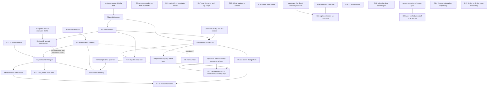

# Master implementation plan: identity, session, capability, and the change path

This programme closes a security defect in how connetto decides who a caller is, then moves the change path off Postgres RLS onto an authorization service that can answer about a row as it was rather than only as it is now. Nothing in it is implemented.

## How to read this

**Normative here:** phase definitions, their order, their blockers, their steps, and what proves each one done. Nothing outside this document defines a phase.

**Normative elsewhere,** and this plan defers to it: `docs/architecture/12-identity-session-capability.md` for the identity model and the recorded decisions, `docs/architecture/08-authorization.md` for the authorization path, and the two `docs/upstream-*.md` documents for what the upstream crates must expose. Where this plan disagrees with those about a **decision**, they are right. Where they disagree with this plan about a **phase or a blocker**, this plan is right.

**Phase identifiers are names, not positions.** They read like an order and are not one. Roughly 280 references point at them from the architecture chapters, so an identifier is never reissued or renumbered. Execution order is the Sequence table below, and that is the only order that matters.

**Citations name a file and a symbol, not a line number.** Line numbers rot silently and several in this repository already had. Where a symbol does not exist, a line range is given and should be read as a hint rather than a fact.

**Every phase has the same shape:** Status, Purpose, Blocked on, Steps, Done when, and where the ordering or the necessity is counterintuitive, Why. A phase is done when its Done when clause is demonstrated, never when it merely compiles.

**The last section holds exploratory phases.** Those are not committed work, each may conclude it should not be built, and deleting one after its investigation changes nothing else. Every phase before that section is committed.

**Record deviations in place, with the reason.** A plan that silently diverges from what was built is worse than no plan, because the next session trusts it.

## Step zero, before any phase

**The working tree has 62 modified source files plus one untracked test**, which are the E6 step-one work. It is green.

**Reset it, salvaging `crates/connetto-server/tests/rls_read_filter.rs` only. This is the first action of the code session**, taken with the maintainer present, and after writing the diff somewhere outside the repository.

The decision rests on what the 62 files actually contain, which is not 62 substantive changes:

| Category | Extent | Fate |
|---|---|---|
| `auth_token: String` becomes `credential: Credential::Token(..)` in test and demo configs | roughly 40 files, one or two lines each | **Redone.** R3 replaces `credential` with a grant list, so every one of these lines changes again |
| `AuthContext` becomes `Principal` in `SnapshotSource` signatures | a handful of files | **Survives in shape**, but it is a mechanical sweep R3 performs anyway |
| The `Credential` enum itself, and `PROTOCOL_VERSION` at 2 | `messages/handshake.rs`, `version.rs` | **Redone.** R3 replaces the enum, and R2 and R3 bump the version again |
| Refusing an anonymous **connection**, and its stated reason | the `Credential::Anonymous` arm inside `SessionManager::run_handshake` and the `SessionConfig::allow_anonymous` doc, both in `crates/connetto-server/src/session.rs` | **Wrong.** Decision 7 says an unidentified caller writes when a capability authorizes it, and R2 removes the watermark constraint the refusal cites |
| `tests/anonymous.rs`, asserting that refusal | untracked, new | **Wrong, and worse than absent**, because it is green and therefore defends the rule |
| `tests/rls_read_filter.rs` | 84 lines, new | **Salvage.** The only file with content rather than churn |

So the tree is not a head start. It is a rename R3 redoes, plus one useful test, plus a rule we have decided against with a passing test defending it.

**Before resetting, preserve a recovery path**: write the full diff to a file outside the repository, since 62 green files are being discarded. Then reset, keep the salvaged test aside, and let R2 and R3 reintroduce the `Principal` signature change deliberately rather than inheriting it.

**R3 supersedes the central type.** `Credential::{Anonymous, Token}` cannot express a grant that authorizes without identifying, and a caller must be able to present several. The vocabulary survives, the shape does not.

## The gate

There is no CI and no task runner in this repository, so the gate is manual and must be run in full. Five workspaces, each with its own lockfile: the root, `crates/connetto-web`, and the three demos plus `examples/wasm-smoke`.

Root workspace:

```
cargo +stable fmt --all -- --check
cargo +nightly clippy --all-targets --all-features -- -D warnings
cargo +stable test --release --all-features
RUSTDOCFLAGS="-D warnings" cargo +stable doc --no-deps --all-features
```

From `crates/connetto-web`: the fmt check, clippy for `wasm32-unknown-unknown`, a `wasm32` build, and `wasm-pack test --headless --chrome` for the browser suites.

Toolchain rule, and it is load-bearing: **`cargo +stable` for every build and test, `cargo +nightly` only for clippy.** Nightly has been observed to ICE on tokio in release. There is no `rust-toolchain.toml`, so the plus-selector is the only thing enforcing this.

Tests run `--release`. Debug builds of these workloads are one to two orders of magnitude slower and a full debug run is a session-eating trap. Use debug only when targeting overflow checks, `debug_assert!` bodies, or a bug that only appears unoptimized, and say so when you do.

Docker-gated Postgres tests and headless Chrome may both be run freely.

## Sequence

Execution order. The early steps depend on nothing outside this repository and can begin immediately, and the two upstream changes proceed in parallel with them, which is what keeps them off the critical path.

**A repeated step number means those phases may run in parallel**, not that the numbering is wrong. `any` means the phase is off the critical path and lands whenever it is wanted.

| Step | Phase | Why it sits here |
|---|---|---|
| 1 | R1 | Closes the defect the programme exists for, and blocked on nothing |
| 2 | R0 part A, the connetto-only counters | Cheap, and it prices the dispatch loop before R5b changes what dominates it |
| 2 | ~~R16 part A, the fan-out research~~ **DONE** | Blocked on nothing and needed no code, so it ran alongside everything early |
| 3 | R2 | Gives the session layer a durable identity, which R3 consumes |
| 4 | R8 | Independent surface cleanup, apart from one item wanting R2's registry |
| 5 | R12 | Prerequisite for R3, because R3 makes a refusal silent on the wire |
| 6 | R3 | Needs R2 and R12 |
| 7 | R4 | Needs R3 |
| 8 | R13 | Needs R3. Off the critical path, so it may slip later without blocking anything |
| 8 | R22 | Blocked on nothing, and it should land before R19 because it shrinks what throttling must defend against |
| 9 | R19 | Needs R2 for the session handle it counts against, and R3 so the anonymous tier is representable |
| 10 | R5a | Waits on the subql trait landing upstream |
| 11 | R0 part B, the full measurement | Needs R5a's seam to measure through |
| 12 | R5b | Needs R5a, R0, and the rls2fga per-row mapping |
| 13 | R16 part B, the fan-out architecture | Needs R0's numbers, and part A's findings which it has. **The bulk frame decision alone must be settled before step 6 ships**, because R3 carries the `PROTOCOL_VERSION` bump and a second bump is a second flag day |
| 14 | R14 | Needs R0's data and R5b. **Conditional**: dropped if R0 shows the dispatch loop is not the ceiling |
| 15 | R6 | Needs R5b, and hard-blocked rather than cost-blocked |
| 16 | R7 | Needs R4 and R6 |
| 17 | R9 | Needs R5b |
| 18 | R27 | Needs R6 for the incremental move-in and move-out, and R22 because the filter is compiled and compilation needs the query set known in advance. Buildable before R6 only in a form that resyncs on every dependency change |
| any | R28 | A defect, blocked on nothing. Silent data loss on every fresh subscription, so it outranks everything discretionary |
| any | R29 | A defect plus its missing mechanism, blocked on nothing. Two subscriptions over one table lose each other's rows today, and R15 cannot be built without what this delivers |
| any | R23 | Blocked on a measurement, not on code. `docs/webauthn-prf-probe-spec.md` specifies it, and a negative on its central question reshapes the phase |
| any | R26 | Blocked on nothing. Carries a portability obligation and the durability story for device-private data |
| any | R21 | Blocked on nothing. Removes a compatibility risk that surfaces on user devices rather than in tests |
| any | R20 | A defect, blocked on nothing. Offline operation is a project objective and boot currently violates it |
| any | R17 | A defect, blocked on nothing. Land it whenever, and before anything else relies on the local tier |
| any | R18 | Blocked on nothing here. A configuration and documentation pass over the SQLite hardening surface |
| any | R11 | Off the critical path and blocked on nothing, so it lands whenever it is wanted |
| any | R15 | Off the critical path. Gated on five upstream diesel proposals landing |
| last | R24 | Exploratory. How connetto integrates a file-sync stack it does not own |
| last | R25 | Exploratory, and not now. Device-to-device sync with no server |

## Status and blockers

**The one normative record** of where the programme stands and what gates each phase. Every other statement of a blocker in this document, including each phase's own Blocked on line, restates this table and must agree with it.

| Phase | Status | Blocked on | Upstream needed |
|---|---|---|---|
| R1 security defaults | NOT STARTED | nothing | no |
| R0 part A, connetto-only counters | NOT STARTED | nothing | no |
| R2 durable session identity | NOT STARTED | nothing | no |
| R8 inert surface | NOT STARTED | nothing, apart from one item on R2 | no |
| R12 structured logging | NOT STARTED | nothing | no |
| R3 grants and `Principal` | NOT STARTED | R2 and R12 | no |
| R4 capabilities | NOT STARTED | R3 | no |
| R13 `auth_events` audit table | NOT STARTED | R3 | no |
| R22 compile-time query set | NOT STARTED | nothing | no |
| R19 request throttling | NOT STARTED | R2 and R3 | no |
| R5a visibility seam | NOT STARTED | a small subql change | **yes, subql** |
| R0 part B, full measurement | NOT STARTED | R5a | yes, via R5a |
| R5b service as executor | NOT STARTED | R5a, R0, rls2fga | **yes, rls2fga** |
| R16 part A, fan-out research | **DONE** | nothing | no |
| R16 part B, fan-out architecture | NOT STARTED | R0, and R3 for the wire question only | no |
| R14 dispatch-loop cost | NOT STARTED | R0 and R5b, conditional on R0's data | no |
| R6 two-check form | NOT STARTED | R5b | inherited |
| R7 revocation teardown | NOT STARTED | R4 and R6 | inherited |
| R9 permissive policy out of tests | NOT STARTED | R5b | inherited |
| R23 user-verified unlock of local secrets | NOT STARTED | a measurement, see `docs/webauthn-prf-probe-spec.md` | no |
| R26 local data export | NOT STARTED | nothing | no |
| R27 membership term in the subscription language | NOT STARTED | R5b, R6, R22, and a subql change | **yes, subql** |
| R28 subscribe-time delivery gap | NOT STARTED | nothing | no |
| R29 client-side coverage | NOT STARTED | nothing | no |
| R21 one page codec on both backends | NOT STARTED | nothing | no |
| R20 start with no reachable server | NOT STARTED | nothing | no |
| R17 local tier name and key scope | NOT STARTED | nothing | no |
| R18 SQLite hardening surface | NOT STARTED | nothing here, `diesel-rs/diesel#5128` for unpinned diesel | no |
| R11 shared public store | NOT STARTED | nothing | no |
| R15 replica retention and trimming | NOT STARTED | R29, and five diesel proposals landing | **yes, diesel** |
| R24 file-sync integration | NOT STARTED, exploratory | nothing | reads a separate stack |
| R25 device-to-device sync | NOT STARTED, exploratory | nothing | no |

## Dependency graph

A rendering of the table above, for reading rather than for deciding. **If the two disagree, the table is right and this diagram is stale.**



## Upstream dependencies

Two documents, both untracked and never to be committed.

**`docs/upstream-rls2fga-per-row-records.md`** blocks R5b, and therefore R6, R7 and R9. Self-contained and self-testable inside rls2fga: emit the per-row description beside the existing SQL, ship a reference evaluator, assert that no exclusion subtracts anything row-derived. Its acceptance is a differential test against its own whole-table SQL.

**`docs/upstream-subql-visibility-trait.md`** blocks R5a. The trait must live in subql, because subql calls it and subql cannot depend on connetto-core. Its per-row half is blocked on the rls2fga change, but the trait's shape is not, which is why R5a can proceed on a small subql change alone.

Neither has a tracking issue. Open one in each repository, or the blocker is invisible from outside this file.

**R27 needs a third subql change, and has no document yet.** The membership term is a change to the subscription language, which subql owns. No document exists because the phase sits behind R6 and its shape is still open, between a SQL subquery and a relation check against the compiled model. This is a wanted capability rather than a defect found, so it is not an upstream finding in the sense the other two are.

---

# Phases

## R1: security defaults

**Status.** NOT STARTED

**Blocked on nothing. Independently shippable. The only phase that closes a live hole.**

### Purpose

Three permissive stand-ins are reachable from configuration alone and compose into a deployment that looks fully authenticated while every user is the same dev identity and row-level security is bypassed. The only guard today is a printed warning.

### Steps

1. Delete `PermissiveProvider` in `crates/connetto-server/src/authn/provider.rs` and its re-exports (`crates/connetto-server/src/lib.rs`, `crates/connetto-server/src/authn/mod.rs`).
2. Replace the catch-all arm in `build_registry` in `crates/connetto-server/src/bin/connetto-server.rs` (the `_ =>` at `:260-281`) with a **startup error** naming the unrecognised value and listing the recognised ones. Today a merely miscapitalised provider name yields real signed tokens in which every user is `dev-user`.
3. Delete the `PermissiveAuth` fallback reached when `CONNETTO_READER_URL` is unset (the `else` branch inside `main` in `crates/connetto-server/src/bin/connetto-server.rs`). That branch also puts the snapshot source and the write target on the **owner** pool, where Postgres applies no policy to a superuser or table owner. The binary refuses to start without a reader role.
4. Repoint the four test files that use `PermissiveProvider` at the existing `oauth2-test-server` and `dev_idp` example: `crates/connetto-client/tests/native_auth.rs`, `crates/connetto-server/tests/authn_flow.rs`, `crates/connetto-server/tests/oidc_spine.rs`, `crates/connetto-server/tests/provider.rs`.
5. Change `spawn_server_cfg` in `crates/connetto-server/tests/e2e.rs`, which deliberately spawns the binary both with and without a reader role. The without-case becomes an expected startup refusal.
6. Add a non-owner role and its grants to the demo schemas, which today contain no `GRANT`, no `CREATE ROLE` and no policy, and update the demo doc comments that document the environment.
7. Update the `CONNETTO_OIDC_PROVIDER` and `CONNETTO_READER_URL` documentation in the binary's header comment in `crates/connetto-server/src/bin/connetto-server.rs`.

### Proof

A new or extended test in `crates/connetto-server/tests/` proving each refusal independently:

- An unrecognised `CONNETTO_OIDC_PROVIDER` fails startup with an error naming the value.
- A **miscapitalised** recognised name also fails, which is the actual defect and must be its own case.
- An unset `CONNETTO_READER_URL` fails startup.
- No environment reaches a permissive provider or a permissive policy.

### Done when

`PermissiveProvider` does not exist as a symbol. No configuration reaches the owner pool for reads or writes. Each of the four refusals above has a passing test. The four repointed tests still prove what they proved before. Every demo still runs, which is expected: **verified that no demo constructs a server**, all four connect to a separately started `connetto-server` over `CONNETTO_DEMO_SERVER`, and none references `CONNETTO_READER_URL`.

### Out of scope

`TrustingSessionVerifier` needs R2. `PermissiveAuth` in the remaining test files is R9. No wire change, no schema change.

---

## R0: the measurement

**Status.** NOT STARTED

**Blocked on nothing** for the connetto-only counters. The full measurement is **blocked on R5a**.

### Purpose

Nothing in this repository has ever been measured. Every performance figure in the plan is arithmetic, including the widely quoted "ten events per second at a hundred subscribers", which is a hundred subscribers times one optimistically-assumed millisecond. Two costs on the change path have never been priced at all, and if either dominates then R5b will land, do exactly its job, and the throughput will not move.

### Steps

**Part A, connetto only, do this first.**

1. Add an atomic counter for materializer mutex acquisitions. `dispatch_event` takes the lock three times per event (in `SessionManager::dispatch_event` in `crates/connetto-server/src/session.rs`, at the `dispatch`, `oplog_record`, and `advance_cursor` calls) and **the third is inside the per-subscriber loop**, so it is taken once per subscriber per event on the shared ingestion path.
2. Add an atomic counter for **bytes copied per event in the fan-out**, covering the compressed payload clone in `Materializer::dispatch` (one full copy of `payload_zstd` per consumer) and the `Route` clone in `SessionManager::dispatch_event`. Count bytes rather than clones: a clone count hides that the payload copy scales with patch size as well as with subscriber count, which is the interaction that matters. Add a counter for `Route` clones in the fan-out (in `SessionManager::dispatch_event` in `crates/connetto-server/src/session.rs`), each of which carries a `Principal`, so this is per-subscriber allocation on the same path.
3. Add an atomic counter for authorization calls. Before R5a this sits on `RlsAuth::can_read` and will relocate. After R5a it sits on the trait and never moves again, which is why R5a should precede part B.
4. Create the benchmark and load-harness scaffolding, which does not exist: no `benches` directory, no `[[bench]]` target, no criterion anywhere in the workspace. `crates/connetto-test-harness` already spins Postgres, so extend it rather than starting over.
5. Build a fixture that connects N subscribers to one table and writes rows at a known rate.

**Part B, after R5a.**

6. Move the authorization counter onto the trait.
7. Add the fixed-duration load harness reporting events per second.
8. **Measure lock wait, not just lock count.** A count cannot answer whether the mutex hurts, because a mutex fails through contention: an uncontended acquisition costs tens of nanoseconds, so `3 + K` acquisitions per event can look alarming and be free. Record the time spent **waiting** to acquire the materializer lock, as a total per run, and report it beside the count. That is the only number that decides the trigger in Out of scope below, and without it the trigger is not decidable from this phase's own output.

   This is the one timing in R0 and it does not contradict the counters-not-timings rule. A wait total is not a throughput claim needing a stable environment, it is a ratio question: what share of a run was spent blocked. Compare it against the run's wall-clock duration and report the fraction.

### Proof

**Counters, not timings.** A count answers the scaling question exactly, needs no stable timing environment, and can be asserted. The integration test runs the fixture at two subscriber counts an order of magnitude apart, for example 10 and 1000, and asserts that counts per event have **not** grown proportionally. Absolute throughput needs a clock, but its claim is "thousands, not tens", which is an order of magnitude and tolerant of noise.

Criterion is the wrong tool for the first two artifacts and is used only later, for R5b's local record computation. It reports wall-clock time per iteration, cannot report a count, and wants thousands of repetitions of a closure whose fixture here costs seconds and holds unresettable state.

### Done when

A counter test exists and runs in the gate. **Against today's executor it demonstrates growth with subscriber count**, which is this defect stated executably rather than as arithmetic. A baseline events-per-second figure is recorded in the repository, the first this project has, and beside it the lock-wait fraction from step 8. The relative cost of authorization calls, mutex contention and per-subscriber allocations is known, so the next phase is chosen from data rather than from an estimate, and R14's trigger is decidable from these artifacts alone.

### Out of scope

No fixes. R0 measures and does not optimize.

**The trigger for the dispatch-loop phase, stated so it is decidable.** R14 acts on this phase's output. It is warranted when the lock-wait fraction from step 8 is material at the higher subscriber count, or when the counter test shows per-event work growing with subscriber count after R5b has removed the authorization cost. Either condition is read off R0's artifacts, not judged. Neither is a reason to change anything inside R0.

---

## R2: the session layer's own durable identity

**Status.** NOT STARTED

**Blocked on nothing.** Verified: subql does not mint the session identity, connetto supplies it as a caller-chosen `u64` to `Materializer::advance_cursor` in `crates/connetto-server/src/materializer.rs`, and today it passes `route.connection_num`, which is precisely why nothing resumes. Passing a stable value derived from the durable handle makes cursors resume **with no subql change**.

### Purpose

`session_token` was designed in the first commit, documented as the resume key, and never built. The server never reads the client's value back and no client persists it. `docs/architecture/11-authentication.md:158` has been correct and unimplemented for the life of the repository.

### Steps

1. **One durable handle per run, and it is a `SessionId`.** For an authenticated run the auth store's `SessionId` **is** the handle, so there is never a second name for the same visit. For an unidentified run connetto mints a `SessionId` itself at handshake. This costs nothing structurally: `SessionId` is already a `connetto-core` type (`crates/connetto-core/src/session_id.rs`) that the auth store uses rather than owns.
2. **`Principal::session_id` stops returning an `Option`.** It returns `Option<SessionId>` today with `None` for `Principal::Anonymous` (`crates/connetto-core/src/auth.rs`), which is the single fact that made an unidentified caller look like it had no session at all. Every caller has one after this, so the `Option` goes and with it a whole class of special-casing downstream.
3. **Persist it client-side outside the local replica.** An unidentified session's replica is in memory under R3, so a handle kept inside it would not survive a reload and the session would be lost on every page load. Native puts it where the refresh token already lives, and the browser keeps it worker-only, as the refresh token already is.
4. Present it on reconnect and resume the session's operational state. Pass a stable `u64` derived from the handle to `advance_cursor` in place of `connection_num`, which is what makes subql's per-subscription cursors and pending buffer resume (`open-questions.md` Q6.4 and Q6.5).
5. **A handle covers one unbroken run of one caller.** Signing in ends the unidentified run and starts an identified one, signing out ends that one, and nothing is ever inherited. Four things key on the handle, so a handle outliving a change of caller would hand the next person on a shared device the previous person's subscriptions, cursors and buffered changes.
6. Re-key the exactly-once watermark. `_connetto_mutations` becomes keyed on the handle alone, the `user_id` column and its foreign key go, and the `connetto_watermark_table!` macro changes with it.
7. **Write the migration.** This is a deployment-facing schema contract (`11-authentication.md:114-124`). Existing deployments must migrate before upgrading.
8. **Add a startup check on the watermark table's shape** and refuse to run against the old one, naming what is wrong. Same treatment R6 gives `REPLICA IDENTITY`, and for the same reason: connetto emits no server DDL on any path a deployment runs, so the trait is the only contract, and an unchecked contract lets a server run while mis-keying its exactly-once records. That failure is silent until a replay happens.
9. Add `Outbound::Fatal(FatalError)` to `Outbound` in `crates/connetto-server/src/session.rs` (which currently has only `Live` and `Aggregate`) and a pump arm that sends it and closes.
10. Add a connection registry keyed on the durable handle, and construct `FatalErrorReason::SessionRevoked` so revoking a session closes its live connection rather than only refusing its next handshake. The per-subscription route map is **not** sufficient: a session with no subscriptions has no route and would be unreachable.
11. Delete `TrustingSessionVerifier` in `crates/connetto-core/src/auth.rs` and its re-export in `crates/connetto-core/src/lib.rs`, and stop `SessionManager::with_oplog` installing any verifier by default in `crates/connetto-server/src/session.rs`. A verifier becomes a required constructor argument. Update `crates/connetto-client/tests/verified_topology.rs` and `crates/connetto-server/tests/authentication.rs`, which reference it, to name a test verifier from the existing `test-support` feature explicitly. **The defect was that the stand-in was the default, not that it existed.**

### Wire and schema impact

**Wire**: `session_token` on `Handshake` and `HandshakeAck` goes from stub to load-bearing. Bump `PROTOCOL_VERSION`. **Schema**: `_connetto_mutations` re-keyed, migration required, startup check added.

### Proof

- A client reconnects on its handle and resumes **without re-snapshotting** and **without replaying a mutation the server already applied**. The existing `crates/connetto-server/tests/reconnect.rs` and `crates/connetto-client/tests/mutation_replay.rs` are the natural homes.
- Revoking a session closes its live connection with `SessionRevoked`, proved twice: with the connection **idle** and with it **subscribed**. The idle case is the one the route map cannot serve and is therefore the one that proves the registry.
- A handle does not survive a change of caller: signing out and signing in as somebody else yields a different handle and inherits no subscriptions.
- Starting against an old watermark table refuses, naming the problem.

### Done when

All four tests above pass. `_connetto_mutations` has no identity column. `TrustingSessionVerifier` does not exist as a symbol and no constructor supplies a default verifier. A migration document exists.

### Why

The client's write counter needs no protection beyond this. `HandshakeAck.last_applied_seq` already exists and `reconcile_pending` in `crates/connetto-client/src/lib.rs` already raises the counter to the server's watermark plus one, so a client whose in-memory replica lost its counter repairs it from the server on reconnect.

---

## R8: inert surface

**Status.** NOT STARTED

**Blocked on nothing, except one item that needs R2's registry.** Every item is something the code advertises and does not do.

### Purpose

The codebase advertises behaviour it does not have: error variants nothing constructs, configuration fields nothing reads, and context fields nothing populates. Each one is a claim a reader believes and a future maintainer builds on.

### Steps

1. Delete `AuthContext.tenant_id`, `.roles` and `.claims` (`AuthContext` in `crates/connetto-core/src/auth.rs`), the JWT claims carrying them (`TokenAuthority::mint_access` in `crates/connetto-server/src/authn/token.rs` and `:225-250`), and the session-row JSON blob storing them (`SessionAttrs` in `crates/connetto-server/src/authn/store.rs`, `:582-584`, `:605-607`). Seventeen mechanical compile sites and **no behaviour change**, because nothing ever read them. `GenericOidcProvider::verify_claims` in `crates/connetto-server/src/authn/provider_oidc.rs` sets them, and `roles` is initialised empty and never filled.
2. **Write the migration** for the session row, since the `attrs` blob loses fields.
3. Construct `FatalErrorReason::ServerShuttingDown`. A graceful shutdown walks R2's connection registry, sends the reason, and closes, so a client backs off instead of hammering a dying process with immediate reconnects. **This item alone needs R2.**
4. Remove `Oplog::prune` from the trait in `crates/connetto-server/src/oplog.rs`. Both implementations call it from their own `append` and nothing calls it through the trait, so it is an implementation detail exposed as a public seam where an external caller would race with `append`. It is not dead code, and finding it a caller would be the wrong fix.
5. **Correct four doc comments that advertise behaviour the code does not have.** A `///` or `//!` is surface like any other: it appears in generated rustdoc and a reader takes it as fact. These four were found by sweeping the doc comments, a surface no earlier audit covered.
   - **`session.rs` module doc says "replies only on failure. Success is the CDC echo, so there is no dedicated ack."** False. `SessionManager` sends `MutationApplied` on every durable apply, and `crates/connetto-core/src/messages/mutation.rs` says so in the same workspace: "a durable apply is additionally confirmed with a `MutationApplied` acknowledgement". **This doc comment is the origin of the same false claim found in `open-questions.md` Q2.2 and Q3.5**, which have since been corrected, so fixing it closes the source rather than another copy.
   - **`cipher.rs` module doc claims the encryption "defends ... a shared device".** It does not, per the threat model in `docs/architecture/12-identity-session-capability.md`: nothing checks that whoever asks for an account's key is that account, and separation between people is the operating system's user boundary. Chapter 14 carried the identical sentence and was corrected. This is where it came from.
   - **`locks.rs` module doc attributes the Web Locks liveness protocol to `SharedWorker` ports having no reliable close event.** connetto never constructs a `SharedWorker`. The problem is real for the ports it does use, so the mechanism is right and the motivation names the wrong thing.
   - **`relay.rs` module doc lists a `SharedWorker` port among the transports a tab may use.** No such port is ever created. The type would accept one, which is why this reads as plausible.
6. **Fix the broken intra-doc link on `SessionConfig` in `crates/connetto-server/src/session.rs`**, which references `AuthContext` without it being in scope. Verify against the gate first: `RUSTDOCFLAGS="-D warnings" cargo +stable doc` should already be failing on it if it is genuinely unresolved, and if the gate passes then the link resolves and there is nothing to fix.
7. Fill or remove the browser relay's `MutationConflict.server_updated_at` and `.server_row_json`, which are empty strings (in `conflict_tab_mutation` in `crates/connetto-web/src/relay.rs`) where the server supplies the row's version and JSON (`conflict_outcome` in `crates/connetto-server/src/write_target.rs`). The relay applies the mutation against the local replica, so it **has** the row: either fill them from it, or change the type so their absence is expressible rather than faked.

### Proof

A test constructs **every** variant of `FatalErrorReason` the server can send, which fails to compile or fails outright if a variant exists that nothing can produce. The existing wire test at `crates/connetto-core/tests/wire.rs` is the natural home. A browser test asserts the relay's conflict carries real values, or that the type no longer permits empty ones.

### Done when

No variant of a wire enum the server can send is unconstructed. No public trait method is uncalled through the trait. No field is populated and never read. No placeholder empty string stands in for a value the sender holds. A migration document exists for the session row.

---

## R5a: the visibility seam into subql

**Status.** NOT STARTED

**Blocked on a small subql change.** The trait must live in subql, because subql calls it on the change path and subql cannot depend on connetto-core.

### Purpose

Every authorization question on the change path goes through `AuthPolicy`, which is connetto's own trait, so the executor cannot be changed without changing connetto. Moving the question behind a trait that `subql` owns makes the executor an implementation detail instead of a structural commitment.

### Steps

1. Define the visibility trait in subql. See `docs/upstream-subql-visibility-trait.md`.
2. Move all three connetto call sites to ask through it: the change path (`SessionManager::dispatch_event` in `crates/connetto-server/src/session.rs`), the catchup path (`SessionManager::subscribe_row`), and the write path (`SessionManager::every_op_authorized`).
3. Put an implementation behind it that **still uses Postgres RLS**, so nothing about any answer changes.
4. Supersede `AuthPolicy` in `crates/connetto-core/src/traits.rs`.
5. Follow the idiom subql already uses twice: query re-execution works by subql asking the caller through `Connector`, because the query and its retry belong to the caller.

### Proof

**The full existing suite, unchanged and green.** This phase is observable only by where the code lives, so any behaviour difference is a bug in the phase.

### Done when

All three paths ask through the trait. `AuthPolicy` has no callers. The gate passes with no test modified for behavioural reasons.

### Why

It puts R0's authorization counter on a seam that then never relocates, so the baseline and the acceptance measurement are taken at the same point. And it reduces R5b from restructuring a call path to substituting an implementation.

---

## R12: structured logging

**Status.** NOT STARTED

**Blocked on nothing, and a prerequisite for R3.** Ordered before it.

**This phase exists because the architecture already decided logging and the code has none.** Zero uses of `tracing` or `log` in any crate's `src`, no such dependency in any `Cargo.toml`, and the only stdout output is `println!` in the two CLI binaries. Meanwhile `08-authorization.md:249` records structured logging as **Decided**, `11-authentication.md:214` calls it "no new mechanism" as though one existed, `open-questions.md:302` decides it for the firehose, and the architecture diagram draws a log aggregator.

**One of those dependencies is load-bearing for security.** `08-authorization.md:266`, restated in R3 step 7, says that because the wire says nothing about a refused grant, "the log line is the only place the failure is visible and is therefore what makes it loud". With no logging a refused grant is visible nowhere, so R3's silent-refusal design is unsafe until this lands. That is why this is a prerequisite rather than observability polish.

### Purpose

The architecture records structured logging as decided in three chapters and in the diagram, and no logging exists anywhere in the code. R3's design depends on it, so this is a prerequisite rather than observability polish.

### Steps

1. Add the facade and one initialization point. The decision is already recorded: structured, to stdout, aggregator chosen by the deployment. There is nothing to decide here, only to build.
2. Emit at the call sites the architecture already names: authentication outcomes, refused grants, connection events, and change-stream connection failures. A CDC outage is a connection failure and wants a log line, not a subsystem.
3. Keep denials out of `auth_events`, per the split at `08-authorization.md:249`. High-volume goes to the log, state changes go to the table, and that table is its own later phase.

### Proof

Refuse a grant and assert the log line exists and names the caller and the grant. That is the one case where the log **is** the mechanism rather than a record of it, so it is the one that must be asserted rather than eyeballed.

### Done when

A refused grant is visible in the log, so R3 may proceed.

---

## R3: grants and `Principal`

**Status.** NOT STARTED

**Blocked on R2 and R12.** R12 because step 7 makes a refused grant silent on the wire and relies on a log line existing to make it loud, and no logging exists today. Supersedes the uncommitted E6 step-one work, which is the right vocabulary and the wrong shape.

**Carries the `PROTOCOL_VERSION` bump, and R16 part B may need to ride it.** R16 part A established that the protocol hard-rejects a version mismatch with no negotiation, so every bump is a flag day for all deployed clients. R3's grant list already requires one and has not shipped. If R16 part B's design changes the bulk frame layout, which part A found it probably should, that change must be settled before this phase ships or it forces a second flag day. **This is a coupling on the decision, not on R16 part B's implementation**, and it is the only reason anything in R16 has a deadline. R16 part B is otherwise gated on R0.

### Purpose

`Credential::{Anonymous, Token}` cannot express a grant that authorizes a caller without identifying one, and a caller must be able to present more than one. The vocabulary survives, the shape does not.

### Steps

1. `Handshake` carries **zero or more** grants in place of a single credential. **Bump `PROTOCOL_VERSION`.**
2. A grant is a connetto-signed token asserting the bearer is a named subject, either a person or a key. It is opaque to the client and says nothing about what the subject may do.
3. Each grant is checked independently, by signature, against connetto's own public key. **No database lookup, no shape sniffing, no routing metadata on the wire, and no load-bearing order of checks.** An unrecognised string costs arithmetic and nothing more.
4. `SessionVerifier` becomes a grant checker producing a `Principal`. It is **not** a resolver: `IdentityResolver` in `crates/connetto-server/src/authn/identity.rs` already exists and means mapping a provider's asserted claims to a typed user id in the deployment's own users table.
5. `Principal` carries an optional identity plus resolved capabilities, and the **type must make all four arrival cases representable**: nothing, identity only, capability only, and both.
6. A failed grant does **not** end the connection. The session proceeds on whatever was accepted.
7. **`HandshakeAck` gains no field.** The reply says nothing about a failure, not the reason and not which grant. Not allowed, no longer allowed and never existed are indistinguishable. The failure is recorded in the server's **structured log** and nowhere else, which is what makes it loud. Not in `auth_events`: a denial is high-volume by the split at `08-authorization.md:227`, and that table holds state changes.
8. A caller with no identity gets `Replica::Ephemeral`, always, with no opt-in. The variant exists already and is already `:memory:` (`Replica::Ephemeral` in `crates/connetto-client/src/replica.rs`, `:124`, `:114`).
9. **Type guard**: an ephemeral replica may attach only an ephemeral local tier. A file tier attached to an ephemeral replica would be unencrypted, because the tier inherits the replica's key (see `connect_inner` in `crates/connetto-client/src/lib.rs`) and an ephemeral replica has none, which is the durable-plaintext variant E5 deleted arriving by the back door. **Enforce it in the type, not in the documentation.**
10. Sign-in seam: sends any queued writes first and refuses the switch if it cannot, and surfaces both the outgoing session handle and the incoming identity so the application can re-key its own rows. **connetto performs no merge**, because only the application knows which of its tables to re-key.

### Wire and schema impact

Grant list replaces the single credential. `PROTOCOL_VERSION` bumps. `HandshakeAck` unchanged.

### Proof

- **All four arrival cases**, one test each, in a new `crates/connetto-server/tests/grants.rs`.
- A handshake presenting one valid and one invalid grant **succeeds**, sees only what the valid one grants, and receives an acknowledgement carrying **nothing** about the invalid one.
- An unidentified session's replica is in memory, and attaching a file tier to it **fails to compile** if the guard is in the type, or fails at runtime if it is not, in which case the guard is not done.
- The switch refuses when it holds writes it cannot send.
- A signed-in caller holding a capability over somebody else's row sees exactly the union.

### Done when

All of the above pass. A single-grant shape is not representable. `Credential::{Anonymous, Token}` does not exist.

### Out of scope

**No adoption primitive is built.** Nothing needs carrying: synced rows are discarded and re-snapshotted, queued writes are already sent because an online session has sent them and an offline one cannot sign in, and the local tier was never inside the replica.

---

## R13: the `auth_events` audit table

**Status.** NOT STARTED

**Blocked on R3.** Nothing before it depends on it, which is what makes deferring it this far safe. In particular **R3 does not need it**: a rejected grant is a denial, and denials go to structured logging by the split in `docs/architecture/08-authorization.md`, so R3's visibility comes from R12 rather than from this table.

### Purpose

Authentication and authorization state changes (permission changes, session invalidations, model changes) are persisted for the application to query, as distinct from the high-volume operational stream that goes to the log. `docs/architecture/08-authorization.md` and `docs/architecture/11-authentication.md` both name the table and specify the split, and nothing builds it.

### Steps

1. **It is a deployment-facing schema contract, so it needs a schema trait**, beside `ConnettoStoreSchema` in `crates/connetto-server/src/authn/schema.rs` and `ConnettoWatermarkSchema` in `crates/connetto-server/src/watermark_schema.rs`, with the convenience macro those two already establish. connetto emits **zero** server DDL, so the deployment owns the table and connetto owns only the shape it requires.
2. Follow the column list in `docs/architecture/08-authorization.md`, which is the specification.
3. **State changes only.** Permission changes, session invalidations, model changes. Denials do not go here at any volume, because a caller probing keys generates one per attempt and this table is not a firehose.
4. Emit from both subsystems that produce such events, authentication and authorization, through the one contract.

### Proof

A state change of each kind reaches the table and is queryable. A denial does **not** reach it, asserted rather than assumed, because that is the half of the split a future change is most likely to break.

### Done when

The trait and macro exist beside the other two, a deployment can create the table from the documented shape, both subsystems emit through it, and the denial exclusion is pinned by a test.

### Why it is one phase rather than a step inside several

It spans authentication and authorization, so building it inside whichever phase first needs to emit an event would fragment a single deployment-facing contract across five phases, and a schema contract that arrives in pieces cannot be migrated against.

---

## R4: capabilities in the authorization model

**Status.** NOT STARTED

**Blocked on R3.** Not on `rls2fga`. R4 works under Postgres RLS through R5a's trait, where a capability grant is an ordinary row that ordinary policies gate, so nothing needs translating. The grant pattern only has to be expressible in the model once R5b swaps the executor, and R5b step 6 already demands that every policy translate or startup refuse. So the requirement is real and it belongs to R5b.

### Purpose

Sharing a resource today means sharing an identity. A capability names a subject that is not a person, so a share can be withdrawn without touching the sharer's account and without inventing a second authorization mechanism.

### Steps

1. A capability is a connetto-signed token naming a subject, for example `key:abc123`, and asserting nothing about what that subject may do. Same mechanism as a login token with a different kind of subject.
2. The permission is a **relation on the subject**, derived from a Postgres row the application owns. A permission inside the token would split authorization between the token's contents and the model, which is the divergence a single policy source exists to prevent.
3. **Minting is a library call**, not a sixth endpoint beside the five in `auth_router` in `crates/connetto-server/src/authn/http.rs`. The application keeps its own routing, request shape and rate limits.
4. **The model authorizes the minting.** Creating a capability over a resource needs authorization, because a caller must not share what it cannot read, and that check goes through the same trait as every other question.
5. The call returns the subject id it minted, and the application writes the row granting the relation to that subject, so the two agree on the name by construction.
6. A capability carries an **expiry**, as a second bound beside withdrawal.

### Proof

- A capability grants exactly what its subject's relations allow and nothing else, for a caller with no identity and for a signed-in caller holding a capability over another's row.
- Deleting the relation removes the access.
- A caller **cannot** mint a capability over a resource it cannot read.
- An expired capability is refused.
- No token carries a permission, asserted by inspecting the minted token's claims.

### Done when

All five pass. No liveness table exists for capabilities, because withdrawal is deleting the relation and there is nothing to keep alive.

---

## R5b: the authorization service as the change-path executor

**Status.** NOT STARTED

**Blocked on R5a, on R0, and on `docs/upstream-rls2fga-per-row-records.md` landing.**

### Purpose

`RlsAuth::can_read` asks the live table, so it can only answer about a row as it is now, and for a deleted row it answers no for everyone. The change path needs an executor that can answer about a row as it was.

### Steps

1. Swap the implementation behind R5a's trait to the authorization service. subql ships it, a downstream user may implement the trait itself.
2. **Round trips per event must not grow with subscriber count, and most events must cost none at all.** Batching does not achieve the first: the batch cap is 50 questions by default with 50 evaluated concurrently, so K questions become K over 50 and stay linear. Answer in three tiers, cheapest first, and take a tier only when the tier's precondition is proven.

   **Tier 1, no round trip.** When `rls2fga` flags the relation decidable from one row, the changed row's derived records name a concrete subject, so answering is a set-membership test of that subject against the subscriber list. Measured at 0.00013 ms per event regardless of subscriber count. This is the common case for a policy resolved from the row's own columns.

   **Tier 2, one round trip per distinct group.** When the records name usersets, read off which groups or roles the row grants to and ask **once per distinct group or role**, then decide each subscriber by a local set-membership test. Round trips are bounded by how many distinct groups that row references, which is independent of how many clients are watching. Group membership changes rarely, so these answers cache well, unlike a per-row question whose key is fresh every time.

   **Tier 3, a full check.** Everything else, which is any relation whose expression spans tables, intersects across them, or subtracts. This is where the engine earns its place, and it is also the only tier whose cost grows with subscribers.

   **The tier is chosen by a flag, never inferred.** Taking tier 1 when its precondition does not hold is a wrong **allow**, which is the error class this whole refactor exists to remove, so the routing defaults to the next tier down whenever the precondition is not proven. The flag comes from `rls2fga` because that crate builds the model and knows where it placed each operator, and deciding the same safety property independently on both sides would let the two disagree. See requirement 6 of `docs/upstream-rls2fga-per-row-records.md` and requirement 3 of `docs/upstream-subql-visibility-trait.md`.
3. Use the per-item correlation identifier so previous-version and current-version answers are distinguishable in one response.
4. Turn the caches on deliberately. All three default to **disabled**, each with a 10s TTL, and invalidation from recent writes is triggered by incoming questions rather than a background poller, so an idle store does not invalidate itself.
5. Choose the consistency preference per call site: strict for writes, fast for the change path. The preference is per request and **not** per item, so a strict question cannot travel in the same batch as cached ones.
6. **Every policy translates, or the deployment supplied a mapping, or startup refuses.** No degradation path and no tolerated divergence. `rls2fga` gains three things upstream so that this rule is satisfiable rather than merely strict: a generalisation of its row-attribute handling, OpenFGA conditions for predicates that are not row data, and a generic plus trait seam letting a downstream user supply a mapping for anything it cannot classify. See `docs/upstream-rls2fga-per-row-records.md`.

   **Why the rule can be absolute rather than degrading per table.** Refusing to translate is a gap in `rls2fga`'s coverage, not a limit of OpenFGA: OpenFGA has first-class conditions, `Condition { name, expression, parameters }` with a CEL expression and `RelationshipCondition` attachable to a tuple, so attribute predicates are expressible in the model. And the row-attribute cases look like a generalisation of the boolean-flag pattern `rls2fga` already emits as a `WHERE` on the tuple query, rather than a new mechanism. Building connetto to survive an upstream gap, instead of closing it, is the shortcut this project's standing rule forbids.

   Why the rule can be absolute: dropping **narrows**, it never widens, because a dropped permissive clause grants nothing and a dropped restrictive clause becomes `no_access`. So an untranslated policy makes rows **vanish** rather than leak, since the snapshot shows a row under real RLS and the change path then withdraws it. Refusing to start prevents a deployment discovering that by watching data disappear.

7. Keep the records current row by row, in subql, driven from the change stream.
8. `RlsAuth` dissolves as a trait implementation. RLS survives, doing snapshots and gating writes through `PgSnapshotSource` and `PgWriteTarget`, which bind `app.user_id` directly (`PgSnapshotSource::snapshot` in `crates/connetto-server/src/snapshot.rs` and `PgWriteTarget::commit` in `crates/connetto-server/src/write_target.rs`) and never go through the trait.
9. **Fail closed when the authorization service is unreachable.** Deliver no patch and accept no mutation while the answer is unknown, because a patch delivered to a caller who may not be allowed to see it cannot be recalled, whereas a stall can be recovered from. This is the failure mode R5b introduces: today the change path asks Postgres, which connetto already depends on, so there is nothing new to have a policy about.
10. **Two wire additions follow, and the second prevents a data-loss bug.**
    - A signal that live delivery is **paused** rather than merely quiet, otherwise an outage is indistinguishable from nothing changing and a client waits forever without telling anybody. The same signal carries a second cause: a change stream that is connected but not advancing. That case is an absence of events rather than an event, so no log line catches it, and it is the entire reason a separate operator-surface phase was considered and then rejected. `NonFatalError` in `crates/connetto-core/src/messages/error.rs` carries only `related_to` and an untyped `detail`, so a typed signal is needed rather than a string a client has to parse.
    - A `MutationRejectReason` variant meaning **cannot determine, retry**. The existing variants are `Unauthorized`, `SchemaMismatch`, `Constraint`, `Malformed` and `Other` (`MutationRejectReason` in `crates/connetto-core/src/messages/mutation.rs`). Rejecting a write as `Unauthorized` during an outage tells the client it lacks permission when the truth is that the server cannot tell, and a client that believes itself unauthorized stops retrying and may discard the mutation. **That converts a transient outage into permanent data loss**, so `Unauthorized` must not be reused here.
11. Note the asymmetry and document it: snapshots keep working throughout, because they run on Postgres RLS permanently by design. So an outage stops live delivery and writes while a fresh connection can still read. That is correct rather than surprising, but it will surprise anybody who has not been told.
12. **Unify the retry policy while adding the third loop.** Client reconnect, CDC reconnect and this phase's authorization-service outage each back off, and the first two were written independently with no shared policy. Adding a third divergent one is how a codebase acquires three answers to one question. Make it one policy with per-caller bounds. This is a consistency cleanup rather than a phase, and it belongs here only because this phase is what adds the third caller.

### Proof

**R0's counter test flips from demonstrating growth to passing.** That is the whole criterion for the round-trip requirement and needs no separate interpretation. Then R0's load harness reports an absolute figure in the same order as the published state of the art, thousands of events per second rather than tens. A criterion benchmark covers the local record computation, because the design rests on it being cheap enough to run twice per changed row per event.

### Done when

The counter test passes. A policy with no translation and no supplied mapping refuses startup, naming the policy and the table. A policy handled through the downstream trait works exactly as a natively translated one does, proven by a fixture that uses the seam. A permission row change is reflected in the next question within the stated bound. **No question on the change path goes to Postgres.** Failing the counter test is the trigger for the local negative filter contingency, and nothing on either side of that is built beforehand.

**The tier routing is tested in the direction that can grant wrongly.** A relation flagged decidable from one row is answered with a zero round-trip counter. A relation not so flagged reads nonzero on the same counter, which is the half that catches a wrong allow. A fixture whose policy subtracts across tables must land in tier 3, and the test fails if it lands anywhere cheaper.

**And the outage behaviour is tested, not asserted.** Take the authorization service away mid-stream and prove four things: no patch is delivered while it is gone, a mutation is rejected with the cannot-determine reason and **not** with `Unauthorized`, the client receives the paused signal rather than silence, and a fresh connection can still take a snapshot. Then bring it back and prove delivery resumes without the client having to reconnect.

### Why

`RlsAuth::can_read` in `crates/connetto-server/src/auth.rs` runs `SELECT EXISTS` against the live table, so it can only answer about the row as it is now, and for a deletion it answers false for everyone. R6 needs an answer about the row as it was. **No measurement can veto this phase**, only decide whether it is sufficient.

---

## R16: how fan-out should scale, researched then designed

**Status.** Part A **DONE**. Part B NOT STARTED.

**Part B is blocked on R0** for the numbers, **and coupled to R3 for one item only.** Part A discovered that the protocol hard-rejects a version mismatch with no negotiation, and that R3's grant list already requires a `PROTOCOL_VERSION` bump which has not shipped. So if part B's design implies a bulk frame change, that change should ride R3's bump rather than force a second flag day for every deployed client. The coupling is a deadline on the *decision*, not on the implementation, and it is recorded in R3 as well.

### Purpose

Per-event work today is proportional to the number of subscribers, and **it was not established that it has to be.** `08-authorization.md` asserted that "delivery is K messages for K subscribers and always will be", and that assertion had never been checked against how comparable systems actually work. It was load-bearing: every other phase that touches subscriber cost treated it as a floor.

R5b removes the per-subscriber authorization round trip and R14 removes three per-subscriber allocations and lock acquisitions. **Neither changes the shape of the work.** This phase asks whether the unit should be the subscriber at all, and answers it from evidence.

### Part A, done, and what it established

Six systems read from primary sources at named commits: PowerSync, ElectricSQL, Rocicorp Zero, Convex, Supabase Realtime with its `walrus` RLS filter and the Phoenix fastlane beneath it, and the incremental view maintenance line of differential dataflow, Materialize and Feldera.

**The verdict.** Deliveries are K for K subscribers and that part is inherent, since bytes must reach each client and no studied system escapes it, including the one that pushes the writes onto a CDN. **K deliveries are not K units of work.** K computations, K authorization questions, K frame serializations and K payload copies have each been eliminated by at least one shipping system. The floor is one socket write per client, of bytes that need not be distinct, copied, or computed. The mechanism is always the same: remove the per-client identifier from the artifact.

**The evidence, the reasoning, the five protocol properties that move the floor, and where connetto stands against each, are now in `08-authorization.md` under "The per-client floor".** That chapter is committed, so nothing load-bearing depends on a process artifact. The full working, with a citation per claim, is in `docs/research-fanout-scaling.md` and `docs/research-fanout-connetto-comparison.md`, which are process artifacts and are never committed.

### Findings that change other phases, and must be honoured there

1. **R14 step 3's upstream speculation is answered: no upstream is needed.** That step says sharing the compressed payload "may need the same upstream treatment as the visibility trait". It does not. `subql`'s `pgoutput_patchset` already returns an owned `Vec<u8>`, so wrapping it in a shared handle costs nothing and changes no subql signature.
2. **R14 steps 1 to 3 are confirmed as the right local targets**, and part A adds the reason they matter more than the plan assumed: the payload copy happens three times per subscriber, not once. A clone into `MatchedPatch`, a MessagePack re-serialization that embeds the payload, and a second copy into the tagged frame. All three scale with patch size as well as with K.
3. **Sharing an artifact between clients is gated on R5b, not merely on the artifact's shape.** `subql` already interns two identical queries onto one predicate, but `can_read` still runs per subscriber, so two clients asking the same question can get different answers and cannot share bytes. R5b is therefore the precondition for every multi-client delivery saving, not only a throughput fix. This is the single most important structural finding and it strengthens R5b's priority.
4. **Deriving subscription identity from the question needs nothing upstream either.** `subql`'s `RegisterResult` already returns `predicate_hash` and `created_new_predicate`. `Materializer::register_request` in `crates/connetto-server/src/materializer.rs` discards both, keeping only the subscription id. The signal Electric derives by hashing a shape and Zero by hashing a transformed AST is already being handed over and dropped.
5. **One finding has no home in the current plan.** `SessionManager::catch_up_row` in `crates/connetto-server/src/session.rs` calls `Materializer::encode_patch` per record per subscription, rebuilding bytes already produced when the change was live. No studied system does this, and the closest comparable one does the exact inverse. It is a reconnect cost rather than a fan-out cost, so it belongs to neither R14 nor R16 as currently scoped. Part B's chapter covers it and an implementation phase should be derived from that chapter rather than invented here.

### Steps, part A: research

All four are complete.

1. ~~Read how the state of the art does it, from primary sources.~~ **Done**, six systems at named commits.
2. ~~For each, answer what is the unit of computation and what is the unit of delivery.~~ **Done**, kept apart per system.
3. ~~Establish what is genuinely inherent.~~ **Done.** The floor is the socket write, and the five protocol properties that move everything above it are recorded.
4. ~~Write the findings up as a document, with a citation per claim.~~ **Done.**

### Steps, part B: the architecture

5. **Draft connetto's own design against those findings**, as an architecture chapter rather than as a phase. Name the unit of computation it chooses and why, and say explicitly what remains proportional to subscriber count and why that is acceptable. Part A pre-answers a good deal of this and finding 5 adds catchup to its scope.
6. **Say what it costs to get there.** Part A establishes that no upstream change is required for anything on the delivery side, so this step reduces to naming the protocol and materializer changes. The bulk frame layout is the item on R3's clock.
7. ~~Correct or delete the assertion in `08-authorization.md`, and remove the marker.~~ **Done early**, during part A, because part A produced exactly the evidence the correction needed and leaving a known-false sentence marked in a committed chapter served nobody. Both occurrences were corrected, at the decisions list and in "Cost on the change path", and the marker is gone.

### Inputs already settled with the maintainer, ahead of part B

Recorded as a **deviation from this plan's sequencing**, with its reason, so part B writes them up rather than re-deriving them. The deviation is that these were settled without R0's numbers.

The reason is twofold. The frame layout has a deadline that belongs to R3 rather than to R0, and a second `PROTOCOL_VERSION` bump costs every deployed client a second forced upgrade. The remainder are strictly less work for identical behaviour, which R0 cannot veto, only prioritise.

- **Bulk frame layout: split the header from the body.** A bulk frame becomes the tag, a short encoded header, then the compressed payload appended untouched. This resolves a drift rather than changing direction: `02-protocol.md` already gives the bulk plane's encoding as "Zstd-precompressed opaque bytes" whose payloads "arrive already compressed", and `crates/connetto-core/src/messages/bulk.rs` says the same, while the code MessagePack-encodes a struct that embeds them. Buys copy elimination, not frame sharing, because `sub_id` is client-chosen.
- **Payload by shared reference, `Arc<[u8]>`, no new dependency.** `tokio-tungstenite` is pinned at 0.24 where `Message::Binary` takes an owned `Vec<u8>`, so `bytes::Bytes` buys nothing at the send boundary. Together with the frame split this takes payload copies per subscriber per event from three to one, and one is the floor until that dependency is upgraded.
- **The oplog stores the prepared patch rather than rebuilding it per reader**, with a byte bound added to `OplogConfig` alongside the existing entry and age bounds, because payload size otherwise escapes retention control.
- **Subscription lifetime is aligned with the oplog retention window.** A subscription outlives its socket by the same window the log retains, then expires. This is required for the previous item to work at all: `dispatch` only builds a payload when a consumer matches, teardown destroys the subscription the instant the socket closes, so a change arriving while a client is briefly offline is appended with no payload and that client is exactly who will ask for it. `subql` already models the distinction with `SubscriptionScope::{Durable, Session}`, unused by connetto today. It implies splitting teardown so the route drops immediately and the subscription defers, an expiry sweeper, and setting a registry cap, since the registry is currently uncapped.

### Proof

Part A is proved by the document: every claim about an external system carries a source, and the inherent floor is stated with the reasoning that establishes it. **Met.** Part B is proved by the architecture chapter naming a unit of computation and the changes required to adopt it, at a level of detail an implementation phase could be written from.

### Done when

Part A: the question "does per-event work have to scale with subscriber count" has a sourced answer. **Met, and the answer is no for every layer except the socket write.** Part B: connetto has a written target architecture rather than an assumption.

### Why this precedes an implementation refactor

No implementation phase should be written before part B lands. R14 is a local optimization inside the current shape and is safe to do either way, but anything larger would be committing to a structure chosen without evidence, which is how the original assertion got in. **Part A does not license implementation.** It licenses part B.

---


## R14: the dispatch loop's own per-subscriber cost

**Status.** NOT STARTED

**Blocked on R0 and R5b, and conditional on R0's data.** R0 supplies the trigger, stated decidably in R0's Out of scope. R5b comes first because R5b is what makes this the ceiling. **If R0's lock-wait fraction is immaterial and per-event work does not grow after R5b, this phase is not warranted and is dropped rather than performed.**

### Purpose

Three costs are paid per subscriber on the shared ingestion path. `SessionManager::dispatch_event` in `crates/connetto-server/src/session.rs` takes the materializer lock three times per event with **the third inside the per-subscriber loop**, and clones a `Route` carrying a `Principal` per subscriber. Upstream of it, `Materializer::dispatch` compresses the patchset once and then gives each consumer **its own full copy** of the compressed bytes. That third one scales with patch size as well as subscriber count.

Today the per-subscriber authorization check dominates them by orders of magnitude, so neither is visible. **R5b succeeding is precisely what promotes them to the bottleneck**, because tier 1 answers with no round trip at all and then the lock and the clone are the only per-subscriber work left. A phase whose necessity is implied by another phase's success is pinned when that implication is understood, not rediscovered afterwards.

### Steps

1. Take the materializer lock **out of the per-subscriber loop.** The loop needs what the lock guards, not the lock, so hoist the read or take a snapshot of what the fan-out consumes before entering the loop.
2. Stop cloning a `Route` per subscriber. A `Principal` behind a shared reference or a cheap handle is enough for a fan-out that only reads it.
3. **Stop copying the compressed payload per subscriber.** `Materializer::dispatch` compresses once and then hands every consumer its own `Vec<u8>` through `MatchedPatch::payload_zstd`. A shared immutable handle carries the same bytes to every consumer. **Corrected by R16 part A: this needs no upstream change.** The step previously speculated it "may need the same upstream treatment as the visibility trait". `subql`'s `pgoutput_patchset` already returns an owned `Vec<u8>`, so wrapping it in an `Arc<[u8]>` costs nothing and changes no subql signature. It is a connetto-local API change on the materializer.
4. **Also corrected by R16 part A: the payload is copied three times per subscriber, not once.** A clone into `MatchedPatch`, a MessagePack re-serialization that embeds the payload in the encoded frame, and a second copy into the tagged frame. This step removes the first. The other two are removed by the bulk frame layout change, which is R16 part B's and is coupled to R3's `PROTOCOL_VERSION` bump rather than to R0. If the two phases land apart, note that this step alone takes three copies to two.
5. Do nothing else. **Scope is exactly what R0 measured**, and any further optimization needs its own measurement rather than this phase's momentum. In particular, reconnect catchup rebuilds patches per client and is *not* in this scope: R16 part A found it and R16 part B covers it.

### Proof

R0's counters, rerun. Lock acquisitions per event stop growing with subscriber count, and the lock-wait fraction falls. Bytes copied per event stop growing with subscriber count, which is the counter that covers both the payload and the `Route`. The counter test that R5b turned green stays green, so correctness is unchanged.

### Done when

Per-event work on the ingestion path is independent of subscriber count for every counter R0 records, and the events-per-second baseline has moved in the direction the measurement predicted. **If it has not moved, the finding is that these were not the bottleneck**, which is recorded rather than pursued, because chasing an unmeasured next suspect is how this kind of phase becomes endless.

### Why it is not folded into R5b

R5b changes the authorization executor and this changes the dispatch loop's own structure. Landing both together would make it impossible to attribute a throughput change to either, and attribution is the entire value of having measured first.

---

## R6: the two-check change form

**Status.** NOT STARTED

**Blocked on R5b**, and hard-blocked rather than cost-blocked: `RlsAuth::can_read` in `crates/connetto-server/src/auth.rs` queries the live table, so it cannot answer about a row that has changed or gone, which is exactly what this phase needs.

### Purpose

A row that leaves a subscriber's visibility must reach that subscriber as a removal. Today the change path asks only about the current row, so a row that became invisible is silently dropped and the client keeps a copy of something it may no longer see.

### Steps

1. Require `REPLICA IDENTITY FULL` on every replicated table and **check it at startup, refusing otherwise**. `DEFAULT` records only the primary key columns and records nothing at all when a table has no primary key. Every existing fixture already sets it and nothing checks it, so this turns an accident into a requirement.
2. Check the current version first, deliver and stop when visible, and consult the previous version **only** when the current one is absent or invisible. Cost is one question per subscriber plus one more per subscriber who cannot see the current version, not two per subscriber.
3. Filter tombstones on the previous version. Forwarding every tombstone unconditionally, as today (the read filter inside `SessionManager::dispatch_event` in `crates/connetto-server/src/session.rs`), discloses the primary key of a deleted row to every subscriber of the table including those who could never see it, which principle 4 of `08-authorization.md` forbids in writing.
4. Withdraw a row that became invisible by delivering the tombstone the client already applies. **That path exists and needs no client change**, which was the one thing the decision asked to be verified rather than assumed.
5. **Give the catchup path the same treatment.** The oplog needs **nothing added**: it already serializes the whole change event (`PgOplog::append` in `crates/connetto-server/src/oplog.rs` writes it, `:528` reads it back), so both row versions are there once `FULL` is required.
6. Catchup asks nothing about the past. A row leaving a client's set is computed from the row's two versions locally, and losing access resyncs the subscription. Group and role membership is read as it is now, and the resync rule is what makes that correct. This depends on the exclusion property asserted upstream.

### Wire and schema impact

**Schema**: a deployment requirement on `REPLICA IDENTITY`, enforced at startup. No wire change.

### Proof

- A caller who loses access to a row has that row **removed from its local copy**, proved by reading the replica.
- A caller who never had access is **not told** the row was deleted.
- A table without `REPLICA IDENTITY FULL` refuses startup.
- **Reconnect catchup produces the same visible set as staying connected**, proved by running both against the same event sequence and comparing the two replicas. This needs a new harness and is the most substantial test in the plan.

### Done when

All four pass. The leak is closed in both directions, not one.

---

## R7: revocation teardown

**Status.** NOT STARTED

**Blocked on R4 and R6.**

### Purpose

A revoked session keeps its replica and its rows on the device. Revocation has to reach the client and take the data with it, otherwise it is a server-side gesture.

### Steps

1. Watch the Postgres change log for rows in the tables rls2fga names as carrying authorization meaning. **Nothing polls the authorization service and it is never a notice source**, because every permission is backed by a Postgres row. Watching the service would mean polling anyway: its changelog call is unary and paged with no streaming variant.
2. Map the changed row to its grantee, which the row names, and send `FullResyncRequired` to that grantee's affected subscriptions.
3. **Never synthesize a row deletion.** Finding the affected rows is the capped enumeration direction, and a truncated withdrawal would look complete. Resync avoids the question because a replacement is complete by construction where a diff is not.
4. Add a `FullResyncReason` variant for an authorization change. **This is a wire change and needs a version bump**, because that enum has no fallback for an unknown value.
5. Follow the join for the nested-group case, where the changed row names a group rather than a person.
6. State the promise in the deployment documentation: immediate for writes, within the read cache TTL for reads, immediate for both on teardown.

### Wire and schema impact

New `FullResyncReason` variant. Bump `PROTOCOL_VERSION`.

### Proof

- Withdrawing a grant resyncs **exactly** the grantee's affected subscriptions and no others, proved by observing that a second subscriber to the same table is undisturbed.
- The resynced snapshot does not contain the withdrawn rows and the replica no longer holds them.
- A nested-group withdrawal reaches the affected members.
- The stated promise is **measured**, not asserted.

### Done when

All four pass. The existing machinery is reused: the message exists (`FullResyncRequired` in `crates/connetto-core/src/messages/reconnect.rs`), the server sends it (`SessionManager::subscribe_row` in `crates/connetto-server/src/session.rs`), and the client already clears the subscription's rows before applying the snapshot as a replacement (`ConnectedSession::pump_one` in `crates/connetto-client/src/lib.rs`).

---

## R9: remove the permissive policy from tests

**Status.** NOT STARTED

**Blocked on R5b**, because the replacement is a test implementation of the visibility trait rather than `RlsAuth`. Mechanical, and last.

### Purpose

Tests install a policy that authorizes unconditionally, so the suite cannot catch an authorization regression. Every test that does this is a test that would still pass if the authorization path were deleted.

### Steps

Replace `PermissiveAuth` in these files. Seventeen test files plus the harness and three source files:

Tests: `connetto-client/tests/{local_tier,loop_emu,mutation_replay,reconnect_live}.rs`, `connetto-dioxus/tests/hook.rs`, `connetto-server/tests/{anonymous,authentication,authn_flow,cdc_reconnect,e2e,pg_async,reconnect,reexec,rls_write_filter,session_loop,snapshot_nonfatal,write_path}.rs`. Plus `connetto-test-harness/src/lib.rs`, and the definition and re-exports in `connetto-server/src/{auth.rs,lib.rs,bin/connetto-server.rs}`.

All seventeen already require Postgres through the shared fixture and are Docker-gated. Only three enable row-level security on their fixtures (`e2e.rs`, `rls_write_filter.rs`, `loop_emu.rs`), so pointing the other fourteen at a real policy changes no behaviour: **verified by probe that a non-owner role reading a table with no policy sees every row.**

### Proof

**Run the seventeen before and after and compare, rather than trusting the probe.** The probe established that a non-owner role reading a policy-free table sees every row, which is why fourteen of them should be unaffected, but "should be" is the claim under test. Any test whose result changes is either a test that was silently relying on the permissive policy, which is a finding worth having, or a mistake in the swap.

The three that enable row-level security are the ones to watch: `e2e.rs`, `rls_write_filter.rs` and `loop_emu.rs` each assert a real policy decision, so they must still fail for the same reason when given a caller who should be denied. Confirm that by making one of them deny and checking the failure mode, not just by seeing green.

A grep-level check finishes it: no file constructs a policy whose read or write answer is unconditional.

### Done when

No test constructs a policy that authorizes unconditionally. The full gate is green. The three tests that enable row-level security still prove what they proved before.

---

## R20: connetto must not require a reachable server to start

**Status.** NOT STARTED

**Blocked on nothing.** This is a defect, not an enhancement. Working offline is a stated objective of the project, and an application whose own local features do not depend on connetto still fails to start today because connetto's boot cannot complete.

### Purpose

**The connection cannot be constructed without a live transport.** `ConnettoConnection::connect` and `connect_existing` in `crates/connetto-client/src/lib.rs` both take a connected `transport` by value, so there is no way to open a replica, serve reads from it, and attach a transport later. The consequence in the browser is direct: `boot_db_worker` in `crates/connetto-web/src/workers.rs` calls `BrowserSocket::connect` and propagates the failure, so an unreachable server aborts the worker even when the replica on disk holds a complete copy of the data.

**This is a fatal ordering, not a missing feature.** The pieces that would serve an offline start already exist. Live queries already answer from the replica before any server round trip, and `crates/connetto-client/src/reconnect.rs` already carries the machinery for connecting later. What is missing is the ability to exist first and connect second.

### Steps

1. **Make a connection constructible with no transport**, opening the replica, applying or verifying the schema, and serving local reads. The handshake and the cursor resume become things that happen when a transport arrives rather than preconditions for existing.
2. **Attach a transport afterwards**, reusing the reconnect path rather than adding a second one, since reconnecting to a server after losing it and connecting for the first time after starting without one are the same operation.
3. **Stop propagating a connect failure as fatal at boot** in the browser worker. An unreachable server becomes a state the caller is told about, not an error that ends the process.
4. **A first run with no data and no server reports empty, and reports why. Decided.** It cannot serve rows nobody has ever fetched, so it returns an empty state **flagged as never-synced**, distinct from a genuinely empty dataset. The application must be able to tell "you have no orders" from "we could not load your orders", because collapsing the two guarantees the wrong message reaches somebody and it is a bug nobody finds until a user reports it. Connetto reports the state, the application decides what to show.
5. **Say what a subscription means before a server has ever been reached.** It is registered locally and takes effect on the first connection, which is the behaviour a caller can reason about without knowing whether a connection has happened yet.

### Proof

Start with a populated replica and no server listening, and prove reads answer from the replica and the process stays up. Then start the server and prove the same connection catches up without the application restarting. Then start with no replica and no server, and prove the caller receives an empty state rather than an error.

### Done when

An application embedding connetto starts, runs, and serves local reads with no server reachable, and later syncs without restarting. No boot path treats an unreachable server as fatal.

---

## R17: the local tier is device-named and identity-keyed

**Status.** NOT STARTED

**Blocked on nothing.** Independent of every other phase. It is a defect rather than an improvement, so it does not wait on a measurement.

### Purpose

`docs/architecture/12-identity-session-capability.md` records that **the never-syncing attached database stays keyed to the identity**, with the reasoning that a device-scoped file is readable by everyone who uses the machine, which is right for a catalogue and wrong for a draft. The code does not do this, and the decision carries no status marker, which is how it went unnoticed.

`ReplicaConfig::frontend_db_name` is a `&'static str`, so the tier has **one name per deployment**, shared by every identity on the device. The replica beside it is named per identity through `replica_db_name`. Then `boot_db_worker` in `crates/connetto-web/src/workers.rs` opens the tier at that fixed name and unlocks it with `Replica::key`, which is the **per-identity** replica key.

**So the tier is device-scoped by name and identity-scoped by key, which cannot both be right.** The observable consequence is that a second identity on one device opens the first identity's tier file and fails to unlock it, so device-private data becomes unusable rather than merely private. `boot_db_worker` also deletes only the replica on an account switch, leaving that file behind, so the failure persists across switches.

### Steps

1. **Decide which scope the tier actually has, and make name and key agree.** The recorded decision says identity, which means deriving the tier name from the identity exactly as `replica_db_name` does, so each identity gets its own tier under its own key. The alternative is a genuinely device-scoped tier, which then cannot use a per-identity key and needs the device-scoped key that R11 introduces. **These are different products, not different implementations**: the first is a private draft, the second is a shared catalogue, and chapter 12 already argues for the first.
2. **Several accounts stay signed in at once, and only the browser needs changing. Decided.** Blocking at one is not wanted: a person with a work account and a personal one should switch instantly rather than logging in each time, which is what the accounts-belong-to-one-person model already assumes.
   Native already does this. `KeyringStore` is keyed on `(service, user)` (`crates/connetto-client/src/auth.rs`), so one instance per account gives each its own keyring entry, and nothing needs to change.
   The browser does not. `RefreshStore` creates `connetto_refresh (id INTEGER PRIMARY KEY, token TEXT NOT NULL)` and keeps a single row, so each login overwrites the last (`crates/connetto-web/src/auth.rs`). Key that table on the identity instead of holding one row. **The encryption already supports this**: the store is opened under a device-scoped key from `device_key`, not a per-identity one, so several accounts' tokens can coexist in it without a key change.
   Note the security cost and accept it deliberately: a found device can resume any account whose token is still stored, rather than only the last one. That follows from the threat model rather than contradicting it, since those accounts belong to one person and the operating system boundary is what separates people.
3. Make the account-switch path consistent with whatever step 1 decides, since it currently removes the replica and leaves the tier.
4. **Give the decision in chapter 12 a status marker** naming this phase, so the same silence cannot recur.

### Proof

Two identities on one device each write to the local tier, switch between each other, and both find their own data intact and neither can read the other's. That test fails today at the unlock step, which is what makes it the right test.

### Done when

A tier's name and its key have the same scope, that scope matches what chapter 12 records, and an account switch leaves each identity's device-private data usable. The decision in chapter 12 carries a marker.

---


## R22: the accepted query set is fixed at compile time

**Status.** NOT STARTED

**Blocked on nothing.** It should precede R19, because it changes what throttling has to defend against.

### Purpose

**The server accepts arbitrary query text from the wire.** `SubscriptionSpec` carries `query: String` and `binds`, and `SessionManager::handle_subscribe` in `crates/connetto-server/src/session.rs` passes that string straight into `Materializer::register_sqlite`. The only thing that rejects a query is the materializer failing to parse or register it. So a caller is not restricted to the queries the application was built to serve.

**Two problems, and the second is easy to miss.** The first is cost: a new subscription takes a snapshot, so an accepted query is a full read of whatever it matches. The second is disclosure: the rejection path returns `detail: format!("subscription rejected: {err}")`, which hands the caller the materializer's own error text, so failed attempts teach an attacker about the schema. That is a probing oracle.

**An application knows its queries at build time.** They are written in its source, so the set is finite and known before anything runs. Fixing the accepted set at compile time removes arbitrary query submission as a category rather than limiting it, and it makes R19's job tractable: throttling a known menu with known costs is a different and much easier problem than bounding arbitrary cost.

**This does not reverse the decision to carry SQL text rather than a predicate tree** (`docs/architecture/open-questions.md`, Q4.1). The developer still writes SQL. What changes is that the *set* of accepted strings is closed at build time instead of open at runtime.

### Steps

1. **A trait carries the permitted set, with a generic seam so a downstream implementer supplies their own.** Same shape as the other deployment-facing contracts in this codebase rather than a new mechanism.
2. **Decide what identifies a permitted query.** The rendered SQL text is the obvious candidate, and the client already renders deterministically from a typed expression, so the same expression yields the same string. Confirm that determinism holds for the shapes actually used, including boxed and dynamically built queries, because those are exactly the ones that cannot carry a compile-time marker.
3. **Binds stay dynamic.** The shape is fixed, the values are not, or the feature is useless.
4. **A query outside the set is refused without saying why.** No error text, nothing distinguishing not-permitted from never-existed, consistent with the refusal discipline R3 applies to grants. Fix the existing leak in the same change.
5. **Say what happens to a query the application legitimately needs but did not compile in.** If the answer is that it cannot be served, that is a real constraint on the application and belongs in the documentation rather than being discovered at runtime.

### Proof

A query in the set is served. A query outside it is refused, and the refusal is byte-identical to the refusal for a query naming a table that does not exist, asserted rather than assumed, since indistinguishability is the property being bought. Binds still vary freely within a permitted shape.

### Done when

No query outside the compiled set is served, no rejection reveals why, and a downstream implementer can supply their own set through the trait without patching connetto.

---

## R19: request throttling, tiered by identity

**Status.** NOT STARTED

**Blocked on R2 and R3.** R2 because it mints the durable session handle this phase counts against, and it mints one for an unidentified caller too. R3 because the tiering has two tiers only once an anonymous caller is representable.

### Purpose

**There is no rate limiting anywhere.** A search for `rate_limit`, `throttl` and `governor` across `crates/` returns nothing, and the endpoints in `auth_router` count no attempts. This was recorded as phase E7 of an earlier series and never carried into this plan, so it has been unowned rather than deferred.

One thing already in the codebase is easy to mistake for throttling and is not: `SessionConfig::initial_credits` in `crates/connetto-server/src/session.rs` is delivery flow control, bounding how much undelivered data a session accumulates. It does not bound what a caller may ask for.

**An anonymous tier without throttling is an unauthenticated cost centre anyone on the internet can drive**, which is why this follows R3 rather than preceding it.

### Steps

1. **Meter subscription creation first**, because it is the expensive one: a new subscription takes a snapshot, which is a full read of the subscribed shape plus aggregate re-execution, and nothing limits how many a session declares or how fast.
2. Meter connection and handshake rate next, then the auth endpoints, which today count no attempts at all.
3. **Tier by whether the caller has an identity, and treat that as the design rather than a refinement.** An authenticated caller is accountable: there is a `user_id` to attribute cost to, a session to revoke, and a login that already cost them something. An anonymous caller has none of that by definition.
4. **Count against R2's durable session handle, for both tiers.** A session is established on connect whether or not anyone is logged in, so the handle is the natural key and needs no special case for an anonymous caller. Do **not** use `connection_num`: it is a process-local counter reset on every reconnect, so it caps one connection and not a reconnect loop.
5. **Decide whether a coarse backstop is needed**, and this is the phase's one remaining decision. A handle is discardable: someone who throws it away gets a fresh allowance. A ceiling on something the caller does not choose, their network address being the only real candidate, closes that at the cost of punishing everyone behind a shared address. Judge it against R22: once only the application's own compiled-in queries can run, the worst an attacker can do is volume of known-cost work, which may make a backstop unnecessary. Decide it with that in hand rather than before.

### Proof

A caller exceeding the subscription-creation limit is refused rather than served slowly, asserted per tier. **The limit holds across a reconnection**, which is the property `connection_num` would fail and therefore the test that pins step 4.

### Done when

Subscription creation, connection rate and the auth endpoints are all metered, the two tiers are distinguishable in a test, and the anonymous key survives reconnection.

---

## R23: user-verified unlock of locally stored secrets

**Status.** NOT STARTED

**Blocked on a measurement, not on code.** `docs/webauthn-prf-probe-spec.md` specifies a probe to be built and run separately. Two decisions inside this phase wait on its report, and a negative result on its central question would reshape the phase rather than merely delay it.

**Renamed and rescoped.** It was "derive the browser replica key from a passkey". That undersized it in three ways: it covered one of the two secrets, it was browser-only, and its step 1 conflated "is the extension supported" with "is the mechanism it replaces actually weak", so it could never deliver what its own step 5 promised.

### Purpose

Locally stored secrets are readable by anyone holding the device or the browser profile. In the browser the replica key is wrapped by a key that lives in the same profile directory as the ciphertext. On native, `keyring` stores secrets with no user-verification attribute at all, verified against its source. So the encryption defends against script-level exfiltration and against an off-device copy of the storage alone, and not against someone with the whole profile or the unlocked machine.

The target is the behaviour a banking application has: open it, present a finger, and the local data is readable. The server verifies nothing and is not involved, which is what distinguishes this from a login mechanism. `11-authentication.md` records that distinction and rejects the login variant as bad practice.

### Steps

1. **Run the probe and record the report.** `docs/webauthn-prf-probe-spec.md` lists thirteen browser questions and two native ones, with the consequence of each answer. A negative on its Q5, stability of the derived value, ends this approach outright.
2. **Browser: derive the key-encryption key from the passkey** with one fixed input, through HKDF with a per-purpose label, replacing the stored non-extractable key. Re-key the `wrapped` store to (replica name, credential id) while writing a single row.
3. **Browser: move the assertion into a tab and hand the key to the worker.** `PublicKeyCredential` is `[SecureContext, Exposed = Window]`, so this is forced by the interface. State what the main thread may retain, since key material now transits it.
4. **Native Apple: gate the keychain items** with biometry-any combined with device passcode. Biometry-any because biometry-current-set invalidates on a fingerprint change, and the passcode combination gives a fallback without a second stored copy.
5. **Add access control to the Apple store crate upstream, and use it.** Decided rather than open: version 4 of that library split into a core plus per-platform store crates, so the capability lands in the Apple store alone and no cross-platform interface has to express something three platforms lack. The project is active with outside contributions merging within days, and no such request exists yet. Confirm the flags behave as expected via the probe's native leg before proposing anything. Reaching around the library was the alternative and is rejected, since the capability belongs where every other user of it can have it.
6. **Windows, pending its own measurement.** Credential Manager has no user-verification attribute, so the gate cannot be a flag on existing storage. Hello is reachable through the `windows` crate's `Security_Credentials` features, but its consent check is worth nothing against an attacker holding the files, and its platform-held key signs rather than encrypts. Whether a key can be seeded from it depends on the signature being deterministic, which the probe's W2 measures. A negative puts Windows with the unsupported surfaces.
7. **Expose which custody applies to the open replica**, as a property of the connection alongside the existing `ClientEvent` stream rather than as a new channel. Three levels, derived from a user-verified credential, stored without verification, and no durable key at all, each carrying a reason so an application can explain why rather than only what. The reason must separate a platform that cannot support the gate from a user who declined it, because only the second can be offered again, and enrolling later re-wraps the replica key under the derived one. This exists so an interface can warn plainly when protection is absent, since a user cannot infer it from their browser. Reporting a level connetto does not provide would be worse than reporting nothing, so it must be derived from what actually happened at unlock rather than from a capability guess made earlier.
8. **Confirm the unsupported population**, from the probe's matrix. Structurally it is about 2.3% of tracked usage and the decision is already taken, no gate and the chapter says so. That decision stands only if a synced software passkey satisfies the extension. If it does not, the unsupported case becomes the common one and the fallback reopens with a passphrase as the serious candidate.
9. **Update `14-at-rest-encryption.md`** to replace the pending markers with what the report established, including whether the stolen-profile claim can finally be made.

### Proof

A replica written under a derived key opens after user verification and fails without it. **Copying the browser profile to a fresh browser and failing to open the replica** is the property this phase exists to buy and the one the current design cannot demonstrate. On Apple, an item survives a fingerprint-set change and still prompts.

### Done when

Both the replica and the stored refresh token are behind a user-verified gate wherever the platform allows one, the surfaces where it does not are named rather than implied, a copied profile is provably insufficient, and chapter 14 states a measured position instead of a pending one.

### Out of scope

Multiple wrapped copies per replica. Every copy would live in the same store and be lost together, so they protect only against losing an authenticator sitting on a different device, and only for a user who enrolled a backup beforehand. Durability of device-private data is served by R26 instead. The record key is shaped to allow a second holder later without a migration, and one row is written.

---

## R26: local data export

**Status.** NOT STARTED

**Blocked on nothing.** Independent of everything in R23.

### Purpose

Nothing in the architecture addresses exporting a user's data, and the obligation is not optional for a product handling personal data. It also carries the durability story for the device-private tier, which is the only data connetto can genuinely lose: the local-only tier is "device-private, never synced" by definition, so losing the device loses it, and no key mechanism can change that without making the tier not device-private.

That makes export the honest answer to durability rather than a recovery credential. It puts the user in control, needs no enrolment flow and no additional cryptography, and it has to exist regardless.

### Steps

1. **Export both tiers**, synced and device-private, since a portability request covers everything held about the person and the two tiers are one database from the user's point of view.
2. **Choose and document an interchange format.** A raw encrypted file is not an export. This is the phase's real design question.
3. **Cover the server side**, since data held server-side is equally in scope for portability and the client alone cannot satisfy the obligation.
4. **State what export does not include**, so the boundary is explicit rather than assumed.

### Proof

A user exports, and the result is readable without connetto and contains both tiers.

### Done when

A documented export exists covering both tiers and the server side, and the durability position for device-private data points at it.

### Out of scope

Import, and device-to-device transfer. The latter is `R25`, exploratory and explicitly not now, and is expected to follow local wireless transport rather than an export file.

---

## R27: a membership term in the subscription language

**Status.** NOT STARTED

**Blocked on R6, R22, and a subql change.** R22 is a new dependency: the evaluation question is now settled as one filter compiled to two executors, and compiling a subscription filter requires the query set to be known ahead of time, which is what R22 establishes. Researched and decided in `docs/architecture/04-subscriptions.md`, sequenced rather than urgent.

### Purpose

A subscription today names one table and filters it with literals, and membership in the sense of "the rows of B related to my rows in A" is answered by row-level security. That works, and it conflates two different questions: what the caller may see, and what the caller wants now. They diverge once the authorized set is large, and a client cannot narrow to a related subset when the relationship is transitive, because the discriminating value is not a column on the subscribed table.

The workaround the language already permits is for the client to compute the parent keys and pass them as an `IN` list. That is correct and it goes stale, and since there is no in-place modify, refreshing it re-snapshots the whole child set. Adding one order re-snapshots the line items of every order.

Seven systems were read at pinned commits for this. Only two support an output-shape join and six ship a dedicated membership mechanism, and four of them converged on the same shape despite sharing no implementation: keep the subscription single-table, and let the predicate name a relationship rather than a value. That convergence is the evidence for this phase.

### Steps

1. ~~**Settle the open question first**: whether the term is a SQL subquery or a relation check.~~ **Settled: one filter written as SQL, two executors.** The subquery serves the snapshot against Postgres, the compiled relationships serve the per-row change question, mirroring the policy split in `08-authorization.md` for the same reason. Per-row SQL was rejected because it rebuilds the round trip R5b removes, and compile-everything was rejected because enumeration is capped at 1000 results and 3 seconds and a truncated snapshot is silent data loss. **Accepted cost: a second pair of executors that must not diverge**, safe only because one source compiles to both, which is what makes the compilation load-bearing.
2. **Bound the term to what is compilable.** `rls2fga` classifies into ten canonical patterns, so a term outside them is refused at registration rather than served by one executor only. A term that evaluates one way for the snapshot and another way on the change path is the divergence this phase must not introduce.
3. **Land the term in subql**, which owns the subscription language by Q4.1. Electric's mechanism is a subquery inside a `WHERE` clause, and `WHERE` clause text is already the input format, so the wire may not change at all.
4. **Track the dependency**, so a change to the referenced table moves rows in and out. This is the part that needs R6, since it is the same machinery as change-time visibility transitions.
5. **Keep it intersected with RLS**, never replacing it. The term expresses interest, the policy expresses permission, and a term that widened the visible set would be a leak.

### Proof

A subscription whose membership depends on another table receives a row when the relationship is created and loses it when the relationship is removed, without a full re-snapshot in either direction, and without ever receiving a row the policy forbids.

### Done when

The term exists in subql, connetto exposes it, dependency changes move rows incrementally, and the intersection with RLS is tested in both directions.

### Out of scope

Output-shape joins. The single-table boundary is a decision, not a limitation to be lifted later: the two systems that cross it, Zero and Materialize, both pay with materialized state per query, and Materialize has no parameterized view at all, so per-viewer maintenance would mean one dataflow per client.

---

## R28: the subscribe-time delivery gap

**Status.** NOT STARTED. **Demonstrated 2026-08-01 against `2e671a8`**: a failing test committed a change while a gated snapshot was in flight and the client never received it (the control variant, dispatched after `SnapshotEnd`, passed). Test preserved at `~/github/connetto-r28-snapshot-delivery-gap.rs`, rerunnable by dropping it into `crates/connetto-server/tests/` with the usual throwaway Postgres.

**Blocked on nothing.** A defect, found while pinning open question 1 of `docs/architecture/10-subscription-materializer.md`. It loses data on every fresh subscription, so it is not discretionary.

### Purpose

**A change committed while a subscription is being set up is silently dropped, and neither side can tell.**

`SessionManager::handle_subscribe` registers the consumer with the materializer first, so `dispatch_event` starts producing patches for it immediately. `SessionManager::snapshot_row` then sends `SnapshotBegin`, reads the snapshot, sends the patch and `SnapshotEnd`, and installs the route **last**. Until that route exists, `dispatch_event` discards every patch for the consumer on `let Some(route) = route else { continue }`. Anything committed after the snapshot read and before the route is installed is therefore never delivered, and the window is not small: it spans the snapshot read, the compression and the whole bulk transfer.

**The client cannot detect it.** Its cursor advances to whatever patch arrives next, so the gap leaves no trace and reconnect resumes past it. The rows stay missing until something else touches them.

**The correct pattern is already in the same file.** `catch_up_row` installs the route **before** replaying, then bounds the replay with a ceiling taken after the route exists, on the stated grounds that an entry at or below it "was appended before this consumer could receive live delivery, so replaying it cannot duplicate a live patch". The fresh-subscribe path is the one that does it backwards.

### Steps

1. **Install the route before reading the snapshot** in `snapshot_row`, mirroring `catch_up_row`.
2. **Discard the overlap on the client.** Step 1 deliberately produces live patches for changes the snapshot already contains, which is exactly the case `04-subscriptions.md` covers with "any `LivePatch` frames with `lsn <= snapshot_lsn` are discarded". The client does not implement this: `pump_one` applies every `LivePatch` unconditionally. **These two steps must land together**, because either alone is wrong: step 1 without step 2 double-applies, step 2 without step 1 changes nothing.
3. **Reconcile `04-subscriptions.md` with whichever buffering the client actually adopts.** That chapter also says the client "buffers updates received during snapshot delivery and applies them after `SnapshotEnd`", which is a second unimplemented claim in the same paragraph, and the discard rule alone may make the buffer unnecessary.

### Proof

Commit a change while a snapshot is in flight and prove the subscribing client ends with it. The test has to hold the snapshot open long enough for the write to land inside the window, so the snapshot source needs a delay seam. **Run it against the current code first and watch it fail**, because a race test that has never failed proves nothing.

Then prove the overlap is not double-applied, by committing a change after the route exists but before the snapshot is read and asserting the row appears exactly once.

### Done when

A change committed at any point during subscription setup reaches the client exactly once, proved by a test that fails before the fix. `04-subscriptions.md` describes what the code does.

### Why this is separate from R6

R6 is about which version of a row is authorized on the change path. This is about a route that does not exist yet, so it drops rows nobody disputes the client may see. Same file, same loop, unrelated causes, and this one needs neither R5b nor the change log.

---

## R29: the client knows what covers a row

**Status.** NOT STARTED. **Both consequences demonstrated 2026-08-01 against `2e671a8`**: subscription B's row wiped by A's resync clear (left `[1]`, expected `[1, 2]`), and the shared row removed by a window-exit delete addressed to A while B still covers it (left `[]`, expected `[7]`), controls passing in both. Test preserved at `~/github/connetto-r29-coverage-loss.rs`, rerunnable by dropping it into `crates/connetto-client/tests/`, no Postgres needed.

**Blocked on nothing.** A defect plus the mechanism it needs, decided with the maintainer and recorded in `docs/architecture/15-replica-retention.md` and `docs/architecture/04-subscriptions.md`. **R15 cannot be built without this**, since its eviction design assumes a coverage test that does not exist.

### Purpose

**The client cannot tell which subscription wants a row, so it deletes by table.** The only association it holds is `sub_tables`, a subscription id to a set of table names, parsed from the query, held in memory, and best-effort: a query it cannot parse records nothing at all and silently disables the resync clear for that subscription.

Two live consequences, both requiring only that a client hold two subscriptions over one table, which nothing discourages.

**A resync of one wipes the other.** `clear_subscription_rows` issues `DELETE FROM "{table}"` for each table the subscription reads. On reconnect with a stale cursor each subscription resyncs in turn, so the second one's clear destroys the first one's freshly delivered snapshot, and only the second is repopulated.

**A row leaving one subscription's window is deleted out from under the other.** `04-subscriptions.md` specifies that `old matches, new does not` delivers as a delete, patches from both subscriptions apply into the same replica table, and the client has no way to know another subscription still covers the row.

### The mechanism, decided

**Coverage is recomputed, never stored per row.** The client already holds each subscription's **SQLite-dialect** query and its binds (`ConnettoSession::subscribe_spec`), so a subscription runs directly against the replica. Storing a row-to-subscription association was considered and rejected: a record per row per covering subscription exceeds the data it tracks on a narrow table, which is self-defeating in a feature meant to shrink the replica, and it needs reference counting, which fails in both directions.

Overlap then costs nothing to handle, because the surviving predicates `OR` together and the delete takes the complement:

```sql
DELETE FROM orders
WHERE NOT ( (<predicate of surviving subscription B>) OR (<predicate of surviving subscription C>) );
```

Dropping a subscription never names it, it stops contributing a clause. With no surviving subscription on the table the clause list is empty and this degenerates to today's unconditional `DELETE FROM orders`.

### Steps

1. **Persist the subscriptions in the never-synced tier, normalised so a shared query is stored once.** Three tables: the query text keyed by its own id and unique on the text, the subscription carrying its id and a reference to that query, and the binds keyed by subscription and position. Two subscriptions differing only in a bind value share one row of query text. This replaces `sub_tables` and survives a restart. The subscription row also records its kind: watch-backed, carrying the recorded stop moment (when the last handle dropped) and its grace duration, or a pin, carrying an app-chosen unique name.
2. **Re-declare subscriptions from that table on startup**, rather than depending on the application to remember what it had: pins always, watch-backed entries still within their grace. An entry the app died still watching anchors its countdown at launch. One past its grace is unsubscribed rather than re-declared, and its rows become evictable.
3. **Replace `clear_subscription_rows` with the complement-of-union delete** above, built from the surviving subscriptions rather than from the resyncing one's table list.
4. **Distinguish the two deletes on the wire.** A removed row and a row that left this subscription's window are indistinguishable today. A removed row applies unconditionally, a departed row applies only when no surviving predicate matches. **A predicate check alone cannot substitute**: on a genuine deletion the server sends a delete to every covering subscription and each is held back by the others still matching the stale local row, so the row is never removed at all. Free to add, since nothing is published.
5. **A subscription carrying pagination (`LIMIT`, its `OFFSET`, `FETCH`) contributes its predicate with the pagination stripped, and dies like any other.** Its delivered set is not locally recomputable: the snapshot honors the pagination (`translate_subscription_sql` is a whole-statement round trip), live matching ignores it (`subql` extracts table and `WHERE` only), and local ordering can disagree with the server's since Postgres and SQLite collate differently. While alive it therefore protects a superset of what it delivered, which can only keep too much, and once it ends its rows are evictable like any other's, so accumulation is bounded by its lifetime. Stripping is AST surgery at the pinned `sqlparser` (`Query.limit_clause`, which carries any `OFFSET`, and `Query.fetch` are public, `VisitorMut` covers nested shapes), no upstream change wanted, and `OFFSET` cannot even appear without `LIMIT` in the client's SQLite dialect. **Pagination is the whole class needing this rule**: joins, subqueries and set operations are rejected at registration, aggregate shapes ride the pushed-value path and hold no replica rows to evict, and `ORDER BY` alone or a projection changes no row membership, ordering mattering only as what gives `LIMIT` its meaning. Decided with the maintainer, superseding the earlier blanket exclusion.
6. **Carry the coverage model decided with the maintainer** (`15-replica-retention.md`, What covers a row). Watches gain a grace period after the last handle drops: default five minutes, capped at ten, per-watch configurable within the cap, the cap being what keeps grace from becoming a second retention mechanism beside pins. Pins are the durable form: `pin(name, query)` creates or replaces, `unpin(name)` ends, listable, idempotent at startup, no clock, offline-safe. Ending either is what makes rows evictable. The eviction pass itself is R15's.

### Proof

Two subscriptions over one table, and a stale cursor forcing both to resync: both sets of rows survive. That fails today, and it is the test that pins step 3.

Then a row leaving the first subscription's window while the second still covers it: the row stays. Then the same row deleted upstream: it goes, from both. Those two together are what step 4 buys, and neither passes without it.

### Done when

Subscriptions survive a restart and are re-declared from the replica. No delete is issued by table. A row survives exactly as long as some subscription still wants it, proved in both the resync and the window-exit directions. Pins survive restart and offline and end only by name, and a watch-backed entry past its grace is not re-declared. `15-replica-retention.md` no longer describes a coverage test that does not exist.

### Why this is not part of R15

R15 is retention: deciding what to discard and returning the space. This is the question R15's eviction asks and cannot currently answer, and two of its consequences are live defects that have nothing to do with retention. R15 is additionally blocked on five upstream diesel proposals, and none of this is.

---

## R21: one page codec on both backends

**Status.** NOT STARTED

**Blocked on nothing.** Phase E0 of an earlier series already proved the switch works.

### Purpose

The saved database is encrypted by **two different libraries**: SQLCipher natively, vendored by `libsqlite3-sys` under `bundled-sqlcipher`, and SQLite3 Multiple Ciphers in the browser, vendored by `sqlite-wasm-rs` under `sqlite3mc`. They produce a compatible file only because `crates/connetto-client/src/cipher.rs` pins `PRAGMA cipher = 'sqlcipher'` and `PRAGMA legacy = 4` on the browser side.

**Correctness therefore rests on a setting nothing obliges a future version bump to preserve**, and the failure mode is bad: if the two drift, a file written on one device stops opening on another, and it surfaces on a user's device rather than in a test. Moving native to the browser's library removes the split, so the pin stops being load-bearing. See `docs/architecture/14-at-rest-encryption.md`.

### Steps

1. Replace the native vendoring so both backends run SQLite3 Multiple Ciphers on one SQLite version.
2. **Keep the pin until the split is actually gone**, then remove it in the same change that removes the second library, never before, because it is what holds compatibility together in the meantime.
3. Record the version both backends now pin, since one version was the point.

### Proof

A file written natively opens in the browser and the reverse, with the pin removed.

### Done when

One library and one SQLite version on both backends, and the pin deleted rather than merely unused.

---

## R18: the SQLite hardening surface

**Status.** NOT STARTED

**Blocked on nothing.** `diesel-rs/diesel#5128` is merged, so the typed knobs are upstream rather than only in the pinned fork and no deployment waits on a fork for them.

### Purpose

Replica connections run with SQLite's defaults. The hardening surface (defensive mode, `set_attach_create_enabled`, `set_attach_write_enabled`, and the limit setters) is available and unconfigured, and `docs/roadmap.md` records it as deferred with nothing owning it. It matters more here than in an ordinary SQLite application because connetto **attaches** databases at runtime and applies patchsets authored elsewhere, so the attach controls and the limits gate exactly the paths that take outside input.

### Steps

1. Decide and document the setting for each knob on a replica connection, with the reason, since a knob set without a reason is reverted by the next person who trips over it.
2. Apply them where the replica and the tier are opened, so the native and browser paths agree.
3. Record what the pass does **not** promise. This is a configuration and documentation pass, not enforcement, and overselling it is worse than omitting it.

### Proof

A test asserts each knob's configured value on a freshly opened replica, so a default change upstream is caught rather than silently inherited. An attach that the configuration forbids fails.

### Done when

Every knob has a recorded value and a reason, both open paths set them, and the limits are asserted by a test rather than assumed.

---

## R11: the shared public store

**Status.** NOT STARTED

**Blocked on nothing.** Off the critical path and independent of every other phase, so it lands whenever it is wanted.

Because the replica is named from the identity (`replica_db_name` in `crates/connetto-client/src/replica.rs`), data visible to everybody is stored once per identity on the same device. This phase adds an attached store holding public tables, shared across the identities on one device. The design and the reasoning are in `docs/architecture/12-identity-session-capability.md` under "Public tables may be shared across identities".

**Keying needs no new decision.** The store is shared, so it cannot use any one identity's key, and it does still need encryption: not to protect public data, which protects nothing, but to protect **which** public rows were fetched, since the contents disclose access patterns to an offline attacker holding the disk. A device-scoped key covers that, and one is already available. Replica keys are minted on the device and never cross the wire (see `crates/connetto-core/src/replica_key.rs`), and `ReplicaKeyStore` in `crates/connetto-client/src/auth.rs` is addressed by name, so the shared store mints its own key under a device-scoped name using the mechanism that exists.

**One constraint follows and is easy to get wrong.** Logging out one identity must not clear the shared store's key, because the other identities on the device still need it. `ReplicaKeyStore::clear(name)` is per name, so this is a matter of which names a logout walks, and the test below pins it.

### Purpose

Because the replica is named from the identity, data visible to everybody is stored once per identity on the same device. For a schema with large shared vocabularies that duplication can dominate the replica.

### Steps

1. A bool on the client configuration, **defaulting to on**, that the application turns off. Not a cargo feature: features multiply what CI must cover, while a bool keeps both paths in one binary. Not a const generic: it is viral through a connection type already carrying a typed id, and the eliminated code is an attach plus read routing.
2. Attach the store beside the identity's replica, remembering that an attached database does not inherit the key, so its key is applied on its own terms.
3. Route reads of public tables to the shared store and everything else to the identity's replica. **Eligibility is an explicit declaration by the application and is never derived.** Not from a table lacking a policy, not from `rls2fga` reporting a relation universally visible, not from any property connetto can compute. Those signals all say the data is public, and none of them says that interest in it is, so sharing a signal between the two is what would reintroduce the hazard this design exists to avoid. The declaration is a list the deployment writes, which is also the moment a developer decides table by table whether an access pattern is safe to pool. Make the type require the list rather than defaulting it to every eligible table.
4. **Emit a one-time signal when a second identity's replica is present on a device with sharing enabled.** This is the disclosure mechanism and it is load-bearing: the default is on, so a developer who never touches the field never reads its documentation, and the leak exists only once a second identity appears. A doc comment alone does not discharge the obligation.

### Proof

Two identities on one device, both subscribing to a public table, and prove the rows are stored once rather than twice. Then turn the bool off and prove they are stored twice and that neither identity's store contains a row only the other requested. Then prove the second-identity signal fires exactly once with sharing on and never with it off. Then log one identity out and prove the other can still open the shared store, which is what catches a logout that clears the wrong key.

### Done when

Public rows are stored once per device rather than once per identity, the switch genuinely separates the two topologies, and the disclosure signal fires on the transition that makes the leak real. Sharing only tables synced in full is not an option: it would remove the leak but permit nothing useful, since a large public table cannot be downloaded whole.

---

## R15: replica retention, eviction and trimming

**Status.** NOT STARTED

**Blocked on R29, and on five upstream diesel proposals landing.** R29 first, because this phase's eviction step asks which subscriptions still cover a row and that test does not exist yet. The proposals, in `docs/`: `upstream-diesel-auto-vacuum-mode.md`, `upstream-diesel-incremental-vacuum.md`, `upstream-diesel-vacuum-into.md`, `upstream-diesel-page-counters.md`, `upstream-diesel-wal-checkpoint.md`. **The maintainer is driving those PRs**, so that dependency is tracked rather than owned here. Off the critical path.

**The diesel API surface still missing, listed so the blockers are not forgotten.** From `upstream-diesel-auto-vacuum-mode.md`: `SqliteConnection::set_auto_vacuum`, `SqliteConnection::auto_vacuum`, `AutoVacuumMode`. From `upstream-diesel-page-counters.md`: `SqliteConnection::page_count`, `SqliteConnection::freelist_count`. From `upstream-diesel-incremental-vacuum.md`: `SqliteConnection::incremental_vacuum`. From `upstream-diesel-wal-checkpoint.md`: `SqliteConnection::wal_checkpoint`, `WalCheckpointMode`, `WalCheckpointOutcome`. From `upstream-diesel-vacuum-into.md`: `SqliteConnection::vacuum`, `SqliteConnection::vacuum_into`. The PRs land serially because real stacked PRs are not an option, which is why the wait is long. The OPFS atomic-swap probe (`15-replica-retention.md`, open questions) waits specifically on `vacuum_into`, since the meaningful probe swaps a real compacted file under the sahpool VFS.

### Purpose

The replica holds the union of subscribed query results, so it grows with what is subscribed rather than through a leak. Left alone it grows without bound, and in the browser it grows into an OPFS quota. The design is `docs/architecture/15-replica-retention.md`.

### Steps

1. **The five upstream proposals are being driven by the maintainer**, so this phase does not file them. It waits for them to land and then uses the typed API rather than reaching for raw SQL, which is the whole reason for waiting.
2. **Settle `auto_vacuum` in the replica create path.** It is the one pragma that must be set **before the first table exists**, because the mode lives in the file and changing it later needs a full `VACUUM` rewrite. There is no replica template any more (E5 deleted `connect_with_plaintext_template`), so connetto creates the file and connetto sets it. It joins the ordered pragma sequence in `docs/architecture/14-at-rest-encryption.md`, after the key pragma.
3. Rotating time-windowed subscriptions: a standing predicate fixes its bound at registration, so rotation means re-subscribing with a fresh bound.
4. Local eviction of rows no active subscription covers, where active means a watch-backed subscription within its grace or a pin. The pass runs by itself when a subscription ends (grace expiry or unpin), scoped to that subscription's tables, and a callable tidy pass exists besides. **Local-tier rows are never evictable**, and that holds structurally rather than by rule, because no `SubscriptionSpec` can carry a frontend-tier table.
5. The trimming pass: bounded `incremental_vacuum` plus `wal_checkpoint(TRUNCATE)`, triggered on `freelist_count` relative to `page_count` rather than on a schedule.

### Proof

A rotated subscription drops rows outside its new bound and keeps everything still covered, proven by reading the client's own copy rather than by trusting the server. A local-tier row survives an eviction pass that removes synced rows. After a bulk eviction, the trimming pass reduces `page_count`, which is the only observable that distinguishes trimming from deletion. A pinned query's rows survive every pass until `unpin`, and go on the next pass after it.

### Done when

A replica that has held and released a large window returns disk to the filesystem, and in the browser to the OPFS quota. Eviction never removes a row a live subscription covers, and never removes a local-tier row.

### Why step 2 cannot simply be deferred with the rest

`auto_vacuum` is not retroactive, so a replica created without it can never shrink incrementally and needs a full rewrite instead. **This is not urgent today:** the workspace is `version = "0.0.0"`, unpublished, with no deployment, so no user file exists to foreclose. It becomes irreversible at the first release, which is the deadline it actually has.

---

# Exploratory phases

**Neither of these is committed work.** They exist so the ideas are not lost, they are last on purpose, and each is allowed to conclude that it should not be built. A phase in this section may be deleted after its investigation without anything else changing, which is not true of any phase above.

## R24: how connetto integrates a file-sync stack

**Status.** NOT STARTED, exploratory.

**Blocked on nothing, and deliberately last.** Nothing above depends on it.

### Purpose

**connetto does not build file sync**, and that is recorded: `docs/architecture/open-questions.md` puts file sync permanently outside its scope and names a separate stack, `https://github.com/LucaCappelletti94/file-system`. What is not decided is how connetto **integrates** such a stack, and there is already a seam pointing at it: `FileStore` in `crates/connetto-core/src/traits.rs` declares `write_chunk`, `read_chunk` and `has_chunk` over content hashes, and **nothing implements it**.

So the question is not whether to build file sync. It is whether that seam is the right shape for a stack connetto does not own, and what the split of responsibility is when file metadata travels as ordinary synced rows while content does not.

**One record now, not two.** `07-file-sync.md` previously described file sync as "deferred to a future phase of connetto", contradicting the index. That is resolved: the chapter is retained as the record behind the out-of-scope decision and as input to this phase, and it says so.

### Steps

1. Read the separate stack and establish what it actually offers, rather than designing against an assumption about it.
2. Judge whether `FileStore` is the right seam. It is content-addressed chunk storage, which suits some designs and not others. An unimplemented trait is cheap to change and expensive to keep if it is wrong.
3. Decide what travels on connetto's wire. Metadata as ordinary rows is the obvious answer and the one chapter 07 assumes, so verify it rather than inherit it.
4. **Say what the authorization story is**, because a content-addressed chunk store has no rows for row-level security to gate, so whatever guards file content is a different mechanism from everything in R5b.

### Proof

A written position on the seam, with the separate stack's real surface cited rather than assumed.

### Done when

Either a justified seam or a justified deletion of `FileStore`, decided against the separate stack's real surface rather than against an assumption about it.

---

## R25: device-to-device sync without a server

**Status.** NOT STARTED, exploratory, and explicitly not now.

**Blocked on nothing and wanted by nothing.** Recorded so the idea survives, not because it is next.

### Purpose

Every path today assumes a server: the client syncs to one, authorization is answered by one, and the change stream originates in one Postgres. Two devices belonging to the same person cannot reconcile directly, even when both hold a replica of overlapping data and neither can reach the network.

Nothing in the repository mentions this, so this phase exists to hold the question rather than to answer it.

### Steps

1. **Establish what would break, before designing anything.** The interesting parts are already visible: the exactly-once mutation watermark is keyed on a session handle a peer never issued, cursors are positions in one server's change log, and authorization on the change path is a question only a server can answer today. Each is a real obstacle and naming them honestly is most of the value here.
2. Decide whether the goal is convergence between peers or only a faster path to the same server-mediated result. Those are different products and conflating them is how this kind of work becomes unbounded.
3. Read how comparable systems do it before proposing a mechanism, per the standing rule about not assuming an external system's capabilities.
4. **Reach a recommendation that is allowed to be no.** A written conclusion that connetto should stay server-mediated is a successful outcome, provided the obstacles are named.

### Proof

A document naming what breaks and why, with a recommendation either way, at a level of detail a real phase could be written from if the answer is yes.

### Done when

The question has a sourced answer instead of being absent. **No implementation follows from this phase**, whatever it concludes.

---

# Cross-cutting checklist

Tick these off across the whole programme, because each is easy to lose inside a phase.

**Wire changes, and why they need no version coordination.** R2 makes `session_token` real. R3 replaces the credential with a grant list. R5b adds a delivery-paused signal and a `MutationRejectReason` variant for cannot-determine. R7 adds a `FullResyncReason` variant. **Change the wire freely and do not plan bumps around these.** The workspace is at `version = "0.0.0"`, nothing is published, and no client exists that a server must remain compatible with, so a bump protects nothing and coordinating bumps across phases is pure ceremony. `PROTOCOL_VERSION` in `crates/connetto-core/src/version.rs` (currently 2) keeps earning its place because a mismatch stays detectable, and it gets one deliberate bump at the first release.

**Migrations, deployment-facing**: R2 re-keys `_connetto_mutations`. R8 removes fields from the session row's `attrs` blob. Both need a written migration, not just a note.

**Startup checks, all four refusing to start**: R1 on an unrecognised provider and on a missing reader role. R2 on a stale watermark table shape. R5b on a policy with no translation and no supplied mapping. R6 on a table without `REPLICA IDENTITY FULL`. One pattern, so build it once and reuse it.

**Type-enforced guards, not documentation**: R3's ephemeral replica may attach only an ephemeral tier. R3's `Principal` must make all four arrival cases representable.

**Symbols that must cease to exist**: `PermissiveProvider` (R1), `TrustingSessionVerifier` (R2), `Credential::{Anonymous, Token}` (R3), `AuthPolicy` (R5a), `PermissiveAuth` (R9), `AuthContext.tenant_id`, `.roles`, `.claims` (R8).

**One line that is correct and must not be touched**: `docs/architecture/11-authentication.md:158`, which already says `session_token` is the resume key doing a different job from the auth credential. R2 makes the code match a doc that has been right all along.

---
# Parked, with reasons

These are decided or recorded and belong to **no** phase. They are here so nobody treats their absence as an oversight.

**Owner-less synced data is duplicated once per identity.** A public catalogue lives in the replica, which is named from the identity, so several signed-in users on one device hold several copies. Sharing a store across identities is exactly the boundary the per-identity name establishes, so it is not a small change. Not decided.

**The never-syncing attached database stays keyed to the identity.** Decided, and needs no work.

**Android as a web target.** Technically supported, verified by measurement: WebView 124 on Android 15 has every API connetto uses. What remains is a product decision, and the recorded exclusion stands until stated otherwise.

**When the authorization service is unreachable, fail closed.** R5b step 9, with two wire additions and its own outage test.

**The `auth_events` audit table is phase R13, after R3.** It is a deployment-facing schema contract, because connetto emits no server DDL on any path a deployment runs, so it needs a schema trait and a convenience macro beside `ConnettoStoreSchema` and `ConnettoWatermarkSchema`. It also spans authentication and authorization events, so building it inside whichever phase happens to emit one would fragment a single contract across five phases. Nothing before it depends on it, which is what makes deferring it safe: **R3 does not need it**, because a rejected grant is a denial and denials go to structured logging, per the split at `08-authorization.md:227`.

**The unsynced-data warning as a session nears expiry needs no phase.** `expiry_warning` in `crates/connetto-client/src/teardown.rs` already takes the expiry, a lead time and the unsynced sequence numbers, and `session_expires_at` already reaches the client on the auth response. Its caller is the embedding application by design.

**Backoff and retry uniformity.** The shared retry primitive `10-subscription-materializer.md` specifies (exponential with jitter, an attempt cap, a total-duration cap, one abstraction shared by the materializer and the client connector) still has no phase and no observable criterion. Its former companion here, operator alerting on a bounded CDC outage, is parked no longer: R12 step 2 emits the change-stream connection-failure log line, and alerting on that line belongs to the deployment's aggregator.

---

# What must not be done

Do not commit any `.md` from `docs/` or this file. Handoff, prompt, plan, upstream and roadmap documents are process artifacts. `plans/` is git-excluded, `docs/upstream-*.md` and `docs/handoff-*.md` are untracked and must stay so.

Do not commit at all without an explicit instruction in the moment. Do not push. Do not open a pull request. Four commits are already unpushed.

Do not treat a phase as done because it compiles. Every phase above has an acceptance section naming an observable result.

Do not implement R6 before R5b. It is not a cost preference, it is impossible: RLS cannot answer a question about a row that is no longer in the table.

Do not build the local negative filter before R0 shows it is needed. Its trigger is a measured failure of the counter test with the caches enabled, and not before.
