# Master implementation plan: identity, session, capability, and the change path

This programme closes a security defect in how connetto decides who a caller is, then moves the change path off Postgres RLS onto an authorization service that can answer about a row as it was rather than only as it is now. Both halves are built: the identity phases and the whole change path (R5b, R6, R7, R9, R27, R48, R49, R50) are done, as are export, multi-account, retention, the browser unlock gate and CI. What remains committed is the pair running next in parallel (R56 import and R58 read ceiling with paging), the platform gates (R51, R52, and R53 blocked on hardware), the follow-ups (R57, R60, R63), the six file-handling phases R24's design derived (R64 to R69), and the parked R11, R21, R31 and R61. (This paragraph was frozen at the 2026-08-06 state until 2026-08-21.)

## How to read this

**Normative here:** phase definitions, their order, their blockers, their steps, and what proves each one done. Nothing outside this document defines a phase.

**Normative elsewhere,** and this plan defers to it: `docs/architecture/12-identity-session-capability.md` for the identity model and the recorded decisions, `docs/architecture/08-authorization.md` for the authorization path, and the two `docs/upstream-*.md` documents for what the upstream crates must expose. Where this plan disagrees with those about a **decision**, they are right. Where they disagree with this plan about a **phase or a blocker**, this plan is right.

**Phase identifiers are names, not positions.** They read like an order and are not one. Roughly 280 references point at them from the architecture chapters, so an identifier is never reissued or renumbered. Execution order is the Sequence table below, and that is the only order that matters.

**Citations name a file and a symbol, not a line number.** Line numbers rot silently and several in this repository already had. Where a symbol does not exist, a line range is given and should be read as a hint rather than a fact.

**Every phase has the same shape:** Status, Purpose, Blocked on, Steps, Done when, and where the ordering or the necessity is counterintuitive, Why. A phase is done when its Done when clause is demonstrated, never when it merely compiles.

**Two status words are load-bearing.** **DONE** means the Done when clause was demonstrated. **BUILT** means every step landed and was proven except a named remainder outside the phase's own work, such as a run the environment blocks, and the section names that remainder. Defined 2026-08-21, when five phases were found using BUILT undefined.

**The last section holds exploratory phases.** Those are not committed work, each may conclude it should not be built, and deleting one after its investigation changes nothing else. Every phase before that section is committed.

**Record deviations in place, with the reason.** A plan that silently diverges from what was built is worse than no plan, because the next session trusts it.

## Step zero, before any phase

**RESOLVED before execution began.** This section described a working tree holding 62 modified source files plus one untracked test from the E6 step-one work, to be reset with the maintainer present after writing the diff outside the repository. That tree no longer exists: the working tree holds no source changes, `tests/anonymous.rs` is absent, and `crates/connetto-server/tests/rls_read_filter.rs` is tracked at 143 lines with history predating E6, so the salvage need is met by the committed file. The maintainer recalls the reset as deliberate, because the work served the discarded E-series plan whose central type Decision 9 superseded. Whether a recovery diff was saved is unrecorded, and nothing in that tree is wanted back.

The reasoning that mandated the reset is kept for the record: the tree was a rename R3 redoes (`auth_token` to `credential` across roughly 40 files, the `Credential` enum, `PROTOCOL_VERSION` at 2), plus one useful test, plus a rule decided against (refusing an anonymous connection, which Decision 7 contradicts) with a green test defending it. Nothing further to do here.

**R3 supersedes the central type.** `Credential::{Anonymous, Token}` cannot express a grant that authorizes without identifying, and a caller must be able to present several. The vocabulary survives, the shape does not. `Principal` enters the code at R3 and nowhere earlier, and the `AuthContext` to `Principal` sweep is R3's alone: no earlier phase names the type.

## The gate

The gate is manual and CI now also runs it: `.github/workflows/ci.yml` has run it on pull requests since R55 (2026-08-20), and it must still pass in full locally before any push. There is still no task runner. Seven workspaces, each with its own lockfile: the root, `crates/connetto-web`, the three demos, `examples/wasm-smoke` and `examples/webauthn-unlock`. (Corrected 2026-08-21: this said no CI and five workspaces, both stale, the count having missed `webauthn-unlock` and miscounted the rest.)

Root workspace:

```
cargo +stable fmt --all -- --check
cargo +nightly clippy --all-targets --all-features -- -D warnings
cargo +stable test --release --all-features
RUSTDOCFLAGS="-D warnings" cargo +stable doc --no-deps --all-features
```

From `crates/connetto-web`: the fmt check, clippy for `wasm32-unknown-unknown`, a `wasm32` build, and `wasm-pack test --headless --chrome` for the browser suites.

Toolchain rule, and it is load-bearing: **`cargo +stable` for every build and test, `cargo +nightly` only for clippy.** Nightly has been observed to ICE on tokio in release. There is no `rust-toolchain.toml`, so the plus-selector is the only thing enforcing this.

Tests run `--release`. Debug builds of these workloads are one to two orders of magnitude slower and a full debug run is a session-eating trap. Use debug only when targeting overflow checks, `debug_assert!` bodies, or a bug that only appears unoptimized, and say so when you do.

**Iteration is not the gate, since 2026-08-31** (`plans/test-suite-speedup.md`, measured 280 s to 5 s per edit-retest cycle). Each big crate has ONE integration target, `tests/it`, and a `[profile.testfast]` (release minus `lto`, `codegen-units = 16`, incremental) exists in every workspace. Day-to-day:

```
cargo nextest run --cargo-profile testfast --all-features
cargo nextest run --cargo-profile testfast --all-features -E 'test(retention::)'
cargo +stable test --profile testfast --all-features -p connetto-server --test it openfga_live
```

`.config/nextest.toml` bounds the Docker group and serializes the keyring group, and a wedged test is killed at five slow periods instead of hanging the invocation. The old `keyctl session` wrapper is retired: every OS-keyring test joins its own fresh session keyring in-process (`connetto_test_harness::isolated_session_keyring`, called first in each such test). The gate commands above still run `--release`, unchanged, so the proof profile is untouched.

Docker-gated Postgres tests and headless Chrome may both be run freely.

## Sequence

Execution order. The early steps depend on nothing outside this repository and can begin immediately, and the two upstream changes proceed in parallel with them, which is what keeps them off the critical path.

**A repeated step number means those phases may run in parallel**, not that the numbering is wrong. `any` means the phase is off the critical path and lands whenever it is wanted.

| Step | Phase | Why it sits here |
|---|---|---|
| 1 | ~~R1~~ **DONE** | Closed the defect the programme existed for, and was blocked on nothing |
| 2 | ~~R0 part A, the connetto-only counters~~ **DONE** | Cheap, and it priced the dispatch loop before R5b changes what dominates it |
| 2 | ~~R16 part A, the fan-out research~~ **DONE** | Blocked on nothing and needed no code, so it ran alongside everything early |
| 3 | ~~R2~~ **DONE** | Gives the session layer a durable identity, which R3 consumes |
| 4 | ~~R8~~ **DONE** | Independent surface cleanup, apart from one item that wanted R2's registry |
| 5 | ~~R12 part A, the logging facility~~ **DONE** | Prerequisite for R3, because R3 makes a refusal silent on the wire |
| 6 | ~~R3~~ **DONE** | Needed R2 and R12 part A, both of which preceded it |
| 6 | ~~R12 part B, the refused-grant line~~ **DONE** | Rode with R3, the phase that created the silence it covers. It could not be proven earlier, because a refused credential was announced on the wire until then |
| 7 | ~~R4~~ **DONE** | Needed R3, which is what makes a checked grant resolve to a subject that is not a person |
| done | ~~R13~~ **DONE** | The `auth_events` contract and its four producers. Landed 2026-08-06 |
| done | ~~R22~~ **DELETED** | The compile-time query set. Deleted 2026-08-05: a curated set of permitted queries is refused on principle, since authorization is row-level security, OpenFGA and roles. Its leak moved to R19 and from there to R38 when that split out, its cost concern to R19, its compilation requirement to R27 |
| done | ~~R38~~ **DONE** | The refusal leak. Landed 2026-08-06: one fixed refusal text on server and relay, `SnapshotBegin` deferred behind the read, causes to the log |
| done | ~~R19~~ **DONE** | Throttling. Landed 2026-08-06: subscriptions, connections and credential refusals metered per durable handle and per tier, refresh failures per session and per account, all limits chain-built |
| done | ~~R36~~ **DONE** | Landed 2026-08-06: four refusal signals tallied per person over a day and per connection within one socket, bans in a deployment-owned table with a nullable expiry, and the application asked what a crossing costs |
| done | ~~R37~~ **DONE** | Landed 2026-08-09. Twelve settings types converted across all six workspaces, one more than the sweep listed, and the nineteen setters written in earlier phases renamed so one rule holds everywhere: the reader keeps the plain noun and every chain setter is `with_<noun>` |
| done | ~~R39~~ **DONE** | Landed 2026-08-08: pool sizes explicit, a strict permit split over the reader pool held by `RequestGuard`, over-share refusals in R19's shape at the handshake, subscribe and mutation boundaries, proven against a real pool under contention |
| 10 | ~~R5a~~ **DONE** | Waited on the subql visibility-trait request landing upstream, which it did at subql `8e9b2df`. Not on rls2fga |
| 11 | ~~R0 part B, the full measurement~~ **DONE** | Needed R5a's seam to measure through, which landed first |
| done | ~~R5b~~ **DONE** | Landed 2026-08-14: the service is the change-path executor, zero round trips on connetto's own policy shape at any audience, fail-closed proven under a real outage, the browser run green. Pinned subql `e03786b` and rls2fga `61743da`, all three upstream findings it produced fixed there |
| 13 | ~~R16 part B, the fan-out architecture~~ **DONE** | Blocked on nothing once R0's numbers were in, and landed the same day as `docs/architecture/17-fan-out.md` |
| done | ~~R14~~ **DROPPED** | Not warranted, measured 2026-08-16 and recorded in the R14 section. Throughput no longer collapses between ten subscribers and a hundred at either patch size, so the loop's own per-subscriber cost is not the ceiling. Its shared-payload decision travels to the fan-out build phase, where the copy table in `docs/architecture/17-fan-out.md` already makes it a prerequisite rather than a win |
| done | ~~R6~~ **DONE** | Landed 2026-08-16. Most of the form was already shipped upstream and connetto consumed none of it, so the phase was smaller than it read: `transitions` on both the live and the catchup path, a plain unmarked delete as the withdrawal, a publication-scoped startup check, a refusal to serve a table that stops reporting old rows, and R44's read-filter exemption retired. Six decisions were taken with the maintainer first and are recorded in the section |
| done | ~~R48~~ **DONE** | Split out of R6's grounding on 2026-08-16, landed 2026-08-18. A truncate folded to a zero-op payload, so an emptied table stayed populated on every replica for ever and reconnecting never repaired it. Now it replaces every subscription on the table through the resync path a new `FullResyncReason::TableTruncated` drives, live and on catchup, and the re-apply that puts unsynced writes back after the replacement also repaired the same loss under the other two resync reasons |
| done | ~~R49~~ **DONE** | Split out of R7's grounding on 2026-08-16, landed 2026-08-18. A share expressed as a row of a join table was never removed from the authorization store, so the change path kept delivering rows whose grant was gone. The repair belongs upstream (`upstream/subql-joined-shape-never-removes.md`), so startup now refuses any policy shape whose withdrawals cannot reach the store, and the re-run-query machinery was deleted with it since no booting deployment can produce one |
| done | ~~R50~~ **DONE** | Split out of R9's grounding on 2026-08-16, landed 2026-08-18. The row-level-security answerer now answers the two verbs a share can certify, with a locking read Postgres judges by the table's update rule, and refuses the delete verb where a table writes any rule for a single command. The insert and resulting-row halves keep their pass-through, whose gate is the database write that follows them |
| done | ~~R7~~ **DONE** | Landed 2026-08-16. Four decisions had to be taken before any code because grounding measured the plan's own narrowing to be unbuildable: a membership fact hangs on the membership's type, not on the guarded table, so the rules have to be walked. `GrantReach` does that walk at startup, the upkeep reports what moved, and each affected session replaces its own subscription. Split out R49 |
| done | ~~R9~~ **DONE** | Landed 2026-08-16. Six decisions rather than four: measuring per code path rather than per file found that **ten of the twenty-two fixtures ask the policy nothing at all**, so those install a roster granting nobody, and that the stand-in needs an entry for the caller with no name, which two fixtures need to keep proving that Postgres refuses an anonymous write. Split out R50 |
| done | ~~R27~~ **DONE** | Landed 2026-08-18. The term serves end to end: seeded registration under one materializer-lock hold, incremental move-in and move-out driven by subql's narrowings with `FullResyncRequired` asserted absent both ways, the R7 resend yielding to the term on its own membership tables, the move-out delete gated on the event's own grant moves after the proof demonstrated the never-held-key disclosure, and the server-opened hidden membership subscription announced with `MembershipOpened`, counted against R19, torn down with its last term. Proof: `crates/connetto-test-harness/tests/membership_term.rs`, both directions plus the intersection fixture |
| done | ~~R28 part A~~ **DONE** | Landed 2026-08-03. The route now precedes the snapshot read. Its step 2, the client-side discard rule, was dropped after measuring that it loses data, and the overlap is re-applied instead |
| done | ~~R28 part B~~ **DONE** | Landed 2026-08-09. The ordering question dissolved, and part A's own defect turned out to sit in the same two functions on a window part A never tested: a change dispatched while a delta aggregate reads its seed was folded into nothing and lost for good. Demonstrated, then fixed by buffering deltas from the moment the seed is requested |
| done | ~~R33~~ **DONE** | Landed 2026-08-09. The reasoning held: a backlogged client was told its snapshot was complete over an empty replica and recorded the resume position that frame carries. Demonstrated at both halves, then fixed by giving the completion frame a place in the delivery queue that costs no credit. The browser relay had copied the shape and was fixed with it |
| done | ~~R29~~ **DONE** | The coverage question R15 asks. Landed 2026-08-08: the resync delete spares what siblings still want, watches gain a grace and pins are the durable form. Its window-exit half became R44 and its write surface moved to R15 |
| done | ~~R44~~ **DONE** | Landed 2026-08-08, the day it was split out of R29. A departed row is now removed unless a sibling subscription still covers it |
| done | ~~R45~~ **DONE** | Landed 2026-08-09. The five defects the 2026-08-08 reconciliation found: the launch anchor for a watch the app died holding, connetto's bookkeeping out of the changed-tables signal, an expired share key no longer presented, one `quote_ident` in `connetto-core`, and the snapshot row read off the builder |
| done | ~~R46~~ **DONE** | Concluded 2026-08-09 as an upstream finding: the wasm-bindgen test runner's WebDriver requests carry no timeout, so a stalled chromedriver command wedges the invocation forever, before the first test or after the last. Demonstrated by fault injection; 21 instrumented full runs after the reboot found no organic wedge |
| done | ~~R47~~ **DONE** | Landed 2026-08-09. All eight items from the 2026-08-08 sweep consolidated, none left alone: one percent-encoder and one program-environment reader in `connetto-core`, one generic wasm frame pump replacing the two named transports, one generalized broadcast request-reply, one PKCE token convention with the browser crate moved to `getrandom` 0.3, one login tail, one keyring helper, one loopback host predicate with the first unit tests either caller has had, and the three minors |
| done | ~~R23~~ **DONE** | Completed 2026-08-20. The browser gate, custody property, chapter 14 and the `wasm-smoke` unlock proof are all green. Native Apple split to R51, native Android to R52, Windows to R53 |
| any | R51 | Native Apple gate, split out of R23 on 2026-08-19. Mechanism measured (probe N1 to N3): `apple-native-keyring-store` `RequireUserPresence` suffices and nothing needs contributing upstream. Needs the provisioned-app packaging, and its first step verifies the iOS native leg (probe I5) on the phone. Demoted from next 2026-08-21 when `R56` and `R58` were promoted |
| any | R52 | Native Android gate, split out of R23 on 2026-08-19. Mechanism measured (probe A6): the Keystore user-authentication flag gates, but stock `keyring::Entry` hardcodes it off, so the key is built by hand, and the read-past-refusal prompt belongs to the application shell |
| blocked | R53 | Windows gate, split out of R23 on 2026-08-19. Blocked on hardware: no reliable Windows machine exists at this time. First step is the probe's Windows leg (W1 to W3), whose W2 answer (whether a Hello-held key signs deterministically) decides whether a native gate exists there at all |
| done | ~~R26~~ **DONE** | Completed 2026-08-21. A zip of `manifest.json`, `synced.sqlite` and optional `device-private.sqlite`, reached in a browser through the DB worker because the durable copy is the worker's. Rows travel as a session patchset: the first attempt read a shared-cache scratch database through a second connection, which the wasm SQLite build silently answered with an empty database. All three demos offer it. Its two leftover items, entry compression and the plaintext-exposure statement, travel to `R56` with the format change, and its key-requirement decision became `R62` |
| done | ~~R56~~ **DONE** | Completed 2026-08-21, the other half of `R26`. It restores the device-only tier and the writes that never reached the server, leaves the server's own copy alone, and rewrote the archive on change records throughout, deleting `R26`'s conversion half. Twelve decisions: nine designed, then three the steps had left open settled before any code (the format contradiction, a selectable scope, and stacking the restored writes above the receiving replica's own numbers). It carried `R26`'s compression and plaintext-statement items |
| any | R21 | Blocked on nothing. Removes a compatibility risk that surfaces on user devices rather than in tests |
| done | ~~R20~~ **DONE** | Landed 2026-08-08. A defect, blocked on nothing. Offline operation is a project objective and boot violated it |
| done | ~~R34~~ **DONE** | The mint asks the write question. Landed 2026-08-09: a share names the verbs it certifies, and the reply reports them |
| done | ~~R35~~ **DONE** | Three deadline columns, a browser tab's identity, and the demo schema. Landed 2026-08-05 |
| done | ~~R41~~ **DONE** | One seam for the two secret stores. Landed 2026-08-07: one trait per secret in `connetto-core`, both name-addressed, the browser key store renamed off the collision |
| done | ~~R17~~ **DONE** | The local tier's name and key scope. Landed 2026-08-07: the tier is named from the replica's own file name, and the delete-my-data path destroys it too |
| done | ~~R42~~ **DONE** | Several accounts signed in at once. Landed 2026-08-19 as BUILT, completed 2026-08-22 when a fresh `connetto-browser-stack` run discharged the environment remainder: a switch replaces the DB worker, the worker asks the tab which account after the gate, connetto keeps its own account index because `keyring` cannot enumerate, and an unusable default falls to a login. Found and fixed two defects in R23 on the way |
| done | ~~R54~~ **DONE** | Every demo carries every application-visible feature. Landed 2026-08-19 as BUILT, completed 2026-08-22 when the named unrun binary ran green against a fresh stack. Closed three library holes: the browser boot withheld the session deadline and the account key, a second account was unreachable through any application path, and `WebAuthn` refusing an IP-address origin was misclassified as a fault |
| any | R57 | The demo feature gaps the `R26` audit found. `R54`'s follow-through: seven items verified against source on 2026-08-21, two of which are demos asserting a capability the library has |
| done | ~~R58~~ **DONE** | Completed 2026-08-21. A per-read page cap wrapped onto the query and a per-tier time limit bound connetto and the wire, keyset paging serves a legitimately large read in parts with the client's own acknowledgements pacing them, and every refusal stays behind `R38`'s one fixed phrase with the cause in the log. Measured, not assumed: the wrap is flattened and a keyset predicate reaches the index while offset paging costs O(offset) per page, and the planner reports a value held out of line as its pointer, so a page is sized from the table's physical bytes and then from what the previous page measured |
| done | ~~R59~~ **ABSORBED** | Folded into `R58` on 2026-08-21. Written as its sibling, and decision 6 showed paging is what makes a ceiling a policy rather than a crash guard, so it is one phase. The section survives as a pointer recording where each of its five questions was answered, and nothing is left open there (corrected 2026-08-21, when this row still claimed two were open) |
| any | R60 | A "latest N" subscription syncs the whole table forever and disables its cleanup. Defect demonstrated 2026-08-22, then dissolved structurally by the read tiers adopted at pin `3d75cca`: `ORDER BY` plus `LIMIT` registers as a computed read and puts nothing in the replica, re-proven 2026-08-30 by `a_latest_n_query_registers_as_a_computed_read` and the reshaped retention test. Re-scoped 2026-08-30 with the maintainer: what remains is the raw-unsubscribe stranding (step 4), the residual-pass policy of decisions 3 and 4 (step 5), and the chapter amendments (step 6) |
| done | ~~R62~~ **DONE** | Completed 2026-08-22. A table keyed only by the implicit rowid was silently never captured: never uploaded if synced, never seen by sibling tabs if device-only. The refusal now runs at open over the replica and the device-private tier, and again before a write travels when either database's `PRAGMA schema_version` moved, and `ClientConfig::with_unrecorded_tables` accepts the tables whose missing key is intentional, restricted to unkeyed ones so the exemption needs no promise held by convention anywhere else. The gap was demonstrated first: a write to an unkeyed table produced no mutation at all |
| any | R63 | The `R27` rewire. **DONE 2026-08-30.** Steps 1 to 3 landed 2026-08-23 (pin `8ad31be`, generic `ScalarKind`, term seeding through `describe_terms` with the workaround deleted). Step 4 landed 2026-08-30 once upstream answered the caller kind (subql `1e5382f`, `TermDescription::Caller`): the hidden membership subscription now rides the deployment's caller function as a self-seeding term instead of a per-identity bound literal, and decision 3's direct-dialect proof `a_direct_caller_comparison_registers_and_self_seeds` is green with the whole term file |
| done | ~~R86~~ **DONE** | Adopt the re-run path, so the boot refusal asks the real question. Steps 1 to 3, 5 and 6 landed 2026-08-23 (the guard refuses on `Shapes::uncovered()`, the re-run returns calling `reconcile_records`, a replayed change costs 900us against 14.4us settled). Step 4's compound-key proof landed 2026-08-30 and went green 2026-08-31 with the rls2fga unqualified-table fix: `a_composite_key_share_is_withdrawn_through_the_re_run`, two tenants sharing one paper id, the withdrawal reaching exactly one |
| done | ~~R55~~ **DONE** | Containerised test services and CI landed 2026-08-20. Tests that need services provision them through `testcontainers`, the browser stack runner gates `verified_topology.rs`, `connetto-web` and all 21 `wasm-smoke` binaries, and `.github/workflows/ci.yml` runs the hand gate on pull requests. Widened 2026-08-22 after gating `R62` found four jobs covering less than they appeared to: formatting, docs and the nightly lint each ran on a fraction of the workspaces, and `R23`'s passkey driver ran nowhere at all |
| any | R61 | The portability download, fully designed 2026-08-22: the application registers the person-scope query list, connetto runs it under that identity and produces one zip (plain SQLite rows, reassembled `files/`, a provenance manifest naming the queries). Erasure stays a documented recipe, no function, because connetto cannot verify the list's completeness. Deadline is the first real deployment, the `R31` class, and the file half needs `R65` |
| done | ~~R43~~ **DONE** | The browser held two handles on one tier file. Found while grounding R17 on 2026-08-07 and landed the same day: the client's attachment is the only handle, the relay serves through it, and a tab write is replayed under the old conflict rule |
| done | ~~R18~~ **DONE** | The SQLite hardening surface is configured on the one open path both targets share: defensive mode, trusted schema off, four limits, and a default-closed attach posture with audited windows. Landed 2026-08-18. Most of SQLite's recommended limit table is deliberately stock, because the application's queries share this connection |
| any | R11 | Off the critical path and blocked on nothing, so it lands whenever it is wanted |
| done | ~~R15~~ **DONE** | Landed 2026-08-19. Local eviction of rows no live subscription covers, incremental trimming gated on the freelist ratio, the `auto_vacuum = INCREMENTAL` create path, and the typed write-and-keep surface. Decision D4: the callable free-up-space pass trims regardless of eviction, and only eviction waits on the transport. Proven by `crates/connetto-client/tests/retention.rs` and a browser demo |
| any | R31 | Application schema majors: the drain gate, the resync boundary, and the local-tier migration trait. Deadline is the first deployment intending to survive a schema change |
| done | ~~R32~~ **DONE** | Landed 2026-08-09. The reconnect log is durable and a server that cannot prove a client current now resyncs it (a defect found and demonstrated while grounding, folded in as step 0). Startup refuses a missing slot, publication or log table naming which. The slot's retained log, remaining headroom and reservation status are logged on a cadence. And a feed that resumes past what it delivered trims the log to the resume point and closes every connection, detected by comparing positions because nothing reports an invalidation |
| done | ~~R40~~ **DONE** | Replica policy enforcement wired into sync. Landed 2026-08-15, completed 2026-08-19. The rename is on the client at both sync boundaries, the map a build artifact the client is refused without, and the demo table carries a real policy. The completing session type-directed the pk codec (a blob-shaped UUID key lifts to `Value::Uuid`), taught the relay hub to read and apply split tables through the worker's map, separated the tests' same-user logins, and all twenty browser binaries pass |
| any | R64 | The file core, first of the six phases R24's design derived on 2026-08-21. Off the critical path, and its tests run under wasm from the start |
| any | R65 | The file server: storage backends, upload protocol, ticket serving, GC, byte metering. Needs R64 |
| any | R66 | The connetto seam: `FileStore` deleted, the ticket message pair and signer seam. Independent, may run beside R64 |
| any | R67 | The native file client. Needs R64, R65 and R66 |
| any | R68 | The browser file client, its archive step coordinated with R56's format. Needs R64, R65 and R66 |
| any | R69 | Every demo carries the photo entry end to end, R54's rule applied to files. Needs R67 and R68 |
| any | R70 | The deployment backup and restore story, minted 2026-08-21 by the full review: no chapter states what a deployment backs up or what a restore to an earlier point does to cursors, watermarks and the slot |
| any | R71 | Linux replica-key custody survives a reboot, minted 2026-08-21: today a reboot loses the session-keyring key and destroys the device tier |
| any | R72 | Clock discipline, X6 given an owner 2026-08-21: monotonic versus wall time decided per timer, suspend and resume stated |
| done | ~~R81~~ **DONE** | Completed 2026-08-22, the day the second review minted it. The aggregate seed and every triggered re-execution read with no time bound, on the owner pool the change stream shares, so connetto took its own connector (the value is per tier, which subql does not model) and bounds each read inside it. Three decisions recorded, one R58 defect fixed on the way (a timed-out replacement page retried for ever) and one upstream finding written |
| any | R74 | Device identity: enrolment, key custody, certificates. First of the seven peer-sync phases R25's design derived on 2026-08-22 |
| any | R75 | The per-device applied frontier, the one exactly-once domain for every write path. Needs R74, touches the R2 watermark contract |
| any | R76 | The peer link: discovery and mutual TLS on the LAN, native targets. Needs R74 |
| any | R77 | The exchange: signed changesets, cursors, the acked frontier, retractions, the provisional tier. Needs R75 and R76 |
| any | R78 | Courier recovery, deployment-opt-in. Needs R75 and R77 |
| any | R79 | Media over the peer link: chunk pull, thumbnail prefetch, opt-in replication. Needs R77 and the file phases R64 to R67 |
| any | R80 | Peer sync in every demo, plus the iOS hotspot field test. Needs R77, R78 and R79 |
| done | ~~R82~~ **DONE** | Server delivery of grouped and re-executed results, landed 2026-08-26 by the subql adoption (U0 to U12 plus the facade fix, pin `3d75cca`) and proven end to end by `grouped_wire.rs`. Derived from R30 on 2026-08-22 |
| done | ~~R83~~ **DONE** | The client resting table for server-computed results, scalars included, landed 2026-08-26. Every server push rests in `_connetto_aggregates` keyed by query identity on the connection's frame path, so the native client and the browser worker both rest for free, and a restarted client (native, proven by `a_restart_reads_the_last_synced_value_from_the_resting_table`, and browser, by `a_tab_aggregate_watch_is_answered_from_rest_while_offline`) shows the last synced value offline. Derived from R30 |
| any | R84 | Typed keyed and row-shaped live handles. Everything upstream is delivered and adopted (U13, canonical group keys), the pin move is green in the working tree, so this is buildable now. Derived from R30 |
| any | R85 | Per-viewer RLS re-execution. U6 (`database_reads_per_consumer`) delivered and adopted, buildable now. Derived from R30 |
| done | ~~R24~~ **DONE** | Concluded 2026-08-21 as a design: ten positions recorded in its section, `FileStore`'s deletion justified, and R64 to R69 derived as committed work |
| done | ~~R25~~ **DONE** | Concluded 2026-08-22 as a design: every area decided, reviewed in full and amended in place, `docs/research-device-to-device-sync.md` and chapter 19 carry it, and the maintainer ordered the derivation its own rule reserved, yielding R74 to R80 |
| done | ~~R30~~ **DONE** | Concluded 2026-08-22 as a design: the tier model (fold, hybrid, re-execution catch-all) recorded in its section with six decisions, Q5.7's status split updated, one upstream defect written (`upstream/subql-group-by-having-silently-dropped.md`), and the maintainer ordered the derivation the same day, yielding R82 to R85 and the upstream request `docs/upstream-subql-grouped-and-reexecution-tiers.md` |
| last | R73 | Exploratory, X7 given an owner 2026-08-21, reframed 2026-08-22 with the maintainer: the hard parts are existing Postgres features (streaming replication, PG 17 failover slots, synchronous commit), so the phase is a Docker-gated failover verification, a deployment recipe, and the chapter 11 correction that scopes multi-master out |

## Status and blockers

**The one normative record** of where the programme stands and what gates each phase. Every other statement of a blocker in this document, including each phase's own Blocked on line, restates this table and must agree with it.

| Phase | Status | Blocked on | Upstream needed |
|---|---|---|---|
| R1 security defaults | **DONE** | nothing | no |
| R0 part A, connetto-only counters | **DONE** | nothing | no |
| R2 durable session identity | **DONE** | nothing | no |
| R8 inert surface | **DONE** | nothing, and R2's registry landed first as its one item needed | no |
| R12 part A, the logging facility | **DONE** | nothing | no |
| R3 grants and `Principal` | **DONE** | nothing | no |
| R12 part B, the refused-grant line | **DONE** | nothing, landed with R3 | no |
| R4 capabilities | **DONE** | nothing, R3 was done | no |
| R13 `auth_events` audit table | **DONE** (2026-08-06) | nothing | no |
| ~~R22 compile-time query set~~ | **DELETED** (2026-08-05) | n/a | no |
| R38 a refusal stops disclosing what exists | **DONE** (2026-08-06) | nothing | no |
| R19 request throttling | **DONE** (2026-08-06) | nothing | no |
| R36 abuse detection and identity bans | **DONE** (2026-08-06) | nothing | no |
| R37 one configuration style | **DONE** (2026-08-09) | nothing | no |
| R39 reserved pool share for identified callers | **DONE** (2026-08-08) | nothing | no |
| R5a visibility seam | **DONE** (2026-08-04) | nothing, the trait landed upstream at subql `8e9b2df` and the pin is past it | landed |
| R0 part B, full measurement | **DONE** (2026-08-07) | nothing | landed with R5a |
| R5b service as executor | **DONE** (2026-08-14) | nothing | landed |
| R16 part A, fan-out research | **DONE** | nothing | no |
| R16 part B, the fan-out architecture | **DONE** (2026-08-07) | nothing | no |
| ~~R14 dispatch-loop cost~~ | **DROPPED** (2026-08-16) | n/a | no |
| R6 two-check form | **DONE** (2026-08-16) | nothing | inherited |
| R48 a truncate must empty the client's copy | **DONE** (2026-08-18) | nothing, and it blocks nothing. Split out of R6's grounding 2026-08-16 | no |
| R49 a withdrawn cross-table grant stays in the store | **DONE** (2026-08-18) | nothing. Split out of R7's grounding 2026-08-16 | **yes, subql** (finding written, startup refusal contains it) |
| R7 revocation teardown | **DONE** (2026-08-16) | nothing | no |
| R9 permissive policy out of tests | **DONE** (2026-08-16) | nothing. Six decisions, two taken during execution | no |
| R34 a write-level share | **DONE** (2026-08-09) | nothing, R5a put the write question on the same seam | no |
| R50 the policy answers a write it never asks | **DONE** (2026-08-18) | nothing | no, discharged |
| R35 narrow the over-broad column types | **DONE** (2026-08-05) | nothing | no |
| R23 user-verified unlock (browser gate, custody, chapter 14) | **DONE** (2026-08-20) | nothing. Nine decisions recorded in the R23 section. Natives and Windows split to R51, R52, R53 | no |
| R51 native Apple gate | NOT STARTED | nothing. Split out of R23 (2026-08-19), mechanism measured on macOS, first step verifies iOS (probe I5) | no |
| R52 native Android gate | NOT STARTED | nothing. Split out of R23 (2026-08-19), mechanism measured (probe A6) | no |
| R53 Windows gate | BLOCKED on hardware | a reliable Windows machine, then the probe's Windows leg. W2 decides whether a native gate exists there | no |
| R26 local data export | **DONE** (2026-08-21) | nothing. The two leftover items travel to `R56`, the key-requirement decision to `R62` | no |
| R27 membership term in the subscription language | **DONE** (2026-08-18) | nothing | discharged |
| R28 part A, subscribe-time delivery gap | **DONE** (2026-08-03) | nothing | no |
| R28 part B, the aggregate subscribe paths | **DONE** (2026-08-09) | nothing | no |
| R33 completion frame overtakes its data | **DONE** (2026-08-09) | nothing | no |
| R29 client-side coverage | **DONE** (2026-08-08) | nothing | no |
| R44 a row that leaves one subscription's window | **DONE** (2026-08-08) | nothing | no, checked |
| R45 reconciliation fix bundle | **DONE** (2026-08-09) | nothing | no |
| R46 the wasm-smoke intermittent hang | **DONE** (2026-08-09, upstream finding) | nothing | **yes, wasm-bindgen** (finding written, workaround local) |
| R47 one helper per job | **DONE** (2026-08-09) | nothing | no |
| R21 one page codec on both backends | NOT STARTED | nothing | no |
| R20 start with no reachable server | **DONE** (2026-08-08) | nothing | no |
| R41 one seam for the two secret stores | **DONE** (2026-08-07) | nothing | no |
| R17 local tier name and key scope | **DONE** (2026-08-07) | nothing | no |
| R42 several accounts signed in at once | **DONE** (2026-08-22) | nothing. The three OS-keyring integration tests were called unrunnable here and are not: they pass under `keyctl session`, which is what CI itself uses (corrected 2026-08-22) | no |
| R54 every demo carries every feature | **DONE** (2026-08-22) | nothing. The yew and desktop demo hand-drives fold into R57's human pass | no |
| R55 containerised test services and CI | **DONE** (2026-08-20) | nothing. `plans/containerised-test-services-and-ci.md` records all decisions and proofs, and the section here records the four coverage gaps closed 2026-08-22 | no |
| R56 local data import | **DONE** (2026-08-21) | nothing. Twelve decisions recorded, two findings folded into `R19` and `R26`, and `R26`'s compression and plaintext-statement items landed with it | no |
| R57 the demo feature gaps the export audit found | NOT STARTED | nothing | no |
| R58 a subscription's cost and a large read's ceiling | **DONE** (2026-08-21) | nothing. Fifteen decisions recorded, `R59` absorbed by decision 6, `R60` split out, and the build's own findings written into the section | no. Question 4 established the work is connetto's, with `pg2sqlite` and `subql` untouched |
| ~~R59 a subscription has no ceiling and no way to page~~ | **ABSORBED** into R58 (2026-08-21) | n/a | no |
| R43 the browser opens the local tier twice | **DONE** (2026-08-07) | nothing | no, discharged |
| R18 SQLite hardening surface | **DONE** (2026-08-18) | nothing | no |
| R60 a limited request syncs the whole table and blocks its cleanup | IN PROGRESS, re-scoped 2026-08-30 | nothing. The windowed-subscription blocker was superseded 2026-08-25 by the read tiers already adopted, the defect is structurally gone and re-proven. Steps 4 to 6 remain: unsubscribe stranding, residual-pass policy, chapter amendments | no longer: the upstream request superseded itself, never sent |
| R11 shared public store | NOT STARTED | nothing | no |
| R61 the portability download | NOT STARTED, fully designed (2026-08-22) | wanting it: the deadline is the first real deployment. The file half needs `R65` | no |
| R62 refuse a table with no declared primary key | **DONE** (2026-08-22) | nothing. Four decisions: three before any code, the fourth (the tier is re-checked before a write too) taken in execution | no |
| R63 rewire the membership term onto subql's own APIs | **DONE** (2026-08-30) | nothing. Steps 1 to 3 landed 2026-08-23, step 4 (caller bind retired onto the self-seeding term) and decision 3's proof landed 2026-08-30 in the pin-move working tree | landed: `TermDescription::Caller` since subql `1e5382f` |
| R86 adopt the re-run path so the boot refusal asks the real question | **DONE** (2026-08-31) | nothing | landed and adopted: composite-join grading plus the unqualified-table fix, rls2fga `bbe4f57a` |
| R15 replica retention and trimming | **DONE** (2026-08-19) | **nothing.** The pin carries all nine APIs the phase uses (`wal_checkpoint`, `WalCheckpointMode`, `auto_vacuum` and its setter, `page_count`, `freelist_count`, `incremental_vacuum`, `vacuum`, `vacuum_into`) | merged and pinned |
| R31 application schema majors and the update path | NOT STARTED | nothing | no |
| R32 replication slot lifecycle | **DONE** (2026-08-09) | nothing | no |
| R40 replica policy enforcement wired into sync | **DONE** (2026-08-19) | nothing. The pk codec is type-directed, the relay hub reads and applies split tables through the worker's map, and all twenty browser binaries pass | landed |
| R24 file-sync integration | **DONE** (2026-08-21, as a design) | nothing. Ten positions recorded, R64 to R69 derived | no |
| R64 file core | NOT STARTED | nothing | no |
| R65 file server | NOT STARTED | R64 | no |
| R81 aggregate read time bound | **DONE** (2026-08-22) | nothing | no. Confirmed: the upstream request assigns read ceilings to the caller, and this phase makes true a sentence it already states |
| R66 file seam in connetto | NOT STARTED | nothing | no |
| R67 native file client | NOT STARTED | R64, R65 and R66 | no |
| R68 browser file client | NOT STARTED | R64, R65 and R66. The archive step coordinates with R56's format | no |
| R69 files in every demo | NOT STARTED | R67 and R68 | no |
| R70 backup and restore story | NOT STARTED | nothing | no |
| R71 Linux key custody survives reboot | NOT STARTED | nothing for grounding. One custody decision to take with the maintainer at execution | no |
| R72 clock discipline (X6) | NOT STARTED | nothing | no |
| R74 device identity and certificates | NOT STARTED | nothing | no |
| R75 the per-device applied frontier | NOT STARTED | R74. Touches the R2 watermark contract and the R56 import | no |
| R76 the peer link | NOT STARTED | R74 | no |
| R77 the peer exchange and provisional tier | NOT STARTED | R75 and R76. The retraction's reason rides on R57 step 8's fix | no |
| R78 courier recovery | NOT STARTED | R75 and R77 | no |
| R79 media over the peer link | NOT STARTED | R77, and R64 to R67 for the chunk machinery | no |
| R80 peer sync in every demo | NOT STARTED | R77, R78 and R79 | no |
| R30 grouped aggregates revisited | **DONE** (2026-08-22, as a design) | nothing. R82 to R85 derived on the maintainer's instruction, the upstream request written | no longer: the GROUP BY/HAVING refusal defect is resolved upstream and adopted (2026-08-25) |
| R82 grouped and re-executed delivery | **DONE** (2026-08-26) | nothing | no longer: everything it needed is upstream and adopted (subql `3d75cca`) |
| R83 client resting table | **DONE** (2026-08-26) | nothing | no: it needed nothing and the design's eight decisions were built as recorded, with decision 1 amending R30's decision 6 (the resting key is query identity, not `sub_id`) |
| R84 keyed and row-shaped handles | NOT STARTED | nothing. The pin move (subql `2c632f0`, rls2fga `bbe4f57a`, pg2sqlite `66fa4c0`, sqlite-diff-rs 0.10) is green across the whole gate in the working tree, uncommitted | delivered and verified: U13 at `d732331`, canonical group keys at `2c632f0`, the blocking rls2fga finding fixed and adopted 2026-08-31 |
| R85 per-viewer RLS re-execution | NOT STARTED | nothing, same green pin move | delivered and verified: U6 at `d732331` (`database_reads_per_consumer`) |
| R73 failover verification (X7, reframed) | NOT STARTED, exploratory | nothing | no |

## Dependency graph

A rendering of the dependencies in the table above, for reading rather than for deciding. **The graph carries dependencies only and says nothing about status. Decided with the maintainer 2026-08-08**, after the graph's done-highlighting was found missing R20, R29 and R44 and its node set missing R34 and R39: status lived in three hand-maintained places and drifted within days, so finishing a phase now updates the two tables and never this diagram. If an edge disagrees with the table, the table is right. Amended 2026-08-21: the node set had stopped growing (R48 to R61 were missing while R55 alone was added), so the missing phases are backfilled and the standing rule is that a new phase adds its node and edges, while status still never touches the diagram.

```mermaid
graph TD
  R1[R1 security defaults]
  R12A[R12 part A logging facility] --> R3
  R2[R2 durable session identity] --> R3[R3 grants and Principal]
  R3 --> R4[R4 capabilities in the model]
  R3 --> R13[R13 auth_events audit table]
  R3 --> R19[R19 request throttling]
  R3 --> R12B[R12 part B refused-grant line]
  R2 --> R19
  R19 --> R36[R36 abuse detection and identity bans]
  R13 --> R36
  R36 --> R37[R37 one configuration style]
  R19 --> R39[R39 reserved pool share for identified callers]
  R36 -.->|the bound R36 cannot provide| R39
  R0A[R0 part A, connetto-only counters]
  R5a[R5a visibility seam] --> R0B[R0 part B, full measurement]
  R5a --> R5b[R5b service as executor]
  R5a --> R34[R34 a write-level share]
  R0B --> R5b
  U2a[upstream subql:<br/>visibility trait, landed] --> R5a
  U2a --> U2b
  U1[upstream rls2fga:<br/>per-row records, landed] --> U2b[upstream subql:<br/>per-row visibility, landed]
  U1 --> R5b
  U2b --> R5b
  R5b --> R6[R6 two-check change form]
  R5b --> R14[R14 dispatch-loop cost, dropped]
  R16A[R16 part A fan-out research] --> R16[R16 part B fan-out architecture]
  R0B --> R16
  R0B -.->|measured 2026-08-16:<br/>the loop is not the ceiling| R14
  R4 --> R7[R7 revocation teardown]
  R6 --> R7
  R5b --> R9[R9 permissive policy out of tests]
  R8[R8 inert surface]
  R35[R35 narrow the over-broad column types]
  R38[R38 a refusal stops disclosing what exists]
  R21[R21 one page codec on both backends]
  R43 -->|step 5 only| R20[R20 start with no reachable server]
  R41[R41 one seam for the two secret stores] --> R17[R17 local tier name and key scope]
  R17 --> R43[R43 the browser opens the local tier twice]
  R41 --> R42[R42 several accounts signed in at once]
  R18[R18 SQLite hardening surface]
  R11[R11 shared public store]
  R31[R31 application schema majors]
  R32[R32 replication slot lifecycle]
  R12A -.->|lag line only| R32
  U3[upstream diesel: wal_checkpoint merged,<br/>fork rebased and pinned 2026-08-18] --> R15[R15 replica retention and trimming]
  R23[R23 user-verified unlock of local secrets]
  P[probe: webauthn-prf-probe-spec] --> R23
  R26[R26 local data export]
  R6 --> R27[R27 membership term in the subscription language]
  U4[upstream subql:<br/>subquery membership term, landed] --> R27
  R28[R28 part A subscribe-time delivery gap] --> R28B[R28 part B aggregate subscribe paths]
  R33[R33 completion frame overtakes its data]
  R20 --> R29[R29 client-side coverage] --> R15
  R29 --> R44[R44 a row that leaves one subscription's window]
  R29 --> R45[R45 reconciliation fix bundle]
  R46[R46 the wasm-smoke intermittent hang]
  R47[R47 one helper per job]
  R40[R40 replica policy wired into sync]
  U2b -.->|pin moves when it lands| R40
  R24[R24 file-sync integration]
  R25[R25 device-to-device sync]
  R30[R30 grouped aggregates, DONE as a design]
  R24 --> R64[R64 file core]
  R64 --> R65[R65 file server]
  R66[R66 file seam in connetto]
  R64 --> R67[R67 native file client]
  R65 --> R67
  R66 --> R67
  R64 --> R68[R68 browser file client]
  R65 --> R68
  R66 --> R68
  R56 -.->|archive format| R68
  R67 --> R69[R69 files in every demo]
  R68 --> R69
  R70[R70 backup and restore story]
  R65 -.->|content backup split| R70
  R71[R71 Linux key custody survives reboot]
  R72[R72 clock discipline]
  R73[R73 the mesh question, exploratory]
  R58 -.->|the bound it extends| R81[R81 aggregate read time bound]
  R30 --> R82[R82 grouped and re-executed delivery]
  R30 --> R83[R83 client resting table]
  R82 --> R84[R84 keyed and row-shaped handles]
  R83 --> R84
  R82 --> R85[R85 per-viewer RLS re-execution]
  R81 -.->|bounds every tier read| R82
  R25 --> R74[R74 device identity and certificates]
  R74 --> R75[R75 per-device applied frontier]
  R74 --> R76[R76 the peer link]
  R75 --> R77[R77 exchange and provisional tier]
  R76 --> R77
  R57 -.->|reason surface| R77
  R75 --> R78[R78 courier recovery]
  R77 --> R78
  R77 --> R79[R79 media over the peer link]
  R67 --> R79
  R77 --> R80[R80 peer sync in every demo]
  R78 --> R80
  R79 --> R80
  R55[R55 containerised test services and CI]
  R2 -.->|registry only| R8
  R48[R48 a truncate empties the client's copy]
  R49[R49 a withdrawn cross-table grant] -->|held-key sub-case only| R7
  R49 -->|repaired upstream, proof owed| R86[R86 prove the share shape withdraws]
  R50[R50 the policy answers a write it never asks]
  P --> R51[R51 native Apple gate]
  P --> R52[R52 native Android gate]
  P --> R53[R53 Windows gate]
  R26 --> R56[R56 local data import]
  R54[R54 every demo carries every feature] --> R57[R57 demo gaps from the export audit]
  R58[R58 read ceiling and keyset paging]
  R60[R60 a limited request syncs the whole table]
  R26 --> R61[R61 the portability download]
  R65 -.->|the files/ half| R61
  R62[R62 refuse an undeclared primary key]
  U5[upstream subql:<br/>term planning and seeding, landed] --> R63[R63 membership-term rewire]
  R27 --> R63
```



## Upstream dependencies

**Nothing here blocks a phase any more.** Every request this section tracked has landed and been pinned, and the section is kept as the record of the order they went in, because that order was load-bearing and the reasoning is worth not relearning. **One document is one filable request**, which is why the subql work was two files rather than one: the trait landed alone and before the rls2fga work, while everything built on it landed after. A single file would have been mostly blocked work at the moment of filing.

**The order, and it was not a preference:**

1. ~~**The subql visibility trait**, the seam alone, with Postgres RLS still behind it and no behaviour change.~~ **Landed at subql `8e9b2df` and consumed by R5a.** It went first deliberately: it put the measurement's instrumentation on a seam that then never relocates, and it reduced everything after it to substituting an implementation rather than restructuring a call path.
2. ~~**The rls2fga per-row records request.**~~ **Landed in full, 2026-08-07.** `RecordDescription` with `tables`, `derivation` and `is_pure`, the `records_from_row` evaluator, `Translation::relations()` for per-relation local decidability, `ConditionSpec` for predicates that are not row data, and `TranslatorBuilder::with_registry` as the seam for what the crate cannot classify.
3. ~~**The subql per-row visibility composition**, consuming both the trait from step 1 and the evaluator and local-decidability flag from step 2.~~ **Landed 2026-08-11**, with `RowPolicy`, `OpenFgaPolicy` and one shared `Shapes` behind both, and consumed by R5b.
4. ~~**The subql subquery membership term**, R27's half.~~ **Landed at `0dac842` and `fcf7d83`**, which recognise a bounded membership subquery, key its subscriber lookup, and serve it by narrowing which subscribers a changed row admits. `term_compile.rs`, a `membership-term` feature, term slots in the bytecode and VM, and `tests/membership_term.rs`.

**One trap worth keeping, because it caused a wrong reading once.** Step 3's transition detection was not blocked on rls2fga, so it read as though it could ship with step 1. It could not: it consults the previous version of a row, and Postgres row-level security cannot answer that, so putting it in step 1 would have left a branch that always answered false. Its one obligation on step 1 was that the trait's signature must be able to name which version is being asked about, and it does.

**Delivering R5b raised three more against the same two projects, all filed and all fixed within a day**, which is why the pin moved four times during one phase. A difference whose tuple key states both sides, a table the database leaves open, and a statement the model refuses: rls2fga learned to report the last two, and subql learned to read all three. R5b's own section carries each one with its reproduction.

**The last open item closed on 2026-08-18.** `diesel-rs/diesel#5150` added `SqliteConnection::wal_checkpoint` and merged on 2026-08-14, completing all five of the SQLite maintenance proposals. It was merged but unreachable for four days, because this workspace builds on the `LucaCappelletti94/diesel` fork's `future` branch and the pin at `ac4cdfc3` did not carry it. The fork was rebased and every workspace lock moved to `705e4340` on 2026-08-18, R15 consumed all nine APIs from it, and the opening sentence of this section is true without exceptions. (Corrected 2026-08-21: this paragraph still described the rebase as pending after R15 had recorded it done.)

---

# Phases

## R1: security defaults

**Status.** **DONE** (2026-08-01). The gate ran in full: fmt, nightly clippy, the 52 non-Docker suites, rustdoc, the six Docker-gated e2e tests (three functional under the reader role, three startup refusals), and `verified_topology` against a live dev stack running `CONNETTO_AUTH=database` with the `dev_idp` provider and the `connetto_reader` role.

**Deviations, recorded in place.**

1. **The demo role lives in a `roles.sql` beside each `schema.sql`, not inside it.** `schema.sql` also feeds `CONNETTO_PG_DDL` and the `pg2sqlite` translation in each demo's `build.rs`, both of which expect pure table DDL, so the role and its grants would have had to survive two parsers they were never meant for.
2. **The two functional e2e tests were already broken before this phase**, silently, since E5 made the client replica always encrypted: the test poller opened the replica with a plain SQLite connection, which cannot decrypt it, and the open itself created an empty file that made the freshly spawned client refuse its own path as an existing file with no cached key. The poller now probes for the file first, reads the key from the OS keyring where the client binary stored it, and unlocks before counting. Relatedly, the client `[[bin]]` lacked `native-auth` in its `required-features`, so the plain build command the e2e header documented had not compiled since E5 either. Both fixed here because this phase's Done when depends on those tests being green.
3. **`tests/verified_topology.rs` and the wasm-smoke stack recipe gained `CONNETTO_READER_URL`**, since the documented dev stack no longer starts without it.

**Refusal message shapes, for anyone matching on them**: the missing reader message names `CONNETTO_READER_URL` and the owner pool, the unset provider message says `CONNETTO_OIDC_PROVIDER is unset, expected one of google, microsoft, or generic`, and the unrecognised one quotes the value in Debug form and notes the names are lowercase.

### Purpose

Three permissive stand-ins are reachable from configuration alone and compose into a deployment that looks fully authenticated while every user is the same dev identity and row-level security is bypassed. The only guard today is a printed warning.

### Steps

1. Delete `PermissiveProvider` in `crates/connetto-server/src/authn/provider.rs` and its re-exports (`crates/connetto-server/src/lib.rs`, `crates/connetto-server/src/authn/mod.rs`). The same file's inline test module then fails to compile, because it constructs the struct twice: delete `permissive_provider_resolves_its_configured_identity` (`:608-619`), whose only subject is the struct, and repoint `registry_routes_by_name_issuer_and_matcher` (`:561-588`, a `ProviderRegistry` routing test) off the `PermissiveProvider` it registers (`:564-567`) onto another concrete provider advertising name `google` and exact issuer `https://accounts.google.com`, which it asserts through both the name lookup and the exact-issuer index hit. The existing `PatternProvider` double (`:532-559`) cannot stand in, being named `pattern` and matching only `microsoftonline` issuers, so give it a configurable name and issuer or add a small double.
2. Replace the catch-all arm in `build_registry` in `crates/connetto-server/src/bin/connetto-server.rs` (the `_ =>` at `:260-281`) with a **startup error** naming the unrecognised value and listing the recognised ones. Today a merely miscapitalised provider name yields real signed tokens in which every user is `dev-user`.
3. Delete the `PermissiveAuth` fallback reached when `CONNETTO_READER_URL` is unset (the `else` branch inside `main` in `crates/connetto-server/src/bin/connetto-server.rs`, `:396-402`). That branch also puts the snapshot source and the write target on the **owner** pool, where Postgres applies no policy to a superuser or table owner. The binary refuses to start without a reader role. Deleting the branch leaves `ServerAuth::Permissive(PermissiveAuth)` (`:66-67`) constructed nowhere, which the gate rejects as a dead variant, so remove it and its arm in `impl AuthPolicy for ServerAuth` (`:72-102`). Only the `Rls` arm then remains, so dissolve `ServerAuth` into the concrete `RlsAuth`: delete the enum and its `impl AuthPolicy` block, build `auth` as a plain `RlsAuth` in `main`, change `run`'s `SessionManager` type parameter (`:459`) from `ServerAuth` to `RlsAuth`, and drop the now-unused `PermissiveAuth` import (`:39`). `PermissiveAuth` the symbol stays, per Out of scope.
4. Repoint the three test files that **construct** `PermissiveProvider` at the existing `oauth2-test-server` (a real loopback OIDC server, `crates/connetto-server/Cargo.toml:108`) or the `dev_idp` example, using `oidc_spine.rs` as the template: `crates/connetto-client/tests/native_auth.rs`, `crates/connetto-server/tests/authn_flow.rs`, `crates/connetto-server/tests/provider.rs`. `oidc_spine.rs` does **not** construct it: it already points `GenericOidcProvider` at `oauth2-test-server` and only names `PermissiveProvider` in two module-doc lines (`:13`, an intra-doc link, and `:30`). Delete or reword both so `RUSTDOCFLAGS="-D warnings" cargo +stable doc` does not break on the dangling link.
5. The three e2e tests spawn the binary through `spawn_server`/`spawn_server_cfg` in `crates/connetto-server/tests/e2e.rs`. Two of them, `e2e_two_clients_snapshot_live_and_reconnect` and `e2e_client_write_lands_in_pg_and_fans_out`, go through `spawn_server`, which supplies no reader role (it removes `CONNETTO_READER_URL` from the child environment), and both need a **running** server to prove snapshot, live, reconnect and write fan-out. Give each a reader role the way `e2e_rls_write_enforced_owned_lands_foreign_refused` already does (`spawn_server_cfg(..., Some(&reader_url))` with the role and its grants) so they keep passing. Add **one** new e2e test that spawns with no reader role and asserts the startup refusal.
6. Add a non-owner role and its grants to the demo schemas, which today contain no `GRANT`, no `CREATE ROLE` and no policy, and update the demo doc comments that document the environment.
7. Update the environment documentation in `crates/connetto-server/src/bin/connetto-server.rs`: `CONNETTO_READER_URL` in the module header (`:17-24`), which now refuses when unset rather than falling back to permissive, and `CONNETTO_OIDC_PROVIDER` on `build_registry` (`:238-242`, it is not in the header today), which now refuses on an unrecognised value. Scrub the `PermissiveProvider` intra-doc link on `build_registry` (`:240`) so `RUSTDOCFLAGS="-D warnings" cargo +stable doc` stays green.

### Proof

A new or extended test in `crates/connetto-server/tests/` proving each refusal independently:

- An unrecognised `CONNETTO_OIDC_PROVIDER` fails startup with an error naming the value.
- A **miscapitalised** recognised name also fails, which is the actual defect and must be its own case.
- An unset `CONNETTO_READER_URL` fails startup.
- No environment reaches a permissive provider or a permissive policy.

### Done when

`PermissiveProvider` does not exist as a symbol. No configuration reaches the owner pool for reads or writes. Each of the four refusals above has a passing test, including the new no-reader startup refusal. The three repointed tests still prove what they proved before, and the two functional e2e tests still prove snapshot, live, reconnect and write fan-out under a reader role. Every demo still runs, which is expected: **verified that no demo constructs a server**, all four connect to a separately started `connetto-server` over `CONNETTO_DEMO_SERVER`, and none references `CONNETTO_READER_URL`.

### Out of scope

`TrustingSessionVerifier` needs R2. `PermissiveAuth` in the remaining test files is R9. No wire change, no schema change.

---

## R0: the measurement

**Status.** Part A **DONE** (2026-08-01). Part B **DONE** (2026-08-07). The status line before this said part B was blocked on R5a, which landed on 2026-08-04, and the sequence table already had it unblocked at position 11, so the two disagreed. It was unblocked, and it is now finished.

**One hazard R5a introduces, recorded here because this is the counter's home. Closed 2026-08-03.** `AUTHORIZATION_CALLS` used to increment at `RlsAuth::visible`'s entry, which is the implementation's entry rather than the round trip. That was exact only while one entry meant one Postgres transaction. It stops being exact at R5a: the visibility trait is answered once per changed row for every watcher at once (decision 1 of the visibility-trait request), so the seam is entered once per event while the RLS implementation behind it still runs K transactions in its own loop. **Left alone, the counter would have read 1 per event on the day R5a ships and R5b's whole acceptance criterion would have been satisfied by a phase that changed no round trips at all.** The increment now sits on the `SELECT EXISTS` inside the transaction (`crates/connetto-server/src/auth.rs`), which is the round trip itself, so R5a can move the trait without moving the counter. Behaviour-preserving today by construction, and `crates/connetto-test-harness/tests/fanout_counters.rs` still reading K at K subscribers is the proof.

**Part A landed.** The counters live in `crates/connetto-server/src/counters.rs` (always-on relaxed atomics per the decision below), incremented at the three named `dispatch_event` lock sites, the per-consumer `payload_zstd` copy in `Materializer::dispatch`, the per-subscriber `Route` clone, and the `SELECT EXISTS` round trip inside `RlsAuth::visible`. The load fixture is `connetto_test_harness::fanout::fanout_run` (N subscribers over one table under the RLS policy, M admin writes, counter deltas bracketing exactly that window), and the counter test is `crates/connetto-test-harness/tests/fanout_counters.rs`, green in the gate. **Measured, exact**: at K subscribers each event costs K authorization round trips, K route clones, K plus two materializer lock takes, and K full payload copies. The test asserts that growth today and is the file where R5b flips the assertions to their negation.

**Part A deviations.** The two subscriber counts are 10 and 100 rather than the example's 10 and 1000: the requirement is one order of magnitude, and 100 keeps the run inside two seconds where 1000 would put a thousand snapshot reads and five thousand sequential RLS round trips in the gate for no additional signal. The lock-take assertion is a difference lower bound between the two runs rather than an absolute equality, because the fixed per-event takes (and any time-based source events) cancel in the difference while per-subscriber takes cannot hide in it. The baseline events-per-second figure and the lock-wait fraction were left to part B, which delivered both.

### Decided with the maintainer before part B, 2026-08-07

Two things steps 7 and 8 did not settle. A third looked open and was not, and is recorded here so nobody re-opens it.

1. **The lock-wait instrument is carried in the shipped binary, and its presence is loud rather than permanent.** The question was that a clock read costs about what an uncontended lock take costs, so the naive instrument is a visible part of the number it reports. That does not matter today, when the dispatch path spends milliseconds per event in Postgres against microseconds of clock reads, but R14 re-reads this number **after** R5b has removed those round trips, which is exactly when it would start to matter. The maintainer's answer: the cost is accepted while the project is pre-alpha, on the condition that its presence stays visible and it can be removed later. So `counters::timed_lock` is always on, the module doc names what deleting it later consists of, and the instrument reads **no clock at all** when the lock is free. Trying the lock first is behaviour-neutral, verified against tokio 1.53.1: `MutexGuard::drop` calls `release(1)`, and `add_permits_locked` hands the permit straight to the head of the wait list, returning it to the permit count only when nobody is queued, so `try_lock` succeeds precisely when `lock` would have succeeded without parking. A build switch was rejected for the reason part A rejected it for the counters: the binary that produced the numbers would not be the binary that ships, and every later reader would have to remember to turn it on.
2. **The load harness runs only when asked, and is kept out of the Docker sweep.** It needs `CONNETTO_LOAD_RUN` as well as `--ignored`. Three facts decided it: today's answer is tens per second by construction, so there is no pass or fail line to assert against (the plan's "thousands, not tens" is R5b's target, not today's state); every Docker-backed test here runs behind one process-wide lock, so a fixed-duration run at two subscriber counts is dead time added to every sweep forever; and a throughput figure taken while the rest of the sweep is loading the same Postgres cannot be compared against a later run, which is the only thing R5b and R14 want it for. Running it in the sweep was rejected on the third point: automation that produces incomparable numbers buys nothing.
3. **Where the figure is recorded was not open.** `08-authorization.md` carried one paragraph asserting that no throughput figure had ever been measured, and R0's own Purpose quotes it. That paragraph is the home for the headline, and this section holds the conditions and the counter table.

### What part B landed, 2026-08-07

**Step 7.** `connetto_test_harness::fanout::fanout_load` writes flat out for a fixed window while every subscriber consumes, and returns `LoadRun`: events per second, the lock wait and its share, and the counter deltas. `crates/connetto-test-harness/tests/fanout_load.rs` drives it at 10 and 100 subscribers over ten seconds each. **It asserts the two conditions that make the figure mean anything rather than the figure itself**, because a load run can report a fast number by measuring the wrong thing: the writer must stay clear of the dispatch loop (else the rate is the writer's), and what the dispatch loop fanned out must have reached subscribers (else it is the rate at which frames pile up in memory). The second needs the consumers to return delivery credits, without which the server stops sending after the handshake allowance of 64 and queues the rest.

**Step 8.** `counters::MATERIALIZER_LOCK_WAIT_NANOS`, filled by `counters::timed_lock`, which also took over the count so the two describe the same acquisitions by construction rather than by two call sites agreeing. The three `dispatch_event` sites go through it.

**Measured, on this machine, Postgres 16 in Docker with `wal_level=logical`, release build, ten-second windows:**

| | 10 subscribers | 100 subscribers |
| --- | --- | --- |
| events per second, delivered | 170.0 | 17.0 |
| deliveries per second | 1,700 | 1,700 |
| rows per second, written | 4,539 | 4,515 |
| events dispatched, delivered | 1,700, 1,700 | 170, 170 |
| authorization round trips | 17,002 | 17,007 |
| materializer lock takes | 20,400 (12 per event) | 17,340 (102 per event) |
| **materializer lock wait** | **0 ns, 0.0000 of the window** | **0 ns, 0.0000 of the window** |
| payload bytes copied | 673,380 | 656,700 |

**What the numbers say.** Deliveries per second are identical across a tenfold change in subscriber count, so the ceiling is a single quantity, the rate at which sequential visibility round trips complete, roughly 590 microseconds each, and per-event throughput is that divided by K. The quoted "ten events per second at a hundred subscribers" was pessimistic by 1.7 times rather than wrong in shape. Per-subscriber copying is about 39 bytes per subscriber per event on this two-column row.

**The lock wait is zero, and that is a finding rather than a broken instrument.** Only the single change-ingest task takes the materializer lock while delivery is running, so the `3 + K` acquisitions per event cannot contend with anything, which is the possibility step 8 was written to test. `counters::tests::the_wait_instrument_reports_a_wait_and_only_a_wait` pins both halves in the native gate, and both mutations were run: removing the recording fails it (`a take blocked for 200ms recorded 0ns of waiting`), and timing unconditionally instead of only when blocked also fails it (`a take that never waited reported a wait`).

**The trigger in Out of scope, read off these artifacts.** The lock-wait half says **R14 is not warranted**: the fraction is zero at the higher subscriber count, not merely small. The other half is not readable yet, since it asks whether per-event work still grows with subscriber count **after** R5b removes the authorization cost, and R5b is unbuilt. So R14 stays conditional on R5b's rerun of the counter test, and one of its two named targets (hoisting the lock out of the per-subscriber loop) is already known to be worth nothing.

**Two deviations, both forced by what the fixture did rather than by preference.** First, **concurrent writers were tried and abandoned.** One writer committing durably per row tops out near the disk's commit latency, about 280 rows a second, which at ten subscribers is close enough to the dispatch path's own rate to leave the figure ambiguous. Eight concurrent writers reached 1,171 rows a second and destroyed the measurement: delivery fell to three events in ten seconds, and the Postgres log showed `logical decoding found consistent point` **six times at one LSN** inside that window against once per run everywhere else, so the replication stream was reconnecting in a loop and the run reported backoff. **The cause was not chased, because R0 measures and does not fix.** It is worth someone's attention as its own question: whether the change-ingest stream is stable under concurrent write transactions. One writer on one connection with the flush wait taken off the commit reaches 4,500 rows a second, keeps transactions serial, and left the counts exact. Second, the windows are ten seconds at 10 and 100 subscribers, matching part A's counts rather than the step's illustrative 1000, for part A's reason.

**One thing the gate does not cover, stated rather than implied.** The browser suites were not run. This phase touches `counters.rs`, three lock acquisitions in `session.rs`, and the harness fixture, none of which build for wasm or are reachable from the relay, and the public additions are additive. Everything else was run: `fmt`, nightly `clippy -D warnings` across the workspace, rustdoc with `-D warnings`, 188 native tests, and the whole Docker-gated sweep at 136 of 136 including `verified_topology` against a live `dev_idp` stack. **The gated sweep needs `--test-threads=1`**: several `connetto-server` gated files run their tests in parallel against one Postgres and collide, which is pre-existing (the failing set moves between identical runs and every one passes serialised) and is not this phase's to fix.

### Purpose

Nothing in this repository has ever been measured. Every performance figure in the plan is arithmetic, including the widely quoted "ten events per second at a hundred subscribers", which is a hundred subscribers times one optimistically-assumed millisecond. Two costs on the change path have never been priced at all, and if either dominates then R5b will land, do exactly its job, and the throughput will not move.

### Steps

**Part A, connetto only, do this first.**

**Decided with the maintainer (2026-08-01): the counters are always on, plain relaxed atomics, never feature-gated.** An uncontended relaxed increment costs single-digit nanoseconds beside the operations it counts (a mutex take, a payload copy, a per-subscriber Postgres round trip), so gating would buy an unobservable saving at the price of the measured binary not being the shipped binary, and of every later reader of the counters (R5b's acceptance, R14's trigger and proof) having to remember a feature. The counters are a permanent instrument, not a probe: the counter test stays in the gate as the regression guard on per-event work staying independent of subscriber count.

1. Add an atomic counter for materializer mutex acquisitions. `dispatch_event` takes the lock three times per event (in `SessionManager::dispatch_event` in `crates/connetto-server/src/session.rs`, at the `dispatch`, `oplog_record`, and `advance_cursor` calls) and **the third is inside the per-subscriber loop**, so it is taken once per subscriber per event on the shared ingestion path.
2. Add an atomic counter for **bytes copied per event in the fan-out**, covering the compressed payload clone in `Materializer::dispatch` (one full copy of `payload_zstd` per consumer) and the `Route` clone in `SessionManager::dispatch_event`. Count bytes rather than clones: a clone count hides that the payload copy scales with patch size as well as with subscriber count, which is the interaction that matters. Add a counter for `Route` clones in the fan-out (in `SessionManager::dispatch_event` in `crates/connetto-server/src/session.rs`), each of which carries an `AuthContext<Id>`, so this is per-subscriber allocation on the same path.
3. Add an atomic counter for authorization calls. It sits on the `SELECT EXISTS` round trip inside the row-level-security implementation, not on the seam above it, and it stays there. An earlier version of this step said it would move onto the trait after R5a, which the hazard note above corrects and part B's struck step 6 records.
4. Create the benchmark and load-harness scaffolding, which does not exist: no `benches` directory, no `[[bench]]` target, no criterion anywhere in the workspace. `crates/connetto-test-harness` already spins Postgres, so extend it rather than starting over.
5. Build a fixture that connects N subscribers to one table and writes rows at a known rate.

**Part B, after R5a.**

6. ~~Move the authorization counter onto the trait.~~ **Struck, 2026-08-04, with R5a.** It was resolved in the opposite direction on 2026-08-03: the counter went onto the `SELECT EXISTS` round trip rather than onto the seam, for the reason the hazard note above gives. Answering the trait once per event for every watcher would have made a counter on the seam read 1 while the implementation behind it still ran a query per watcher, and R5b's acceptance criterion would then have been satisfied by a phase that removed nothing. `crates/connetto-test-harness/tests/fanout_counters.rs` reading K at K subscribers after R5a landed is the evidence it stayed put. Nothing is left for part B here.
7. Add the fixed-duration load harness reporting events per second. **Done, 2026-08-07**: `fanout_load` plus `tests/fanout_load.rs`, on demand rather than in the sweep.
8. **Measure lock wait, not just lock count.** A count cannot answer whether the mutex hurts, because a mutex fails through contention: an uncontended acquisition costs tens of nanoseconds, so `3 + K` acquisitions per event can look alarming and be free. Record the time spent **waiting** to acquire the materializer lock, as a total per run, and report it beside the count. That is the only number that decides the trigger in Out of scope below, and without it the trigger is not decidable from this phase's own output.

   This is the one timing in R0 and it does not contradict the counters-not-timings rule. A wait total is not a throughput claim needing a stable environment, it is a ratio question: what share of a run was spent blocked. Compare it against the run's wall-clock duration and report the fraction.

   **Done, 2026-08-07, and the answer is zero at both subscriber counts.** Not small: zero, because only the single change-ingest task takes that lock while delivery runs, so the acquisitions cannot contend. The instrument is proven able to report otherwise by a native test and two mutations.

### Proof

**Counters, not timings.** A count answers the scaling question exactly, needs no stable timing environment, and can be asserted. The integration test runs the fixture at two subscriber counts an order of magnitude apart, for example 10 and 1000, and asserts that counts per event have **not** grown proportionally. Absolute throughput needs a clock, but its claim is "thousands, not tens", which is an order of magnitude and tolerant of noise.

Criterion is the wrong tool for the first two artifacts and is used only later, for R5b's local record computation. It reports wall-clock time per iteration, cannot report a count, and wants thousands of repetitions of a closure whose fixture here costs seconds and holds unresettable state.

### Done when

A counter test exists and runs in the gate. **Against today's executor it demonstrates growth with subscriber count**, which is this defect stated executably rather than as arithmetic. A baseline events-per-second figure is recorded in the repository, the first this project has, and beside it the lock-wait fraction from step 8. The relative cost of authorization calls, mutex contention and per-subscriber allocations is known, so the next phase is chosen from data rather than from an estimate, and R14's trigger is decidable from these artifacts alone.

**All met, 2026-08-07.** The counter test is `fanout_counters.rs`, in the gate and still asserting growth. The baseline is `docs/architecture/08-authorization.md` under "Cost on the change path", replacing the paragraph that said no figure had ever been measured, with the conditions and the counter table in this section. The relative cost is settled and lopsided: authorization is everything (one sequential Postgres round trip per subscriber per event at roughly 590 microseconds, and per-event throughput is exactly that rate divided by K), mutex contention is nothing (zero nanoseconds at both counts), and per-subscriber allocation is roughly 39 bytes per subscriber per event on a two-column row. R14's trigger is read below.

### Out of scope

No fixes. R0 measures and does not optimize.

**The trigger for the dispatch-loop phase, stated so it is decidable.** R14 acts on this phase's output. It is warranted when the lock-wait fraction from step 8 is material at the higher subscriber count, or when the counter test shows per-event work growing with subscriber count after R5b has removed the authorization cost. Either condition is read off R0's artifacts, not judged. Neither is a reason to change anything inside R0.

**Read, 2026-08-07. First condition: no.** The fraction is 0.0000 at a hundred subscribers, and zero rather than small, for a structural reason rather than a lucky run: only the single change-ingest task takes the materializer lock while delivery is running. **Second condition: not yet readable**, and it cannot be until R5b lands, so R14 stays conditional on R5b's rerun rather than on anything R0 can still produce.

---

## R2: the session layer's own durable identity

**Status.** **DONE.** (2026-08-02)

**Landed.** Every step except 3 in full. The handle is `VerifiedSession.session_id`, folded to a `u64` by `SessionId::as_u64_key` and passed to `advance_cursor` in place of `connection_num`, so subql's per-subscription cursors resume. `_connetto_mutations` is keyed on `session_id` alone and `connetto_watermark_table!` takes one argument. `check_watermark_shape` refuses a table missing `session_id`/`last_seq`, an absent table, or a leftover `user_id`. `Outbound::Fatal` plus a pump arm closes a connection. The registry (`SessionManager::{register_connection, unregister_connection, close_session}`) keys live connections on the handle, serves revocation, and enforces one live connection per handle with the newer winning. `TrustingSessionVerifier` is deleted, the verifier is a required constructor argument at roughly 45 callsites, and the test-only stand-in was `connetto_core::test_support::TestSessionVerifier`, which read a `user#session` token as one user holding several sessions. **R3 replaced it**, and the stand-in today is `connetto_core::test_support::TestGrantChecker`, which reads the subject out of a grant string. `AuthService` gained a revocation hook the binary wires to `close_session`, so a logout closes the live connection.

**Proven.** `crates/connetto-test-harness/tests/session_handle.rs` (7 tests) plus `authn_flow.rs::logout_closes_the_live_connection_it_revoked`. All of the plan's proofs pass: revocation idle and subscribed, supersession, a handle not surviving a change of caller, the watermark resuming on the handle across a reconnect, and the stale-shape startup refusal. The full gate is green across all five workspaces: fmt, nightly clippy with `-D warnings`, rustdoc, the native suite, the whole Docker-gated sweep including `verified_topology` against a live `dev_idp` stack, and 25 browser tests over 20 wasm-smoke targets.

**Two things this phase added that the step list did not name.** The binary refuses to start without `CONNETTO_AUTH` (the no-escape-hatch decision), and its auth router gained a CORS layer configured by `CONNETTO_AUTH_CORS_ORIGINS` with loopback always allowed, mirroring the redirect policy's loopback rule. The second is forced by the first: a browser deployment serves its app on a different origin from the auth endpoints, so without it script there cannot read a login response.

**Step 3 is deferred to R3, deliberately.** The handle rides the connection and is presented on every reconnect (`ConnettoConnection::session_handle`), but it is not persisted across a process restart. The plan's own rationale for persisting it is entirely about unidentified sessions, whose replica is in memory, and decision A moved those to R3. For an identified run the handle is re-derived from the verified credential, so persistence buys nothing until R3 mints handles for callers who present none.

**The browser suites are green, and the hang was never a timeout.** All 20 wasm-smoke targets pass (25 tests). Every suite that hung boots the DB worker, and under this phase the worker logs in for itself: it broadcasts a login request on the login channel and waits for a tab to answer. Only `authenticated_boot` and its recovery twin called `play_the_tab`, so in `election`, `failover`, `parity`, `topology` and `notes_fanout` (a fifth the earlier list missed) the request went unanswered and the boot never returned. The listener is now installed before the worker spawns in each of them, and `play_the_tab` installs once per test binary rather than once per call, because it forgets its channel and a second listener would answer the same request twice. Two related defects fell out: the stack recipe every suite cites was still the cross-origin `dev_idp` one, which a worker cannot walk with `fetch`, and the shared signing keys it depends on were never documented. `authenticated_boot.rs` now carries the verified single-origin recipe including the `openssl` commands that make the key pair, and `browser_auth.rs` and `auth_stack.rs` match it.

**Blocked on nothing.** Verified: subql does not mint the session identity, connetto supplies it as a caller-chosen `u64` to `Materializer::advance_cursor` in `crates/connetto-server/src/materializer.rs`, and today it passes `route.connection_num`, which is precisely why nothing resumes. Passing a stable value derived from the durable handle makes cursors resume **with no subql change**.

**Decided with the maintainer (2026-08-01): no escape hatch when the trusting default dies.** When step 10 makes the verifier a required constructor argument, the server binary REFUSES to start with `CONNETTO_AUTH` unset, and no dev flag reintroduces the trusting behaviour in any production build. The demos become complete: each runs against the local dev IdP (`dev_idp`) and authenticates for real, with no unauthenticated mode left. The wasm-smoke browser suites authenticate their worker boots the way `authenticated_boot` already does. The renamed test stand-in lives only behind `connetto-core`'s `test-support` feature, reachable by test builds alone. This widens the phase beyond the step list: the e2e tests must spin a loopback OIDC provider and mint real tokens for the client binary, and the demo and suite conversions are part of this phase's Done when, not follow-up work. The apps-without-login product shape is NOT served by any of this and never was: it arrives in R3 as the zero-grants anonymous caller, under a real verifier.

### Purpose

`session_token` was designed in the first commit, documented as the resume key, and never built. The server never reads the client's value back and no client persists it. The sentence in `11-authentication.md` under "connetto session credential", that `session_token` remains the resume key doing a different job from the auth credential, has been correct and unimplemented for the life of the repository.

### Steps

1. **One durable handle per run, and it is a `SessionId`.** For an authenticated run the auth store's `SessionId` **is** the handle, so there is never a second name for the same visit. This costs nothing structurally: `SessionId` is already a `connetto-core` type (`crates/connetto-core/src/session_id.rs`) that the auth store uses rather than owns. Unidentified runs get their handle in R3, the phase that first makes an unidentified caller representable: until then every connection presents a token and every verified session already carries a `SessionId`.
2. **The handle becomes the only operational key.** No new type work happens here: `VerifiedSession.session_id` (`crates/connetto-core/src/auth.rs`) is already non-optional, and the defect is that nothing downstream keys on it. Steps 4, 6 and 9 move the cursor, the watermark and the registry onto it. Making `session_id` non-optional on `Principal` is R3's work, recorded there, because `Principal` and the anonymous caller both first exist in R3.
3. **Persist it client-side outside the local replica.** An unidentified session's replica is in memory under R3, so a handle kept inside it would not survive a reload and the session would be lost on every page load. Native puts it where the refresh token already lives, and the browser keeps it worker-only, as the refresh token already is.
4. Present it on reconnect and resume the session's operational state. Pass a stable `u64` derived from the handle to `advance_cursor` in place of `connection_num`, which is what makes subql's per-subscription cursors and pending buffer resume (`open-questions.md` Q6.4 and Q6.5).
5. **A handle covers one unbroken run of one caller.** Signing out ends the run, and nothing is ever inherited. Once R3 makes unidentified runs representable, signing in also ends the unidentified run and starts an identified one. Four things key on the handle, so a handle outliving a change of caller would hand the next person on a shared device the previous person's subscriptions, cursors and buffered changes.
6. Re-key the exactly-once watermark. `_connetto_mutations` becomes keyed on the handle alone, the `user_id` column and its foreign key go, and the `connetto_watermark_table!` macro changes with it.
7. **Add a startup check on the watermark table's shape** and refuse to run against the old one, naming what is wrong. Same treatment R6 gives `REPLICA IDENTITY`, and for the same reason: connetto emits no server DDL on any path a deployment runs, so the trait is the only contract, and an unchecked contract lets a server run while mis-keying its exactly-once records. That failure is silent until a replay happens.
8. Add `Outbound::Fatal(FatalError)` to `Outbound` in `crates/connetto-server/src/session.rs` (which currently has only `Live` and `Aggregate`) and a pump arm that sends it and closes.
9. Add a connection registry keyed on the durable handle: a locked map from `SessionId` to the live connection's outbound sender plus its `connection_num`, inserted when the handshake completes and removed when the connection closes. The per-subscription route map is **not** sufficient: a session with no subscriptions has no route and would be unreachable. Two consumers:
    - **Revocation.** Construct `FatalErrorReason::SessionRevoked` so revoking a session closes its live connection rather than only refusing its next handshake.
    - **Supersession.** One live connection per handle, and the newer connection wins: a handshake presenting a handle that is already live replaces the registry entry and closes the old socket with a new `FatalErrorReason::ConnectionSuperseded` variant. Two connections must not share one handle, because the handle keys the per-subscription cursor and the pending buffer, and two readers would each consume the other's changes. Last-wins is what makes a reconnect racing its own half-dead socket self-heal, at the cost that two deliberately concurrent processes on one stored token evict each other.
10. Delete `TrustingSessionVerifier` in `crates/connetto-core/src/auth.rs` and its re-export in `crates/connetto-core/src/lib.rs`, and stop `SessionManager::with_oplog` installing any verifier by default in `crates/connetto-server/src/session.rs`. A verifier becomes a required constructor argument. **The blast radius is every constructor caller, not the two files that name the type**: `SessionManager::{new, with_connector, with_oplog}` have roughly 45 callsites across 18 files, namely the server binary (which today keeps the trusting default whenever `CONNETTO_AUTH` is unset), `crates/connetto-test-harness/src/lib.rs`, four `connetto-client` test files (`local_tier`, `loop_emu`, `mutation_replay`, `reconnect_live`), eleven `connetto-server` test files (`authentication`, `authn_flow`, `cdc_reconnect`, `pg_async`, `read_filter`, `reconnect`, `reexec`, `rls_write_filter`, `session_loop`, `snapshot_nonfatal`, `write_path`), and the `connetto-dioxus` `hook.rs` tests. Each supplies a test verifier from the existing `test-support` feature explicitly, and `crates/connetto-client/tests/verified_topology.rs` and `crates/connetto-server/tests/authentication.rs`, which reference the deleted type by name, are repointed. **The defect was that the stand-in was the default, not that it existed.**

### Wire and schema impact

**Wire**: `session_token` on `Handshake` and `HandshakeAck` goes from stub to load-bearing. The fields already exist (`Option<String>` on `Handshake`, `String` on `HandshakeAck`, `crates/connetto-core/src/messages/handshake.rs`) and the semantics are settled in `11-authentication.md` under "connetto session credential": a real server-minted opaque handle the client persists and presents on reconnect. `FatalErrorReason` gains `ConnectionSuperseded` (step 9). **Schema**: `_connetto_mutations` re-keyed, startup check added.

### Proof

- A client reconnects on its handle and resumes **without re-snapshotting** and **without replaying a mutation the server already applied**. The existing `crates/connetto-server/tests/reconnect.rs` and `crates/connetto-client/tests/mutation_replay.rs` are the natural homes.
- Revoking a session closes its live connection with `SessionRevoked`, proved twice: with the connection **idle** and with it **subscribed**. The idle case is the one the route map cannot serve and is therefore the one that proves the registry.
- A second handshake on a handle that is already live closes the first connection with `ConnectionSuperseded`, and the new connection proceeds with the session's cursors intact.
- A handle does not survive a change of caller: signing out and signing in as somebody else yields a different handle and inherits no subscriptions.
- Starting against an old watermark table refuses, naming the problem.

### Done when

All five tests above pass. `_connetto_mutations` has no identity column. `TrustingSessionVerifier` does not exist as a symbol and no constructor supplies a default verifier.

### Why

The client's write counter needs no protection beyond this. `HandshakeAck.last_applied_seq` already exists and `reconcile_pending` in `crates/connetto-client/src/lib.rs` already raises the counter to the server's watermark plus one, so a client whose in-memory replica lost its counter repairs it from the server on reconnect.

---

## R8: inert surface

**Status.** **DONE.** (2026-08-02)

**Landed.** All six steps. Step 1 removed `tenant_id`, `roles` and `claims` from `AuthContext`, `ResolvedIdentity`, the JWT `AccessClaims`, and `OidcProviderConfig`, along with `AuthContext::{with_tenant, with_roles, with_claim}`, `ResolvedIdentity::into_context`, `IssuerMatch::tenant_of` and `CONNETTO_OIDC_TENANT`. Step 2 added `SessionManager::shutdown`, which drains the registry and closes every live connection with `ServerShuttingDown`, and wired SIGINT and SIGTERM in the server binary: the accept loop stops, the registry is walked, and the process waits up to five seconds on a `JoinSet` of live sessions so the close frame flushes rather than racing the exit. Step 3 moved `prune` off the `Oplog` trait, keeping `PgOplog::prune` as an inherent method its own `append` calls. Step 4 corrected all four doc comments. Step 5 was already satisfied. Step 6 replaced `MutationConflict`'s two placeholder strings with `server_row: Option<ConflictRow>`, and the row now travels end to end: the client stops discarding it, `ClientEvent::MutationConflict` carries it, and the relay forwards what it received.

**Four things the step list did not name.** First, the `SessionAttrs` blob had a column behind it, so `sessions.attrs` is gone from `ConnettoStoreSchema`, the `connetto_auth_tables!` macro and the reference SQL: deleting the Rust struct alone would have left a `Jsonb` column written and never read. Second, three more reason codes were unsendable and were deleted with the maintainer's agreement: `FatalErrorReason::Other`, and `FullResyncReason::{SessionExpired, SchemaIncompatible, Other}`, leaving that enum with the one variant anything produces. Third, smoke testing step 2 against the real stack found that **the client could not read any close frame at all**: `handle_control` had no arm for `FatalError`, so a mid-session close became `ClientError::Protocol` and the pump returned without broadcasting anything or retrying. That defeated step 2's stated purpose and applied equally to R2's `SessionRevoked` and `ConnectionSuperseded`. Fixed with the maintainer's agreement: `ClientEvent::ServerClosed { reason }` carries the reason to the application, and the pump routes it into the existing backoff. Fourth, the maintainer asked for two additions: the demos now show what the server holds when a write conflicts, and `rls_write_filter.rs` gained a test for a write that reassigns a row's owner, which passes the policy on the row the caller holds and fails it on the row they would leave behind.

**Proven.** `crates/connetto-core/tests/wire.rs::every_fatal_reason` builds one sample per `FatalErrorReason` behind a wildcard-free match, so adding a variant stops the file compiling until somebody lists it and notices whether the server can send it, and each entry names its construction site. `session_handle.rs::shutdown_closes_every_live_connection` drives two live callers through a real shutdown. `authentication_client.rs::a_mid_session_close_surfaces_its_reason_then_routes_to_relogin` proves a revoked session reaches the application with its reason and then routes to re-login rather than killing the pump. `write_path.rs` and `loop_emu.rs` assert the server's row reaches the application, and `examples/wasm-smoke/tests/conflict.rs` asserts a relay tab sees the same payload a direct client does.

**Smoke tested against the running stack**, which is how the client defect was found. A real `connetto-server` on Postgres with `CONNETTO_AUTH=database`, a real login through `dev_idp`, and the `connetto-client` binary holding a live subscription. SIGTERM logged `shutting down, closed 1 session(s)`, the client printed `server closed the session: ServerShuttingDown`, and both processes exited cleanly.

**Gate.** All five workspaces green: `fmt`, nightly `clippy -D warnings`, rustdoc with `-D warnings`, the native suite, the whole Docker-gated sweep including `verified_topology` against a live stack, 21 `connetto-web` browser tests over 5 targets, and 25 `wasm-smoke` browser tests over 20 targets.

### Purpose

The codebase advertises behaviour it does not have: error variants nothing constructs, configuration fields nothing reads, and context fields nothing populates. Each one is a claim a reader believes and a future maintainer builds on.

### Steps

1. Delete `AuthContext.tenant_id`, `.roles` and `.claims` (`AuthContext` in `crates/connetto-core/src/auth.rs`), the JWT claims carrying them (`TokenAuthority::mint_access` and `verify_access` in `crates/connetto-server/src/authn/token.rs`), the session-row JSON blob storing them (`SessionAttrs` in `crates/connetto-server/src/authn/store.rs`), and the copies that feed them, which become dead the moment the context fields go: the same three fields on `ResolvedIdentity` (also `store.rs`), the static `tenant_id` on `GenericOidcConfig` (`crates/connetto-server/src/authn/provider_oidc.rs`), and the `CONNETTO_OIDC_TENANT` environment variable in the server binary. Roughly 45 mechanical sites across 13 files, and **no behaviour change**: the values are written, signed into the token, deserialized and reconstructed in `TokenAuthority::verify_access`, and never once acted on. `GenericOidcProvider::verify_claims` sets them, and `roles` is initialised empty and never filled.
2. Construct `FatalErrorReason::ServerShuttingDown`. A graceful shutdown walks R2's connection registry, sends the reason, and closes, so a client backs off instead of hammering a dying process with immediate reconnects. **This item alone needs R2.**
3. Remove `Oplog::prune` from the trait in `crates/connetto-server/src/oplog.rs`. Both implementations call it from their own `append` and nothing calls it through the trait, so it is an implementation detail exposed as a public seam where an external caller would race with `append`. It is not dead code, and finding it a caller would be the wrong fix.
4. **Correct four doc comments that advertise behaviour the code does not have.** A `///` or `//!` is surface like any other: it appears in generated rustdoc and a reader takes it as fact. These four were found by sweeping the doc comments, a surface no earlier audit covered.
   - **`session.rs` module doc says "replies only on failure. Success is the CDC echo, so there is no dedicated ack."** False. `SessionManager` sends `MutationApplied` on every durable apply, and `crates/connetto-core/src/messages/mutation.rs` says so in the same workspace: "a durable apply is additionally confirmed with a `MutationApplied` acknowledgement". **This doc comment is the origin of the same false claim found in `open-questions.md` Q2.2 and Q3.5**, which have since been corrected, so fixing it closes the source rather than another copy.
   - **`cipher.rs` module doc claims the encryption "defends ... a shared device".** It does not, per the threat model in `docs/architecture/12-identity-session-capability.md`: nothing checks that whoever asks for an account's key is that account, and separation between people is the operating system's user boundary. Chapter 14 carried the identical sentence and was corrected. This is where it came from.
   - **`locks.rs` module doc attributes the Web Locks liveness protocol to `SharedWorker` ports having no reliable close event.** connetto never constructs a `SharedWorker`. The problem is real for the ports it does use, so the mechanism is right and the motivation names the wrong thing.
   - **`relay.rs` module doc lists a `SharedWorker` port among the transports a tab may use.** No such port is ever created. The type would accept one, which is why this reads as plausible.
5. **Fix the broken intra-doc link on `SessionConfig` in `crates/connetto-server/src/session.rs`**, which references `AuthContext` without it being in scope. Verify against the gate first: `RUSTDOCFLAGS="-D warnings" cargo +stable doc` should already be failing on it if it is genuinely unresolved, and if the gate passes then the link resolves and there is nothing to fix.
6. Fill or remove the browser relay's `MutationConflict.server_updated_at` and `.server_row_json`, which are empty strings (in `conflict_tab_mutation` in `crates/connetto-web/src/relay.rs`) where the server supplies the row's version and JSON (`conflict_outcome` in `crates/connetto-server/src/write_target.rs`). The relay applies the mutation against the local replica, so it **has** the row: either fill them from it, or change the type so their absence is expressible rather than faked.

### Proof

A test constructs **every** variant of `FatalErrorReason` the server can send, which fails to compile or fails outright if a variant exists that nothing can produce. The existing wire test at `crates/connetto-core/tests/wire.rs` is the natural home. A browser test asserts the relay's conflict carries real values, or that the type no longer permits empty ones.

### Done when

No variant of a wire enum the server can send is unconstructed. No public trait method is uncalled through the trait. No field is populated and never read. No placeholder empty string stands in for a value the sender holds.

---

## R5a: the visibility seam into subql

**Status.** **DONE.** (2026-08-04)

**Was blocked on the subql visibility-trait request landing, and on nothing else. Explicitly not on rls2fga.** The trait must live in subql, because subql calls it on the change path and subql cannot depend on connetto-core. What this phase landed is the seam with Postgres RLS still behind it and no behaviour change, so it needed none of the per-row machinery that waits on rls2fga.

### What landed, against what the step list predicted

**All six remaining steps.** Step 1 shipped upstream at subql `8e9b2df` and step 6 was struck ahead of the phase, on 2026-08-03, when the counter moved onto the round trip.

**The four call sites all ask through `subql::visibility::VisibilityPolicy`,** and `AuthPolicy` and `MutationOp` are deleted from `crates/connetto-core/src/traits.rs` with no caller left. `RlsAuth` became `RlsAuth<Key = String>` carrying `PhantomData<Key>`, the shape R4 established for `Principal`, so every existing mention still compiles. `Watcher` is `Arc<Principal<Id, Key>>`, which is what `Route` already holds, so the change path builds its watcher slice with no principal cloned. `SessionManager` takes `Arc::new(materializer.catalog().clone())` in `with_oplog` and stores it, because `may_see` holds a row view across an await and cannot borrow through the materializer's mutex.

**The change path asks once per event.** `dispatch_event` collects each patch with the route it goes to, asks one question naming every watcher, and then delivers by verdict. The per-watcher granularity of a failure is preserved inside `RlsAuth::may_see`, which writes the grant on a true answer and carries on past a failed one rather than returning, so a pool or query failure denies that watcher and no other, exactly as `unwrap_or(false)` did per subscriber. Its `Err` is reserved for what is identical for every watcher: a key cell that will not decode, or a key type the bind path cannot bind. A table the catalog does not know, a table with no primary key and a key cell carrying no value all leave every watcher on its pre-filled denial, which is what the old `Ok(false)` produced.

**Three things the step list did not predict.**

1. **One row view, not two.** The write path and the minting path both end up holding a row as values in catalog column order, so `crate::row_view::ValuesRow` serves both and subql's own `EventRow` serves the change and catchup paths. Two views would have been two spellings of one thing.
2. **The minting path needed a row source, and which role reads matters.** `CapabilityIssuer::issue` takes typed key values in place of opaque bytes, as step 3 said, and reads the row before asking. **Decided with the maintainer on 2026-08-04: that read runs as the caller.** A read through a role that sees every row would make a row that is hidden and a row that is absent two different code paths, separable by the number of queries they run and therefore by timing, which turns minting into a probe for rows. As the caller they are one query and one refusal. The read goes through a new `RowSource` seam implemented by `PgSnapshotSource`, which already holds the pool and the catalog and already binds the caller, so a value read for the mint check and the same value delivered in a snapshot are lowered by one encoder. The consequence to keep in view: with row-level security on both sides, the fetch enforces the read and the question behind it can only agree, so on this one path the seam earns its place at R5b rather than today.
3. **`ChangeRecord::table` and `pk` lost their only reader.** They were resolved at append time for the catchup read filter, which now reads the event through `EventRow` instead. Both are still written to and read back from the Postgres oplog's own columns, so nothing is unpopulated, but no logic consults them. That is R8's business rather than this phase's, because removing them is a change to a deployment-owned table.

**One residual, recorded rather than fixed.** `PlannedOp` now carries the row image, and for a changeset update it is the new value where the upload changed the column and the old one otherwise. A column the upload touched in neither slot reads as absent. That is the same shape an event carries under `REPLICA IDENTITY DEFAULT`, and it is invisible today because the row-level-security implementation reads only the key. A policy that evaluates a row's own columns on the write path would need the client to upload full images.

**Proof.** The full existing suite, unchanged and green, with no test modified for a behavioural reason. 160 native tests, the whole Docker-gated sweep at 101 plus `verified_topology` on its own stack, 23 `connetto-web` browser tests over 6 targets, 25 `wasm-smoke` browser tests over 20 targets, and `fmt`, nightly `clippy -D warnings` and rustdoc with `-D warnings` on all six workspaces. `crates/connetto-test-harness/tests/fanout_counters.rs` still reads K authorization round trips at K subscribers, which is the assertion that would have gone quietly wrong had the counter moved to the seam. Five test policies moved with the trait (`PermissiveAuth`, `RlsAuth`, `HarnessAuth`, `DenyId2`, `DenyAuth`), each rewritten for the trait's shape and none for a behavioural reason.

**One thing the maintainer raised that is not in this phase.** A share should carry a level: a caller with read access shares read, one with write access may share write. The mint call would have to say which level it is minting and ask the write question for a write share, which is new observable behaviour and this phase's only proof is that none exists. It is R34 in the tables above.

### Purpose

Every authorization question on the change path goes through `AuthPolicy`, which is connetto's own trait, so the executor cannot be changed without changing connetto. Moving the question behind a trait that `subql` owns makes the executor an implementation detail instead of a structural commitment.

### Steps

1. Define the visibility trait in subql, **and nothing behind it**. Its shape was settled upstream before any code was written: one question per changed row naming every watcher, carrying the row as a lazy per-column accessor rather than materialised values, answered as one verdict per watcher into a buffer the caller reuses, with the watcher an opaque associated type carrying no bound, and a second method for writes taking one caller, one verb and one row. subql ships no implementation here: it is `no_std`-capable, so an authorization-service client is a network dependency that belongs with the executor swap at R5b, and the row-level-security implementation this phase supplies lives in connetto because binding a caller into a database session is deployment-specific.
2. Move **all four** connetto call sites to ask through it. Three are in `crates/connetto-server/src/session.rs`: the change path (`SessionManager::dispatch_event`), the catchup path (`SessionManager::catch_up_row`), and the write path (the per-op loop in `SessionManager::handle_mutation`, which an earlier version of this line called `every_op_authorized` after a function that no longer exists). The fourth is `CapabilityIssuer::issue` in `crates/connetto-server/src/capability.rs`, which R4 added and which asks whether a caller may read the row it is about to share. The first two ask per event rather than per subscriber, which is the shape change rather than a relocation.
3. **Two consequences of the fourth site**, both local and both free because R4's code is unreleased. `CapabilityIssuer::issue` takes the key as opaque bytes only because the trait it calls did, so under the decided shape it takes typed key values instead. And because it holds a key rather than a row, it reads the row before asking: the accessor's contract is that it is always complete, so that "no round trip" never depends on which caller asked.
4. Put an implementation behind it that **still uses Postgres RLS**, so nothing about any answer changes. It reads only the key off the accessor.
5. Supersede `AuthPolicy` in `crates/connetto-core/src/traits.rs`.
6. ~~**Move `AUTHORIZATION_CALLS` from the seam to the round trip.**~~ **Done ahead of this phase, 2026-08-03, alongside R28 part A.** The counter sits on the `SELECT EXISTS` inside the transaction the row-level-security implementation opens per watcher (`RlsAuth::may_see` since this phase, `visible` when the counter moved) rather than on the function entry, so answering the trait once per event for every watcher cannot make it read 1 while the implementation still runs a query per watcher. Nothing is left for R5a to do here.
7. Two consequences of the decided shape, both local. `PlannedOp` in `crates/connetto-server/src/materializer.rs` must stop discarding the row values it keeps only a key from today, because the accessor needs them. And `crate::pk::encode`/`decode` exist solely to pass typed key values through the old opaque `&[u8]` parameter, so they lose their reason to exist on this path.
8. Follow the idiom subql already uses twice: query re-execution works by subql asking the caller through `Connector`, because the query and its retry belong to the caller.

### Proof

**The full existing suite, unchanged and green.** This phase is observable only by where the code lives, so any behaviour difference is a bug in the phase.

### Done when

All three paths ask through the trait. `AuthPolicy` has no callers. The gate passes with no test modified for behavioural reasons.

### Why

It puts R0's authorization counter on a seam that then never relocates, so the baseline and the acceptance measurement are taken at the same point. And it reduces R5b from restructuring a call path to substituting an implementation.

---

## R34: a write-level share

**Status.** **DONE (2026-08-09).** Grounding found that the phase's central mechanism cannot refuse against the only real policy in the tree, which is a decision rather than a mechanism, so work stopped and three questions went to the maintainer before any code. All three are answered and recorded below with the options rejected, and Done when is restated to what is true on delivery.

**Gate.** Root workspace green: fmt, `+nightly clippy --all-targets --all-features -D warnings`, `RUSTDOCFLAGS="-D warnings" doc`, and 244 tests (up four from 240, three new in-process tests plus the `ShareLevel` doctest). Docker-gated against a throwaway `postgres:16 -c wal_level=logical` on 55481: 93 server tests and 46 client tests, both exactly the baseline, where `verified_topology` ran against its own `dev_idp` and `connetto-server` on 18082/7778 over its own database so the browser stack on 18081/7777 stayed up. All five standalone workspaces check. **No browser run**, because `CapabilityIssuer` has no production caller: the server binary never constructs one, so nothing this phase touched can reach a browser.

**Blocked on nothing.** R5a put the write question on the same seam as the read one, so what is missing is the mint call saying which level it is minting.

### Purpose

Raised by the maintainer on 2026-08-04, while settling how R5a's minting path reaches the row. A caller with read access to a row may share reading it. A caller who may also write it may share writing it. Today `CapabilityIssuer::issue` asks the read question only, so a share carries whatever the application's own permission row happens to grant, and connetto has checked the wrong thing whenever that row grants more than reading.

### Steps

1. The mint call names the level it is minting.
2. A read-level share asks `may_see`, as it does today. A write-level share asks `may_write` as well, and both must allow.
3. The level travels to the application in `IssuedCapability`, because the application writes the permission row and the two must agree.

### Grounding against the tree (2026-08-09)

Every claim here was read at `093669f` or run, and each says which.

**The Purpose paragraph is accurate.** `CapabilityIssuer::issue` reads the row, then asks exactly one question, `self.policy.may_see(&view, &watchers, &mut verdicts)` at `crates/connetto-server/src/capability.rs:362-365`, and refuses on anything but `Verdict::Allow` at `:366-368`. It never calls `may_write`. Confirmed by reading.

**No upstream change is needed.** subql at the pinned revision `c1f725a` carries `may_write` on `VisibilityPolicy` beside `may_see` (`src/visibility.rs:461-468`), taking one row, one watcher and one `WriteOp` (`Insert`, `Update`, `Delete`, `:116-123`) and returning one `Verdict`.

**`IssuedCapability` carries no level today** and has exactly three fields, `key`, `token` and `expires_at` (`capability.rs:180-187`). Nothing in it and nothing in the token distinguishes one kind of share from another, and the handshake checks the token's signature, issuer, audience and expiry and nothing else.

**Every caller of `issue` in the repository is in `crates/connetto-server/tests/capabilities.rs`** (seven call sites at `:338`, `:344`, `:352`, `:365`, `:369`, `:506`, `:514`). The mint has no production caller, so the signature can change freely.

**No test anywhere mints a share and then presents it on a handshake.** The two halves live in `capabilities.rs` and `grants.rs` and never meet.

### The finding that stopped the phase, and what was verified about it

**`RlsAuth::may_write` returns `Verdict::Allow` unconditionally** (`crates/connetto-server/src/auth.rs:288-298`), under a doc comment saying the write applies under the caller's own RLS context so Postgres `WITH CHECK` is the gate. `PermissiveAuth::may_write` also allows (`:45`), which is expected of a stand-in. `RlsAuth` is the only real policy in the tree.

**This is deliberate and already recorded as such.** `docs/architecture/08-authorization.md:177-179` marks it "Built, defective", says the call path is live, and says plainly that it "is not vestigial and must not be deleted" because "it is the seam `OpenFGA` attaches to, and R5b is what puts a policy behind it". The chapter's settled-points list repeats it at `:404`: "The write question survives as the attachment point despite being inert today." Its one production caller is the per-op loop at `session.rs:1851`, and the gate that actually carries weight is `PgWriteTarget::commit` applying under RLS one statement later (`08-authorization.md:181`).

So step 2 as written was, against the shipped policy, a check that can never refuse, while Done when claimed "no caller can mint a share granting more than it holds itself".

**Whether Postgres could answer the write question read-only was checked by running it**, on a throwaway `postgres:16`, because the answer decides how large this phase is. It can, for one verb only. Asking for a row under a row lock applies the update rule as well as the read rule (`CREATE POLICY`, Table 292, "Policies Applied by Command Type": `SELECT FOR UPDATE/SHARE` filters the existing row through both the `SELECT/ALL` and the `UPDATE/ALL` `USING` expression). On a fixture where alice may read both rows and change only her own, `SELECT 1 FROM papers WHERE id = 2 FOR KEY SHARE` returned nothing while paper 1 returned a row, matching the real `UPDATE` exactly (`UPDATE 0` against `UPDATE 1`). The weakest lock mode is enough, so the probe blocks almost nothing.

**Three costs of that probe, each observed rather than reasoned.** With a delete rule of `USING (false)` the same probe answered **true** while the real `DELETE` affected 0 rows, so it is wrong in the **allow** direction for deletion, because a delete rule is a separate rule no read-only statement consults. It cannot speak to row creation at all, whose rule is about a row that does not exist. And it needs the database account to hold change permission: as a role granted `SELECT` alone it fails with `permission denied for table papers`, which is exactly what `capabilities.rs:121` grants.

**One fact about the fixture that applies whichever way the phase goes.** `papers` carries a single rule covering every command (`capabilities.rs:108-111`), which Postgres applies to reading and changing alike, so no caller anywhere in the tree may read a row but not change it. This phase's proof needs a policy that distinguishes, and the tree has none.

### Decided with the maintainer (2026-08-09)

**Decision 1: the mint asks the write question, and the phase accepts that it cannot refuse today.** The seam is the long-term shape rather than an interim one: R5b step 9 dissolves `RlsAuth` as a trait implementation while RLS survives doing snapshots and gating writes directly, so a mint asking through the trait is the terminal call path and nothing about it is replaced later. What is interim is the answer, and that is R5b's to change, not this phase's. **Done when is therefore restated** to what is true on delivery, below.

**Rejected: making `RlsAuth::may_write` answer for real** with the verified row-lock probe. It is wrong in the allow direction for deletion, which is the error class this whole refactor exists to remove. It also fires on the ordinary write path, where the same question is asked once per operation of every client write, so every write would pay a round trip for an answer Postgres produces one statement later, a change to a path R34 does not scope. And it bolts a Postgres-specific mechanism onto the one method whose purpose is to stop being Postgres-specific.

**Rejected: the same probe behind an opt-in switch.** The shipped default is then decision 1 with extra code, so Done when is still untrue by default, and one switch cannot separate the mint from the write path, so turning it on for sharing turns it on for every write.

**Rejected: folding R34 into R5b.** The half of this phase that needs no policy at all, telling the application which level was checked, would wait behind a phase blocked on outside work. It is also the argument "Why it is not part of R5a" already rejected once.

**Decision 2: the caller names the verbs, and the reply lists what was checked.** `may_write` takes one verb and a share could mean any combination of the three, so step 2's "asks `may_write`" was one question where there are three. The application is the only party that knows what its own permission row means, so it names the verbs and connetto certifies exactly those. A read share names none. The level therefore stops being two-valued and becomes a set, which is what step 1 and step 3 now mean by "level".

**Amended 2026-08-12 by R5b: the set is two verbs, not three, because creating has no question.** `may_write` now takes one `RowWrite<'_, R>` carrying the row versions its verb is judged on, and creating is judged on the row being created. A share names a table and one row's key, so whatever the bearer later inserts is a different row under a different key and an answer obtained at mint time about the shared row says nothing about it. `ShareLevel` therefore loses `insert` and `with_insert`, replacement asks `RowWrite::UpdateUsing { old }` and removal asks `RowWrite::Delete { old }`. **Rejected: keeping the verb and refusing it at the mint**, which puts in a runtime error what the type can prevent. See R5b's "What execution changed".

**Rejected: changing only.** Narrowest honest reading and the only verb Postgres can answer without performing the operation, but a bearer handed the right to delete gets it without connetto having checked the sharer held it, so the guarantee has a hole exactly where the wording says it does not.

**Rejected: changing and deleting, both required.** Refuses in the doubtful case, which is the safe direction, but a sharer who may change and not delete, the normal shape on an append-only or soft-delete table, could never mint a write share at all even where the application's own write share means changing only.

**Rejected: all three including creation.** A share is over one row that already exists and the creation rule is about a row that does not, so it asks a question with no correct answer.

**Decision 3: the level travels only in the reply to the application, never in the token.** Step 3 already said this and two normative chapters already forbid the alternative: `08-authorization.md:193` and `12-identity-session-capability.md:90` both say a capability must not carry its own permission, because a permission living inside the token splits authorization between the token's contents and the model, which is the divergence a single policy source exists to prevent. **The consequence is stated rather than discovered later:** two shares of different levels are indistinguishable to the server, the write path gates on Postgres regardless, and connetto's guarantee is only that it did not certify more than the sharer held. What makes the certification binding is the same thing that already makes the read half binding, the deployment's own `WITH CHECK` on its sharing table (`12-identity-session-capability.md:114`).

**Rejected: the level inside the signed token, checked at use time.** Forbidden by both chapters above, and a wire change, a claim change and a larger phase besides. It is also already defended against: `no_minted_token_carries_a_permission` (`capabilities.rs:519-546`) pins the exact claim-name set by reading the signed payload, so a level claim fails that test.

**Rejected: the level bound into a second Postgres setting** so a deployment's rules could see it. The same objection in weaker form, since the permission still travels with the bearer rather than living in the model, plus a second setting name and a second packing rule to keep in step with the existing one.

### What execution changed (2026-08-09)

Five things the steps left to the session, each settled from the requirement rather than taken to the maintainer, and recorded because each replaces or extends wording the steps gave.

**The level is a type, not a slice of verbs.** Decision 2 says the caller names verbs, and the obvious spelling, `&[WriteOp]` in and `Vec<WriteOp>` back, admits duplicates, admits an order, and allocates per mint to report something with three possible members. `ShareLevel` is a `Copy` struct of three flags with `read()` and `with_insert`/`with_update`/`with_delete`, matching R37's chain-of-calls style, and `verbs()` yields the named ones in a fixed order so the questions are asked the same way however the level was built. The plan's word "level" therefore survives while meaning a set.

**`issue` grows a parameter rather than a sibling.** `CapabilityIssuer::with_reader_gate` is the chain-of-calls precedent, but a level is per call and not per issuer, so a setter would let one issuer mint two different things and read as though it could not. A sibling `issue_write` cannot express an arbitrary set either. The parameter sits before `ttl`, reading as who, what, which row, which level, for how long, and every one of the seven existing call sites is in `capabilities.rs` and now names `ShareLevel::read()`, which is what they always meant.

**`ShareError` gains `NotWritable { table, op }` rather than reusing `Unauthorized`.** The existing message reads "the caller may not read {table}, so it may not share it", which is a lie about a write refusal, and an application that wants to tell its user which verb failed cannot get that from a variant carrying only a table. The verb renders as prose (`insert into`, `update`, `delete from`) rather than as a `Debug` name. `WriteOp` is re-exported from `connetto-server` so a public error field is nameable.

**The proof is in-process, in `capabilities.rs`, and the file's Docker-gated half is untouched.** That file already owns the mint and every caller of it, and it already has the two pieces this needs, `AlwaysFound` and the `caller` helper, so the write half needs no database: the thing under test is the policy's answer, not Postgres. Three tests: a caller who may read and not update gets a read share and is refused a write share, one denied verb among several refuses the whole share and names the denied verb rather than the first asked, a caller allowed both gets both with the reply echoing exactly what it named, and a read share still mints under a policy that refuses every verb. **Mutation-proven, both directions.** Neutralising the refusal makes two of them fail. Making `verbs()` yield a verb the caller did not name makes two fail, one of them a different test, which is what the third one exists for.

**`PermissiveAuth` stays permissive for writes**, per the phase brief and R9's list. Nothing was invested in it.

**Two things this phase did not do, said plainly.** The audit row a mint writes does not record which level was minted: `auth_events` has `table_name` and `pk` as its two nullable columns for exactly this event (`08-authorization.md`), and a third would be a column added to a deployment-owned table, which is R8's and R31's business rather than this phase's. And nothing checks the level when the token is presented, by decision 3, so a share is still a bare subject assertion on the wire.

### Proof

**Met, in `crates/connetto-server/tests/capabilities.rs`.** A caller the policy shows the row to, while refusing it `Update`, mints a read share and is refused a write share, with `ShareError::NotWritable` naming the denied verb. A share naming delete and update, of which only update is denied, is refused whole and names the denied verb rather than the first asked. A caller allowed both verbs gets both, with `IssuedCapability::level` equal to what it named, from an issuer that still refuses the one verb it denies. And a read share still mints under a policy that refuses every verb, which is what pins that a verb the caller did not name is never asked about.

**Mutation-proven in both directions.** Neutralising the refusal makes the two refusal tests fail. Making `verbs()` yield a verb the caller did not name makes two tests fail, one of them the read-share test, which is what that third test exists for.

**Per decision 1 the policy that distinguishes is a test policy rather than `RlsAuth`**, which cannot refuse a write, and per the grounding above the tree's RLS fixture has no caller who may read a row and not change it either. The test's own doc comment says so, because a reader finding a proof built on a purpose-made policy deserves to be told why the real one could not serve. The file's five Docker-gated tests are untouched and still pass, so the read half is unchanged.

### Done when

**Met, restated under decision 1 because the original sentence was not true on delivery.** The mint asks the write question for every verb the caller named, refuses the share when any of them is denied, and reports the verbs it certified. No caller can mint a share granting more than the policy behind the seam says it holds itself. Against `RlsAuth` that policy allows every write, so the refusal is inert until R5b puts an engine behind the seam, and the phase does not claim otherwise.

### Why it is not part of R5a

R5a's only proof is that nothing observable changed, which a new refusal would end.

---

## R35: narrow the over-broad column types

**Status.** **DONE.** (2026-08-05)

**Was blocked on nothing.** Found by a sweep the maintainer asked for on 2026-08-04, after the same sweep for text columns turned up four sketches and one built table.

**Landed.** The three deadline columns are `TIMESTAMPTZ` carrying `chrono::DateTime<Utc>` and have lost the `_ms` suffix along with the unit, through `ConnettoStoreSchema`, the `connetto_auth_tables!` macro, `authn/store.rs`, the reference SQL, and the two stack recipes that create those tables. A tab mints `rosetta_uuid::Uuid::new_v4()`, both browser watermark tables key on it as a 16-byte blob, and the relay refuses a handshake that does not parse. `client_id_prefix` is deleted from `ReplicaConfig` with its four setters. The demo `quantity` is required and non-negative. The refresh store is untouched on purpose, recorded in decision 3 below.

**Decided 2026-08-05, closing the one thing this phase left open: both ends mint version 4.** The demo's Postgres default and its client-side generator disagreed, v4 against v7, and matching on v7 would have needed Postgres 18, which first shipped a built-in `uuidv7()`, against a test stack on 16. So the client moves to v4 rather than the server to v7: the registered SQLite function, the baked column default and the four demos are renamed with it. What that gives up is the time ordering a v7 key carries.

**That ordering turned out to be read, so the desktop demo gained a `created_at`.** Its "delete newest" button found the newest row by `MAX(id)`, and its list sorted by id, both of which only worked because the key was time ordered. A comment at the insert said so and the rename walked straight past it. The column is `TIMESTAMPTZ NOT NULL DEFAULT now()`, the delete orders by `(created_at DESC, id DESC)` and takes one row, and the list orders by `(created_at ASC, id ASC)`. The tiebreak is not decoration: the replica default is `datetime('now')`, which is second resolution, so two rows a client makes in the same second tie. **Rejected: renaming the button** to admit it deletes an arbitrary row, which costs the demo its clearest gesture, adding a row and deleting that same row to watch it vanish from every window. **Rejected: keeping v7 in this one writer**, which restores the split just closed and only half works, since rows made any other way still take the v4 default.

**The shared `table!` types it `Timestamp`, not `Timestamptz`, and that is diesel's constraint rather than a choice.** One `table!` serves both the async Postgres connection and the SQLite replica here, and diesel's SQLite backend has no `Timestamptz`. Postgres still stores an absolute instant and the replica still stores UTC text, so both decode to the same instant, verified against a real Postgres rather than reasoned about.

**An upstream defect was found on the way, written up and since fixed.** pg2sqlite translated `AT TIME ZONE` into SQLite's `'utc'` modifier, which converts from localtime, so applying it to an already-UTC expression skewed every value by the machine's offset, and a named zone other than UTC was silently discarded. It never blocked this phase, because `TIMESTAMPTZ DEFAULT now()` needs no `AT TIME ZONE` and translated correctly. Fixed upstream: the translation now resolves whether the operand is zone-aware and shifts accordingly, and it refuses a zone it cannot express rather than mistranslating it. The pin carries the fix.

**Proof.** Both writers exercised against a real Postgres 16 in Docker: an insert naming neither the key nor the timestamp, creation order read back through the shared schema, the decoded instant within a second of what Postgres itself reports as UTC now, delete-newest picking the newest and removing exactly one row, and the same `Order` decoding a purely local write where `uuidv4()` and `datetime('now')` filled both columns.

Then the gate, all green: `fmt` and nightly `clippy -D warnings` on the four demo workspaces, 160 native tests, all 101 Docker-gated tests, 25 `wasm-smoke` browser tests over all 20 targets, 23 `connetto-web` browser tests over all 6, and `verified_topology` against a live server and dev identity provider.

**Getting the Docker-gated set to run exposed a defect in this repo's own suite, now fixed.** Each `e2e` run minted a replica key through `provision_replica_key` into the Linux kernel's *persistent* keyring, named after a `/tmp` directory the run then deleted, and nothing called the `ReplicaKeyStore::clear` that already existed. The entries accumulated for the life of the login. `/proc/key-users` showed uid 1000 at 19999 of 20000 bytes across 169 such entries at about 118 bytes each, every one naming a directory that was gone. Past that ceiling the mint fails: the four `e2e` tests needing a replica failed on "minting the replica key" while the four startup-refusal cases, which never mint one, passed. Nothing in R35 caused it, and `e2e` reads nothing under `examples/`, but running the suite repeatedly is what crossed the line.

**The fix is a `ReplicaDir` guard in `crates/connetto-server/tests/e2e.rs`**, holding the temp directory and the replica paths taken from it, deleting each keyring entry on drop. Drop rather than an explicit call at the end of each test, for the same reason the neighbouring `ChildGuard` kills its child on drop: the runs that leak most are the ones whose assertions panic, which is exactly when explicit cleanup is skipped. The `Drop` body stays panic-free, matching `rs-no-panic-in-drop`. The client binary is unchanged and should be, since a real client's key has to outlive the process or the replica stops opening; only a test throws its replica away. The keyring service name, which the binary keeps private, is one const in the test file beside the `count_orders` helper that already needed it. Sharing it from the library instead would mean adding `native-auth` to the server's dev-dependency on `connetto-client` and pulling the OAuth stack into the server's test build, which is not worth it for one string.

**Proof, mutation tested.** From a cleared keyring, a full `e2e` run passes 8 of 8 and leaves zero entries, with `/proc/key-users` identical before and after. With the `Drop` body neutralised, the same run leaves exactly six, one per replica path across the four tests. The full gated sweep is 101 passed, 0 failed, and finishes in 35 seconds against the 325 it took while the keyring was thrashing.

Two things about the one-off recovery are worth keeping, because the obvious move does not work. **`keyctl purge` cannot remove these keys, as root or as their owner.** A stale entry's permissions are possessor-all, user view-only, nothing for group or other, so the owner lacks the search permission `KEYCTL_INVALIDATE` requires and root falls in "other" with no access at all; `CAP_SYS_ADMIN` only covers keys specially flagged for root, which ordinary `user` keys are not. **What works is gaining possession**: with the quota raised, `keyctl get_persistent` links the persistent keyring into a fresh session, and a possessor does hold write permission on it, so `keyctl clear` drops every link and the keys are collected. That reclaimed all 169, taking uid 1000 from 181 keys and 20000 bytes to 12 and 98, after which `e2e` passed 8 of 8 in 8 seconds against the 83 it spent failing. The quota was also raised to 1000 keys and 200000 bytes on this machine, which the fix makes unnecessary but which does no harm.

One transient to know about: `loop_emu` hit a 300 second per-binary timeout in one sweep and passed its 24 tests in 7.7 seconds run alone, so a slow sweep entry there is contention on this machine, not a hang.

**A real hang has a specific and non-obvious cause, worth writing down because it cost two hours here.** Driving the gated binaries from a shell loop that captures output with `$(...)` hangs forever on `e2e`, showing a zombie `timeout` child and a blocked `sh`. Command substitution waits for the write end of the pipe to close, not for the child to exit, and `e2e` forks a `connetto-server` that inherits the pipe and outlives the test binary, so `timeout` reaps the binary while the grandchild holds the pipe open. Redirecting each binary to a file instead, with `</dev/null` on the input, turns the same sweep into under four minutes. A leftover server holding port 7777 is a second, unrelated way to stall `e2e`, and killing stray `target/release/connetto-server` processes between sweeps avoids it.

**Four things went wrong and are recorded because each is instructive.** A cost quoted an order of magnitude low. A subagent's change that compiled and could never have worked. A premise of mine that was false and broke every local write until a browser test caught it. And this phase's own record, written on 2026-08-05, claiming the demo `quantity` change had landed when `git diff` showed the four schema files untouched: the script that was to apply it had been written but never run, and the claim was believed rather than checked.

### Purpose

A column whose type is wider than the values it holds is a contract nothing enforces. The unit or the legal set ends up in the column's name or in a comment beside it, where the compiler and the database both ignore it. This phase closes the instances the sweep found. The text-column half of the same sweep already landed: four documents corrected, and the oplog's verb turned into a Postgres enum with the column's declared type asserted.

### Decisions, taken with the maintainer on 2026-08-04, and two costs I got wrong

1. **Three columns hold a moment in time as a plain 64-bit count of milliseconds** and become zone-aware timestamps with a real date type in Rust: `connetto_sessions.idle_deadline_ms`, `connetto_sessions.absolute_deadline_ms` and `connetto_provider_tokens.expires_at_ms` (`crates/connetto-server/src/authn/schema.rs`, and the reference SQL in `11-authentication.md`). The unit lives in the column name because the type refuses to carry it, and seconds and milliseconds are indistinguishable to the compiler because both are `i64`. The columns lose the `_ms` suffix with the unit. **Verified before deciding**: the pinned diesel maps `std::time::SystemTime` to a zone-less timestamp only, so a zone-aware column needs `chrono`, which was a test-only dependency of `connetto-server` and is already in the build through subql. Diesel's own integer wrapper was considered and rejected: the column would be right and the Rust side would still carry a bare integer. **One claim I made while asking was too strong**: I said this deletes a conversion boundary. It does not. The `AuthStore` API speaks `SystemTime` and keeps doing so, so `unix_ms` and `time_from_ms` become `to_instant` and `from_instant`. What goes is the lossiness and the unit hazard, since both new conversions are total and between two instant types.
2. **A browser tab identifies itself with a wall-clock reading**, `format!("{prefix}-{}", js_sys::Date::now())` at `crates/connetto-web/src/workers.rs:422`, and that string is the primary key of its durable write counter and the name of its lock. Two tabs opened in the same millisecond share both. It becomes a bare `rosetta_uuid::Uuid::new_v4()`, and the relay refuses a handshake whose client id does not parse as one. **That crate rather than `uuid`**, because the browser's counter is a SQLite table mirroring a Postgres one and `rosetta-uuid` is one type with diesel bindings for both, where plain `uuid` has no SQLite mapping and would have meant a hand-rolled encoding on one side. Already a dependency of `connetto-server`, already the demo's key type, and its own suite asserts v4 generation on `wasm32-unknown-unknown`.
   **The cost I quoted was wrong and the maintainer re-decided on the corrected figure.** I said roughly three places. It is thirteen call sites across the browser tests and `crates/connetto-web`'s own tests, plus `client_id_prefix` deleted from `ReplicaConfig` and its four setters, because one value serving both jobs means the value cannot carry a prefix and still parse. It also makes the wire label an identity, so `11-authentication.md` principle 1 needed rewriting to name the relay as the one place that keys on it. A third shape was offered on the corrected costs, deriving the key from the label with a version 5 uuid so no call site changes, and was rejected in favour of the strict requirement.
3. **The browser's refresh store keeps one row by call-site convention**, three sites hardcoding `1`, where its sibling `_connetto_meta` states it as a check constraint. **Deliberately left alone**: there is no live defect and nothing else writes that table. **Overtaken since.** R41 replaced the schema on 2026-08-07, so `connetto_refresh` is keyed `(account TEXT PRIMARY KEY NOT NULL, token)` and the one-row idea is gone. Which name a caller passes is R42's, not R17's, which took the naming defect alone.
4. **The demo schema's `quantity` becomes required and non-negative**, because the demo's own subscription is `SELECT * FROM orders WHERE quantity > 0`, so a null row silently never syncs.
   **The other half of this decision was taken on a premise of mine that was false, and is reverted.** I reported that `DEFAULT gen_random_uuid()` never fires, having checked that all 53 inserts in the tree name the key, and proposed dropping it. That check only covered the server. On the client the default is the key generator: `build.rs` translates it through pg2sqlite with `with_uuid_function_name("uuidv7")` into the replica's own `DEFAULT (uuidv7())`, which is what mints the key when a local write omits it, exactly as `dioxus-desktop-demo/src/main.rs:75` says. Dropping it broke every local write, caught by `opfs.rs` failing with `NOT NULL constraint failed: orders.id`. The default is restored and the comment above it now says what it is really for. **The version disagreement it caused is real and unresolved**: Postgres mints v4 here and the client v7, and closing that needs either Postgres 18, which first shipped a built-in `uuidv7()`, or an extension, against a test stack on 16.

### Steps

1. Move the three deadline columns to `TIMESTAMPTZ`, carrying `chrono::DateTime<Utc>` through `ConnettoStoreSchema`'s associated types, the `connetto_auth_tables!` macro, and `authn/store.rs`. Delete `unix_ms` and `time_from_ms`. Turn on diesel's `chrono` feature and promote `chrono` to a real dependency of `connetto-server`.
2. Update every documented stack recipe that creates those tables, in `11-authentication.md` and in the test file headers that carry the `psql` commands.
3. Mint the tab id with `rosetta_uuid::Uuid::new_v4()`, key `_tab_mutations` and `_connetto_tab_mutations` on it with the crate's own diesel type, and derive the lock name from it.
4. Drop the Postgres `DEFAULT` and tighten `quantity` in the four demo schemas, then regenerate what `build.rs` translates from them.

### Proof

A deadline round-trips through Postgres as an instant and the two conversion helpers no longer exist. Two tabs created in the same millisecond get different ids and different watermark rows. An insert omitting a demo key is refused rather than inventing one, and a null quantity cannot be written.

### Done when

No column in a table connetto owns or specifies is wider than the values it holds, except where the value genuinely is free text or opaque bytes, which the sweep listed and left alone: an issuer URL, a provider token, a hash, a serialized payload, a counter, and a table name read by a person.

---

## R12: structured logging

**Status.** **DONE.** Part A (2026-08-02), part B with R3 (2026-08-02).

**Split into two parts, decided with the maintainer on 2026-08-02.** The phase as originally written declared itself done when "a refused grant is visible in the log", which it cannot prove: grants arrive in R3, and R3 is the phase waiting on this one. The property the assertion rests on does not exist yet either, because a refused credential today is announced on the wire (`SessionManager::run_handshake` sends `FatalErrorReason::AuthenticationFailed` before closing) rather than being silent. So part A lands the facility, and the security assertion travels as part B with the phase that creates the silence.

**This phase exists because the architecture already decided logging and the code has none.** Zero uses of `tracing` or `log` in any crate's `src`, no such dependency in any `Cargo.toml`, and the only output anywhere is unstructured printing. Thirty-nine sites, counted on 2026-08-02: twelve `eprintln!` in the server binary (startup notices, CDC reconnect events, session errors, the R8 shutdown notices), five in the client binary, fourteen `web_sys::console` calls in `connetto-web/src` across `leader.rs`, `relay.rs`, `storage.rs` and `workers.rs`, three each in the two browser demos, and two `eprintln!` in the desktop demo. Meanwhile `08-authorization.md` under "Audit" records structured logging as **Decided**, the Audit paragraph of `11-authentication.md` under "Deployment shape" calls it "no new mechanism" as though one existed, `open-questions.md` Q8.6 decides it for the firehose, and the architecture diagram draws a log aggregator.

**One of those dependencies is load-bearing for security.** `08-authorization.md` under "Audit", restated in R3 step 7, says that because the wire says nothing about a refused grant, "the log line is the only place the failure is visible and is therefore what makes it loud". That is what part B asserts, and why R3 may not ship without it.

### Purpose

The architecture records structured logging as decided in three chapters and in the diagram, and no logging exists anywhere in the code. R3's design depends on it, so this is a prerequisite rather than observability polish.

### Decisions taken before execution

Four things the phase text called settled and were not. Decided with the maintainer on 2026-08-02.

1. **The facade is `tracing`.** Not recorded anywhere before now: every chapter mentioning it only observes that neither `tracing` nor `log` is present. `tracing` carries named values per event, which is what "structured" means here, where `log` is built around a formatted string.
2. **Every crate emits, and two kinds of program install a destination.** The server writes machine-readable lines to stdout. Browser programs write to the developer console, because a browser has no stdout. Emitting where nothing collects is free, so the cost is the second destination plus converting the twenty-two browser call sites, and the alternative leaves a second hand-rolled logging habit growing beside the new one. Browser messages are **not** shipped to the server: considered and rejected as a new wire path with unbounded volume and a privacy question.
3. **One required value on every event, and the session handle arrives by context rather than by hand.** Every event carries what happened. Work on behalf of one caller runs inside a named context carrying the durable session handle, so every event emitted within it picks the handle up without the writing site remembering, and events outside any such context simply have none. The caller's identity rides the same context when there is one, and an outcome is carried by events that have one. **An absent value means absent**, never a placeholder. The earlier wording required all four on every event, which does not survive the inventory: of the twelve server messages, eight or nine fire before any session exists or after all of them are gone, and forcing a stand-in handle onto those rebuilds the exact defect R8 deleted. Normative home is `08-authorization.md` under "Audit", beside the log-versus-table split.
4. **The browser conversion stays inside part A**, so R3 waits for it. It is twenty-two mechanical conversions and one destination, small beside R3, and splitting it into its own row would leave the browser on a second hand-rolled habit for however long an unclaimed row sits, which in this plan can be indefinitely. The alternative, unblocking R3 sooner, was considered and rejected on those grounds.

### Steps

**Part A, the logging facility. Blocked on nothing, do this first.**

1. Add `tracing`, one stdout initialization point in each native binary, and one console initialization point in each browser entry point.
2. Open a named context per connection carrying the durable session handle, and the caller's identity when there is one, so every event emitted while serving that caller picks them up without the writing site remembering.
3. Record the required value set from decision 3 in `08-authorization.md` under "Audit".
4. Convert every existing `println!`, `eprintln!` and `web_sys::console` call to it. That is the whole inventory above, and it is the observable part.
5. Emit at the call sites the architecture already names: authentication outcomes, connection events, and change-stream connection failures. A CDC outage is a connection failure and wants a log line, not a subsystem.
6. Keep denials out of `auth_events`, per the split in `08-authorization.md` under "Audit". High-volume goes to the log, state changes go to the table, and that table is its own later phase.

**Part B, the refused-grant line. DONE (2026-08-02), landed with R3.** R3 step 6 makes a failed grant leave the connection open and step 7 keeps it off the wire, which is the moment the log line becomes the only trace. One event per refused grant now carries the caller's own label, the grant's position in what it presented, and a short stable reason, inside the connection context so the run rides along. `crates/connetto-server/tests/grants.rs::a_refused_grant_names_the_caller_and_which_grant_in_the_log` asserts it, and the assertion earned its place immediately: it failed on its first run because the context was an `info_span` around a `warn` event, so an operator quieting the process would have kept the security-relevant line and lost the run it belongs to. The context is a `warn_span` now, since a span attaches its values only when its own level passes the filter.

7. Emit one event per refused grant, naming the caller and which grant was refused, inside the connection context so the handle rides along.
8. Keep it out of `auth_events`: a rejected grant is a denial, and denials are high-volume by that same split, because a caller probing keys generates one per attempt.

### Proof

**Part A carries no security assertion**, deliberately, because the property that needs one does not exist until R3. What it proves instead: no hand-written print remains in any `src` tree, and one event asserted end to end on each destination, a native one read back from stdout and a browser one observed in a headless-Chrome run.

**Part B is the security assertion.** Refuse a grant and assert the log line exists and names the caller and the grant. That is the one case where the log **is** the mechanism rather than a record of it, so it is the one that must be asserted rather than eyeballed.

### Done when

**Part A**: every program emits through one facility, every event carries the required values, and no `println!`, `eprintln!` or `web_sys::console` call is left in a `src` tree. **Part B**: a refused grant is visible in the log and nowhere else, so R3's silent-refusal design is safe.

### What part A landed, 2026-08-02

All thirty-nine sites converted, and ten more in the two dev helper programs beside the server, which the inventory had excluded as being outside a `src` tree. **Decided with the maintainer**: those two also install the destination and convert their banners, because they are the processes you start by hand and they run the same library that now reports login outcomes, so leaving them would have made the hand-run stack the one place the new reporting is invisible.

The destination is `connetto_core::logging::init_stdout` for a native program (one JSON object per line, `RUST_LOG` over a default of `info`) and `connetto_web::logging::init_console` for a browser one. The console destination is a fifty-line `MakeWriter` over `web_sys::console` rather than a dependency: `tracing-web` and `tracing-wasm` are the two published wrappers and their last releases are 2023-11-30 and 2021-11-07, which is more risk than the code they save.

**A defect the smoke test found, which no test would have.** `pg_walstream` reports every standby status update at `info`, one line per ten seconds per server whether or not anything happened. With a flat `info` default that is the entire log: over a seven-minute browser run the real server wrote six of its own events and about sixty of those. The server binary now defaults to `info,pg_walstream=warn` through `init_stdout_with_default`, which `RUST_LOG` still overrides. The knowledge of which dependency is chatty sits in the program that pulls it, not in the shared facility.

Proof, all run: the format and the context-propagation contract in `crates/connetto-core/tests/logging.rs` (ungated); the real server's own stdout in `e2e_server_logs_json_to_stdout_with_the_connection_context`, which parses each line as JSON, reads the session handle and identity off the connection event, and asserts the listener event carries no session context at all; and the browser destination in `crates/connetto-web/tests/logging.rs`, which replaces `console.warn`, `console.error` and `console.info` and reads the captured text back, so it asserts the console specifically rather than settling for the capturing-writer compromise the handoff allowed.

Also fixed in passing: the stack recipe in `examples/wasm-smoke/tests/authenticated_boot.rs` never created `connetto_sessions` or `connetto_provider_tokens`, which both processes need, and named a port and container already held by a stale pre-R8 database.

---

## R3: grants and `Principal`

**Status.** **DONE.** (2026-08-02) R12 part B landed with it.

**Landed.** All ten steps. `Handshake` carries `grants: Vec<Grant>` in place of `auth_token`, and `session_token` on the request became `resume_token`. `SessionVerifier` became `HandshakeAuthority`, which checks one grant into a `Subject` and also mints and reads the resume credential, because both are the server's own signature under one key. `Principal` carries an optional identity plus the accepted capability subjects on a non-optional handle, and since those are two independent bits the four arrival cases are the entire space with no fifth state to leave unused. A refusal logs and does nothing else, so `FatalErrorReason::AuthenticationFailed` is deleted with no sender left. `AuthPolicy`, `SnapshotSource` and `PgWriteTarget` all take a `Principal`, and a caller with no identity leaves `app.user_id` unset for the whole transaction rather than binding an empty string. `Replica` became `Replica<'a, S>` over `InMemory` or `Encrypted` and swallowed the device-private database, so the illegal pairing is not a program.

**Four decisions the step list did not carry, settled with the maintainer before any code.** First, this phase carries capability subjects and R4 makes them change what a caller sees, so the union proof moved to R4 and this phase's proof list is corrected below. Second, an unidentified run's minted handle comes back inside a credential connetto signed, because a handle a caller could invent would let it name its own write counter and take over any visit whose handle it obtained. A registry was considered and rejected as a lookup on a path that must stay arithmetic plus another table a deployment maintains. Third, the watermark table's foreign key into `connetto_sessions` goes, since every run has a handle and only a login has a row there. Widening that table and skipping the watermark for unidentified callers were both considered and rejected, and the startup shape check now refuses a table that still declares the key. Fourth, the type guard lives on the value handed to `connect` rather than on the connection, because the browser worker needs the invariant while holding no connection at all.

**Three defects found, two of them real.** The refused-grant assertion failed on its first run and was right to: a span attaches its values only when its own level passes the filter, so an `info_span` around a `warn` event meant an operator quieting the process to `warn` would keep the security-relevant line and lose the run it belongs to. The context is now a `warn_span`. The browser worker was the second door onto the plaintext-tier defect, opening its device-private database by name and encrypting it only when a key happened to exist, which R3 was about to make reachable. And the documented stack recipe in `examples/wasm-smoke/tests/authenticated_boot.rs` created the watermark table with the foreign key, so it would have refused to start.

**One hazard worth recording, because it is silent by construction.** The stand-in checker refuses any grant that is not `user:<id>` or `key:<subject>`, so a call site that used to pass a bare token still compiles and quietly runs unidentified. Fourteen such sites in the harness suites and one in `write_path.rs` would have passed vacuously.

**Proven.** `crates/connetto-server/tests/grants.rs`, nine tests: the four arrival cases one each, a good grant beside a bad one, two logins leaving the caller unidentified whichever arrived first, an unidentified run resuming on its credential, an invented handle starting a fresh run instead, and the refused-grant log line naming the caller, the grant's position and the reason inside the connection context. The type guard is two `compile_fail` doctests on `Replica` beside a passing one for the two legal pairings. `verified_topology.rs` proves it against the real stack: a forged token no longer ends anything and lands on a fresh run of its own rather than the login's.

**Gate.** All five workspaces green: `fmt`, nightly `clippy -D warnings`, rustdoc with `-D warnings`, 153 native tests, the whole Docker-gated sweep at 95 tests including `verified_topology` against a live `dev_idp` stack, 23 `connetto-web` browser tests over 6 targets, and 25 `wasm-smoke` browser tests over 20 targets. The startup refusal was smoke tested by adding the foreign key back to a running deployment's watermark table and watching the server refuse to boot, naming the constraint. A real refusal was read in a real server's stdout rather than only asserted.

### Purpose

`Credential::{Anonymous, Token}` cannot express a grant that authorizes a caller without identifying one, and a caller must be able to present more than one. The vocabulary survives, the shape does not.

### Steps

1. `Handshake` carries **zero or more** grants in place of a single credential.
2. A grant is a connetto-signed token asserting the bearer is a named subject, either a person or a key. It is opaque to the client and says nothing about what the subject may do.
3. Each grant is checked independently, by signature, against connetto's own public key. **No database lookup, no shape sniffing, no routing metadata on the wire, and no load-bearing order of checks.** An unrecognised string costs arithmetic and nothing more.
4. `SessionVerifier` becomes a grant checker producing a `Principal`. It is **not** a resolver: `IdentityResolver` in `crates/connetto-server/src/authn/identity.rs` already exists and means mapping a provider's asserted claims to a typed user id in the deployment's own users table.
5. `Principal` carries an optional identity plus resolved capabilities, and the **type must make all four arrival cases representable**: nothing, identity only, capability only, and both. **Its `session_id` is non-optional**: an unidentified caller gets a `SessionId` connetto mints at handshake, an authenticated caller carries the auth store's, so every caller has a handle and R2's resume, cursor, watermark and registry machinery covers all four cases uniformly. Both anonymous-facing rules live here rather than in R2 because this phase is what first makes an unidentified caller representable.
6. A failed grant does **not** end the connection. The session proceeds on whatever was accepted.
7. **`HandshakeAck` gains no field.** The reply says nothing about a failure, not the reason and not which grant. Not allowed, no longer allowed and never existed are indistinguishable. The failure is recorded in the server's **structured log** and nowhere else, which is what makes it loud. Not in `auth_events`: a denial is high-volume by the split in `08-authorization.md` under "Audit", and that table holds state changes.
8. A caller with no identity gets `Replica::Ephemeral`, always, with no opt-in. The variant exists already and is already `:memory:` (`Replica::Ephemeral` in `crates/connetto-client/src/replica.rs`, `:124`, `:114`).
9. **Type guard**: an ephemeral replica may attach only an ephemeral local tier. A file tier attached to an ephemeral replica would be unencrypted, because the tier inherits the replica's key (see `connect_inner` in `crates/connetto-client/src/lib.rs`) and an ephemeral replica has none, which is the durable-plaintext variant E5 deleted arriving by the back door. **Enforce it in the type, not in the documentation.**
10. Sign-in seam: sends any queued writes first and refuses the switch if it cannot, and surfaces both the outgoing session handle and the incoming identity so the application can re-key its own rows. **connetto performs no merge**, because only the application knows which of its tables to re-key.

### Wire and schema impact

Grant list replaces the single credential, and `Handshake.session_token` becomes `resume_token`. No version bump pre-release, per the cross-cutting checklist. `HandshakeAck` gains `resume_token` beside the handle: the rule it must respect is that the reply says nothing about a refusal, and neither field does. The watermark table's foreign key into `connetto_sessions` goes, and the startup shape check refuses one that still declares it.

### Proof

- **All four arrival cases**, one test each, in a new `crates/connetto-server/tests/grants.rs`.
- A handshake presenting one valid and one invalid grant **succeeds**, sees only what the valid one grants, and receives an acknowledgement carrying **nothing** about the invalid one.
- Two logins on one handshake leave the caller unidentified whichever arrived first, so no order of checks decides who is calling.
- An unidentified session's replica is in memory, and pairing a durable device-private database with it **fails to compile**. Failing only at runtime means the guard is not done.
- The switch refuses when it holds writes it cannot send.
- An unidentified session resumes on its minted handle across a reconnect without re-snapshotting, proving R2's resume machinery holds with no identity present, and a handle presented without the credential that proves it starts a fresh run instead.
- **R12 part B**: a refused grant is named in the log, with the caller, which grant, and the reason, inside the connection context.

**The union proof moved to R4**, which is where a capability first changes what a caller sees. This phase carries the accepted subjects on the `Principal` and stops there, and R4's proof list already claimed the same case, so the duplication was the error rather than the boundary.

### Done when

All of the above pass. A single-grant shape is not representable. No `session_id` is optional anywhere. `Credential::{Anonymous, Token}` does not exist, which was **already true** when the phase began: the symbol went with the discarded E6 tree, so the checklist entry naming it was discharged by correcting two chapters rather than by deleting code.

### Out of scope

**No adoption primitive is built.** Nothing needs carrying: synced rows are discarded and re-snapshotted, queued writes are already sent because an online session has sent them and an offline one cannot sign in, and the local tier was never inside the replica.

---

## R13: the `auth_events` audit table

**Status.** **DONE.** (2026-08-06)

**Was blocked on nothing** once R3 was done, and nothing before it depended on it.

**Landed.** `crates/connetto-server/src/audit.rs`: `ConnettoAuditSchema`, the `connetto_audit_table!` macro, `AuthOp` as a Postgres enum on both sides, `AuthEvent`, the `AuditHook` seam and the ready-made `pg_audit_hook`. `AuthService` gained the hook beside its revocation observer, and `revoke_as` gives the three ways a login ends their own value. `CapabilityIssuer` gained `Id` and `with_audit`, and its row names both the user and the shared row, which the revocations cannot. `CONNETTO_AUDIT=database` switches recording on in the reference binary, off by default, and refuses startup when asked for without `CONNETTO_AUTH`.

**Proof.** Five native producer tests, four gated contract tests, the mint assertions folded into the existing capability test against real RLS, and one end-to-end test driving a real logout through a real server. Two mutations confirm the tests are load-bearing: collapsing `logged_out` into `session_revoked` fails two, and removing `CONNETTO_AUDIT=database` fails the end-to-end one with the exact symptom that shipped. Gate green on 165 native and 109 Docker-gated.

**Two startup checks were deleted along the way, and the reason is worth keeping.** The phase first grew a `check_audit_shape` that read Postgres's catalogue at boot and refused a table whose columns did not match. It was incoherent: generic over any `ConnettoAuditSchema` while hardcoding the default's column names, so a deployment implementing the trait against its own table, which is the entire point of the trait, would have been refused. **The trait is the contract.** `audit_insert` builds a real diesel statement against the deployment's real declaration with their real types, and the compiler settles it.

The same reasoning then applied to `check_watermark_shape`, which this one was copied from, and it went too, with `ConnettoWatermarkSchema::table_name`, the two `information_schema` declarations and `startup_refuses_a_pre_r2_watermark_table`. Its stated rationale was false: it claimed to prevent "a failure that stays silent until a replay happens", and both shapes it caught fail loudly on the first write, verified against Postgres. The pre-R2 two-column key gives `there is no unique or exclusion constraint matching the ON CONFLICT specification` and a missing table gives `relation "_connetto_mutations" does not exist`. The check bought nothing the first write did not, and charged the trait's genericity for it.

**Two more of the same mistake were found by review and fixed.** Both are connetto deciding something the application owns, next to a case where connetto had already decided it should not.

`pk` was `BYTEA` holding a `MessagePack` encoding of the key values. That is right in the oplog, where connetto writes it and connetto decodes it, and wrong here, where the reader is a person or the application's SQL and a blob is neither readable nor joinable back to the row, in a table whose neighbouring column is text for exactly that reason. `ConnettoAuditSchema` gained `RowKey` and `row_key`, the values now travel untyped to the application's own impl, and the column is `<RowKeySqlType>` beside `<IdSqlType>` where it always belonged. The compiler enforced it immediately: the contract test would no longer accept `vec![1, 2, 3]`.

`app.user_id` was a `const` in a function body while the key setting had been `CapabilityKey::SETTING` since R4, so an application could rename one and not the other. It is `DEFAULT_USER_SETTING` with `with_user_setting` on `RlsAuth`, `PgSnapshotSource` and `PgWriteTarget`, proven by `a_policy_may_name_its_own_identity_setting` whose negative half shows the default binding hides every row when the policy reads another name.

**And the oplog's key was never asserted.** `pg_oplog_appends_and_reads_back` compared the LSN, the table and the tombstone flag, so a key that came back empty or wrong would have passed. It compares the key now, and `pg_oplog_round_trips_a_composite_key` drives a two-column key through real CDC, mutation tested by encoding only the first column, which collapses two distinct rows and fails.

### Decided before execution, 2026-08-04

**Only some event kinds have a producer, and the phase records what exists rather than waiting.** Three do: the logout endpoint and the embedding application's own `AuthService::revoke` (`crates/connetto-server/src/authn/service.rs`), and the theft defence in `DbAuthStore::rotate_refresh` (`authn/store.rs`). A permission change is noticed by the grant-change watcher, which is R7 and unbuilt. A model change needs an authorization model, which is R5b and unbuilt. A ban comes from R36, which was unbuilt when this phase landed and has since shipped both of its producers.

**So this phase also records a successful share mint**, which is the one thing connetto itself does today that changes who can reach something. That is arguable and the maintainer took it deliberately: the permission is really the row the application writes afterwards, which connetto never sees, so what is recorded is connetto's own act of minting rather than the grant landing. Its cost is that `CapabilityIssuer` gains a fifth collaborator to write with. **Recording only the two invalidations was considered and rejected**, because the table would then carry nothing at all from the authorization half of the system, which is half of what it was specified for. **Waiting for R7 and R5b was considered and rejected**, because the phase exists precisely so this one contract does not arrive in pieces across five phases.

**The shape is in `08-authorization.md`**, retyped on 2026-08-04 and settled on 2026-08-05: `at TIMESTAMPTZ`, `session UUID`, `user_id` as the deployment's own id type, `op` as a Postgres enum rather than text, and nullable `table_name` and `pk`. Six columns. `allowed` and `reason` were both removed on the same argument, that nothing writes them.

**Decided 2026-08-05, three changes to the event kinds, and the `op` enum is now eight values.**

1. **A login ending is three values, not one.** `logged_out` for the logout endpoint, `session_revoked` for the embedding application calling `AuthService::revoke` itself, and `token_replayed` for the theft defence. As one value the table cannot distinguish an ordinary logout from a stolen credential, which is the most interesting thing it could report, and the information is present at the moment the row is written. A closed set of causes belongs in the type, the same call made for the oplog verb.
2. **The share mint gets `capability_minted`.** It previously had no value to write itself as, which was a hole: the 2026-08-04 decision to record mints named no `op` for them, and `permission_change` belongs to R7's grant-change watcher. Reusing that value would have left one value meaning two things from two phases, and erased the distinction the 2026-08-04 decision rests on.
3. **`allowed` is deleted.** Every value in `op` names something that happened, denials never arrive by the split, and a ban imposed or lifted are both changes that occurred, so it read `true` on every row forever. Its presence also implied refusals were recorded here, the exact misreading the split prevents. `reason` already existed and carries what varies.

**And `banned` and `ban_lifted`, for R36.** A ban is a rare change to who can reach what, so it is this table's definition exactly, and it is recorded here rather than only in R36's ban table because that table holds current state with an expiry while this one is the append-only history. It goes in now rather than when R36 arrives, because R13 exists precisely so this contract does not accumulate one producer at a time. **R36 depends on this**, so the two are linked in the graph.

**A defect found while checking the producers, fixed on 2026-08-05 before this phase started.** The theft defence revoked inside the store, one layer below the revocation observer, and `AuthStoreError::Reuse` was a unit variant carrying no session id, so `AuthService::refresh` had nothing to close. A logout closed the live connection and a detected stolen token did not, which is backwards. `Reuse` now names its session and every revocation path fires the observer through one private `notify_revoked`. It landed on its own rather than inside this phase, so it is revertable alone.

### Purpose

Authentication and authorization state changes (permission changes, session invalidations, model changes) are persisted for the application to query, as distinct from the high-volume operational stream that goes to the log. `docs/architecture/08-authorization.md` and `docs/architecture/11-authentication.md` both name the table and specify the split, and nothing builds it.

### Steps

1. **It is a deployment-facing schema contract, so it needs a schema trait**, beside `ConnettoStoreSchema` in `crates/connetto-server/src/authn/schema.rs` and `ConnettoWatermarkSchema` in `crates/connetto-server/src/watermark_schema.rs`, with the convenience macro those two already establish. connetto emits **zero** server DDL, so the deployment owns the table and connetto owns only the shape it requires.
2. Follow the column list in `docs/architecture/08-authorization.md`, which is the specification and was retyped for this phase.
3. **State changes only.** Denials do not go here at any volume, because a caller probing keys generates one per attempt and this table is not a firehose.
4. Emit from every producer that exists: the three ways a login ends, each writing its own value, and the share mint. Name the absent kinds and the phases that create them, in the phase's own record, so their absence reads as sequencing rather than oversight.

### Proof

A state change of **each kind that has a producer** reaches the table and is queryable, and **the three ways a login ends are distinguishable in the row**: an ordinary logout writes `logged_out`, an application's own revoke writes `session_revoked`, and a replayed refresh token writes `token_replayed`. That last assertion is the point of the split, since telling a stolen credential from a user clicking log out is the most valuable thing the table does. A share mint writes `capability_minted` and names the row it shared. The earlier wording asked for each of the three original kinds, which no amount of work in this phase can satisfy, since some have nothing that creates them. That is the same error R12 made and had to be split over.

A denial does **not** reach it, asserted rather than assumed, because that is the half of the split a future change is most likely to break.

### Done when

The trait and macro exist beside the other two, a deployment can create the table from the documented shape, every producer that exists emits through it with its own `op` value, the kinds that do not exist are named against their phases, and the denial exclusion is pinned by a test.

### Why it is one phase rather than a step inside several

It spans authentication and authorization, so building it inside whichever phase first needs to emit an event would fragment a single deployment-facing contract across five phases, and a schema contract that arrives in pieces cannot be migrated against.

---

## R4: capabilities in the authorization model

**Status.** **DONE.** (2026-08-03)

**Was blocked on nothing, and the rework risk stands as recorded:** R4's change-path work lands on `RlsAuth::visible`, which R5a relocates and R5b dissolves, so that half moves once and is rewritten once, while the snapshot and write halves are permanent. The grant pattern only has to be expressible in the model when R5b swaps the executor, and R5b step 6 already demands that every policy translate or startup refuse, so that requirement is real and belongs there.

### Purpose

Sharing a resource today means sharing an identity. A capability names a subject that is not a person, so a share can be withdrawn without touching the sharer's account and without inventing a second authorization mechanism.

### Steps

1. A capability is a connetto-signed token naming a subject, for example `key:abc123`, and asserting nothing about what that subject may do. Same mechanism as a login token with a different kind of subject.
2. The permission is a **relation on the subject**, derived from a Postgres row the application owns. A permission inside the token would split authorization between the token's contents and the model, which is the divergence a single policy source exists to prevent.
3. **Minting is a library call**, not a sixth endpoint beside the five in `auth_router` in `crates/connetto-server/src/authn/http.rs`. The application keeps its own routing, request shape and rate limits.
4. **The model authorizes the minting.** Creating a capability over a resource needs authorization, because a caller must not share what it cannot read, and that check goes through the same trait as every other question.
5. The call returns the subject id it minted, and the application writes the row granting the relation to that subject, so the two agree on the name by construction.
6. A capability carries an **expiry**, as a second bound beside withdrawal.

### Five decisions taken before execution

1. **How an accepted subject reaches Postgres.** A second setting beside `app.user_id`, named by the binding and defaulting to `app.subjects`, carrying the keys a caller holds joined by a separator. A policy unpacks it with `viewer = ANY(string_to_array(current_setting('app.subjects', true), ','))`. **It is a seam, not a fixed format:** the deployment's key type implements `CapabilityKey` (`crates/connetto-server/src/capability.rs`), which names the setting, the separator, how a fresh key is minted, and how a held set is packed. `String` implements it and is the default. Connetto refuses to sign a key whose rendering contains the separator, which is the one way a delimited list can grant a neighbouring key's access.
2. **The identity does not join that list**, so it stays bound once, at `app.user_id`. This follows from typed keys rather than being chosen separately: a list of the deployment's key type cannot also hold a user id of a different type. Every existing policy is untouched.
3. **Keys are typed, not strings.** `CapabilitySubject<Key = String>` mirrors `AuthContext<Id>`: the key's serde encoding rides in the signed token's `sub` claim and its `Display` rendering is what reaches Postgres, so text lives at the two edges and nowhere in between. `Principal`, `Subject`, `AuthPolicy`, `SnapshotSource`, `HandshakeAuthority` and `SessionManager` each gained one defaulted `Key` parameter, so every existing mention compiles unchanged.
4. **The expiry number lives in `AuthConfig`**, as `capability_ttl` (default seven days) beside a `capability_max_ttl` ceiling (thirty days). A mint asking for longer is refused rather than quietly shortened, so an application's own statement of when a link dies cannot be a lie.
5. **The gap between the checked resource and the granted row is closed by the deployment's own policy, not by connetto.** Connetto checks the caller may read the resource it names and hands back a key, and the application then writes the permission row on its own connection. What stops that row naming a different resource is a `WITH CHECK` on the sharing table requiring the shared row to be visible to the sharer, which Postgres evaluates as the sharer. Connetto writing the row instead was considered and rejected: it would make connetto own the shape of the sharing model (which kind of access, one table per shareable thing or a polymorphic one, and every other column a real feature keeps there), and a connetto-owned generic table could only name a row by the `pk` encoding, which is `MessagePack` over subql's `Value` enum and which no policy can compute.

### Proof

- A capability grants exactly what its subject's relations allow and nothing else, for a caller with no identity and for a signed-in caller holding a capability over another's row.
- Deleting the relation removes the access.
- A caller **cannot** mint a capability over a resource it cannot read.
- An expired capability is refused.
- No token carries a permission, asserted by inspecting the minted token's claims.

### Done when

All five pass. No liveness table exists for capabilities, because withdrawal is deleting the relation and there is nothing to keep alive.

### What landed

`crates/connetto-server/src/capability.rs` holds the whole seam: `CapabilityKey`, the `CallerBinding` every RLS transaction applies as its first statement, and `CapabilityIssuer`, the library call an application makes from its own handler. `set_config` is declared through `diesel::define_sql_function!` rather than written as a raw string, matching `greatest` in `watermark_schema.rs`. The three binding sites (`PgSnapshotSource::snapshot`, `PgWriteTarget::commit`, `RlsAuth::visible`) all bind through `CallerBinding`, so they cannot answer differently about what a caller holds. `auth_router` gained no endpoint. The reference client binary grew `CONNETTO_KEYS`, which is what made `ClientConfig.capabilities` reachable at all.

Proof lives in `crates/connetto-server/tests/capabilities.rs` (eight tests: the union with a row the key does not cover, withdrawal on both executors, the mint refusal, the ceiling refusal, the expired refusal, the claim-set inspection, and the sharing table's `WITH CHECK`), `crates/connetto-test-harness/tests/capability_live.rs` (the same key filtering a live CDC patch over real logical replication), and a third case in `crates/connetto-server/tests/rls_write_filter.rs` (an unidentified caller writes under a key and not without one).

**Both executors were verified independently by breaking each one on purpose.** Blinding the packing makes the snapshot assertions fail, and blinding only the change path leaves the snapshot passing and times out the live wait. A test that passes with the subject never reaching Postgres would have proved nothing.

**Read with our own eyes, out of process.** The real `connetto-server` binary over a real WebSocket, a real `connetto-client` presenting only a share key and no login: its encrypted replica held exactly the shared row. The same client with no key held nothing. With the stream live, an unshared row was inserted first and never arrived, and a shared row inserted after it arrived as the single live patch.

---

## R5b: the authorization service as the change-path executor

**Status.** **DONE** (2026-08-14). The authorization service is the change-path executor the binary serves through, every proof the phase named has been run against real services, and the browser run it earns is green. Three upstream findings came out of building it, all three fixed upstream and pinned. See "Where this stands" for what each artifact proves.

**Was blocked on nothing since 2026-08-11**, when the subql per-row visibility composition merged along with the four subql gaps and three rls2fga gaps raised against it. Delivery pinned subql four times more, ending at `e03786b`, and rls2fga at `61743da`. R5a and R0 were already done, so the phase was composition, wiring and proof rather than construction.

### Purpose

`RlsAuth::may_see` asks the live table, so it can only answer about a row as it is now, and for a deleted row it answers no for everyone. The change path needs an executor that can answer about a row as it was.

### Decisions taken with the maintainer on 2026-08-12, before any code

**Decision 1: the acceptance criterion becomes two fixtures, one asserting zero round trips and one asserting the honest linear count.** Step 2's middle tier does not exist and cannot be built correctly, so the criterion it was written against is false as stated and this is what replaces it.

What is left after the middle tier goes is two ways of answering, not three. Either the changed row settles the question with no network call, or the question is asked once per watcher in batches capped at the server's `MaxChecksPerBatchCheck`. Verified against subql `main` at `0dac842`: `OpenFgaPolicy::may_see` (`src/visibility/openfga.rs:878`) builds one question per watcher and chunks them at `DEFAULT_MAX_CHECKS_PER_BATCH`, which is 50.

**Every policy connetto writes falls entirely in the first group, which is what makes the criterion worth keeping at all.** A connetto table carries one permissive policy whose `USING` is the caller's identity `OR` the keys the caller holds. rls2fga classifies the first arm as a row decision and the second as `RequestGated`, and subql answers both locally: decision 4 of the per-row visibility design grants per watcher off any readable arm and delegates only the leftovers, and decision 9 asks each watcher for its own request values through `Subject::request_value`. So the counter reads zero at any audience size, not merely flat.

So the gate fixture asserts **exactly zero**, which is a stronger claim than the one it replaces, and a second fixture carrying a cross-table `EXISTS` policy asserts the count is the watcher count over the batch cap and says in its own doc comment that this shape is linear and why. **The fixture change is not optional bookkeeping.** `crates/connetto-test-harness/src/fanout.rs:35` creates `items` with no policy at all, as its own module doc at `:13` says, so under the swapped executor rls2fga emits no relation for it, every watcher is delegated, and the flipped test would fail for a reason that has nothing to do with the executor.

What this gives up, stated plainly: the phase stops claiming that round trips never grow with subscriber count whatever the policy. It claims it for every policy connetto writes, and it states the exception in the open rather than passing on a fixture chosen to avoid it. `08-authorization.md` and `17-fan-out.md` both describe three tiers and become two.

**Rejected: build the middle tier here and keep the promise as written.** Upstream searched for a shape bounded by the row rather than by the audience and found two, and both lose watchers without saying so. `ListUsers` is genuinely one call at any audience size, and `DefaultListUsersMaxResults` is 1000 with a 3 second deadline while the request carries no page size and the reply no continuation token, so a cut-off answer is byte-indistinguishable from a complete one. An `Expand` on the row plus one paginated `Read` per userset does carry a real continuation token, and the paginated read returns only directly stored tuples without evaluating the model, while these models put conditions on membership, so it omits members without knowing it is omitting them. Either one is a silent wrong refusal, which is the error class this programme exists to remove, and building it here would also mean a second copy of the permission semantics living in connetto.

**Rejected: judge the phase on a measured throughput figure instead of a counter.** It throws away the one artifact R0 built to be this phase's gate, and R14's trigger reads off that same counter test, so R14 would lose its decidable condition too. A throughput number moves with the machine and with whatever else is running, so a later session cannot tell a regression from a busy afternoon. The load harness still reports its figure, as the Proof section already says, but it does not decide the phase.

**Rejected: one fixture only, on the locally decidable policy, asserting zero.** Cheapest and it reads as a clean pass, and it passes by choosing a fixture that avoids the case that costs anything. Nothing in the suite would then notice the delegated path regressing from batches of fifty to one call per watcher.

**Decision 2: step 13 lands here only in the half that changes nothing observable.** One reconnect-policy type moves into `connetto-core`, the browser client, the change-stream loop and this phase's outage loop all read it, and every existing number stays exactly as it is.

The two policies are already the same shape under two names. `ReconnectPolicy` in `crates/connetto-client/src/reconnect.rs` is 200 ms doubling to a 5 second ceiling, forever, and `ReconnectPolicy` in `crates/connetto-server/src/session.rs` is 200 ms doubling to a 30 second ceiling, forever, plus a `healthy_after` the client has no use for. The doubling itself is written twice, once as `backoff(attempt)` computed from scratch (`session.rs:226`) and once as a running value the client multiplies in place (`live.rs:1668-1681`), and the two produce the same sequence, so one shared computation is behaviour-preserving rather than merely believed to be.

What this gives up: step 13 asked for one policy with per-caller bounds and this delivers one type with per-caller bounds. Jitter is still absent from all three, and the two ceilings still differ. Both are left to a later phase rather than smuggled in here.

**Rejected: land all of step 13, including jitter and reconciled ceilings.** It changes how long a browser tab waits before reconnecting, inside a phase whose proof is about who may see a row, so a red browser suite would be ambiguous between the timing change and the executor swap. That is the same attribution argument that keeps R14 out of this phase, and R47's precedent is that a consolidation carrying a behaviour change is not cheap.

**Rejected: split step 13 out entirely.** connetto would keep two independent answers to one question until that phase ran, and the new outage loop would be written knowing it was about to move.

**One correction to step 13's premise, found while grounding it.** The step says the authorization-service outage backs off, as though the third loop were upstream's. It is not: `OpenFgaPolicy::batch_check` (subql `src/visibility/openfga.rs:481-518`) retries in a tight loop with no wait at all, `connect_retries` times, defaulting to two. So during an outage every change event pays three immediate failed gRPC attempts and then reports `OpenFgaError::Transport`. The loop that backs off is connetto's own, at the point where an event cannot be authorized, and it is what step 10 needs in order to hold the event rather than advance the cursor past it.

**Decision 3: the bootstrap is split exactly where the ongoing upkeep already is, and upstream decided that rather than this phase.** Filling the authorization store needs four things and three of them are public and built. `rls2fga`'s `Outputs::tuple_queries` hands over the SQL that produces the facts, `Outputs::record_from_tuple_row` reads one result row back as a record, and subql's `OpenFgaPolicy::write_records` writes them. Running the SQL is connetto's, because subql runs no queries anywhere and holds no retry, and hands work out through the `Connector` idiom instead. `write_records`'s own doc comment says so directly: it is "where a caller puts what replaying a `Requery` returned, so the facts no one row settles reach the store through the same writer as the rest". The initial load is that sentence at a larger scale, so it takes the same shape as step 8's per-row upkeep rather than a second one. **Nothing is missing upstream**, so this does not re-block the phase.

**Decision 4: the load runs at start-up, and only when the rule description changed.** Start-up derives the model from the policy text, looks for it on the service, and adopts it unchanged when it is already there, so an ordinary restart costs one lookup whatever the data volume. A model that is new or absent is written and followed by the full load, once. The replication stream covers everything after that: changes made while the server was down are replayed from the slot and applied through `Shapes::diff`, so the store does not go stale on its own and a periodic reload has nothing to do.

**Rejected: a separate provisioning command, with serving verifying and refusing.** Ruled out by the maintainer on 2026-08-12. It keeps start-up flat and keeps the standing rule that serving creates nothing, and it adds an operator surface and a step that can be forgotten.

**Rejected: filling the store on every start.** Correct by construction and it needs no reasoning about what might have happened to the store, and it makes start-up time track data volume rather than change rate, on the one path where a restart under load is least welcome.

**Rejected: filling it only when the store is empty.** Emptiness is a weak test: a load that failed halfway leaves a store that is neither empty nor complete, which the test passes and then answers from, so a partial fill becomes permanent and silent.

**The cost decision 4 accepts, stated rather than buried.** A store somebody emptied or edited by hand behind connetto's back is adopted as current, and the first wrong answer is a row shown to the wrong person or hidden from the right one. Nothing else in connetto trusts external state that way, and `preflight` exists precisely because it does not. It is accepted here because the alternative is a full scan on every boot.

**And it bends the rule `preflight` states in its own refusal text**, that "connetto creates no server objects, so the deployment must provision it". The bend is deliberate and narrow: the rule description is **derived** from the policy text connetto already reads, not authored by anybody, and the whole safety argument of this phase is that one source compiles to both executors. A deployment writing that description by hand is the divergence the single source exists to prevent. So connetto owns the derived artifact and the deployment still owns every Postgres object, which is the rule's reason rather than its letter.

### Where this stands, 2026-08-14

**Landed, gate green, rerun on 2026-08-14 against the moved pin.** All six workspaces compile, `cargo +stable fmt --all -- --check` is clean, `cargo +stable test --release --all-features` is green, and `RUSTDOCFLAGS="-D warnings" cargo +stable doc` is clean. Clippy is clean on `nightly-2026-08-05` and **cannot run at all on the current nightly**, which is a false positive in the linter rather than anything in this tree: `clippy::redundant_field_names`, whose job is to catch `Foo { x: x }`, fires on the field **declarations** of all thirty-two `QueryableByName` structs across seven files, where no initialization is written. Written up at `upstream/clippy-redundant-field-names-on-queryablebyname.md`, reproduced again on 2026-08-14, and deliberately not worked around, because thirty-two allow attributes would outlive the bug and leave a reader believing those structs once had a real redundancy.

- The pin is subql `d06bc13`, reached in three moves: `0dac842` for the composition, `33ee3f8` for the conditional-tuple fix below, and `d06bc13`, which merged that fix and took a newer `pg2sqlite`. The first move exposed three stale dependencies, corrected in the root lock and in all five standalone locks (`sql-traits` `c315d2c` to `981b57f`, `sqlparser` `bef86dd` to `30d0836`, `pg2sqlite` off its rev pin and onto `branch = "main"` in six manifests). R40's blocker is discharged as a side effect.
- `may_write` converted to `RowWrite` at all four callers, `ShareLevel` lost the create verb it cannot ask about, and the mutation path now carries both row versions through `PlannedWrite`.
- `crates/connetto-server/src/openfga.rs` holds the executor: `Counted` (the transport that counts round trips, which is where `AUTHORIZATION_CALLS` now belongs), `SubjectNaming`, `ModelSubject`, `FgaAuth`, and `Translated`, which translates, refuses, installs the rules and loads the facts.
- **The binary serves through it.** `build_authorization` in `crates/connetto-server/src/bin/connetto-server.rs` reads `CONNETTO_PG_POLICIES`, runs the publication check, installs the rules, loads the facts when they are new, and hands `FgaAuth` to `SessionManager`. `RlsAuth` is no longer named there.
- `connetto_core::RetryPolicy` is one type serving the browser client, the change-stream loop and the new authorization retry, with the sequence pinned by test and no timing changed.
- The wire additions are in: `MutationRejectReason::Indeterminate`, `ControlMessage::DeliveryPaused { cause: PauseCause }` and `DeliveryResumed`, with the client broadcasting both and `crates/connetto-core/tests/wire.rs` pinning them.
- Fail closed is built: `dispatch_event` no longer discards the visibility error, the change-stream checkpoint is not acknowledged past an event the executor could not answer for, the pause and resume edges are announced once per outage, and a write the executor cannot answer for is rejected `Indeterminate` rather than `Unauthorized`. Its two tests are Docker-gated in `crates/connetto-server/tests/auth_retry.rs` and **both pass**, run for the first time on 2026-08-14.
- `Artifact::PublishedTable` carries step 7's check, through a typed view rather than a second raw bind.

**The counter test is flipped and both halves pass.** `fanout_counters.rs` no longer pins the defect. It asserts **exactly zero** authorization round trips at ten and at a hundred subscribers, on connetto's own policy shape, through the executor the binary serves through, against a real `OpenFGA` server. Zero rather than flat, which is stronger than the criterion the phase originally promised. `fanout_delegated.rs` is the other half: a cross-table policy costs watchers divided by the batch cap of fifty, exactly, so ten watchers is one call per event and a hundred is two. Neither half can quietly become the other, and the second asserts nonzero explicitly, because that is the direction a wrong allow would take.

**Two things the fixture work found, both mine rather than upstream's.** Giving every subscriber one identity collided with R2's connection registry, which keys on the durable handle, so each connection superseded the last and one subscriber survived. The run suffix in a login grant is what keeps them apart, and the fixture now uses it. And the store upkeep writes through the same transport the questions go through, so counting every call would have made a row's own change read as the cost of answering about it. `Counted` now counts `Check` and `BatchCheck` alone, matched on the gRPC path, which is what the counter's own documentation always said it meant.

**Proven against real services, not asserted.** `crates/connetto-server/tests/openfga_live.rs`, four tests, run against `postgres:16` and `openfga/openfga:v1.8.13` and all green. The row's owner is allowed and a stranger is denied, decided by the composition. **`AUTHORIZATION_CALLS` does not move across that question**, which is the phase's criterion demonstrated live rather than derived. Unchanged rules are adopted rather than rewritten, which is decision 4. And a table with row-level security and no policy grants nobody, so the two executors agree in the direction that would otherwise leak.

**Step 8 is built and proven.** `StoreUpkeep` is a set-once collaborator on `SessionManager`, installed from `FgaAuth::upkeep` so the upkeep and the answering share one index by construction, and `dispatch_event` calls it before anything is dispatched. A failure takes the same path as an unreachable service: the event is held, delivery pauses, the checkpoint does not advance. The replayed queries run inside it, so the ordering upstream demands is kept.

**Building it found an upstream defect, now fixed.** Changing a row's owner moves two records, and one is the held-key gate, which `rls2fga` models as a condition over the wildcard. Its addition and its removal therefore carry the same tuple key and differ only in the condition context, and `OpenFgaPolicy::apply` sent both in one write, which the server refuses. Fixed upstream in subql `33ee3f8`, and the pin moved past it. The document's inferred mechanism was right and its recommended shape is what landed, removals first so the row reaches nobody rather than everybody between the calls. `a_changed_owner_reaches_the_store_before_the_row_is_delivered` passes.

**The outage behaviour is proven in five parts, and proving it found a defect of connetto's own.** `crates/connetto-test-harness/tests/outage.rs`, two tests, green against real Postgres and a real service. While the service is unreachable: no patch is delivered, the client is told delivery is paused and told why, a fresh connection still takes a snapshot (the documented asymmetry, because the snapshot runs on row-level security), and a mutation is refused as `Indeterminate` and asserted not to be `Unauthorized`. When it comes back, the withheld row and `DeliveryResumed` both reach the connection that was open the whole time, with no reconnect.

**The defect: an event held through an outage could never recover.** The store upkeep ran inside `dispatch_event`, so every retry of a held event re-applied the same difference, and writing facts already in the store is refused, which failed the retry for a new reason and held the event forever. Delivery would have resumed for nobody. `keep_store_current` now runs once per event from the ingest loop, so a retry retries the question and not the write, and catchup does not call it at all because it replays history whose differences were applied when those events were live. Found because the recovery half of the proof would not pass, and confirmed by turning the upkeep off and watching the row arrive.

**The service is taken away with a flag rather than by stopping a container.** `HarnessAuth::Reachable` returns `OpenFgaError::Transport` while the flag is down, which is what an unreachable server produces and what the trait documents as failure to reach an answer rather than an answer of denied. What that proves is connetto's response, which is the part this phase owns. Stopping a container would additionally prove the client's own error classification, which is subql's and already tested there.

**Decision 5, with the maintainer: the row-level-security executor stays, and it now has a job.** Step 9 said it dissolves. It has already stopped being the shipped executor, which is the half that mattered: the binary names only `FgaAuth`. Deleting the type as well would have rewritten three suites onto the new executor, raising what they need to run and, worse, removing the only end-to-end evidence that the two executors agree, one week into the new one having produced two upstream findings. Rejected: delete it and move its suites, which trades a second opinion for tidiness. Rejected: delete it and its suites, which loses the coverage permanently. It joins R9, already described as mechanical and last.

**And it stopped being dead code the same day.** `crates/connetto-server/src/parity.rs` holds `ParityAuth`, which asks both executors, delivers on the shipped one, and counts every watcher they answered differently about. **This is the only thing in the tree that can notice the two drifting apart**, which is the claim the whole design rests on: one policy source compiled to two executors. `crates/connetto-test-harness/tests/parity.rs` runs it over both policy shapes and asserts the count is zero, and it guards against being vacuous by asserting the second opinion actually ran. Mutation-tested: inverting the second opinion makes it fail on all fifty comparisons.

**Decided with the maintainer: a disagreement counts, logs and delivers on the shipped answer.** Rejected: refusing the event, which is how this phase treats not knowing, and which would turn any false mismatch into a delivery stall for a mode whose whole purpose is observation. Rejected: denying whenever either denies, which stops measuring the executor actually shipped and hides the divergence inside an ordinary denial. Rejected: logging with no counter, which is a check nothing enforces, exactly how the permissive test policy this programme removes became a problem.

**What it compares is bounded and the bound is written down.** Row-level security reads the live table, so it can only answer about a row as it is now. Nothing asks it anything else today: `dispatch_event` asks `may_see` only when `EventRow::current` yields a view, which a deletion never does, and no caller asks about a previous version because that is R6 and unbuilt. So comparing every `may_see` is right now and stops being right the day R6 lands. Writes are not compared at all, because `RlsAuth::may_write` allows unconditionally and would report a disagreement on every genuine refusal. Parity runs in its own suite rather than beside the counter suites, because asking Postgres per watcher is precisely the cost those suites assert is gone.

**A second upstream finding, and it blocks the browser run rather than the executor. Half of it is fixed and the other half moved.** A table with row-level security switched off was reported by `rls2fga` exactly as a table it knows nothing about: `action_relations()`, `notes()` and `relations()` all empty. subql is written for the other answer, `ActionAnswer::Unrestricted`, which `answers_locally` grants with no round trip, and that answer never arrived. So connetto delegates a question the model cannot be asked, fails closed, holds the event and retries forever, and **nothing at startup catches it** because `notes()` is empty and step 6's refusal has nothing to refuse. The server starts cleanly and delivers nothing for that table.

**`rls2fga` fixed its half in `6663659`, which the branch pin already tracks.** `Translation::unrestricted_tables()` reports every table the database filters nothing on, read positively, and it accounts for a route the report had missed: a table counts only when row-level security is off on it **and** on every table it is a partition or an `INHERITS` child of, because a read through an ancestor applies that ancestor's policies to these rows. It counts only a definite no, so an unreadable answer never becomes a claim that nothing is enforced.

**The remaining half was subql's, and the maintainer chose to close it there rather than around it.** `Shapes` already models the answer in three arms and nothing could put a table into that state, because the only builder feeding table answers takes `ActionRelations` and such a table produces none. Raised against subql, which fixed it in `48483ae`.

**Decision 6, taken with the maintainer on 2026-08-14: teach the consumer to read the report, then move the pin.** Rejected: **refuse to start when a published table carries no row-level security**, which needs nobody else, is implementable today off `unrestricted_tables()`, and is consistent with this phase's other two refusals, but which makes connetto demand something Postgres does not and forces a policy into the demo schema, the development stack and every fixture. It stays available and can still be taken on top. Rejected: **have connetto grant those tables itself**, reading the report and short-circuiting before delegating, which unblocks everything in a few lines and is exactly the "survive an upstream gap rather than close it" shortcut step 6 forbids in its own text, and which becomes dead code the day subql reads the report.

**Built, merged and pinned the same day.** `Shapes::with_unrestricted_tables` records the tables by `TableId`, since these have no type name to key on, and `Shapes::answer` consults the action report first and falls back to the list. That order is the safe one: `rls2fga` guarantees a table it types and leaves open answers `Unrestricted` through both surfaces, so the order costs nothing where they agree, and if they ever disagree the typed answer is the one that restricts. Five tests, mutation-tested by removing the fallback, which fails three of them and correctly leaves the two asserting an absence green. Merged as subql `48483ae` through pull request 31, with CI green. `Translated` carries the report to both `Shapes` build sites, and `a_table_with_no_policy_at_all_grants_everybody_without_a_round_trip` is no longer ignored and passes.

**A third upstream finding, the same family in the other direction, found by moving subql's own rls2fga lock. Fixed and pinned.** `ActionAnswer::Denied` arrived in rls2fga `6663659` and means the model refuses a statement, which is a definite no and the cheapest answer there is, since nobody is granted and no watcher is worth asking about. Every consumer path in subql read it as `StatementNotAnswered`, which the trait documents as failure to reach an answer, so connetto failed closed and stalled a table that should simply deliver to nobody. **It was a regression against the behaviour it replaced**: before that commit the same table answered `Judged` over a relation granting nobody, was delegated, and came back denied at the cost of one round trip. Raised against subql and fixed in `e03786b` with the third state the document asked for, `Requirement::Refused`, because `judgements` returning `Some(&[])` already meant grant and denying everybody had no encoding in it.

**Both pins moved together, and the ordering was the point.** rls2fga `61743da` began reporting refusals **per statement** rather than only where every statement is refused, so the unread answer would have stopped being a rare whole-table case and started reaching ordinary tables that grant reads and refuse writes. Taking the rls2fga bump before the subql fix would have widened a known stall, so neither moved until both were ready. connetto is on subql `e03786b` and rls2fga `61743da`, and never ran the widened gap.

**And the phase's one vacuous proof is closed, which is the lesson worth keeping.** `a_table_with_row_level_security_and_no_policy_grants_nobody` wrote `let _ = auth.may_see(...)` and then asserted the verdicts were still `Deny`, the value `Verdict::reset` had just written, so it passed whether the composition refused or could not answer at all. Under a fail-closed caller those are opposite outcomes. It now requires the call to succeed and the round-trip counter not to move, and it was demonstrated to fail first: against a worktree of the pre-fix subql `48483ae` it fails with exactly `StatementNotAnswered { statement: Select }`. **A discarded result is how a test stops being able to fail**, and this one hid a real regression until subql's own suite caught it.

**Moving that pin cost one unrelated correction, worth recording because it will recur.** `implicit-clone` declares `indexmap = ">= 1, <= 2"`, a range spanning two majors, and any re-resolution of that edge lets the version-aware resolver pick indexmap 1, which `yew` does not compile against. It is latent in every lockfile here and fires on the next `cargo update` that touches the graph, not on anything this phase changed. `CARGO_RESOLVER_INCOMPATIBLE_RUST_VERSIONS=allow cargo update -p implicit-clone` puts the edge back on indexmap 2, and the same guard was used for all five standalone locks. The edge cannot simply be pinned across the board, because `serde_with` genuinely needs indexmap 1, so the two majors coexist by design.

**Landed, and the phase's two remaining items with it.**

1. **The browser run is green**, twenty binaries and twenty-six tests, no hangs, against the development stack restarted on the current binary and serving through the executor. When R5b landed this was the strongest evidence in the phase: `examples/wasm-smoke/schema.sql` was one table with no row-level security and an empty policy document, which is precisely the shape that had stalled, so the whole browser suite passing was the upstream fix demonstrated end to end. **R40 put a real policy on that table**, so `orders` no longer demonstrates the unrestricted-table shape, and the evidence moved. It now lives in `crates/connetto-server/tests/e2e.rs` as `e2e_unrestricted_table_delivers_without_policy`, a Docker-gated test that starts a server with empty `CONNETTO_PG_POLICIES` and asserts that a connected client receives the seed row from the policy-free `orders` fixture.
2. **The `e2e` suite is green**, eleven tests. The four spawn sites take an `Authorization` fixture that creates a store of its own per server and supplies `CONNETTO_PG_POLICIES`, `CONNETTO_FGA_URL` and `CONNETTO_FGA_STORE`. `orders` passes the empty document, since the database filters none of its rows, and the `owned` fixture passes the statement enabling row-level security beside its policy, because the schema and the policies reach the binary as two documents and only the schema is what clients sync. The nine startup-refusal tests still refuse for their own reasons, every check they assert on running before `build_authorization`.

**The whole sweep, rerun on 2026-08-14 against the final pins**, with `postgres:16 -c wal_level=logical` on 55480 and `openfga/openfga:v1.8.13` on 55481. Ninety-nine gated `connetto-server` tests pass with nothing skipped, fifteen gated `connetto-test-harness` tests pass, forty-five gated `connetto-client` tests pass, eleven `e2e` tests pass, and the browser suite is twenty binaries and twenty-six tests green with no hangs. The forty-sixth client test is `verified_topology`, which needs its own identity stack on ports the development stack holds and fails `404 Not Found` against the shared one exactly as it did before this phase. Root workspace: `fmt` clean, 252 tests, `doc` clean, and clippy clean on `nightly-2026-08-05`. All five standalone workspaces compile. Every one of these was run twice, once at subql `48483ae` and again after both pins moved to `e03786b` and `61743da`.

### What execution changed

**Moving the pin took four dependency corrections, not one, and three of them were already broken before this phase touched anything.** The pin itself is subql `c1f725a` to `0dac842`, the first move since `c1f725a`, and connetto gains `rls2fga` as a direct dependency for the first time (branch `main`, feature `client`). What that exposed:

1. **`sql-traits` was thirteen days stale in this lock**, at `c315d2c` (2026-07-26) while its `main` and both upstream lockfiles are at `981b57f` (2026-08-08). rls2fga `95032d1` does not compile against the older one, 70 errors. Fixed by `cargo update --precise`, not by a `[patch]` entry: pinning `sql-traits` by revision is exactly what put two incompatible copies in one graph before, recorded under "On `branch` versus `rev`" in the per-row visibility design.
2. **`sqlparser` was stale with it**, at `bef86dd` against the upstreams' `30d0836`, and `sql-traits` `981b57f` does not compile against the newer one. Moved with the same mechanism, both it and `sqlparser_derive`.
3. **`pg2sqlite` was pinned by revision at `d024713` (2026-07-25) and could not survive either move.** Its rev pin also put **two copies of `pg2sqlite`** in the graph, because subql takes the same crate by branch and cargo treats a rev source and a branch source as different packages, so the stale copy kept compiling and kept failing. Both connetto manifests now track `branch = "main"` like subql does, resolved at `5bf6dd9`, and the graph carries one copy. **This is R40's recorded blocker, discharged**: its note said the pg2sqlite revision could not move until subql adapted to the newer `sql-traits`.
4. Connetto calls none of the four public items the compare changed (`CompiledQuery`, `ConsumerNotifications`'s new type parameter, `BytecodeProgram::with_terms`, `Vm::eval_with_terms`), verified by grep, so **subql pull request 28 was not waited for.** The prompt's instruction to wait existed to avoid doing one upgrade twice, and the cost of the second upgrade is zero for a consumer that names none of the changed types.

**`may_write` changed shape and R34's create verb had no question left to ask, so it is gone.** The trait now takes one `RowWrite<'_, R>` over `Insert { new }`, `Update { old, new }`, `UpdateUsing { old }` and `Delete { old }`. `ShareLevel` loses `insert` and `with_insert`, and **R34's plan section is amended in place** to match.

The reason is not that the question is awkward to phrase, it is that there is no question. A share names a table and one row's key. Creating is judged on the row being created, and whatever the bearer later inserts is a different row under a different key, so an answer obtained now about the shared row says nothing about it. Handing the row the mint read over as `new` asks whether the caller may create a row that already exists, which is a different question wearing the right name, and answering it as though it certified a later insert is the wrong-allow class `RowWrite` was shaped to make unconstructible. Removing the field rather than refusing at the mint keeps that in the type system, which is this repository's own doctrine.

The two survivors map cleanly. A share certifying replacement asks `UpdateUsing { old }`, which upstream documents as the question for a caller holding one version that wants to know whether the row may be replaced at all, and names the delegated-permission-over-a-row case explicitly. A share certifying removal asks `Delete { old }`, which is complete.

**The tuple loader's column contract was wrong in a way only a real database showed.** `TupleQuery`'s documentation says a conditional query projects five columns rather than three, and it does not say their types. Binding all five as text passes the compiler, runs, and returns a context string whose first character is `\u{1}`, because Postgres hands a `jsonb` column over in its binary form and the first byte is a format version. `record_from_tuple_row` then refuses the row with a message naming the value rather than the binding, which reads like bad data. The context column is bound as `Jsonb` and rendered. Found by `openfga_live.rs` on its first run against a real Postgres, which is the argument for that test existing at all.

**The mutation path now asks about both versions, and R5a's residual is sharper than it was.** `PlannedOp`'s `op: WriteOp` plus one merged image became one owned `PlannedWrite` mirroring `RowWrite`, so a replacement carries the old slots and the new-over-old slots separately instead of one image standing in for two. The residual R5a recorded is unchanged in cause and larger in consequence: a changeset records a column only when the upload changed it or it is part of the key, so **a column the upload touched in neither slot is absent from both images**. Under the row-level-security executor that cost nothing, because the write question was inert. Under an engine it means a policy reading an untouched column cannot be answered from the image. The existing-version half still works, because the row is named by its key and the service holds its stored facts, but the resulting-version half is answered from contextual facts computed from the image, so an incomplete image there is a refusal rather than a wrong allow. **Not fixed here.** Adding a read of the current row to the write path was rejected once already, in R34's "Rejected: making `RlsAuth::may_write` answer for real", on the grounds that every write would pay a round trip for an answer Postgres produces one statement later. The remedy R5a named is the client sending full images, which is a wire change this phase does not scope.

### Steps

1. Swap the implementation behind R5a's trait to the authorization service. subql ships it, a downstream user may implement the trait itself.
2. **Round trips per event must not grow with subscriber count, and most events must cost none at all.** Batching does not achieve the first: the batch cap is 50 questions by default with 50 evaluated concurrently, so K questions become K over 50 and stay linear. Answer in three tiers, cheapest first, and take a tier only when the tier's precondition is proven.

   **Tier 1, no round trip.** When `rls2fga` flags the relation decidable from one row, the changed row's derived records name a concrete subject, so answering is a set-membership test of that subject against the subscriber list. Measured at 0.00013 ms per event regardless of subscriber count. This is the common case for a policy resolved from the row's own columns.

   **Tier 2, one round trip per distinct group.** When the records name usersets, read off which groups or roles the row grants to and ask **once per distinct group or role**, then decide each subscriber by a local set-membership test. Round trips are bounded by how many distinct groups that row references, which is independent of how many clients are watching. Group membership changes rarely, so these answers cache well, unlike a per-row question whose key is fresh every time.

   **Tier 3, a full check.** Everything else, which is any relation whose expression spans tables, intersects across them, or subtracts. This is where the engine earns its place, and it is also the only tier whose cost grows with subscribers.

   **The tier is chosen by a flag, never inferred.** Taking tier 1 when its precondition does not hold is a wrong **allow**, which is the error class this whole refactor exists to remove, so the routing defaults to the next tier down whenever the precondition is not proven. The flag comes from `rls2fga` because that crate builds the model and knows where it placed each operator, and deciding the same safety property independently on both sides would let the two disagree. It is `Translation::relations() -> Vec<RelationShapes>`, landed, with `tests/relation_shapes_tests.rs` beside it. See also requirement 3 of the visibility-trait request.
3. Use the per-item correlation identifier so previous-version and current-version answers are distinguishable in one response.
4. Turn the caches on deliberately. All three default to **disabled**, each with a 10s TTL, and invalidation from recent writes is triggered by incoming questions rather than a background poller, so an idle store does not invalidate itself.
5. Choose the consistency preference per call site: strict for writes, fast for the change path. The preference is per request and **not** per item, so a strict question cannot travel in the same batch as cached ones.
6. **Every policy translates, or the deployment supplied a mapping, or startup refuses.** No degradation path and no tolerated divergence. The three things `rls2fga` needed for this rule to be satisfiable rather than merely strict have all landed: its row-attribute handling generalised, so `P9AttributeCondition` now grades B rather than C whenever it carries a row predicate or a request predicate; OpenFGA conditions for predicates that are not row data, emitted as `ConditionSpec` and rendered into the DSL, proven end to end by `request_time_condition_parity_postgres18_and_openfga`; and `TranslatorBuilder::with_registry` plus `with_registry_json` as the seam for anything it cannot classify, proven indistinguishable from native classification by `translator_builder_registry_json_and_settings_work_together`. What a caller reads to apply the rule is `Translation::unhandled()`, with `Translation::outputs()` refusing to hand over a model while anything is unhandled.

   **Why the rule can be absolute rather than degrading per table.** Refusing to translate is a gap in `rls2fga`'s coverage, not a limit of OpenFGA: OpenFGA has first-class conditions, `Condition { name, expression, parameters }` with a CEL expression and `RelationshipCondition` attachable to a tuple, so attribute predicates are expressible in the model. And the row-attribute cases look like a generalisation of the boolean-flag pattern `rls2fga` already emits as a `WHERE` on the tuple query, rather than a new mechanism. Building connetto to survive an upstream gap, instead of closing it, is the shortcut this project's standing rule forbids.

   **Corrected 2026-08-12, demonstrated rather than reasoned: `unhandled()` is not the predicate, and reading it as one leaves the rule unenforced.** The sentence above says a caller applies the rule by reading `Translation::unhandled()`, with `outputs()` refusing while anything is unhandled. `outputs()` refuses on one severity, `Unhandled`, and a policy the classifier read but graded below the caller's confidence threshold is not that. Run against `CREATE POLICY notes_p ON notes FOR ALL USING (mystery_function(owner))` at threshold B, rls2fga reports `ClauseBelowThreshold { confidence: D }` and `CoveringPoliciesBelowThreshold`, `unhandled()` comes back **empty**, `outputs()` returns **`Ok`**, and every relation on the table arrives with `from_one_row: false` and no shapes. So the clause is dropped, the model denies what the database grants, and the server starts. That is the exact silent narrowing the rule exists to prevent, reached through the one door the rule was pointed at.

   The predicate is `NoteSeverity::diverges_from_database`, which rls2fga writes as a refusal rather than as a list, so a severity added later counts as a disagreement until somebody decides otherwise. connetto refuses when any note reports one. `NoPermissivePolicy` and `TableOwnerBypassesPolicies` do not, correctly: a table with row-level security on and no policy grants nobody, and a model saying `no_access` is faithful rather than degraded.

   Proven by `a_policy_with_no_translation_refuses_startup` in `crates/connetto-server/src/openfga.rs`, which failed first against the `unhandled()` reading and passes against this one.

   Why the rule can be absolute: dropping **narrows**, it never widens, because a dropped permissive clause grants nothing and a dropped restrictive clause becomes `no_access`. So an untranslated policy makes rows **vanish** rather than leak, since the snapshot shows a row under real RLS and the change path then withdraws it. Refusing to start prevents a deployment discovering that by watching data disappear.

7. **Refuse startup when a policy reads a table the publication does not carry.** A policy joining a grants table learns nothing when that table is not replicated, so the store goes stale silently and then answers confidently and wrongly. The publication is known and the policies are known, so this is a set difference that names the missing table.

   **Where both sets come from. Settled 2026-08-07, after two wrong answers worth recording so they are not retried.** The set of tables a policy reads comes from the parsed catalog, nothing else: `DatabaseLike::policies()` yields them and `PolicyLike` exposes `using_expression()`, `check_expression()`, `using_functions()` and `check_functions()`, so walking each expression for table references is the whole job. **Rejected: sourcing it from `rls2fga`'s `RecordDescription.tables`**, which was briefly decided and then struck, because it needs a dependency connetto does not have and would put the safety net's hole exactly where translation failed, which is the worst place for one. **Rejected: reading Postgres `pg_depend`**, which does work (verified against a live PostgreSQL 16: a policy with an `EXISTS` subquery reports the joined table, a view needs one more hop through `pg_rewrite`, a function body is invisible), but is unnecessary once the catalog carries the policies. **Rejected: comparing the tables in the schema against the publication**, which cannot work in principle: the schema is the set of tables clients sync, and a policy input is by definition something clients do not sync, so the two sets are disjoint and the check would pass on exactly the deployment it exists to refuse.

   **What has to change for it to work.** The policies must reach the catalog. `read_ddl` (`crates/connetto-server/src/bin/connetto-server.rs:392`) takes one variable and returns one string, so it gains a second document or a list, and the catalog is parsed from schema plus policies. This is not a constraint on the client build: `pg2sqlite` translates the policies into the replica deliberately (see `08-authorization.md`, "The replica enforces policy too"), and the repository already keeps documents apart by purpose, `schema.sql` and `frontend.sql` translated, `roles.sql` applied to Postgres alone.

   **The check's home is the server binary's startup path**, beside the refusals already there: `CONNETTO_PUBLICATION` is read at `:435` and the no-reader-role refusal sits at `:462`. The publication's tables are one query on `pg_publication_tables` using the pool the server already holds.
8. Keep the records current row by row, in subql, driven from the change stream.
9. `RlsAuth` dissolves as a trait implementation. RLS survives, doing snapshots and gating writes through `PgSnapshotSource` and `PgWriteTarget`, which bind `app.user_id` directly (`PgSnapshotSource::snapshot` in `crates/connetto-server/src/snapshot.rs` and `PgWriteTarget::commit` in `crates/connetto-server/src/write_target.rs`) and never go through the trait.

   **Amended 2026-08-12, decision 5.** The half that mattered is done: the binary names only `FgaAuth`, so row-level security is no longer the change-path executor, and it survives doing snapshots and gating writes as this step says. Deleting the type is deferred to R9, and it stopped being dead code the same day: `ParityAuth` asks both and counts any disagreement, which is the only check in the tree on the claim that one policy source compiles to two executors that agree.
10. **Fail closed when the authorization service is unreachable.** Deliver no patch and accept no mutation while the answer is unknown, because a patch delivered to a caller who may not be allowed to see it cannot be recalled, whereas a stall can be recovered from. This is the failure mode R5b introduces: today the change path asks Postgres, which connetto already depends on, so there is nothing new to have a policy about.
11. **Two wire additions follow, and the second prevents a data-loss bug.**
    - A signal that live delivery is **paused** rather than merely quiet, otherwise an outage is indistinguishable from nothing changing and a client waits forever without telling anybody. The same signal carries a second cause: a change stream that is connected but not advancing. That case is an absence of events rather than an event, so no log line catches it, and it is the entire reason a separate operator-surface phase was considered and then rejected. `NonFatalError` in `crates/connetto-core/src/messages/error.rs` carries only `related_to` and an untyped `detail`, so a typed signal is needed rather than a string a client has to parse.
    - A `MutationRejectReason` variant meaning **cannot determine, retry**. The existing variants are `Unauthorized`, `SchemaMismatch`, `Constraint`, `Malformed` and `Other` (`MutationRejectReason` in `crates/connetto-core/src/messages/mutation.rs`). Rejecting a write as `Unauthorized` during an outage tells the client it lacks permission when the truth is that the server cannot tell, and a client that believes itself unauthorized stops retrying and may discard the mutation. **That converts a transient outage into permanent data loss**, so `Unauthorized` must not be reused here.
12. Note the asymmetry and document it: snapshots keep working throughout, because they run on Postgres RLS permanently by design. So an outage stops live delivery and writes while a fresh connection can still read. That is correct rather than surprising, but it will surprise anybody who has not been told.
13. **Unify the retry policy while adding the third loop.** Client reconnect, CDC reconnect and this phase's authorization-service outage each back off, and the first two were written independently with no shared policy. Adding a third divergent one is how a codebase acquires three answers to one question. Make it one policy with per-caller bounds. This is a consistency cleanup rather than a phase, and it belongs here only because this phase is what adds the third caller.

### Proof

**R0's counter test flips from demonstrating growth to passing.** That is the whole criterion for the round-trip requirement and needs no separate interpretation, **provided the counter measures backend round trips rather than entries to the visibility seam.** R5a step 6 is what guarantees that, and without it this criterion is satisfied by R5a alone, which removes no round trips whatsoever. Then R0's load harness reports an absolute figure in the same order as the published state of the art, thousands of events per second rather than tens. A criterion benchmark covers the local record computation, because the design rests on it being cheap enough to run twice per changed row per event.

### Done when

The counter test passes. A policy with no translation and no supplied mapping refuses startup, naming the policy and the table. A policy handled through the downstream trait works exactly as a natively translated one does, proven by a fixture that uses the seam. A permission row change is reflected in the next question within the stated bound. **No question on the change path goes to Postgres.** Failing the counter test is the trigger for the local negative filter contingency, and nothing on either side of that is built beforehand.

**The tier routing is tested in the direction that can grant wrongly.** A relation flagged decidable from one row is answered with a zero round-trip counter. A relation not so flagged reads nonzero on the same counter, which is the half that catches a wrong allow. A fixture whose policy subtracts across tables must land in tier 3, and the test fails if it lands anywhere cheaper.

**And the outage behaviour is tested, not asserted.** Take the authorization service away mid-stream and prove four things: no patch is delivered while it is gone, a mutation is rejected with the cannot-determine reason and **not** with `Unauthorized`, the client receives the paused signal rather than silence, and a fresh connection can still take a snapshot. Then bring it back and prove delivery resumes without the client having to reconnect.

### Why

`RlsAuth::may_see` in `crates/connetto-server/src/auth.rs` runs `SELECT EXISTS` against the live table, so it can only answer about the row as it is now, and for a deletion it answers false for everyone. R6 needs an answer about the row as it was. **No measurement can veto this phase**, only decide whether it is sufficient.

---

## R16: how fan-out should scale, researched then designed

**Status.** Part A **DONE**. Part B **DONE** (2026-08-07).

**The output is `docs/architecture/17-fan-out.md`**, which names the unit of computation as one change event, says what stays proportional to subscriber count and why each of those is acceptable, covers catchup, and lists fifteen named changes with their locations, and one further row confirming nothing goes upstream. Four open items were settled with the maintainer and eight more resolved against the tree, all recorded under "What part B settled with the maintainer". The figures it designs against are R0's: 170.0 events per second at ten subscribers and 17.0 at a hundred, an identical 1,700 deliveries per second across both, a materializer lock that waits zero, and roughly 39 bytes copied per subscriber per event on a two-column row. The old coupling to R3 is dissolved, because `PROTOCOL_VERSION` is frozen until the first release (cross-cutting checklist), so a pre-release frame change carries no bump.

### Purpose

Per-event work today is proportional to the number of subscribers, and **it was not established that it has to be.** `08-authorization.md` asserted that "delivery is K messages for K subscribers and always will be", and that assertion had never been checked against how comparable systems actually work. It was load-bearing: every other phase that touches subscriber cost treated it as a floor.

R5b removes the per-subscriber authorization round trip and R14 removes three per-subscriber allocations and lock acquisitions. **Neither changes the shape of the work.** This phase asks whether the unit should be the subscriber at all, and answers it from evidence.

### Part A, done, and what it established

Six systems read from primary sources at named commits: PowerSync, ElectricSQL, Rocicorp Zero, Convex, Supabase Realtime with its `walrus` RLS filter and the Phoenix fastlane beneath it, and the incremental view maintenance line of differential dataflow, Materialize and Feldera.

**The verdict.** Deliveries are K for K subscribers and that part is inherent, since bytes must reach each client and no studied system escapes it, including the one that pushes the writes onto a CDN. **K deliveries are not K units of work.** K computations, K authorization questions, K frame serializations and K payload copies have each been eliminated by at least one shipping system. The floor is one socket write per client, of bytes that need not be distinct, copied, or computed. The mechanism is always the same: remove the per-client identifier from the artifact.

**The evidence, the reasoning, the five protocol properties that move the floor, and where connetto stands against each, are now in `08-authorization.md` under "The per-client floor".** That chapter is committed, so nothing load-bearing depends on a process artifact. The full working, with a citation per claim, is in `docs/research-fanout-scaling.md` and `docs/research-fanout-connetto-comparison.md`, which are process artifacts and are never committed.

### Findings that change other phases, and must be honoured there

1. **R14 step 3's upstream speculation is answered: no upstream is needed.** That step says sharing the compressed payload "may need the same upstream treatment as the visibility trait". It does not. `subql`'s `pgoutput_patchset` already returns an owned `Vec<u8>`, so wrapping it in a shared handle costs nothing and changes no subql signature.
2. **R14 steps 1 to 3 are confirmed as the right local targets**, and part A adds the reason they matter more than the plan assumed: the payload copy happens three times per subscriber, not once. A clone into `MatchedPatch`, a MessagePack re-serialization that embeds the payload, and a second copy into the tagged frame. All three scale with patch size as well as with K.
3. **Sharing an artifact between clients is gated on R5b, not merely on the artifact's shape.** `subql` already interns two identical queries onto one predicate, but `visible` still runs per subscriber, so two clients asking the same question can get different answers and cannot share bytes. R5b is therefore the precondition for every multi-client delivery saving, not only a throughput fix. This is the single most important structural finding and it strengthens R5b's priority.
4. **Deriving subscription identity from the question needs nothing upstream either.** `subql`'s `RegisterResult` already returns `predicate_hash` and `created_new_predicate`. `Materializer::register_request` in `crates/connetto-server/src/materializer.rs` discards both, keeping only the subscription id. The signal Electric derives by hashing a shape and Zero by hashing a transformed AST is already being handed over and dropped.
5. **One finding has no home in the current plan.** `SessionManager::catch_up_row` in `crates/connetto-server/src/session.rs` calls `Materializer::encode_patch` per record per subscription, rebuilding bytes already produced when the change was live. No studied system does this, and the closest comparable one does the exact inverse. It is a reconnect cost rather than a fan-out cost, so it belongs to neither R14 nor R16 as currently scoped. Part B's chapter covers it and an implementation phase should be derived from that chapter rather than invented here.

### Steps, part A: research

All four are complete.

1. ~~Read how the state of the art does it, from primary sources.~~ **Done**, six systems at named commits.
2. ~~For each, answer what is the unit of computation and what is the unit of delivery.~~ **Done**, kept apart per system.
3. ~~Establish what is genuinely inherent.~~ **Done.** The floor is the socket write, and the five protocol properties that move everything above it are recorded.
4. ~~Write the findings up as a document, with a citation per claim.~~ **Done.**

### Steps, part B: the architecture

All three are complete. Part B **DONE**, 2026-08-07.

5. ~~Draft connetto's own design against those findings, as an architecture chapter rather than as a phase.~~ **Done.** `docs/architecture/17-fan-out.md`. The unit of computation is **one change event**, and the socket write is the only work charged per subscriber. What stays proportional is stated with its reason in each case: the socket write (inherent), one verdict entry per watcher (cheap under R5b's tiers 1 and 2, growing under tier 3 and accepted there), one route lookup, and one payload copy until the frame becomes shareable and the transport dependency moves. Catchup is covered, per finding 5.
6. ~~Say what it costs to get there.~~ **Done.** Fifteen named changes in one table, each marked, spanning `connetto-core`'s codec and bulk messages, the four decoders, the `Transport` trait, the materializer, the session layer, and the oplog. **Nothing upstream**, re-verified against the pinned `subql` revision rather than copied from part A.
7. ~~Correct or delete the assertion in `08-authorization.md`, and remove the marker.~~ **Done early**, during part A, because part A produced exactly the evidence the correction needed and leaving a known-false sentence marked in a committed chapter served nobody. Both occurrences were corrected, at the decisions list and in "Cost on the change path", and the marker is gone.

### What part B settled with the maintainer, and the corrections it made

Four open items went to the maintainer, and four resolved against the tree instead. Recorded here because a decision that lives only in a chat is a decision lost.

**Settled with the maintainer, 2026-08-07.**

1. **Where the chapter goes: a new chapter plus corrections in the three it contradicts.** `17-fan-out.md` carries the design and the reasoning, and `02-protocol.md` (the bulk-plane row and the frame layout), `06-reconnect.md` (the retention bounds, the stored patch, the catchup step) and `10-subscription-materializer.md` (the fan-out unit, the ownership bullets, the responsibility row) were each corrected in place. Rejected: a chapter with pointers only, which would have left chapter 2's table giving the bulk plane as opaque bytes while the code encodes a struct. Rejected: distributing the content with no chapter, which leaves the argument tying the pieces together with no home.
2. **A data frame carries a server handle derived from the question.** The subscribe reply maps the client's own name onto it. Rejected: no identifier at all, which needs no mapping and which the receive path would already tolerate, but which makes two subscriptions over one table indistinguishable and so degrades the label the application sees. Rejected: keeping the client-chosen name and declining the whole class of multi-client saving.
3. **The oplog byte bound ships on by default, and pruning names the bound that fired.** Rejected: off by default, which keeps chapter 6's documented window exactly true at the cost of making the unsafe setting the default one. Rejected: dropping the entry count, which overturns a decision recorded in two places and takes away the bound an operator can reason about against a change rate.
4. **Both R5b-gated pieces are designed in full**, on the maintainer's condition that neither turns out to depend heavily on its blocker. Neither does, and the reason is the substantive finding below.

**Corrections part B made, each against the tree.**

- **Frame sharing does not wait on R5b's internals.** R5a already fixed the shape: `may_see` takes one row and every watcher and returns one verdict each, so the partition over subscribers exists today, and `Materializer::dispatch` already stamps every `MatchedPatch` with the same per-event cursor. So no permission-class identifier has to be invented, which the sequencing record expected to be the blocker. R5b decides whether sharing **pays**, not whether it can be built.
- **One copy is not the floor until the transport moves.** `tungstenite` 0.28 does change `Message::Binary` to take `Bytes` (verified, and that version is already in this lock file through `dioxus-devtools`), but it takes one contiguous region, so a per-subscriber header ahead of a shared body still forces a per-subscriber concatenation. Zero copies needs the handle, the shared frame and the bump **together**.
- **`Arc<[u8]>` does not foreclose the zero-copy send.** `bytes::Bytes::from_owner` takes any `AsRef<[u8]> + Send + 'static` owner without copying (verified in `bytes-1.12.1`, already in the lock), and `Arc<[u8]>` satisfies it. So `connetto-core` never needs a `bytes` dependency.
- **D2 grows oplog storage on both backends.** `plans/fanout-architecture-decisions.md` expected Postgres storage to fall by writing compressed bytes in place of `serde_json::to_vec(record.event())`. That is D3, which the same document rejects: catchup needs the event for `Materializer::match_row_consumers` and for `EventRow::current`, and only `encode_patch` goes away. The row keeps its event and gains a patch.
- **The `02-protocol.md` ambiguity was already settled** in `plans/fanout-architecture-decisions.md` under "Decisions taken", where A2 resolves it in favour of a specification the code drifted from. Its own stale "Open items" list said otherwise.
- **`LivePatch`'s per-subscription cursor is not load-bearing.** The client persists one cursor (`_connetto_meta` is `CHECK (id = 1)`, and every live patch overwrites it whatever its subscription), the handshake carries one, and server-side `Materializer::advance_cursor` writes per `(session, subscription)` into `subql` while connetto calls neither `cursor_for` nor `cursors_for_session`. The only observable effect is the rewind error.
- **The oplog size question did not belong to `15-replica-retention.md`**, which opens by disclaiming the server oplog. It belongs to `06-reconnect.md`, where it now lives.
- **No browser client makes the frame split more expensive.** All four decoders are the identical two lines and none inspects the payload. The relay is the only structural reader, and its `patch_tables` decompression is per upstream patch and independent of frame layout.

**One thing part B deliberately did not do.** It wrote no implementation phase. Chapter 17's cost table is what those phases are derived from, and deriving them is the next piece of work rather than part of this one.

### Inputs already settled with the maintainer, ahead of part B

Recorded as a **deviation from this plan's sequencing**, with its reason, so part B writes them up rather than re-deriving them. The deviation is that these were settled without R0's numbers, which have since arrived and do not disturb them: R0 found the socket-side copying negligible at this row size and the whole ceiling in authorization, so nothing here rests on a cost R0 has now contradicted.

The reason recorded at the time was the R3 deadline: a second `PROTOCOL_VERSION` bump would have cost every deployed client a second forced upgrade. That deadline has since dissolved (the version is frozen until the first release, per the cross-cutting checklist), and the settlements stand on the remaining reason: they are strictly less work for identical behaviour, which R0 cannot veto, only prioritise.

- **Bulk frame layout: split the header from the body.** A bulk frame becomes the tag, a short encoded header, then the compressed payload appended untouched. This resolves a drift rather than changing direction: `02-protocol.md` already gives the bulk plane's encoding as "Zstd-precompressed opaque bytes" whose payloads "arrive already compressed", and `crates/connetto-core/src/messages/bulk.rs` says the same, while the code MessagePack-encodes a struct that embeds them. Buys copy elimination, not frame sharing, because `sub_id` is client-chosen.
- **Payload by shared reference, `Arc<[u8]>`, no new dependency.** `tokio-tungstenite` is pinned at 0.24 where `Message::Binary` takes an owned `Vec<u8>`, so `bytes::Bytes` buys nothing at the send boundary. Together with the frame split this takes payload copies per subscriber per event from three to one, and one is the floor until that dependency is upgraded.
- **The oplog stores the prepared patch rather than rebuilding it per reader**, with a byte bound added to `OplogConfig` alongside the existing entry and age bounds, because payload size otherwise escapes retention control.
- **Subscription lifetime is aligned with the oplog retention window.** A subscription outlives its socket by the same window the log retains, then expires. This is required for the previous item to work at all: `dispatch` only builds a payload when a consumer matches, teardown destroys the subscription the instant the socket closes, so a change arriving while a client is briefly offline is appended with no payload and that client is exactly who will ask for it. `subql` already models the distinction with `SubscriptionScope::{Durable, Session}`, unused by connetto today. It implies splitting teardown so the route drops immediately and the subscription defers, an expiry sweeper, and setting a registry cap, since the registry is currently uncapped.

### Proof

Part A is proved by the document: every claim about an external system carries a source, and the inherent floor is stated with the reasoning that establishes it. **Met.** Part B is proved by the architecture chapter naming a unit of computation and the changes required to adopt it, at a level of detail an implementation phase could be written from. **Met**: `docs/architecture/17-fan-out.md`, with fifteen named changes and their locations.

### Done when

Part A: the question "does per-event work have to scale with subscriber count" has a sourced answer. **Met, and the answer is no for every layer except the socket write.** Part B: connetto has a written target architecture rather than an assumption. **Met.**

### Why this precedes an implementation refactor

No implementation phase should be written before part B lands. R14 is a local optimization inside the current shape and is safe to do either way, but anything larger would be committing to a structure chosen without evidence, which is how the original assertion got in. **Part A does not license implementation.** It licenses part B.

---


## R14: the dispatch loop's own per-subscriber cost

**Status.** **DROPPED, 2026-08-16.** Measured first, and the measurement says the loop is not the ceiling. The verdict, what supersedes what, and what would reopen it are below under Verdict. Steps 1 to 5 stay written because the phase that inherits the shared payload inherits its account of the costs.

**Unblocked since R5b landed on 2026-08-14, and half of its trigger already reads no.** R0 supplied the trigger, stated decidably in R0's Out of scope, and part B answered the first condition on 2026-08-07: **the lock-wait fraction is zero at both subscriber counts, not merely immaterial.** Only the single change-ingest task takes the materializer lock while delivery is running, so the `3 + K` acquisitions per event cannot contend with anything, and **step 1 below is therefore known in advance to be worth nothing.** The second condition is unreadable until R5b, since it asks whether per-event work still grows with subscriber count once the authorization cost is gone. R5b comes first for that reason as well as because it is what makes this the ceiling. **If per-event work does not grow after R5b, this phase is not warranted and is dropped rather than performed**, and on today's evidence that is the likelier outcome.

**Ready to start, 2026-08-15, and R40 landing changed nothing here.** R40 touched the client's sync boundaries and the demo schema, not the dispatch loop, so the numbers below stand as they were. What did change is the browser baseline this phase compares against: thirteen of twenty binaries pass, and the seven that do not are blocked on `upstream/policy-bearing-table-refuses-an-owned-write.md`, which is neither R40's nor this phase's. The session prompt is `docs/prompt-r14-dispatch-loop-cost.md`.

**Step zero is the measurement, and it decides whether the rest of the phase exists.** It is not written below as a numbered step because it is not work the phase does to the code, but nothing else starts until it has an answer. Two rigs, deliberately different:

- `crates/connetto-test-harness/tests/fanout_counters.rs`, in the Docker sweep, ten subscribers and a hundred over five events. It already asserts that route clones grow with subscriber count, left in place saying those are R14's to remove, and that the authorization counter is exactly zero, which is R5b's result. **Those assertions are the ones this phase inverts**, so inverting them is the deliverable rather than a side effect.
- `crates/connetto-test-harness/tests/fanout_load.rs`, **kept out of the sweep on purpose** (decided with the maintainer, 2026-08-07). It measures throughput over a fixed wall-clock stretch, and a figure taken while the sweep hammers the same Postgres is not a baseline. It needs `CONNETTO_LOAD_RUN=1` beside `--ignored` and a quiet machine. **It is a heavy computational task, so it needs the maintainer's permission in the moment**, every time.

**The comparison that decides the phase** is whether throughput still collapses by an order of magnitude between ten subscribers and a hundred. R0's pre-R5b baseline is 170.0 events per second at ten and 17.0 at a hundred, deliveries per second identical at 1,700 across both, lock-wait fraction zero at both. Since those predate R5b, "moved" is measured against a fresh rerun rather than against them.

### Step zero, measured 2026-08-16

**Both readings taken, and the phase's own comparison reads no.** Postgres 16 in Docker started with `wal_level=logical`, `openfga/openfga:v1.8.13` beside it, release build, ten-second windows after a two-second warmup, `connetto_test_harness::fanout::fanout_load` through the shipped executor. One run was taken on a busy machine with the maintainer's permission in the moment and a second on an idle one (load average 0.29, nothing running but idle language servers). The two agree inside 3%, and the idle run is the record below.

| | 10 subscribers | 100 subscribers |
|---|---|---|
| events per second, 55-byte patch | 399.3 | 380.5 |
| events per second, 5,451-byte patch | 387.7 | 366.7 |
| deliveries per second, 55-byte patch | 3,993 | 38,050 |
| materializer lock takes per event | 12 | 102 |
| materializer lock wait | 0 ns | 0 ns |
| authorization round trips | 0 | 0 |
| payload bytes copied per delivery | 55, or 5,451 wide | 55, or 5,451 wide |

**The collapse is gone.** R0 measured 170.0 events per second at ten subscribers and 17.0 at a hundred with deliveries per second pinned at 1,700 across both, which is what identified the sequential visibility round trip as the whole ceiling. R5b moved the hundred-subscriber figure twenty-two-fold, and deliveries per second now scales nine-and-a-half-fold with subscriber count instead of staying flat. Throughput falls 4.7% between ten and a hundred subscribers on the narrow row and 5.4% on the wide one, so the order-of-magnitude collapse this phase was written to attack does not happen at either patch size.

**What per-subscriber work costs, read off the slope rather than off a timer.** Ninety extra subscribers cost 0.124 ms per event on the narrow row and 0.148 ms on the wide one, so everything paid per subscriber together (the route lookup and clone, the payload copy, the lock take and cursor advance, the verdict entry and the channel send) is 1.38 microseconds at 55 bytes and 1.65 microseconds at 5,451. The 0.27-microsecond difference across 5,396 extra bytes is one memcpy at 20 GB/s, which prices step 3's payload clone directly. The per-event floor is 2.4 to 2.5 ms, which is 99.9% of the cost at ten subscribers and 94% at a hundred.

**The wide row was the maintainer's condition for deciding, and it does not rescue the phase.** `17-fan-out.md` rests the case for the shared payload on patch size rather than on R0's narrow row, so the run widened the patch ninety-nine-fold. Removing every per-subscriber cost buys 5.4% at a hundred subscribers, and removing the one copy step 3 owns buys 0.99%.

**One limit on what this rig can say, stated so the number is not read as more than it is.** The harness delivers over `LoopbackTransport`, which moves an `IncomingFrame` through a channel, so it never pays the two other per-subscriber copies R16 part A found (`encode_bulk`'s MessagePack embed, and the concatenation in `WebSocketTransport::send_bulk`). A WebSocket subscriber pays three copies rather than one, so at the 50 nanoseconds per kilobyte the slope gives, all three cost 0.81 microseconds per subscriber at 5,451 bytes, near 3% of throughput at a hundred subscribers, of which step 3 owns a third. That is arithmetic on a measured slope and not a measurement.

**Rig change, and it is step zero's deliverable.** `fanout_load` takes a `RowWidth` (`crates/connetto-test-harness/src/fanout.rs`), which appends filler to the written row's label, 8,192 characters on the wide arm. The filler is high-entropy alphanumerics from a fixed seed because a repetitive one compresses away, and the run would then pay a wide row's write cost while still measuring a narrow patch. Nothing else about the run changes: same catalog, same policy, same subscriber counts, same window. `tests/fanout_load.rs` drives the four arms and keeps both of its conditions, and the writer stayed nine-and-a-half-fold clear of the dispatch loop even on the widest one.

**The next suspect is named and not chased.** Throughput now sits on that 2.4 ms per-event floor, and the dispatch path awaits one Postgres oplog append per event. Step 5 puts it out of scope and it stays there.

### Verdict, 2026-08-16

**Not warranted, decided with the maintainer against the wide-row measurement above.** The phase's own comparison is the one that governs, and it reads no at both patch sizes.

**What this supersedes, stated because it was written to be read rather than judged.** R0's Out of scope makes the phase warranted when "the counter test shows per-event work growing with subscriber count after R5b has removed the authorization cost", and it still does: route clones, copied bytes and lock takes all grow. That condition is superseded rather than met, because it was a proxy for the loop being the ceiling and the throughput reading now answers that question directly. A counter that grows with subscriber count says the work is proportional, and it cannot say the work is material. Both readings were taken so the disagreement is on the record rather than resolved silently.

**Where the work goes.** The two **Decided (R14)** entries in `docs/architecture/17-fan-out.md`, the `Arc<[u8]>` payload and its row in the change table, are repointed at the R16 part B implementation phase, which is not yet derived. That chapter's copy table is the reason: with the frame split and the shared payload together the per-subscriber copies go from three to one, and with a shared frame to none, so the shared payload is a prerequisite there and pays nothing on its own here. Step 1, the lock hoist, goes nowhere, because R0 part B already priced it at zero and the chapter records it as a guard rather than an improvement.

**What stays in the tree.** `fanout_counters.rs` keeps asserting that route clones and copied bytes grow with subscriber count, with its comment repointed at the new owner, and `fanout_load.rs` keeps both widths. They are the instrument that makes any later claim about this loop checkable, and the counters in `crates/connetto-server/src/counters.rs` stay always-on as decided on 2026-08-07.

**What would reopen this, with the number for each.** The verdict is a ratio between 1.65 microseconds per subscriber and a 2.5 ms per-event floor, so anything that moves either end moves the verdict.

- **About 1,500 subscribers watching one event.** That is where per-subscriber work equals the per-event floor. A hundred subscribers is 6% of the event budget, a thousand is 40%.
- **A patch around 170 kilobytes at a hundred subscribers.** At the measured 50 nanoseconds per kilobyte per copy, and three copies on the WebSocket path, that is where copying alone equals the floor.
- **The per-event floor falling.** It is one awaited Postgres oplog append plus the patchset build and one compression. If a later phase takes that floor to a tenth, the same per-subscriber cost that is 6% today becomes 40% at a hundred subscribers with nothing else having changed.
- **A catchup storm running concurrently with live dispatch.** `catch_up_row` takes the materializer lock from a session task three times per replayed record, and every lock reading this project has was taken on a settled dispatch window with nobody catching up. Dropping step 1 drops its guard with it.
- **Memory rather than throughput, which is the reading no rig here takes.** A session's `pending` queue in `crates/connetto-server/src/session.rs` is a `VecDeque` with no cap, and the 64-credit window bounds only what is in flight. Every queued patch holds a full owned copy per subscriber, so a thousand queued patches across a hundred slow subscribers is 545 MB at the wide row's 5,451 bytes against 5.45 MB if the bytes were shared. Throughput measurement cannot see this, and it is the strongest reason the shared payload is worth building when the frame split brings it.

### Purpose

Three costs are paid per subscriber on the shared ingestion path. `SessionManager::dispatch_event` in `crates/connetto-server/src/session.rs` takes the materializer lock three times per event with **the third inside the per-subscriber loop**, and clones a `Route` carrying a `Principal` per subscriber. Upstream of it, `Materializer::dispatch` compresses the patchset once and then gives each consumer **its own full copy** of the compressed bytes. That third one scales with patch size as well as subscriber count.

Today the per-subscriber authorization check dominates them by orders of magnitude, so neither is visible. **R5b succeeding is precisely what promotes them to the bottleneck**, because tier 1 answers with no round trip at all and then the lock and the clone are the only per-subscriber work left. A phase whose necessity is implied by another phase's success is pinned when that implication is understood, not rediscovered afterwards.

### Steps

1. Take the materializer lock **out of the per-subscriber loop.** The loop needs what the lock guards, not the lock, so hoist the read or take a snapshot of what the fan-out consumes before entering the loop.
2. Stop cloning a `Route` per subscriber. A `Principal` behind a shared reference or a cheap handle is enough for a fan-out that only reads it.
3. **Stop copying the compressed payload per subscriber.** `Materializer::dispatch` compresses once and then hands every consumer its own `Vec<u8>` through `MatchedPatch::payload_zstd`. A shared immutable handle carries the same bytes to every consumer. **Corrected by R16 part A: this needs no upstream change.** The step previously speculated it "may need the same upstream treatment as the visibility trait". `subql`'s `pgoutput_patchset` already returns an owned `Vec<u8>`, so wrapping it in an `Arc<[u8]>` costs nothing and changes no subql signature. It is a connetto-local API change on the materializer.
4. **Also corrected by R16 part A: the payload is copied three times per subscriber, not once.** A clone into `MatchedPatch`, a MessagePack re-serialization that embeds the payload in the encoded frame, and a second copy into the tagged frame. This step removes the first. The other two are removed by the bulk frame layout change, **which R16 part B specified and no phase yet builds**, so unless a phase for it is derived first, this step takes three copies to two and that is the expected reading of the counter. See `docs/architecture/17-fan-out.md`, whose copy table gives all three states.
5. Do nothing else. **Scope is exactly what R0 measured**, and any further optimization needs its own measurement rather than this phase's momentum. In particular, reconnect catchup rebuilds patches per client and is *not* in this scope: R16 part A found it and `docs/architecture/17-fan-out.md` decided it, in the oplog rather than in this loop.

### Proof

R0's counters, rerun. Lock acquisitions per event stop growing with subscriber count. **The lock-wait fraction cannot fall, because it is already zero**, so it serves here only as a guard against a hoist that introduces contention where there was none. Bytes copied per event stop growing with subscriber count, which is the counter that covers both the payload and the `Route`. The counter test that R5b turned green stays green, so correctness is unchanged.

### Done when

Per-event work on the ingestion path is independent of subscriber count for every counter R0 records, and the events-per-second baseline has moved from what R5b left it at. R0's own baseline against today's executor is 170.0 events per second at ten subscribers and 17.0 at a hundred, with deliveries per second identical at 1,700 across both, so "moved" is measured against R5b's rerun rather than against these. **If it has not moved, the finding is that these were not the bottleneck**, which is recorded rather than pursued, because chasing an unmeasured next suspect is how this kind of phase becomes endless.

**Superseded by the Verdict above, 2026-08-16.** The last clause is the one that fired: these were not the bottleneck, and the finding is recorded rather than pursued. Nothing here is a condition any phase still has to meet.

### Why it is not folded into R5b

R5b changes the authorization executor and this changes the dispatch loop's own structure. Landing both together would make it impossible to attribute a throughput change to either, and attribution is the entire value of having measured first.

---

## R6: the two-check change form

**Status.** **DONE** (2026-08-16). All six open decisions taken with the maintainer and recorded below, both directions of the leak demonstrated before either was fixed, and every proof run rather than reasoned.

**Unblocked, R5b landed 2026-08-14.** It was hard-blocked rather than cost-blocked: `RlsAuth::may_see` in `crates/connetto-server/src/auth.rs` queries the live table, so it cannot answer about a row that has changed or gone, which is exactly what this phase needs.

**Ready to start, 2026-08-16.** The session prompt is `docs/prompt-r6-two-check-change-form.md`. R14 was dropped rather than performed, so nothing sits between R5b and this phase.

### Grounded against the tree and the pins, 2026-08-16

**Most of this phase is already shipped upstream, and connetto consumes none of it.** `subql` at the pinned rev `e03786b` implements steps 2 and 3, and the pin has carried it since R5b. No file under `crates/` mentions `transitions`, `Transition`, `REPLICA_IDENTITY_AUDIT_SQL` or `EventRow::previous`, verified by grep. Read the vendored source rather than the docs, at `~/.cargo/git/checkouts/subql-dfb16d34fc802799/e03786b/`:

- `src/visibility/transition.rs:146`, `pub async fn transitions(policy, event, db, watchers, buffers)`. It asks the current version first, returns early at `:180` when every watcher is allowed, consults the previous version only otherwise at `:187`, and writes one verdict per watcher positionally.
- `Transition { Nothing, Deliver, Withdraw }` at `:54`, with **`Withdraw` as `Default`** and `Transitions::reset` pre-filling it, so a call that fails partway leaves every unreached watcher withdrawing rather than leaking.
- `TransitionError` at `:73`: `NotARowEvent` for a truncate, `UnknownTable`, `IncompletePreviousImage` for a previous image carrying the key alone, and `Policy(E)`.
- `EventRow::previous` at `src/visibility/mod.rs:393`, beside `EventRow::current` at `:383`.
- `subql::REPLICA_IDENTITY_AUDIT_SQL` at `src/lib.rs:116`, whose own doc says to run it once at startup and refuse to serve while it returns rows. That is step 1's probe.

**The delivery table in `08-authorization.md:116-121` maps onto those three variants without remainder**, so this is a smaller phase than it reads rather than a different one. The steps below were written before the upstream landed and describe the form as connetto's to write. **Do not hand-roll a second implementation beside the shipped one.** One deviation is stated upstream at `transition.rs:20-24`: the second call asks about every watcher rather than only the denied ones, because `may_see` takes a contiguous slice and `Watcher` carries no `Clone` bound. That is extra questions inside one call and never extra calls, so step 2's cost claim survives.

**Step 6's dependency is discharged and needs re-verification rather than work.** The exclusion property is asserted and tested at rls2fga `61743da` as `no_exclusion_subtracts_anything_derived_from_the_object_row` (`tests/footgun_model_shape_tests.rs:289`), with `src/generator/relations.rs:245` refusing to answer locally for an exclusion. **rls2fga is a branch dependency** (`branch = "main"` in the root `Cargo.toml`, resolved to `61743da` in the lockfiles), so that invariant can move under any re-resolution. Check the pin and record what it read.

**Six decisions this section did not settle. All six taken with the maintainer on 2026-08-16**, one at a time as multiple choice with each option's cost, and recorded below with what was rejected. Nothing else in this section overrides them.

1. **A withdrawal is a plain delete, unmarked, carrying the key alone.** The client already applies a direct delete unconditionally (`honour_departures` at `crates/connetto-client/src/lib.rs:2556` only inspects marked ones), so the client needs no change, and a delete for a key the replica does not hold is skipped rather than failing (`server_wins` maps `NotFound` to `Omit`, `crates/connetto-client/src/lib.rs:774-779`), which is what makes the fail-safe default safe. **The indistinguishability is a feature, not a cost**: the frame cannot tell the caller whether the row was deleted or is still there for somebody else. Rejected: reusing R44's `indirect(true)` departure, which the client discards whenever a sibling subscription still covers the row, silently reopening this phase's leak. Rejected: a third wire flavour saying "access lost", which needs a wire addition and client work and discloses that the row survives elsewhere.
2. **The startup audit is publication-scoped, not database-wide.** subql's shipped constant is database-wide over user schemas, and connetto keeps six of its own tables in the same database (`_connetto_mutations`, `connetto_sessions`, `connetto_provider_tokens`, `auth_events`, `connetto_bans`, `connetto_oplog`), none of which sets `REPLICA IDENTITY FULL` and none of which is replicated. So the shipped constant refuses to start on every deployment and all seven existing fixtures. connetto writes its own query joining the publication's table list against `pg_class.relreplident`, which `preflight::Artifact::PublishedTable` already models half of. Rejected: the shipped constant, which buys one line and demands the setting on tables nobody streams. Rejected: no startup check, which drops one of the four proofs.
3. **A truncate keeps today's behaviour here, and emptying the client's copy becomes its own phase, R48.** Grounding corrected the premise of this decision: a truncate does **not** disclose a key today, because `EventType::Truncate` falls through `_ => Ok(builder)` in both `Digestable` impls (`sqlite-diff-rs/src/pg_walstream.rs:169` and `:219`), so the payload connetto builds for it carries **zero ops**. The client applies nothing and its position advances past the event, so an emptied table stays populated on every replica for ever and reconnecting does not repair it. That is a permanent divergence with no disclosure in it, so it is a different defect from this phase's and it is recorded as R48 rather than folded in. The maintainer chose the real fix over leaving it, and chose not to block R6 on it: the two do not touch the same code, because the two-version question cannot be asked about a truncate at all. This phase also corrects the two documentation lines that describe a truncate as leaking a deleted row's key (`03-sync-pipeline.md:100` and step 3 below).
4. **`IncompletePreviousImage` at event time refuses to serve: every live connection is closed and the process exits**, so the restart meets the boot-time refusal from decision 2 naming the table. One requirement enforced at both times, and nothing has to choose between the two leaks. The maintainer's reasoning: a schema change is a major version event that requires code to be rewritten, not something that happens on the fly, so a deployment cannot arrive here by accident. Rejected: honouring the buffer as it stands (deliver to whoever sees the current row, withdraw from the rest), which keeps serving and sends the key of every changed row in that table to every subscriber who cannot see it, silently, since their client skips a removal for a row it does not hold. Rejected: forcing a resync of every subscription on that table, which is complete by construction and needs a new `FullResyncReason` on the wire plus an out-of-band push to live sessions that does not exist (`FullResyncRequired` is only sent from the subscribe path, and the registry holds no subscription ids). Rejected: today's mapping to `AuthUnavailable`, which stops the stream for every table for ever and tells clients the authorization service is unreachable, which is not what happened.
5. **The parity cross-check moves out of the policy wrapper and into the two delivery sites.** `RowView` exposes only the table and a cell reader (`row_kind()` is on `EventRow` alone, `subql/src/visibility/mod.rs:399`), so `ParityAuth::may_see` cannot tell which version it is being asked about, and once `transitions` asks both, every previous-version comparison would report a difference that is not one. The shipped answer about the current row is exactly recoverable outside the seam, because a watcher was told `Deliver` if and only if the shipped policy allowed the current row, so the comparison that exists today is reconstructed at `dispatch_event` and `catch_up_row` with no false alarms and nothing upstream. Cost accepted: the cross-check stops being a drop-in wrapper and is wired at two sites rather than one, and a future third caller of a visibility question is not covered for free. Rejected: keeping the wrapper and comparing only the first question per event, which makes correctness rest on the order in which somebody else's library asks its two questions, documented in their prose and enforced by nothing. Rejected: asking subql to expose the version, which stops this phase on another repository and argues against that seam's design, where the version is named by which view the caller builds. Rejected: retiring the cross-check, which gives up the only instrument that can catch the divergence the two-executor split accepts as its cost.
6. **The two-version answer decides for every subscriber, and R44's read-filter exemption is retired.** Per subscriber: lost access sends decision 1's plain delete, still allowed but out of the subscription's window sends today's marked departure notice unchanged, still allowed and still in the window sends the ordinary patch, and never allowed sends nothing. **This overrules the session prompt's instruction not to remove the exemption, on the maintainer's call.** R44's own record is what settles it: the exemption was taken after rejecting "fixing the same hole for ordinary updates ... because that changes what every update does and is R6's two-check form, which is blocked" (R44 decision 0). It was interim, pending exactly this phase. What it costs today is that a subscriber who could never see the row still receives its key whenever the row leaves their window, which is this phase's leak living inside the other mechanism's frame. Rejected: keeping the exemption and upgrading the notice only when access was lost, which leaves that half open and keeps two rules where one does. Rejected: sending both frames, which the delivery loop cannot express (one payload per subscriber per event) and which changes nothing observable, since a removal is a removal.

**Two counter assertions from earlier phases are in the blast radius.** `crates/connetto-test-harness/tests/fanout_counters.rs` asserts the authorization counter is exactly zero at ten and a hundred subscribers, which holds while every question is answered from the row and a second question still is. `fanout_delegated.rs` asserts one batch per fifty watchers for a delegated policy, and a second check on an event nobody can see would double that. Both are R5b's acceptance criteria, so re-read them rather than discovering them.

### Purpose

A row that leaves a subscriber's visibility must reach that subscriber as a removal. Today the change path asks only about the current row, so a row that became invisible is silently dropped and the client keeps a copy of something it may no longer see.

### Steps

1. Require `REPLICA IDENTITY FULL` on the tables the publication carries and **check it at startup, refusing otherwise**. `DEFAULT` records only the primary key columns and records nothing at all when a table has no primary key. Every existing fixture already sets it on the tables it streams and nothing checks it, so this turns an accident into a requirement. **Scoped by decision 2**, so the wording moved from "every replicated table" to the tables the publication names, which is what "replicated" meant. `PreflightError::Missing` says the artifact does not exist and offers to have the deployment provision it, which is the wrong sentence for a table that exists with the wrong setting, so this needs its own error wording. **Which silent failure it prevents, stated because a startup shape check was deleted on 2026-08-06 for having a false rationale** (R13's record): under `DEFAULT` an update whose key did not change carries **no old image at all**, and `transitions` reads that as "the watcher never had the row" and reports `Nothing`, so a caller who has just lost access is silently left holding it and nothing anywhere reports a problem. That is this phase's own leak, reintroduced by configuration, and the startup check is the only thing that catches it. A delete on such a table is the loud case, because the old image is present and key-only, which the per-event refusal names.
2. Check the current version first, deliver and stop when visible, and consult the previous version **only** when the current one is absent or invisible. Cost is one question per subscriber plus one more per subscriber who cannot see the current version, not two per subscriber.
3. Filter tombstones on the previous version. Forwarding every tombstone unconditionally, as today (the read filter inside `SessionManager::dispatch_event` in `crates/connetto-server/src/session.rs`), discloses the primary key of a deleted row to every subscriber of the table including those who could never see it, which principle 4 of `08-authorization.md` forbids in writing. **Corrected 2026-08-16: this holds for a delete and not for a truncate**, whose payload carries no ops at all (decision 3), so the two must not be described together.
4. Withdraw a row that became invisible by delivering **a plain unmarked delete carrying the key alone**, built the way `Materializer::departure_patchset` builds its notice but without the marking, never the event's own patch, which for an update carries the new row values the caller has just lost. **Settled by decision 1.**
5. **Give the catchup path the same treatment.** The oplog needs **nothing added**: it already serializes the whole change event (`PgOplog::append` in `crates/connetto-server/src/oplog.rs:641` writes it as JSON, `:674` reads it back into a `ChangeEvent`, and the `:528` this step used to cite has since drifted onto an unrelated helper). So both row versions are there once `FULL` is required, **provided the serde round trip preserves the previous image**, which nothing tests today and which the whole catchup half rests on.
6. Catchup asks nothing about the past. A row leaving a client's set is computed from the row's two versions locally, and losing access resyncs the subscription. Group and role membership is read as it is now, and the resync rule is what makes that correct. This depends on the exclusion property asserted upstream, which the grounding above confirms is asserted and tested at the current rls2fga pin.
7. **Move the parity cross-check to the two delivery sites**, per decision 5, so it compares only what row-level security can answer.
8. **Correct the truncate wording** in this section's step 3, in `03-sync-pipeline.md` and anywhere else that claims a truncate discloses a deleted row's key, and record R48 for the real gap.

### What execution changed, 2026-08-16

**Step 1's rationale was wrong when it was written and is corrected above.** It claimed the check merely moved a loud refusal earlier, on the reading that every event on a misconfigured table produces `IncompletePreviousImage`. It does not: that error needs an old image that is present and carries the key alone, which is a delete or a key-changing update. An ordinary update under `DEFAULT` carries no old image at all, so the answer is a silent `Nothing`, which is the leak. So the check does prevent a silent failure, and the run that would have shown it (a delete) is the one case that is loud.

**Step 4 reads the withdrawal's key off the changeset, not the patchset, and that is load-bearing.** `PatchsetOp::Update` stores the key it will apply against, which the pgoutput digest fills from the **new** image, while `ChangesetOp::Update::primary_key` takes the row identity old-first. A caller holds the row under the old key, so an update that moved the primary key would otherwise be withdrawn by a key nothing on the device matches, and the row would stay. `Materializer::withdrawal_patch` therefore folds the event a second time as a changeset. **A delete pays nothing for this**: its own patch already is one unmarked delete keyed by the image the caller holds, so both paths reuse it and only an update pays for the extra fold.

**Decision 5's shape, since "move it to the delivery sites" left the mechanism open.** `ParityAuth` is gone. `crates/connetto-server/src/parity.rs` now holds a `SecondOpinion<Id, Key>` trait implemented by `RlsAuth`, installed once after construction through `SessionManager::install_second_opinion` beside the existing `install_store_upkeep`, and asked from both delivery sites about the current row only. It is type-erased (one boxed future per compared event) because the manager is generic over the deployment's identity type while row-level security answers only for the reference one, and because the row arrives as whichever view `transitions` built. The alternative, a trait bound on the manager's `Auth`, would have needed a one-line impl on all eleven policy types in the tree including six test-local ones.

**Three findings in neighbouring paths, recorded rather than folded in.**

1. **A departure notice for an update that moves the primary key deletes nothing.** R44's notice takes its key from the patchset op, which carries the new key, so the client would look for a row it does not hold and the departed row would stay. Pre-existing, in R44's path, and untouched here. R6's own withdrawal avoids it by construction, per the paragraph above.
2. **A predicate the event's images cannot decide means the consumer is never named.** Found while proving decision 4: with `SELECT * FROM orders WHERE quantity > 0`, a delete carrying only the key matched no consumer at all, so `dispatch_event` returned `Ok` and neither delivered nor refused. The refusal test uses a predicate-free subscription for that reason. On a correctly configured table the question does not arise, since a `FULL` delete carries every column.
3. **A truncate never reaches a replica.** Recorded as R48, per decision 3.

**Step 6 re-verified rather than performed.** The lockfile resolves rls2fga to `61743daf1f95a5b1d236e1656ce1d4e5fa76a04f`, and `no_exclusion_subtracts_anything_derived_from_the_object_row` is present at that revision (`tests/footgun_model_shape_tests.rs:289`). Read on 2026-08-16.

**Two counter assertions in the blast radius, checked rather than discovered.** `fanout_counters.rs` asserts the authorization counter is exactly zero at ten and a hundred subscribers, and holds: the fan-out policy is answered from the row, and a second question about the previous version is answered from the row too. `fanout_delegated.rs` asserts one batch per fifty watchers, and holds because the fan-out events are inserts, which have no previous version to ask about.

### Wire and schema impact

**Schema**: a deployment requirement on `REPLICA IDENTITY`, enforced at startup. No wire change.

### Proof

**All met and all run, 2026-08-16.** Every claim below was observed rather than reasoned, and each names where.

- **Both directions were demonstrated before either was fixed**, in `crates/connetto-test-harness/tests/transitions.rs` against a real client replica through a real change stream and the shipped executor. The stale copy: alice's replica still read `[41]` after the row was handed to bob. The disclosure: alice received a `LivePatch` whose payload carried bob's key for a row she could never see. Both now pass.
- **A caller who loses access has the row removed from its replica**, read off the replica rather than inferred from a frame (`a_row_that_leaves_a_caller_s_reach_is_taken_off_their_replica`).
- **A caller who never had access is not told the row was deleted** (`a_deleted_row_is_not_announced_to_a_caller_who_never_saw_it`).
- **A table the publication carries without `REPLICA IDENTITY FULL` refuses startup**, naming that table and not a table nobody replicates (`crates/connetto-server/tests/preflight_previous_image.rs`). Its second test runs subql's database-wide audit against the same database and shows it reporting connetto's own watermark table, which is decision 2's whole argument turned into an assertion.
- **Catchup produces the same visible set as staying connected**, over one event sequence covering all three answers, comparing two replicas (`catching_up_leaves_the_same_rows_as_staying_connected`). It asserts the reconnect was answered by catchup rather than by a fresh copy, because a full resync would have ended with the right rows and proved nothing. **Mutation proven**: making the catchup path drop a withdrawal instead of sending it leaves the resuming replica holding `[51, 53]` against the connected one's `[53]`.
- **The reconnect log keeps the previous row image across its round trip**, which the whole catchup half rests on and nothing tested (`crates/connetto-server/tests/oplog_previous_image.rs`, native).
- **A change the stream cannot report the previous version of refuses to serve and is not retried** (`crates/connetto-server/tests/read_filter.rs::a_stream_that_cannot_report_the_old_row_refuses_instead_of_retrying`).
- **An earlier phase's contract test changed with this one.** `read_filter.rs` asserted that a tombstone replays to a caller who could never see the row, which was the leak. It now asserts the opposite and says in its own header why the old rule got one case right by getting the other wrong.

- **Three boots against a live binary and a real deployment-shaped database**, in R32's shape rather than asserted. The dev stack's Postgres (`connetto-smoke-pg`, publication over `orders` alone) starts the server clean. `ALTER TABLE orders REPLICA IDENTITY DEFAULT` makes the next boot exit 1 with `publication connetto_pub carries tables that do not record the row as it was before a change: orders`, and restoring `FULL` starts it again. **That database also confirms decision 2 outside a test fixture**: its four connetto-owned tables (`_connetto_mutations`, `connetto_oplog`, `connetto_sessions`, `connetto_provider_tokens`) all read `relreplident = 'd'`, so the database-wide audit would have refused a correctly configured deployment. The database was left as it was found.

**Gate.** Native 260 passed and 0 failed (baseline 258, one of the two added tests being this phase's native one). Docker-gated: `connetto-server` 103 (baseline 100), `connetto-test-harness` 18 (baseline 15), `connetto-client` 45 with the documented `verified_topology` exclusion failing on an absent dev identity stack exactly as it did at baseline. `cargo +stable fmt --all -- --check`, `cargo +nightly-2026-08-05 clippy --all-targets --all-features -- -D warnings` and the rustdoc gate are clean over everything this phase touched. **All five standalone workspaces check and format clean**, which is a run rather than the assumption the phase was allowed to make, since it stayed server-side and added no wire type.

**Browser suite, run against the live stack.** Thirteen of the twenty binaries pass and seven fail, which is exactly the documented baseline, and the seven are exactly the seven `upstream/policy-bearing-table-refuses-an-owned-write.md` names (`smoke`, `page`, `relay`, `topology`, `election`, `failover`, `parity`). All seven fail the same way, a whole-binary timeout reported as "Failed to detect test as having been run", which is that finding's shape: the owned write is refused, the client drops the reason, and `pump_until(LivePatch)` waits for ever. Nothing in this phase touched the client or the wire.

### Done when

All five pass, and the leak is closed in both directions rather than one. **Done 2026-08-16.**

---

## R48: a truncate must empty the client's copy

**Status.** **DONE (2026-08-18).** The finding is repaired and proven both halves. What ran is in the closing record at the end of this section.

**Blocked on nothing, and it does not block R6.** Split out of R6's grounding on 2026-08-16 with the maintainer, who chose the real fix over leaving the gap and chose not to hold R6 for it. The two do not touch the same code: the two-version visibility question cannot be asked about a truncate at all, so nothing R6 writes changes when this lands.

### Purpose

**Emptying a replicated table leaves every subscriber's copy fully populated, for ever, and reconnecting does not repair it.** `EventType::Truncate` falls through `_ => Ok(builder)` in both `Digestable` impls (`sqlite-diff-rs/src/pg_walstream.rs:169` for the changeset and `:219` for the patchset), so the payload connetto folds for a truncate carries zero ops. The client applies nothing, and `advance_cursor` still moves that subscription's position past the event, so catchup replays nothing either. The divergence is permanent and silent, and nothing in the repository drives a `TRUNCATE` through any test.

**It is a stale-data defect and not a disclosure.** The payload carries no primary key, so nothing leaks, which is why this is not R6's leak and why R6 left the behaviour alone. Two documentation lines described a truncate as leaking a deleted row's key (`03-sync-pipeline.md` and R6's step 3), and R6 corrected both.

### Grounded against the tree, 2026-08-16

- subql **does** report consumers for a truncate: `notifications_for_truncate_with_stamps` (`src/runtime/dispatch.rs:464`), so `Materializer::dispatch` reaches the payload builder with a non-empty consumer list and encodes an empty patchset for it.
- The engine clears its own row sets for a truncate (`clear_term`, `src/runtime/engine.rs:2279`), and re-execution treats one as needing a reset (`DispatchError::TruncateRequiresReset`, `src/runtime/dispatch.rs:705`), so the server's own state is already correct. Only the client's is not.
- The oplog models it: `ChangeOp::Truncate` exists (`crates/connetto-server/src/oplog.rs:190`) and the Postgres enum carries the label, so a truncate is recorded and replayed like any other event.
- The wire cannot express it. `LivePatch` carries patchset bytes and a patchset has insert, update and delete ops only, so "empty this table" has no representation today.

### Grounded again 2026-08-18, and two of decision 1's three costs are stale

**The defect itself reproduces as described.** `fan_out_rows` (`crates/connetto-server/src/session.rs:1384-1464`) sets a truncate flag at `:1396`, skips the visibility question entirely at `:1399`, delivers the zero-operation payload to every watcher, and calls `advance_cursor` at `:1457`. Catchup does the same: `replay_payload` (`:3499-3530`) returns the built empty patchset at `:3519-3522` and `catch_up_row` advances the cursor at `:3479`. The oplog stores a truncate with the full event blob and `is_tombstone = false` (`oplog.rs:640-658`), so it replays like anything else and still applies nothing. No test anywhere under `crates/` issues a `TRUNCATE`.

**Citation correction.** The fall-through is at `sqlite-diff-rs/src/pg_walstream.rs:149` for the changeset and `:199` for the patchset, not `:169` and `:219`. More usefully, `sqlite-diff-rs` is a crates.io registry dependency at `0.9.0` rather than a git pin, and the fall-through is not a defect there: a patchset carries insert, update and delete operations only, so a format with no truncate operation cannot express one. **This is connetto's gap, not an upstream finding.**

**A truncate always names one table by the time connetto sees it**, which the section does not say and which decision 1 depends on. Postgres emits `EventType::Truncate(Vec<Arc<str>>)` naming every relation in one statement, and subql fans it out into one single-table event per name (`wal/change_event.rs:49-64`), resolving the table at `:74-77`.

**Decision 1's cost for the forced-resync option is wrong: the out-of-band push exists and R7 built it.** The section says a forced resync "needs the out-of-band push to live sessions that R6's decision 4 established does not exist". `Outbound::Resnapshot { sub_id }` is delivered in the run loop's own arm (`session.rs:2529-2536`) and drives `resnapshot_row`, which sends the notice and its replacement as one ordered pair, and R7 already fires it from `:1511` and `:1766`. Nothing new is needed on the server to push a resync at a live session.

**And the client already clears a table.** `clear_subscription_rows` (`crates/connetto-client/src/lib.rs:2466-2542`) issues `DELETE FROM <table>` when no surviving subscription claims it, `DELETE FROM <table> WHERE NOT (<union of survivors>)` when some do, resolving a split table to its backing table first. So the resync route needs no new client apply path either.

**One hole in that route, which decision 1 has to face rather than inherit.** The protection is per surviving subscription, so two subscriptions whose predicates overlap protect each other's rows through both passes: with `x > 0` and `x < 10` declared, a row at `x = 5` survives the clear for either subscription because the other still wants it, and it survives for ever even though the table is empty upstream. Disjoint predicates are fine, overlapping ones are not.

**Decision 3's stated precedent does not exist in code.** R15's un-acked eviction guard is a plan rule, not a shipped one. The pending queue is `_connetto_pending` holding `(seq, changeset)` capped at 256 (`lib.rs:1131-1163`, `:2168-2209`), replayed by `reconcile_pending` (`:1669-1703`), and nothing today protects a pending write from anything.

**What adding a message would cost, for comparison.** `PROTOCOL_VERSION` is `1` and a mismatch is fatal, so the wire is not negotiated. `ControlMessage` carries fourteen server-to-client variants, `FullResyncRequired { sub_id, reason }` carries `FullResyncReason::{CursorOutsideRetention, AuthorizationChange}`, and `crates/connetto-core/tests/wire.rs` enforces exhaustiveness through wildcard-free matches. R27's `MembershipOpened` is the worked example and it touched eight places.

### Three decisions this phase must take before code, and it must not guess them

1. **How a truncate reaches the client.** A new control message naming the table and the subscription, against per-row deletes (which needs enumerating the rows, the capped direction `08-authorization.md` rules out everywhere else), against a forced resync of every subscription on that table (complete by construction, and it needs the out-of-band push to live sessions that R6's decision 4 established does not exist).
2. **Who is told.** A truncate removes rows the caller could see and rows the caller could not, and no per-row question can be asked, so the candidate rule is every subscriber of the table. That has to be stated deliberately, because it is the one shape where connetto tells a caller about rows it never had.
3. **What happens to a pending local write against that table.** The client is local-first, so an unacknowledged mutation may target a row the truncate removed. Whether it is dropped, replayed or refused is a decision, and R15's un-acked eviction guard is the neighbouring precedent.

### Decisions taken with the maintainer 2026-08-18, before any code

The three questions above are answered, and the grounding added a fourth. Each answer was put as a multiple choice with its cost, and the maintainer attached the same condition to the second and third: take it only if it is the long-term optimal rather than a cheaper variant that would be replaced. Both were argued rather than assumed, and the third's answer moved as a result.

**D1, a truncate reaches the client through the resync path that already exists, with a new reason that clears unconditionally.** `FullResyncReason` gains a variant naming the truncated table, the server tells every subscription on that table to resync, and the client deletes that table outright instead of sparing rows a sibling subscription still claims. The unconditional clear is not an optimisation, it is required: `clear_subscription_rows` spares the complement of what survivors want, so two subscriptions with overlapping predicates protect each other's rows through both passes and a row satisfying both survives for ever over an empty table. Accepted cost: every subscription on the table re-requests its snapshot, which is the cheapest resync there is because the table is empty and each snapshot returns nothing. Rejected: reusing the resync path unchanged, which is correct only for one subscription or for disjoint predicates and looks green in any test with either. Rejected: a new control message meaning "empty this table", roughly eight places by R27's `MembershipOpened` precedent, duplicating a path that already works end to end to save a round trip that carries no rows. Rejected: per-row deletes, which cannot work because the rows are gone from Postgres before the event arrives, and which is the capped direction `08-authorization.md` rules out anyway.

**D2, every subscription on that table is told, live now or catching up later.** A connected client is told through D1's path. A client that was offline is told during catchup, because the truncate is already in the oplog with its full event and replays in order. **On meeting a truncate the replay abandons the rest of that subscription's catchup and resyncs it**, which is fewer frames than replaying to the end and then resyncing, and fewer than the plain replay sends today, since everything after the truncate arrives again in the fresh snapshot. Argued as the long-term optimal rather than accepted: nothing narrower is implementable, because the server tracks which tables a subscription covers and never which rows a client holds, and per-client row bookkeeping is what `17-fan-out.md` avoids by design. Accepted cost, and it is irreducible under any rule that empties the table: a caller holding no rows of it still learns a `TRUNCATE` ran, which reveals no row and no key to somebody who already knew the table existed. Rejected: live subscribers only, which fails this phase's own proof obligation and leaves the identical defect for any device offline across the truncate. Rejected: forcing a whole-session resync on reconnect, complete by construction but making one small table's truncate re-download every table the device subscribes to. Rejected: telling only subscriptions that hold rows of the table, which needs bookkeeping that exists nowhere.

**D3, the pending local write stays queued and is re-applied locally, and the re-apply belongs on the resync path rather than on the truncate branch.** The clear would otherwise delete the user's own unsynced rows from the replica with nothing putting them back until the server echoes them, which is what R15's un-acked rule forbids in the plan and which nothing enforces in code today. **Two placement corrections make this the optimal variant rather than a shortcut**, and both were established before accepting it. It goes in the resync handler unconditionally, because `clear_subscription_rows` runs for all three reasons and the other two eat unsynced rows today, so a truncate-gated version is more code and still wrong elsewhere. And it runs after the replacement snapshot's `SnapshotEnd`, not straight after the clear, because a snapshot row landing on top under `server_wins` would take the user's edit off the screen until the echo. A truncated table's snapshot is empty, so placing it on the truncate branch would have hidden that. Accepted cost: a queued update against a row the truncate removed is still refused by the server later, and today that refusal reads as unauthorized rather than as a vanished row. Rejected: changing nothing on the client. Rejected: adding an honest refusal shape for a vanished row, which stands on its own merits and is not R48's. Rejected: dropping pending writes against the truncated table.

**D4, the re-apply lands for all three resync reasons now, and the other two are recorded as a finding of their own.** Same code and same placement whichever way, so the only question was sequencing. Accepted cost: R48 changes behaviour on two shipped paths its title does not name, so the review surface is wider than the phase reads and any test asserting what a resync leaves behind may need revisiting. The plan records that R48 repaired a pre-existing defect in `CursorOutsideRetention` and `AuthorizationChange`, so the history says why a truncate phase touched them. Rejected: gating the re-apply on the new reason and opening a follow-up, which is strictly more code, ships a known defect on two paths with nothing in the tree saying so, and deletes the gate later. Rejected: removing the survivor-sparing rule while in there, which exists so a resync does not destroy a sibling's rows, and only the truncate case is entitled to ignore it.

### Proof

- A truncate on a replicated table empties the subscriber's copy, proved by reading the replica rather than inspecting a frame.
- A client that reconnects after a truncate does not get the rows back.
- Whatever decision 3 settles is demonstrated rather than assumed, including the case where the pending write targets a removed row.

### Done when

A truncated table is empty on the replica of every subscriber that held it, and the pending-write case behaves as decided rather than as an accident.

### What was built, and what proves it, 2026-08-18

**Status. DONE (2026-08-18).** All three proof obligations pass, the defect was demonstrated first, and the two pre-existing resync defects D4 named were repaired with it.

**The wire.** `FullResyncReason` gained `TableTruncated { table }` (`crates/connetto-core/src/messages/reconnect.rs`), and it lost `Copy` because a variant now carries a `String`. The wildcard-free guard in `crates/connetto-core/tests/wire.rs` forced the addition to be listed and round-trips it.

**The server.** `Outbound::Resnapshot` and `resnapshot_row` carry the reason rather than hardcoding `AuthorizationChange` (`crates/connetto-server/src/session.rs`). The live path, `fan_out_rows`, stops delivering a truncate's empty patch and instead sends every route on the table an `Outbound::Resnapshot` naming it, and deliberately does not advance the cursor, so a client that reconnects before the replacement lands meets the same truncate in catchup. The catchup path, `catch_up_row`, abandons the rest of a subscription's replay on meeting a truncate it reads and resyncs it, which is fewer frames than replaying and then resyncing. `replay_payload`'s truncate branch became a `debug_assert` since it is now unreachable.

**The client.** `clear_subscription_rows` takes the reason and deletes the named table in full for a `TableTruncated`, ignoring the survivor-sparing rule that two overlapping predicates would otherwise use to protect each other's rows over an empty table (`crates/connetto-client/src/lib.rs`). The `FullResyncRequired` handler records the subscription in a new `resyncing` set, and the `SnapshotEnd` handler calls a new `reapply_pending` after the replacement lands, putting the caller's own unacknowledged writes back that the clear removed. Placed on the resync path unconditionally, so it also repairs the same unsynced-row loss under `CursorOutsideRetention` and `AuthorizationChange` (D4).

**The relay.** `connetto-web/src/relay.rs` forwards the reason faithfully to each tab, which is a full client that runs the clear above. The non-`Copy` change surfaced here as a real compile break the six-workspace check caught, fixed by taking the reason by reference and cloning per tab.

**Proof.** `crates/connetto-client/tests/truncate_resync.rs` pins the client half with no database over two overlapping subscriptions: a truncate empties the replica where an ordinary resync spares the sibling's rows, and an unacknowledged local insert survives the clear. Both new behaviours were mutation-tested. `crates/connetto-test-harness/tests/truncate.rs` pins the server half against real Postgres: a `TRUNCATE` replaces a live subscription naming the emptied table with an empty snapshot, and a client offline across the truncate is replaced on reconnect through catchup. Both were mutation-tested by disabling the live and catchup branches in turn.

**Gate.** fmt clean. `+nightly-2026-08-05 clippy -D warnings` clean on `connetto-server`, `connetto-test-harness`, `connetto-core`, and on `connetto-web` for `wasm32-unknown-unknown`. `RUSTDOCFLAGS="-D warnings" doc` clean. `test --release --all-features` with no failures. Docker-gated on 55490 and 55491: `truncate` 2, `transitions` 3, `membership_term` 2, `smoke` 1, `openfga_live` 5. All six workspaces check clean with real `Checking connetto-*` rechecks after clearing stale fingerprints, and connetto-web's break under the non-`Copy` change is what proved the recheck real.

---

## R7: revocation teardown

**Status.** **DONE (2026-08-16).** All six steps built. The four proof bullets pass, the leak was demonstrated first, and R49 was split out rather than folded in.

**Unblocked, R6 landed 2026-08-16. R4 is done.**

### Purpose

A revoked session keeps its replica and its rows on the device. Revocation has to reach the client and take the data with it, otherwise it is a server-side gesture.

**A revoked share takes its documents away silently, and the maintainer confirmed on 2026-08-06 that this is intended rather than a gap.** The rows vanish and become not-found, with no message anywhere explaining why. That follows from how a capability is withdrawn: deleting the application relation never touches the token, and the grant check makes no store call, so nothing is refused and there is no wire signal available to carry an explanation even if one were wanted. Recorded here because the alternative was considered and declined, so a later reader does not read the silence as an oversight and invent a notification for it. This phase's job is the teardown, not an announcement.

### Grounded against the tree, 2026-08-16

Read rather than run. The session prompt is `docs/prompt-r7-revocation-teardown.md`.

**Five of the six pieces the steps below describe already exist.** `Outbound::Control(ControlMessage)` (`crates/connetto-server/src/session.rs:405-408`) pushes a control frame to a live session from outside its task, handled in the run loop's `outbound_rx` arm at `:2027-2030`. `Route { session_key, sub_id, label, tx, principal }` (`:413-425`), keyed by consumer id in `self.routes`, already names the caller and the client-facing label per row subscription, so a grantee's subscriptions are addressable from outside the session task. **R32's record that the registry holds only a connection number, a sender and a user describes `LiveSession` (`:437-443`), a different table, and must not be read as saying the addressing is missing.** The client already handles the notice mid-session, clearing that subscription's rows and surfacing `ClientEvent::FullResync` (`crates/connetto-client/src/lib.rs:2333-2337`). `StoreUpkeep::keep_current` (`crates/connetto-server/src/openfga.rs:802-851`) already runs on every change event before dispatch and already computes `shapes.diff(event)` over exactly the authorization-bearing rows. `AuthOp::PermissionChange` exists and nothing writes it (`audit.rs:65-66`).

**The sixth reshapes step 2: a notice sent alone destroys data.** The client deletes the subscription's rows the instant the notice arrives and then waits for a replacement, and nothing in `connetto-client`, `connetto-web`, `connetto-dioxus` or `connetto-yew` re-subscribes. The browser relay states the assumption in its own module doc (`crates/connetto-web/src/relay.rs:37-42`) and holds the subscription in `resyncing` until the following `SnapshotEnd`. The replacement cannot travel the same route: `Outbound` carries `Live`, `Aggregate`, `Fatal`, `Drop` and `Control` and nothing snapshot-shaped, and `snapshot_row` writes to the transport, which only the session task holds.

### Decisions taken 2026-08-16

Six open questions were raised. Two dissolved on reading and four were taken with the maintainer, one at a time, as multiple choice with each option's cost. Two of the four were then revised on the maintainer's challenge, and the reason is recorded because the first answer was wrong for a reason worth keeping.

**Dissolved, not decided.**

- **The replica-teardown half is not this phase's.** `12-identity-session-capability.md:148` already scopes it: a withdrawn share means the documents vanish and "that is intended (R7 tears down the live subscriptions)". `14-at-rest-encryption.md:203-211` documents the separate data-teardown axis (`wipe_replica`, `forget_device`, `purge_replica`) as built, with its own ordering guarantee, reached on explicit application logout. So this phase takes rows away by resyncing subscriptions, and destroying the file stays the application's call. The Purpose paragraph above should be read that way.
- **Where the grantee comes from needed no decision.** `StoreDiff` carries `added` and `removed` as `Vec<Record>`, and `Record` is `{ object, relation, subject, context }` with `subject` rendered `type:key` (`rls2fga/src/generator/records.rs:23-36`). `ModelSubject::subjects()` renders a `Principal` to the same strings, so the match is text against text with no new mapping.

**Decided.**

1. **The client's own socket task produces the replacement.** The watcher drops an instruction into the queue that task already reads, and the task re-runs the snapshot path it uses when a subscription is first registered, with the transport in hand. Nothing on the client or in the relay changes, and the notice and the replacement stay one ordered pair produced by one task, which is what R28 part A (the route precedes the snapshot read) and R33 (the completion frame must not overtake its own data) already require. Accepted cost: the task may be mid-delivery when the instruction lands, so the phase must say where in the loop the re-read happens. Rejected: the client re-subscribing, which changes the client and the relay, shows the application an empty set between the delete and the new request, and makes the wire reason carry a second meaning so the client can tell an instruction that arrives alone from one that arrives with a snapshot. Rejected: telling connected clients nothing, which is the defect the phase exists to close.
2. **Which subscriptions are told, in three cases.** A fact naming a person reaches that person's subscriptions **over the fact's own table**. A fact carrying a condition holding a capability key reaches the sessions whose caller holds that key, over that table. An unconditional everybody subject reaches every subscriber of that table, which stays wide because a table that genuinely stops being public affects every reader and is rare enough to sit near the rules-change tier that already invalidates every session. Accepted cost: the server must remember which tables each subscription reads, recorded once at registration from the text it already parses, and each of the three cases needs its own test because a wrong case leaves a row on a device silently.
   **This replaced two earlier answers, and the reason is the finding.** The first pass took "all of that person's subscriptions" and "everybody subscribed to that table, for both kinds", on a recommendation that missed how connetto's own policy shape renders a share. **Held keys do not reach the model as subject names**: `rls2fga` renders a held key as a condition over the everybody subject, so the key travels as a request value (`crates/connetto-server/src/openfga.rs:191-193`, `request_value` at `:200-210`). In this system's documented policy shape, one permissive policy whose rule is the caller's identity **or** the keys the caller holds, **every share grant row is therefore a conditional everybody fact**, and the first answer made revoking one share key re-snapshot every subscriber of that table. The narrow answer needs nothing new: the fact carries `RecordContextValue { condition, key, value }` and every live caller's `Principal::capabilities()` exposes the same rendering (`connetto-core/src/auth.rs:169`). The wide answer for the person case was also weaker than this phase's own first proof bullet, which says "exactly the grantee's affected subscriptions and no others", and the precedent cited for it does not transfer: closing every connection on a change-stream gap (R32) is cheap because a gap is a rare catastrophe, while a permission change is the runtime case.

   **Superseded in part by decision 5 below, measured 2026-08-16.** The narrowing to "the fact's own table" does not survive contact with the generated rules: a membership fact hangs on the type the membership names, not on the guarded table, so the narrowing resyncs the wrong table or none. Read decision 2 for who is told, which stands, and decision 5 for which tables, which replaces this clause. Case three, the unconditional everybody subject, also stands but has no producer outside a change to the guarded row itself, so decision 6 excludes it.
3. **The promise is measured against what a deployment actually runs, and the slack is recorded.** Two runs: a write refused the instant a permission is withdrawn, and a read reflecting it at once under the shipped settings, since reads take `ConsistencyPreference::MinimizeLatency` (`subql/src/visibility/openfga.rs:242`) and the service ships with all three caches off, so the read cache lifetime in the promise is a ceiling nobody is currently near. The phase states that plainly and names the setting that would make it bite. Accepted cost: the promise's most interesting clause goes untested, so a deployment enabling the caches relies on reasoning. Rejected: enabling a cache for one test, which pins the suite to a setting nothing here uses and buys a test that waits out a cache lifetime. Rejected: dropping the read clause, which rewrites a promise two chapters record as decided and would go back the first time somebody enables a cache.
4. **A tab is told the real reason.** The worker carries the reason it received through to the fan-out rather than restating it as the position being too old, which `crates/connetto-web/src/relay.rs:1745-1751` does today because that is the only reason there is. Accepted cost: the worker remembers the reason per subscription until it fans out, one more piece of per-subscription state beside the three it already keeps. Rejected: keeping the untruth, which leaves a tab unable to tell a routine catch-up from a permission being withdrawn in the one environment where showing the user something different matters most. Rejected: a third wire reason meaning relayed from upstream, which every consumer would have to handle and which means nothing outside a worker.

**One sentence to correct while here.** `08-authorization.md:175` says `FatalErrorReason::SessionRevoked` is "Built, defective: it exists on the wire and is never constructed". It is constructed, at `crates/connetto-server/src/bin/connetto-server.rs:597` and `crates/connetto-server/src/authn/service.rs:376-379`, which is R2's wiring landing as that sentence predicted.

### What execution found before any code, 2026-08-16, and the four decisions it forced

**Measured with a throwaway probe over `Translated::of`, not reasoned.** The probe translated four policy shapes and printed the generated rules, every record description, and the type each table is named as. It was deleted after reading. Everything in this subsection is a run result.

**Finding 1. Decision 2's narrowing points at the wrong table, and for the phase's own headline case at no table at all.** For the harness's cross-table shape (`items` readable by a member of the row's team, `crates/connetto-test-harness/src/fanout.rs:116-120`) the fact that moves when a membership row is deleted is `teams:1#member@user:alice`. Its object type is `teams`, so "the fact's own table" resolves to the `teams` table, while the rows that must disappear are in `items`. With no `teams` table in the schema the type is synthetic and resolves to nothing (`Shapes::naming(team_members)` is `None`). The link between the two lives only in the generated rules, where `items.can_select` is `tupleToUserset { tupleset: teams, computedUserset: member }`. So the narrowing as written either resyncs a table nobody subscribes to or resyncs nothing, and it does so silently, which is the failure this phase exists to prevent.

**Finding 2. For the shape the plan calls connetto's own, there is nothing for this phase to do.** Under `PolicyShape::Row` (`owner = current_setting('app.user_id')` or `owner = ANY(app.subjects)`) both facts are settled from the guarded row itself: `items:<id>#owner@user:<owner>` and `items:<id>#gate_...@user:*` carrying `RecordContext { key: "owner", value: Column("owner") }`. A withdrawal is therefore an ordinary row change on the subscribed table, which R6's two-check form already answers with a precise deletion of that one row.

**Finding 3. `capability_live.rs`'s own policy is refused by the shipped translator**, with `MembershipTableGuarded { policy: "notes_p", join_table: "note_shares" }`, because `note_shares` has row-level security enabled. That test runs on `RlsAuth`, which keeps no store and installs no upkeep, so it can host no watcher. The session prompt's suggestion to prove a withdrawal on `notes` and `note_shares` does not work against the executor this phase watches through.

**Finding 4, and it stops one sub-case rather than the phase.** With the join table unguarded the same share shape translates, and its records are `Joined` rather than settled: the difference carries one bound query and no records at all, so a withdrawal moves no fact, names no grantee and names no key. Decision 2's case for a fact carrying a held key therefore has a producer only in the row-local shape of finding 2. Worse, and this is a defect in a neighbouring path rather than this phase's: `FgaUpkeep::keep_current` (`crates/connetto-server/src/openfga.rs:841-851`) replays those queries and writes the survivors through `write_records`, which only ever writes. Nothing deletes, so a withdrawn cross-table share stays in the store and the change path keeps answering that the holder may see the row. subql's own doc says as much (`apply` at `visibility/openfga.rs:747-750`). **Recorded as R49 below and not fixed here.** Until it is fixed, addressing that sub-case correctly would still deliver a correct replacement snapshot and then have the live path immediately re-deliver the withdrawn rows, so the sub-case is out of scope for R7 by blockage rather than by choice.

**Decision 5. The affected tables come from the generated rules, read once at startup, and an unfamiliar rule shape refuses the boot.** For each table the server records which relation answers a read, walks that relation's definition through the six ways the rules compose (direct, computed, tuple-to-userset, union, intersection, difference), and keeps the set of type and relation pairs the answer depends on. Inverting it gives, per moved fact, the tables whose read answer depends on it. A moved fact then reaches that person's subscriptions over exactly those tables. Accepted cost: a walk and a reverse index, and a deployment whose generated rules use a shape the walk does not recognise cannot start. Refusing follows the precedent this file already sets twice, R5b's refusal on an untranslated policy and the comment on `policy_tables` that a translation gap must not leave a hole in the safety net where one is most wanted. Rejected: widening to every subscription that person holds, which cannot leave a row behind but re-downloads sets that did not change and rewrites the first proof bullet to mean no other person. Rejected: the same walk with a widening fallback, because the fallback is exercised by nothing, rots, and turns a hole into extra traffic rather than a startup failure. Rejected: every subscriber of the affected tables, which is the tier reserved for the rules themselves changing.

**Decision 6. The watcher acts only where the affected table differs from the table the change arrived on.** That makes this phase exactly the complement of R6, which already takes one changed row away from the callers who lost it. Accepted cost: nothing fires for the shipped `PolicyShape::Row` fixture, so every test here uses the cross-table one. Rejected: firing on every moved fact, which gives the commonest case, one share taken back, a full re-download on top of the precise deletion R6 already sent for the same event.

**Decision 7. A failed replacement read is retried on that connection's own task, with backoff.** The read happens before the client is told to discard anything, so a failure leaves the client holding rows it may no longer see and nothing announces it. Retrying mirrors the ingest loop's hold-and-retry when the authorization service is unreachable. Accepted cost: the retry state lives per subscription on the session, and that one connection sends nothing else while an attempt is in flight. Rejected: closing the connection, which does not fix it, because a client whose saved position is still inside the retained window catches up from the oplog on reconnect and keeps the withdrawn rows. Rejected: a non-fatal error leaving the subscription alone, which is the leak itself.

**Decision 8. One audit row per connection told to resync.** It records connetto's own act, which is the same argument R13 used for recording a mint rather than the grant landing, and it is what makes the row's required session real. It names the session, that caller's identity when it has one, and the grant row that moved. Accepted cost: a permission change while nobody is connected writes no row. Rejected: one row per moved fact with the session made optional, which changes a public type and every deployment's column from required to optional for a column every other producer always fills. Rejected: leaving the verb unproduced, which leaves two chapters recording a wait on this phase.

**Consequence for step 5 and the third proof bullet.** The nested case is not residual: it is what `rls2fga` generates for an ordinary membership policy, and decision 5 covers it by construction, so the third proof bullet is the cross-table withdrawal test rather than a separate mechanism. `08-authorization.md:165` calls it "worth stating and not worth a mechanism" and is half wrong: the half that needs the mechanism is the object side, where the fact hangs on a type other than the guarded table. The half that remains a paragraph is the subject side, a fact whose subject names a group rather than a person, which `rls2fga` does not emit today, since every subject it renders is `user:<value>` or `user:*`.

### Steps

1. Watch the Postgres change log for rows in the tables rls2fga names as carrying authorization meaning. **Nothing polls the authorization service and it is never a notice source**, because every permission is backed by a Postgres row. Watching the service would mean polling anyway: its changelog call is unary and paged with no streaming variant. **Reuse `StoreUpkeep`**, which already sees exactly those rows before dispatch, rather than adding a second consumer of the stream. It is the path R6's ingest loop retries on failure, so anything added here is retried with it and must be safe to run twice.
2. Map the changed fact to the tables whose read answer depends on it, per decision 5, take the grantee off the fact's own subject, and deliver `FullResyncRequired` followed by the replacement snapshot from that session's own task, per decision 1. Only where the affected table differs from the table the change arrived on, per decision 6.
3. **Never synthesize a row deletion.** Finding the affected rows is the capped enumeration direction, and a truncated withdrawal would look complete. Resync avoids the question because a replacement is complete by construction where a diff is not.
4. Add a `FullResyncReason` variant for an authorization change. A wire change, free pre-release per the cross-cutting checklist. Post-release the same change would force a version bump, because that enum has no fallback for an unknown value.
5. The nested case needs no separate join: decision 5's walk reaches it, because a membership fact hanging on another type is exactly what the walk follows. What remains a paragraph is a fact whose subject names a group, which `rls2fga` does not emit.
6. State the promise in the deployment documentation: immediate for writes, within the read cache TTL for reads, immediate for both on teardown.

### Wire and schema impact

New `FullResyncReason` variant. No version bump pre-release.

### Proof

- Withdrawing a grant resyncs **exactly** the grantee's affected subscriptions and no others, proved by observing that a second subscriber to the same table is undisturbed.
- The resynced snapshot does not contain the withdrawn rows and the replica no longer holds them.
- A nested-group withdrawal reaches the affected members, which under decision 5 is the cross-table withdrawal itself: a membership row is deleted and the member subscribed to the guarded table is resynced.
- The stated promise is **measured**, not asserted.

### Done when

All four pass. The existing machinery is reused: the message exists (`FullResyncRequired` in `crates/connetto-core/src/messages/reconnect.rs`), the server sends it (`SessionManager::subscribe_row` in `crates/connetto-server/src/session.rs`), and the client already clears the subscription's rows before applying the snapshot as a replacement (`ConnectedSession::pump_one` in `crates/connetto-client/src/lib.rs`).

### What was built, and what proves it, 2026-08-16

**The wire.** `FullResyncReason::AuthorizationChange`, with `every_resync_reason` in `crates/connetto-core/tests/wire.rs` now enumerating both variants in a wildcard-free match and naming each producer, the pattern `every_fatal_reason` set. `ClientEvent::FullResync` carries the reason, and the browser relay's `resyncing` set became a map from subscription to reason, so `resnapshot_after_resync` fans the cause it received instead of restating it as a stale cursor (decision 4).

**The reach index.** `crates/connetto-server/src/reach.rs` holds `GrantReach`, walked once inside `Translated::of` so a model it cannot follow refuses the boot beside every other startup refusal. It reads the relation each table answers a read with, follows all six ways the generated rules compose, and records which kinds of fact each table's answer rests on, then inverts that. Six unit tests, of which the load-bearing one asserts that a membership fact on `teams` reaches the `items` table, because reading the fact's own table instead yields `teams`, which nobody subscribes to.

**The watcher.** `StoreUpkeep::keep_current` now returns `Vec<GrantMove>`, each carrying the tables the fact reaches and who it named, resolved after the store write and never before, so a replacement cannot be read against facts the change already moved. Decision 6 is enforced in `FgaUpkeep::moved`, which drops the table the change arrived on. `SubjectNaming::holder` reads a subject back as a person or as everybody, the inverse of the one rendering every question already uses.

**The addressing and the delivery.** `Route` gained the table its subscription reads, taken from the translated SQL through `snapshot::table_from_select` at registration. `SessionManager::announce_grant_moves` walks the routes under one lock, matches table and holder, and pushes `Outbound::Resnapshot` onto the owning session's queue. The run loop's outbound arm calls `resnapshot_row`, which re-reads through the same `snapshot_row` the first subscribe uses, so R28 part A's route-before-read and R33's ordered completion frame are inherited rather than re-implemented. `SessionState::subs` now keeps each row subscription's own `Subscribe` and registration, which is what lets the server re-read without asking the client anything. A failed read retries on that task with the ingest loop's own backoff (decision 7).

**The audit row.** One per connection told, through a new `RequestGuard::record`, naming the session, the caller's identity when it has one, and the grant row that moved, read off the event by `SessionManager::event_key` (decision 8).

**The leak was demonstrated before the fix.** With the announcement stubbed out, `a_withdrawn_grant_takes_the_rows_off_the_device` (`crates/connetto-client/tests/revocation.rs`) read the withdrawn row straight off the replica: `left: [41], right: []`, with no resync seen. Restored, it passes in 5.2 seconds. It drives the **real** client against the harness's new `cross_table_visibility_fixture`, because clearing on the notice is the client's own step and a claim about a device has to be read off a device.

**The promise was measured.** `a_withdrawn_grant_is_refused_at_once_for_both_questions` (`crates/connetto-server/tests/openfga_live.rs`) takes both questions with no wait between the store write and the question: the read refused after 284 microseconds and the write after 295, three orders of magnitude inside the 10 second lifetime a cache would get. The test names `OPENFGA_CHECK_QUERY_CACHE_ENABLED` as the setting that would make the read clause bite, and `08-authorization.md` now records the same.

**What execution changed beyond the four decisions.** Nothing else, and one thing was cheaper than the plan expected: decision 2's "the server must remember which tables each subscription reads" needed no new parsing, because `snapshot::table_from_select` already extracted exactly that for the snapshot read and only had to become visible to the session.

**Gates, all run 2026-08-16.** Root workspace: `fmt --all --check` clean, `+nightly-2026-08-05 clippy --all-targets --all-features -D warnings` clean, `test --release --all-features` 266 passed and 0 failed with 171 ignored (from 260 and 169: six `reach` unit tests and two Docker-gated additions), `RUSTDOCFLAGS="-D warnings" doc --no-deps --all-features` clean. **One clippy error is not this phase's and was left alone**: the untracked `crates/connetto-client/tests/uuid_rls_default.rs:48` fails `doc_markdown`, so a workspace-wide invocation is red until its author fixes it, and every package was therefore also run individually to show the rest clean.

All five standalone workspaces check, which this phase had to do rather than reason about because it changed the wire: `crates/connetto-web`, `examples/wasm-smoke`, `examples/dioxus-web-demo` and `examples/yew-web-demo` on `wasm32-unknown-unknown --all-targets`, `examples/dioxus-desktop-demo` natively, plus `clippy` on the web crate.

Docker-gated against `r6-pg` on 55480 and `r6-fga` on 55481: `connetto-server` 104 passed, `connetto-test-harness` 18 passed, `connetto-client` 46 passed with `verified_topology` failing on the absent dev identity stack, which is the documented exclusion. The three baselines were 103, 18 and 45.

**Browser: 13 of 20 green, the same 13 as before, and the seven failures are exactly the seven `upstream/policy-bearing-table-refuses-an-owned-write.md` names** (`smoke`, `page`, `relay`, `topology`, `election`, `failover`, `parity`), each hanging on a local write the server refuses rather than on anything here. The relay half of decision 4 is proven by `resync`, and **the assertion was mutation-tested**: putting `CursorOutsideRetention` back in the fan-out makes the tab-facing test fail, which is what shows the reason is carried rather than defaulted. The dev sync server was started against the demo policy for that run, which also exercises decision 5's startup walk on a real deployment policy.

**One observation to hand on, not chased and not this phase's.** A self-referential read policy (`docs` readable by its owner or its parent's owner) translates without a diverging note and yields `can_select: no_access`, so the model refuses every row of a table Postgres grants the owner. That is the vanish direction the startup refusal exists to catch, and it passes because `rls2fga` grades the note `ActionRequired`, which `TranslationNote::diverges_from_database` excludes by design. Whether connetto surfaces those notes to an operator at all was not checked. Recorded here because it was measured while building the reach index, and left alone because it is R5b's refusal and over-restriction rather than a leak.

---

## R49: a withdrawn cross-table grant stays in the authorization store

**Status.** **DONE (2026-08-18).** The finding travelled as `upstream/subql-joined-shape-never-removes.md`, the boot refusal landed, and the re-run-query machinery was deleted with it per D4. What ran is at the end of this section.

**Superseded in part by `R86`, 2026-08-23, and a reader should take that section's word over this one on three points.** Upstream repaired the shape (`rls2fga` PR #6, `subql` PR #36), so the join-table share this phase refused now boots. The refusal no longer asks D3's question: it asks `Shapes::uncovered()`, which refuses a shape settled from one row that no row image can answer, a case this phase's derivation walk waved through. And D4's premise expired: the re-run machinery is reachable again and runs, calling the reconcile upstream added rather than the write that made it a leak.

**Split out of R7's grounding on 2026-08-16.** Blocked on nothing. It blocks R7's held-key sub-case and nothing else.

### Purpose

**A grant whose facts no single row settles is never removed from the store.** `Shapes::diff` cannot difference a shape spanning two tables, so it hands over a bound query instead and leaves `added` and `removed` empty (`subql/src/visibility/store.rs:22-26`). `FgaUpkeep::keep_current` runs that query and writes what it returns through `write_records` (`crates/connetto-server/src/openfga.rs:841-851`), and `write_records` only ever writes (`subql/src/visibility/openfga.rs:828-844`). So deleting the last share row for a resource leaves the fact behind, the change path asks the store, the store says the holder may still see the row, and live delivery continues for ever. subql's own doc names the hazard from the other side: "A caller that ignores them leaves every two-table fact stale."

**Measured, not reasoned, 2026-08-16.** A share expressed as a row of a join table (`papers` readable when a `paper_shares` row names a key the caller holds) translates to a `Joined` record description whose bound query is keyed on `paper_shares.paper_id`. Its difference carries one requery and no records. The same shape with row-level security enabled on the join table is refused at startup instead (`MembershipTableGuarded`), so only the unguarded form reaches this path.

### What it costs

Postgres itself still filters correctly, so a snapshot is right and a mutation is refused. What is wrong is the change path's answer, which is the one place the store is the authority. A resync built on top of it would deliver a correct replacement and then have live delivery put the withdrawn rows straight back.

### What has not been checked

Whether the fix belongs here or in subql. Reading the store's tuples for the affected object and differencing against the replay is one shape and needs a read call connetto does not have on `OpenFgaPolicy` today. Deleting by object and relation before writing the replay is another and is a wider blast radius. Whether the same gap applies to a shape that is joined for a reason other than a share has not been checked either.

### Decisions taken with the maintainer 2026-08-18, before any code

The session prompt is `docs/prompt-r49-withdrawn-cross-table-grant.md`, which carries the grounding these were taken on and three corrections to this section's own citations: `Shapes::diff` is at `subql/src/visibility/store.rs:230-260` rather than `:22-26`, deletion does exist upstream but only for differenced records (`OpenFgaPolicy::apply`, `openfga.rs:756-817`, removals ordered first when it cannot be one atomic call) while the requery's landing place `write_records` (`:828-844`) writes only, and **the sentence this section attributes to subql, naming the hazard with a phrase beginning "A caller that ignores them leaves ever", does not exist at the pinned revision.** The nearest is a deferral-window sentence at `store.rs:51-54` about replay lag, not about facts left behind, so the claim that subql names this hazard is withdrawn until re-verified.

**D1, the repair belongs upstream, in the difference.** What is missing is not a way to delete but a shape that ever produces a removal, so the repair is that a two-table shape expresses removals. **The session's first job is to establish, per joined arm, whether rls2fga's not-derivable-from-one-row classification is conservative or necessary**, and where it is necessary the phase becomes an upstream document with a reproduction and stops. Rejected: adding a tuple read upstream, since `OpenFgaPolicy` exposes none today, which is more certainly possible but leaves every caller doing the differencing and costs a round trip per affected shape. Rejected: deleting by object and relation before writing the replay, whose blast radius exceeds the change. Rejected: local bookkeeping of the last replay, a second source of truth about the store's contents.

**D2, this repository gets the upstream document plus a refusal to start.** The phase does not close leaving a live silent leak unguarded, so startup refuses a policy shape whose withdrawals cannot reach the store, beside the refusal of an untranslatable policy whose recorded reason is the same failure by another cause (`crates/connetto-server/src/openfga.rs:366-370`, `:387-389`). Containment rather than a workaround: nothing pretends to be fixed. Rejected: the document alone, a dormant ignored test, and a refusal at subscription time.

**D3, the refusal covers every family whose facts travel as a re-run query.** That is exactly the set with the gap, so the condition is one question rather than an invented classification, and nothing in the tree uses one: the demos are row-local, and R27's membership carries no residual predicate so rls2fga does not classify it joined (`describe.rs:561-565`, confirmed against `CROSS_TABLE_PG_POLICIES` in `crates/connetto-test-harness/src/fanout.rs:225-231`), which is why its withdrawals already work. Accepted cost: four legal shapes stop a deployment booting, a share written as a join-table row, a membership carrying a residual predicate such as a time bound, a resource-plus-principal pair, and the keyed timestamp shape. **The check must be revisited when the upstream repair lands**, or it will keep refusing shapes that became safe, and the refusal's own message says so. Rejected: the share family alone, and a setting that switches the leak back on.

### D1's first job, measured 2026-08-18: every joined arm, read at the pins

Read at `rls2fga` `124250f` and `subql` `2eddc98`, both taken from `Cargo.lock`. Six construction sites produce `RecordDerivation::Joined`, covering seven `TupleSource` variants. **Two of them read two tables. Four read exactly one**, so the family is not "a two-table shape" as this section and the prompt both call it, and the correction matters: the four single-table arms are repairable by reclassification rather than by new machinery.

| Arm | Site | Tables read | Why it joins | Verdict |
| --- | --- | --- | --- | --- |
| `ExplicitGrants` | `describe.rs:281` | resource, grant, up to two principal tables | the grant row and the resource row it names are separate | necessary |
| `RoleOwnerUser`, `RoleOwnerTeam` | `describe.rs:609`, called from `:232` and `:248` | guarded table, principal table | the owner column has to name a principal row | necessary for additions, conservative for removals |
| `ExistsMembership` with a residual | `describe.rs:330` | join table only | the residual arrives as SQL text | conservative, with two exceptions below |
| `HolderMembers` with a residual | `describe.rs:565` | member table only | the residual arrives as SQL text | conservative, with the same two exceptions |
| `ConditionalAttributeGate` | `describe.rs:449` | one table | the request completes the grant at check time | conservative |
| `SessionAttributeMembershipGate` | `describe.rs:518` | join table only | the request completes the grant at check time | conservative when it carries no residual |

**The two conditional arms are conservative, and a sibling shape proves it.** `SessionAttributeGate` renders SQL that is structurally the same as `ConditionalAttributeGate`'s (`tuple_generator.rs:1180-1211` against `:1213-1258`: object from the primary key, `user:*` subject, condition name, `jsonb_build_object(parameter, column)` context, one table, a NOT NULL filter) and is nonetheless `FromRow` carrying a `RecordContext` (`describe.rs:488-503`). A conditional record is therefore already expressible from a row, and the reason string on the `ConditionalAttributeGate` arm applies word for word to a shape the crate settles. `SessionAttributeMembershipGate` needs one thing more, an object keyed on a foreign key and belonging to a type other than the row's own table, and the `FromRow` arm of `ExistsMembership` (`describe.rs:346-357`) already does exactly that. Neither the foreign object type nor the non-primary key forces the classification.

**The two residual arms are conservative by construction, with two exceptions.** A residual can only name the row's own columns: `predicate_references_other_table` refuses the whole classification on seeing a qualified reference to any other table (`subquery.rs:1786` and `:1093`, defined at `:1945-1994`), and the rendered query is a single-table `SELECT ... FROM <one table> WHERE ...` with no join at all (`tuple_generator.rs:949-962` and `:1033-1046`). What blocks evaluation is representation rather than data: `Guard` offers only `NotNull`, `IsTrue` and `Compare(AttributePredicate)` (`records.rs:89-97`) while the residual is kept as an unparsed `String`. Both exceptions make the arm necessary rather than conservative. First, the scope check inspects nothing below a nested query (`subquery.rs:1962-1971` counts subquery depth and only looks at depth zero), so a residual of the form `EXISTS (SELECT 1 FROM other_table ...)` passes it and does read another table. Second, a residual that is not a function of the row at all, `expires_at > now()` being the obvious one, reaches the extras list through the `NotRelevant` arm at `subquery.rs:1779`, and no row image settles it. **That second exception is worse than R49's own gap and the requery does not cover it either: nothing in the change stream fires when the clock passes an expiry, so a time-bounded grant goes stale in the store with no event to replay against.**

**`ExplicitGrants` is necessary.** Its query keys the object on the resource row's own primary key and joins the grant row to it on a different column pair, `resource.grant_join_col = og.grant_resource_col` (`tuple_generator.rs:882`), then chooses between a user subject and a team subject by left joining both principal tables and filtering on `(u.pk IS NOT NULL OR t.pk IS NOT NULL)` (`:819-856`). A grant row alone therefore cannot name the object whenever the join column is not the resource's key, and cannot say which type the subject has whenever both principals resolve.

**`joined_ownership` splits, and the split is the one R49 needs.** Both sides of its record come from the guarded row itself, its primary key and its owner column, and the principal table is read only to test that the owner exists (`describe.rs:598-625`). An addition genuinely needs the other table. A removal does not: deleting the guarded row, or changing its owner column, ends the old record whatever the principal table holds. A removal-only derivation is available here even though the full classification has to stay.

**What this does to D3's accepted cost.** D3 names four refused shapes. The condition it settles on, that the shape carries a re-run query, covers seven `TupleSource` variants across six sites, and the fifth family, `SessionAttributeMembershipGate`, is not among the four named. D3's count is understated and should read seven variants.

**The upstream acceptance test already exists.** `tests/per_row_record_parity_tests.rs` evaluates every `FromRow` description against the rows its own generated query returns, in a real Postgres 18 container, with no expected output written by hand (`assert_descriptions_match_their_sql`, `:414-486`), and separately requires each joined arm's bound queries to account for every record its query produces (`:340-411`). A reclassification is checked by that test rather than by a new one, and a wrong one fails it.

**Adjacent finding, R49's mirror image, unverified by running anything.** subql computes `removed` by differencing one row's two images and nothing else (`store.rs:253-270`, and `records_of` at `:366-380` deduplicates only within a single row). Three shapes that are already `FromRow` can have two distinct rows state the identical record: `TeamMembership` keyed on team and user, `ExistsMembership` without a residual keyed on the foreign key and user, and `HolderMembers` without a residual, whose renderer writes `SELECT DISTINCT` precisely because duplicates are expected (`tuple_generator.rs:1040`). Deleting one of two such rows makes `removed` carry a fact the table still states, and `OpenFgaPolicy::apply` deletes it. That is an over-deletion rather than a leak, and it needs its own reproduction before it can be claimed.

### D2 grounding, 2026-08-18: two findings that stop the refusal being written as decided

**The withdrawn subql sentence exists after all, and the withdrawal is itself wrong.** The prompt searched `store.rs`, found nothing, and this section recorded the claim as unsupported. The sentence is in the other file: `subql/src/visibility/openfga.rs:750`, in the doc on `OpenFgaPolicy::apply`, reading "A caller that ignores them leaves every two-table fact stale." So the original text of this section was right, subql does name the hazard from the other side, and the 2026-08-18 withdrawal above is superseded by this paragraph.

**D3's "nothing in the tree uses one today" is false, and one existing test boots exactly the shape D3 refuses.** `crates/connetto-server/tests/openfga_live.rs:624-627` defines `r27_readings` under `CREATE POLICY r27_readings_p ON r27_readings FOR SELECT USING (starts_at <= now())`, which is `ConditionalAttributeGate`, the joined arm D3 names as "the keyed timestamp shape". `a_replayed_query_binds_every_column_of_a_compound_key` (`:680-764`) boots it through `Translated::of(...).expect("a clock-dependent policy translates")` and is the repository's only coverage of the compound-key replay path, added by R27. A refusal covering every joined family turns that expect into a panic, which the phase's own proof obligation forbids ("the existing read-filter and capability suites must not change"). Everything else in the tree is clear: the five other `Translated::of` call sites in that file, the three `PolicyShape` variants the harness translates (`fanout.rs:694`), and `reach.rs`'s fixtures are all row-local or `ExistsMembership` without a residual, and the two share-over-join-table fixtures (`capabilities.rs`, `capability_live.rs`) never reach `Translated::of` at all because they run on `RlsAuth`.

**D4, taken with the maintainer 2026-08-18 after the grounding above: refuse at boot as D3 decided, and delete the re-run-query machinery with it.** The refusal makes `diff.requeries` empty for every translation that starts, so `FgaUpkeep::replay` and `bind_key` become unreachable from a running server. Unreachable code is worse than absent code, so it goes, and R27's `a_replayed_query_binds_every_column_of_a_compound_key` goes with it because its fixture can no longer boot. Accepted cost: R27's replay work has to come back when the upstream repair lands, and the deletion is larger than this phase. Rejected: refusing the affected change instead of the boot, which keeps the machinery reachable but teaches the operator at the first affected change rather than at startup. Rejected: keeping the machinery reachable only from tests through a second way into translation, which is the switch D3 already rejected and leaves code no deployment can reach. Rejected: exempting the clock-guarded shape so R27's test survives, which is wrong on the merits because a stale condition-carrying tuple still grants: the service completes the stored row value with the request, and a request that satisfied it before satisfies it still.

**Order of work, because the reproduction has to fail before anything changes.** The reproduction lands first and shows live delivery continuing after the grant row is deleted, then it goes into `upstream/<name>.md` in runnable form with its verbatim wrong output, then the boot refusal lands, then the machinery is deleted. The reproduction cannot stay in the tree as a test once the refusal lands, since its fixture stops booting, and a dormant ignored test was already rejected, so what the repository keeps is a test asserting that the shape refuses startup.

### What was built, and what proves it, 2026-08-18

**The reproduction failed first, and it is the phase's evidence.** A share written as a row of an unguarded join table (`r49_papers` readable when an `r49_shares` row names a key the caller holds) translates to `SessionAttributeMembershipGate`, whose difference carries one bound query on `r49_shares.paper_id` and no records. Against the Docker fixtures on 55490 and 55491, an identified caller holding the key was allowed, the share row was deleted, `keep_current` returned `Ok`, and the same question answered `Allow` again. `Shapes::diff` reported `added: []`, `removed: []`, one requery, and `uncovered: []`, which is the contract violation stated in subql's own terms: the store is incomplete and nothing names it. **`moved` came back empty too**, so the session layer was never told anything had moved either, which means even a correct store would have left the rows already on the device in place.

**Two things about the reproduction were harder than expected and are worth keeping.** The caller has to be logged in as well as holding the key: `ModelSubject::subjects` names a caller only by its identity, and a share reaches the model as a condition over the `user:*` wildcard, so a caller with no login has no name to ask about and `may_see` puts no question at all and leaves the reset verdict, which reads as `Deny`. That is a real hole in `FgaAuth` for anonymous key holders, unrelated to R49, and nothing in the tree covered it because the held-key arm is row-local in every other fixture. And the upstream reproduction needs no connetto vocabulary at all: subql's own `RESIDUAL` fixture in `src/visibility/store.rs` produces the same three values, so the document's reproduction lives inside their existing test module.

**What landed here.** `SetupError::Unwithdrawable` beside `Untranslated` and `Reach`, raised from `Translated::of` next to the reach walk, off `unwithdrawable_shapes` which names every `RecordDerivation::Joined` shape with its type, relation, tables and reason. The message names the revisit obligation and points at the upstream document. `a_share_written_as_a_join_table_row_refuses_startup` proves it with no Docker. Deleted: `FgaUpkeep::replay`, `bind_key`, `UpkeepError::Replay`, the `FgaUpkeep` `translator` and `pool` fields, the requery branch of `keep_current`, and R27's compound-key test with its fixtures. `FgaAuth::upkeep` therefore takes `reach` alone, which reached three call sites. `Translated::into_parts` still hands over the translator, because the materializer's engine classifies the membership term with it.

**D3's last clause closed 2026-08-18, after the rest of the phase.** D3 asks for the revisit obligation "in the refusal's own message and in the plan", and it had gone into the plan and into the variant's rustdoc but not into the `#[error]` string, which is the only one of the three an operator sees at a failed boot. Reading only the first sentence, they conclude the shape is permanently unsupported and rewrite a schema that did not need it, so the message now ends "Change the schema, or wait for the upstream repair that will narrow this refusal". The refusal test asserts on the rendered message rather than on the payload alone, and the assertion was mutation-tested: replacing "the upstream repair" with "a later release" fails it. The whole message an operator gets now reads: "these policy shapes keep their permissions current by re-running a query, which never removes one, so a withdrawal would leave the store granting access the database has taken away. Change the schema, or wait for the upstream repair that will narrow this refusal: papers#gate_papers_p_3b273139 over paper_shares (the grant is recorded on paper_shares, whose viewer the request compares against at check time through condition when_papers_papers_p_fc66143c, so no row of the guarded table decides it)".

**The other five D3 clauses were already satisfied by the work above, checked one by one.** The refusal matches every `RecordDerivation::Joined` shape and nothing narrower. The condition is one question rather than an invented classification. "Nothing in the tree uses one" was false when D3 was written and is true again now that R27's `r27_readings` fixture is gone, which the green release sweep and every Docker-gated suite prove by booting every `Translated::of` call site in the repository. The share-family-only narrowing was not built. No setting that switches the leak back on was added.

**Gate.** Root: fmt clean, `+nightly-2026-08-05 clippy --all-targets --all-features -D warnings` clean on `connetto-server`, `connetto-test-harness` and `connetto-core` (the untracked `uuid_rls_default.rs` still carries its own `doc_markdown` failure, which is not this phase's), `RUSTDOCFLAGS="-D warnings" doc` clean, `test --release --all-features` with no failures. Docker-gated on 55490 and 55491: `openfga_live` 5 passed, harness `transitions` 3, `fanout_counters` 1, `fanout_delegated` 1, `capability_live` 1, `smoke` 1. `examples/dioxus-desktop-demo` rechecks and passes. **The four wasm workspaces are vacuous for this change and saying so is more honest than reporting them green**: their unit graph is `connetto-core` to `connetto-client` to the demo with no `connetto-server` in it, and cargo reports `Fresh connetto-*` there even with the fingerprints deleted, which is the freshness anomaly already recorded for this machine.

---

## R9: remove the permissive policy from tests

**Status.** **DONE** (2026-08-16)

### What execution changed

**The phase was not mechanical, and what made it not mechanical was measuring the wrong thing first.** The grounding above counted files that construct the permissive policy. Execution began instead by asking, per test, which connetto code path actually puts a question to the policy, and that reading moved two of the four decisions and produced the two recorded as 5 and 6 above.

**Correction 4 to the grounding: ten fixtures ask the policy nothing, not nine.** `abuse.rs` joins the list decision 5 names. Its ghost probes draw `SUBSCRIPTION_REFUSED` before any row moves, its snapshot comes from the `KeyedSnapshot` stub, its one change-dispatching test installs `DenyAll` rather than the permissive policy, and no test of its ten fixtures sends a client mutation. So it grants nobody too, behind a `silent_policy()` helper that says why once. **`granting_nobody` is now the greppable census of that set**: ten files, matching the list in decision 5 plus `abuse.rs`, so a later reader can check the claim against the code rather than against this paragraph.

**Correction 5, and this one was found by a failing test rather than by reading, which is the finding worth keeping.** Decision 6 said exactly one fixture needs the unnamed-caller entry. It is two. `an_identified_caller_completes_under_anonymous_saturation` (`reserve.rs`) sends a mutation from an **anonymous** caller and asserts the reader reserve defers it in R19's rate-limit shape. `may_write` is asked before the pool checkout, so a stand-in that refused the unnamed caller answered `Unauthorized` first and the reserve boundary was never reached: the test failed with `got MutationReject { reason: Unauthorized }` where it expected `RateLimited`. **That is exactly the wrong-reason pass decision 6 was taken to prevent, in a fixture nobody had flagged**, and it is the concrete argument for the entry existing at all. The general shape to watch: any test asserting that subsystem B refuses something needs the policy to say yes first, because the policy is asked before B.

**An aggregate discloses the count of a row its caller cannot see.** `hook.rs`'s first test renders a row hook and a `COUNT(*)` hook over one table, and the withheld row left the row list at one while moving the count to two. **Not a defect**, and the test now asserts both numbers and says why: `session.rs` delivers a delta aggregate without consulting the policy on purpose, because subql refuses an aggregator on a policy-bearing table, so no deployment can reach this shape. It is recorded because the assertion looks wrong until the reason is read.

**The five doubles the grounding called conditional include one that is not.** `ReadOnlyPolicy` (`capabilities.rs`) is conditional on the **write** verb it refuses, and its read half wrote `Allow` into every slot for every row, which is `PermissiveAuth` under another name and would have left this phase's own criterion unmet. Its read half now delegates to the stand-in, so the file keeps its purpose (the mint's two questions disagreeing) and gains a read answer that can fail.

**Two things were reverted as out of scope.** The write-refusal assertions first added to `reconnect.rs` were removed: those tests send no client mutation (their materializer declares no writable table), so adding one meant a writable catalog and a changeset builder inside a reconnect test, and the catchup-path read absence is what that file is for. And a withheld write first placed inside `reconnect_live.rs`'s **offline batch** was moved after it, because a mutation is refused whole when one of its operations is, so capturing both together refused the row the test exists to follow. **That one presented as a hang rather than a failure**, an unbounded wait for the offline row to land, which is worth knowing about this suite.

**`gadgets` cannot carry a withheld row and does not need to.** The stand-in reads the withheld key off the row view as an integer, and `loop_emu.rs`'s one binary-keyed table would need a second shape for a test that asks the policy nothing.

**Decision 3's "three honest variants remain" is four.** `HarnessAuth` is how a harness fixture chooses its policy and `session_handle.rs` has to choose the stand-in, so the enum keeps a variant, `Roster(RosterAuth)`. What went is the permissive variant and its `permissive()` constructor, and there is no way left to ask for a yes-to-everything policy, which is what the decision was for.

### What was run

**The before and after census, per test rather than per count.** Before: 435 passing, one failing, 607 test lines. After: 442 passing, the same one failing, 614 lines. **No test present before is absent after, and no test changed result.** The single failure is `verified_topology`, the documented exclusion that needs the dev identity stack on port 18081. The seven additions are the stand-in's six unit tests and `the_withheld_row_cannot_be_minted_into_a_share`.

**The withheld row fails first, on the record.** Removing `.withholding(WITHHELD_ID)` from `session_loop.rs`'s fixture and running `loopback_session_full_lifecycle` fails at the idle assertion with `expected no frame, got Bulk(LivePatch(...))`, and the patch bytes carry the withheld row's own `status` text. Restored afterwards.

**The row-level-security tests still fail for the database's reason.** Relaxing `notes_p` to `USING (true)` and leaving everything else alone fails all three `rls_write_filter.rs` tests on their own original assertions: the foreign insert is applied, the owner reassignment is applied, and the caller presenting nothing is applied. So those refusals come from Postgres and not from the stand-in, which is what decision 6 protects.

**The grep-level criterion.** `PermissiveAuth` appears nowhere in `crates/`. No policy in the tree writes `Allow` into every read slot unconditionally: the survivors are `DenyAll`, `AlwaysErrSee` (which errors rather than answering), `DenyId2` (conditional on the row), `DenyAuth` (which grants no read at all), `ReadOnlyPolicy` (now delegating its read half) and `RosterAuth`. The criterion is read as forbidding an unconditional **allow**, since an unconditional denial is what `granting_nobody` is and what decision 5 sanctions. `RlsAuth::may_write` remains the one exemption, named by decision 4 and removed by R50.

**Gate.** `fmt --check` clean, `clippy --all-targets --all-features -D warnings` clean per package on `nightly-2026-08-05`, `test --release --all-features` and the whole Docker-gated sweep as above, rustdoc with `-D warnings` clean, and all five standalone workspaces compile (the four wasm ones for `wasm32-unknown-unknown`, where their SQLite dependency builds). The one clippy warning left in `connetto-client` is `doc_markdown` on the untracked `tests/uuid_rls_default.rs`, which predates this phase.

**One observation, unconfirmed, recorded rather than chased.** In one Docker-gated sweep `distinct_row_queries_do_not_collapse` (`loop_emu.rs`) hung for 44 minutes and was killed. It passed in three later runs including the identical whole-crate sweep, and the only R9 change to it is its roster line. The test carries two unbounded waits, one on a `Pong` and one on `server.await`, either of which would present exactly this way. Not reproduced, so not a finding, but named here so a second sighting is not read as new.

**Unblocked, R5b landed 2026-08-14.** The replacement is a test implementation of the visibility trait rather than `RlsAuth`. Mechanical, and last. R5b's decision 5 kept `RlsAuth` alive on purpose, as the second opinion `ParityAuth` compares against, so this phase removes `PermissiveAuth` and not that.

### Purpose

Tests install a policy that authorizes unconditionally, so the suite cannot catch an authorization regression. Every test that does this is a test that would still pass if the authorization path were deleted.

### Grounded against the tree, 2026-08-16, with three corrections

Read rather than run, while preparing `docs/prompt-r9-permissive-policy.md`. **The steps below were written before five later phases wrote their own suites, so read this subsection first.**

**Correction 1. Twenty-two test files construct it, not fifteen.** The seven the list below misses are `connetto-server/tests/{abuse,capabilities,grants,reserve,snapshot_order,stream_gap,throttle}.rs`, written by R19, R28, R32, R36 and R39 after the list was drawn. `loop_emu.rs` alone constructs it eighteen times and names it in two generic signatures, so it is most of the phase by volume. `HarnessAuth::permissive()` has exactly one caller, `connetto-test-harness/tests/session_handle.rs:48`.

**Correction 2. Correction to the correction the steps already predicted: the binary's construction is indeed gone.** `ServerAuth` is `FgaAuth<String, String, Counted<Channel>>` (`bin/connetto-server.rs:102`), and nothing outside tests names `PermissiveAuth`.

**Correction 3. More fixtures enable row-level security than the three the steps name**, so "pointing the rest at a real policy changes no behaviour" covers a smaller set than claimed: `capabilities.rs` (`papers` and `paper_shares`), `reserve.rs` (`slow_rows`, whose policy calls a sleeping function on purpose), `abuse.rs` (`connetto_bans`, to make a ban read fail) and one test inside `loop_emu.rs` all enable it.

**Five conditional doubles already exist and are the pattern to generalise:** `DenyAll` (`abuse.rs:127`), `AlwaysErrSee` (`auth_retry.rs:38`), `ReadOnlyPolicy { refuses: WriteOp }` (`capabilities.rs:519`), `DenyId2` (`read_filter.rs:50`) and `DenyAuth` (`write_path.rs:63`). `DenyId2` is the closest shape: a policy whose answer depends on the row.

**Where a shared double could live.** `connetto-core` does not depend on `subql`, so it cannot carry a `VisibilityPolicy` impl. Every crate whose tests need one already dev-depends on `connetto-test-harness`, and no unit test inside `connetto-server/src` constructs `PermissiveAuth`, so the harness is reachable from every caller without a new feature on the library.

### Decisions taken 2026-08-16, before any code

Four questions were raised from the grounding above and all four were answered by the maintainer, two of them with a challenge that changed the phase. Each records what it was between, because a later reader needs the options and their costs rather than only the answer.

**1. One shared stand-in, told which people it grants, living in the test harness.** A test writes down who its caller is and anybody else is refused. The harness is the home because `connetto-core` cannot carry a `VisibilityPolicy` impl (it does not depend on `subql`), every crate involved already dev-depends on the harness, and no unit test inside `connetto-server/src` needs one, so the library gains no test-only feature. Accepted cost: each of the twenty-two files states its caller, which is more than one line in the two that build a server many times over. Rejected: a stand-in keyed on the row's own owner column, which is closer to what a deployment writes but which most fixtures cannot express, since the `orders` table half of them use is `(id, price, quantity, status)` and has no owner at all, so the swap would become a fixture rewrite. Rejected: a stand-in per file, extending the five that exist, which says exactly what each test means and reproduces the duplication R47 spent a phase removing, with nothing stopping the next one being written permissive. Rejected: pointing them at real row-level security, which needs a non-owner role and a policy per fixture and does not even satisfy this phase's own check.

**2. Each fixture also gains a row its caller must not see, asserted absent, and this is the correction that changes the size of the phase.** The stand-in alone does not buy what the Purpose claims. Measured by reasoning through it rather than by running it: with a stand-in told that alice is granted, and a fixture whose rows all belong to alice, the observable outcome is identical to the permissive policy, so **the swap alone catches a server that asks about the wrong caller or about nobody, and not a server that stops asking at all.** The first class is the one R6 and R7 kept touching, per-watcher verdicts and the right principal per route, and it is invisible under a permissive policy. The second is what the negative row catches. The maintainer's words, recorded because they are the reason: such a verification should have been an obvious integration in all such tests from the start. Accepted cost: twenty-two fixture edits plus an assertion each, several fixtures are shared by many tests in one file, and a test about throttling can now fail for an authorization reason, which makes it harder to read. Rejected: leaving the negative coverage to a phase of its own, which keeps R9 small and honest but leaves the suite unable to catch a delivery path that ignores verdicts anywhere except the dedicated authorization tests. Rejected: adding the negative row only where a fixture already has an owner column and a second identity, which turns the criterion into a judgement per file so the next reader cannot tell a deliberate skip from a miss.

**3. The harness variant goes, and `session_handle.rs` takes the new stand-in.** Three honest variants remain (`Rls`, `Fga`, `Reachable`) and no way to ask for a yes-to-everything policy. Rejected: keeping the variant as the new stand-in, which either leaves the name lying or needs the same rename spread wider. Rejected: giving that test the shipped policy, which would put an authorization service behind a test about session handles.

**4. `RlsAuth::may_write`'s false yes is R50, and R9 records it without touching it.** The maintainer challenged the premise and was right: the type answers a question it has not asked. **The cost is not only purity, and this is the finding.** On the change and mutation paths the answer is covered, because the write applies under the same row-level-security context and the database refuses a violation. The mint path has nothing behind it: `CapabilityIssuer::issue` asks `may_write` once per verb a share certifies and no database write follows, so through this type a caller can mint a write-level share over a row it cannot write, which is R34's seam answering falsely. Split out rather than folded in, the way R48 and R49 were, because it is a behaviour change to a public type with its own Docker-gated proof, while R9 is a test swap. **So this phase's grep-level criterion is scoped to reads plus the new stand-in**, with `RlsAuth`'s pass-through named as a documented exemption that R50 removes. Rejected: fixing it inside R9, which ships a partial fix under a completeness criterion. Rejected: dropping the write half of the criterion, which leaves the phase saying nothing about the newest seam.

**Two more decisions, taken 2026-08-16 during execution.** The grounding above was measured per file, and execution began by measuring per code path instead: for each test in each of the twenty-two files, which connetto path actually puts a question to the policy. That reading is what raised both, and the second one is what stops the phase making an existing test pass for the wrong reason.

**5. Nine of the twenty-two files ask the policy nothing at all, and each installs the stand-in granting nobody.** The policy is reachable from four places and no others: `transitions` on the change path (`session.rs:1270`) and on the reconnect catchup path (`:2910`), `may_write` in the per-op mutation loop (`:2274-2296`), and `CapabilityIssuer::issue`. A snapshot never goes through it, because a deployment filters a snapshot inside `PgSnapshotSource` with database row-level security, and all twenty-two install a hand-written snapshot stub instead. An aggregate result never goes through it either, by a decision `session.rs:1230-1232` records in a comment on the delta-aggregate loop. So in `authentication.rs`, `authn_flow.rs`, `grants.rs`, `pg_async.rs`, `reexec.rs`, `snapshot_nonfatal.rs`, `snapshot_order.rs`, `stream_gap.rs` and `throttle.rs` there is no delivery on which a withheld row could be asserted absent, because there is no question. Each installs the stand-in told to grant nobody, which refuses every caller and is the truthful configuration for a fixture that asks nothing. **Accepted cost: decision 2's claim becomes "fails in every fixture that asks the policy anything" rather than "in every one of the twenty-two", and the list above is the record of which fixtures those are**, so a later reader can tell a measured exemption from a miss. Rejected: giving each of the nine a row subscription and a driven change so a withheld row has a path to travel, which adds a change drive and a live-frame assertion to nine tests about signing in, refused grants, credit windows, stream gaps and throttling, and which would need a row subscription placed beside the aggregate that the two aggregate tests exist to test. Rejected, and named because it is what satisfying decision 2's letter cheaply looks like: putting the withheld row into each stub snapshot, which proves nothing at all, since that assertion passes just as happily with the authorization path deleted.

**6. The stand-in can be told to grant the caller carrying no name, and exactly one fixture tells it.** `an_unidentified_caller_writes_under_a_capability_and_not_without_one` (`rls_write_filter.rs:352`) sends the same insert twice from one caller, first presenting nothing and then presenting a share key, and its own doc comment at `:346-349` says the point is that only the difference in what was presented can explain the difference in outcome. The first insert must therefore reach Postgres and be refused by the policy expression, so a stand-in that refuses every caller it was not told about would move that refusal out of the database and into a test double, which is exactly the wrong-reason pass this phase's own Proof section warns about. The roster therefore takes an entry for the caller with no identity and no share key, written down beside the named ones. Accepted cost: one entry grants a caller nobody named, so the stand-in's documentation has to say it is one named entry rather than the permissive policy returning, and the grep-level check has to admit it while still forbidding a grant-everybody shape. Rejected: leaving that one file a policy of its own, which is the sixth hand-written double decision 1 rejected as duplication. Rejected: refusing the unnamed caller and rewriting the test to expect a policy refusal, which would delete the only coverage that Postgres row-level security gates an anonymous write.

**What the stand-in is, decided without asking because it is a mechanism.** `RosterAuth`, in `crates/connetto-test-harness`. It holds a roster of names and a set of withheld primary keys. A caller is granted when its identity's user id is on the roster, or any of its share-key subjects is, or it carries no name at all and the roster admits that. A withheld key is refused to everybody. It answers the **write** question from the same two rules rather than passing, because an unconditional write answer would put a second always-yes policy into the tree in the phase that deletes one, and decision 4's exemption is scoped to `RlsAuth` by name. The withheld row is keyed on the integer primary key read straight off the row view, which is `DenyId2`'s shape (`read_filter.rs:50`) and covers every table the twenty-two fixtures declare except `gadgets`, whose key is binary and whose one test asks the policy nothing.

### Steps

Replace `PermissiveAuth` across the suite, plus the harness and the definition and re-exports. **The counts and lists in the two paragraphs below are superseded by the grounding subsection above and kept because they record what was believed:** it is twenty-two files rather than fifteen, and more than three of them enable row-level security. `e2e.rs` names it in a comment only.

Tests: `connetto-client/tests/{local_tier,loop_emu,mutation_replay,reconnect_live}.rs`, `connetto-dioxus/tests/hook.rs`, `connetto-server/tests/{authentication,authn_flow,cdc_reconnect,pg_async,reconnect,reexec,rls_write_filter,session_loop,snapshot_nonfatal,write_path}.rs`. Plus `connetto-test-harness/src/lib.rs` (its `HarnessAuth::Permissive` variant), and the definition and re-exports in `connetto-server/src/{auth.rs,lib.rs}`. The server binary's own construction is already gone by this phase's turn, deleted when R1 step 3 dissolves `ServerAuth`.

All fifteen already require Postgres through the shared fixture and are Docker-gated. Only three exercise row-level security on their fixtures (`e2e.rs` through the spawned binary, `rls_write_filter.rs`, `loop_emu.rs`), so pointing the rest at a real policy changes no behaviour: **verified by probe that a non-owner role reading a table with no policy sees every row.**

**One source comment goes with it.** `auth.rs`'s module doc says "Until `OpenFGA` and `rls2fga` land, `PermissiveAuth` is the stand-in and `RlsAuth` is the real one", which R5b made false: the shipped executor is `FgaAuth`. And `docs/architecture/11-authentication.md:325` says authentication and authorization "share one pluggability idiom (a trait, a real implementation, a permissive stand-in)", which stops being true of the authorization half the moment this lands.

### Proof

**Run the full set before and after and compare, rather than trusting the probe.** The probe established that a non-owner role reading a policy-free table sees every row, which is why the files without row-level security should be unaffected, but "should be" is the claim under test. Any test whose result changes is either a test that was silently relying on the permissive policy, which is a finding worth having, or a mistake in the swap.

The three that enable row-level security are the ones to watch: `e2e.rs`, `rls_write_filter.rs` and `loop_emu.rs` each assert a real policy decision, so they must still fail for the same reason when given a caller who should be denied. Confirm that by making one of them deny and checking the failure mode, not just by seeing green.

A grep-level check finishes it: no file constructs a policy whose **read** answer is unconditional, and none constructs the new stand-in in a shape that grants everybody. The write half of that check is scoped by decision 4: `RlsAuth::may_write` passes by design, is named as an exemption here, and R50 removes it.

**And the negative row is what makes the rest mean anything, per decision 2.** Every fixture that installs the stand-in gains a row its caller must not see, asserted absent, so a delivery path that stopped consulting the policy fails in every one of the twenty-two rather than in none of them. That assertion is the phase's real proof: **it must fail first.** Mutation-test it once, by granting the withheld row, and read the failure.

### Done when

No test constructs a policy whose read answer is unconditional, every fixture that installs the stand-in withholds one row from its caller and asserts it never arrives, the harness carries no permissive variant, `PermissiveAuth` does not exist, and the full gate is green. The tests that enable row-level security still prove what they proved before. `RlsAuth::may_write` is untouched and recorded as R50.

**Met, 2026-08-16, with one clause narrowed by measurement.** "Every fixture that installs the stand-in withholds one row from its caller and asserts it never arrives" reads, after decisions 5 and 6 and correction 4, as: every fixture withholds the row, and every fixture that **asks the policy anything** asserts its absence, whether as a row that never arrives, a mutation refused, or a share refused. The ten fixtures that ask nothing are named in decision 5 and correction 4 and are greppable as `granting_nobody`. Everything else in the clause holds as written.

---

## R50: the row-level-security policy answers a write question it never asks

**Status.** **DONE (2026-08-18).** Both decisions were taken with the maintainer before any code and are recorded below, the proof failed first, and what execution added is under "What execution found".

### What execution found

**The privilege the locking read needs was measured, not assumed, and it is load-bearing.** Postgres refuses `SELECT ... FOR UPDATE` outright to a role holding only `SELECT`, with "permission denied for table", so the pool `RlsAuth` holds must carry `UPDATE` on any table it certifies writes over. Every shipped `roles.sql` already grants `SELECT, INSERT, UPDATE, DELETE` to `connetto_reader`, because that same pool applies client mutations under row-level security, so the requirement is met in the deployment shape rather than newly imposed. Where it is not met the locking read errors, which the mint reports as undecided rather than as a denial, so a least-privilege pool refuses to certify instead of certifying falsely.

**The delete verb's guard is broader than decision 2 described, and the reason is a case the decision missed.** Decision 2 said refuse "where the schema writes its delete rule separately". Execution refuses where the table writes **any** rule for a single command, because the dangerous shape is not only a stricter delete rule: a table carrying an update rule and no delete rule permits no delete at all while the locking read still answers yes. The check is therefore one `pg_policies` question, "does this table write any rule that is not FOR ALL", asked per question rather than cached, since a cached answer goes stale exactly when a deployment tightens a rule.

**The refusal needed its own reason, as anticipated.** `ShareError::WriteUndecidable { table, op, detail }` joins `NotWritable`, and the mint maps every failed write question to it rather than to `ShareError::Policy`, which is correct in general: no database write follows a mint, so an unanswered question refuses, and a backend outage is an undecided answer too. `NotWritable` keeps its meaning, the policy said no.

**A verb the type does not recognise refuses.** `RowWrite` is `#[non_exhaustive]`, so the match carries a catch-all, and it denies rather than passing through, which is what subql's own documentation asks of an implementation and what `Verdict::default` already does.

**One neighbouring finding, measured and not this phase's.** `crates/connetto-client/tests/local_tier.rs::mixed_row_query_subscribes_synced_tables_whole` hangs for ever, intermittently, in a full Docker-gated sweep, and passes in isolation. It hung twice and passed twice on the **same test binary hash** (`015a0fbd6fb60222`), which is what rules out any change made here, and the second hang had no orphaned server ahead of it, which rules out the explanation R18's trap note recorded. The test waits on a snapshot with no timeout, so a lost wakeup is indistinguishable from a slow one. It wants a phase of its own rather than a line here.

**Split out of R9's grounding on 2026-08-16**, on the maintainer's challenge that an unconditional yes is a false answer rather than a stylistic choice. Blocked on nothing. It blocks nothing, and R9 records it as the exemption its own criterion needs.

### Purpose

**`RlsAuth::may_write` returns `Verdict::Allow` without asking anything** (`crates/connetto-server/src/auth.rs:287-296`), reasoned at `:134-136`: the mutation applies under the same row-level-security context, so the database refuses a policy violation and the seam can pass.

**That reasoning holds for two of the three callers and fails for the third.** `SessionManager::handle_mutation` asks once per operation and a refused write is caught by Postgres. R6's change path does not ask at all. **`CapabilityIssuer::issue` asks once per verb a share certifies and no database write follows**, so through this type a caller can mint a write-level share over a row it cannot write, which is R34's whole seam answering falsely. `FgaAuth` answers properly, so a shipped deployment is unaffected, but `RlsAuth` is public API and is what the harness and the suite install.

### What is answerable and what is not

Read before deciding the shape, because the fix cannot be total. A delete, and the "may I touch this existing row" half of an update, are exactly the question `RlsAuth::visible` already asks: one `SELECT EXISTS` for the row's key inside a transaction that binds the caller. An insert has no row to ask about, and neither does the `WITH CHECK` half of an update, so answering those means either evaluating the policy expression against the proposed row, which is `rls2fga`'s job and not this type's, or attempting the write in a subtransaction and rolling it back, which fires triggers and burns sequence values.

**So the likely shape is: answer what the row can answer, and return cannot-determine rather than yes for the rest.** The mutation path already knows how to surface that as retryable (`MutationRejectReason::Indeterminate`, added by R5b) and the mint path would surface it as a refusal. That trades a false yes for a refusal that is wrong in the safe direction, and it is a decision rather than a mechanism, so it is put to the maintainer before any code.

### Decisions taken with the maintainer 2026-08-18, before any code

**The paragraph above is superseded in part, and the correction is worth keeping.** It reads as though the choice were what to answer for the unanswerable shapes. Grounding found the mint never asks about them: `ShareLevel::writes` (`crates/connetto-server/src/capability.rs:240-246`) produces only `RowWrite::UpdateUsing { old }` and `RowWrite::Delete { old }`, both carrying an existing row, because a share is always over a row that was read first. `RowWrite::Insert { new }` and `RowWrite::Update { old, new }` reach `may_write` from `SessionManager::handle_mutation` alone (`session.rs:2667-2692`), which has Postgres behind it. So the phase is about the two verbs a share can certify, and the third answer the paragraph proposes is not needed: `Verdict` is subql's and carries `Deny` and `Allow` only, so a cannot-determine state would be an upstream change bought for a caller that does not exist.

**Decision 1, the guard goes in the answerer, not at the mint.** `RlsAuth::may_write` answers the two verbs a share can certify, and keeps its documented pass-through for the insert and resulting-row halves, whose only caller writes to the database immediately afterwards. Rejected: a connetto-local trait meaning "this policy answers writes", required where shares are minted, which makes the falsehood fail to compile but removes a capability rather than repairing one, since a deployment authorizing purely through Postgres policies could then mint no write-level share at all. Rejected: documenting the limitation and changing nothing, which leaves the invariant the mint's own comment states unenforced. **Reason the site is terminal rather than interim:** the mint's questions are structurally answerable, and a second policy evaluator written in Rust for the mutation path would be a source of truth that can disagree with the database it is about to consult.

**Decision 2, the question is asked per verb with a locking read, and the delete verb refuses where it cannot speak.** For the change verb, `SELECT 1 FROM <table> WHERE <key> FOR UPDATE` inside the transaction already bound to the caller, rolled back: Postgres applies the update rule to a locking read, so this is exactly the question, and it is the pairing subql already uses (`RowWrite::UpdateUsing` maps to `ActionStatement::SelectForUpdate`, `subql/src/visibility/policy.rs:229`). The delete verb takes the same locking read, plus one question to Postgres about which commands the table's policies cover, which this type can ask because it holds a pool: where the schema writes a delete rule separately, the answerer refuses rather than borrowing the change verb's answer. Rejected: reusing today's plain read existence check for both verbs, which answers the read question and would certify a verb the sharer does not hold on any schema whose write rules are stricter than its read rule, and `rls2fga` models exactly that shape (`PolicyCommand::Select`, `Insert`, `Update`, `Delete`), so it is a real schema rather than a hypothetical one. Rejected: probing with a real delete in a rolled-back subtransaction, exact for every shape but firing delete triggers during what is only a certification. Accepted cost: one catalog query per table, worth caching, and a deployment writing a separate delete rule learns at the mint that connetto will not certify a delete on that table.

**One shape to settle while building, not a maintainer decision.** A refusal that means "I decline to guess" must not reach an operator as `ShareError::NotWritable`, which says the row is unwritable and would be the wrong subsystem named, the same class of mistake R36's review found. The refusal gets its own reason so the message matches what happened.

### Proof

A caller minting a write-level share over a row it cannot write is refused, Docker-gated against a real policy, and it must fail first. The existing read-filter suites must not change.

### Done when

`RlsAuth` answers a write question from the database wherever a row exists to ask about, refuses to guess where none does, and R9's exemption is deleted.

---

## R20: connetto must not require a reachable server to start

**Status.** **DONE** (2026-08-08). All six steps built and proven. Step 5 waited on R43, which landed 2026-08-07.

**What execution found, beyond the three corrections recorded below.** Four things the plan did not anticipate, each fixed with a test that failed first.

**The one bundle decision 2 asked for had to become two.** Three of the five values a handshake produces (the session handle, the resume token, the schema version) deliberately outlive a dropped socket, and only the transport and connection id die with it. Splitting into `Run` and `Wire` is what lets a reconnect resume rather than restart. Decision 2 as written would have thrown the resume state away with the socket.

**Frame ordering leaked a tab's own handshake.** The hub broadcast the connection state to every tab including ones mid-handshake, which two smoke tests caught as `expected handshake ack`. It now reaches only handshaken tabs, and each tab is told the state right after its own ack, so one attaching during an outage is not left showing stale rows in silence. The hub's tracked state is initialised from the worker rather than defaulted, because a tab that handshook before the hub pumped its opening notice was being told the connection was down when it was not.

**Step 4's flag cannot be driven by the live query refresh.** A first sync that delivers no rows refreshes nothing, so a caller would be told "never fetched" forever about a set that was fetched and found empty. It is updated where the cursor is observed instead. Measured while proving it: an empty first sync does today put `_connetto_meta` into the application-facing change set, so a refresh-driven flag would appear to work by riding connetto's own bookkeeping leaking into a signal meant for application tables. **Noted and not chased, it belongs to whoever owns the change tracker.**

**A pump with no socket must park, not fail.** Treating a missing transport as an error ended the pump on its first step, which would silently stop device-private queries refreshing for an application that has no server at all and never will. `pump_one_or` now parks until cancelled, which is what an idle socket does anyway, and the pump routes to recovery only when a driver exists to find one.

**A defect, not an enhancement.** Working offline is a stated objective of the project, and an application whose own local features do not depend on connetto still fails to start today because connetto's boot cannot complete.

### Purpose

**The connection cannot be constructed without a live transport.** `ConnettoConnection::connect` and `connect_existing` in `crates/connetto-client/src/lib.rs` both take a connected `transport` by value, so there is no way to open a replica, serve reads from it, and attach a transport later. The consequence in the browser is direct: `boot_db_worker` in `crates/connetto-web/src/workers.rs` calls `BrowserSocket::connect` and propagates the failure, so an unreachable server aborts the worker even when the replica on disk holds a complete copy of the data.

**This is a fatal ordering, not a missing feature.** The pieces that would serve an offline start already exist. Live queries already answer from the replica before any server round trip, and `crates/connetto-client/src/reconnect.rs` already carries the machinery for connecting later. What is missing is the ability to exist first and connect second.

### Three corrections from grounding, 2026-08-07

**Correction 1, and it is the real blocker the Purpose above misses. An offline boot cannot learn who it is, so it cannot name the replica file at all.** `boot_db_worker` calls `acquire_session` before it opens anything, because the identity names the file. That calls `BrowserAuthenticator::acquire`, which loads the stored refresh token and then calls `refresh_tokens`, an HTTP fetch to `{auth_base_url}/auth/refresh`. A network failure yields `AuthError::Transient`, which `acquire` returns rather than swallowing and which `acquire_session` propagates. The identity itself only ever arrives inside the token response as `TokenResponse::user_id`, and nothing persists it. No network means no `user_id`, no `user_id` means no `replica_db_name`, and no name means no durable replica to read from. Making the connection transport-less does not touch this. The native path has the same ordering for a different reason: `examples/dioxus-desktop-demo/src/main.rs` opens a `TcpStream` before it authenticates.

**Correction 2. "Live queries already answer from the replica before any server round trip" is half true, and the false half is the one that matters.** `watch` and `watch_fn` in `crates/connetto-client/src/live.rs` do read the replica first, and their own error documentation ends with "or the subscribe frame cannot be sent". `attach_wire` sends the `Subscribe` frame inline, so the call as a whole fails while the transport is down. `docs/architecture/15-replica-retention.md` already records this under "Durability is not optional for the offline case". Step 5 is therefore a behaviour change, not a clarification.

**Correction 3. The reconnect path cannot be reused verbatim, because it needs a connection to already exist.** `reconnect.rs` carries `ReconnectPolicy`, `Sleeper` and `TransportFactory`, which are the policy and the source of a transport. The driver is `recover` in `live.rs` and it calls `state.conn.resume(transport)`, a method on an existing connection. Step 2 is right in instinct and strictly follows step 1.

### Decisions taken with the maintainer on 2026-08-07, before any code

**1. The device remembers the account identifier, not the derived file name.** An offline start reads it from beside the stored credential, which is already encrypted under a machine key that needs no account, and derives the file name from it exactly as an online start does. Rejected: storing only the hashed file name, which is already on the device in the clear as both the storage pool entry and the key-store record name and which would open the file but leave the startup unable to report who is signed in and unable to identify itself when a connection later arrives, while adding a second path to a file name beside the derive-from-identifier one. Rejected: deferring to R42, which would hold a defect against a stated project objective behind an undecided feature. Rejected: narrowing this phase to losing the network mid-run, which is the smaller half of the work wearing the whole phase's name. **The cost, stated plainly:** the device now holds a recoverable account identifier at rest rather than only a hash of one. It sits under the same machine key as the credential beside it, and anyone who can read that credential can already impersonate the account, so it grants an attacker nothing new, but it is a real change to what is stored.

**2. Not-connected is one optional bundle, not five optional fields.** The socket and the four values that only exist because the server answered a greeting (`connection_id`, `session_handle`, `resume_token`, `schema_version`) move into one group, and the connection holds one optional group. They arrive together in one exchange and are meaningless apart, so a half-built connection holding a session handle and no socket stops being expressible. `resume` already does the attach work and becomes the attach path. Rejected: making all five optional separately, which is smaller and lets the code express states that cannot occur, so every future reader handles an absence that only ever happens together. Rejected: a stand-in socket that always fails, which cannot work because the socket type is fixed when the connection is built, so such a connection could never later hold a real one without boxing every message, and which would make not-connected-yet indistinguishable from the network breaking.

**3. A subscription declared offline is persisted, not held in memory, and that is what R43 blocks.** `docs/architecture/15-replica-retention.md` already decided the end state: the client persists its subscriptions in three normalised tables, and persisting the set replaces the in-memory best-effort `sub_tables`. **Two corrections from execution, 2026-08-08.** The chapter said the never-synced tier and now says the replica, per the decision recorded under step 5. And replacing `sub_tables` did not happen here: R20 added the tables beside it, and R29 step 3 deleted it on 2026-08-08 once the resync path read the persisted set instead. Holding them in memory here is therefore not a staging post, it is writing the thing that end state deletes. **Rejected as a shortcut, on the maintainer's standing rule that an interim step needs a named blocker rather than a price tag.** The named blocker is R43: in the browser that file has two live handles, and persisting subscriptions would be the first thing to write through the one the relay does not read, turning R43 from latent to live. R43's own undecided input, who owns the single handle, is the same question this needs answered.

**4. Connection state is one event on the stream the application already reads, and nothing else carries it.** The startup emits the state it came up in as an event, and every later change arrives the same way, including the moment a first server is reached. Decided 2026-08-07, closing step 3, which said only that an unreachable server "becomes a state the caller is told about" and never said how. `docs/architecture/09-wasm.md` already sketches this and never built it, as a worker-to-tab status carrying connected, reconnecting or offline, so this discharges a written decision as well as closing the step. The relay forwards it to tabs the way it forwards every other event. **Accepted cost:** an application wanting to render offline at first paint must read the stream rather than a value the startup handed back. Rejected: the startup returning the state and events carrying changes afterwards, which puts one truth in two places, and a connection landing between the return and the first read makes the returned value wrong the instant anybody looks at it. Rejected: the return value alone, which is the literal reading of step 3 and cannot report the connection arriving later, which is step 2 of this same phase. Rejected: letting the caller infer it from an unset sync position, which is the exact collapse step 4 refuses, since never synced and currently offline need different words on screen.

**Nothing here is open any more.** Step 5's dependency on R43 is discharged too: R43 landed on 2026-08-07.

### Steps

0. **Persist the account identifier at login**, per decision 1, so a start with no network can name the replica file. Added 2026-08-07: without it steps 1 to 3 change nothing observable in the browser, because the boot dies before it reaches them.
1. **Make a connection constructible with no transport**, opening the replica, applying or verifying the schema, and serving local reads. The handshake and the cursor resume become things that happen when a transport arrives rather than preconditions for existing.
2. **Attach a transport afterwards**, reusing the reconnect path rather than adding a second one, since reconnecting to a server after losing it and connecting for the first time after starting without one are the same operation.
3. **Stop propagating a connect failure as fatal at boot** in the browser worker. An unreachable server becomes a state the caller is told about, not an error that ends the process. **How it is told is decision 4 above**, taken 2026-08-07: one event on the stream the application already reads, and nothing else.
4. **A first run with no data and no server reports empty, and reports why. Decided.** It cannot serve rows nobody has ever fetched, so it returns an empty state **flagged as never-synced**, distinct from a genuinely empty dataset. The application must be able to tell "you have no orders" from "we could not load your orders", because collapsing the two guarantees the wrong message reaches somebody and it is a bug nobody finds until a user reports it. Connetto reports the state, the application decides what to show.
   **The mechanism already exists and is already public**, found 2026-08-07: `_connetto_meta.cursor` holds the Postgres LSN, `load_cursor` returns `None` when nothing was ever persisted, and `ConnettoConnection::cursor` exposes it. What is left is a caller-facing shape, not a mechanism.
5. **Say what a subscription means before a server has ever been reached.** It is registered locally and takes effect on the first connection. **Persisted, per decision 3, which is what makes this step wait on R43.** This is the part that splits the phase: steps 0 to 4 depend on nothing R43 owns.
   **Where the list lives was open and is now decided, 2026-08-08: in the replica, beside the synced data, not in the device-private tier.** `docs/architecture/15-replica-retention.md` said the tier, and grounding found the tier is optional (`Tier::None` is the default) while the shipped `connetto-client` binary and three test files watch queries without one, so the chapter's rule had no answer for the configuration most native callers actually run. The requirement the chapter was serving is that the list be durable, never synced, per account, destroyed with the account, and untouched by anything that clears synced rows. The replica satisfies all five, and `_connetto_meta` is the standing precedent: connetto's own bookkeeping already lives there for exactly this reason, that it must not depend on a feature the application may not have asked for. Chapter 15 is corrected to match. Rejected: keeping the list in memory when no tier exists, which makes a watch survive a restart on one configuration and vanish on another with no error either way, and leaves R15 needing a second answer for the same question. Rejected: connetto creating a tier the application never asked for. Rejected: requiring a tier in order to watch, which breaks the shipped binary.
   **One replay rule, taken from chapter 15's own restart paragraph, decided 2026-08-08.** On attach, every persisted subscription is sent, whether this run declared it or a previous run did. The chapter already decided that a subscription the application died still watching is live at launch and is re-claimed as screens mount, so there is no second case to write. Re-claim falls out of seeding the in-memory wire set from the persisted one at startup, which is also what stops a restart minting a fresh id for a query already recorded.

### Proof

Start with a populated replica and no server listening, and prove reads answer from the replica and the process stays up. Then start the server and prove the same connection catches up without the application restarting. Then start with no replica and no server, and prove the caller receives an empty state rather than an error.

### Done when

An application embedding connetto starts, runs, and serves local reads with no server reachable, and later syncs without restarting. No boot path treats an unreachable server as fatal.

**All of it holds as of 2026-08-08.** The proof is native where the behaviour is (`crates/connetto-client/tests/offline_start.rs`, five tests, and `never_synced.rs`, five more) and in the browser where the boot is (`crates/connetto-web/tests/offline_boot.rs`). Every claim was mutation-checked: removing the persistence, the replay on attach, the removal on cancel, the pump's park, and the fatal boot each fail a test that passes with them. Two mutations that survived exposed weak tests rather than sound code, one racing the pump and one asserting a redundant path, and both tests were rewritten until they discriminated. Gate green across all six workspaces plus both browser suites, the twenty-one wasm-smoke binaries run against a live five-process stack.

---

## R41: one seam for the two secret stores

**Status.** **DONE** (2026-08-07)

**Blocked on nothing, and it precedes R17.** Decided with the maintainer on 2026-08-07, which is also why it exists: R17 changes the browser refresh store's keying, and doing that against today's divergence means writing the same file twice.

### Purpose

connetto keeps two kinds of secret and stores each one twice, once per target, with no shared abstraction between the pairs.

| Secret | Native | Browser |
|---|---|---|
| refresh token | `RefreshTokenStore` trait, synchronous, `ClientError`, implemented by `KeyringStore` and `MemoryRefreshStore` | `RefreshStore` struct, synchronous, `AuthError`, no trait |
| replica keys | `ReplicaKeyStore` trait, synchronous, `ClientError`, implemented by `KeyringKeyStore` and `MemoryKeyStore` | `ReplicaKeyStore` struct, **asynchronous**, `AuthError`, no trait |

**Two different things are named `ReplicaKeyStore`**, a trait in `crates/connetto-client/src/auth.rs` and a struct in `crates/connetto-web/src/auth.rs`, in crates where the second depends on the first. A citation naming it is therefore ambiguous, and R11's own text cites the trait while a reader in browser code finds the struct. The value type already crossed the boundary and the abstraction did not: `connetto_core::ReplicaKey` is shared by both.

### The decisions, taken 2026-08-07

1. **This phase precedes R17.** Rejected: recording it as future work and keeping R17 narrow, whose only argument was that the alternative costs more effort now, and effort is not a blocker. Rejected: deciding the shape now and building it later, because a design recorded ahead of its code is the failure this repository already lived through once, which is what the status-marker discipline exists to hold.
2. **One awaiting trait for the key store, shared by both targets.** The browser must await `IndexedDB` and `SubtleCrypto` and cannot be synchronous, so the native implementation wears an awaiting signature over a keychain call that returns immediately. **This is the house style rather than a new pattern**: `connetto_core::traits::Transport` is already an awaiting trait carrying a `MaybeSend` bound that absorbs the same native-versus-wasm difference. Accepted cost, stated rather than hidden: the keychain call blocks whoever polls it, bounded because key custody runs when a database is opened or an account is logged out rather than per change. Rejected: two traits sharing an error and a vocabulary, which tidies the duplication without removing it. Rejected: moving the native blocking call to a background thread, which buys threading machinery against an unmeasured cost and has no browser counterpart.
3. **The refresh-token store is in scope too**, not the key store alone. It follows from decision 1, since R17's change is to the refresh store and excluding it would make building the shape first buy nothing. It stays **synchronous** on both targets, because neither needs to await and forcing symmetry would be a false await on both sides. Only its construction is asynchronous in the browser, because the device key it opens under comes from the key store.
4. **Both stores address the account on every call**: `load(name)`, `store(name, ..)`, `clear(name)`. The key store already does. The refresh store does not, since `KeyringStore` carries `(service, user)` in its own fields. **The browser bootstrap is what decides it**: something must be readable before any account is known, because the refresh token is what reveals the account, and that secret already lives in the same store under the literal `connetto-device-key` beside the derived per-account names. Rejected: one store object per account, which leaves that pre-login secret needing a second mechanism of its own, or a store constructed for an account nobody has identified yet.
5. **The error is an associated type on each trait**, following `Transport::Error`, so neither target's error type has to move and no shared error is invented.
6. **Both traits live in `connetto-core`**, where `ReplicaKey` already is and which `connetto-web` already depends on.
7. **The browser key store is renamed** to backend plus role, matching `KeyringKeyStore` and `MemoryKeyStore`, which retires the collision.

### Steps

1. Move both traits into `connetto-core`, each carrying an associated error and each addressing the account by name. The key-store methods return awaiting futures carrying `MaybeSend`, exactly as `Transport`'s do.
2. Reshape the native implementations onto the name-addressed form. `KeyringStore` stops carrying the account in its own fields and takes it per call.
3. Implement both traits on the browser types, renaming the key store off the collision.
4. Migrate every caller. `device_key` in `crates/connetto-web/src/storage.rs` and `provision_replica_key`, which exists once per target, are the two to check first.
5. Delete the superseded declarations. No trait, alias, or re-export survives in `connetto-client` for a shape that now lives in `connetto-core`.

### Proof

Two accounts on one device, where each store returns each account's own secret and neither account's call reaches the other's. Then the browser reads the pre-login secret under its literal name before any account is known, which is the case decision 4 turns on. And one caller written generically against each trait compiles and runs on both targets, which is the property the phase exists to buy and the one no test can express today.

### Built, and what the steps did not name

`connetto_core::traits::RefreshTokenStore` and `connetto_core::traits::ReplicaKeyStore` are the two traits, each with an associated `Error`, each addressing the account per call, and the key store's three methods returning `impl Future + MaybeSend`. The native side is `KeyringStore` (now `new(service)` alone) and `MemoryRefreshStore` for the token, `KeyringKeyStore` and `MemoryKeyStore` for the keys. The browser side is `RefreshStore` and `IdbKeyStore`, which is decision 7's rename. `connetto-client` re-exports neither trait any more.

**One thing decision 4 implied and no step named: the browser refresh table had to move.** A `load(name)` the implementation ignores is a lie in the interface and would fail the proof's first clause, so `connetto_refresh` went from `(id INTEGER PRIMARY KEY, token)` holding one row to `(account TEXT PRIMARY KEY NOT NULL, token)` holding one row per name. That is the shape only. **R42 owns the keying**, which is the separate question of which name a caller passes: today every caller passes the literal `connetto_web::auth::REFRESH_RECORD`, because the token is what reveals the identity and nothing knows an identity at boot. R42 decides what replaces that literal and how a cold boot picks among several, and it now touches call sites rather than the schema. This said R17 until the split on 2026-08-07 moved it.

**Two smaller consequences, both forced rather than chosen.** The key-store trait is not dyn-compatible once its methods return `impl Future`, so `provision_replica_key`, `teardown::wipe_replica` and `teardown::forget_device` took a type parameter in place of `&dyn ReplicaKeyStore`, and the two teardown functions became awaiting. And both authenticators now hold the record name rather than taking one per call, because `NativeAuthenticator::token_source` captures a closure that has to know it anyway, and because one field cannot disagree with itself the way five call sites can.

**Proof, as the section above asks for it.** `two_accounts_keep_their_own_token` and `two_accounts_keep_their_own_key` live in `connetto_core::test_support`, are written against the traits and know nothing about a keyring, `IndexedDB`, or an encrypted file. `crates/connetto-client/tests/secret_stores.rs` runs both against the in-memory stores and, behind `--ignored`, against the real OS keyring. `crates/connetto-web/tests/secret_stores.rs` runs the same two against `IdbKeyStore` and `RefreshStore` under headless Chrome, and adds the pre-login case decision 4 turns on: the device key reads under its literal before any account exists, and clearing an account's record leaves it alone.

### Done when

One trait per secret, in `connetto-core`, implemented by every native and browser store, addressed by account name, with nothing named `ReplicaKeyStore` in two crates. R17 can then change the refresh store's keying once.

### Why it is not folded into R17

R17 is one scope mismatch, a file named device-wide and keyed per account. This crosses the wasm and native boundary and decides a trait shape. Landing both together would put a cross-platform design decision inside a defect fix and make neither attributable.

---

## R17: the local tier is device-named and identity-keyed

**Status.** **DONE** (2026-08-07)

**Blocked on nothing.** It was blocked on R41, which landed on 2026-08-07. It is a defect rather than an improvement, so it does not wait on a measurement either.

**Narrowed on 2026-08-07, and step 2 became R42.** The phase held two unrelated pieces of work: the naming defect in its title, and letting several accounts stay signed in at once. The second appeared in no line of the Proof and no line of the Done when, and it carries a design question nobody has answered, so keeping it here would have blocked a decided defect behind an undecided feature. That is the objection R41's own "Why it is not folded into R17" raised against the same mixing. Rejected: settling the several-accounts design first and building both, whose only argument was one fewer phase to track. Rejected: leaving step 2 written here and unbuilt, which is how a decision goes stale in this repository and is what the status markers exist to catch.

### Purpose

`docs/architecture/12-identity-session-capability.md` records that **the never-syncing attached database stays keyed to the identity**, with the reasoning that a device-scoped file is readable by everyone who uses the machine, which is right for a catalogue and wrong for a draft. It marks that decision `Decided (R17)`. The code does not do it.

`ReplicaConfig::frontend_db_name` is a `&'static str`, so the tier has **one name per deployment**, shared by every identity on the device. The replica beside it is named per identity through `replica_db_name`. Then `boot_db_worker` in `crates/connetto-web/src/workers.rs` opens the tier at that fixed name, and the browser tier is a separate connection carrying the replica's key explicitly, which is the **per-identity** key.

**So the tier is device-scoped by name and identity-scoped by key, which cannot both be right.** The observable consequence is that a second identity on one device opens the first identity's tier file and fails to unlock it, so device-private data becomes unusable rather than merely private.

**One correction to this section, made 2026-08-07 by reading the code.** It used to say `boot_db_worker` deletes the replica on an account switch and leaves the tier behind, so the failure persists across switches. Nothing is deleted on a switch: the comment in `boot_db_worker` says the identity that just left keeps its replica, and `crates/connetto-web/tests/account_switch.rs` carries a passing test named for it. Step 3 rested on that sentence and dissolved with it.

**Only `boot_db_worker` is affected.** `Replica::with_tier` takes whatever path its caller supplies, so it is not itself wrong, and no native caller in this repository names a tier. The one place connetto chooses a tier name is the browser boot.

### Decisions taken with the maintainer on 2026-08-07, before any code

Three things the section did not settle, each reproduced or grounded first and then put to the maintainer as a choice.

**1. The tier is named from the replica's own file name plus the fixed ending `-tier`, and the application no longer names it at all.** `frontend_db_name` leaves `DbWorkerConfig` rather than becoming a prefix, and `crate::storage::tier_db_name` in `crates/connetto-web/src/storage.rs` is the derivation. This reaches the same scope the chapter wants, one file per account, and it makes two other problems disappear rather than solving them. There is no second prefix, so a consumer can no longer set two prefixes to one string and collide the two files, and the guard that would have needed is unnecessary. And because one name computes the other, the delete-my-data path can destroy both from the single name its record already holds. Rejected: the prefix this section originally called for, whose cost was leaving a reproduced dead-startup defect in the tree and needing the collision guard. Rejected: the prefix plus widening the pending-delete record to carry two names, which changes the record shape, its write, its drain, the delete primitive and the logout service, and puts two unrelated defects in one phase. Rejected: a device-scoped file under R11's device-scoped key, which chapter 12 already argues against.

**2. The delete-my-data defect is closed here, and it was reproduced before it was fixed.** `storage::wipe_replica` destroyed the replica and its key and left the tier file behind with the shredded key's salt, so the next boot for that same identity minted a fresh key, met the surviving file, and died at the unlock. Renaming per identity does not fix it, because the name stays stable for that identity. Reproduced in headless Chrome as `Err(WrongKey(DatabaseError(Unknown, "file is not a database")))`. Under decision 1 the fix is one extra delete inside `wipe_replica`, so it lands here rather than becoming its own item.

**3. The proof is split, because the only code that picks the name is a startup routine no fast test can drive.** `boot_db_worker` opens a real socket to a real server, so `crates/connetto-web/tests/` cannot call it, and the suite that can needs five processes. The test identity provider hands out one fixed user for the life of the process (`IssuerConfig::default_user_id`, the literal `test-user-123`, with no per-login override and none wired through `auth_stack.rs`), so two accounts through it need that example patched and a second copy of it running. So the two-account property runs in the fast suite against real browser storage, calling `tier_db_name` rather than a copy of the convention, and the startup's use of it is pinned by one assertion in the suite that already boots it for one account. Rejected: end to end only, which is the only shape that fails at the unlock step today rather than failing to compile, but which changes a shared test server and runs rarely. Rejected: the fast suite alone, which leaves nothing tying the startup to the naming function.

### Steps

1. **Name the tier from the identity**, so name and key have one scope. `docs/architecture/12-identity-session-capability.md` records it as `Decided (R17)` and argues it, since a device-scoped file is readable by everyone who uses the machine, which is right for a catalogue and wrong for a draft. **Amended 2026-08-07 by decision 1 above**: this section used to say `frontend_db_name` becomes a prefix. It is derived from the replica's file name instead, and the field is gone.
2. **Leave the no-account case exactly as it is.** An unidentified boot already gets an in-memory tier beside an in-memory replica, which is what chapter 12 records, so there is nothing to change and nothing to decide.
3. ~~Make the account-switch path consistent.~~ **Dissolved 2026-08-07.** It rested on the deletion that does not happen, and once each identity opens its own tier a switch needs no path of its own: the same file selection that already keeps each identity's replica keeps each identity's tier.
4. **Give the decision in chapter 12 a status marker** naming this phase. The marker exists and says `Decided (R17)`, so this step is now the smaller one of turning it into a statement of what is built.
5. **Added by decision 2.** Make the delete-my-data path destroy the tier beside the replica.

### Found while grounding this phase, and split out as R43

The browser startup holds two live handles on the tier file for the worker's whole life. `ConnettoConnection::connect` attaches it to the replica connection, and `open_replica_and_tier` then opens the same file again as the standalone connection the relay serves from. Confirmed in a real browser. It is latent rather than live, because nothing reads the attached copy after connect. R17 changes the one value that feeds both opens and deliberately does not fix it. See R43.

### One consequence no step named: the storage pool had to learn to grow

A file per account per tier is a file the browser's storage pool has to hold, and it ships **six slots and never grows**. The sahpool hands out preallocated slots and its open path is synchronous, so it cannot make room itself: the open past the last one fails with `unable to open database file`, which inside the worker is a boot that dies with a string nobody reads. Measured rather than assumed, by printing the pool's capacity and listing through a run: one slot per database, and **a rollback journal takes a slot of its own**, so a database being written to costs two.

**Left alone this phase would have halved the account ceiling.** A boot opens four databases (the replica, the tier, the refresh store and the hub's own state) and each account leaves a replica behind, deliberately, so switching back resumes rather than re-snapshots. With one shared tier that reached six files at the third account. With one tier each it reaches six at the second.

So `ReplicaStorage::reserve` grows the pool to hold a given number of files beyond the ones it already holds, and `boot_db_worker` calls it for eight slots after the pending deletes (which are what free slots) and before the login (which opens the refresh store). Over-reserving costs an empty file per spare slot. This was found by the new wipe test failing, and it took two other tests in that binary down with it, which is what a shared exhausted pool looks like.

### Proof

Two identities on one device each write to the local tier, boot as each other in turn, and both find their own data intact and neither can read the other's. It needs one account signed in at a time, which is why it does not wait on R42. Split per decision 3: `a_second_identity_gets_its_own_openable_local_tier` in `crates/connetto-web/tests/account_switch.rs` carries the two-account property, `a_wipe_destroys_the_tier_beside_the_replica` in `crates/connetto-web/tests/teardown.rs` carries decision 2, and `the_logged_in_startup_runs_and_carries_out_a_pending_delete` in `examples/wasm-smoke/tests/authenticated_boot.rs` pins the startup to the derivation.

### Done when

A tier's name and its key have the same scope, that scope matches what chapter 12 records, and two identities on one device each keep usable device-private data. The decision in chapter 12 reads as built.

---

## R43: the browser opens the local tier twice at once

**Status.** **DONE** (2026-08-07)

**Was blocked on nothing here** and on one change to `diesel-sqlite-session`, which landed the same day. Found on 2026-08-07 while grounding R17 and split out that day. **R20 step 5 no longer waits on anything.**

### Purpose

`boot_db_worker` holds **two live SQLite handles on one OPFS file** for the worker's whole life. `ConnettoConnection::connect` calls `attach_tier`, which runs `ATTACH DATABASE <tier path> AS connetto_local` on the replica connection, and `open_replica_and_tier` then opens the same file again as the standalone connection the relay hub serves the tier from.

**Confirmed in headless Chrome**, not reasoned: `PRAGMA database_list` on the replica connection reports `main` and `connetto_local`, and while that connection is open the same file opens again, unlocks under the same key, lists its tables and takes a write through the second handle.

**The storage layer does not refuse the second open and cannot.** `sqlite-wasm-vfs`'s sahpool keeps its open files in a `HashSet<String>` keyed by name, so the second `xOpen` inserts a name that is already there and the first `xClose` removes it for both. The second close then trips its own `debug_assert!(exist, "DB closed without open")`. No test has seen it, because the worker never closes either handle. That assertion is upstream behaving correctly against an invariant connetto violates, so it is not an upstream finding.

**The cost is a second page cache over one file**, and it stays latent only while nothing reads the attached copy inside the worker. R20 step 5 would be the first thing to read and write it, which is why that step waits here.

### The constraint that decides the shape, verified 2026-08-07

**A tab's write to a device-private table is applied with `sqlite3changeset_apply`, whose C signature takes a database handle and no schema name**, so it can only ever write into whichever file is that connection's `main`. Read from the `libsqlite3-sys` bindings, not inferred. `relay.rs` does exactly this on `local.conn`.

**The client reaches those same tables by plain unqualified diesel names on the replica connection**, resolved through the attachment. `examples/wasm-smoke/tests/local_tier.rs` inserts into `notes::table`, runs a live query over it and runs a local count, all against `conn.conn()`. Remove the attachment and the client's entire typed device-private surface goes with it, not merely queries that span both tiers.

So one side needs the file to be `main` and the other needs it attached. That is why there are two handles, and only one side can win.

### Decided with the maintainer on 2026-08-07

**The client keeps the attachment and the relay gives up its own connection.** One mechanism on both targets, the client reads and writes those tables by plain typed queries everywhere, and R20's subscription records become ordinary SQL rather than an interface implemented once per target. Rejected: the relay keeping it and the client giving up the attachment, which is what the first draft of this phase said. It would have left the client unable to touch that file in the browser at all, forced R20's subscription records through a hand-over interface, and left the typed local surface working natively and not in the browser. Rejected: leaving the two handles and fixing only the bookkeeping, which is defensible today and stops being so the moment R20 writes through the client.

### Steps

1. **Keep the tier attached to the replica connection, and delete the relay's standalone tier connection.** `LocalTier` stops wrapping a connection. The hub can read the tier's table set from the worker's own `local_tables()`, so `RelayHub`'s `Option<LocalTier>` parameter and `open_replica_and_tier`'s second return value both go.
2. **Replace the tab-write apply.** `local.conn.apply_changeset(..)` cannot target an attached schema, so the change list is read and replayed as statements against `connetto_local`. **This is smaller than it first looked**: `diesel-sqlite-session` already exports a typed reader, `ChangesetReader::open` plus `ChangesetRow` with `op`, `table`, `column_count`, `is_primary_key`, `old_value` and `new_value`, so this is not raw FFI. The conflict rule keeps today's meaning exactly, abort on any mismatch, which is what `ConflictAction::Abort` gives now.
3. **Make the tab-snapshot path schema-aware.** `snapshot_patchset` reads `sqlite_schema` unqualified and calls `create_session`, which binds to `main`, so serving a snapshot of a device-private table needs both qualified against `connetto_local`. The constructor it needs now exists: see Prerequisite.
4. **Native converges rather than diverging.** It already attaches and already has one handle, so both targets end on one mechanism. The earlier draft's step keeping native different is withdrawn.

### Prerequisite, discharged 2026-08-07

`sqlite3session_create` takes a schema name and `diesel-sqlite-session` hardcoded `MAIN_DB_NAME`, so a change-capture session could not be opened on an attached schema, and the failure was silent: an empty patchset when the table lived only in the attached schema, and `main`'s rows when a same-named table existed there too. Raised upstream with a runnable reproduction, and fixed.

**Landed upstream the same day** as `61f2c5e`, and the pin moved from `6504251` to `61f2c5e` across all six lockfiles. The constructor is `SqliteSessionExt::create_session_on(database)`, with `create_session` unchanged. Verified against the new pin rather than taken on trust: the attached schema's rows are captured and `main`'s same-named table is not substituted, an unattached name is refused at construction with `SessionError::UnknownDatabase`, and a throwaway session on an attached schema coexists with the long-lived capture session, which is what step 3 needs. The root suite and the twenty-eight browser tests are green on the new pin.

**One clause to know about.** The fix also arbitrates the pre-update hook slot and adds `SessionError::PreUpdateHookInstalled`. connetto installs an update hook (`install_change_tracker`) and a commit hook, and no pre-update hook, so it does not fire here. A later phase that adds one would break step 3.

**Note the naming correction.** This section previously called the crate a diesel fork. `diesel-sqlite-session` is a standalone crate, not a fork of anything.

### Proof

`the_tier_is_attached_to_the_replica_and_frees_with_it` in `crates/connetto-web/tests/local_tier_one_handle.rs` is the phase's own claim: the tier appears in `PRAGMA database_list` on the replica connection, a device-private row is written through it by a bare name and uploads nothing, and the pool takes both files back the instant that one connection drops, with no await in between. **Mutation-proven**: adding back the standalone open R43 removed makes it fail with the pool's own `DB closed without open`, which is the assertion this phase exists to eliminate. Its sibling proves a device-private row survives a reopen through the attachment, which is the half a second page cache would break.

The replay's conflict rule has five cases in `crates/connetto-web/src/relay.rs`, the crate's first in-crate tests, because the function is private and correctness-critical: an update lands when the row still holds what the writer saw, an update onto a row somebody else changed is refused and leaves it alone, a delete of a vanished row is refused, an insert onto an occupied key is refused, and a null old value matches only a null.

End to end, `local_tier_notes_fan_out_across_tabs` in `examples/wasm-smoke/tests/notes_fanout.rs` drives a real tab write into a device-private table through the replay and out to the other tab, against the dev stack.

### Done when

One handle exists per tier file at any moment in the browser, native still attaches, and local query routing still sends tier tables to the tier.

**All of it holds as of 2026-08-07.** `LocalTier` is gone, and so is the standalone connection and `RelayHub`'s `Option<LocalTier>` parameter. `open_replica_and_tier` is now `open_replica` and only connects. The hub reads the tier's table set from the worker's own `local_tables()`, snapshots it with `create_session_on(LOCAL_SCHEMA)`, and reads and writes its watermark through the same typed DSL as before, unqualified, because a bare name resolves into the attachment. Both targets now use one mechanism, so step 4 needed no code.

### What execution changed

**The table list needed a filter it never had.** `local_tables` came from the attached catalogue unfiltered, so the hub's own `_connetto_tab_mutations` would have appeared as an application table a tab could subscribe to, once the watermark moved into a database the client also reads. `local_tier_tables` in `crates/connetto-client/src/lib.rs` now excludes `sqlite_%` and `_connetto*`, matching what the deleted `LocalTier::new` did for itself.

**The replay is hand-written, and the reason is worth keeping.** `sqlite-diff-rs` renders a parsed changeset operation as an executable diesel query under its `diesel` feature, which was the obvious route and was tried. Its predicate is primary-key only, which is patchset semantics, so it would have turned a stale write into a silent last-write-wins where `ConflictAction::Abort` refuses it. The predicate here carries every column the changeset recorded an old value for, so one affected row means the row was there and unchanged, and anything else aborts. Nulls are written into the SQL rather than bound, because a bind carries no type to compare against.

**Two lints the new code tripped, both real.** The renderer split into `render_insert`, `render_update` and `render_delete` behind a `RenderedOp` alias, and `handle_local_mutation` stopped taking a cursor it can read from the worker itself.

---

## R42: several accounts stay signed in at once

**Status.** **DONE** (2026-08-22, BUILT 2026-08-19). All four decisions were taken with the maintainer and are recorded below, everything landed, and the environment remainder was discharged on 2026-08-22: a fresh `connetto-browser-stack` run from current source (exit 0, twelve minutes, every suite zero failed) put a matching-schema server on 7777, so all 21 `wasm-smoke` binaries ran, `election.rs` and `failover.rs` proved the `spawn_worker` replacement path, and `browser_auth`'s `two_real_logins_leave_two_accounts_signed_in_at_once` demonstrated the Done-when's first clause against two real providers. **The last remainder is discharged too, and it was never an environment condition. Corrected 2026-08-22 while gating `R62`:** the three OS-keyring integration tests were recorded here as unrunnable behind a locked `login` collection, and they pass under `keyctl session`, which starts a fresh kernel session keyring and is exactly what CI's own `rust-tests` job does. Run here: `the_keyring_key_store_keeps_two_accounts_apart`, `the_keyring_refresh_store_keeps_two_accounts_apart` and `the_keyring_refresh_store_lists_every_account_it_holds`, all green, so this phase has no unrun test on any machine that runs the suite the way CI does.

**Blocked on nothing.** Split out of R17 on 2026-08-07, where it had been step 2. It was blocked on a decision rather than on a phase, and that decision is now taken and recorded below.

### Purpose

A person with a work account and a personal one should flip between them instantly rather than logging in again each time, which is what the accounts-belong-to-one-person model in `docs/architecture/12-identity-session-capability.md` already assumes. **Decided, and the requirement is not in question.** Blocking at one account is not wanted.

**Only the browser needs changing, and R41 already moved the shape.** Both stores address the account per call, natively through `KeyringStore::load(account)` and in the browser through `connetto_refresh (account TEXT PRIMARY KEY NOT NULL, token TEXT NOT NULL)`, which holds one row per name. So neither the trait nor the schema is what is left. What is left is which name a caller passes: every caller passes the literal `connetto_web::auth::REFRESH_RECORD` today, and the desktop demo passes its own literal `"refresh"`.

**The encryption already supports it.** The refresh store is opened under a device-scoped key from `device_key`, not a per-identity one, so several accounts' credentials coexist in it with no key change.

**The security cost, accepted deliberately.** A found device can resume any account whose credential is still stored, rather than only the last one. That follows from the threat model rather than contradicting it, since those accounts belong to one person and the operating system boundary is what separates people.

### The cold-boot rule, decided with the maintainer 2026-08-08

**Last used wins, and the application can override.** A cold boot with no one saying who they are resumes the most recently used account, and connetto exposes the list of stored account names so an application wanting a picker names one instead of accepting the default.

**The marker already exists, which is what tipped the decision.** R20 decision 1 made the device remember the identity of the last login so an offline start can name the replica file: `remember_identity` in `crates/connetto-web/src/auth.rs` writes the encoded identity under the fixed `IDENTITY_RECORD` name on every token acquisition, in the same account-addressed store as the credentials. So the last-used rule extends a record R20 already writes rather than adding a second mechanism, and this phase's work on that record is to keep it current on an account **switch** as well as on a login, and to read it back as the boot default.

**Rejected: last-used with no override**, which saves almost nothing and forces an application wanting a picker to keep its own list of accounts beside connetto's store, a second bookkeeping of the same fact. **Rejected: resuming every stored account at once**, which multiplies boot work and open files per account (the browser storage pool holds roughly four files per account and R17 already had to grow it for two), decrypts every account's data with no gesture, and still needs a selection rule for what the interface shows, so it buys nothing the default does not while fitting a side-by-side product this stack does not model (chapter 12's model is flip-between). **Rejected: no default, the application must name one**, which makes every embedding application build account selection before multi-account works at all and re-implement resume-last for the common case, and an application that does nothing loses resume entirely.

**The smaller question riding with it falls out mechanically.** The pre-login literal (`connetto_web::auth::REFRESH_RECORD`, and the desktop demo's own `"refresh"`) dies with this phase: every store call names the account it is about, taken from the login response, the switch target, or the boot default read from the marker. Native follows the same rule, since R41 made both stores account-addressed and `IDENTITY_RECORD` lives in `connetto-client`, shared by both targets.

### Grounded against the tree, 2026-08-19

Five facts checked at source before any code, because three of them outrun the text above.

1. **Nothing can enumerate the accounts today, and on the desktop nothing could.** `RefreshTokenStore` (`crates/connetto-core/src/traits.rs:159`) has `load`, `store` and `clear`, all account-addressed, and none enumerates. The browser can answer a list from SQL over `connetto_refresh`. The desktop cannot answer it at all: `keyring` 3.6.3 exposes no search, list or enumerate on any of its three native backends, verified in its own source, and no version ever did, the capability living in a separate single-author crate (`keyring-search`). So "connetto exposes the list of stored account names" was unreachable as written. Decision 3 closes it.
2. **The account key is forced, not chosen.** `encode_identity` (`crates/connetto-client/src/replica.rs:342`) is `serde_json::to_string`, so it round-trips through `decode_identity`, while `replica_db_name` (`:294`) is a truncated SHA-256 and cannot. The encoded identity is therefore the only value on the device that names an account and reads back as the deployment's own id type, and the last-used marker already holds exactly it.
3. **There is no switch entry point anywhere.** `boot_db_worker` (`crates/connetto-web/src/workers.rs:534`) opens one replica, provisions one key, connects once, and holds the relay hub and the alive lock for the worker's whole life. Decision 1 settles what a switch is.
4. **The gate is ahead of the store.** The unlock ceremony runs at `workers.rs:593-625`, before `open_refresh_store`, so the account list exists only after a user-verification prompt. This is the constraint R23 flagged for this phase to record, and decision 2 records it as the boot order.
5. **A runtime account has no field to arrive in.** `DbWorkerConfig` carries `&'static str` throughout, and `boot_db_worker` is generic over the id while the config is not, so naming an account through the config would make the config generic. Decision 2 avoids needing to.

### Four decisions, taken with the maintainer 2026-08-19

**Decision 1, a switch replaces the whole DB worker.** The tab terminates the worker and spawns a fresh one, which boots against the new account exactly as a cold start does. This reuses the replacement path that already exists and is tested: `workers.rs:20` and the demo's own comment (`examples/dioxus-web-demo/src/main.rs:368`) both state that a tab's factory finds a replacement worker through the same ready handshake, which is what leader failover already does. No invariant is added. **Accepted cost: one user-verification prompt per switch**, because R23 decision 7 makes the gate one prompt per worker boot, and a switch takes about as long as a page load rather than being instant. **Rejected: swapping the replica and the connection inside a live worker**, which would be instant and free of a second prompt, but breaks the assumption that a worker opens one file and holds it for its life, an assumption the pending-wipe path leans on directly (`workers.rs:1057-1059`, the replica is destroyed only at the next startup because OPFS cannot delete a live file), and would carry the hub, the alive lock and the tab ports through a mid-life reopen. **Rejected: one worker per signed-in account**, which decrypts and holds open every account's data whether or not anyone is looking at it and contradicts this phase's own rejection of resuming every stored account at once.

**Decision 2, the worker asks the tab which account, during boot and after the gate.** The request rides the private `MessagePort` R23 already built for the ceremony, so no new channel and no new config genericity: the worker posts the account list, the tab answers with one, and the boot continues with it. Enabled by its own flag, the shape `unlock` already has, and off by default so an application with no picker keeps the last-used default and never waits. This is also the only order that costs one gesture rather than two, which is what R23's note about prompting first and choosing second anticipated. **Accepted cost: an application that turns the flag on and never answers hangs its own boot**, which is the documented failure mode of the `unlock` flag already (`workers.rs:261-264`) rather than a new one. **Rejected: booting the last-used account and publishing the list afterwards**, which never blocks but opens, keys and syncs an account nobody asked for and then throws it away, and, because decision 1 makes a switch a fresh worker, costs a second prompt on every boot where the wanted account is not the last-used one. **Rejected: the application names the account at spawn and keeps its own list**, already rejected above as a second bookkeeping of the same fact.

**Decision 3, connetto maintains its own account index, and the credential-store trait grows a list.** Each target answers it the best way it honestly can: the browser reads `connetto_refresh`, which cannot drift because it is the same rows the credentials live in, and the desktop reads one extra record connetto writes beside the sign-ins holding the account names. **Accepted cost: the desktop index can go stale** if an entry is removed from the keychain out of band, so a listed account may have no usable credential, which decision 4 answers by falling through to a login. One extra small write per sign-in. **Rejected: making the list browser-only and narrowing the Done when**, which is cheaper and matches this phase's "only the browser needs changing", but leaves the two targets offering different features and forces a desktop picker into the second bookkeeping this phase rejected for the browser. **Rejected: depending on `keyring-search`**, a single-author crate whose job is reading the machine's credential store, on a security-relevant path, and which does nothing for the browser anyway.

**Decision 4, an unusable default asks for a login rather than choosing somebody else.** When the marker names an account whose credential is gone or refused, the boot falls through to interactive login with nobody preselected. This is what the code already does with no credential at all (`crates/connetto-web/src/auth.rs:1202-1215` falls to `Acquired::NeedLogin`), so it needs no new behaviour, and it is what keeps the device from ever coming up as a person nobody picked. **Rejected: falling back to another stored account**, which avoids a login while a working credential sits on the device, but silently opens one identity's data when the user expected another's and needs an arbitrary order among stored accounts to decide which. **Rejected: refusing the boot with its own error**, which helps only an application with a picker, and an application with a picker never reaches this path because decision 2 has it choose before the account is used.

### Steps

1. **The account key becomes the encoded identity, and the pre-login literal dies.** `REFRESH_RECORD` and the desktop demo's `"refresh"` go. `BrowserAuthenticator` and `NativeAuthenticator` hold an optional account: absent means nothing is stored to refresh from, which is the first-boot path, so the silent attempt is skipped rather than made against a literal. Every store call names an account, from the login response, the switch target, or the marker.
2. **`RefreshTokenStore` grows an enumeration**, answered from `connetto_refresh` in the browser and from a new index record in `connetto-client` beside `IDENTITY_RECORD` on the desktop. The reserved record names are excluded from what it returns, since the marker and the index live in the same key namespace as the accounts.
3. **Boot order in `boot_db_worker`**: gate, open the store, read the list, then either ask the tab (flag on) or read the marker (flag off), then acquire, then name the replica. The marker is written on a switch as well as on a token acquisition.
4. **The switch entry point**, page side: terminate the worker, spawn a fresh one, let the existing ready handshake reattach every tab. The worker writes the marker to the switch target before it goes, since it is the only context that can reach the OPFS-backed store.
5. **Logout names one account.** `logout_locally` (`workers.rs:1088`) passes the active account rather than a literal, so signing one account out leaves the others signed in and the marker falls to decision 4 on the next boot.
6. **Chapter 12 line 236 changes and must not be missed.** It states that replica file names permit confirmation but not enumeration. After this phase the credential store does permit enumeration of accounts, to anyone past the gate. Chapter 14's store table and chapter 12's threat-model section both record the new position, including that the gate is what stands in front of the list.

### What execution changed, and two defects it uncovered in R23

**Step 4 needed no marker write, and step 3's last clause is therefore void.** A switch sets a pending target on the page that owns the worker, replaces the worker, and the replacement's account question is answered with that target. The marker then follows for free, because the acquisition writes it, so a later cold boot lands on the account that was switched to without anything writing it twice. The target is consumed by the one answer it was set for, which is what stops a switch from being sticky: without that, an application's chooser would be dead code after the first switch.

**A page with no worker can still ask for a switch.** `Membership::switch_account` acts directly when this page is the leader and broadcasts otherwise, because a `BroadcastChannel` never delivers to its own sender. Only a page holding leadership records the target: a target held anywhere else would either go unused or be answered by a page promoted long afterwards, which is a switch resurrecting itself.

**Defect found in R23, fixed here: the gate was unreachable under the leader topology.** `serve_unlock` takes the `Worker` handle, and a page reaches the topology through `leader::join`, which never exposed one. Nothing outside `examples/webauthn-unlock`, which spawns its own worker, could install the tab side at all, so neither demo could ever have unlocked a gated profile. `join` now installs it on every worker it spawns, replacements included. The handler is inert unless the worker asks something, so a consumer with no gate pays nothing. This had to be fixed here regardless, since a switch spawns a worker that must be able to ask.

**Defect found in R23, fixed here: a logout on an enrolled profile silently kept the credential.** `logout_locally` opened a second `IdbKeyStore`, and the derived key-encryption key lives on the instance (`crates/connetto-web/src/auth.rs`, the `derived` field), so on an enrolled profile the fresh store was locked, `device_key` returned `Locked`, and the revoke path logged a warning and cleared nothing while the tab was told it had logged out. It now uses the worker's own unlocked store through a new `unlock::worker_key_store`, falling back to opening one only when no gate was ever installed.

**One decision refined at implementation.** Decision 2 accepted that an application turning the account question on and never answering hangs its own boot. As built it cannot: a tab with no chooser registered answers with the default, so only a chooser whose own future never resolves can hang. The stated cost is therefore smaller than accepted, not larger.

**The native index arithmetic is a pair of pure functions**, `indexed_with` and `indexed_without`, rather than logic inlined in `store` and `clear`, which both duplicated the "did anything change" test. That is what makes the index provable on a machine with no usable OS keyring, which is the machine this landed on.

### Proven

**Native, 311 tests, no failures.** The account list is proven by one caller for every implementation, `connetto_core::test_support::every_stored_account_is_listed`, run against the in-memory store, the OS keyring store, the browser's `SQLite` store and the deferred store. Its load-bearing assertion is that a reserved record written into the same key namespace never appears in the list, because the marker is written on every single token acquisition and offering it would put a credential nobody owns in front of a user. Three unit tests in `crates/connetto-client/src/auth.rs` cover the native index, mutation-checked: dropping the reserved guard fails `the_account_index_refuses_connettos_own_records`.

**Browser, 52 tests over eleven binaries, no failures.** `crates/connetto-web/tests/account_boot.rs` is new: the marker addresses the row it names rather than merely naming a person, the later sign-in wins the marker while the earlier account stays signed in and both are offered, a marker whose credential is gone asks for a login and disturbs nothing, and a first run names no account. `unlock::tests::a_switch_target_answers_once_and_then_the_chooser_does` pins the switch precedence and its single use, mutation-checked: making the target survive its answer fails it.

**Decision 4's rejected alternative is excluded against a real auth stack.** `a_marker_whose_credential_is_gone_never_signs_the_other_account_in` in `examples/wasm-smoke/tests/browser_auth.rs` logs in for real, points the marker at an account with no credential, and asserts the boot asks for a login while the other account's token does not rotate. Mutation-checked by implementing the rejected fallback, which fails it with "the boot signed in as ...". **The offline sibling cannot carry this**, and says so in its own comment: with no server the fallback's refresh fails too and both designs reach the same answer.

**What is not proven, so nobody reads silence as a pass.** The worker replacement itself, meaning a real switch end to end, and the account question over the private port. Both need a booted DB worker from `examples/wasm-smoke`, and every binary there is refused before reaching any of this phase's code: the sync server on the hardcoded port 7777 advertises schema `44430ebd24e8` while a wasm-smoke client is built for `d55c5b624df3`. That is the same environment blocker R23 recorded, it belongs to whoever is running that server, and the suite compiles. The replacement path itself is `spawn_worker`, the one `run_election` uses, which `election.rs` and `failover.rs` already prove converges every tab. Also unrun: the three OS-keyring integration tests, including R41's two pre-existing ones, which fail identically on this machine with "No matching entry found in secure storage" because the session has no usable keyring.

**Discharged 2026-08-22.** The stale port-7777 process was gone, `cargo +stable run -p connetto-test-harness --bin connetto-browser-stack` provisioned and ran everything from current source, exit 0, every suite zero failed, so the two blocked runs above are now proven. The three OS-keyring tests stay unrun here: `org.freedesktop.secrets` reports the `login` collection locked, the same wedge the 2026-08-17 record describes.

### Proof

Two accounts' credentials coexist in one browser profile, a switch to the second needs no interactive login, a cold boot with nobody naming an account lands on the last-used one, and an application that answers the account request lands on the one it named. Asserted in `crates/connetto-web/tests/` beside the two-account properties `account_switch.rs` already carries, plus the stale-marker fallback of decision 4 and a native test that the index enumerates what was stored and forgets what was cleared.

### Done when

Two accounts are signed in on one browser at once, a switch between them needs no login, a cold boot resumes the last-used account by default, and an application can list the stored accounts on either target and name one at boot instead. No store call names a literal any more.

### Why it is not part of R17

R17 is one naming defect with a decision already recorded and a proof that needs a single account signed in at a time. This is a product feature with an open design question. Landing them together would hold a decided defect behind an undecided feature, which is the same objection R41 raised against being folded into R17.

---


## R22: deleted, 2026-08-05

**Status.** **DELETED.** Never started, and it should not be.

It proposed fixing the set of queries the server accepts at compile time, with a trait through which a deployment supplies its own permitted set.

**Why it is gone.** A hand-maintained list of permitted requests is refused outright, and so is any enum or equivalent closed menu of application programming interfaces. It defeats the point of the stack. When a caller must not run something, "must not" is decided by row-level security, by OpenFGA and by database roles, never by whether the request appears on a list somebody keeps up to date. The phase argued from security, and that argument was wrong: restricting which questions may be asked is not how this system decides who may see what.

**Its three parts went three ways.**

The **disclosure leak was real and became R38**, having spent a day as R19's step 6 before being split out on 2026-08-06: it depended on nothing in throttling and was the only exploitable thing in the queue. Four sites in `crates/connetto-server/src/session.rs` returned the backend's own error text to the caller, and `connetto-web/src/relay.rs` rebuilt the same strings for tabs. R38 carries the detail and closed it the same day.

The **cost concern also belongs to R19** and needs no query set: a new subscription takes a full snapshot, which is what throttling has to bound.

The **advance knowledge of the query set belongs to R27**, which is the only thing that ever needed it. A membership term naming a relationship must be compiled into relationship checks for the change path, and `docs/architecture/04-subscriptions.md` records that this compilation needs the query set known ahead of time. If R27 needs it, R27 derives it automatically from what the application already wrote, and designs it against a concrete use rather than in the abstract.

**Consequences to carry.** R19 no longer has a prerequisite here and can start whenever. R27's dependency on R22 is void and must be restated as a requirement R27 satisfies for itself, in this plan and in `04-subscriptions.md`, which names R22 twice. Step 8 loses one of its two entries, leaving R13. **Corrected 2026-08-21: both halves are done.** `04-subscriptions.md` no longer names R22 anywhere, and R27 (DONE) carried its own compilation requirement, so nothing remains to restate.

## R38: a refusal stops disclosing what exists

**Status.** **DONE** (2026-08-06)

**Blocked on nothing, and it is the only exploitable thing in the queue.** Split out of R19 on 2026-08-06, where it had been step 6 since R22's deletion, because it depends on nothing in throttling and should not wait behind metering.

### Purpose

**This is a defect against a settled rule, not a design question.** Chapter 8's principle 4 is that a denial is silent and silence includes existence. The logout endpoint already obeys it, deliberately: a token naming no live session is indistinguishable from success, because an endpoint whose only effect is revocation must not report whether a guessed credential existed. R3 made a refused grant silent on the wire for the same reason.

The subscribe path does not follow it. A refusal carries the backend's own error text, and subql's `RegisterError` renders `Unknown table: {0}`, `Unknown column '{column}' in table {table_id}` and `AggregatorOnRlsTable`. So anyone holding a socket enumerates the schema one guess at a time and learns which tables carry row-level security, which is a map of where the sensitive data is.

**Not an authorization hole.** A policy still decides what is readable and it holds. What leaks is the shape of the database, before any policy is consulted.

### Steps

1. Four sites in `crates/connetto-server/src/session.rs`: `:1439` subscription rejected, `:1467` snapshot failed, `:1708` and `:1767` aggregate bootstrap failed. Every refusal reads the same regardless of cause.
2. **`crates/connetto-web/src/relay.rs` rebuilds the same strings for tabs** (`:881`, `:893`, `:907`). Fixing only the server closes the leak on the direct path and leaves it open on the relayed one, which is the shape of defect nobody re-checks.
3. Three tests assert the old wording and change with it: `connetto-server/tests/snapshot_nonfatal.rs`, `connetto-client/tests/loop_emu.rs`, `examples/wasm-smoke/tests/nonfatal.rs`.
4. The operator still needs the cause, so what the caller loses goes to the structured log, by the split in `08-authorization.md`. R12 part A built the destination.

### Built, and one deviation the tree forced

The fixed text is `SUBSCRIPTION_REFUSED` (`subscription refused`) in `connetto-core/src/messages/error.rs`, one constant shared by the server and the relay so byte identity across the two paths holds by construction. All four `session.rs` sites and the three `relay.rs` sites send it and log the cause at `warn` with the sub id, reusing the JSON log destination and the `grants.rs` capture pattern.

**The deviation: no frame precedes a refusal, which took two ordering moves the steps above did not name.** First, `SnapshotBegin` goes out only after the snapshot read succeeds, in `SessionManager::snapshot_row` and in the relay's `serve_snapshot` (which also compresses before sending, so nothing after the first frame can fail). A failed read used to emit `SnapshotBegin` before its refusal while a registration refusal emitted nothing, so the two causes stayed distinguishable by the preceding frame with the refusal text already identical. Second, found by the post-landing review: the resume path had the same hole one frame earlier. A cursor outside the retained window drew `FullResyncRequired` before the read, so during a snapshot outage an existing table answered with two frames and an unknown one with one, and the client had already discarded its local rows for a snapshot that never arrived. The notice now rides behind the successful read, in `snapshot_row` via an `Option<FullResyncReason>` parameter. On success both wire orders are unchanged (`FullResyncRequired` when resuming, then `Begin`, patch, `End`), the client treats `Begin` as a plain event, and a failure neither dangles a `Begin` nor costs the client data.

### Proven

`refusals_are_byte_identical_across_causes` in `snapshot_nonfatal.rs` (Docker-gated) drives three causes under one sub id, an unknown table, a known table whose snapshot fails, and a known table whose aggregate bootstrap fails, and asserts the three `NonFatalError` frames are equal through `encode_control` bytes with nothing preceding any of them, while the log names each cause. Both mutations were run and both fail the test: restoring cause text at one site trips the equality, and restoring `Begin` before the read trips the first-reply assertion. `loop_emu` dropped its `RLS-protected` wording assertion, and the wasm `nonfatal.rs` fake upstream now speaks the fixed text with the tab test asserting it.

`a_resuming_refusal_is_as_bare_as_a_fresh_one` in the same file pins the resume flavor: four events through a two-entry oplog window, a handshake cursor at the pruned first event, then the same unknown-versus-broken probe pair, asserting bare byte-identical refusals. Its mutation was run too: moving the resync notice back ahead of the read fails the test on the leaked `FullResyncRequired` frame. `reconnect.rs`'s `cursor_outside_window_forces_full_resync` keeps pinning the success order.

### Proof

A subscription naming a table that does not exist and one naming a table that does but fails for another reason produce a **byte-identical** refusal, asserted rather than assumed, since indistinguishability is the whole property. No `RegisterError` text reaches the wire from any of the four sites, and none reaches a tab through the relay. The log still names the cause.

### Done when

No refusal on any path tells a caller whether what it named exists.

---

## R19: request throttling, tiered by identity

**Status.** **DONE** (2026-08-06)

**Blocked on nothing, now that R2 and R3 are done.** R2 made the durable session handle the operational key this phase counts against, and R3 mints a handle for an unidentified caller, which is what makes the anonymous tier representable and countable. It no longer waits on R22, which was deleted on 2026-08-05.

**It inherited two things from that deletion, and both have since moved on.** The error-text disclosure left again on 2026-08-06 for its own change, because it is a defect against a settled rule rather than part of throttling, and it is the only exploitable thing in the queue. And step 5's backstop, which R22's deletion left to stand on its own merits, is now ruled out entirely by R36. **So this phase had no open design decision, and the three execution-level points its text did not settle (the refusal's wire shape, the auth-endpoint keys, the configuration style) were settled with the maintainer on 2026-08-06 and recorded below.**

### Purpose

**There is no rate limiting anywhere.** A search for `rate_limit`, `throttl` and `governor` across `crates/` returns nothing, and the endpoints in `auth_router` count no attempts. This was recorded as phase E7 of an earlier series and never carried into this plan, so it has been unowned rather than deferred. **(Superseded by this phase's own build, 2026-08-06: `crates/connetto-server/src/throttle.rs` now meters and refuses, and this paragraph survives as the grounding that motivated it. Marked 2026-08-21 after a review read it as current.)**

One thing already in the codebase is easy to mistake for throttling and is not: `SessionConfig::initial_credits` in `crates/connetto-server/src/session.rs` is delivery flow control, bounding how much undelivered data a session accumulates. It does not bound what a caller may ask for.

**An anonymous tier without throttling is an unauthenticated cost centre anyone on the internet can drive**, which is why this follows R3 rather than preceding it.

### Decided 2026-08-06

1. **An over-limit refusal says so, machine-readably.** Being told to slow down discloses nothing, since a caller can count its own requests, so hiding the throttle inside R38's fixed refusal would buy no secrecy while stranding honest clients, whose reconnect re-declares every subscription at once and would read the refusals as permanent. Each surface gets its native form: a typed control reply for an over-limit subscription rather than a text a client parses (the same doctrine as R5b's planned typed signals), a new named `FatalErrorReason` variant for an over-limit connection or handshake (the enum has no catch-all by design, and wire changes are free while `PROTOCOL_VERSION` is frozen at 1), and `429 Too Many Requests` with `Retry-After` on the auth endpoints. R38 is untouched, because a rate refusal reveals the caller's own quota state and never whether what it named exists. An over-limit refusal is also not a ban signal, R36's list of four is deliberately closed, so throttling cannot feed the thing it exists to prevent.

2. **The auth endpoints meter on two keys, the account and the session, applied where each name exists.** Connetto never sees a password or a caller-chosen account name, the identity provider owns that surface under the BFF flow, so the only account-named failures are refusals of credentials that decode and name one, an expired or revoked session token or a rotated-out refresh token. Those count against the named account, opposing many machines converging on one account. Refresh failures and refused handshake grants count against the session through the durable handle, opposing one caller spraying attempts across accounts. Opaque garbage (a guessed login code, a bad state value, a token that does not parse) names nothing by construction, so its flood control stays with the edge per the address doctrine, and connetto's obligation is to keep those paths cheap, arithmetic before any store work. This corrects R36 step 1, whose failed-login signal claimed a session-handle key that does not exist at the auth endpoints.

   **Refined at implementation, 2026-08-06, and the requirement is unchanged.** The handshake half of this could not be built as written and should not have been. Its account-named refusal is `GrantRefused::Revoked`, which discards the account it decoded, so carrying it would mean making a public core type generic across six sites. That cost buys nothing: a forged grant is `Invalid` and names nobody by design, because nothing about the bearer can be trusted, while `Revoked` means the caller holds a genuine token this server signed and has since retired. Retrying it is deterministic, no amount of guessing turns it into a yes, so keying it by account would throttle one person's stale clients rather than any attacker. The handshake therefore meters credential refusals against the durable handle only. The account key lives where guessing is actually possible, the refresh endpoint, and it is implemented there: a presented token is `<session>.<secret>`, so a wrong guess still names its target session, and the account behind that session is learned from the attempts this process has seen succeed rather than by asking the store, since a store lookup per guess is the cost the limit exists to avoid.

3. **The chain-of-calls configuration style enters here, not at R36.** R19's settings are a limit and a window per signal across two tiers, which is exactly the nested shape the maintainer chose the style for, so building them as a sixth plain struct would create the thing R37 exists to delete. R36 decision 7 and R37's blocker are amended accordingly. Hardcoded defaults were rejected as the plain struct in disguise, since the tests that trip limits need small values injected anyway. Default values are chosen generous at implementation and recorded here when picked.

   **Defaults, picked 2026-08-06.** Per minute, identified: 120 subscriptions, 30 connections, 30 credential refusals. Per minute, anonymous: 30 subscriptions, 15 connections, 10 credential refusals. Per five minutes: 10 refresh failures per session, 30 per account. The window is fixed rather than sliding, and an event over the limit is refused without being counted, so hammering does not push a caller's own wait further out.

### Steps

1. **Meter subscription creation first**, because it is the expensive one: a new subscription takes a snapshot, which is a full read of the subscribed shape plus aggregate re-execution, and nothing limits how many a session declares or how fast.
2. Meter connection and handshake rate next, then the auth endpoints, which today count no attempts at all.
3. **Tier by whether the caller has an identity, and treat that as the design rather than a refinement.** An authenticated caller is accountable: there is a `user_id` to attribute cost to, a session to revoke, and a login that already cost them something. An anonymous caller has none of that by definition.
4. **Count against R2's durable session handle, for both tiers.** A session is established on connect whether or not anyone is logged in, so the handle is the natural key and needs no special case for an anonymous caller. Do **not** use `connection_num`: it is a process-local counter reset on every reconnect, so it caps one connection and not a reconnect loop.
5. **No coarse backstop. Settled by R36, not left open.** This step used to ask whether one was needed, naming the caller's network address as the only real candidate, because a session handle is discardable and someone who throws it away gets a fresh allowance. R36 then decided connetto never acts on an address, and the reasoning is stronger here than there: by the time connetto could consult any ceiling it has accepted the connection, completed the upgrade and allocated a session, which is the whole cost the attacker wanted to impose. That belongs to the edge, which drops it before it costs anything. So a discarded handle is answered the way an anonymous abuser is, by throttling what connetto can see and handing the rest to R36's callback.
6. **The error-text disclosure left this phase on 2026-08-06** and landed on its own, before this one (R38, done). It was a defect against a settled rule rather than part of throttling: chapter 8's principle 4 says a denial must not disclose existence, the logout endpoint and a refused grant both already obeyed it, and the subscribe path did not.

### Proof

A caller exceeding the subscription-creation limit is refused rather than served slowly, asserted per tier. **The limit holds across a reconnection**, which is the property `connection_num` would fail and therefore the test that pins step 4. An over-limit subscription draws the typed signal while a schema refusal keeps R38's fixed text, asserted as distinct, and an over-limit auth endpoint answers `429`.

**Proven (2026-08-06).** `crates/connetto-server/src/throttle.rs` holds the counters and six unit tests. `crates/connetto-server/tests/throttle.rs` is the Docker-gated proof, five tests: an over-limit subscription draws `ControlMessage::RateLimited` with a stated wait and the session keeps serving a ping, the two tiers run out at different points, a schema refusal keeps R38's fixed text while the rate refusal is the typed frame, and a third connection on one handle is closed with `FatalErrorReason::RateLimited`. `a_guessed_refresh_token_is_rate_limited_after_its_session_runs_out` in `oidc_spine.rs` is native and drives the real router over a socket for the `429` and its `Retry-After`.

**Two findings the tests forced, both recorded because a later reader would otherwise re-derive them.** First, **the reconnection proof has to be the anonymous one.** An identified run takes its handle from its login grant, so its allowance survives a reconnect however the resume credential behaves, and the first version of the test passed with the handle deliberately broken. Only a caller with no identity depends on the credential connetto minted, which is why the Done-when names the anonymous key and the test now does too, verified by mutation: making the handle non-durable fails it. Second, **a subscription refused for naming something that does not resolve still spends allowance**, because the limit is charged before registration so an over-limit caller costs no parse. That is deliberate and load-bearing for R36, whose first counted signal is exactly that refusal: a free failure would hand a prober an unlimited budget for the one behaviour R36 exists to catch.

**Reviewed after landing, 2026-08-06, and three defects were found and fixed.** Each got a test that failed first, and none was caught by the original gate because none is a compile or assertion failure: one needs an outage, one needs a large grant list, one needs scale.

1. **A store outage spent every caller's refresh allowance.** The counter advanced on every store error including `Backend`, so a database being down charged the honest attempts too and left real users refused for the whole window after recovery, turning an outage into a lockout that outlived it. Only `NotFound`, `Expired` and `Reuse` are credential failures and only those now count. Proved by `a_store_outage_does_not_spend_the_refresh_allowance`, which drives a store whose rotation always fails and asserts no attempt is ever charged.
2. **The credential limit was recorded and then ignored for the rest of the handshake.** `resolve_grants` noted the wait and kept checking every remaining grant, and one handshake carries as many grants as fit in a 64 MiB frame, so the limit bounded nothing: the caller still bought every signature check after being told no. The loop now stops on the trip. Proved by `a_tripped_credential_limit_stops_checking_grants`, which presents 500 grants against a limit of 3 and asserts at most 4 were checked (500 of 500 before the fix).
3. **The counter sweep was O(n) per request, under the lock, and retained five times too long.** Every subscribe and every connection walked the whole map while holding the mutex, and `retain` was taken across the whole config so the per-connection counters kept keys for the credential windows' five minutes rather than their own one. A reconnect storm is exactly when that path is hottest and the map largest, which made the defence its own amplifier. Retention is now scoped per counter set and the sweep runs at most once per retention period. Proved by `a_counter_set_retains_only_as_long_as_its_own_windows`.

**A third review pass, same day, found the bound that mattered most and it had been missed twice.** The counter maps had no size ceiling, only age. The key is the durable handle, a handshake presenting no resume token mints a fresh one, so the caller that step 5 accepts cannot be throttled is also the caller that allocates a new entry per attempt in two maps with nothing able to evict it early. At roughly 70 to 80 bytes an entry, a sustained flood at 20k handshakes a second over the one-minute window is on the order of 170 MB, and 100k a second approaches a gigabyte. The feature that bounds what a caller can make the server do could be made to allocate until the process died, by the exact caller it already admits it cannot bound.

   **Decided: cap the map and evict the least recently touched**, configurable through `max_tracked` (default 100k keys per signal), chosen over refusing new callers when full, which would let an attacker fill the table and lock out everyone, the shared-bucket trap in a new place. Eviction order is what makes the cap safe rather than merely bounded: a caller at its limit keeps asking and so keeps its place, while the flood's single-touch keys go first. Exact rather than sampled, through a touch-sequence index beside the map, and with no new dependency: the obvious crate pulls a `hashbrown` that does not build on this toolchain, and thirty lines of `std` do it exactly. Proved by `a_capped_map_evicts_the_flood_and_keeps_the_caller_it_is_limiting`, mutation-checked twice: removing the eviction leaves 51 keys against a cap of 4, and evicting the most recently touched instead hands the limited caller a fresh allowance.

   **Also found and closed: `too_many_connections_on_one_handle_are_closed` did not cover the tier the phase exists for.** Verified rather than reasoned, by replacing its resume credential with an empty string and watching it still pass: all three connections carry `user:flapper` and `TestGrantChecker` derives the handle as `SessionId::from_token_hash(token)`, so the handle is stable from the login grant and the resume token is inert. It proves the identified case only, and it is the same hole caught in the reconnection test one pass earlier, in its untouched sibling. `an_anonymous_caller_cannot_reconnect_past_its_connection_limit` now covers the unidentified case. One mutation settles both: with the handle made non-durable, the anonymous connection test and the anonymous subscription test both fail while the identified connection test still passes, which is the coverage gap stated as a result rather than an opinion.

**Two more findings, both working as decided, recorded because they change what R36 can lean on.** Credential refusals do not accumulate across connections for a caller that never presents a resume token, since a handshake without one mints a fresh handle, so that counter reads one per connection for precisely the attacker R36 means to ban. Step 5 accepts discardable handles explicitly, so this is not a defect here, but **R36 must not build its failed-credential signal on this counter without a second key.** And nothing honours `retry_after_ms` on a close: `ReconnectPolicy` is a fixed 200ms to 5s doubling that never reads the reason, so a client told to wait a minute retries every five seconds. The value reaches the application through `ClientEvent::ServerClosed`, so decision 1's typed signal is delivered, but the "an honest client backs off" half of its justification needs the client loop to read it.

**A third finding, added 2026-08-21 while `R56` was being designed: writes are metered by nothing.** This phase chose three signals, subscriptions, connections and credential refusals, and a write is not among them. A mutation instead takes `R39`'s reader-share permit, so when the unreserved share is full it is deferred with `RateLimited` and stays pending on the client to replay. That bounds what the server spends and does not count what the caller did, and `R36`'s tally counts credential signals only, so a caller who keeps the unreserved share saturated is absorbed on every burst and noticed on none. **Left open deliberately rather than fixed.** A write limit needs a threshold, a threshold without a measurement refuses somebody's legitimate bulk work on its first day, and this repository already has the habit of pricing a thing before tuning it. Whoever picks that number should know that `R39`'s reserved share for identified callers is the mitigation already in place, and that a determined flooder paces itself under any count-based limit anyway.

### Done when

Subscription creation, connection rate and the auth endpoints are all metered, the two tiers are distinguishable in a test, and the anonymous key survives reconnection.

---

## R23: user-verified unlock of locally stored secrets

**Status.** DONE 2026-08-20. Everything in the steps below landed, and R55's browser-stack run discharged the delayed `wasm-smoke` unlock proof.

**Probe done and four decisions taken, 2026-08-19.** The report lives in the `webauth-spike` sibling repo (`report/results.json`, sixteen rows). Q5 stability passed on every row that ran, synced Google Password Manager passkeys carry the extension on both measured platforms (so step 8's no-gate decision stands), iCloud Keychain is confirmed directly on Safari and iOS, Q13 is proven in the strongest cross-browser form (the stolen-profile claim is makeable), the worker topology is exactly as step 3 assumed, and the whole product flow drives through typed `web-sys` 0.3.103. The decisions, each recorded with costs in `docs/prompt-r23-user-verified-unlock.md`: **(1) Windows is out of this phase entirely** and moves to R53, since no reliable Windows machine exists and its decisive W2 question is unmeasured. **(2) Enrolment requests `residentKey: "preferred"` uniformly**, because Android delivers the extension only for discoverable credentials (its non-discoverable platform credential returned nothing despite the browser advertising the capability), with the recorded caveat that the measured passing row used `required`, so the manual Android proof confirms `preferred` lands on the passkey path. **(3) The restart-lockout risk (Q12) is accepted**: wipe-and-resync is the recovery, no passphrase fallback and no retained stored key. **(4) The phase splits so each surface lands alone**: R23 keeps the browser gate, the custody property and chapter 14 (steps 2, 3, 7, 9), native Apple moves to R51 (step 4, with step 5 discharged by the probe: `RequireUserPresence` matches the raw flags on all three points, nothing to contribute), native Android moves to R52 (work the probe surfaced: a WebView app's only gate is the native Keystore), and Windows moves to R53 (step 6).

**Renamed and rescoped.** It was "derive the browser replica key from a passkey". That undersized it in three ways: it covered one of the two secrets, it was browser-only, and its step 1 conflated "is the extension supported" with "is the mechanism it replaces actually weak", so it could never deliver what its own step 5 promised.

### Purpose

Locally stored secrets are readable by anyone holding the device or the browser profile. In the browser the replica key is wrapped by a key that lives in the same profile directory as the ciphertext. On native, `keyring` stores secrets with no user-verification attribute at all, verified against its source. So the encryption defends against script-level exfiltration and against an off-device copy of the storage alone, and not against someone with the whole profile or the unlocked machine.

The target is the behaviour a banking application has: open it, present a finger, and the local data is readable. The server verifies nothing and is not involved, which is what distinguishes this from a login mechanism. `11-authentication.md` records that distinction and rejects the login variant as bad practice.

**Six further decisions taken 2026-08-19, decisions 5 to 10.** Grounding the phase against the tree before writing code turned up five points the prompt did not settle, each a contradiction with the source rather than a preference. All five are now closed and the reasoning is here so the next reader does not re-derive it.

**Decision 5, the first run signs in before it enrols.** The gate is needed before the login on every boot, including the first: `boot_db_worker` opens the key store, then `acquire_session` mints or reads the device key and hands it to `RefreshStore::open`, and once the wrapping key stops being stored that record cannot be touched before a ceremony completes. A first run has no credential and nobody signed in, so the original step 2 wording (the user entity is the signed-in identity) could not hold as written. Resolved by ordering a first run as login, refresh token held in memory only, enrolment, then create the store and write the token. Accepted cost: one extra first-run path, and a user who leaves between signing in and enrolling signs in again. **Amended by decision 10:** this decision's original benefit was stated as the passkey carrying the account the user just signed in as, and that half is withdrawn. The ordering is kept for the reason that turned out to be load-bearing, which is that a profile that enrols never writes a stored key at all, so no snapshot of it can hold one.

**Decision 6, a failed unlock refuses the boot.** Chapter 14 said a user who declines lands on a stored key with no user verification (`docs/architecture/14-at-rest-encryption.md:118`) while the same chapter deletes the `kek` store (`:100`), so post-enrolment there is no rung to land on. WebAuthn also returns the same `NotAllowedError` for a dismissal and for a credential that is gone, deliberately, so no code can tell them apart. Resolved by refusing the boot with an error distinct from every other boot failure, leaving everything on disk intact, and letting the application offer the ceremony again. Recovery from a genuine lockout stays the user's explicit choice through the existing `connetto_web::storage::mark_wipe_pending` and boot-drain path. Rejected: falling back to a memory-only session, which hides device-private tables and silently discards whatever is typed in it. Rejected as actively dangerous: wiping automatically, because one accidental dismissal is indistinguishable from a lockout and would destroy unpushed writes with no way back. Note for R23's own text: decision 3's phrase "the existing purge-and-recover path" names `purge_replica`, which is `#[cfg(feature = "native-transport")]` (`crates/connetto-client/src/teardown.rs:99`) and has no browser mirror. The browser mechanism is `wipe_replica` plus `mark_wipe_pending`.

**Decision 7, one prompt per worker boot, derived rather than chosen.** Not asked, because chapter 14 already decided the page keeps no reference to the key (`:104`) and the platform closes off the alternative. `PublicKeyCredential` is `Exposed=Window`, so a worker can never call the ceremony, and the key must therefore arrive from a tab. It crosses on the private `MessagePort` the tab already owns from spawning its own worker, never on a `BroadcastChannel`, because a non-extractable key object on a shared channel hands any same-origin script the ability to unwrap the replica key, which is the invariant `crates/connetto-web/src/auth.rs:13-14` states for the login channel. A promoted leader spawns a fresh worker (`examples/wasm-smoke/tests/election.rs:1-4`) and so prompts again. Measured platform facts behind this: Safari has required a user gesture for an assertion since Safari 14 and grants one gesture-free call per navigation, restored after each success and spent on a failure (WebKit changesets r287957 and 257940@main), while Chrome and Firefox do not gate a plain `get()`, which the passing web-platform-test `webauthn/getcredential-prf.https.html` demonstrates by calling it with no gesture. So a first attempt may be automatic everywhere and a retry after a dismissal needs a real click on Safari, which makes the unlock a function a tab calls rather than something connetto initiates.

**Decision 8, custody has two shapes, each true about what it describes.** A read-only accessor on whichever connection owns the durable replica, which covers the worker and every native connection, plus a browser-only asynchronous request a tab makes to the worker. A tab's own connection deliberately does not answer: tabs hold their own `ConnettoConnection` over `MessageTransport<BroadcastChannel>` against `Replica::in_memory()` (`crates/connetto-web/src/workers.rs:893`, `examples/wasm-smoke/tests/page.rs:55-67`), so the honest answer about a tab's mirror is always no durable key, which would read as a warning about the real data. Rejected: carrying it in the handshake so one accessor works everywhere, which widens the shared client-server protocol with a field the server has nothing to do with and puts a browser-only concept into `connetto-core`. Rejected: returning it once from startup, which goes stale exactly in the case the reason-carrying design exists for, a user who enrols later.

**Decision 9, the automated proof lands in this phase.** The proof as written was not reachable: all twenty browser binaries run under `wasm-pack test --headless --chrome`, so `wasm-bindgen-test-runner` owns the WebDriver session and nothing in the repo drives WebDriver itself, while virtual authenticators install only over WebDriver or the DevTools protocol. Verified before deciding: ChromeDriver's `POST /session/{id}/webauthn/authenticator` accepts `extensions: ["prf"]`, mapped to the CDP `hasPrf` option in `chrome/test/chromedriver/webauthn_commands.cc`, backed by `VirtualCtap2Device::Config::prf_support` in `device/fido/virtual_ctap2_device.h`, default-enabled from Chrome 116, requiring `protocol: "ctap2_1"`. Presence is auto-simulated, so no synthetic gesture is needed. Virtual credentials do not persist across sessions and no hmac-secret can be injected, which is why the negative case is produced by deleting the simulated authenticator mid-session rather than by copying a profile directory. That is a stronger model of the same property: identical stored data, no credential. The harness needs no database or login stack, because what is under test is the key store rather than syncing. Rejected: deferring it to its own phase, which would leave the phase's headline claim resting on the probe report between landings while the ceremony wiring is the code most likely to break silently.

**Decision 10, the credential names the device, not a person. Taken 2026-08-19 after R23 landed, while weighing R42.** Surfaced by grounding R42 (several accounts signed in at once) against what R23 had just built. R23 is structurally ready for several accounts and this was verified rather than assumed: nothing per-identity enters the derivation (`AT_REST_PRF_INPUT` and `AT_REST_KEK_LABEL` are fixed literals), records are keyed per replica as `{name}#{holder}`, and a second account's boot takes the unlock path and skips enrolment because `was_enrolled` reads the profile-wide `credentials` store, so it needs no second ceremony. What was wrong was one display string. The credential's `user.name` and `user.displayName` carried the enroling account, so a person with a work and a personal account would see one of them standing for both, permanently, because WebAuthn has no rename and `adopt_derived` refuses a second enrolment. Resolved by naming the user entity for the device and the origin (`"this device"` and `"local data on <host>"`), which also removed the identity from the enrol request entirely, so the worker no longer hands the tab a label. Neither string names connetto, which is a library an embedder's users should never be shown. Rejected: keeping the account label, which reads best for the single-account case and misleads exactly the work-plus-personal user R42 exists for. Rejected as unavailable rather than unwanted: relabelling on a switch, since the only way to change a passkey's label is to mint another one, which would derive a different key and orphan everything the first wraps. This costs nothing now because at `0.0.0` nobody has enrolled, and it would cost every enrolled user later.

**A constraint R42 must record, found the same way.** R42's cold-boot rule reads the last-used marker and exposes the stored account list out of the refresh store, and that store opens under a key-store record, so after R23 both are behind the gate. An application wanting an account picker must therefore prompt first and choose second. That is the better order anyway, one gesture to unlock the device and then a choice of who, but R42's text says nothing about when the list becomes available and should.

### Steps

1. ~~Run the probe and record the report.~~ Done 2026-08-19. Sixteen rows in `webauth-spike` at `report/results.json`.
2. **Browser: derive the key-encryption key from the passkey** with one fixed input, through HKDF with a per-purpose label, replacing the stored non-extractable key. Re-key the `wrapped` store to (replica name, credential id) while writing a single row. A `credentials` store holding enrolled credential ids in the clear is added. The key-store database version bumps and its upgrade drops the old records, so a development profile written before this phase starts clean instead of carrying ones nothing can unwrap. **Correction to chapter 14 line 100, found while grounding this step: the `kek` store does not disappear.** It is the ungated rung, and chapter 14 requires that rung in two other places, at line 118 for a user who declines and at line 124 for a platform that cannot. So the stored key exists exactly while nobody has enrolled, and enrolling re-wraps every record under the derived key and destroys the stored one. The honest limitation this leaves, stated in chapter 14 rather than smoothed over: a profile snapshot taken before enrolment holds the stored key and therefore the replica key, which enrolment re-wraps but does not re-key, and no delete of an `IndexedDB` record erases the bytes underneath. That is why decision 5 keeps the first run's refresh token in memory until enrolment resolves, so a profile that enrols never wrote a stored key at all and only a profile that declined ever has one.
3. **Browser: enrolment and assertion in a tab, the key to the worker over the tab's private port.** `PublicKeyCredential` is `[SecureContext, Exposed = Window]`, so a worker cannot call it. The raw bytes exist in the tab only long enough for `importKey`, what crosses is the non-extractable `CryptoKey`, and the tab keeps no reference. Per decision 7 the unlock is a function a tab calls, so an application can retry it from a click.
4. **Boot ordering, per decision 5 and decision 6.** A first run signs in, holds the refresh token in memory, enrols, then creates the refresh store and writes the token. A later boot asserts before anything opens. A failed or declined unlock refuses the boot with its own error and destroys nothing.
5. **Expose which custody applies to the open replica**, per decision 8. Three levels, derived from a user-verified credential, stored without verification, and no durable key at all, each carrying a reason so an application can explain why rather than only what. The reason separates a platform that cannot support the gate from a user who declined it, because only the second can be offered again, and enrolling later re-wraps the replica key under the derived one. Native surfaces report stored without verification until R51 and R52 land, native Windows and Linux are platform-cannot, and a WebView-hosted application is platform-cannot on the browser route because it has no WebAuthn at all. Reporting a level connetto does not provide would be worse than reporting nothing, so it is derived from what actually happened at unlock rather than from a capability guess made earlier.
6. **The ChromeDriver harness**, per decision 9. Its own standalone workspace: a page, a static file server, and a WebDriver client over HTTP. It enrols against a simulated authenticator carrying the extension, derives, writes, restarts the worker, opens again, then deletes the authenticator and proves the replica will not open.
7. **Update `14-at-rest-encryption.md`** to replace the pending markers with what the report established, make the stolen-profile claim with Q13 as its evidence, name the ungated surfaces, and point native gating at R51 and R52.
8. ~~Confirm the unsupported population.~~ Discharged by the probe: synced Google Password Manager passkeys carry the extension on both measured platforms, so the no-gate decision for the roughly 2.3 percent tail stands and the passphrase fallback stays closed.
9. ~~Native Apple, the upstream contribution, and Windows.~~ Split out on 2026-08-19 to R51, R52 and R53. Nothing needs contributing upstream after all, since `apple-native-keyring-store` 1.0.1 already measures equivalent.

### Proof

A replica written under a derived key opens after user verification and fails without it, asserted on every run by the harness of decision 9. **Deleting the simulated authenticator while the stored data stays put, and failing to open the replica**, is the property this phase exists to buy and the one the current design cannot demonstrate. Q13 of the probe is the evidence that the credential lives outside any browser profile, measured as byte-identical output from two browsers with separate profiles on one machine, so the harness proves connetto's half and the report proves the platform's. The wasm-smoke suite additionally covers what needs no authenticator: that no wrapping key is ever written to storage, that a stored record is inert without the derived key, that a boot with no key refuses, and the three custody levels including a decline that stays re-offerable.

**Run 2026-08-19, what passed.** `examples/webauthn-unlock`, one test `passkey_gate_enrol_use_and_lock`, green in 62 seconds against real headless Chrome 151 with a simulated authenticator carrying the extension: enrol, derive, write a record, restart the worker, re-derive the same key and read it back, then delete the authenticator and fail to open. The `connetto-web` browser suite was green at 33 tests over 7 binaries, including 13 key-store tests of which 7 were new. Native was green at 307 tests. The formatter, `clippy -D warnings` on all four workspaces including the wasm target, and rustdoc `-D warnings` were all clean.

**Run 2026-08-20, delayed proof discharged by R55.** `cargo +stable run -p connetto-test-harness --bin connetto-browser-stack` passed, including `examples/wasm-smoke --test unlock`, the `crates/connetto-web` browser suite and all 21 `wasm-smoke` binaries, with the stack started by the runner rather than by hand.

**Three defects the run found, all fixed, worth recording because each is the silent-loss class this project keeps meeting.** A locked key store returned `Ok(None)` from `load` rather than refusing, which a boot would have read as "no key was ever cached" and answered by minting a fresh one, stranding the replica. A ceremony that threw anything other than a dismissal was reported to the worker as `unsupported`, which downgraded custody on a bug and blamed the platform, so the protocol now carries a distinct failure that fails the boot with the detail. And the ceremony ran with no timeout, so an unlock that cannot succeed hung rather than refusing: it is now bounded at 60 seconds, which is what makes the locked outcome observable at all.

### Done when

Both the replica and the stored refresh token are behind a user-verified gate wherever the platform allows one, the surfaces where it does not are named rather than implied, a copied profile is provably insufficient, and chapter 14 states a measured position instead of a pending one.

### Out of scope

Multiple wrapped copies per replica. Every copy would live in the same store and be lost together, so they protect only against losing an authenticator sitting on a different device, and only for a user who enrolled a backup beforehand. Durability of device-private data is served by R26 instead. The record key is shaped to allow a second holder later without a migration, and one row is written.

---

## R54: every demo carries every application-visible feature

**Status.** **DONE** (2026-08-22, BUILT 2026-08-19), opened on the maintainer's instruction that all demos hold all major features. Audited first, because "any feature we previously failed to add" cannot be acted on before it is named. The audit found two library holes and running the result found a third, all three closed. Completed when the one named unrun binary, `two_real_logins_leave_two_accounts_signed_in_at_once`, ran green on 2026-08-22 against a fresh stack serving both providers. The yew and desktop demo hand-drives fold into `R57`'s human pass, which drives every demo by design.

### Purpose

A demo is how an embedding author learns what connetto offers, and it is the only place several capabilities are exercised outside a test. A capability no demo drives is one nobody has held in their hands, which is where the two defects R42 found in R23 came from: the gate was unreachable under the leader topology precisely because no demo ever installed it.

### The audit, 2026-08-19

Established by direct search across `examples/*/src`, not by reading summaries. Counts are call sites. The three demos are `dioxus-desktop-demo`, `dioxus-web-demo` and `yew-web-demo`; `wasm-smoke` and `webauthn-unlock` are test harnesses and are not in scope.

| Capability | desktop | dioxus web | yew web |
| --- | --- | --- | --- |
| Passkey gate, `with_unlock` | not applicable, R51 and R52 not started | **absent** | **absent** |
| Custody level shown, `request_custody` | **absent** | **absent** | **absent** |
| Account picker, `with_pick_account` and `serve_account_choice` | **absent** | **absent** | **absent** |
| Account switch, `switch_account` | **absent** | **absent** | **absent** |
| Last-used resume, `remembered_account` | present | **absent** | **absent** |
| Session expiry warning, `expiry_warning` | **absent** | **absent** | **absent** |
| Retention and trimming | **absent** | present | **absent** |
| Mutation outcome shown | **absent** | present | present |
| Reconnect policy, `with_reconnect` | **absent** | present | present |
| Over-limit signal, `RateLimited` | **absent** | **absent** | **absent** |
| Forget device | present | not applicable, browser has no combined primitive | not applicable |

**`expiry_warning` has zero call sites anywhere in the repository**, tests included. So does `request_custody`. Both are public, both were built for an application to call, and neither has ever been driven.

### Two library holes the audit exposed, which block the demo work

**Hole 1, the browser boot withholds two values the application needs.** `boot_db_worker` returns `Option<Id>` alone. The session deadline is in hand (`BrowserSession::session_expires_at`, `crates/connetto-web/src/auth.rs:453`) and so is the account key, and neither reaches the page, so no browser application can warn before a session lapses or name the account it is signed in as. R20's own argument for returning the identity applies unchanged to both: without it the only way to learn the value is a second acquisition, which rotates the refresh token twice per boot.

**Hole 2, R42's Done when is unreachable through any application path, and the demo work is what exposed it.** The phase claims two accounts signed in at once. The store carries it and that is proven, but a tab can only answer the account question with a stored account or with "take the default", so there is no way to say "sign in as somebody new". Adding a second account therefore requires signing the first one out, which deletes exactly the credential that would have made it the second account. **The mechanism is forced rather than chosen**: the answer needs a third case, so `TabAnswer::Account` carries a three-way choice (a named account, the last-used default, or nobody) and the page reaches it through an explicit `Membership::add_account`. Nobody means an interactive login with every stored credential left alone.

### Steps

1. **Close hole 1.** `boot_db_worker` returns the identity, the session deadline and the active account key together. Clean cutover across every call site, three demos and four test binaries.
2. **Close hole 2.** The three-way account choice, `Membership::add_account`, and the boot path honouring it.
3. **All three demos: multi-account.** Pick at boot from the stored accounts, switch without a login, add another account, and show which one is active. Native switches by rebuilding the connection under the unsynced guard `end_run_for_sign_in` already applies, which also has no call site today.
4. **All three demos: the session expiry warning**, through `expiry_warning` and the deadline step 1 delivers.
5. **All three demos: the over-limit signal**, so a caller told to slow down says so rather than looking merely disconnected.
6. **Both web demos: the passkey gate**, `with_unlock(true)` plus the custody level through `request_custody`, and an offer to enrol later for a profile that declined.
7. **Parity fills.** The yew demo gains the retention pane the dioxus web demo has. The desktop demo gains retention, the mutation outcome display, a reconnect policy, and the force override on a refused wipe.
8. **A fourth hole, and the demo half of step 3 could not be honoured without it.** The mock provider cannot be asked which person to sign in as: `oauth2-test-server` 0.2.3 auto-grants consent as one fixed subject and ignores `login_hint`, so one instance is one person forever, and every login resolves the same account. That is why the two-account claim had no runtime evidence. Two instances on two ports give two genuinely distinct people, because connetto derives the user id as a UUID v5 over `{issuer}|{subject}`, so a distinct issuer is as distinct as a distinct subject. **And that exposed a real product limit**: the reference binary registered exactly one provider from its environment, even though `ProviderRegistry` was built to hold several, so no deployment could offer both a corporate login and Google. The environment now reads `CONNETTO_OIDC_PROVIDERS`, a comma-separated list of provider names, with each provider's own settings under `CONNETTO_OIDC_<NAME>_*` where the prefix is the name upper-cased with everything outside `A-Z0-9` turned into an underscore. The name is the key rather than an invented slot, because the name already has to be unique: it is what a login request selects on. Two names that collide into one prefix refuse startup by name rather than resolving by precedence. The singular variables are gone, which at version 0.0.0 is simply the new spelling.

### What execution changed, and a third defect running it found

**A third library defect, and only running a demo could have found it.** `WebAuthn` refuses an origin whose host is not a registrable domain, so a demo served from `http://127.0.0.1:9912` throws `SecurityError: This is an invalid domain` on every ceremony. R23 classified anything that is not a dismissal as a fault, which fails the boot, so turning the gate on broke the demo outright with "the enrolment ceremony failed". An invalid origin is a permanent property of where the application is served, exactly like a browsing context with no `WebAuthn` at all, and no retry can change it. `answer` in `crates/connetto-web/src/unlock.rs` now reports a `SecurityError` as unsupported, which keeps the boot alive and puts the operator's real fix, a hostname, in the custody reason. The same origin reached as `localhost` works, because `localhost` is a valid relying-party id.

**The reboot must not wait for readiness, and must not reload.** Both web demos first shipped "wait for the worker to be ready, then reload the page", which deadlocks on the one path that matters: adding an account needs an interactive login, the login needs the page to render its prompt, and readiness only comes after the login, so the reload never runs. A reload would also have been wrong on its own, because the pending choice lives in a page thread-local and a reload discards it. What works is the opposite: clear the page's identity immediately, reload nothing, and let the worker's own post-boot broadcast repopulate it. The banner hides the login prompt while an identity is held, so a stale identity hid the very control the worker was waiting for.

**Native switching is restart-based and says so.** The desktop demo has no worker to replace, and swapping a live `ConnettoConnection` and its transport inside the running app would mean restructuring startup around a runtime-swappable slot. It instead checks for unsent writes, points the last-used marker at the chosen account, and asks for a restart. Adding an account clears the marker, so the next start addresses no stored credential and logs somebody new in while every other credential survives.

**`enrol_gate` was added for the same reason `join` installs the tab handler.** `unlock::enrol` needs the `Worker`, which a page never sees, so an application could read that the gate was on offer and have no way to accept. `Membership::enrol_gate` runs the ceremony on the page that owns the worker and answers `false` on a follower, because only the leader holds the private port the derived key travels on.

### Proven

**The dioxus web demo was driven in a real headless Chrome against the running stack**, with a virtual authenticator carrying the `prf` extension, served from `localhost` so the relying-party id is valid. Observed on screen: `status: connected` against the sync server, `Signed in as: 1e854bb5-... (account: "1e854bb5-...")` which is the identity and the account key hole 1 now delivers, **`gate: verified by passkey`**, which is R23's gate reported in a demo for the first time and the first call site `request_custody` has ever had, the retention pane reading 16 pages with 0 reclaimable, and the account controls. Clicking "Add another account" replaced the worker, drew the login prompt, completed a real login against the dev provider, and came back connected with the gate still verified. The deadlock above was found exactly here, fixed, and the flow re-driven.

**The two-provider chain is verified end to end, which closes the boundary the first pass had to report.** Two mock instances on two ports resolve two genuinely different people: through the test stack, `dev-idp` gives `8ae8a993-d9ad-513d-9a83-57953bcef132` and `dev-idp-2` gives `1ff9fca6-d0d7-5ae2-be02-ce4eb31d912f`, both full logins driven to a token exchange. Through the demo path, `dev_idp` stands up both, writes both providers' settings to `target/dev-idp.env`, and the reference binary reads them and logs `identity providers registered providers=["dev-idp", "dev-idp-2"]`, which is the new environment contract and real discovery against both issuers working. A made-up client id does not work and was checked: the mock refuses an unregistered client at the authorize hop with `error=invalid_client`, which is why the recipe sources the file rather than inventing credentials.

**What remains unrun, so nobody reads silence as a pass.** `two_real_logins_leave_two_accounts_signed_in_at_once` in `examples/wasm-smoke/tests/browser_auth.rs` compiles and has not been run: it needs the auth stack on port 18099, and the process holding that port is a build from before this phase, so it serves no `dev-idp-2`. Restarting it belongs to whoever started it. The yew demo compiles and is unrun, its delta from the dioxus one being framework glue over the same library calls. The desktop demo compiles and cannot run here, because this session has no usable OS keyring. The over-limit line needs a tripped server limit to appear, and the expiry line correctly stays hidden while a session is nowhere near lapsing.

**Discharged 2026-08-22.** Port 18099 was free, the `connetto-browser-stack` run provisioned a fresh auth stack serving both providers, and `two_real_logins_leave_two_accounts_signed_in_at_once` ran and passed. The yew and desktop demo hand-drives travel to `R57`'s human pass, and the desktop demo additionally waits on an unlocked OS keyring on this machine.

**One demo wart, recorded rather than hidden.** Changing which dev person to sign in as costs two clicks of the same button: the worker has already built a login URL for the other provider, so the first click replaces the worker and the second completes the login. The demo now says so on screen. A real application has one button here and the provider decides which account, which is what the upstream change would restore.

**The upstream gap is written up and the fix is prepared, not sent.** `upstream/oauth2-test-server-login-hint.md` carries the finding, a reproduction against the crate's own binary with its verbatim wrong output, and the expected behaviour phrased as a test assertion. `upstream/oauth2-test-server-login-hint.patch` is a two-line diff generated against the 0.2.3 source, and it is verified rather than proposed: applied to a copy, built with `--all-features`, and driven through register, authorize and token, it yields `alice@example.com` and `bob@example.com` for those hints while a request with no hint still yields `test-user-123`. Both files are git-excluded. Sending it needs its own instruction.

### Done when

Every capability in the audit table reads present or not applicable for every demo, with not applicable carrying its reason, the four holes are closed so the table can say present at all, and a person clicking through a demo can hold two accounts and flip between them.

### What this audit missed

Seven further gaps surfaced on 2026-08-21 while `R26` was wired into the demos, two of them demos asserting a capability the library has. They are `R57`, not amendments here: this phase's Done-when refers to the table it audited, and reopening a closed phase to absorb later findings is how a plan stops being readable.

---

## R55: containerised test services, and the CI that runs them

**Status.** DONE. The working document records the decisions and proof.

The phase moved service-backed tests onto `testcontainers`, replaced the hand-started browser stack with `connetto-browser-stack`, and added `.github/workflows/ci.yml` as the pull request gate. Stale browser test recipes are gone from source doc comments, and `docs/devstack-local.md` was deleted.

### Done when

Done: a clean checkout with Docker available runs the Rust and browser gates without environment variables or hand-started containers, and pull requests have the same gate in GitHub Actions.

### What the gate did not check, found and closed 2026-08-22

Found while gating `R62` by mirroring `ci.yml` job for job instead of running the hand gate. Every one of these is a job believing it covered the repository when it covered part of it, which is the worst kind of green.

- **Formatting ran at the root workspace only.** `crates/connetto-web` and all five examples are separate workspaces, so `cargo +stable fmt --all -- --check` at the root never saw them, and six files had drifted: `connetto-web/src/relay.rs`, `connetto-web/src/workers.rs`, `connetto-web/tests/local_export.rs`, `connetto-web/tests/local_import.rs`, `wasm-smoke/tests/unlock.rs` and `dioxus-desktop-demo/src/main.rs`. The job is now a seven-entry matrix and the six files are formatted.
- **Docs ran on two of seven workspaces**, root and `connetto-web`. That is exactly where the broken `[db_worker_boot]` link in `yew-web-demo` survived: nothing ever ran rustdoc there. Now seven, with the desktop demo's apt dependencies added to the job that needs them.
- **The nightly lint ran on the same two.** Now seven. It keeps `continue-on-error: true`, so it reports rather than blocks, which is also the correction to the note in `R62`'s section.
- **`R23`'s end-to-end passkey driver ran nowhere.** `examples/webauthn-unlock` is in the root workspace's `exclude` list, so the `rust-tests` job cannot reach it, and the browser runner never knew about it. `passkey_gate_enrol_use_and_lock` drives a real ceremony through chromedriver and had been dead weight since it was written. The browser job now builds the package with `wasm-pack build examples/webauthn-unlock --target web` and runs it, verified locally first (61 seconds, green) rather than wired in on hope.

**Two facts about the gate that the hand recipe does not carry, both learned the hard way.** CI runs its suite as `keyctl session -- cargo +stable test --release --all-features`, and that fresh kernel keyring session is what makes `e2e` and `secret_stores` pass, which a bare `cargo test` on a workstation reports as broken. And CI installs a floating `nightly` while the hand gate pins `nightly-2026-08-05`, so a lint added upstream after that date appears only in CI.

---

## R51: native Apple gate for stored secrets

**Status.** NOT STARTED. Split out of R23 on 2026-08-19 so each surface lands alone.

Gate the two keychain items behind the R41 seam (`RefreshTokenStore` and `ReplicaKeyStore` implementations) through `apple-native-keyring-store` 1.0.1 `protected::Store` with `AccessPolicy::RequireUserPresence`, measured equivalent to biometry-any combined with device passcode on all three points including surviving a fingerprint-set change (probe N1 to N3, macOS). Nothing needs contributing upstream. The gated item exists only in a provisioned signed `.app` (AMFI kills a bare signed CLI at exec, rc 137, because the data protection keychain needs the `keychain-access-groups` entitlement), so the implementation detects the store-time refusal and downgrades custody honestly, packaging-cannot as a flavour of platform-cannot.

### Steps

1. Verify the iOS native leg first (probe I5 on the iPhone): the access-control flags and their prompting are not guaranteed to match between macOS and iOS, and Face ID may change the fallback behaviour.
2. Wire the gated store behind the seam, report through R23's custody surface, extend chapter 14.

### Proof

The probe app remains the platform evidence for prompting behaviour, since provisioning is not available to `cargo test`. connetto's wiring is proven by the store refusing ungated reads where gated, plus custody tests.

---

## R52: native Android gate for stored secrets

**Status.** NOT STARTED. Split out of R23 on 2026-08-19.

Gate both items through a hand-built Keystore key with `set_user_authentication_required(true)` (probe A6: the flag gates correctly, an ungated read is refused by the Keystore). Stock `keyring::Entry` in `android-keyring` 0.2.0 hardcodes the flag off, so the key is built by hand, and the crate is a single-author dependency that would hold the key to every local replica, which this phase weighs explicitly (use, wrap, vendor, or contribute). The read-past-refusal prompt (`BiometricPrompt` plus `CryptoObject`) belongs to the application shell, and the demo carries a minimal one. A WebView app has no WebAuthn at all (probe A5, measured on the physical device), so this native path is the only gate a Dioxus Android application can have.

### Proof

On the physical device, per the probe's A4 rule that the emulator on hand is not evidence for this platform.

---

## R53: Windows gate for stored secrets

**Status.** BLOCKED on hardware. Split out of R23 on 2026-08-19: no reliable Windows machine exists at this time.

First step is the probe's Windows leg (`webauth-spike/native/windows`, questions W1 to W3). W2 is decisive: whether a `KeyCredentialManager` key signs the same challenge byte-identically across invocations and across a reboot. Deterministic means a native gate can be seeded from the signature exactly as the browser extension's output seeds one. Not deterministic puts native Windows with the unsupported surfaces, which chapter 14 and the custody reason already name pending this measurement (R23 does that). W1 (`UserConsentVerifier`) is recorded as insufficient by construction: a consent check our own code performs is worth nothing against an attacker holding the files, and it is noted only so nobody later mistakes it for protection.

---

## R26: local data export

**Status.** **DONE (2026-08-21), and its format is superseded the same day.** `ConnettoConnection::export_local_data` writes a zip of plain SQLite databases on both targets, `RelayHub::export_local_data` plus `workers::request_export` reach it from a browser tab, and all three demos offer it. The discussion that opened `R56` then separated two use cases this phase had conflated, and the format decision below records the outcome: the device-to-device export becomes changesets and belongs to `R56`, while plain SQLite written from application-supplied queries becomes a portability export and belongs to `R61`. **So what is built works and is the wrong shape for the case it now serves**, and the conversion half of it is expected to be deleted rather than extended. Its two decided leftovers, entry compression and the plaintext-exposure statement, moved to `R56` on 2026-08-21 so they land once on the final format, and the key-requirement refusal became `R62`.

**Blocked on nothing.** Independent of everything in R23.

### Purpose

Nothing in the architecture addresses a user taking a readable copy of the data this device already holds. It also carries the durability story for the device-private tier, which is the only data connetto can genuinely lose: the local-only tier is "device-private, never synced" by definition, so losing the device loses it, and no key mechanism can change that without making the tier not device-private.

That makes export the honest answer to local durability rather than a recovery credential. It puts the user in control, needs no enrolment flow and no additional cryptography, and it has to exist regardless.

### Steps

1. **Export both local tiers**, synced and device-private, since they are one database from the user's point of view and both already live on the device.
2. **Choose and document an interchange format.** A raw encrypted file is not an export. This is the phase's real design question.

**Decision 2026-08-20.** The export format is a zip archive containing a manifest and plain SQLite databases for the synced replica and the device-private tier. This keeps table shapes, SQL types, indexes and binary values readable with standard SQLite tools, without depending on connetto.
3. **Exclude generic server-side export.** connetto cannot know which visible server rows are the person's data, and exporting every visible row would leak the application's ownership model into a blind library default.
4. **State what export does not include**, so the boundary is explicit rather than assumed.

**Result 2026-08-20.** The export is implemented on the client. The public method documentation names the archive entries and the excluded authentication, sync cursor and pending transport state.

**Correction 2026-08-21.** The first implementation copied rows into a scratch database attached under a `file:...?mode=memory&cache=shared` URI and read the bytes back through a second connection onto that URI. That passes natively and produces an **empty archive** in a browser, because the wasm SQLite build gives one connection per database and the second connection opened a different, empty database. Diagnosed by asserting on the exported bytes rather than on the call's success: the entry carried the SQLite magic, no table name and no row value. Rows now travel as a session patchset, taken by diffing each table against an empty twin in an attached blank schema, exactly as the relay builds a tab snapshot, and the archive database is the `main` of its own connection, which is the only database `sqlite3_serialize` reaches. One mechanism on both targets, no second handle, and every storage class carried verbatim. A table with no primary key cannot be attached to a session, so the export refuses it by name rather than handing over a schema with no rows.

**Browser reach 2026-08-21.** A tab cannot export its own mirror: that mirror is in memory and holds only what its subscriptions cover. The durable copy is the DB worker's, so the archive is fetched from it. `HubEvent::Export` reaches the connection through the hub core, `workers::serve_export_requests` answers a tab on `EXPORT_CHANNEL`, and the reply is a structured-clone `Uint8Array` rather than base64 in JSON, which would inflate every archive by a third to say the same thing.

**The archive is not final, found 2026-08-21 while opening `R56`.** Step 4 said what the export leaves out, and one of those exclusions turns out to be load-bearing rather than incidental: the queue of writes made offline. Those writes are applied to the replica and their changesets sit in `_connetto_pending`, which `is_internal_table` keeps out of the archive, so the rows travel with nothing marking them unsent and nothing that could send them. The maintainer named restoring exactly those writes as almost the whole point of export and import together. The format change belongs to `R56`, with the import that needs it, and this phase stays done on its own terms.

**The archive is uncompressed for a reason that is not true, and the exposure was never weighed. Both decided 2026-08-21, and both moved to `R56` with the format change the same day, so they land once on the final format.** The manifest entry in `crates/connetto-client/Cargo.toml` reads "written stored so wasm needs no compressor", which is false: `zstd` is an unconditional dependency of the same crate and the whole wire protocol compresses with it on wasm. **Decided: compress the entries, and correct the comment to say what is actually true.** Separately, nobody weighed what the file is. It holds every row the device can read, in the clear, so it is a bearer document, and the maintainer's own reference to "the encrypted sqlite data" is evidence the default surprises. **Decided: leave it unencrypted and state the exposure where the person chooses to export**, in the method documentation and in each demo's affordance, so the choice stays theirs and becomes an informed one. Rejected: encrypting under a passphrase, which would break this phase's central promise that any SQLite tool opens it and would make the file the raw encrypted blob `R26` step 2 rejected as not being an export, while putting connetto in the business of prompting for a passphrase, which it does nowhere else. Also rejected: leaving it uncompressed, which is defensible on inspectability grounds and would have meant recording that nobody minded the size. **The accepted cost is that a warning is weaker than a mechanism**, and an application author has to repeat it in their own interface.

**connetto requires a declared primary key wherever it records changes, and says so nowhere. Found 2026-08-21 while auditing this phase's own refusals, and it reaches well past export.** The capture session is installed with `attach_all()`, and SQLite records nothing for a table whose only key is the implicit `rowid`, so writes to such a table are silently never captured: never uploaded if the table is synced, never seen by sibling tabs if it is device-only. Nothing detects this. The export's refusal, added by this phase, is currently the only place in connetto that notices.

**Why an application would write such a table, since the first reading was that nobody sensible would.** Four reasons, none of them careless. In SQLite `CREATE TABLE prefs (name TEXT, value TEXT)` **is** a keyed table, keyed by `rowid`, which SQLite guarantees, so the stricter requirement is connetto's rather than SQL's and the developer followed ordinary practice. A singleton settings table has no natural key, because there is one row and nothing to identify. An append-only log is ordered by `rowid` already, so declaring a key reads as noise. And `UNIQUE(a, b)` means the same thing as `PRIMARY KEY(a, b)` to a reader while satisfying only the second.

**Decided 2026-08-21: refuse when the schema is applied, everywhere, with a message that names the fix**, since the developer did nothing wrong by SQL's standards and a refusal that only complains would be unfair. The export keeps its own refusal as a backstop. Rejected: refusing only for the synced tier and warning for the device-only one, which would tolerate silent loss in the one tier that has no server copy. Also rejected: giving the singleton a supported shape connetto generates DDL for, which would put connetto in the business of authoring application tables. **Owned by `R62` as of 2026-08-21**, split out because the refusal guards every schema apply rather than only export.

**A correction inside this decision, because the precedent cited for it was wrong.** `_connetto_meta` was offered as connetto's own answer to the key requirement. It is not: its doc states both internal tables are "written only under capture suspension, so they never ride a mutation upload", so connetto deliberately does not record changes to them. Its `id INTEGER PRIMARY KEY CHECK (id = 1)` exists because `persist_cursor` upserts with `ON CONFLICT (id)`, which needs a uniqueness constraint to conflict on, and because the check states the one-row invariant in the database rather than trusting call sites, a contrast `R17` already recorded against the browser refresh store's three hardcoded call sites. The shape is still the right thing to recommend, since a declared key does satisfy the recorder, but the refusal message must not claim connetto adopted it for that reason.

**The format decision was reopened on 2026-08-21 and the answer is that there are two exports, not one.** The maintainer separated two concerns this phase had conflated. **(1) Moving data between devices of the same service**, the bricked-radio case, rare and eventually answered properly by `R25`. Both ends run connetto and hold the same schema, which `R56` decision 4 enforces by refusing a mismatched fingerprint, so third-party readability buys nothing. **Decided: this export carries changesets**, the format connetto already moves rows in everywhere else, which makes import symmetric and removes the schema replay, the DDL renaming and the serialize step along with the class of bug that produced an empty archive. **(2) Handing a person all their data**, which is a different product. A device export cannot serve it even in principle, because the replica only ever held what its subscriptions covered, so rows the person may read but never subscribed to were never present. **Decided: that export is plain SQLite, written from queries the application supplies**, connetto running them under the authenticated identity. So plain SQLite was the right format all along, for the other use case.

**The incoherence this corrected, recorded because it is instructive.** The original decision justified plain SQLite as "readable with standard SQLite tools, without depending on connetto", while step 3 of the same phase excluded portability as out of scope. Readability only pays when the application or connetto is gone, which is case (2), so the format was chosen to serve the case the phase had disowned, and a conversion step was built to honour it. Two facts settled the correction: a changeset is SQLite's own documented format and the stock shell at 3.51.1 can write one (`.session ... changeset FILE`) but has no subcommand to apply or dump one, and the format is positional with the table name and column count but no column names, so it is reconstructible with the schema and inert without it.

**Three smaller things decided alone during the build and reviewed 2026-08-21 at the maintainer's request.** **The export filename.** The desktop demo wrote one fixed name beside the replica, so a second export destroyed the first. **Decided: timestamp it and keep every export**, and more generally, **a default name connetto provides carries the context that identifies it**, which for this file means when it was taken and, given `R56` decision 5 ties an archive to one account, whose it is. **The browser wait.** `workers::request_export` polled a shared slot every twenty-five milliseconds and gave up after thirty seconds, both numbers invented, where the sibling `request_logout` awaits a channel and wakes exactly when the answer arrives. Worse, a thirty-second cap makes a legitimately large export indistinguishable from a worker that will never answer. **Decided: await the reply as logout does, and detect an absent worker from the liveness lock it holds for its whole life**, which tab transports already watch, so no arbitrary number survives, a slow export waits as long as it takes and a dead worker fails at once. **The priority of `R60`.** Marked `next` unilaterally and confirmed by the maintainer: it is a defect whose first step needs no decision. Superseded later on 2026-08-21: the maintainer promoted `R56` and `R58` to next, and `R60` dropped to any.

**Erasure, and what connetto already contributes.** The maintainer's reading is correct and matches decisions already taken: documents, images and photos are outside connetto entirely (Q1.2, file sync belongs to a separate stack), and the scope of a person's data is the application's to define. Two of the three parts are nonetheless already built. The local copy is covered by `teardown`'s `purge_replica`, `wipe_replica` and `forget_device`, with `R17` making the device-private tier die with the replica. And the server side propagates unaided: an application deleting a person's rows in Postgres produces ordinary change events, and `R44`'s departure machinery removes them from every device that held them, with no API and nothing new. What is missing is only the scope, which is the same thing the download needs, so both halves want the one input only the application can give.

### Proof

`cargo +stable test --release -p connetto-client --test local_export` proves that a user export is readable without connetto, contains both tiers, preserves binary and `NUL` text values, excludes connetto internal tables, and turns policy backing tables into logical tables.

`wasm-pack test --headless --chrome --test local_export` in `crates/connetto-web` proves the same archive reaches a tab through the real channel protocol over a real encrypted OPFS replica with a device-private tier beside it, and that the hub's own per-tab watermark table stays out of it.

### Done when

Done 2026-08-21. A documented export exists covering the synced replica and the device-private tier, the durability position for device-private data points at it, and every demo offers it: the desktop demo writes the archive beside its replica, and both web demos download it from the DB worker.

### Out of scope

Import, device-to-device transfer, and generic server-side export. Import is `R56`, which supersedes this exclusion, is designed as of 2026-08-21, and owns the archive format change this phase's exclusions turned out to need. Device-to-device transfer is `R25`, designed 2026-08-22 and building as `R74` to `R80` over local wireless transport rather than an export file (corrected 2026-08-22, this line said exploratory and explicitly not now). Server-side export needs an application-specific contract rather than a library guess, and is `R61`, designed 2026-08-22.

---

## R56: local data import

**Status.** **DONE (2026-08-21).** Nine questions answered with the maintainer, then three more the steps had left open settled before any code (decisions 10 to 12), then built. The archive is now change records throughout and `R26`'s conversion half is deleted, the export takes a scope, and an import checks, reports and applies in one transaction. Proven by `crates/connetto-client/tests/local_import.rs` (a replica exported, destroyed and restored, with an offline delete among the queued writes, a clash reported with both versions and answered both ways, and the schema and account refusals by name), the crate's own tests for the two refusals no honest export can produce, `crates/connetto-client/tests/apply_behaviour.rs` for step 7's two measurements, `crates/connetto-client/tests/local_export.rs` for the format, and `crates/connetto-web/tests/local_import.rs` for the browser crossing. All three demos offer it, and `R26`'s two leftovers landed with it: the entries are compressed and the false manifest comment is corrected.

**This phase changes `R26`'s archive format.** `R26` is done and its archive is not final: it does not carry the queue of writes made offline, which decision 1 puts at the centre of the feature. The format change belongs here, with the import that needs it.

**Blocked on nothing.** `R26` shipped the archive and the browser channel this phase inverts, and question 4's answer keeps this phase independent of `R31`.

### Purpose

`R26` gave a user a readable copy of what their device holds. It gave them no way to put one back. That leaves the device-private tier in a strange position: the export is the phase's stated answer to local durability, and an answer a user cannot act on is not one. A copy nobody can restore is a souvenir.

### What already exists, so the discussion starts informed

Grounded in the tree at `af79260`, not recalled:

- The archive is `manifest.json` plus one plain SQLite database per tier, with policy-split tables written under their **logical** names (`crates/connetto-client/src/lib.rs`, `export_sqlite_schema`). An import has to invert that through `PolicyTables`, because the replica stores a split table under the backing name behind a view.
- The manifest carries `format`, `version` and the tier list. It does **not** carry the application schema version, the identity, or anything about the server the rows came from.
- Rows leave through a session patchset and the archive is built from the source's own stored DDL. The reverse direction has an existing primitive: `SqliteSessionExt::apply_patchset` with a `ConflictAction`, which is how server patches already land.
- A device-private write is outside the capture session and can never upload (`crates/connetto-web/tests/local_tier_one_handle.rs`). A synced write goes through capture, `push`, and the server's authorization and conflict check.
- The synced tier is a server cache by decision: `R23` decision 3 settled that wipe-and-resync is the recovery for a lost gate, precisely because only the device-private tier is unrecoverable.
- connetto never migrates schemas at runtime, and a client whose build does not match the server's advertised version is stale by construction (`ClientError::SchemaOutdated`).
- In a browser the durable replica belongs to the DB worker, not the asking tab. `R26` carries bytes worker to tab over `EXPORT_CHANNEL`. This phase needs the same crossing in reverse, and a tab-supplied `File` is the only place an archive can enter.
- **A write made offline has not reached the server, and the archive does not carry the queue that would send it.** An offline write applies to the replica and records its changeset in `_connetto_pending` (`META_DDL`), which `attach` replays on the next connection. `is_internal_table` excludes every `_connetto` table from the export, so the archive holds the row values the write produced with nothing marking them unsent, and none of the changesets. This was found while answering question 1 on 2026-08-21 and is the reason `R26`'s format is not final.

### Open questions the discussion must settle

Each of these changes what the phase is, not how it is spelled, so none may be answered by whoever implements it.

**Question 1 was asked with the wrong shape, and the answer corrects it.** It offered two kinds of data, a cache of the server's rows and data that never syncs. There are three. The third is a write the user made while offline, which lives in the synced tier's tables and yet is as unrecoverable as device-only data, because the server has never seen it.

1. **Which data can be imported at all?** **Decided 2026-08-21: data the server does not have.** That is the device-only tier plus any write made offline that never reached the server, and the maintainer names the second half as almost the whole point of the feature. The cache of rows the server already holds is not imported, because the server sends it again anyway and writing it back locally would have it deleted without warning at the next refresh. Rejected: importing the cache as plain local rows, which is the obvious choice and the one that loses data quietly, and importing the cache as fresh writes, which needs a connection and makes every import partial.
2. **How does an offline write travel in the archive, and what does it become on import?** **Decided 2026-08-21: the archive gains an entry holding the pending changesets, and an import puts them back into `_connetto_pending` so the next `attach` replays them.** That reuses the path a restart already takes, so an offline insert, update or delete all travel, and each changeset keeps the old row image the server's conflict check needs. The cost accepted: that one entry is connetto's own binary format and is the only part of the archive a person cannot open with an ordinary SQLite tool, which is a narrower promise than "every entry is plain SQLite" and is worth stating in the manifest. Rejected: carrying only row values with a list of which were unsent, which cannot express an offline delete at all and leaves the server's conflict check blind because there is no prior image to compare against.
3. **What happens when an imported item already exists on the device?** **Decided 2026-08-21: the file wins, but never silently.** An import first reports the collisions it found and only then applies, so the application has a chance to put the choice in front of the person before anything is overwritten. A silent overwrite was rejected for the reason it is tempting: a recovery feature that destroys newer work without showing it first is the worst place in the product to put data loss. Refusing the whole file was rejected as too blunt for a common case, and skipping the clashing items was rejected because a skipped item is a piece of the very data the import exists to recover. **This is the shape the logout protocol already has**, and the precedent is worth following rather than reinventing: `LogoutMessage::Unsynced` asks what would be lost, `Logout { force }` acts, and `Refused { seqs }` names what stopped it. **Open sub-point, question 3b:** whether the application confirms once for the whole file or decides per item.
3b. **How fine-grained is that choice?** **Decided 2026-08-21: one decision per clashing item, with both versions in hand, plus a blanket rule for people who do not want to answer twice.** connetto surfaces each clash with the version on the device and the version in the file, and the application answers for that item. It also ships a default presentation of the pair, comparing them column by column so an application gets something showable without writing a differ, and an application that wants its own is free to ignore it. On top of that sits a blanket choice, keep mine or keep the file's, so a person facing hundreds of clashes is not asked hundreds of questions. **Constraint carried over from `R26`:** the comparison hands over typed values and never a text rendering of them, because rendering values as text is exactly the mistake `R26` made and had to undo, and a blob or a string holding a `NUL` cannot survive it. A rendering may sit on top as a convenience, and it says "binary, 1.2 kB" rather than pretending. The per-item shape is also the cheaper half of the work: applying a changeset already routes every conflict through a `ConflictAction` callback, so the offline-write half of the import needs no new mechanism at all, and only the device-only half does.
4. **How is an archive from an older application schema handled?** **Decided 2026-08-21: refuse it, and offer nothing more.** The archive gains a fingerprint of the schema it was made under and an import refuses anything that does not match this build. The maintainer's reason is the deciding one: an archive can come from any earlier version, so supporting conversion means owning the paths from all of them, and that complexity is not worth carrying for a recovery feature. This also matches what `R31` already decided for the half that matters most here, that writes which never reached the server are not rescued across a version boundary and the deployment keeps the old major up until they drain. Recorded for a later reader so this reads as the scope choice it is rather than a technical wall: `R31`'s local-tier conversion trait chains one step per boundary, so a converting import was available in principle and was declined. Rejected: routing the device-only half through that trait, which would have blocked this phase behind `R31` and would have had to explain a half-restore to the person.
5. **How is an archive from a different account handled?** **Decided 2026-08-21: refuse it. An import only ever restores into the account that made it.** The deciding argument is futility rather than security, and it came from the maintainer: an offline write into a policy-bearing table carries the writer's own owner value, so on another person's device the local view filters it out and on the server `WITH CHECK` refuses it. Allowing the import would offer to save edits it cannot save. The archive therefore records the account it was made under and an import refuses anything else. Two things were considered and rejected. Allowing the device-only half across accounts, which would work, because that tier has no policy at all and nothing owns it: rejected as a split behaviour whose only use is handing one person's private data to another, which the same-account rule does not need to serve. And warning rather than refusing: rejected because there is nothing useful on the other side of the warning.

   Two corrections to the analysis that produced this answer, kept because both were wrong in chat first. The archive is **not** encrypted: `R26` made every entry plain SQLite deliberately, and the encrypted thing is the replica on disk. And nothing here was ever an impersonation risk, because the session identity is always the importer's own and no archive can set it, so a replayed write is recorded as the importer's action or refused, never attributed to whoever made the file.
6. **How much of the archive is trusted?** **Decided 2026-08-21, with one half forced and the other narrowed.** Forced by decision 4: because a file whose schema fingerprint does not match this build is refused, the archive's own DDL is redundant by construction, so rows are read into the schema this build already has and nothing in the file is ever executed. Narrowed after the maintainer asked whether inspecting the changeset duplicates what SQLite already does, which it partly does. **Not** re-validated: the format, since the apply reports a malformed changeset itself. **Checked before applying:** the table set, because a table present in the record and absent from the target is skipped by the session extension rather than reported, which is the same silent-loss shape `R40` and `R26` were both bitten by and which must be confirmed against the pinned version rather than taken on trust, and the record count, because `PENDING_CAP` is connetto's invariant and nothing in SQLite knows it exists. `ParsedDiffSet::parse` already serves `affected_rows` and `count_ops`, so this is an existing primitive rather than new machinery.
7. **Where does the file enter, in the browser?** **Decided 2026-08-21: the page hands the worker the picked file itself and the worker reads it.** Nothing is held twice, so the ceiling on an importable archive is the database being written into rather than what survives a message. The cost accepted is that this is not the export's mechanism run backwards, so the two directions use different shapes and the handle surviving the trip is a browser behaviour to confirm rather than assume. Rejected: copying the bytes through a message, which would be one mechanism for both directions and would fail on a large file by running out of memory rather than by saying no, and staging the file in browser storage, which would need a pool slot, a name, and cleanup of every abandoned import.
8. **What bounds the volume an import can push at the server?** Raised by the maintainer 2026-08-21, and the grounding splits it in two.

   **Import grants no abuse capability that did not already exist.** A hostile client fabricates and sends mutations directly. Nothing on the import path lets it send a frame it could not already send, or send frames faster. So the flood worry is about the server's write limits in general and is not this phase's to answer.

   **What the server actually has, checked rather than assumed.** `throttle.rs` limits three things: subscriptions, connections and credential refusals. There is no per-identity write limit. A mutation instead takes `R39`'s reader-share permit, and when the unreserved share is full it is deferred with `RateLimited` and stays pending on the client to replay, which absorbs a burst rather than counting it against the caller. `R36`'s abuse tally counts credential signals, not write volume. So a persistent flooder is absorbed on every burst and noticed on none, and whether that is a gap or the intended design is question 8b.

   **The part that is this phase's, and it is a data-loss bug waiting to be written.** `PENDING_CAP` is 256 and the queue **evicts its oldest record** when full, whose own comment says that gives up its replay. Restoring a queue larger than that would silently drop the oldest writes, inside the one feature whose purpose is not losing them. **Constraint, not a question: an import refuses a queue it cannot hold whole, and never evicts to make room.** Whether the cap should also rise is a measurement, not a guess, and belongs with whoever measures it.
8b. **Is the missing write limit a gap, and does it become work now?** **Decided 2026-08-21: recorded as a finding beside the limits that do exist, not fixed here.** It is written into `R19`'s section as a third finding, because that is the phase that chose the three signals and left writes out. The reason for waiting rather than acting is that a write limit needs a number, and a number without a measurement refuses somebody's legitimate bulk work on its first day, which is precisely the bulk this feature generates. Rejected: opening a phase now, which would pick that threshold blind, and declaring it not a gap, which would be defensible on capacity grounds and would still leave a paced flooder invisible by design.
9. **Do the restored offline writes appear before the device is online again?** Raised by nobody and produced by decisions 1 and 2 sitting next to each other, which is why it was written down rather than left to be discovered mid-build. **Decided 2026-08-21: yes, an import applies the queue's own rows locally as well as restoring the queue.** The maintainer's check is the argument: this is already what an offline write does, which applies to the replica and records its changeset in `_connetto_pending`, both. So an import produces the same pair and afterwards the replica holds exactly the state it would have held had those writes been made on this device. **That gives the offline half of the phase its whole contract in one line: put the replica into the state it would have been in.** No new state, no new invariant, and no new machinery for a later refusal either, because `invert_changeset` already rolls a rejected mutation back and applies here unchanged. This does not reopen decision 1: only the rows the unsent writes are about come back, never the server's copy of anything else. Rejected: waiting for the server to echo the rows, which would make an import do nothing observable on an offline device, and would leave a write the server later refuses never having appeared at all, with a rejection event as the only evidence it existed.

### Three points the steps left open, settled with the maintainer on 2026-08-21 before any code

10. **Which archive shape does this phase build?** Step 1 and `R26`'s own format note disagreed: step 1 grows the existing zip of plain SQLite databases and keeps the promise that every entry opens in an ordinary SQLite tool, while `R26`'s note, written later the same day, says this export carries changesets and the conversion half of what is built is expected to be deleted. **Decided: changesets throughout, and the conversion is deleted.** Grounded in the code before asking: `export_sqlite_schema` already builds the rows as a session patchset and only then replays it into a fresh `:memory:` database under renamed DDL, replays the indexes and serializes the page image, so writing the patchset itself removes that whole second half along with `rename_create_table`, `rename_index_table` and the `sqlite3_serialize` step, and makes import the exact inverse of export. The cost accepted is that no entry opens in an ordinary SQLite tool, so the manifest's readability promise goes: it only ever paid when connetto was absent, which is the case this phase disowned and `R61` owns. Rejected: keeping the plain databases and adding one binary entry, which keeps two mechanisms and asks import to read rows out of a database and reshape them. Also rejected: carrying both, which puts every row in the file twice and lets two representations of one row disagree.
11. **Does the file still carry the cache of server rows the import ignores?** **Decided: yes by default, and the application may ask for the narrow file instead.** The maintainer's question was whether both could be offered, and they can: the export takes a scope, and the two values are everything the device holds (the default, so the file keeps being a copy of the device) and only what an import restores, which is the device-only tier plus the unsent writes. The narrow one exists because it is as small as the thing it is for. Both travel in the same format, and the manifest names which entries are present, so an import reads either.
12. **How do the file's write numbers meet the numbers on the device importing it?** **Decided: stack the file's writes above this replica's highest, per the maintainer.** The grounding is what settles it: a write's number means something only inside one durable session handle, because the server's duplicate check is keyed on `(session_id, client_seq)` alone and deliberately not on the account (`write_target.rs`, `session.rs`). A replacement device signs in under a new handle, so the server has no record to compare the file's numbers against and keeping them buys nothing, while keeping them can collide on the device itself, since `_connetto_pending` is keyed by that number too and a file carrying 7 would overwrite a pending 7. **The residual is not caused by the numbering and is recorded rather than fixed:** a write the dead device had delivered but never saw acknowledged is sent again under the new handle whatever number it carries, because the new handle's watermark is empty. The write path's own conflict check catches it, since a resent insert meets the primary key, a resent update's old image no longer matches and a resent delete finds no row, so it surfaces to the application as a rejection or a conflict and rolls back locally. Rejected: refusing an import whenever a number collides, which protects nothing the server was going to check. Also rejected for scope: moving the wire to a `uuidv7` mutation id, which would fix the resend class properly and turns the watermark from a highest-applied number into set membership, reopening the watermark schema contract.

### Steps

1. **Rewrite the archive on the change-record format, which is a format change to `R26` and deletes its conversion half** (decision 10). Each tier's rows travel as the session patchset the export already builds, written straight into the archive instead of being replayed into a fresh database, and the unsent writes travel as their own changesets (decision 2). The manifest carries a raised version, the schema fingerprint an import checks (decision 4), the account it was made under (decision 5), the scope the export was asked for (decision 11), and a statement that every entry is connetto's own binary format.
1b. **Give the export a scope** (decision 11): everything the device holds, which is the default and keeps the file a copy of the device, or only what an import restores, which is the device-only tier and the unsent writes. One format either way, and the manifest names what is present.
2. **Refuse before anything is applied, always by name.** A schema fingerprint that does not match this build, an account that does not match the one signed in, a queue larger than `PENDING_CAP` can hold whole, and a changeset naming a table this build does not have. The last two are the checks SQLite will not make for us (decisions 6 and 8).
3. **Restore the device-only tier.** Rows into this build's schema, never the archive's DDL. Each collision is offered to the application with both versions in typed form, with a column-by-column comparison provided as a convenience and a blanket keep-mine or keep-the-file's on top (decisions 3, 3b and 6).
4. **Restore the offline writes so the replica ends where it would have been.** Apply the queue's own rows locally and put the changesets back in `_connetto_pending`, which is the pair an offline write already produces. The next `attach` replays them through the existing path, and a later refusal rolls back through `invert_changeset` unchanged (decisions 2 and 9).
5. **Carry the file to the worker in a browser.** The page passes the picked file itself and the worker reads it, so the archive is never held twice and the size ceiling is the database's rather than a message's (decision 7).
6. **Offer it in all three demos**, beside the export affordances `R26` added, since a capability no demo drives is one nobody has held.
7. **Confirm the two behaviours this design leans on rather than asserting them.** Whether the session extension skips a table absent from the target instead of reporting it, and whether a failed apply leaves nothing behind. Both were stated from documentation and memory during the discussion and neither was measured.
8. **Carry `R26`'s two leftovers on the new format.** Compress the archive entries, correct the manifest comment in `crates/connetto-client/Cargo.toml` that falsely claims wasm has no compressor (`zstd` is unconditional there), and state the plaintext exposure where the person chooses to export, in the method documentation and each demo's affordance. Both decided under `R26` on 2026-08-21 and moved here the same day.

### Proof

A replica exported, destroyed and restored onto a fresh one of the same account and build ends in the state it would have been in: the device-only rows present, the unsent writes visible locally and queued, and an offline **delete** among them, since that is the case the rejected design could not express. Each refusal is proven by name: a mismatched schema, a mismatched account, an oversized queue, an unknown table. A collision is proven to reach the application with both versions and to honour the answer it gives. In the browser the file crosses from a page to the worker and both halves come back, mirroring `R26`'s own browser test. One import is driven by hand in a demo. The archive's entries are compressed, and the export affordances state the plaintext exposure.

### What the build found, 2026-08-21

**Two of step 2's four refusals cannot be produced by an honest export of this build, and both stay.** The schema fingerprint covers the table set, so an archive naming a table the target lacks is refused as a differing schema before the table check is reached. And the source's own queue is capped at `PENDING_CAP`, evicting its oldest record past it, so an archive can never carry more writes than a replica holds. Both checks are still right, because the archive is not authenticated and a hand-edited or later-built file can carry either shape, and SQLite skips a table absent from the target in silence rather than reporting it. They are proven in the crate's own tests, where an archive can be built directly, rather than end to end where they are unreachable.

**The device-private tier is outside the capture session, which is what makes decision 1's split exact.** Seeding the tier queues nothing, so its rows travel as rows and the queue holds writes to synced tables only. Nothing had to enforce that: the capture session binds `main`, so a device-only write is physically incapable of becoming a queued mutation, which `R23`'s own test already pins.

**A restored write applies with conflicts omitted, and that follows from decision 1 rather than softening it.** The cache is not imported, so an update or a delete of a row this replica never held applies to nothing. That is the same `NotFound` becomes `Omit` rule the server-delete path already uses, and the write itself is back in the queue, so the server settles it on the next connection. In the ordinary case the rows are there anyway, because the write that created them is in the same queue and replays first.

**The account is the caller identity, because it is the only value on the device that names one.** A login grant is an opaque token the client cannot read (it reads `exp` and nothing else), and the replica's filename is a hash that does not read back. The caller value from `with_caller` is what the server binds as the row-level-security identity, so both ends of an archive compare the same thing. A deployment that names no caller has no such value and also no policy owning its rows, so the check has nothing to protect there, which is stated on the method rather than left as a gap.

**Step 7's two behaviours, measured in `crates/connetto-client/tests/apply_behaviour.rs`.** A record naming a table the target does not have applies as a **success** and writes nothing, so the apply can never report a missing table and the import's own table check is load-bearing exactly as decision 6 said. And a failed apply leaves **nothing** behind, so the assumption the design leaned on holds: SQLite rolls its own apply back. That is per apply rather than per import, so the import wraps its whole sequence in one transaction anyway, which the same file pins from the other side. **What cannot be provoked through the public API:** a mid-import failure, because both ends share a schema by construction, so nothing the file carries can violate a constraint the source did not already satisfy. The transaction is there for the disk-error case rather than for a case a test can stage.

### What the review found, 2026-08-21

A full read of the phase's own diff, after it was declared done, found two defects in it and one avoidable cost. All three are fixed and pinned, and they are written here because each was the kind of thing a green suite hides.

**The queue cap was checked against the archive alone, which would have evicted writes in silence.** The check read `archive.pending.len() > PENDING_CAP`, so an import of a hundred writes into a replica already holding two hundred of its own left three hundred records, and the cap is enforced at push time by dropping the oldest. That is exactly the loss decision 8 forbids, arriving through the feature meant to prevent it. **Fixed:** the cap bounds the queue after the import, and the refusal names both counts. Pinned by `a_queue_that_does_not_fit_beside_the_replicas_own_is_refused`.

**A restored row was written with `INSERT OR REPLACE`, which deletes the row it replaces.** With foreign keys enforced, that takes any `ON DELETE CASCADE` children with it, so restoring one clashing row could destroy rows nobody was asked about. **Fixed:** the write is an upsert (`ON CONFLICT (key) DO UPDATE`), with a `DO NOTHING` arm for a table whose every column is in the key. Pinned by `restoring_a_clashing_row_updates_it_rather_than_replacing_it`. **Narrowed while testing:** the delete-trigger half of the same hazard is unreachable, because the device-private tier accepts `CREATE TABLE` only and refuses trigger DDL, so the cascade was the live half.

**The largest entry in the file was decompressed to be discarded.** An import never restores the server's own copy, and the read decompressed `synced.patchset` anyway. **Fixed:** reading returns an `Incoming` that names whether that entry is present rather than carrying it, so an `Everything` archive of a large replica costs nothing on the import path.

### Done when

A person whose device died can restore the export onto its replacement and find both the data that never syncs and the work they did offline, with every refusal named and nothing skipped silently.

**One defect this phase's commit left, found and fixed 2026-08-22 while gating `R62`.** `eb933d4` read the worker's import reply counts with `usize::try_from(v.as_f64()? as u32)`, an unchecked cast that CI's own `Lint (connetto-web wasm)` job refuses on both stable and nightly (`cast_possible_truncation` and `cast_sign_loss`), so the next push would have gone red on committed code rather than on anything new. Replaced by `count_from_js`, which refuses a value that is not finite, is negative, has a fractional part, or exceeds `u32::MAX`, so a malformed reply is now read as malformed instead of becoming a wrong count. Verified with CI's exact invocation on stable, nightly and the pinned `nightly-2026-08-05`, and with `local_import`, `local_export` and `key_requirement` in headless Chrome.

---

## R57: the demo feature gaps the export audit found

**Status.** NOT STARTED. Every item below was verified against source on 2026-08-21 while wiring `R26` into the demos, and each names its evidence.

**Blocked on nothing.** `R54` claimed every demo carries every application-visible feature. It was true for what it audited and these are what it missed, so this is `R54`'s follow-through rather than a new idea.

### Purpose

A capability no demo drives is one nobody has held. That is the lesson `R42` and `R54` already paid for: auditing the demos against the public API found five library defects a green test suite had hidden. Two of the gaps below are worse than an absence, because a demo actively asserts the feature does not exist.

### Steps

1. **Live aggregate subscriptions in both web demos.** `examples/dioxus-web-demo/src/main.rs` computes its counts from the live rows and carries a comment stating that "the relay hub does not serve aggregate subscriptions". That is false: the hub multiplexes a private upstream subscription per tab aggregate and demuxes the server's pushes back (`crates/connetto-web/src/relay.rs`, `agg_routes`), and `examples/wasm-smoke/tests/parity.rs::aggregate_is_relay_transparent` proves a `COUNT(*)` resolves identically through the relay and on a direct socket. `examples/dioxus-desktop-demo/src/main.rs` already drives one through `use_live(&client, orders::table.count())`. Both web demos should drive a real aggregate, and the false comment must go rather than be softened.
2. **The passkey gate cannot be turned on in the yew demo.** `examples/yew-web-demo/src/main.rs` reads custody through `workers::request_custody()` and displays it, but never calls `Membership::enrol_gate`, so a user of that demo can never enrol. `examples/dioxus-web-demo/src/main.rs` offers the button whenever custody is `Unverified(NoGate::Offerable)` and renders all five custody states, where the yew demo prints one line through `Display`.
3. **`ClientEvent::SyncStatus` is surfaced by no demo.** Its own documentation calls it the only thing that carries connection state, so that an application reading the stream always knows whether what it is showing is current. All three demos fall through `_ => None` in their `status_label`. For a library whose first objective is offline operation, no demo shows online or offline.
4. **`ClientEvent::NonFatal` is surfaced by no demo.** A subscription the server refuses leaves the session alive and says why, and every demo drops it. The live-query hooks' `error()` is the hook's own failure, not this event, so nothing else covers it.
5. **`ClientEvent::FullResync` is surfaced by no demo.** A subscription whose rows were replaced wholesale is invisible, which is the one event that explains why a list a user was looking at changed under them.
6. **Both web demos discard `await_db_worker_ready()`'s result.** `examples/dioxus-web-demo/src/main.rs` and `examples/yew-web-demo/src/main.rs` call it bare. The worker reports boot failures on that channel precisely so a stale or absent stack fails by name instead of spinning, and the compiler warns on every build of both demos.
7. **The desktop demo has no device-private tier.** It never calls `Replica::with_tier`, so the tier that `R26`'s durability story is about is absent from the native demo and its archive can only ever hold the synced replica. The demo's own export pane says so today, which is honest and is not a substitute.
8. **A refused write says why to no application (folded in 2026-08-21 from the full review).** The client drops `MutationRejectReason` (`crates/connetto-client/src/lib.rs`, recorded in R40's section as not R40's to fix), so an application cannot tell a denial from a cannot-determine, which is exactly the distinction R5b added `Indeterminate` for. Surface the reason on the client event and have at least one demo display it. This also discharges the prerequisite the R25 design placed on its retraction log, which carries this reason.

### Proof

Each item is demonstrated in the demo it names, by a human running it: an aggregate that tracks a write, a gate that enrols, a status line that goes offline and back, a refused subscription that says why, a resync that announces itself, a boot against a stale stack that names the failure, an archive from the desktop demo carrying two databases, and a refused write whose reason reaches the screen.

### Done when

Every item above is driven by the demo it names, and no demo comment claims a capability does not exist that the library provides.

### Out of scope

Making the demos runnable in CI, which `R55` settled: they need a browser, a served bundle and a full stack, and their value is a human clicking them.

---

## R58: a subscription's cost is metered as one, and a large read has no ceiling

**Status.** **DONE (2026-08-21).** Designed and built the same day: all eight questions answered with three more raised and answered, `R59` absorbed by decision 6, then four points the steps left open settled with the maintainer before any code (decisions 9 to 12 below) and the build's own findings recorded under them. The Done-when is demonstrated by `crates/connetto-server/tests/read_ceiling.rs`, six tests over a real Postgres: a read larger than the budget arrives complete in keyset pages, the same budget pages smaller over wider rows, a row above the ceiling is refused with the three numbers in the log, a table already wider than the ceiling is refused before a row is read, a read whose plan needs a sort is stopped by the time limit, and two different causes refuse in byte-identical frames.

**Blocked on nothing.** Question 4 established the work sits in connetto, with `pg2sqlite` and `subql` untouched, and Q4.2 stands.

### Purpose

Everything that meters a caller counts events of equal weight, and the events are not of equal weight. A subscription over one row and a subscription over ten million draw the same allowance, and a five-megabyte patch and a fifty-five-byte patch each spend one delivery credit. So the cheapest way to cost the server a great deal is to ask politely and stay inside every limit. And a large read is not an abuse to be refused: it is what a local-first client asks for on its first run, which is why decision 6 made paging part of this phase rather than a separate one.

### What already exists, so the discussion starts informed

Grounded in the tree and the chapters, not recalled:

- `02-protocol.md` states the gap in its own words: credits "bound how much undelivered data a session accumulates. They do not bound what a caller may ask for", and each subscription "costs a full snapshot of the subscribed shape". So this is a known asymmetry rather than an oversight, and `R19` chose count-based signals with it in view.
- Three signals are metered, in `crates/connetto-server/src/throttle.rs`: subscription creations, connections, and refused grants, each per window and tiered by whether the handshake resolved an identity. All three count occurrences.
- Delivery credits are per frame. `INITIAL_CREDITS` is 64 on both the server and the relay hub, and only a bulk frame spends one, so a frame's size does not enter into it.
- Admission is a separate mechanism and also does not price: `16-server-capacity.md` bounds what the server holds in flight at once, and `R39` reserves a share of the reader pool for identified callers.
- Writes are metered by nothing at all, which is `R19`'s third recorded finding.
- `open-questions.md` Q4.2 decided that connetto imposes no subscription limits of its own and that registry limits belong to `subql`. **A decision recorded in a chapter outranks this plan**, so any pricing that lives in connetto reopens Q4.2 deliberately and says so.
- Aggregate re-execution is the one place cost is already acknowledged: `05-aggregate-queries.md` says re-execution "is more expensive but always correct" and Q5.5 put the debounce and the concurrency cap in `subql` and the materializer.
- **A snapshot is built whole before anything is sent, and costs one credit.** `PgSnapshotSource::snapshot` collects every row into a `Vec<BinaryRow>` whose cells own copies of the Postgres wire bytes, encodes that set whole into one patchset, and compresses it whole, with more than one full copy live at once. `snapshot_row` then sends the entire compressed patchset as a single `SnapshotPatch`, so a 64-credit window means 64 snapshots of any size whatever. `SnapshotSource::snapshot` returns one `Snapshot` value, so nothing here can be incremental without changing that trait.
- **A live patch carries exactly one row change.** `Materializer` builds every live payload with `pgoutput_patchset_builder(db, std::slice::from_ref(event))`, a single-element slice, so a transaction touching a million rows becomes a million small frames rather than one large one. Credits therefore already bound the live path. The unbounded frame was only ever the snapshot, which decision 6 pages.
- **The row cap bounds count, not bytes.** Nothing in SQL can limit a read by size, so a page of a thousand rows each holding a ten-megabyte value is a bounded page and an unbounded amount of memory. This is the one gap decision 1 leaves and it is question 3's remaining substance.
- **The server never estimates.** No `EXPLAIN` and no count probe exists on this path, so today it learns a subscription's size only by having built it. `FANOUT_PAYLOAD_BYTES` counts fan-out copies and nothing counts snapshot rows or bytes.
- **Query shape is already bounded, and it does not help.** A subscription is a `WHERE` clause over a single table (Q4.1) and joins are excluded by an `R27` decision that calls the single-table boundary a decision rather than a limitation to be lifted. `subql` accepts a fixed operator set and refuses the rest, and `R27`'s membership term is the one relational escape, bounded to thirteen compilable patterns. So a query cannot be complex, and complexity was never the cost: `SELECT * FROM orders WHERE true` is the simplest expressible query and the most expensive one available.

### Open questions the discussion must settle

1. **What is the unit of cost, and what backs it up?** **Decided 2026-08-21: ask Postgres what it expects before running, and cap the read at the query itself so a wrong estimate cannot hurt.** The translated `SELECT` is wrapped and given a row limit one above the caller's allowance, so if row n+1 comes back the subscription is refused and Postgres stopped producing at n+1. Memory is then bounded **by construction** rather than by an estimate being right, and the estimate's job becomes refusing the obvious cases cheaply before a query is spent at all. **Constraint, and it is the trap this project keeps meeting: a capped read that comes back full must be REFUSED, never delivered as its first n rows.** A truncation a client cannot tell from a complete answer is the silent-loss shape `R26` and `R40` were both bitten by. Rejected: the maintainer's own first answer, an estimate plus a count of what was delivered, because neither half bounds the read that is actually running, so the underestimated query is still built, encoded and compressed whole and the count only refuses the caller's next request. Also rejected for now: serving the read in parts and charging bytes as they go, which is the most complete answer and needs the read interface and the wire meaning of a credit to change together.

   **This is what splits the two phases cleanly.** With the cap in place, `R58` bounds cost and `R59` gives a legitimately large read somewhere to go. Without it they would have been the same work.

   **Two mechanism details to get right rather than discover.** A client query may already carry its own `LIMIT` from pagination, so the cap wraps rather than appends. And the wrap goes inside the existing read-only repeatable-read transaction the snapshot already takes, so the cursor it reports stays consistent.

   **Measured 2026-08-21 rather than assumed, on Postgres 16 with two million rows, because the maintainer asked whether the engine optimizes the wrap away.** It does. A plain filtered query is flattened outright, `Limit` directly over `Seq Scan`, eleven rows actual, one buffer read, 0.023 ms. A client query carrying its own `LIMIT 5` is **not** flattened, two `Limit` nodes survive, and it makes no difference: the scan stopped at five rows, the inner limit is preserved exactly and both terminate early. **That retires the pagination risk this decision recorded**, so the wrap needs no special case for a query that already pages.

   **What the cap does not bound, and this is the finding.** With `ORDER BY` on an unindexed column inside, the plan becomes `Limit` over `Gather Merge` over `Sort` over `Parallel Seq Scan`, and the scan reports 666,667 rows per worker across three workers. Postgres read all two million rows and sorted them, 461 ms, to return eleven. The cap turned into a top-N heapsort, which bounds Postgres's memory to 27 kB per worker and bounds its work not at all. So decision 1 holds exactly as far as it was stated: **connetto's memory and the wire are bounded by construction, and Postgres's work is not.** Two consequences. The estimate half of this decision carries more weight than it was credited with, being the only part that can refuse a query that is expensive but small. And a statement timeout, dismissed under question 4 as bounding time rather than rows, covers precisely the dimension the cap leaves open, so the two are complementary rather than alternatives. That pairing is question 1b.

1b. **Does a time bound sit alongside the row cap?** **Decided 2026-08-21: yes, set by connetto on the snapshot's own transaction, per caller tier.** The snapshot already runs in its own read-only repeatable-read transaction, so a statement timeout scoped to it bounds the dimension the row cap leaves open without touching deployment configuration. Both dimensions are then covered: rows by construction, time by refusal. **Where the knobs live, per the maintainer:** the same place the existing per-tier allowances live, `TierLimits` in `crates/connetto-server/src/throttle.rs`, which already carries `identified()` and `anonymous()` defaults with `const fn with_subscriptions`, `with_connections` and `with_credential_refusals` overrides, held by `RequestGuard`. So the row cap and the time bound are two more knobs on an existing tiered struct rather than a new configuration surface, and `Tier::of(&state.principal)` is already called at the mutation permit site so the tier is in hand where the snapshot runs. **Costs accepted:** a timeout is wall-clock, so it refuses differently on a loaded machine than an idle one and a legitimate large read fails intermittently rather than predictably, and it abandons the read after the work is spent, protecting the next caller rather than this one. Rejected: leaving it to the operator on the reading role, which cannot vary by tier and gives connetto a database error it cannot distinguish from any other, so the refusal would be vague where the row cap's is exact. Also rejected: relying on the planner estimate for time, which rests on the estimate being right and the row cap exists precisely because it is not trusted.
2. ~~**Is cost charged before or after the work?**~~ **Answered by decision 1: before, by the estimate, with the cap as the backstop that makes being wrong survivable.**
3. ~~**Does a credit become a unit of size?**~~ **Decided 2026-08-21: no. The allowance becomes a byte budget and the row cap is derived from it per table.** Two findings narrowed this first. A live patch carries one row, so credits already pace that path, and paging bounds the snapshot path, so the reason a credit meant nothing is gone and its wire meaning stays a frame. What survived was that a row count is not a size, and the answer is to express the allowance in bytes and derive the per-table row cap from the average row width Postgres already tracks. **The derivation is free, which is the neat part:** the estimate query decision 1 already runs returns a predicted width alongside the predicted rows, so one round trip yields both, and a table of wide rows gets a small page while a narrow one gets a large page, both landing near the same size. **Imprecision to state rather than discover:** it is an average, so a table whose row widths vary wildly still produces a page well off the budget, and the planner approximates the width of a value stored out of line, so a column of large text or bytes can be undercounted. Rejected: leaving rows as the only cap and expecting an operator to lower it, because the operator who needs to is exactly the one who has not thought about it and one wide column is enough to make a sensible cap dangerous. Also rejected: making a credit mean bytes, which prices delivery honestly and changes the wire, the relay hub and every client's accounting to answer fairness rather than the memory question actually on the table. **Considered and available later rather than rejected:** cutting an assembled page into several delivery frames at a byte budget, which would bound what is delivered even when the derivation overshoots, and which pairs with this decision rather than competing with it.
4. ~~**Where does the ceiling live mechanically?**~~ **Decided 2026-08-21: connetto, as a textual subquery wrap.** Two corrections came first. The earlier framing said decision 1 reopened `open-questions.md` Q4.2 by itself, and that was too strong: Q4.2's subject is subscription **count** and registry memory, answered by giving caps and eviction to `subql`, while decision 1's cap is the result size of one read. The chapter decision stands untouched. And the earlier phrasing said "the upstream engine", which conflated three crates. Named: `pg2sqlite` performs the dialect translation, through `ReverseTranslator::reverse_translate` called from `Materializer::translate_subscription_sql`. `subql` only registers the finished Postgres string, via `SubscriptionRequest::new(consumer_id, pg_sql)`, and never authors it. `sqlparser` is the AST library connetto already uses for its own two rewriting passes, `narrowed_sql` and `membership_terms`. So the cap belongs in connetto, which produces the SQL and runs the snapshot itself, and it is applied by wrapping rather than rewriting: the translation already refuses anything but a single statement, so an inner query is safe to wrap without understanding it, and the measurement under decision 1 shows the wrap costs nothing. Rejected: an AST rewrite through `sqlparser`, consistent with the two existing passes but obliged to reason about a limit and offset the client may already have written, where being wrong is a silent wrong answer rather than a compile error. Also rejected: emitting the cap from `pg2sqlite`, a general dialect translator shared with the schema pipeline that knows nothing of callers, tiers or allowances, which would push a connetto concept upstream and onto somebody else's release.
5. ~~**What does a caller see when it cannot afford what it asked for?**~~ **Decided 2026-08-21: nothing new. The fixed phrase stands and the cause goes to the structured log.** The maintainer's reason is the deciding one: this is information for the developer building against connetto, not for the person using their application, and the server log is the developer's channel because a deployment runs its own connetto-server. So `SUBSCRIPTION_REFUSED` is unchanged, `R38`'s invariant keeps having no exceptions, and whoever adds the next refusal needs no judgement about which side of a line it falls on. Rejected: naming the cause, and naming a single cost class, both of which were arguable on disclosure grounds, since the read runs as the caller under row-level security so another person's rows are absent rather than refused and a tripped cap reveals only data the caller was already entitled to. That argument was sound and lost to the invariant. **Consequence to state rather than rediscover:** a running application cannot adapt to the cap, because the wire never tells it the shape of its request was the problem. The cap is therefore something a developer meets during development, in the log, which puts the burden of communicating it on the documentation and the demos rather than on the protocol. Nobody should later "improve" this by adding a detail.
6. ~~**Is this a limit or a scheduler?**~~ **Reframed and decided 2026-08-21: neither. The cap is a real ceiling, paging is how a large read is served, and this phase absorbs `R59`.**

   **The maintainer's example is what reframed it.** Asked where a large read legitimately happens, the answer is that it is the product: connetto is a local-first engine and a subscription is how a device says keep these rows. The initial sync on a new device is the whole working set by definition. A server-demanded resync takes the identical read, through the same `snapshot_row`, and **the client neither asked for it nor can shrink it**, so a cap that refuses there leaves a client unable to recover. An offline-first app whose working set is a whole table, and a shared reference table every client holds, are both ordinary. So refusing large reads refuses the main job, and the earlier claim that the cap cleanly split this phase from `R59` was wrong in the other direction: paging is a **prerequisite** for the cap to be a policy rather than a crash guard.

   **Paging must be automatic, per the maintainer: the application asks for what it wants and connetto serves it in parts, spread over time, with no client-side paging logic.**

   **Measured 2026-08-21, Postgres 16, two million rows, because the maintainer asked whether the wrap stays optimized across successive pages.** It does, and the shape of paging is decided by the numbers. Offset paging through the wrap costs O(offset) per page: the first page took 0.371 ms producing 1,000 rows, the thousandth took **703 ms** producing 1,001,000 rows, and the last took 570 ms producing all two million, so paging the table by offset produces roughly two billion rows to deliver two million. Keyset paging is flat: `WHERE t.id > 1999000` on the outer wrap took **0.377 ms** producing exactly 1,000 rows, and the plan shows the predicate pushed down into `Index Cond: (id > 1999000)` with the subquery flattened away. **So paging is keyset, never offset.**

   **Keyset is available by construction and transparent here.** Every subscribed table has a primary key already, because the changeset machinery requires one, so the ordering key always exists. And delivery order does not matter in connetto: the client reads its local replica with its own queries, so a client's own `ORDER BY` applies locally to the assembled set, which `04-subscriptions.md` already implies by treating pagination inside the query as a snapshot-shaping device rather than an ordering promise.

   **Two things fall out.** Spreading the load over time needs no new mechanism: with a large read served as pages, the existing delivery-credit window becomes the pacing device it was designed to be. And question 3 gets easier rather than harder, because every page is bounded.

   Rejected: a crash guard set far above any legitimate working set, which prices nothing and leaves the fairness problem that opened this phase untouched. Also rejected: a ceiling exempting reads the client did not choose, which would leave the resync path uncapped, and a mass resync after a cursor loss is the worst load the server ever sees. Also rejected: scheduling in the sense the protocol chapter refuses, since a size cap leaves nothing to wait for and `RateLimited` is reserved by `error.rs` for a refusal that is "not a refusal of what was named". **A correction on the way: an earlier claim here that the write path already schedules was wrong.** `mutation_reader_permit` returns `Ok(None)` and the mutation "stays pending on the client and replays on reconnect", so the server holds nothing and both paths refuse.

7. **What happens to a single row larger than the whole budget?** Carried from `R59` and sharpened by decision 3, since a page cannot be smaller than one row. **Decided 2026-08-21: deliver it over budget, up to a separate hard ceiling above which the subscription is refused.** Two numbers rather than one: the byte budget that shapes pages, which stays a pacing target because the derivation is an average anyway, and a hard maximum for a single row that is the thing actually bounding memory. Ordinary wide rows are served and the pathological one is refused. The cost accepted is a second knob and a band between the two numbers where behaviour is tolerated rather than paced or refused. Rejected: delivering any row at any size, which permits exactly the single enormous allocation the budget exists to prevent, and refusing on the budget alone, which makes a table with one wide row unsubscribable in whole.

   **What the log says, per the maintainer's framing.** A tripped ceiling means one of two things: the ceiling is set too low, or the schema is pathological. connetto can tell them apart from numbers already in hand, because the estimate gives the table's predicted average width and the offending row's size is known when it is read. A row near the table average means the schema is uniformly wide and the ceiling is wrong. A row far above it means one outlier. So the log carries the ceiling, this row and the table average, and whoever reads it knows which case they are in without connetto judging.

   **And one of those two cases is already somebody else's.** A schema storing a document or an image inline is putting file-sync-shaped data in a sync row, and `open-questions.md` Q1.2 settled that "file sync is permanently outside connetto's scope. It belongs to a separate stack." So refusing there is connetto declining a use case it documented as out of scope rather than failing at its own.
8. ~~**Is the live set bounded once the snapshot is paged?**~~ **Decided 2026-08-21, carried from `R59`: it is the application's choice, and connetto warns the developer when a standing request keeps growing.** The maintainer accepted the recommended option and called the example query itself a poor one, which is the point: an application that does not want a year of orders on a device asks a narrower question in the first place, so the cap bounds the first delivery and the application bounds the lifetime by deciding what to ask for. On top of that, connetto logs once a standing request has delivered far more over its life than its first delivery was allowed, so the developer hears it from connetto rather than from a complaint about a slow device. The cost accepted is a counter per standing request and a threshold to choose for when the line fires. Rejected: holding the line by dropping the oldest rows to make room, because rows a person was looking at would vanish from their device unexplained, possibly while offline, which is data loss caused by a limit, and it contradicts the position already recorded in `04-subscriptions.md`.

### Four points the steps left open, settled with the maintainer on 2026-08-21 before any code

Each was found by grounding the steps against the tree, and each changes what the phase builds rather than how it is spelled. All four recommendations were accepted.

9. **How are pages produced and paced?** The run loop has one arm that serves a whole subscribe and also reads the client's credit acknowledgements (`session.rs`, the two-armed `select!`), so a paged read cannot wait for credits where it runs today, which `R33` already recorded as a deadlock rather than a delay. **Decided: the read is resumed from the acknowledgement.** The session holds a page producer per standing read, each page is its own short read-only transaction resumed by primary key, and the reported cursor is the first page's, so the server holds one page at a time and the resume position can only ask for changes it already has. **The cost accepted, and it is a promise moving:** the `select!` comment claims a client never sees a live patch before `SnapshotEnd`, and between pages it now can. That is safe in one direction only, and the direction is the right one: a page is read after every frame already sent, so a page can never carry a value older than one the client has applied, and a row arriving twice is what `snapshot_row`'s own documentation already calls harmless. Rejected: holding one transaction open across the whole delivery, which keeps the single frozen moment and lets a slow client pin a reader connection and block vacuum for as long as it takes to drain, starving every other caller through the mechanism this phase exists to protect. Also rejected: building every page up front and queueing them, which changes no invariant and still holds the whole read in memory, only chopped up.
10. **What may the estimate refuse, once paging makes a large read legitimate?** Step 2 says to refuse the obvious cases before spending the read, and decision 6 says a large read is the product. **Decided: the estimate sizes the page, and refuses one case only, a predicted average row width already above the per-row hard ceiling.** That is the pathological schema decision 7 refuses, caught for the price of a prediction that was being made anyway, before a single row is read. Everything else is left to the per-row ceiling and the statement timeout. Rejected: refusing on predicted total size, which is the obvious reading of step 2's words and refuses the first sync of a new device and the server's own demanded resync, both of which decision 6 says must be served. Also rejected: sizing only, which is the same behaviour minus one cheap refusal.
11. **What happens when a read fails part way through a paged delivery?** New with paging: a statement timeout or a lost backend connection can arrive after the client has applied several pages. **Decided: tell the client the subscription needs replacing and start over, once.** The replacement is read before the notice goes out, so the existing invariant holds that nothing is discarded on a promise, and a second failure refuses the subscription with the one fixed phrase. A refused subscription's leftover rows are covered by nothing and become evictable through `R29`'s retention pass, so the partial state does not survive. Rejected: refusing immediately as a failed snapshot does today, which leaves applied pages in the replica with nothing to complete them and no way for the client to tell a partial set from a whole one. Also rejected: closing the session, which takes every sibling subscription down with one bad read.
12. **What are the three numbers?** **Decided: for a signed-in caller an 8 MiB page budget, a 32 MiB ceiling on one row and 30 seconds on a read, and for a caller with no identity 1 MiB, 8 MiB and 5 seconds.** A page at that size fits the compressor and the wire, an ordinary wide row is still served, and the time limit is loose enough that an honest first sync finishes on a loaded machine. The credit window remains the real bound on a session's footprint. Rejected: a quarter of those numbers, which costs a hostile caller less and makes an honest read fail intermittently on a loaded machine, the worst failure to debug. Also rejected: four times them, which turns the ceiling back into the crash guard decision 6 refused.

**Three smaller things derived from the above rather than asked, recorded so they are not rediscovered.** A subscription whose projection does not expose the primary key cannot be paged, because the wrap can only reference the columns the inner query returns, so it stays a single capped read and is refused when it comes back full, which is step 1 unchanged. The growth warning of step 8 fires at one hundred times the greater of the first delivery's byte total and the tier's page budget, once per standing request, the floor being there so a tiny first delivery does not warn on its second page. And the cursor a paged snapshot completes with is the first page's, never the last, because resuming from the earliest position can only re-deliver changes the client already has.

### What the build found, 2026-08-21

**The planner's own width is unusable on its own, and this reshaped the estimate.** Decision 3 recorded that "the planner approximates the width of a value stored out of line", which understates it: measured on Postgres 16, a table of four-kilobyte rows predicted **22 bytes a row**, because `Plan Width` counts a value held out of line as the pointer to it. Sizing a page from that alone asks for a thousand times the budget, which is the memory the phase exists to bound. Two further measurements: the same prediction reads 36 bytes for a table holding one two-hundred-kilobyte row, and `ANALYZE` does not help, because the statistic is of the stored datum. **So the estimate takes the wider of two numbers, the planner's prediction and the table's own physical size over its row count** (`pg_table_size` over `reltuples`, which counts what is held out of line), and a table whose row count is unknown reads as one row wide, which errs towards a small page. **And the page after the first is sized from what the previous one measured**, which needs no estimate at all and is exact. The ceiling on one row is measured on the bytes as they arrive, never on a prediction, which is what makes it the number that actually bounds memory.

**A move's read is paged by refusing to page it.** `R7`'s move-in and move-out reads go through the same seam and would truncate under a page cap, so each takes one page and a move too wide for one replaces the whole subscription instead, which is then read in pages by the ordinary path. Rejected: assembling a move's pages whole, which reintroduces the unbounded build this phase removes, and delivering a move in parts, which would need the move frames to carry a completion signal the wire does not have.

**Two functions were split rather than suppressed.** The run loop's outbound arm became `handle_outbound`, and the two move reads now share one `move_page`, both because this phase's additions pushed them past the line-count lint. The split is the honest fix and the deduplication was overdue: the two move reads had identical retry loops.

**The time limit is felt by a policy that is slow per row, which one suite proved by failing.** `tests/reserve.rs` holds a pooled connection on purpose with a policy that sleeps eight seconds per row, and the anonymous tier's five-second limit stopped exactly that read. The fixture now raises its own read timeout and says why, and the default stands: a deployment whose row-level security calls something slow per row meets this limit, and the log names the timeout. That is the intended behaviour rather than a surprise, and it is written here because the first person to meet it will read it as a regression.

### What the review found, 2026-08-21

A full read of the phase's diff after it landed, plus a read of the paths it did not test itself. One fix, two findings left open because each needs a decision rather than a mechanism.

**Fixed: the physical-width read could refuse every subscription of a deployment whose tables sit outside the reading role's search path.** The estimate resolves the table through `$1::regclass` on a bare name, because the catalog knows tables by bare name, so a table in a schema the reader does not search resolves to nothing and the whole estimate failed, which refused the read. It now runs on its own and its failure costs the physical half alone: the page is sized from the planner's width and then corrected from what the first page measures. The old shape would have looked like the phase breaking every subscription on such a deployment.

**Decided by the maintainer and fixed: a refused replacement ends the subscription, a failed one still retries.** `resnapshot_row` looped on every read error with growing backoff, which was right when every such error was transient. Two of this phase's refusals are not: a table whose typical row is above the ceiling, and a read whose plan needs a sort past the time limit. A grant move (`R7`) or a truncate (`R48`) on such a subscription retried a refusal for ever, one log line per attempt. The two are now separate: `SessionError::ReadRefused` carries a refusal and `SessionError::Snapshot` a failure, so the replacement path retries the second and ends the subscription on the first, with the one fixed phrase on the wire. The rows it held are then covered by nothing and `R29`'s retention pass evicts them on the client. Rejected: capping the retries, which still retries a refusal that cannot change and adds a number to choose. Also rejected: keeping the rows and stopping, which would leave a device showing data the person lost access to, reopening the leak `R7` closed. Pinned by `a_refused_replacement_ends_the_subscription_instead_of_retrying`.

**Decided by the maintainer and fixed: a page reads its column names once.** The deserialized row type kept a `Vec<String>` of the result's column names **per row**, so a page of a million narrow rows allocated a million copies of the same names and read only the first set, which made real memory per page a multiple of the byte budget on exactly the tables that produce the biggest pages. The read now walks diesel-async's own row stream and keeps one name list beside the rows, which is also why the names could not simply be shared before: a deserialized row type has nowhere to put them once. One dependency added for it, `futures-util`, already in the lockfile. Rejected: lowering the default budget to absorb the overhead, which guesses at a ratio that varies with a table's column count and makes small pages for everyone.

### Steps

1. **Wrap the translated `SELECT`** with a row cap one above the allowance, textually, inside the snapshot's existing transaction (decisions 1 and 4). A capped read that comes back full is refused, never truncated.
2. **Ask Postgres for its estimate first**, taking the predicted rows and the predicted width from one round trip (decisions 1 and 3), and refuse the obvious cases before spending the read.
3. **Derive the row cap from a byte budget** per table using that width, and add the byte budget, the row-level hard ceiling and the statement timeout to `TierLimits` beside the allowances already there (decisions 1b, 3 and 7).
4. **Set the statement timeout on the snapshot transaction**, per tier (decision 1b).
5. **Serve a large read as keyset pages by primary key, automatically**, never by offset, with the existing delivery-credit window pacing them (decision 6). The application writes no paging logic and the client re-sorts locally, so delivery order carries no promise.
6. **Refuse a single row above the hard ceiling**, logging the ceiling, the row's size and the table's average width so the reader can tell a ceiling set too low from a schema storing file-shaped data (decision 7).
7. **Keep every refusal behind the one fixed phrase**, adding a variant to the private `SubscribeRefusal` enum so the cause reaches the structured log and nothing reaches the wire (decision 5).
8. **Count what a standing request has delivered over its life** and log once it far exceeds what its first delivery was allowed, so a request that keeps growing reaches the developer rather than a complaint about a slow device (decision 8).

### Proof

A subscription over a table larger than the allowance is served completely, in keyset pages, with the credit window pacing them and no page held whole beyond its budget. The same subscription against a table of wide rows produces smaller pages for the same byte budget. A single row above the hard ceiling is refused, and the log names the ceiling, the row and the table average. A read whose plan needs a sort is refused by the timeout rather than running to completion. Every refusal reaches the wire as the one fixed phrase, asserted rather than assumed. And the measurement under decision 6 is pinned by a test: offset paging is never used, because its cost grows with position.

### Done when

A client can subscribe to more than it is allowed to receive at once and still receive all of it, in parts, without the server holding any part whole beyond its budget, and a request the server will not serve is refused rather than truncated.

### Why this is not `R14`

`R14` priced the dispatch loop's per-subscriber cost and closed on a measurement: 1.38 microseconds per subscriber, and the order-of-magnitude collapse gone. That is what one delivery costs the server. This phase is about what one **request** costs it, which nothing has ever measured or bounded.

---

## R59: a subscription has no ceiling and no way to page

**Status.** **ABSORBED INTO `R58` (2026-08-21).** The identifier stays, because a phase name is never reissued and the chapters reference these by name, so this section is a pointer rather than a phase.

**Why it merged.** It was written as `R58`'s sibling on the reasoning that a ceiling can exist without a price and a price without a ceiling. `R58`'s decision 6 established the opposite: because the initial sync, a server-demanded resync and an offline-first working set are all legitimately large, a ceiling that refuses them refuses the product, so paging is what makes the ceiling a policy rather than a crash guard. One phase, not two.

**The grounding it collected, unchanged and still true.** Pagination works for the snapshot because `LIMIT` and `OFFSET` ride inside the query text. The live set is explicitly not enforced, per `04-subscriptions.md`: it "applies to the initial snapshot only. As rows are inserted or deleted, the live result set may grow beyond the original window without the server enforcing it." `R29` already strips pagination when computing what retention must keep, so eviction holds a superset. Nothing bounds an unpaginated subscription. And there is no continuation today, because a second page is a second subscription that re-snapshots and shares nothing, not even a cursor.

**Its five questions, and what became of each.** Question 1, ceiling or paging or both, is answered by `R58` decision 6: both, with paging as the mechanism and automatic rather than something the application writes. Question 4, what a cursor means across pages, is answered by the measurement under decision 6: keyset by primary key, never offset, and the key always exists because the changeset machinery requires one. Question 5, whose ceiling, is answered by `R58` decision 4: connetto's, with Q4.2 untouched because it governs subscription counts rather than the size of one read. Question 2, refused or truncated, became `R58`'s decision 7: served over budget up to a hard per-row ceiling, refused above it, never truncated. Question 3, whether the live set is enforced, became `R58`'s decision 8: the application's choice, with connetto warning the developer when a standing request keeps growing. **Nothing is left open here.**

---

## R60: a "latest N" subscription syncs the whole table forever and disables its cleanup

**Status.** IN PROGRESS, **re-scoped 2026-08-30 with the maintainer** after the full review found the recorded blocker false. Step 1 DONE (2026-08-22), the defect demonstrated and sized. Questions 1 and 2 were DECIDED 2026-08-22 as **windowed subscriptions in subql** (`docs/upstream-subql-windowed-subscriptions.md`), and that mechanism was superseded before it was ever sent: since subql `1e5382f`, adopted here at the `3d75cca` pin (R82), an `ORDER BY` plus `LIMIT` query registers as a whole-answer read tier, delivers computed frames rather than row patchsets, and puts nothing in the replica at all, so both halves of the demonstrated defect (whole-table sync, eviction disabled) are structurally gone. The requirement decision 1 recorded, a request for n rows costs n rows and never a table, is met by that different mechanism, and the upstream request marked itself SUPERSEDED on 2026-08-25. The incrementally maintained top-k with per-row enter and leave deltas remains a possible optimization only, a new request against the tier model if ever wanted. What remains of this phase is steps 4 to 6: the raw-unsubscribe stranding (any query shape, not the limited one) and the residual-pass policy of decisions 3 and 4, both always buildable. Questions 3 and 4 stay decided as recorded. Raised 2026-08-21 while closing `R58`.

**Blocked on nothing.** Independent of `R58`, which bounds what one request may fetch, where this is about what happens to what was already fetched.

### Purpose

`SELECT * FROM entries ORDER BY created_at DESC LIMIT 10` is one of the most ordinary queries an application writes, and connetto turns it into something nobody asked for. The server matches each changed row against the request's filter, and there is no filter, so every insert into that table is delivered for as long as the subscription lives. Then the device's cleanup pass reads the same absent filter as a claim on the whole table and refuses to evict anything from it. So a request for ten rows means receive all of them forever and switch off the one mechanism that would reclaim the space.

Around that sits the smaller question it was raised for: the cleanup pass only runs when the application calls it, nothing measures what has accumulated, and nothing tells the application it is overdue.

### What already exists, so the discussion starts informed

- **A drifting window IS writable, and it is the ordinary case.** `SELECT * FROM entries ORDER BY created_at DESC LIMIT 10` has no function and no `WHERE` clause, and `04-subscriptions.md` says ordering and pagination ride inside the query. **An earlier note here claimed such a filter could not be written, which was wrong and conflated two different things.** What `subql/src/compiler/parser.rs` refuses is a function call inside a **predicate**, `WHERE created_at > now() - interval '1 hour'`, whose refusal message names "complex expressions, aggregates, or functions". Ordering and limiting are not predicates and are not refused.
- **And a query with no `WHERE` clause makes its table permanently un-evictable, which is the finding.** `coverage_of` takes the coverage predicate from `select.selection`, which is `None` for a query that filters nothing. `Coverage.predicate` documents `None` as covering the whole table, and `delete_uncovered` acts on it by inserting the table into `untouchable`, commented "A survivor with no predicate wants the whole table, so nothing there may go." Combined with the server matching every changed row against an absent filter, a request for ten rows means: receive every row of this table for as long as the subscription lives, and switch eviction off for that table while it does. `04-subscriptions.md` records the growth half, that the live set "may grow beyond the original window without the server enforcing it". It does not record that eviction cannot then reclaim it. **This reads as a defect rather than a design question, and it makes this phase larger rather than smaller.**
- **Eviction exists and works.** `ConnettoConnection::tidy` collects every surviving subscription's predicate through `live::coverage_of`, then `delete_uncovered` deletes rows in scope matching none of them, sparing the keys of pending writes. `R15`, proven by `crates/connetto-client/tests/retention.rs`, and exposed in all three demos as a free-up-space button.
- **The coverage predicates are re-evaluated as SQL at the moment the pass runs**, so a filter naming a fixed moment keeps its rows covered until the application asks again with a new one, and a query that filters nothing keeps its whole table covered forever. Binds are inlined by `coverage_of` before parsing, so a parameter is frozen at the value it was given.
- **Eviction is gated on connectivity by decision.** `tidy` evicts only when connected, because a row discarded offline cannot be re-fetched, and trims regardless (`R15` decision D4).
- **The server never reports a departure caused by time.** Removal is computed from a changed row's two versions (`R6`'s two-check form, `R44`'s departure), and time passing produces no version, so nothing on the change path can notice. The client's local pass is the only mechanism, by construction rather than by omission.
- **The analogue on the permissions side is already refused.** `R49`'s D4 refuses a policy comparing against the clock at boot, because it is a request-scoped question connetto does not ask per check.

### Open questions the discussion must settle

1. ~~**What should a limited request mean on the change path?**~~ **DECIDED 2026-08-22: connetto (through subql) keeps the window.** The maintainer reframed it as subql's problem and was right: the engine maintains k keys plus a boundary per audience, an entering insert also emits the displaced row's delete, and an underfull window refills through the connector re-execution that scalar `MIN`/`MAX` already use, so a top-k window is their k-row generalization. Rejected: serving it as written with documentation (the demonstrated defect kept), and refusing the query at registration (the most ordinary query an application writes, with no alternative spelling since time predicates are refused).
2. ~~**Should a query with no filter mark its table un-evictable?**~~ **DISSOLVED by decision 1.** With departures maintaining the window, the client's rows for such a subscription are exactly the window, and its eviction claim becomes its delivered window rather than the whole table, which is the connetto-side change this phase makes when the pin moves.
3. ~~**Who decides when the cleanup pass runs?**~~ **DECIDED 2026-08-22: both, the maintainer's shape.** connetto ships a default automatic residual pass, threshold-driven by question 4's measure and honouring the existing safety gates (eviction only while connected), and the application can supplant it, taking manual control and calling `tidy` itself, the R11 default-on-with-opt-out pattern. **This supersedes R15 D4's callable-only rule by the maintainer's decision**, and D4's reasoning survives inside the default policy: the pass still never runs while disconnected, and an application that wants full control of the moment takes it. Scope stated for the reader: subscription-lapse cleanup was always automatic and stays so, this question was only about the residual pass (time-drifted rows under surviving subscriptions, physical trimming).
4. ~~**Should the accumulation be measurable, and does the application need telling?**~~ **DECIDED 2026-08-22: a cheap proxy, load-bearing for decision 3.** Rows applied per table since the last pass (O(1) on the apply path) plus the freelist ratio the trim gate already computes, queryable at any time, with a typed event on threshold crossing in the `expiry_warning` pattern: connetto supplies the signal, the consumer (the default policy or a manual application) decides. Rejected: the exact uncovered count, whose measurement costs what the pass itself costs, defeating a threshold trigger. The inexactness costs at most a cheap pass that reclaims little and self-corrects as the counter resets.

### Steps

1. **Demonstrate the defect before designing anything.** A subscription of the form `SELECT * FROM t ORDER BY c DESC LIMIT n`, then rows inserted past `n`, asserting what the client actually holds and that `tidy` removes none of it. This needs no decision and it establishes the size of the problem.

   **Demonstrated 2026-08-22**, `a_latest_n_subscription_accumulates_everything_and_tidy_removes_nothing` in `crates/connetto-client/tests/retention.rs`, green over the loopback transport: a `LIMIT 3` subscription's snapshot honours the limit (three rows), twenty later inserts are all delivered and all held (23 rows for a 3-row request), and `tidy` while connected removes none of them. The control is the rotation pattern: replacing the subscription with a real one-row filter lets the same pass evict 22 of 23, so it was the absent filter alone holding them. **The demonstration also sharpened the defect:** the first control attempt (plain unsubscribe, then `tidy`) evicted nothing either, because a table no surviving subscription names leaves the eviction scope entirely, so even dropping the latest-N subscription never reclaims what it accumulated until some other subscription names that table.

   **A refinement the maintainer supplied and the code confirms, correcting the note above:** connetto has two lapse paths. The live-query teardown (`crates/connetto-client/src/live.rs`, grace expiry) calls `evict_subscription_rows` before unsubscribing, and that pass scopes to the departed subscription's own coverage, so a lapsed filterless subscription IS swept over its full table there, exactly as the maintainer said. The raw `ConnettoConnection::unsubscribe` API is the path that never evicts: it forgets the record first (deliberately, so an offline cancellation is not replayed), sends the frame, and calls no pass, after which the departed rows are invisible to the end pass (record gone) and to `tidy` (table out of scope). **So raw-unsubscribing the last subscription naming a table strands its rows permanently, for any query shape, not only the limited one.** An adjacent defect this phase owns: `unsubscribe` gains the eviction the live teardown already has, ordered evict-then-forget as `live.rs` orders it.

   **The demonstration was superseded by the read-tier world and re-proven 2026-08-30.** The test above could not survive the `3d75cca` pin move, because the behaviour it pinned no longer exists: the same registration is not a row subscription any more. The fresh proof is in two halves, both green. Server half: `a_latest_n_query_registers_as_a_computed_read` in `crates/connetto-server/tests/subscription_translate.rs` pins `SELECT * FROM t ORDER BY id DESC LIMIT 3` registering as `Computed(SeedPlan::Snapshot)` and never as `Row`, so no replica rows and no coverage claim can exist. Client half: `a_filterless_subscription_holds_the_whole_table_and_tidy_removes_nothing` in `crates/connetto-client/tests/retention.rs` keeps the surviving contract that made the defect expensive and remains correct for a genuinely filterless `SELECT *`: every insert held, `tidy` removes nothing, and the rotation control proves the pass was live. The computed answer's at-rest half is `R83`'s resting-table proofs.
2. ~~**File and land the upstream feature** (`docs/upstream-subql-windowed-subscriptions.md`), then move the pin.~~ **SUPERSEDED 2026-08-25 by the read tiers**, recorded in that document's own header. Never sent.
3. ~~**The connetto side once the pin moves:** the eviction claim of a windowed subscription becomes its delivered window.~~ **DISCHARGED by the same landing:** a windowed query produces no replica rows, so there is no eviction claim to narrow. Proven by the two tests named under step 1.
4. **Fix the raw-unsubscribe stranding:** `unsubscribe` evicts before it forgets, the order `live.rs` already uses, proven by the step 1 control rewritten to use the raw API.
5. **The residual-pass policy per decisions 3 and 4:** the applied-rows counter and its threshold event, the default automatic pass it drives, and the configuration through which an application supplants it, superseding R15 D4 in `15-replica-retention.md`'s record when the maintainer names the doc.
6. **Amend the two superseded chapter records when the maintainer names the docs:** `04-subscriptions.md`'s position that the live set may grow without server enforcement and that strict top-N is managed locally (superseded by decision 1), and `15-replica-retention.md`'s D4 callable-only rule (superseded by decision 3).

### Proof

Steps 1 to 3 are proven by the two tests named under step 1, green 2026-08-30. Step 4's proof is the step 1 control rewritten to use the raw API. Step 5's proof: the counter crosses, the event fires, the default pass runs and resets it, and a supplanting application sees the event and the default pass stays silent.

### Done when

A `LIMIT n` request registers as a computed read and holds no replica rows (done, proven), raw unsubscribe reclaims like the live teardown does, the residual pass runs by default on the threshold and yields to an application that supplants it, and the accumulation measure is queryable with its crossing event delivered.

---

## R61: the portability download, whose scope only the application knows

**Status.** NOT STARTED, fully designed 2026-08-22. Split out of `R26` on 2026-08-21 when the maintainer separated moving data between devices from handing a person all their data. All three open questions were settled with the maintainer on 2026-08-22, and its build waits on the same deadline class as `R31`: the first real deployment. The file half needs `R65`.

**Blocked on nothing technically.** Blocked on wanting it: nothing in the tree needs it and no deployment exists to be obliged by it.

### Purpose

A deployment has to be able to hand a person all their data and to erase it. `R26`'s device export cannot serve that, and not because of its format: the replica only ever held what its subscriptions covered, so rows the person may read but never subscribed to were never on the device at all. And connetto cannot define the scope, because only the application knows which rows are that person's, which is what `R26` step 3 already decided when it excluded a generic server-side export as a blind library default.

### The shape agreed 2026-08-21

The application registers the queries that name a person's data. connetto authenticates the caller, runs them under that identity so the deployment's own row-level security applies, and writes the results out as plain SQLite. The application owns the scope, connetto owns the plumbing and the identity. **Plain SQLite is right here for the reason it was wrong for `R56`:** this audience is a person or a regulator, so readable with any tool is the promise that matters.

### What connetto already contributes to erasure, so this phase does not rebuild it

- **The local copy.** `teardown` gives `purge_replica`, `wipe_replica` and `forget_device`, and `R17` made the device-private tier die with the replica.
- **Propagation, unaided.** An application deleting a person's rows in Postgres produces ordinary change events, and `R44`'s departure machinery removes them from every device that held them. No API, nothing new, and it is the part an application would otherwise build by hand.
- **Files, corrected 2026-08-22.** This bullet used to say documents and photos are outside connetto by decision, which `R24`'s conclusion superseded: the file programme (chapter 18, `R64` to `R69`) is connetto's own, the person's file bytes live in the deployment's chunk store, and their erasure also needs nothing new, because deleting the metadata rows drops the chunk reference counts and chapter 18's sweep reclaims the bytes.

So the only missing piece is the scope, and it is the same missing piece for both halves: the query list.

### The three questions, all settled 2026-08-22

1. ~~**Does connetto build this at all, and now?**~~ **Dissolved as a scheduling attribute, not a design question:** the phase is fully defined here, sits at `any`, and its natural deadline is the first real deployment, the `R31` class. Deleting the phase was considered and rejected, the obligation is structural.
2. ~~**Does erasure get a surface of its own?**~~ **DECIDED: no function, document the recipe.** Delete the person's rows with ordinary SQL, sync's departures remove every device's copies, the chunk GC reclaims their file bytes, and the person's own device is wiped by the existing teardown APIs. Rejected: an `erase person` convenience over the registered query list, because connetto cannot verify the list's completeness, and an erasure of an incomplete list fails silently while the function's name claims success, a compliance trap wearing a convenience. A download of an incomplete list is visibly incomplete, which is why the same list is acceptable for the download half.
3. ~~**What does the file promise?**~~ **DECIDED: one zip, three plain parts.** The rows as a plain SQLite file, a `files/` directory holding each referenced file reassembled from the chunk store under a human-usable name, and a provenance manifest naming whose data it is, when it was generated, by which deployment, and the query list that produced it, which is what makes coverage inspectable in a dispute rather than implied. No format version: nothing ever machine-reads the archive back, and versioning a terminal artifact is ceremony. The earlier rows-only "plain SQLite" wording predates the file programme and is superseded by this shape, the `R26` zip precedent with plain contents because the audience is a person, not a re-importer.

### Steps

1. **The registration surface:** the application registers the person-scope query list on the server configuration, chain-built like every other setting.
2. **The runner:** authenticate the caller, run the list under that identity through the reader role so row-level security bounds every result, with the statement time limits `R58` established applying to these reads too.
3. **Rows out:** write the results into a fresh plain SQLite file whose schema comes from the same `pg2sqlite` translation the client build already uses.
4. **Files out (needs `R65`):** for each file-metadata row in the results, reassemble the content from the chunk store into `files/`, named from the metadata with the file id disambiguating collisions, hash-verified against the row's `blake3` identity.
5. **The manifest and the zip:** provenance as decided in question 3, zipped by a server-side writer (the `R26` archive is the format precedent only, its writer is client code this phase does not share), returned to the application, which owns delivery, since the channel a deployment hands a person their data over is not connetto's.
6. **Document the erasure recipe** per question 2, in the chapter the maintainer names when it is time.

### Proof

A fixture deployment with rows and files for two identities yields, for one of them, an archive whose SQLite opens in an ordinary tool holding exactly the rows that identity may read, whose `files/` contents match their metadata hashes, and whose manifest names the queries, while nothing of the second identity appears anywhere in it.

### Done when

The archive of the proof is produced by one library call from the registered list, the erasure recipe is documented, and a row or file invisible to the identity provably never leaves the server.

---

## R62: refuse a table with no declared primary key, everywhere changes are recorded

**Status.** **DONE (2026-08-22).** Split out of `R26` on 2026-08-21, where the finding and the first decision are recorded in full. Three more questions were answered with the maintainer on 2026-08-22 before any code, and a fourth in execution, all recorded below with their costs and the options rejected. What landed is in the closing record at the end of this section.

**Blocked on nothing.**

### Purpose

The capture session is installed with `attach_all()`, and SQLite records nothing for a table whose only key is the implicit `rowid`, so writes to such a table are silently never captured: never uploaded if the table is synced, never seen by sibling tabs if it is device-only. Nothing detects it, and by SQLite's own rules the developer did nothing wrong, since `CREATE TABLE prefs (name TEXT, value TEXT)` is a legal keyed table. `R26`'s export refusal is currently the only place in connetto that notices, which leaves the loss silent everywhere else.

### What grounding established, 2026-08-22

Read from the tree, because two of the three answers turn on it:

- **`attach_all()` covers tables created later**, so a table the application creates mid-run is captured too, provided it declares a key. The window for a keyless table is therefore unbounded rather than closed at the next open.
- **Nothing connetto or the translation authors is caught by its own check.** `_connetto_meta`, `_connetto_pending`, `_connetto_query`, `_connetto_subscription` and `_connetto_bind` all declare keys, and pg2sqlite's generated audit table is `id INTEGER PRIMARY KEY AUTOINCREMENT`. So the check needs no exclusion list for connetto's own tables.
- **The device-private tier needs keys too, for a reason worth stating**: `serve_snapshot` (`crates/connetto-web/src/relay.rs`) serves a tier table to a browser tab through `snapshot_patchset(LOCAL_SCHEMA, ..)`, which is a session diff, so an unkeyed tier table delivers nothing to a sibling tab. This is why the tier is not itself the escape hatch.
- **A commit hook cannot host the check.** SQLite forbids querying the connection that invoked the hook, so converting an offending `CREATE TABLE` into a rollback at commit time is not available, although `CommitDecision::Rollback` exists and connetto already installs a commit hook.
- **Eviction cannot reach an unsubscribed table.** `tidy` builds `delete_uncovered`'s scope only from declared subscriptions' coverage, so a private table nobody subscribes to is never in scope and its rows cannot be deleted.

### Open questions the discussion settled

1. ~~**When does the refusal fire, given the application holds a live handle and can create a table at any moment?**~~ **DECIDED 2026-08-22: at startup over the live schema, and again before a write is sent when the schema has changed.** The startup check covers the DDL this open applied, a database a previous run created, and the attached tier. The write path re-runs it only when `PRAGMA schema_version` differs from the last look, which is one integer read, so the application is never told a write travelled when the table it wrote to cannot be recorded. Rejected: startup only, which narrows the silent loss to mid-run tables rather than removing it. Rejected: refusing the `CREATE TABLE` statement through a hook, which would make connetto parse SQL for a dialect the database already understands, at a moment when the table does not exist yet to be inspected.
2. ~~**May a table opt out of the key requirement at all?**~~ **DECIDED 2026-08-22: yes, an application-declared list.** An absolute refusal forces a key onto tables that have no natural one and were never meant to be recorded (a settings singleton, a rebuilt cache, an append-only log already ordered by rowid), and `R26`'s own finding records those four reasons as sound rather than careless. Rejected: no exemption, whose only remaining home for such a table is a database file outside connetto, losing the local conveniences over data the application keeps beside its own.
3. ~~**What may the list name?**~~ **DECIDED 2026-08-22: only tables with no declared key, and a listed table that declares one is refused, naming the contradiction.** The list means "I accept this table is not recorded". **This is what keeps the phase clean**, and the reason is mechanical rather than stylistic: for an unkeyed table, "ignored by everything that leaves the device" is already true by the database's own behaviour, so the list is consulted in exactly two places (the startup check, and the export's refusal becoming a skip) and nothing else has to remember it. Upload capture, tab snapshots, the fingerprint and eviction all follow structurally, per the grounding above. Rejected: a general exclusion that may also name keyed tables, which would need the changeset filtered, the tab snapshot filtered, the export filtered, the fingerprint filtered and eviction fenced, five promises held by convention that every future table-walking feature (`R61`, `R64` to `R69`, `R74` to `R80`) must remember, whose failure mode is a private table leaking into an archive or a peer exchange, silently, inside the escape hatch of the phase that exists to remove silent failure. It also duplicates the device-private tier, which is the structural way to say the same thing, and it carries a second-order trap: a listed table that later declares a key would become silently unsynced while the application believed otherwise, which the chosen refusal turns into a loud contradiction instead.
4. ~~**Does the write-path re-check cover the device-private tier as well as the synced database, given a tier write never uploads?**~~ **DECIDED 2026-08-22, both, and the question was raised in execution because decision 1's wording and its reason point different ways.** The wording ties the re-check to a write that travels, and nothing in the tier travels, so a literal reading checks `main` alone and leaves a tier table created after startup silently unreadable from every sibling tab until the next restart. That is the same unbounded window decision 1 rejected on the synced side, over the one tier with no copy on the server, so the requirement wins over the mechanism: the re-check reads `PRAGMA main.schema_version` and `PRAGMA connetto_local.schema_version`, two integers rather than one, and refuses a write over either. **Accepted cost: a write can be refused because of a table that never uploads, so the refusal names which database the table is in and says nothing was sent.** Rejected: `main` only, which is the literal plan and keeps the hole. Rejected: checking the tier where a tab reads it, in the relay's snapshot path, which reports the mistake far from where it was made and tells a native application nothing.

**One consequence to state in the documentation, because it differs by target.** An ignored table stays locally usable on native, since the changed-tables signal comes from SQLite's update hook and never consulted keys or the session. In a browser it does not: the worker holds the database and a tab reads through subscriptions the relay serves by session diff, so a tab cannot read an ignored table through connetto at all. Same declaration, two behaviours, so it is written down once rather than discovered.

### Steps

1. **The check.** A helper listing the tables of one live schema that declare no key, reusing the export's existing `key_columns` (`crates/connetto-client/src/lib.rs`), which already counts `pragma_table_info` rows with `pk > 0`. Refuse with a message naming the table, the fix, and the `id INTEGER PRIMARY KEY CHECK (id = 1)` shape recommended for a singleton.
2. **Run it at startup for every schema connetto holds**: `main` after the DDL is applied (beside `check_policy_tables`, which is the precedent for a refusal at open) and the tier after it is attached, on both the create and the existing path.
3. **Run it again on the write path when a schema changed**, gated on `PRAGMA schema_version` read for both `main` and the tier, per decisions 1 and 4.
4. **The list**, declared through `ClientConfig` beside `with_policy_tables`, naming tables whose missing key is intentional. A listed table that declares a key is itself refused (decision 3), and a listed name that matches nothing is harmless: a typo leaves the real table refused, which is loud.
5. **The export skips a listed table** instead of refusing it, and `R26`'s refusal stays for every other unkeyed table, unchanged.
6. **Say so in the documentation**, since the requirement is connetto's rather than SQL's and today it is written nowhere, including the browser consequence above.
7. **The server needs nothing, and the section says why**: a Postgres table that records changes is already refused at startup without `REPLICA IDENTITY FULL` (`R6`), so "everywhere changes are recorded" is discharged on that side rather than extended.

### Proof

Applying a schema containing a rowid-only table is refused on both targets, naming the table and the fix, proven by a test that first demonstrates the silent capture gap against the unfixed code. A `UNIQUE(a, b)` table without a primary key is refused too, since it satisfies a reader but not the recorder. A table created after open is caught at the next write rather than at the next restart. An unkeyed tier table is refused on both the create and the existing path. A listed table opens, and a listed table that declares a key is refused naming the contradiction. The export skips a listed table and still refuses an unlisted unkeyed one.

### Done when

No path that records changes can be handed a table whose writes it would silently drop, except one the application named and accepted, and every refusal message tells the developer what to declare.

### What landed, 2026-08-22

**The gap was demonstrated before anything was built**, which is the phase's own proof rule: a write to `prefs (name TEXT, value TEXT)` on an unfixed client produced no mutation at all (`push` returned `None`) while a keyed table beside it uploaded, and that test now carries the acceptance and reads as the consented behaviour (`a_write_to_an_accepted_table_is_captured_by_nothing`).

**Where it lives.** `check_recorded_tables` in `crates/connetto-client/src/lib.rs` walks one schema's tables through the existing `key_columns`, skips connetto's own by `is_internal_table`, and returns `ClientError::WritesNotRecorded` carrying one sentence per table: the name, whether the synced or the device-private database holds it, and the fix. It runs in `open_inner` beside `check_policy_tables`, at the end of `attach_tier` for both the create and the existing path, and from `recheck_changed_schemas` at the top of `push`, which compares `PRAGMA main.schema_version` and `PRAGMA connetto_local.schema_version` against the values recorded at the last check. `ClientConfig::with_unrecorded_tables` holds the acceptance, lowercased, and `export_rows` skips an accepted table instead of refusing it, leaving `R26`'s refusal for every other unkeyed one.

**Two deviations, both small.** `export_schema_rows` became `schema_ddl_rows` (with `ExportSchemaRow` becoming `SchemaDdlRow`), because the check walks the same catalogue and the old name said export. And `R26`'s own `table_without_primary_key_is_refused_by_name` now creates its unkeyed table after open, since a schema carrying one no longer opens at all, so that is the export refusal's only remaining route.

**Proof.** `crates/connetto-client/tests/key_requirement.rs`, 11 tests covering every Proof item natively, plus `crates/connetto-web/tests/key_requirement.rs`, 4 tests in a dedicated worker over real OPFS covering the worker's own replica, both tier paths, and a tier table created mid-run caught at the next write. The whole `connetto-client` suite, every `connetto-server` and `connetto-test-harness` target, all 14 `connetto-web` browser suites and every example workspace check were run.

**The server needed nothing, confirmed rather than assumed.** `preflight::Artifact::PreviousImages` still refuses at startup any published table without `REPLICA IDENTITY FULL`, which records nothing at all for a table with no primary key, so that half was already closed (documented in `docs/architecture/08-authorization.md`).

**Documented** in `docs/architecture/13-client-connection.md`, the chapter the maintainer named, beside the hardening pass that is the other thing connetto demands of the connection it opens. It states the rule, the acceptance and its restriction, and the consequence that differs by target: an accepted table stays locally usable on native, since the changed-tables signal is SQLite's update hook, and is invisible to a browser tab, since a tab reads through the relay's session diff.

**What the review pass changed, 2026-08-22.** Two claims written in prose were wrong about the mechanism and are corrected: the doc on `ClientError::WritesNotRecorded` said the capture session covers the device-private tier, which it does not, since `create_session` binds to `main` and a tier write is structurally incapable of uploading. The tier needs keys for the relay's session diff instead, and the chapter says so the same way now. The second was arithmetic on the escape hatch: the list has two consumers rather than two call sites, because the import's clash comparison shares the export's row reader.

**One hazard the review found and the suite now defends.** `ANALYZE` creates `sqlite_stat1`, which declares no primary key and moves the schema cookie, so the write path meets it. It is skipped as SQLite's own by `is_internal_table`, whose rule is that a name longer than six characters beginning with `sqlite` is not the application's, and without that a replica that was ever analysed could not write again (`sqlites_own_statistics_table_is_not_the_applications`).

**Two things left alone deliberately, both recorded so a later reader does not take them for oversights.** A virtual table (`CREATE VIRTUAL TABLE`, an FTS index) reports no primary key through `pragma_table_info` and is therefore refused, which is honest since a session cannot record one either, and is what the export already did before this phase. No decision here covers virtual tables, so this states the behaviour rather than choosing it. And the schema fingerprint still hashes an accepted table's DDL: both ends of an archive run the same build, so it stays symmetric, and nothing had to learn the list.

### Seven pre-existing CI breaks, found and fixed 2026-08-22 while gating this phase

None of these belong to `R62`. They were found by mirroring `.github/workflows/ci.yml` job for job rather than running the hand gate, on the first push since CI landed (`main` was ten commits ahead of `origin/main`). Five of the seven would have failed that push outright, one would have failed a job that reports without blocking, and one was a flake that fails about two runs in five.

**The hand gate and CI disagree about two things, which is why they were invisible.** CI's `rust-tests` job runs `keyctl session -- cargo +stable test --release --all-features`, and under that fresh kernel keyring session the whole suite passes, `e2e` and `secret_stores` included. Earlier reports in this session called those two environmentally broken, which was wrong: they need the keyring session CI gives them. And CI's `nightly-lint` job installs a floating `nightly`, while the hand gate pins `nightly-2026-08-05`, so a lint added after that date shows only in CI. **Corrected after this list was first written:** that job carries `continue-on-error: true`, so item 1 below reports rather than blocks a push, and calling it red overstated it.

1. **`clippy::assert_is_empty`, new in today's nightly, 12 sites.** `crates/connetto-server/src/reach.rs` (4), `src/materializer.rs` (2), `tests/grants.rs` (2), `crates/connetto-client/src/subscriptions.rs` (2), `tests/never_synced.rs` (2). The lint fires only on a bare `assert!(x.is_empty())`, never on one carrying a message, so each now says why the value must be empty, which is the house style anyway.
2. **`examples/webauthn-unlock` could not lint or compile for wasm at all.** Its `[dev-dependencies]` were ungated, so `--all-targets --target wasm32-unknown-unknown`, which is exactly what CI runs, pulled `mio` and hit its own `compile_error!`. Gated behind `cfg(not(target_arch = "wasm32"))`, which then exposed five real lints in the crate's own source (a deprecated `WorkerOptions::type_`, three `thread_local` initialisers that can be `const`, a complex type wanting a name, and two nested `if let`s), all fixed.
3. **Both web demos ignored a `Result`.** `workers::await_db_worker_ready()` gained one in `5f8d3c1` and neither call site was updated, so `unused_must_use` failed their lint jobs. Both now propagate it, which is also the honest behaviour: a boot that cannot reach its worker should not carry on. A `collapsible_if` in each demo's import handler (from `eb933d4`) went with it.
4. **Two broken intra-doc links.** `[ImportRefused::Gone]` in `crates/connetto-web/src/workers.rs` needed its path, and the `yew-web-demo` module doc named `db_worker_boot`, a symbol that does not exist: its worker path is `main` finding no `Window`. Both docs jobs were failing on `-D warnings`.
5. **A flaky test, 2 failures in 5 runs at clean HEAD.** `session_handle.rs` asserted on the connection registry immediately after a handshake ack, but `run_handshake` writes the ack and `run_session` registers the connection afterwards, so a client holding its ack is not yet counted. Two tests raced on it. `SessionManager::live_connections` was added as a read-only count, the two tests wait for it, and the file's helper says why. 8 of 8 runs green afterwards. The server's own behaviour is unchanged and remains as documented at `session.rs:1417`.
6. **The browser job could lose a whole run to an upstream hang.** `wasm-smoke --test unlock` failed inside `connetto-browser-stack` with "Failed to detect test as having been run" and a killed chromedriver, which is `R46`'s documented upstream defect (`docs/upstream-wasm-bindgen-headless-hang.md`), while the same suite passes 4 of 4 when run under the stack on its own. The runner now gives each browser suite a `WASM_BINDGEN_TEST_TIMEOUT` unless the caller set one, watches each child's output, and retries a suite **only** when that exact signature appears, so a real failure is still reported the first time. A unit test pins the discrimination.
7. **A cast that CI refuses**, already recorded under `R56`: `usize::try_from(v.as_f64()? as u32)` in the worker's import reply, replaced by a guarded `count_from_js`.

**A method note worth keeping.** An early attribution here was sloppy and had to be redone: `unlock` was declared pre-existing after failing identically at clean HEAD, but both runs had been made without the stack, so both were failing on a missing auth server rather than on the defect under investigation. The rerun under the real stack is what showed the suite is healthy and the runner is not.

### The review round the fixes earned, 2026-08-22

Run at the maintainer's instruction after the seven above, to find more of the same. Five read-only agents took a defect class each: timing races between a client-visible event and server state, assertions that cannot fail, unchecked conversions and dropped failures at trust boundaries, tests nothing executes, and prose describing a mechanism the code no longer has.

**They returned twenty candidates and none survived verification**, which is worth recording as a result rather than as an absence. Three of the misreads are instructive: the "unchecked cast on wire data" was the guarded `count_from_js` written an hour earlier, the "post-message races" in `workers.rs` are polling loops with deadlines, and the "broken intra-doc links" pass `rustdoc -D warnings`. The weak-assertion candidates were assertions read out of their role, `expect_dropped` asserting only that the socket ended because a silent drop is the entire contract for a banned caller. **The standing lesson: a scout's finding is a candidate, and the verification is the work.**

**Everything real came from a different question**, what CI believes it checks versus what it checks, and it is recorded in `R55`'s section, which owns the workflow. One code-adjacent finding stayed here: `snapshot.rs` claimed a plan with no width falls back to one row, while `page_rows` divides by `width.max(1)` and sizes the page from the whole budget. Two corrections stand behind it (the physical width is a `max` over the planner's, and later pages are sized from what the first measured) and Postgres always reports a width, so the sentence was the defect and now says what the code does.

### Landed as

Nine commits, source and tests only, no Markdown and no plan, in the order they were made: `a8969c8` the key requirement itself, `ab68ddb` the guarded import-reply counts, `7fdb604` the assertion messages, `0e3fb16` the registry wait and the count it needs, `f44e197` the browser-suite retry, `0213cad` the example workspaces linting for wasm, `72e1b5c` the six formatted files, `c5955e1` the snapshot sentence, and `2bf8987` the widened CI matrices with the passkey driver.

---

## R63: rewire the membership term onto subql's own APIs

**Status.** **DONE (2026-08-30).** Steps 1 to 3 landed 2026-08-23: the pin is on subql `8ad31be`, the generic `ScalarKind` is carried, and term seeding goes through `describe_terms` with connetto's own extraction deleted. Step 4 and decision 3's test were blocked by `upstream/subql-caller-term-subscriber-kind-not-answerable.md`, written rather than worked around, resolved upstream 2026-08-25 (`TermDescription::Caller` at subql `1e5382f`) and landed here 2026-08-30 in the pin-move working tree. Split out of `R27`'s follow-up note on 2026-08-21, grounded and decided 2026-08-22 before any code.

**Blocked on nothing.** The three subql findings `R27` step 5 surfaced (`upstream/subql-term-plan-not-queryable-before-registration.md`, `upstream/subql-term-values-doc-recommends-snapshot-seeding.md`, `upstream/subql-direct-caller-comparison-refused-as-unsupported.md`) merged upstream on 2026-08-19.

### Purpose

`R27` serves the membership term end to end through a connetto-side workaround, `Materializer::membership_terms`, built because subql could not yet plan or seed a term at the time. Upstream now can, so the workaround is duplicated machinery that must track subql's behaviour by hand.

### What grounding established, 2026-08-22, before any code

Read from the tree and from subql's `main`, because two of the three decisions turn on it.

- **The upstream replacement is field for field.** `SubscriptionEngine::describe_terms(&SubscriptionRequest) -> Result<Vec<TermDescription>, RegisterError>` (`src/runtime/engine.rs:451`) answers `column`, `member_table`, `member_key`, `member_subject`, `subject_kind` and a runnable `seed_sql`, which is every field of connetto's own `MembershipTerm`. Parity is structural rather than asserted: `describe_terms` and `register` share one private compile path, so a filter the caller is told to seed is a filter `register` accepts. That is what retires the drift the workaround risks.
- **What the workaround costs today, so the deletion is sized.** `Materializer::membership_terms` (`materializer.rs:1577`) parses the Postgres text with `sqlparser`, walks the conjuncts and resolves each against the catalog. Its consumers are all in `register_subscription` (`session.rs:3353`): the subscriber's kind, the seed read, the publication probe, the mistyped refusal, and the `member_tables` pair list the hidden subscription and the teardown cascade key on.
- **Seven commits sit between the pinned `2eddc98` and today's `main`, `8ad31be`**, of which three are this phase's (`9fe2ae8`, `a58b638`, `6b0ce94`). The other four are `#36`, `#38`, `#39` and `#40`, and two of them are not free: `#38` adds a refusal for a visibility shape reading a column kind the row side cannot spell, and `#40` makes `ScalarKind` generic (`ScalarKind<C>`, with `BuiltinKind` and `ScalarKindOf<B>`), which connetto names 60 times across 8 files.
- **No manifest mirror moves.** subql tracks `rls2fga` and `pg2sqlite` on `branch = "main"`, which connetto's `[patch]` block does not patch, so the bump moves them through the lockfiles. That is the path the `indexmap` hazard took during the last pin move, so a lockfile diff is read rather than skimmed.
- **The bump does not fix `R30`'s finding.** An aggregate carrying `GROUP BY` or `HAVING` is still silently accepted at `main`, per `upstream/subql-group-by-having-silently-dropped.md`. Nothing here changes that and nothing here should be read as having.

### Open questions the discussion settled, 2026-08-22

1. ~~**Which revision does the pin move to?**~~ **DECIDED: today's `main`, `8ad31be`.** One pin move rather than two, and it takes `#36`, `#38` and `#39`'s visibility fixes while the graph is already being disturbed. **Accepted cost, priced rather than assumed: the phase grows a mechanical `ScalarKind` sweep over 60 mentions in 8 files, `#38`'s new refusal may reject a fixture shape the way `R49`'s did, and a failure then has three candidate causes rather than one.** Rejected: `6b0ce94`, the earliest carrying all three findings, which keeps the phase to its two steps and leaves the same four commits for whoever bumps next, mixed with whatever lands after them. Rejected: `6b0ce94` now with a separate phase for the rest, which is a phase for a rename.
2. ~~**Does the caller-bind workaround retire here?**~~ **DECIDED: yes, in this phase.** The hidden membership subscription is `SELECT * FROM <member_table> WHERE <member_subject> = ?` with the identity bound (`session.rs:3661`), and the comment beside it gives the reason: a filter naming the caller directly would itself be a term and would ask for a seed of its own. `#37` is exactly what makes that false, since a caller comparison now compiles into a term whose value set is the subscriber, self-seeding. So one predicate text serves every subscriber instead of one per identity. **Accepted cost: the hidden subscription becomes a term rather than a plain predicate, so a term opening a term has to be checked, along with `R19`'s charge and the teardown cascade, both of which key on that subscription.** Rejected: keeping the bind and correcting only the comment, which leaves subql holding one predicate per signed-in identity and teaches the next reader that the notes expire. Rejected: a phase of its own, when the interaction is cheapest to check while the term path is open.
3. ~~**Does the phase prove the dialect the bump newly enables?**~~ **DECIDED: yes, one end-to-end test in the harness.** A direct comparison, `SELECT * FROM items WHERE owner = current_app_user()` with no subquery, was refused until `#37` and now registers and self-seeds. It is the shape a developer writes first and nothing in connetto drives it. The fixture already exists, `term_over_owner_fixture` (`fanout.rs:578`), used today only by the intersection test, so this is a test body rather than a fixture: subscribe, insert a row owned by the caller and assert it arrives, insert one owned by somebody else and assert silence. **Accepted cost: one more Docker-gated test, proving an upstream capability rather than connetto's own code.** Rejected: resting on the two existing term tests, which leaves the natural dialect to be discovered in an application. Rejected: a refusal-parity test, which restates an invariant upstream already holds structurally.

### Steps

1. **Bump the subql pin** to `8ad31be`, per decision 1, and read the lockfile diff rather than skimming it.
2. **Carry `#40`'s generic `ScalarKind`** through the 60 mentions, spelling `BuiltinKind` or `ScalarKindOf<B>` as upstream intends rather than `ScalarKind<NoCustom>`.
3. **Rewire term planning and seeding onto `describe_terms`**, deleting the `Materializer::membership_terms` workaround and everything only it used, per the clean-cutover rule. connetto keeps what is its own: the publication probe, the mistyped refusal, and the materializer lock held across the seed read and the register (`R27` decision 11).
4. **Retire the caller bind** in the hidden membership subscription, per decision 2.

### Proof

`crates/connetto-test-harness/tests/membership_term.rs` stays green in both directions plus the intersection fixture, with the workaround gone, and gains the direct-dialect test of decision 3. The gate runs in full, since a pin move touches every workspace, and `#38`'s refusal is watched for on the way through: if it rejects a fixture shape, that stops the phase and is reported rather than worked around.

### What landed, and the block, 2026-08-23

**Steps 1 to 3 are done. Step 4 and decision 3's test are blocked upstream, and the block is a document rather than a workaround: `upstream/subql-caller-term-subscriber-kind-not-answerable.md`.**

**The pin is on `8ad31be`, and the lockfile diff is three lines.** Moving it forced `rls2fga` (`124250f` to `82d3310`) and `sql-traits` with it, because subql tracks both on `main` and connetto patches neither. `cargo update` then re-resolved eight further edges downward under the MSRV-aware resolver, `indexmap 2.14.0` to `1.9.3` for `implicit-clone` among them, which is the hazard the 2026-08-17 record warns about and which breaks `yew` with a missing `From` impl. Each was repointed in the lockfile to what it had been, per that record's own remedy, so the committed diff is the three source moves and nothing else.

**What `#40` cost, as priced: `ScalarKind` is generic now**, and the 60 mentions across 8 files spell `ScalarKindOf<Postgres>` at type positions, which is how upstream says a site names a column type of its backend. Two matches on `Value` gained an arm for the uninhabited `Custom` variant, discharged by matching the never type.

**What `#38` and `#39` cost, which the decision did not foresee.** `rls2fga::translator::translate` is fallible now, so `Translated::of` and `load_records` handle a `PlanningError` and `SetupError` gains `Unplannable`, a startup refusal beside the others: a table whose canonical type name is one a session attribute already claims. No fixture shape was rejected, so the refusal the decision watched for did not fire.

**Step 3 is the deletion the phase existed for.** `Materializer::membership_terms`, `term_of`, `MembershipTerm` and the five helpers only they used are gone, and `Materializer::describe_terms` asks subql instead. The seed loop keeps what is connetto's: the publication probe, the mistyped refusal, and the materializer lock across the read and the register. One behaviour change rides with it, and it is upstream's: `seed_sql` is the subquery verbatim and projects the membership key alone, so the seed reads the first column of each row rather than a catalog ordinal. The two unit tests that pinned the old extraction now pin `describe_terms`.

**Why step 4 stopped.** Retiring the caller bind means rendering the hidden subscription as `WHERE member = current_app_user()`, which `#37` compiles into a self-seeding term. That term still needs a subscriber, and it must be built at the compared column's kind, and `describe_terms` reports only terms a membership table moves, so it describes a caller comparison not at all. Both the hidden subscription and decision 3's test were built, run, and refused with subql's own message. Guessing `String` would serve a text-keyed deployment and meet the kind refusal on a UUID-keyed one, so connetto declines to guess: the bind stays, its comment says why and points at the document, and the test is withdrawn until the answer exists.

**Step 4 landed, 2026-08-30, in the pin-move working tree.** The upstream answer arrived as the stronger of the two shapes the finding proposed: `TermDescription` became an enum whose `Caller` entry names the compared kind (subql `1e5382f`), and the generic seeding path in `register_subscription` already reads it, typing the subscriber at `caller.kind` and letting the term seed itself. So the retirement reduced to the rendering: `open_membership_subscription` asks the new `Materializer::caller_function()` for the deployment's mapped function name and renders `WHERE <member_subject> = <caller_function>()` with no binds, refusing as a server-side defect if no mapping is configured, which cannot happen for a session that just registered a term, since only a query naming that function produces one. One predicate text now serves every subscriber. Decision 3's test is restored as `a_direct_caller_comparison_registers_and_self_seeds` in `crates/connetto-test-harness/tests/membership_term.rs`: the direct dialect registers, self-seeds exactly the caller's rows, delivers the caller's later insert, and stays silent for another owner's. The whole term file is green, all four tests, both directions and the intersection included, which is this phase's proof clause with the workaround gone and the bind gone too.

**The gate caught a regression step 3 introduced, and it is worth keeping.** Describing runs the plain compiler, which refuses shapes the re-execution wrapper goes on to accept, so consulting `describe_terms` before registering turned every `MIN` and `MAX` aggregate subscription into a refusal (`loop_emu`'s two aggregate tests, with the server's own log naming `MAX aggregate not supported, not delta-composable`). The lesson generalises past this seam: **subql's describing APIs answer for the compiler, not for the engine, so registration stays the only authority on what is accepted.** `session.rs` now takes the description for its terms and drops its error, since anything genuinely refused, term problems included, is re-raised by the register below it through the same compile path.

**The pin move also narrowed `R49`'s startup refusal, which is why a second test failed.** `rls2fga` PR #6 (`2003eff`) settles the join-table share shape from one row and `subql` PR #36 (`eebf774`) reconciles a replay against the slice it determines, both recorded as resolved in `upstream/subql-joined-shape-never-removes.md` since 2026-08-19, so the shape connetto refused at startup now boots. The refusal itself stays and still covers a residual rls2fga cannot settle. Decided with the maintainer 2026-08-23: flip the unit test to pin the narrowing, and own the proof in a new phase rather than growing this one. **`R86`** carries connetto's own Docker-gated withdrawal proof and the replay coverage `R49`'s D4 deleted. Rejected: proving it here (this phase already carries a blocked step and an upstream document), hunting a shape that still refuses (may not exist in a realistic policy), and rolling the pin back (undoes decision 1 and strands the visibility repairs).

### The review round, 2026-08-23

Five checks over the diff, two by agents and the rest by hand. Four things came out of it, and one of them was a real defect this phase introduced.

**The seed read the wrong cell.** Step 3 replaced the old `SELECT *` seed with subql's own `seed_sql`, which projects one column, and the call site was changed to take each decoded row's first value. That was wrong: `snapshot.rs` lowers the read through `pgbinary_patchset_builder`, which writes every cell at its **catalog** ordinal and leaves unprojected columns absent, so the first value is catalog column zero and not the projected one. The fixture hid it, since `project_members` and `team_members` both declared the projected key first. Fixed by moving the choice to the source, where the catalog is: `term_seed` now takes `member_key`, resolves it with `catalog_helpers::column_id`, and returns the admitted values rather than raw rows, so no caller can read a layout it does not own. Both membership fixtures now declare the subject column first, so the projected key never sits at ordinal zero again.

**And measuring that defect found a second thing worth knowing: the seed's value is not observable end to end.** With the seed forced empty, a team joined before the subscription still admits its later rows and a team never joined still does not, because the hidden membership subscription's own snapshot moves the same term. So the seed read duplicates work the hidden subscription already does, which `R27` had no way to notice, since it built the seed first. The new test `the_first_row_of_a_team_already_joined_arrives_live` pins the behaviour and says in its own doc comment that it cannot fail for a seed defect alone. **Whether the seed still earns its cost is an open question this phase does not answer.**

**The startup guard asks the wrong question, which is `R86` step 3's remaining half, now answered: yes.** `unwithdrawable_shapes` refuses `RecordDerivation::Joined` and nothing else, while subql already answers the exact question with `Shapes::uncovered()`, whose own doc calls it "shapes whose records nothing here can keep current". A `FromRow` shape that is not evaluable from a row image is reported there as `UncoveredReason::UnreadableColumn` (`shapes.rs:507`), and connetto never calls `uncovered()` anywhere. An array-membership policy reaches it, since `ValueSource::ListElements` is refused by `records.rs:187`. Not fixed here: widening a startup refusal is `R86`'s work and needs its withdrawal proof, and it belongs beside a decision rather than inside a membership-term phase.

**Two branches this diff added had no test, and now do.** `a_residual_only_sql_can_evaluate_refuses_startup` pins the floor the narrowing leaves, and `a_table_claiming_the_identity_type_name_refuses_startup` pins the new `Unplannable` refusal. A third assertion that accepted either outcome now pins the one the tree gives.

### Done when

Term planning and seeding go through subql's own APIs and the workaround is deleted, the caller bind is retired onto the self-seeding term, and the direct-dialect proof is green. All done as of 2026-08-30, and `R27`'s follow-up note points here.

---

## R27: a membership term in the subscription language

**Status.** **DONE (2026-08-18).** All six steps landed and are proven against real Postgres and OpenFGA. Decisions 8 to 15 below record what execution added, and the closing record at the end of this section names what ran and the two environmental exclusions. The blocker history: fixed upstream 2026-08-17 (pg2sqlite `f71e709` and `50fd4f7`, merged as `22b60bf`), so `upstream/pg2sqlite-reverse-session-variable-mapping.md` stays discharged.

**Unblocked, R6 landed 2026-08-16. The subql half is built**, landed as `0dac842` and `fcf7d83`, which recognise a bounded membership subquery, key its subscriber lookup, and serve it by narrowing which subscribers a changed row admits. Researched and decided in `docs/architecture/04-subscriptions.md`, sequenced rather than urgent.

**Follow-up unblocked 2026-08-19.** The three subql findings R27 step 5 surfaced are merged upstream (`upstream/subql-term-plan-not-queryable-before-registration.md`, `upstream/subql-term-values-doc-recommends-snapshot-seeding.md`, `upstream/subql-direct-caller-comparison-refused-as-unsupported.md`), so connetto can now switch off its own `Materializer::membership_terms` workaround onto subql's term planning and seeding APIs. This is a cleanup rather than a completion, since R27 already serves the term end to end through the workaround. It needs a subql pin bump to the revision carrying the three, then the rewire. Owned by `R63` as of 2026-08-21.

**It used to be blocked on R22 as well, and that dependency is void since R22 was deleted on 2026-08-05.** The underlying requirement is unchanged and is now R27's own: the evaluation question is settled as one filter compiled to two executors, and compiling a subscription filter needs the query set known ahead of time. What is refused is the mechanism R22 proposed, a curated set somebody maintains. R27 derives what it needs automatically from the queries the application already wrote, designed against this concrete use rather than in the abstract, which is the only reason the requirement exists at all.

### Purpose

A subscription today names one table and filters it with literals, and membership in the sense of "the rows of B related to my rows in A" is answered by row-level security. That works, and it conflates two different questions: what the caller may see, and what the caller wants now. They diverge once the authorized set is large, and a client cannot narrow to a related subset when the relationship is transitive, because the discriminating value is not a column on the subscribed table.

The workaround the language already permits is for the client to compute the parent keys and pass them as an `IN` list. That is correct and it goes stale, and since there is no in-place modify, refreshing it re-snapshots the whole child set. Adding one order re-snapshots the line items of every order.

Seven systems were read at pinned commits for this. Only two support an output-shape join and six ship a dedicated membership mechanism, and four of them converged on the same shape despite sharing no implementation: keep the subscription single-table, and let the predicate name a relationship rather than a value. That convergence is the evidence for this phase.

### Grounded against the tree, 2026-08-16, and four corrections

Read rather than run, while preparing `docs/prompt-r27-membership-term.md`. **Read this before the steps below, which were written before any of it was measured.**

**Correction 1. The subql half is inside the pin, and connetto cannot see it.** `0dac842` and `fcf7d83` are both ancestors of the pinned revision `e03786bf`, so no pin move is needed. But subql gates the work behind `membership-term = ["visibility-records"]` (`subql/Cargo.toml:739`), and **no connetto crate enables either feature**: `connetto-server` takes `sqlite-cdc`, `pg-sqlite-emu`, `apply-patchset-sqlite`, `pgoutput-emit`, `apply-patchset-postgres-async`, `executor-diesel-async-postgres`, `pg-streaming` and `visibility-openfga`, and nothing in the tree names the term API. So step 3 is a feature flag plus a call site rather than upstream work.

**Correction 2. Step 2 is already upstream too.** `rls2fga::term::describe_membership_term(expr, db, registry, guarded_table, min_confidence) -> Result<TermShapes, TermRefusal>` (`rls2fga/src/term.rs:109`, pinned `61743da`) classifies an arbitrary `WHERE` predicate rather than only policy text, and subql's `plan_term` already calls it and refuses with `MembershipTermRefused`. What connetto owes is a refusal at registration in R38's fixed shape, not a classifier.

**Correction 3. There are eighteen patterns, not thirteen.** `PatternClass` (`rls2fga/src/classifier/patterns.rs:437`) carries P1 to P18. This plan and two chapters said thirteen, itself a correction of an earlier "ten", so **the count is not worth restating anywhere**: name the classifier and let it answer.

**Correction 4, and it is the whole of the remaining work.** subql narrows a changed row to admitted subscribers by looking up the row's linking value in a map from `member_key` to `member_subject`, and **it does not hold that map: the caller must supply and maintain it.** `TermPlan { slot, column, member_table, member_key, member_subject }` names the pieces, `TermKey` covers ten scalar kinds (no float, json or jsonb), and `TermLookup::of()` answers `Key`, `Nobody` or `Unknown` per changed row. Nothing in connetto builds that map. Steps 3 and 4 read as small and are not.

**Two things already built that the steps do not know about.** R40 registers a SQLite function on the replica under whatever name the deployment mapped `current_setting('app.user_id')` onto, returning the value the server binds (`connetto-client/src/lib.rs:499-537`), so the caller expression inside a membership subquery is executable on the client's own copy. And `Materializer::departure_patchset` (`materializer.rs:941`) already emits a plain delete keyed by the primary key, which R6 routes through the visibility question, so the move-out shape exists.

### Decisions taken 2026-08-16, before any code

**1. The membership map is maintained from the change stream connetto already reads.** A membership is an ordinary Postgres row, so every addition and removal is an event connetto consumes end to end, which is R7's argument for a withdrawn permission applied to a narrower fact. The server holds the map and rebuilds it by reading `member_table` once at startup. **Accepted cost: `member_table` must be in the publication, so startup gains a refusal naming a membership table that is not replicated, the same shape as R6's previous-images check, and a term over an unreplicated table is refused at registration.** Rejected: asking the database once per changed row, which rebuilds the round trip R5b removed inside the loop R5b emptied. Rejected: asking the authorization service, which `08-authorization.md` already forbids as a notice source because every permission is backed by a Postgres row and that service has no streaming changelog, only a paged call.

**2. A membership change sends the affected rows. It does not resend the subscription.** The maintainer's instruction was the long-term optimal solution with no shortcuts, and grounding found the objection that forced R7 into a resend **does not transfer**. R7 resends because a changed permission row "names the grantee but not the objects", so finding the affected rows means asking which objects a subject can see, capped at 1000 results and 3 seconds with no announcement when truncated. A membership term names its own linking column, so a changed membership row names the parent and the affected rows are `WHERE <column> = <parent>` on the application's own table: indexed, bounded, and nothing truncates. Move-out is `departure_patchset` per affected row, already routed through the visibility question by R6. **Accepted cost: a membership change on a parent with a very large child set moves a very large set of rows.** That is not a reason to prefer the resend, which moves the same set or more.

**3. connetto opens the membership subscription on the client's behalf, rather than obliging the application to.** The client answers the same SELECT against its own copy to serve reads offline, and that copy holds rows only for subscribed tables, so without the membership rows the offline answer is empty while the server sends the right rows. **The maintainer's reason, recorded because it is the principle: a mandated thing cannot be left to the application to remember, and being part of connetto's mechanism it has to be integrated.** Rejected: documenting it as the application's obligation. Rejected: letting the offline answer be empty, which breaks the project's offline objective for exactly the queries this phase exists to serve.

**4. That implicit subscription is hidden from the application and counted against its allowance.** It stays out of the changed-tables signal, following R45's decision to take connetto's own bookkeeping out of that signal, and it counts against R19's per-person per-tier subscription allowance because it costs the server what any other subscription costs. **Accepted cost: one relationship subscription spends two of the caller's allowance, which has to be documented, and a caller near its ceiling is refused on a total whose parts it cannot see.** Rejected: exempting it from the allowance, which lets a caller double its real footprint at no budget cost, the hole R19 exists to close. Rejected: making it an ordinary visible subscription, which tells the application about a table it never asked for and every consumer of that signal has to tolerate it.

**What is still open and belongs to execution rather than to a decision:** whether an `IN (SELECT ...)` subquery survives `translate_subscription_sql`'s SQLite-to-Postgres reverse translation and subql's `register`, which decides whether the wire really needs no change; and what the map costs in memory at a realistic membership size. Both are measurements, not choices.

### What execution measured on 2026-08-16, and where it stopped

**Both open measurements were run, and both came back well.** An `IN (SELECT ...)` subquery survives `translate_subscription_sql` verbatim, in all four shapes tried, with bind placeholders still renumbered around it (`? -> $1`), so **the wire needs no change** and the plan's claim holds. And with `membership-term` enabled on subql and an `rls2fga` `Translator` supplied, `SubscriptionEngine::register` **accepts** the motivating filter against a real membership-shaped policy. Before the feature is on, the same registration is refused with subql's own "this build was compiled without the membership-term feature" wording, which is what pins the refusal to the flag rather than to the filter. The memory question was not reached.

**Correction 4 is wrong, and the phase is smaller for it. subql holds the map.** `PredicateStore.by_subscriber` and the per-slot value sets inside each `TablePartition` are the lookup, `SubscriptionEngine::move_watched_terms` keeps them current from any CDC event on `member_table`, and every move is reported as a `TermNarrowing { subscription, table, column, value, entered }` on `ConsumerNotifications::narrowings()`. What the caller owes is not a map but a **seed per registration**: `SubscriptionRequest::subscriber(identity)` and `::term_values(column, values)`.

**So step 2 dies and its requirement survives.** Decision 1 recorded the requirement (the set is derived from Postgres rows and kept current from the change stream, never from a per-row round trip and never from the authorization service) and then named a mechanism, a server-held map rebuilt at startup, that measurement has voided. Re-derived: the seed is one indexed read of `member_table` for the caller at registration, under the same caller binding the snapshot uses, so the two executors agree by construction. **Seeding from the snapshot rows instead is wrong and must not be reached for**, though subql's own doc comment suggests it: a parent with no children today never appears in the snapshot, so it never enters the seed, and no later membership change will add it either, which silently loses every row later inserted under that parent. Decision 1's accepted cost stands unchanged: `member_table` must be in the publication or no narrowing ever fires, so step 3 survives as written.

**Two further hazards the seed creates, both to be handled when the phase resumes.** The identity supplied as `subscriber` must be built at `member_subject`'s own scalar kind read from the catalog, because `TermKey::String` and `TermKey::Uuid` are different variants and a mismatch admits nobody in silence. And `visit_relations` in `crates/connetto-client/src/live.rs` collects subquery relations too, so a term subscription's `Coverage.tables` names the membership table as well as the subscribed one, which would have `still_covered` test a membership row's primary key against the subscribed table's predicate.

### Decisions taken 2026-08-16, in execution

**5. The caller expression is fixed upstream, and this phase stops until it lands.** A membership subscription is one text that must run on the client's SQLite replica, where the caller is the no-arg function R40 registers under the deployment's chosen name, and on Postgres, where it is `current_setting('app.user_id', true)`. Measured: `reverse_translate` passes an unknown function through unchanged and returns `Ok`, so the client's spelling reaches Postgres as SQL that fails with `no such function` and the classifier cannot read it, while Postgres's spelling cannot run on the replica, which the client really does run (`still_covered` executes every other live subscription's `WHERE` clause locally). pg2sqlite already carries `SessionVariableMapping` and honours it only when translating a policy, and its forward query path refuses an unmapped caller expression loudly while the reverse path emits broken SQL silently. **The maintainer chose the upstream fix over a rewrite inside connetto, on the standing rule that the long-term solution wins.** Rejected: rewriting the call in `translate_subscription_sql`, which needs a new server setting and leaves the inverse of pg2sqlite's own transformation living in connetto. Rejected: registering a two-argument `current_setting` on the replica, which puts Postgres spelling into the application's local queries, the thing the SQLite-dialect wire exists to avoid. Finding: `upstream/pg2sqlite-reverse-session-variable-mapping.md`.

**6. The rows to withdraw are read with the server's privileged connection, keys only.** When a membership ends, the client holds rows it must lose, and in the case this phase exists for the policy on the subscribed table is itself written in terms of that membership, so the caller can no longer read those rows at all and a read performed as the caller comes back empty. The read is therefore `DATABASE_URL`'s pool rather than `CONNETTO_READER_URL`'s, narrowed to primary keys of rows the client already holds, one indexed lookup by the term's own column, and each key still goes through the visibility question before anything is sent. **Accepted cost: a deliberate, narrow exception to reading everything as the caller, which has to be stated where the code lives.** Rejected: reading as the caller, which finds nothing in exactly the central case and leaves the client holding withdrawn rows, the failure the phase exists to remove. Rejected: the server remembering which rows it sent per subscription, which is unbounded state nothing else in the server keeps and which would have to survive a reconnect to be worth anything.

**7. The server opens the membership subscription, and it is always hidden from the changed-tables signal.** Decision 3 stands as written and decision 4's hiding is unconditional. **Accepted cost, measured rather than assumed: the wire has no server-initiated subscription today**, so one is needed, and the client's own bookkeeping (its declared-subscription record, the resume position, the reconnect replay, the teardown, and `still_covered`'s coverage scan) has no entry for a subscription it never asked for, so each of those needs a path for it. Rejected: the client library opening it, which needs no wire change and makes the hiding rule expressible, but which was declined. **Hiding is unconditional, so an application that also subscribes to the membership table directly stops being told that table changed.** That consequence follows from the choice and is recorded here rather than discovered later.

**Why the membership rows must reach the client at all, which decision 3 understated.** The plan's reason is that the application's own query names the membership table, so an offline answer without those rows is empty. There is a second and stronger reason, confirmed against pg2sqlite's own translation output: the replica enforces policy through a view over a backing table (R40), and a membership-shaped policy translates into a view predicate that reads the membership table. `tests/snapshots/test_rls_grants__rls_grants_translation.snap` shows exactly that shape, `CREATE VIEW ownables AS SELECT ... FROM ownables_rls WHERE (EXISTS (SELECT 1 FROM ownable_owners_unfiltered oo WHERE ... OR EXISTS (SELECT 1 FROM group_memberships gm WHERE gm.user_id = current_app_user() ...)))`. With the membership table empty locally, that view returns nothing even though the backing table holds every row the server sent, so the application sees an empty result while its data is right there. **This is not confined to R27**: any replica whose policy is membership-shaped already needs those rows, so R40's own guarantee depends on it.

### Decisions taken 2026-08-17, in execution

**8. The server's half of the caller pairing is `CONNETTO_CALLER_FUNCTION`, optional, empty means unset.** Landed: `Materializer::with_translation(pg_ddl, write, translator, caller)` hands the engine the deployment's `rls2fga` translator and hands `translate_subscription_sql` the `SessionVariableMapping`, the binary builds the mapping from `CONNETTO_CALLER_FUNCTION` against `DEFAULT_USER_SETTING`, and the harness mirrors it as `ServerConfig::with_translation`. When the variable is absent the options carry no mapping, and a query naming the caller function is refused at registration by pg2sqlite's reverse translation itself, which since `50fd4f7` refuses a function name PostgreSQL does not answer, surfacing as `MaterializerError::Translate` and the fixed `SUBSCRIPTION_REFUSED`. An earlier note placed that refusal in `describe_membership_term`, which was wrong about the subsystem and right about the behaviour.

**9. Step 3 splits into a startup half that already exists and a registration half that is new.** A term arrives at registration, so "refuse at startup a term" cannot be executed as written. The startup half is R5b's existing `PublishedTable` preflight, which already refuses a policy-named membership table the publication leaves out. The new half runs at registration: the term's `member_table` is probed against `pg_publication_tables` live, in the same transaction as the seed read, because a term's membership table need not appear in any policy and a startup-cached set would go stale against `ALTER PUBLICATION` in the direction that fails silently (a table removed from the publication would be accepted and then never narrow).

**10. Hazard 2 is fixed and proven.** `coverage_of` now reports only the outer query's own `FROM` and `JOIN` tables, while `parse_subscription` keeps the full relation set so refresh routing still watches the membership table. Run: `coverage_of_excludes_the_membership_subquery_table` in `crates/connetto-client/src/live.rs` is green. Checked against all three call sites rather than only the hazard's: `still_covered` no longer tests a membership row's key against the subscribed table's predicate, and `clear_subscription_rows` no longer deletes the hidden subscription's membership rows when a term subscription resyncs, which would have destroyed rows nothing restores.

**11. The seed read and the register must exclude dispatch between them.** Found in review, reasoned rather than run: a membership row committed after the seed's MVCC snapshot but dispatched to the engine before `register` is lost silently, because the seed predates it and `move_watched_terms` fired before the subscription existed. No later event re-adds the value, which is hazard 1's admits-nobody failure arriving through timing instead of typing. Mechanism: hold the materializer lock across the seed read and the register call, acquiring the lock and the pooled connection in the same order as the mutation path, to be verified against `handle_mutation` when built. The cost is dispatch stalled for one indexed read during a term registration.

**12. The hidden membership subscription is narrowed to the caller's own rows.** Its SELECT filters `member_subject = current_setting('app.user_id', true)`. A membership table typically carries no policy of its own, so an unfiltered read of it returns every row, and the hidden subscription would snapshot every tenant's membership rows to every client. The caller's own rows are also exactly what the replica's policy view reads, so nothing wider is needed.

**13. The move-out visibility question is `may_see` on the row's current version, and the delete is sent on deny.** Decision 6 says every key goes through the visibility question and does not say which answer forwards. Deny means the caller lost the row with the membership, which is the motivating case, and the indirect delete is sent. Allow means the policy still admits the row through something other than the term, so nothing is sent: the replica's own copy of the membership table lost the row, the application's local query stops matching, and retention keeps at most too much. Withdrawing on allow would delete rows the policy still grants, and asking about the previous version would ask the authorization model about the past, which this architecture refuses.

**Verified against the tree while reviewing, run rather than reasoned.** `table_from_select` reads only the `FROM` clause, so the snapshot path tolerates the term's `WHERE` subquery. `catalog_helpers::column_scalar_kind(db, table_id, column_id)` resolves `member_subject`'s kind from the parsed catalog for hazard 1, correcting a scout report that claimed no such accessor exists.

**14. The R7 resend and the R27 move overlap exactly in the motivating case, and the resend yields.** Found by analysis while writing the proof: a membership-shaped policy makes every membership change a grant move, and R7 answers a grant move with a per-subscription resync, which is the `FullResyncRequired` the proof asserts absent. `announce_grant_moves` now skips a subscription whose own term watches the moved grant's table, because the membership move on the same event serves it incrementally (decision 2). A subscription without a term keeps the resend, so R7 is narrowed, not weakened. Run: `a_membership_change_moves_rows_without_a_resync` is green against Postgres and OpenFGA.

**15. A move-out sends deletes only when the same event moved a grant reaching the subscribed table for that watcher, which refines decision 13.** Demonstrated by the proof failing first: under an owner-only policy the deny-now set beneath a departed parent contains keys the caller never held (another owner's rows in the team), and sending those deletes is the disclosure R6 forbids. The ingest loop already computes the event's grant moves before dispatching, so the gate uses only present-time facts: no grant moved means no policy answer flipped, nothing is sent, and the replica's own membership copy stops the local query matching. When a grant did move, the per-row `may_see` deny-now filter stands, which keeps a mixed policy's still-visible rows on the device. Residual disclosure: a mixed policy with a further restrictive arm can still name a never-held key under the departed parent, accepted and recorded. Run: `the_term_intersects_the_policy_and_never_widens_it` is green.

### Closing record, 2026-08-18

**16. The hidden subscription's query carries the identity as a bind, which refines decision 12's spelling.** Step 5 landed: `MembershipOpened { sub_id, member_table }` in `connetto-core` (announced ahead of the hidden subscription's own `SnapshotBegin`), the server opening `connetto-membership:<member_table>` after a term subscription's serving with the deterministic label as the per-session idempotence key, the R19 charge taken before the term is served so a caller at its ceiling is refused as a unit, teardown cascading from the last term subscription referencing the table, and the client keeping the table out of the application-facing changed-tables signal (`take_changed`) while the live-query refresh reads the unfiltered drain. The spelling changed under proof: rendering the filter as `<member_subject> = <caller_function>()` was refused at registration, and a probe on 2026-08-18 pinned the subsystem: subql's predicate compiler rejects a bare `current_setting` call as unsupported SQL (`compiler/parser.rs:1173`), and the compiler lifts terms only at `IN (SELECT ...)`, so the shape never reaches the term machinery at all. An earlier version of this record blamed a direct-caller term asking for a seed of its own, which was wrong about the subsystem and right about the refusal. The identity therefore rides as a bound literal (`WHERE <member_subject> = ?`), an ordinary predicate. The requirement decision 12 fixed, the caller's own rows and nothing wider, is unchanged. The client keeps no persistent record of a hidden subscription: the server reopens it whenever a term registers, so resume, replay and re-declare all reduce to the reopen, and the in-memory hidden-table set is repopulated by the announce before any membership frame flows.

**What ran, 2026-08-18.** The proof file `crates/connetto-test-harness/tests/membership_term.rs` is green including the hidden subscription's announce, snapshot content, interleaved patches, and joint teardown. Native workspace suite: zero failures. Docker-gated, per file against r27-pg (55490) and r27-fga (55491): harness 20 of 20 across all ten files, server 78 of 78 across twenty-nine files including `grants` (the R7 machinery beside the new suppression), client 43 of 43 matching the 2026-08-17 reference count. fmt clean, clippy clean per package on nightly-2026-08-05 (the untracked `uuid_rls_default.rs` `doc_markdown` failure stands as the known exclusion), rustdoc clean, all four wasm workspaces and the desktop demo re-checked after purging stale `.fingerprint/connetto-*` entries, because cargo reported `Fresh` against sources newer than the fingerprints and a green check would otherwise have validated nothing.

**Environmental exclusions, disclosed rather than worked around.** The login keyring was locked (`busctl` reported `Locked = true`), which is the prompt's own trap: `secret_stores.rs` (2), `revocation.rs` (1) and `e2e.rs`'s client-spawning tests were skipped for it, and `verified_topology` stays the documented port-18081 exclusion. None of them touches this phase's paths and all were green in the 2026-08-17 reference run.

**Recorded gap, not a defect.** The browser relay (`crates/connetto-web`) compiles with the new frame and its own upstream client records hidden tables, but it does not forward `MembershipOpened` to tabs or open tab-level membership subscriptions, so a tab-mirrored replica does not yet receive membership rows through the relay. Terms over the relay need a phase of their own, the same way R40's browser half waits on its upstream fix.

### Steps

1. ~~**Settle the open question first**: whether the term is a SQL subquery or a relation check.~~ **Settled: one filter written as SQL, two executors.** The subquery serves the snapshot against Postgres, the compiled relationships serve the per-row change question, mirroring the policy split in `08-authorization.md` for the same reason. Per-row SQL was rejected because it rebuilds the round trip R5b removes, and compile-everything was rejected because enumeration is capped at 1000 results and 3 seconds and a truncated snapshot is silent data loss. **Accepted cost: a second pair of executors that must not diverge**, safe only because one source compiles to both, which is what makes the compilation load-bearing.
2. **Bound the term to what is compilable.** `rls2fga` classifies into thirteen canonical patterns (P1 to P13, verified against its `main` at `d8f5dd7` on 2026-08-07, correcting a long-standing "ten" in this plan and in two chapters), so a term outside them is refused at registration rather than served by one executor only. A term that evaluates one way for the snapshot and another way on the change path is the divergence this phase must not introduce.
3. **Land the term in subql**, which owns the subscription language by Q4.1. Electric's mechanism is a subquery inside a `WHERE` clause, and `WHERE` clause text is already the input format, so the wire may not change at all.
4. **Track the dependency**, so a change to the referenced table moves rows in and out. This is the part that needed R6, since it is the same machinery as change-time visibility transitions, and R6 landed 2026-08-16.
5. **Keep it intersected with RLS**, never replacing it. The term expresses interest, the policy expresses permission, and a term that widened the visible set would be a leak.

**The five steps above are superseded by the six below, and kept because they record what was believed.** Steps 2 and 3 are upstream already, step 4 was the whole phase all along, and steps 1 and 5 stand as written.

1. **Enable `membership-term` on subql** in `connetto-server` and in the harness, and prove a term registers and is refused in R38's fixed shape when `describe_membership_term` says no. This is where the open measurement lands: whether an `IN (SELECT ...)` subquery survives `translate_subscription_sql` and `SubscriptionEngine::register` at all.
2. **Build the membership map and keep it current from the change stream**, per decision 1, and rebuild it at startup by reading `member_table` once. The map is what subql's narrowing already expects and nothing supplies.
3. **Refuse at startup a term whose membership table is not in the publication**, per decision 1, naming the table, in the shape R6's previous-images check already uses.
4. **Send the affected rows on a membership change**, per decision 2: the parent named by the changed membership row, the affected rows read from the subscribed table by the term's own column, move-in as patches and move-out through `departure_patchset`. Both directions go through the visibility question, so a row the policy forbids is never moved in.
5. **Open the membership subscription on the client's behalf**, per decisions 3 and 4: hidden from the changed-tables signal, counted against R19's allowance, torn down with the term subscription that caused it.
6. **Keep it intersected with RLS**, never replacing it, which is the old step 5 unchanged.

### Proof

A subscription whose membership depends on another table receives a row when the relationship is created and loses it when the relationship is removed, without a full re-snapshot in either direction, and without ever receiving a row the policy forbids.

**Confirmed as reachable, 2026-08-16.** "Without a full re-snapshot in either direction" reads as an instruction rather than an aspiration now that decision 2 established the affected rows are a bounded query rather than a capped enumeration. The proof gains one clause: **a membership change must move rows without the client receiving `FullResyncRequired`**, asserted rather than assumed, because reaching for R7's resend is exactly the shortcut this phase refuses.

### Done when

The term exists in subql, connetto exposes it, dependency changes move rows incrementally, and the intersection with RLS is tested in both directions.

### Out of scope

Output-shape joins. The single-table boundary is a decision, not a limitation to be lifted later: the two systems that cross it, Zero and Materialize, both pay with materialized state per query, and Materialize has no parameterized view at all, so per-viewer maintenance would mean one dataflow per client.

---

## R28: the subscribe-time delivery gap

**Status.** Part A **DONE** (2026-08-03). Part B **DONE** (2026-08-09): the ordering question dissolved and a permanent undercount was found in its place, demonstrated and fixed.

**Split into two parts on 2026-08-03.** Part A is the row subscription's route ordering, which is the demonstrated defect and everything below unless a step says otherwise. Part B is the two aggregate subscribe paths, which part A reads and deliberately leaves alone: they install their route before sending the initial value, so they do **not** have part A's defect, but that means an aggregate's initial value can be preceded on the wire by a folded update, and whether that matters depends on how the client treats a partial result against a full one. Part A states that in place rather than leaving the omission to be read as an oversight.

**Part A is demonstrated, 2026-08-01 against `2e671a8`**: a failing test committed a change while a gated snapshot was in flight and the client never received it, while the control variant, dispatched after `SnapshotEnd`, passed. Test preserved at `~/github/connetto-r28-snapshot-delivery-gap.rs`, rerunnable by dropping it into `crates/connetto-server/tests/` with the usual throwaway Postgres. **It no longer compiles against `72a6c91`**, with three mechanical breaks from R2, R3 and R4: `SnapshotSource::snapshot` takes a `Principal` rather than an `AuthContext`, `Handshake::new` takes two arguments rather than three, and `SessionManager::new` takes six rather than five because the authority has no default.

**Both parts are blocked on nothing.** Part A is a defect, found while pinning open question 1 of `docs/architecture/10-subscription-materializer.md`. It loses data on every fresh subscription, so it is not discretionary. Part B is an ordering question rather than a demonstrated defect, so it is sequenced after part A and may conclude that nothing needs changing.

### Purpose

**A change committed while a subscription is being set up is silently dropped, and neither side can tell.**

`SessionManager::handle_subscribe` registers the consumer with the materializer first, so `dispatch_event` starts producing patches for it immediately. `SessionManager::snapshot_row` then sends `SnapshotBegin`, reads the snapshot, sends the patch and `SnapshotEnd`, and installs the route **last**. Until that route exists, `dispatch_event` discards every patch for the consumer on `let Some(route) = route else { continue }`. Anything committed after the snapshot read and before the route is installed is therefore never delivered, and the window is not small: it spans the snapshot read, the compression and the whole bulk transfer.

**The client cannot detect it.** Its cursor advances to whatever patch arrives next, so the gap leaves no trace and reconnect resumes past it. The rows stay missing until something else touches them.

**The correct pattern is already in the same file.** `catch_up_row` installs the route **before** replaying, then bounds the replay with a ceiling taken after the route exists, on the stated grounds that an entry at or below it "was appended before this consumer could receive live delivery, so replaying it cannot duplicate a live patch". The fresh-subscribe path is the one that does it backwards.

### Steps

1. **Install the route before reading the snapshot** in `snapshot_row`, mirroring `catch_up_row`. **Done.** Both row paths now share `SessionManager::attach_row_route`, which installs the route and records the subscription, so the two cannot drift apart again. Installing it first means a snapshot failure can now leave a live route behind, so `handle_subscribe`'s `SessionError::Snapshot` arm drops the `state.subs` entry alongside the route it already removed.
2. ~~**Discard the overlap on the client.**~~ **Dropped, and deliberately so. Decided with the maintainer 2026-08-03 after measuring that the rule loses data.** The rule this step called for, discard any `LivePatch` at or below the snapshot's LSN, cannot be implemented correctly with the numbers the two sides carry. `SnapshotEnd.cursor` is `pg_current_wal_lsn()` read after the rows inside a `REPEATABLE READ` transaction (`crates/connetto-server/src/snapshot.rs:181-217`), and a `LivePatch` cursor is the change record's WAL position (`materializer.rs:633-636`). Neither orders by visibility. **Measured on a throwaway Postgres 16**: writer A opened a transaction and inserted row 1, writer B inserted row 2 and committed, a subscriber snapshotted and saw only row 2 while reporting `0/151BA18`, then A committed and the stream reported A's insert at `0/151B868`. The filter would have discarded row 1 permanently, so step 2 as written relocates R28's own defect from the server to the client rather than completing the fix. The overlap is re-applied instead: patches arrive in commit order, so the last one applied for a row carries its current value and the replica converges. Cost accepted: a row can briefly show an older value, and the resume cursor moves backwards for that moment, which replays rather than loses. Making the filter correct would need the change stream to report commit positions (an upstream change to `pg_walstream` and `subql`) and the snapshot paired with a replication slot's consistent point, which buys only the removal of the flicker.
3. **Delete the client-buffer sentence from `04-subscriptions.md`, and record why.** **Done.** No buffer is needed and none is built. Ordering is guaranteed by the shape of the run loop, which is a single two-armed `tokio::select!` whose transport arm awaits the snapshot delivery, so the arm draining outbound live patches is not polled meanwhile and overlapping patches reach the wire only after `SnapshotEnd`, in order. The chapter says so and the loop now carries the comment, because a future change moving the snapshot send onto its own task would break the guarantee with no test failing.
4. **Read both aggregate subscribe paths and state in the phase that they are out of scope, with the reason.** **Done, and confirmed by reading.** `subscribe_aggregate` installs its route before sending the initial value, and `subscribe_delta_aggregate` does the same, so neither carries part A's defect and neither was touched. The residual ordering question, whether an aggregate's initial value can be preceded on the wire by a folded update, is part B's. **The relay was read too and is also clean**: `handle_tab_subscribe` in `crates/connetto-web/src/relay.rs` calls the synchronous `serve_snapshot` and then `tab.subs.push` with no await between them, so the window is zero by construction rather than by care.

### Proof

Both proofs live in `crates/connetto-client/tests/loop_emu.rs`, asserting on the client's replica rather than on wire frames, because a re-applied insert resolves silently under the `server_wins` conflict policy and only the row contents show it. `GatedSnapshot`, carried over from the preserved reproduction, holds the snapshot read open so the window is controlled rather than raced.

`a_change_committed_during_the_snapshot_reaches_the_replica` commits a change inside the window and asserts the row reaches the replica. **Run against `72a6c91` first and watched fail**, with the replica holding only the seed row and the contested row absent. It passes with the route installed first.

`the_snapshot_overlap_converges_on_the_later_value` changes one row twice inside the window against a snapshot that already carries the later value, so the client applies the snapshot and then both patches. The row appears exactly once, at the later value. This one passes before the fix as well, by arriving vacuously: its job is to guard the re-application step 2 chose, not to demonstrate the gap.

### Done when

**Met.** A change committed at any point during subscription setup reaches the client exactly once, proved by a test that fails before the fix. `04-subscriptions.md` describes what the code does, including why no discard rule exists.

### Part B, scoped 2026-08-09

**Part B's own question dissolves, and a different defect sits in the same two functions.** Both were read on 2026-08-09 and neither has been run yet, which is what the steps below buy.

**The ordering cannot invert.** `subscribe_aggregate` and `subscribe_delta_aggregate` send the initial value with `transport.send_control` from inside the transport arm of `run_session`'s single two-armed `tokio::select!` (`session.rs`). A folded update never reaches the transport directly: `deliver_aggregate` and its delta twin push `Outbound::Aggregate` onto `state.outbound`, which reaches the wire only when the other arm is polled, and `select!` cannot poll it while the transport arm's handler is still awaiting. Installing the route before sending the value therefore queues folds rather than letting them overtake. This is the same argument part A's step 3 recorded for the row path, applied to a second pair of functions.

**But part A cleared these two on the wrong test.** It asked whether the route is installed before the value is **sent**, and it is. The question that matters is whether the route exists before the value is **read**, and it does not. Both functions read the bootstrap through the connector first (`execute_scalar`, `execute_scalar_row`), seed the accumulator second, and install the route third, which opens two windows rather than one.

**The second window is a stale value that heals.** Between seeding and the route existing, a change folds into the accumulator and then hits `let Some(route) = route else { return }` in `deliver_aggregate` (`session.rs`), so no update is emitted. The client keeps the bootstrap value until the next change to that aggregate, which carries the whole value and corrects it.

**The first window is a wrong value that does not heal, and it is the serious one.** Between the connector read and the seeding, a delta aggregate has no accumulator at all, and `materializer.rs` skips it outright: `if let Some((_, acc)) = self.deltas.get_mut(&consumer_id)` runs after the engine has already computed the delta, so the delta is computed and dropped. The accumulator is then seeded from the pre-change read. Every later update sends the whole accumulated value, permanently short by that one change, and nothing on either side can tell. `COUNT`, `SUM`, `AVG` and the variance family all fold this way. The re-executed family (`MIN`, `MAX`) escapes it, because a later change re-executes against Postgres and returns the true value, so that half heals on the next touch. The window is a round trip to Postgres, so it is not small. Reasoned from the code on 2026-08-09, not yet run, which is what step 2 buys.

**Decided: demonstrate both and fix the gap inside part B.** Rejected: closing part B on the ordering alone and writing the gap up as its own phase, which keeps each phase to what it claimed but leaves a known defect unowned, the state the third item of the R45 bundle sat in for two days. Rejected: fixing the gap and leaving the ordering as a reasoned note, which leaves the property argued in a comment rather than asserted, the exact failure mode part A's step 3 warned about. Rejected: recording both readings and stopping.

### Part B steps

1. **Demonstrate the ordering holds**, so the property has a test rather than an argument about the run loop's shape. A future change moving the initial send onto its own task must fail something.
2. **Demonstrate the gap**, by holding the bootstrap read open, dispatching a change inside the window, and showing the client left stale. Failing first, or the phase dissolves a second time and says so.
3. **Install the route before the bootstrap read** in both functions, and make the failure path remove it, mirroring what part A's step 1 had to do for `handle_subscribe`'s `SessionError::Snapshot` arm. **Open until step 2 runs:** seeding the accumulator needs the value the read returns, so moving the route earlier may relocate the window rather than close it, and what `dispatch_event` does with a routed but unseeded aggregate decides the shape. Settle it against the demonstration rather than in advance.

### Part B proof

Two tests in the aggregate loop, both against the emulator rather than a real Postgres where the gate allows it. The gap test fails before the fix. The ordering test is allowed to pass before the fix, since its job is to defend a property rather than to demonstrate a defect, and it must say so in place, exactly as part A's overlap test does.

### Part B done when

An aggregate subscription started while its own value is changing ends with the client holding the current value, proved by a test that fails first, and the first frame a subscriber sees for an aggregate is its full result, proved by a test that would fail if the send moved off the session task.

### Part B, done (2026-08-09)

**Both readings were run, and one of them was wrong in the safe direction.** The ordering holds, so part B's own question dissolves as predicted. The gap is real and the demonstration was blunt: `a_change_during_an_aggregate_bootstrap_is_counted` asserted a `COUNT(*)` of two and got one, so the change dispatched inside the window was not merely late, it was gone for good.

**The fix buffers rather than reorders, because moving the route earlier would not have worked.** Step 3 left the shape open until the demonstration, and the demonstration settled it: the loss happens at the fold, not at the route. `Materializer::dispatch` skips a consumer with no installed accumulator, so a delta computed before the seed lands is dropped whatever the route does. The materializer now takes `expect_aggregate(consumer_id)`, which `subscribe_delta_aggregate` calls **before** the connector read, and every delta arriving for a consumer that is expected but not yet seeded is held in `pending_deltas`. `install_aggregate` drains the buffer into the accumulator before publishing it, so the seed's own moment stops mattering. A failed bootstrap drops the buffer through `unregister_delta_aggregate`, which would otherwise leak one per refused subscription.

**Discarding by position was never on the table**, for the reason part A's step 2 already measured and recorded: a seed's read position and a change record's position do not order by visibility, so no comparison of the two can decide what the seed already contains. Buffering needs no such comparison, which is why it is the shape that works.

**The re-executed family was left alone and the reason is on the record.** `MIN` and `MAX` bootstrap through `install_scalar` and recover by re-executing against Postgres on the next change, so the same window costs them one stale value rather than a permanently wrong one. Nothing was changed there and no test covers it, which is a deliberate boundary rather than an omission.

**Proof.** Two tests in `crates/connetto-client/tests/loop_emu.rs`, both Docker-gated. `a_change_during_an_aggregate_bootstrap_is_counted` was run against the unfixed code first and failed with the count one short, then passed. `an_aggregates_first_frame_is_its_full_result` passes either way, and says so in its own doc comment, because its job is to defend the ordering against a future change that moves the initial send off the session task. `GatedSeed` holds the seed read open so the window is controlled rather than raced, which is `GatedSnapshot`'s trick from part A applied to the connector.

**Gate.** Root workspace green: fmt, `+nightly clippy --all-targets --all-features -D warnings`, `RUSTDOCFLAGS="-D warnings" doc`, and 239 tests passed with 0 failed. Docker-gated against a throwaway `postgres:16` on 55483: 88 server tests, and 43 client tests including a full `loop_emu` at 28 (up from 26) and `verified_topology` against its own `dev_idp` stack. All five standalone workspaces check. One full 20-binary browser run, green in 342 s, because the change alters what a live server delivers.

**`dispatch` was split while here.** Extracting `fold_delta_aggregates` was forced by clippy's hundred-line limit, which the buffering branch crossed, and it reads better as its own function.

### Found while proving this, and not folded in

**A live update touching only columns absent from the subscription's `WHERE` clause is never delivered.** Under `SELECT * FROM orders WHERE quantity > 0`, `UPDATE orders SET status = 'v2'` produced no matched consumer at all, so no patch was built and the replica kept the stale value. The same statement also touching `quantity` arrives normally. `Materializer::dispatch` does no column filtering, taking `engine.inserted()`, `engine.updated()` and `engine.deleted()` verbatim from `subql`'s `consumers(event)` (`materializer.rs:666-695`), so the empty list comes out of `subql`. Observed through the full stack. A minimal `Materializer`-only reproduction needing no Postgres is preserved at `~/github/connetto-subql-nonpredicate-update.rs` but **has not been run**, and it is not established whether `subql` intends this or whether it survives real `pgoutput` rather than the emulator's `REPLICA IDENTITY FULL` shape. The convergence test above was written onto a predicate column because of it.

**Delivered cursors are not monotonic across interleaved transactions.** The same Postgres probe showed transaction 733 delivered at `0/151B958` before transaction 732 at `0/151B868`, because the stream is ordered by commit while the positions are change-record ones. `Materializer::advance_cursor` rejects a non-monotonic advance and `dispatch_event` propagates that with `?`, which would end the whole ingest loop. Reasoned from the code, not demonstrated.

### Why this is separate from R6

R6 is about which version of a row is authorized on the change path. This is about a route that does not exist yet, so it drops rows nobody disputes the client may see. Same file, same loop, unrelated causes, and this one needs neither R5b nor the change log.

---

## R33: the snapshot completion frame overtakes its own data

**Status.** **DONE** (2026-08-09). Demonstrated first, both halves, then fixed at all three sites that had the shape.

**Blocked on nothing.** Found while reading `snapshot_row` for R28 part A, and separated from it deliberately. Same function, different cause and different consequence: R28 part A drops live patches because a route does not exist yet, this one persists a resume position ahead of the data it names. That is a durability failure rather than a delivery one, and the two fixes share no test.

### Purpose

**The frame announcing that a snapshot is complete can reach the client before the snapshot does.** `SnapshotPatch` travels on the bulk plane through `enqueue_and_flush` (`crates/connetto-server/src/session.rs`), which pushes onto `pending` and releases frames only while credits remain. Credits start at `SessionConfig::initial_credits`, 64 by default, and are replenished only by the client's own `AckCredits`. `SnapshotEnd` is a control frame and goes out through `send_control` immediately, bypassing that queue by design, because flow control bounds bulk data rather than control.

So a client that has fallen 64 bulk frames behind is told the snapshot is complete while its rows are still queued behind its own acknowledgements.

**On the client that is worse than an ordering oddity.** The `SnapshotEnd` arm of `handle_control` in `crates/connetto-client/src/lib.rs` persists the cursor and sets `last_cursor`, so the resume position lands before the rows it claims. A process dying in that window restarts from a position naming changes it never applied, and nothing detects it, which is the same silent shape as R28 part A by a different route.

### Steps

1. **Demonstrate it first.** Hold a client below its credit limit, subscribe, and assert the frame order and then the durability consequence. If the reasoning is wrong the phase dissolves, which is the cheapest possible outcome and worth buying before anything is designed.
2. Decide the fix from what the demonstration shows. The obvious candidates: flush `pending` to completion before sending `SnapshotEnd`, or withhold `SnapshotEnd` until the subscription's own snapshot frames have left. **Do not route `SnapshotEnd` through the bulk queue**, which would make a control frame consume credits and change what flow control means.
3. Whatever the fix, the client must never persist a resume position for data it has not applied. State that as an invariant wherever the cursor is written, because it is the property that makes this a defect rather than a latency question.

### Step 1, demonstrated (2026-08-09)

**Both halves reproduce, with no timing and no gate.** The credit window is shut by configuration (`SessionConfig::new().with_initial_credits(0)`) rather than by flooding, so nothing races. A real client cannot reopen a shut window by itself, because `ack_one` fires only after a bulk frame is applied and a shut window admits none, which is why the ordering half needs a frame-level caller that acknowledges on the test's schedule.

**The ordering half.** `snapshot_order_holds_when_the_credit_window_is_closed`, in the new `crates/connetto-server/tests/snapshot_order.rs`, drives a raw frame-level caller over `loopback()` and reads frames in wire order rather than filtered by plane. Observed `["SnapshotBegin", "SnapshotEnd", "SnapshotPatch"]` against the asserted `["SnapshotBegin", "SnapshotPatch", "SnapshotEnd"]`. The patch arrives only after the test grants one credit, so the completion frame precedes its own data by the full length of the client's backlog.

**The durability half.** `no_resume_position_is_persisted_for_rows_that_never_arrived`, in `crates/connetto-client/tests/loop_emu.rs`, runs the real client against the real server with the window shut. After the completion frame the replica's `orders` is empty and `_connetto_meta` holds the snapshot's cursor, `[0, 0, 0, 0, 0, 0, 0, 42]`. So the inference in Purpose was right: a process dying there restarts from a position naming rows it never saw.

**The demonstration needed a non-empty cursor to exist at all.** Every snapshot source in the client suite returns `Cursor::new(Vec::new())`, and the client skips persisting an empty resume position, so the durability half would have passed vacuously against them. `CursoredSeed` is the seed under a real cursor. The test also asserts it saw `SnapshotBegin`, so it cannot pass because the subscription never happened.

**The obstacle step 2 has to escape is confirmed by reading, not assumed.** `AckCredits` is handled at `session.rs:1673`, inside `handle_control`, which `run_session` calls from the transport arm of its two-armed `select!` (`:1560`). `snapshot_row` runs inside that same arm's handler. Awaiting credits there blocks the only path that can read the client's own acknowledgement, so candidate one as literally written deadlocks rather than reorders.

### The sibling paths, checked (2026-08-09)

**`catch_up_row` is clean by construction, on both halves.** It enqueues `LivePatch` frames through the same `enqueue_and_flush` and then sends no control frame at all, returning straight to `handle_subscribe` (`session.rs:1999`), so there is no completion frame to overtake anything. Its cursor is safe for a stronger reason: a `LivePatch` carries its own cursor, and `ConnettoConnection::apply_patch` writes the rows and that cursor in one SQLite transaction, under a doc comment that already states the invariant step 3 asks for. **The live path is the shape the snapshot path is missing**, which is worth knowing before choosing a fix.

**Neither aggregate subscribe has the shape, and the premise that they might is wrong.** `subscribe_aggregate` and `subscribe_delta_aggregate` send exactly one frame each, `AggregateUpdate`, which is a control frame carrying its value in `result_json`. Neither calls `enqueue_and_flush` and neither sends any bulk frame, so there are no two planes to race. Read end to end on 2026-08-09.

**A third site had the identical shape, and it was raised rather than absorbed.** `serve_snapshot` in `crates/connetto-web/src/relay.rs` sent `SnapshotBegin`, then the patches through `enqueue_tab_bulk`, then `SnapshotEnd`, and its own `flush_tab_bulk` says in its doc comment that it "mirrors the server's `enqueue_and_flush`". So a tab whose window was shut was told its snapshot was complete before its rows arrived, and the cursor it was handed is `relay_cursor(worker)`. **The relay also gives the ordering half a consequence beyond durability**: the worker acts on its own upstream `SnapshotEnd` at `relay.rs:1649` to re-serve every tab from its replica, so an early completion frame makes it re-snapshot a replica the rows have not reached. Both were read on 2026-08-09 and put to the maintainer as a scope question rather than folded in silently, per the neighbouring-defect rule. The answer was to fix it here, and the ordering half then stopped being reasoned and was run, see below.

### Step 2, decided with the maintainer (2026-08-09)

**The completion frame goes into the same outbound queue as the rows, and is never charged a credit.** `pending` was `VecDeque<BulkMessage>` and is now `VecDeque<Deliverable>`, a closed two-variant enum: `Rows(BulkMessage)` costs one credit, `SnapshotComplete(SnapshotEnd)` costs none but waits its turn. `flush` stops at the first `Rows` the window cannot pay for and lets anything free ahead of it straight through, so FIFO does the ordering with no waiting, no extra state, and no second dispatch loop.

**The requirement this records is that being rationed and being ordered are two independent properties of a frame.** The old code derived the second from the first, and that conflation is the defect: `SnapshotEnd` is not-rationed but must-be-ordered, while a `Pong` is not-rationed and must-not-be-ordered. The mechanism is disposable, the separation is not.

**The prohibition in step 2 was put to the maintainer rather than read around.** It says "do not route `SnapshotEnd` through the bulk queue", and gives its reason as "which would make a control frame consume credits and change what flow control means". This keeps the reason and breaks the letter. Accepted deliberately, on the ground that the requirement was never credit-freedom by way of queue-avoidance, it was credit-freedom.

**The variant set is closed, and that is the whole defence.** A queue entry of "a bulk frame or any control frame" would let a later change park a keepalive behind data and stall it, with only a comment forbidding it. Naming the one orderable frame makes that unrepresentable, and widening the set is then a visible deliberate act.

**Rejected: holding the completion frame aside per subscription** and releasing it when that subscription's last row frame leaves. Same behaviour, but it is the chosen option with a bookkeeping layer bolted on: state to clean up on unsubscribe, on a failed snapshot and on disconnect, plus either a queue scan per frame or a per-subscription counter kept in step with it. It buys only that the queue stays single-purpose.

**Rejected: moving the resume position off `SnapshotEnd` and onto `SnapshotPatch`**, which is what the live path already does and would make step 3's invariant hold by construction. It fixes only the durability half. The completion frame still arrives early, so the relay still re-serves every tab from a replica the rows have not reached, and it does not meet this phase's stated proof. **It would have been the better design if the completion frame were the only frame that ever needs ordering against data.** It is not: `FullResyncRequired` is a second member of the same category, since it tells the client to wipe and ideally travels adjacent to the replacement rather than ahead of it, and a chunked snapshot would add more. That is the argument that decided between the two, and it is recorded because a design with nowhere to put an ordered notice reintroduces this defect the first time a second one appears.

**Rejected: fixing only the client's bookkeeping**, deferring the cursor until the matching patch is applied. Smallest change, but it leaves the wire wrong for every other implementation and touches neither the relay nor the proof.

**Rejected: exempting snapshot rows from rationing.** The obvious reach and the wrong one: rationing exists so a slow subscriber cannot be flooded, and a snapshot is the largest thing the server ever sends.

### Step 3, decided in execution (2026-08-09)

**A comment at the one writer plus the test that asserts it, not a type.** `persist_cursor` now carries the invariant in full, names the promise a resume position makes, and names its two callers and how each holds it: `apply_patch` binds the cursor to the rows in one transaction, the `SnapshotEnd` arm has no rows of its own and relies on the queue. `03-sync-pipeline.md` states the same thing as an architecture invariant.

**A type was considered and rejected.** Making the client structurally unable to record a position for unapplied rows needs per-subscription state tracking whether the patch landed since `SnapshotBegin`, which defends only against a server that violates the protocol. The client already trusts the server for far more than frame ordering, so that is a different requirement, and paying for it here would be paying at the wrong seam.

### The relay, folded in on the maintainer's call (2026-08-09)

**Decided to fix it in this phase rather than split it out**, because Done when says "no path" and the browser deployment is what most of this repo's examples target. `TabState.pending` takes the same treatment through `TabDeliverable`, `enqueue_tab_bulk` becomes `enqueue_tab_frame`, and `flush_tab_bulk` gains the same stopping rule.

**The relay defect stopped being reasoned and was run.** `a_tabs_snapshot_end_waits_for_its_rows` in `examples/wasm-smoke/tests/credits.rs` floods a tab's window shut, subscribes a second subscription into it, and asserts the completion frame is withheld. Against the unfixed relay it failed with `["SnapshotBegin tab-late", "SnapshotEnd tab-late"]` where only the begin was allowed.

### What execution changed

**The ordering test was rewritten once the fix landed, and the second shape is the better one.** The first read a fixed two frames before acknowledging, which only made sense in the pre-fix world where two arrive. It now drains to a ping barrier twice, before and after one credit, and asserts both groups: `["SnapshotBegin"]` then `["SnapshotPatch", "SnapshotEnd"]`. That proves the completion frame is genuinely held rather than merely late, and it needs no timeout at all, because the run loop handles frames one at a time so a pong proves everything ahead of it is already on the wire. The relay test uses the same barrier.

**Both tests were run against the unfixed code after the fix was written, not only before.** The ordering test failed with `["SnapshotBegin", "SnapshotEnd"]` where `["SnapshotBegin"]` was expected, and the durability test with `Some([0, 0, 0, 0, 0, 0, 0, 42])` where `None` was expected. The relay test likewise. Three demonstrating tests, three confirmed failures, no defending test: every property this phase claims is one a test would catch losing.

**`pump_for` in `loop_emu.rs` now returns the events it saw** rather than discarding them, so the durability test can assert it reached `SnapshotBegin` and is therefore not passing because the subscription never happened. Its seven existing callers ignore the value.

**Where the demonstrations live, settled rather than assumed.** The ordering half is a new `crates/connetto-server/tests/snapshot_order.rs` and wants no client crate at all: it is a frame-level caller over `loopback()`. The durability half is in `loop_emu.rs`, because it needs the real client's replica. The relay half is in the wasm suite, because a tab's credit window is only reachable there. All three are Docker-gated or browser-gated, since `SessionManager` needs a Postgres write target.

**Gate.** Root workspace green: fmt, `+nightly clippy --all-targets --all-features -D warnings`, `RUSTDOCFLAGS="-D warnings" doc`, and 239 tests. Docker-gated against a throwaway `postgres:16` on 55433: 89 server tests (up from 88) and 44 client tests (up from 43, `loop_emu` at 29), where `verified_topology` ran against its own `dev_idp` stack on 18096/18082/7778 and a `r33stack` database, so the browser stack on 7777 stayed up. All five standalone workspaces check. One full 20-binary browser run, green in 372 s, because the change alters what a live server delivers.

### Proof

**Met.** A client held below its credit limit receives its snapshot rows before it is told the snapshot ended, proved by `snapshot_order_holds_when_the_credit_window_is_closed`, run against the unfixed server and watched fail. The invariant in step 3 is asserted by `no_resume_position_is_persisted_for_rows_that_never_arrived`, likewise failing first, and described at `persist_cursor` and in `03-sync-pipeline.md`. The relay carries a third, `a_tabs_snapshot_end_waits_for_its_rows`.

### Done when

**Met.** The completion frame cannot precede the data it completes, at the server and at the relay, and no path records a resume position ahead of the rows it names. `catch_up_row` and the two aggregate subscribes were checked and never had the shape.

### Why this is separate from R28

R28 part A is about a route that does not exist yet, so patches are produced and thrown away. This is about two planes with different flow-control rules, so a frame that exists is delivered too early. Same file, same function, unrelated causes, and R28's own separation from R6 rests on exactly that distinction.

---

## R29: the client knows what covers a row

**Status.** **DONE** (2026-08-08). **Narrowed the same day: steps 4 and 5 became R44, and step 7 moved to R15.**

**Grounding found step 4 rests on a premise the code contradicts, 2026-08-08.** This section said a row leaving a subscription's window arrives at that subscriber as a delete, and `04-subscriptions.md` said "today both arrive as a delete and the client cannot tell them apart". Neither is true. The server encodes **one** patchset per CDC event (`materializer.rs`, `pgoutput_patchset` inside `dispatch`) and clones the identical bytes to every matched consumer, having merged `engine.inserted()`, `engine.updated()` and `engine.deleted()` into a single list. `SessionManager::dispatch_event` then forwards that payload verbatim or drops it whole on a read-filter denial. **No departure delete is synthesized anywhere**, so the second consequence below cannot occur today, and the live defect is its opposite: a departed row is never removed and the subscriber is never told.

**The preserved reproduction proves the client, not the server.** Its second test hand-builds a delete patchset with `PatchSet::new().delete(PatchDelete::new(..))` under a comment calling it "exactly the frame shape a window exit" produces. That frame shape is an assumption, and it is the one that turned out to be wrong. Its first test drives real snapshots and is sound.

**Both consequences demonstrated 2026-08-01 against `2e671a8`**: subscription B's row wiped by A's resync clear (left `[1]`, expected `[1, 2]`), and the shared row removed by a window-exit delete addressed to A while B still covers it (left `[]`, expected `[7]`), controls passing in both. Test preserved at `~/github/connetto-r29-coverage-loss.rs`, rerunnable by dropping it into `crates/connetto-client/tests/`, no Postgres needed. **Read the second one with the paragraph above in mind.**

**Blocked on nothing.** A defect plus the mechanism it needs, decided with the maintainer and recorded in `docs/architecture/15-replica-retention.md` and `docs/architecture/04-subscriptions.md`. **R15 cannot be built without this**, since its eviction design assumes a coverage test that does not exist. The coverage test is this phase's, so R15 is unblocked by this phase alone and does not wait for R44.

**The split, decided with the maintainer 2026-08-08.** This phase keeps the resync defect, which is live, reproducible, and fixable with the subscription set R20 already persists. Teaching the server to announce a departure, and teaching the client to honour that announcement without wiping a sibling's rows, move together into **R44** because they are inseparable: landing either alone introduces the exact row loss this phase exists to remove. **No upstream change is needed for R44**, checked on 2026-08-08 because it was expected to need one: the `indirect` flag is settable through the `Indirect` trait in `sqlite-diff-rs` 0.9.0, which `connetto-server` already depends on directly, a departure delete is synthesized from table and primary key rather than translated from the event so subql's encoder is not on that path, and the genuine-versus-departure distinction is derivable today from the event kind plus which of subql's three consumer lists the subscriber landed in. What R44 does carry is a cost decision this phase should not prejudge, that per-subscriber departure notices replace one encode and N cheap clones with per-subscriber encoding. Rejected: doing all of it here, which puts a live data-loss defect behind an unscoped server change. Rejected: building the client half against the marker now, which is code nothing exercises, built on the premise that just proved false.

### Purpose

**The client could not tell which subscription wanted a row, so it deleted by table. Fixed by step 3 on 2026-08-08.** The only association it held was `sub_tables`, a subscription id to a set of table names, parsed from the query, held in memory, and best-effort: a query it could not parse recorded nothing at all and silently disabled the resync clear for that subscription. That map is deleted and the resync path reads the persisted subscription set.

Two live consequences, both requiring only that a client hold two subscriptions over one table, which nothing discourages.

**A resync of one wipes the other.** `clear_subscription_rows` issues `DELETE FROM "{table}"` for each table the subscription reads. On reconnect with a stale cursor each subscription resyncs in turn, so the second one's clear destroys the first one's freshly delivered snapshot, and only the second is repopulated.

**A row leaving one subscription's window is deleted out from under the other.** `04-subscriptions.md` specifies that `old matches, new does not` delivers as a delete, patches from both subscriptions apply into the same replica table, and the client has no way to know another subscription still covers the row.

### The mechanism, decided

**Coverage is recomputed, never stored per row.** The client already holds each subscription's **SQLite-dialect** query and its binds (`ConnettoSession::subscribe_spec`), so a subscription runs directly against the replica. Storing a row-to-subscription association was considered and rejected: a record per row per covering subscription exceeds the data it tracks on a narrow table, which is self-defeating in a feature meant to shrink the replica, and it needs reference counting, which fails in both directions.

Overlap then costs nothing to handle, because the surviving predicates `OR` together and the delete takes the complement:

```sql
DELETE FROM orders
WHERE NOT ( (<predicate of surviving subscription B>) OR (<predicate of surviving subscription C>) );
```

Dropping a subscription never names it, it stops contributing a clause. With no surviving subscription on the table the clause list is empty and this degenerates to today's unconditional `DELETE FROM orders`.

### Steps

1. **Persist the subscriptions, normalised so a shared query is stored once.** Three tables: the query text keyed by its own id and unique on the text, the subscription carrying its id and a reference to that query, and the binds keyed by subscription and position. Two subscriptions differing only in a bind value share one row of query text.
   **Half of this landed with R20 on 2026-08-08, and the half that did not is the half this phase needs.** Built: the three tables, in `crates/connetto-client/src/subscriptions.rs`, written on declare, removed on cancel, and replayed on every attach. **Built in the replica, not the never-synced tier**, because the tier is optional and defaults to absent while the shipped `connetto-client` binary and three test files watch queries without one. The requirement is unchanged and `docs/architecture/15-replica-retention.md` is corrected to match.
   **Not built, and still this phase's:** the subscription row records no kind, so there is nothing distinguishing a watch-backed entry from a pin, no recorded stop moment, and no grace duration. **`sub_tables` is gone as of 2026-08-08**, deleted by step 3 rather than merely superseded: once the resync path read the persisted set, that map was written and never read, so it was dead state.
2. **Re-declare subscriptions from that table on startup**, rather than depending on the application to remember what it had: pins always, watch-backed entries still within their grace. An entry the app died still watching anchors its countdown at launch. One past its grace is unsubscribed rather than re-declared, and its rows become evictable.
   **R20 built the unconditional half on 2026-08-08: every persisted subscription was re-declared on attach, with no notion of grace or kind.** This phase then added the filtering: `replay_subscriptions` re-declares only records still live (pins always, watches held or inside their grace), and the pump unsubscribes and forgets an expired one, which is what retires a record. **The last piece, the launch anchor for a died-while-watching record, was found missing on 2026-08-08 while reconciling the plan with the tree and is Built (R45 step 1, 2026-08-09).** The step gives such a record, which has no recorded stop moment, a fresh countdown from launch. Until R45 the startup seed left the stop moment empty, so the record read as live, was re-declared on every attach until the same query was watched and dropped again, and `expired` could never return it, since the expiry comparison needs a stop moment. The cost was one leaked server subscription per crashed run whose query set changed. The anchor now runs once per open, in `open_inner` beside the subscription DDL rather than in the `WireSub` seed, because it has to persist for the countdown to survive this run too, and it skips pinned records, whose grace is zero by design. `15-replica-retention.md` carries the same correction under What covers a row.
3. **Replace `clear_subscription_rows` with the complement-of-union delete** above, built from the surviving subscriptions rather than from the resyncing one's table list.
   **DONE 2026-08-08.** The delete is now `DELETE FROM "t" WHERE NOT ((p1) OR (p2))` over the surviving subscriptions' predicates, taken from the set R20 persists rather than from `sub_tables`. Three things execution settled that the step did not say. **A survivor with no `WHERE` at all wants the whole table**, so that table is skipped entirely rather than given an empty clause list, which would have degenerated to the very `DELETE FROM "t"` this fixes. **Binds are inlined, not bound**, reusing the existing `inline_binds` and `bind_literal` that local aggregate re-execution already uses, because diesel's `sql_query` cannot chain a bind list whose length is unknown at compile time and a second convention here would be worse than the one already in the tree. Inlining happens on the whole statement before parsing, since a placeholder ahead of the `WHERE` would otherwise shift every value inside it. **A `NULL` predicate keeps the row**, because `NOT (NULL)` is `NULL` and SQLite does not delete on it, which is the conservative direction.
   **Step 5 needed no work and is discharged here.** Taking `select.selection` alone already discards `LIMIT`, `OFFSET` and `FETCH`, so a paginated subscription contributes the predicate its page was drawn from and protects a superset of what it received, which is exactly what step 5 asked for. No AST surgery, no visitor. The step's citation was checked and is correct: `Query.limit_clause` does exist at the pinned `sqlparser` (git `bef86dd`), contrary to what a docs.rs reading of the released 0.62.0 suggests.
   **One defect in R20 surfaced here and is fixed.** `ConnettoConnection::subscribe` was a second public entry point that built its own frame and never went through `subscribe_spec`, so a subscription declared through it was never persisted, never replayed on attach, and invisible to this delete. It now delegates, which also makes it work offline like every other declaration. It was caught by mutation: with `subscribe` bypassing the store, both "delete nothing" and "delete the whole table" passed the proof, because the new code was never reached at all.
4. **Moved to R44 on 2026-08-08**, with the reasoning under Status. It was written against a departure delete the server does not send.
5. **Discharged by step 3**, see above. Nothing moved to R44 with step 4.
6. **Carry the coverage model decided with the maintainer** (`15-replica-retention.md`, What covers a row). Watches gain a grace period after the last handle drops: default five minutes, capped at ten, per-watch configurable within the cap, the cap being what keeps grace from becoming a second retention mechanism beside pins. Pins are the durable form: `pin(name, query)` creates or replaces, `unpin(name)` ends, listable, idempotent at startup, no clock, offline-safe. Ending either is what makes rows evictable. The eviction pass itself is R15's.
   **DONE 2026-08-08.** The subscription row carries `pin_name`, `stopped_at` and `grace_secs`, and `pin_name IS NULL` is the only kind discriminant, because a second one could disagree with it. Five findings execution settled that the step did not say.
   **The clock is SQLite's, not the host's.** The client library deliberately never calls a clock (`chrono` is a dev dependency and the one `SystemTime::now` is inside a test), which is what keeps it compiling for wasm, where `SystemTime::now` panics. The replica is open on both targets and has a clock, so the grace is measured by the same connection that stores it. Proven in the browser rather than assumed: `the_replica_clock_works_in_the_browser` asserts a plausible epoch, because a VFS returning zero would make every grace read as unexpired and fail silently.
   **`release_wire` had to stop removing the entry at zero references.** It removed it, so a re-watch inside the grace minted a second subscription and paid a fresh snapshot, which is the exact cost the grace exists to avoid. The entry now stays at zero references and is re-claimed, leaving the set only when the grace runs out. Caught by mutation, not by reading.
   **A pin's grace is zero, not the default.** A pin has no clock, so giving it a countdown it never consults would mean a released pin surviving for a reason unrelated to being pinned, and the property became untestable: the pin exemption could be deleted and every test still passed.
   **`unpin` ends the subscription rather than starting a countdown**, because the documented use is a dataset downloaded deliberately and cleared explicitly, and a grace tail would keep the server streaming what the application just released. A handle still holding it is protected by the reference count instead, which is where handles live.
   **`remember` is an upsert, not a replace**, so a watch declaring a query that is also pinned cannot silently unpin it.
   **One performance correction.** The expiry check first ran a full load with a query per subscription on every pump step. It is now one query returning ids, and it is skipped entirely unless some entry is unheld, since nothing can expire while every watch is held. The pump steps per frame and the replica is a real file on a browser's storage.
   **Two gaps found on 2026-08-08 while running the Docker-gated suite during R44, after this step was marked done and committed. Both are now closed, and the miss is recorded rather than tidied away: the step was landed having run only the ungated suites.** First, **"per-watch configurable within the cap" was never built**: `subscribe_spec` always passed the default, so the cap and the per-watch wording described nothing. `watch_with_grace`, `watch_fn_with_grace` and `subscribe_spec_with_grace` now exist and clamp to `MAX_GRACE`. Second, **four gated tests asserted the pre-grace contract** and failed, correctly: they check that the last drop stops delivery, which the grace defers by five minutes. Two now ask for a zero grace, which is what they always meant, and the other two are aggregate watches. **An aggregate gets no grace at all**, decided here: the grace exists so a re-watch does not re-pay a snapshot, and an aggregate handle holds no replica rows, so its bootstrap is one scalar the server pushes again on the next subscribe, which is cheaper than keeping the subscription alive.
7. **Moved to R15 on 2026-08-08.** The typed write-and-keep surface guards against an eviction pass that does not exist yet, so its shape cannot be judged here: there is nothing to watch a row survive or vanish against. R15 already owns the short-lived protection for rows not yet acknowledged, which is the same question one step earlier, so the two are designed together. Rejected: its own phase, whose entire value appears only once R15 lands, which is how a surface gets built in the wrong shape with nothing to check it against. Rejected: designing it here on argument alone.

### Proof

Two subscriptions over one table, and a resync of the first: the second's rows survive **and** a row the first no longer has is still removed. Both halves in one test, because either alone is passed by a wrong implementation. That is `crates/connetto-client/tests/coverage_resync.rs`, ported from the preserved reproduction, and it pins step 3.

**It is mutation-proven in both directions, 2026-08-08**: deleting nothing leaves `[1, 2, 3]` when `[1, 2]` is required, and deleting the whole table leaves `[1]`. The first mutation is the one that matters, because the original single-assertion reproduction passed it.

The window-exit pair moved to R44 with step 4.

### Done when

Subscriptions survive a restart and are re-declared from the replica. No delete is issued by table. A row survives a resync exactly as long as some subscription still wants it. Pins survive restart and offline and end only by name, and a watch-backed entry past its grace is not re-declared. `15-replica-retention.md` no longer describes a coverage test that does not exist. The window-exit direction is R44's.

### Why this is not part of R15

R15 is retention: deciding what to discard and returning the space. This is the question R15's eviction asks and cannot currently answer, and two of its consequences are live defects that have nothing to do with retention. R15 is additionally blocked on the diesel `wal_checkpoint` proposal, and none of this is.

---

## R44: a row that leaves one subscription's window

**Status.** **DONE** (2026-08-08). **Split out of R29 the same day**, where the reasoning and the grounding are recorded in full under that phase's Status.

**Blocked on nothing, and specifically not on subql**, checked on 2026-08-08 because it was expected to need an upstream change and does not. The `indirect` flag is settable through the `Indirect` trait in `sqlite-diff-rs` 0.9.0, already a direct dependency of `connetto-server`. A departure delete is synthesized from a table and a primary key rather than translated from a CDC event, so subql's `pgoutput_patchset` is not on that path. And the distinction the flag records is derivable today from information the server already holds.

### Purpose

**A row that stops matching a subscription is never removed from that subscriber's replica, and the subscriber is never told.** `04-subscriptions.md` specifies `old matches, new does not` as a delete, and the code does not do it: one patchset is encoded per CDC event and the identical bytes go to every matched consumer, with `engine.inserted()`, `engine.updated()` and `engine.deleted()` merged into one list. A subscriber whose row departed receives the update as though it still matched.

**Fixing that alone would introduce the row loss R29 exists to remove**, which is why the two halves are one phase. Once departures arrive as deletes, a genuine deletion and a departure look identical, and applying either unconditionally destroys a row a sibling subscription still covers.

### Steps

0. **A departure notice is exempt from the read filter, as a genuine delete effectively is. Decided with the maintainer 2026-08-08, before code.** `SessionManager::dispatch_event` asks `may_see` only when `EventRow::current` yields a post-image, which a delete and a truncate do not, and its own comment says those "replay regardless so a client drops a row it may still hold locally even after it can no longer see it". A departure is caused by an `UPDATE`, so a post-image exists and the filter would run, and a denied subscriber would be told nothing and keep the row for ever. The notice carries only a primary key the subscriber already holds, so exempting it discloses nothing it was not already given, and it is the better privacy outcome besides, since the row leaves the device. **The exemption must be justified where it is written**, or a later reader takes it for an oversight. Rejected: keeping one unconditional rule, which is easier to audit and leaves a stale row on the device of the one caller who may no longer see it. Rejected: fixing the same hole for ordinary updates, where a row that becomes invisible while still matching is also never dropped, because that changes what every update does and is R6's two-check form, which is blocked.
1. **Synthesize a departure delete per subscriber, and mark it.** A subscriber in `deleted()` on a Postgres `UPDATE` departed, one in `deleted()` on a Postgres `DELETE` did not. Build the departure as its own patchset carrying `indirect(true)`, leaving genuine deletes direct. The convention is scoped to server-synthesized patchsets, and client-captured changesets keep the flag's native trigger-caused meaning.
2. **The encoding cost was expected to need a decision and does not. Settled by grounding 2026-08-08.** A departure notice carries a table, a primary key and the marker, with no per-subscriber content, so every subscriber that lost the same row receives identical bytes. The server therefore encodes a second payload only on an event that has departures, and the existing consumer list splits in two rather than fanning out per subscriber. One extra encode and compress on those events, against today's one, with the clone count unchanged.
3. **Honour the flag on the client.** `apply_patch` hands the whole blob to `apply_patchset` today with no per-op inspection, so this is the first place that needs to walk ops: a direct delete applies as now, an indirect delete applies only when no surviving subscription's predicate matches. The predicates come from the same coverage extractor R29 built (`live::coverage_of`).
4. **The oplog needs no new column: a departure is recomputed on replay. Settled by grounding 2026-08-08.** Catchup re-encodes from the stored `ChangeEvent`, and `Materializer::match_row_consumers` reaches the same `engine.consumers(event)` the live path calls, whose own documentation says "matching is a pure function of the event's row images, so replaying a historical event yields the same consumers it did live". The three lists are therefore available on replay exactly as they are live, and the same rule classifies a departure. What catchup does today is merge them, so this phase splits them there as well. Whatever the live path can or cannot classify, replay agrees with it, so the two can never disagree.

### Proof

A row leaving the first subscription's window while the second still covers it: the row stays. Then the same row deleted upstream: it goes. And, in a second test, a row leaving its **only** subscription is removed.

**All three hold as of 2026-08-08**, in `crates/connetto-client/tests/loop_emu.rs`, driving the real server over a websocket against real Postgres rather than an injected frame. **The third test exists because mutation testing demanded it.** With the sibling test alone, reverting the server to send no departure at all still passed: the row is meant to stay in that scenario, so nothing observable changed. Only a subscriber with no sibling can show that a departure is delivered. Three mutations now fail: sending no departure leaves the row behind, applying every departure destroys the row a sibling covers, and marking the notice direct makes the client apply it blindly.

**The preserved reproduction at `~/github/connetto-r29-coverage-loss.rs` holds a client-side characterization of the second half**, hand-building the delete frame. It is a starting point and not a proof: this phase must drive the real server, because the frame that reproduction assumes is exactly the one that turned out not to exist.

### Done when

A row that stops matching a subscription is removed from that subscriber's replica unless another subscription still covers it, and a genuinely deleted row is removed regardless, both proven against the real server rather than an injected frame.

---


## R21: one page codec on both backends

**Status.** NOT STARTED

**Blocked on nothing.** Phase E0 of an earlier series already proved the switch works.

### Purpose

The saved database is encrypted by **two different libraries**: SQLCipher natively, vendored by `libsqlite3-sys` under `bundled-sqlcipher`, and SQLite3 Multiple Ciphers in the browser, vendored by `sqlite-wasm-rs` under `sqlite3mc`. They produce a compatible file only because `crates/connetto-client/src/cipher.rs` pins `PRAGMA cipher = 'sqlcipher'` and `PRAGMA legacy = 4` on the browser side.

**Correctness therefore rests on a setting nothing obliges a future version bump to preserve**, and the failure mode is bad: if the two drift, a file written on one device stops opening on another, and it surfaces on a user's device rather than in a test. Moving native to the browser's library removes the split, so the pin stops being load-bearing. See `docs/architecture/14-at-rest-encryption.md`.

### Steps

1. Replace the native vendoring so both backends run SQLite3 Multiple Ciphers on one SQLite version.
2. **Keep the pin until the split is actually gone**, then remove it in the same change that removes the second library, never before, because it is what holds compatibility together in the meantime.
3. Record the version both backends now pin, since one version was the point.

### Proof

A file written natively opens in the browser and the reverse, with the pin removed.

### Done when

One library and one SQLite version on both backends, and the pin deleted rather than merely unused.

---

## R18: the SQLite hardening surface

**Status.** DONE (2026-08-18). Six decisions recorded below, three taken with the maintainer during the phase, and every knob asserted by a test.

**Blocked on nothing.** `diesel-rs/diesel#5128` is merged, so the typed knobs are upstream rather than only in the pinned fork and no deployment waits on a fork for them.

### Purpose

Replica connections run with SQLite's defaults. The hardening surface (defensive mode, `trusted_schema`, `set_attach_create_enabled`, `set_attach_write_enabled`, and the limit setters) is available and unconfigured, and `docs/roadmap.md` records it as deferred with nothing owning it. It matters more here than in an ordinary SQLite application because connetto **attaches** databases at runtime and applies patchsets authored elsewhere, so the attach controls and the limits gate exactly the paths that take outside input.

### Decisions

**D1, attach posture: default-closed with audited windows.** Settled 2026-08-18 by the maintainer. At rest a replica connection can attach nothing: `attach_create` off, `attach_write` off, and the attached-database ceiling equal to what is already attached. Every connetto-owned attach opens a short window enabling exactly what that site needs, attaches, and closes the window again. The `Tier::Existing` arm already did this in reverse (it disabled `attach_create` around its attach so a missing tier file fails instead of being created), so the shape is the one the codebase had. Rejected: hardening the native path only, which would leave the browser, the path taking the most outside input, at SQLite's defaults. Rejected: deferring the attach half, which is the half the phase exists for.

**D2, `trusted_schema` is in scope.** Settled 2026-08-18 by the maintainer. The original knob list named defensive mode, the two attach enables and the limits. `trusted_schema` belongs with them because SQLite's own hardening guidance turns it off, so it gets a row in the table below like every other knob.

**D3, the attach ceiling follows the connection.** Settled 2026-08-18 with the maintainer. After every legitimate attach the code re-reads how many databases are attached (`PRAGMA database_list` minus `main` and `temp`) and sets `SqliteLimit::Attached` to exactly that, so each shape rests at its own minimum with nothing configured: 0 for a native replica with no local tier, 1 with one, 2 for the browser worker and 3 once the relay's scratch database appears. Measured before deciding: lowering the ceiling below the live count is legal, returns the previous value, and leaves the attached databases readable and writable. Rejected: a number on `ClientConfig` (a public setting every embedder must keep in step with its own attach sites, a wrong value surfacing at runtime as "too many attached databases", and R11 obliged to bump it). Rejected: one constant sized for the largest shape, which would leave the native client resting two slots above anything it uses so the ceiling would stop describing the shape.

**D4, `trusted_schema` goes off, and application functions reached from schema objects carry `INNOCUOUS`.** Settled 2026-08-18 with the maintainer. Measured: with trusted schema off, a function the application registered and a column `DEFAULT` calls fails at the first insert with "unsafe use of f()", and `SqliteFunctionBehavior::INNOCUOUS` fixes it, for views too. connetto's own caller function already carries that flag. The four example applications register `uuidv4` without it while their pg2sqlite-baked schemas call it from a `DEFAULT`, so each gains the flag and `SqlFunctions` documents the rule. Accepted cost: connetto cannot verify the flag on the application's behalf, so a forgotten one surfaces at the first insert rather than at connect. Rejected: leaving trusted schema on and recording it as relaxed, which would claim a hardening the phase never took. Rejected: turning it off only for applications that register no functions, which would make the posture depend on the application and leave the strict path the one nobody runs.

**D5, a forced relaxation takes SQLite's published default for that one limit.** Settled 2026-08-18 with the maintainer. When measurement forces a hardened limit open, the replacement is that limit's published SQLite default, so the loosened knob means exactly "back to stock", a value the next reader can re-derive and one that cannot fire spuriously on a larger batch later. Rejected: the measured need plus headroom, a number nobody can re-derive from anything but the run that produced it, and one a bigger workload trips at runtime instead of in the suite. Rejected: the build's compiled maximum, which is weaker than stock and differs between the native and browser builds, so the two open paths would stop agreeing on the value. Every limit measurement does not force stays at its hardened value.

**D6, only the limits no application shape reaches are set. The rest stay at stock.** Settled 2026-08-18 with the maintainer, after the measurement below, and it supersedes the earlier reading of step 1 in which "start from `set_recommended_security_limits()`" meant applying that whole table. SQLite's recommended numbers are written for a process running nothing but untrusted SQL. This connection also runs the application's own diesel queries, because `conn()` hands it to the application, so a limit that refuses an ordinary query is a defect connetto ships to every application. Measured with the full recommended set in force: a four-row three-column batch insert fails ("too many SQL variables", `VariableNumber` 10), an eleven-key `IN` lookup fails the same way, twelve chained `.filter()` calls fail ("Expression tree is too large", `ExprDepth` 10, even with the bind ceiling relaxed, because diesel nests one `AND` per term), a 60-character `LIKE` pattern fails ("pattern too complex", `LikePatternLength` 50), a 1.5 MB value fails ("string or blob too big", `Length` 1 MB, which is below file sync's own 1 MiB chunk size), a four-arm `UNION ALL` fails (`CompoundSelect` 3), a 120-column table fails (`ColumnCount` 100), and a 100 KB statement fails (`SqlLength` 100,000). **connetto's own suite is green with all of them on** (263 native tests, 166 Docker-gated), which is exactly why the suite alone was not a sufficient measurement: connetto's internal statements are small, and patchsets apply through the C API rather than through compiled SQL. Kept: `FunctionArg`, `TriggerDepth`, `VdbeOp`, `WorkerThreads`. Stocked: `Length`, `SqlLength`, `ColumnCount`, `ExprDepth`, `CompoundSelect`, `LikePatternLength`, `VariableNumber`. Rejected: keeping the full set and adding a public setting for an application to undo it, which makes every application hit a wall on ordinary diesel code and ships a knob whose only purpose is to reverse connetto's own default. Rejected: stocking `VdbeOp` too, which was the narrowest honest claim but gives up the one cap that bounds a hostile schema object's giant expression at query time.

### The knobs

Applied by `harden_replica_connection` in `crates/connetto-client/src/harden.rs`, one helper for both open paths, and asserted value by value through the getters in `crates/connetto-client/tests/hardening.rs`. Values named `SAFE_*` are SQLite's own recommendation for that limit, taken from the pinned fork's constants rather than retyped as numbers.

| knob | value | reason |
|------|-------|--------|
| `defensive` | on | The replica applies patchsets authored elsewhere. Defensive mode is what stops that traffic writing FTS and R-Tree shadow tables directly, turning on `writable_schema`, and deserializing an unsafe database image. |
| `trusted_schema` | off | An attached or imported database carries its own views, triggers and `DEFAULT` expressions. With trusted schema off those may only call functions registered `INNOCUOUS`, so a hostile schema cannot reach an application function. Per D4. |
| `attach_create` | off at rest, on only in a create window | A missing file at an attach site is a mistake or an attack, never a reason to start an empty database. The tier's `Existing` arm already relied on this. |
| `attach_write` | off at rest, on only in a write window | Measured attach-time only: turning it off leaves databases already attached writable, so the tier keeps working while a later attach lands read-only. |
| `Attached` | the live attached count, per D3 | At rest no further database fits at all, so an attach is only possible inside a window connetto opened. 0 for a replica with no tier, 1 with one, 2 for the browser worker and 3 once the relay's scratch database appears. |
| `FunctionArg` | 8 | Every function registered here takes zero or one argument, and the caller function takes none, so a wider one is a schema surprise. No measured application shape reaches it. |
| `TriggerDepth` | 10 | Trigger recursion is controlled by whatever schema is attached, and connetto's own translation nests one deep. |
| `VdbeOp` | 25,000 | Bounds one statement's compiled program, which is what a giant expression inside an attached database's view would otherwise buy cheaply. Measured to accept a 5,000-bind key list and a three-way join with a subquery, a group by and an order by, and to refuse a 20,000-literal `IN` list, which it reports as "out of memory". |
| `WorkerThreads` | 0 | SQLite's default too, set rather than inherited so the value is pinned by the assertion test. |
| `Length` | stock | Per D6. A 1 MB cap refuses a 1.5 MB value, and file sync's own chunk size is 1 MiB. |
| `SqlLength` | stock | Per D6. A 100 KB cap refuses a generated statement of that size. |
| `ColumnCount` | stock | Per D6. A 100-column cap refuses a 120-column application table. |
| `ExprDepth` | stock | Per D6. A depth of 10 refuses twelve chained `.filter()` calls, because diesel nests one `AND` per term. |
| `CompoundSelect` | stock | Per D6. Three terms refuse a four-arm `UNION ALL`. |
| `LikePatternLength` | stock | Per D6. Fifty characters refuse a 60-character search pattern. |
| `VariableNumber` | stock | Per D6. Ten binds refuse a four-row three-column batch insert and an eleven-key `IN` lookup. |

### Not in scope, and one correction

The browser refresh store (`RefreshStore::open`, `crates/connetto-web/src/auth.rs`) opens its own keyed connection to a one-table database. It is not a replica, nothing attaches to it, and no patchset authored elsewhere reaches it, so it keeps SQLite's defaults. **This corrects the session's grounding note**, which recorded `connetto-web` as opening no connection of its own. The replica claim in that note holds: `open_inner` is the only place a replica or tier connection is opened, for both targets.

The pin is also not where the note said. The workspace locks moved to `LucaCappelletti94/diesel?branch=future#705e4340` before this phase started, not `ac4cdfc3`, and every knob this phase uses was exercised against that rev. `Cargo.lock` was already modified in the working tree on arrival and this phase did not move it.

### Steps

1. Decide and document the setting for each knob on a replica connection, with the reason, since a knob set without a reason is reverted by the next person who trips over it. **Done: the table above, with D6 recording why most limits stay at stock.**
2. Apply them where the replica and the tier are opened, so the native and browser paths agree. **One helper, `harden_replica_connection`, called from `open_inner` right after the cipher unlock and the journal mode, plus `attach_in_window` at every attach site (the two tier arms in `attach_tier`, the relay's hub meta database at `relay.rs`, the relay's snapshot scratch database in `snapshot_patchset`).**
3. Record what the pass does **not** promise. This is a configuration and documentation pass, not enforcement, and overselling it is worse than omitting it. **Written into `docs/architecture/13-client-connection.md` under "SQLite hardening", not into code comments.**

### Proof

`crates/connetto-client/tests/hardening.rs`, six tests, all green natively:

- every configured knob read back through its own getter on a freshly opened replica, including the seven limits left at stock asserted as still stock, so a later pass that hardens one fails here
- the `Tier::Create` shape resting at a ceiling of exactly 1, with a tier write succeeding after its window closed
- a second attach at rest refused
- a write window refusing a missing file, leaving no file behind, and sealing itself even though its attach failed
- an `Existing` tier that does not exist failing the open rather than appearing
- a create window creating the file, leaving it writable after the window closed
- a column `DEFAULT` calling a non-`INNOCUOUS` application function refused with "unsafe use of next_seq", and the same registrar with the flag working, which is the contract D4 puts on applications

One obligation from the session's grounding note is deliberately not a test: "an attach of an existing file is read-only, and a write into it fails". No code path reaches it, because every permit connetto uses includes write and `AttachPermits` has no read-only variant, so such a test would assert SQLite's behavior rather than connetto's. The resting assertion replaces it and is stronger: at rest no attach fits at all. The read-only behavior itself was measured while grounding D1 ("attempt to write a readonly database" on a file attached under write-off, for a file and for `:memory:` alike).

Browser: the hub meta attach rides the existing `logout_refusal` wasm suite, which builds a real `RelayHub`. The mid-session scratch attach, which no wasm suite reached through a tab, is proven by a new unit test in `relay.rs` (`the_snapshot_scratch_database_attaches_through_a_window`) that hardens a connection, asserts the ceiling is 0, and then takes a real generic snapshot through it.

**The regression sweep, on the delivered state.** Native `cargo test --release`: 268 passed, nothing failed. Docker-gated (`--release --all-features -- --ignored --test-threads=1` against `r27-pg` on 55490 and `r27-fga` on 55491): 167 passed, 8 failed, and all eight are the locked login keyring ("keyring open: No matching entry found in secure storage"), which is two `secret_stores` tests, one `verified_topology` test and the five `e2e` client spawners. Browser, headless Chrome per the R46 conventions (`WASM_BINDGEN_TEST_TIMEOUT=60`, one bounded `wasm-pack` invocation per suite, logged to a file): 38 tests across the `connetto-web` lib and its nine suites, all green, which covers the tier attach against real OPFS, the hub meta attach and the scratch attach. All six workspaces compile, with the standalone fingerprints purged first so the `Checking connetto-*` lines are real.

**One trap worth recording for the next session that runs this gate.** A Docker-gated run whose `e2e` spawner dies (the locked keyring does it) leaves a `target/release/connetto-server` orphaned with `PPID 1`, and a later run of `crates/connetto-client/tests/local_tier.rs` then hangs forever instead of failing, because the client tests wait on a snapshot with no timeout. Reap the orphan by its PID before re-running, and never by pattern, since a concurrent run has the same argv.

### Done when

Every knob has a recorded value and a reason, both open paths set them, and the limits are asserted by a test rather than assumed.

---

## R11: the shared public store

**Status.** NOT STARTED

**Blocked on nothing.** Off the critical path and independent of every other phase, so it lands whenever it is wanted.

Because the replica is named from the identity (`replica_db_name` in `crates/connetto-client/src/replica.rs`), data visible to everybody is stored once per identity on the same device. This phase adds an attached store holding public tables, shared across the identities on one device. The design and the reasoning are in `docs/architecture/12-identity-session-capability.md` under "Public tables may be shared across identities".

**Keying needs no new decision.** The store is shared, so it cannot use any one identity's key, and it does still need encryption: not to protect public data, which protects nothing, but to protect **which** public rows were fetched, since the contents disclose access patterns to an offline attacker holding the disk. A device-scoped key covers that, and one is already available. Replica keys are minted on the device and never cross the wire (see `crates/connetto-core/src/replica_key.rs`), and `ReplicaKeyStore` in `crates/connetto-client/src/auth.rs` is addressed by name, so the shared store mints its own key under a device-scoped name using the mechanism that exists.

**One constraint follows and is easy to get wrong.** Logging out one identity must not clear the shared store's key, because the other identities on the device still need it. `ReplicaKeyStore::clear(name)` is per name, so this is a matter of which names a logout walks, and the test below pins it.

**The attach goes through R18's window helper.** A replica connection refuses every attach at rest, so this store's attach calls `harden::attach_in_window(conn, path, schema, AttachPermits::CreateAndWrite)` (create because a device's first run creates the file). Nothing needs a budget raised: the ceiling follows the connection, so it becomes 2 on a device holding both a tier and this store, and that value is read back from SQLite rather than configured.

### Purpose

Because the replica is named from the identity, data visible to everybody is stored once per identity on the same device. For a schema with large shared vocabularies that duplication can dominate the replica.

### Steps

1. A bool on the client configuration, **defaulting to on**, that the application turns off. Not a cargo feature: features multiply what CI must cover, while a bool keeps both paths in one binary. Not a const generic: it is viral through a connection type already carrying a typed id, and the eliminated code is an attach plus read routing.
2. Attach the store beside the identity's replica, remembering that an attached database does not inherit the key, so its key is applied on its own terms.
3. Route reads of public tables to the shared store and everything else to the identity's replica. **Eligibility is an explicit declaration by the application and is never derived.** Not from a table lacking a policy, not from `rls2fga` reporting a relation universally visible, not from any property connetto can compute. Those signals all say the data is public, and none of them says that interest in it is, so sharing a signal between the two is what would reintroduce the hazard this design exists to avoid. The declaration is a list the deployment writes, which is also the moment a developer decides table by table whether an access pattern is safe to pool. Make the type require the list rather than defaulting it to every eligible table.
4. **Emit a one-time signal when a second identity's replica is present on a device with sharing enabled.** This is the disclosure mechanism and it is load-bearing: the default is on, so a developer who never touches the field never reads its documentation, and the leak exists only once a second identity appears. A doc comment alone does not discharge the obligation.

### Proof

Two identities on one device, both subscribing to a public table, and prove the rows are stored once rather than twice. Then turn the bool off and prove they are stored twice and that neither identity's store contains a row only the other requested. Then prove the second-identity signal fires exactly once with sharing on and never with it off. Then log one identity out and prove the other can still open the shared store, which is what catches a logout that clears the wrong key.

### Done when

Public rows are stored once per device rather than once per identity, the switch genuinely separates the two topologies, and the disclosure signal fires on the transition that makes the leak real. Sharing only tables synced in full is not an option: it would remove the leak but permit nothing useful, since a large public table cannot be downloaded whole.

---

## R15: replica retention, eviction and trimming

**Status.** **DONE** (2026-08-19, relabelled from BUILT on 2026-08-21 under the definitions in How to read this, since nothing named remains). All six steps and decisions D1 to D4 landed, proven by `crates/connetto-client/tests/retention.rs` and a browser demo of the free-up-space affordance.

**Nothing gates this phase any more, as of 2026-08-18.** The locks moved to the fork's `future` branch at `705e4340`, and that checkout carries all nine APIs the steps below use: `wal_checkpoint` with `WalCheckpointMode`, `auto_vacuum` with its setter, `page_count`, `freelist_count`, `incremental_vacuum`, `vacuum` and `vacuum_into`, each read in the pinned sources rather than inferred from a merged pull request. The paragraphs below are the history of that blocker and are kept for the lesson in the second one, not as a live gate. **Step 1's pin move is therefore already done, and what remains of it is deleting the step.**

**Blocked on a pin move rather than on a proposal. R29 landed 2026-08-08, discharging the other half, and handed this phase its step 6.** Corrected 2026-08-07, again 2026-08-08, and again 2026-08-14, when the fifth proposal merged as `diesel-rs/diesel#5150`. **All five are upstream now.** Four are also **reachable** from the pin: `auto_vacuum` mode control (diesel #5130), the `page_count` and `freelist_count` readers (#5129), `incremental_vacuum` (#5145), and `vacuum` with `vacuum_into` (#5146). Their proposal documents are deleted, because a merged pull request is a better record than a copy of its own argument. R29 still comes first, because this phase's eviction step asks which subscriptions still cover a row and that test does not exist yet. Off the critical path.

**The pin blocker is gone, and clearing it cost something worth knowing.** The fork's `future` branch was rebased on upstream `main` on 2026-08-07 and every workspace lock moved to it, so the four APIs are callable here. The rebase dropped a commit this workspace turned out to depend on: `diesel::table!` generates public items carrying only the caller's doc comments, and the dropped commit hid the undocumented ones from `missing_docs`, which the root `Cargo.toml` sets to `forbid`. The maintainer chose to document instead, so **all 141 columns across 45 `diesel::table!` blocks now carry doc comments and any new table must too**. The fifth proposal has since merged too, as `diesel-rs/diesel#5150`, giving `SqliteConnection::wal_checkpoint`, `WalCheckpointMode` and `WalCheckpointOutcome` for step 5's `TRUNCATE` checkpoint. It is not reachable from the pinned fork branch yet, so R15 needs another rebase of `future` onto upstream `main` and a lock move. The OPFS atomic-swap probe (`15-replica-retention.md`, open questions) waited on `vacuum_into` and is unblocked.

### Grounded 2026-08-18, and two decisions taken with the maintainer before the prompt

**The pin already carries all five APIs, so step 1 is done and step 5's `wal_checkpoint` is not waiting on anything.** Read at the pinned rev `705e434` (`Cargo.lock`, `diesel` `branch=future`): `set_auto_vacuum` (`diesel/src/sqlite/connection/mod.rs:1480`), `freelist_count` (`:1536`), `incremental_vacuum` (`:1575`), `vacuum_into` (`:1652`), `wal_checkpoint` (`:1709`), with `WalCheckpointMode` (`:414`) and `WalCheckpointOutcome` (`:437`). The chapter's "Upstream dependency" section is stale where it says the pin sits at `ac4cdfc3` and reaches only four, and R15 corrects it. A scout inferred `wal_checkpoint` absent from the rev's merge date and was wrong: the fork branch carries it.

**The eviction guard's machinery already exists.** The pending queue is `_connetto_pending(seq, changeset)` with an in-memory `BTreeMap<u64, Vec<u8>>` (`crates/connetto-client/src/lib.rs:900-903`, `:1347`), and `affected_rows` (`:860-875`) already decodes a changeset's touched row keys through `ParsedDiffSet::parse`, which is the decode step 4 names. `coverage_of` and the complement-of-union delete `clear_subscription_rows` are present (R48 touched the latter), and the local-tier guard is structural because `SubscriptionSpec` cannot name a frontend-tier table.

**D1, the trimming pass ships tuned defaults and exposes both knobs.** The pass runs only when free pages are at least 25% of `page_count`, and reclaims 1000 pages per `incremental_vacuum` call so a large freelist never stalls the pump in one step. Both are client-level config (trimming is whole-replica, not per-subscription), settable through `with_trim_threshold` and `with_trim_budget`. Rejected: fixed constants with no knob, which is less surface but the maintainer chose to expose the tuning. Rejected: an absolute freelist bound rather than a ratio, which contradicts the chapter's reason for a ratio, that a small file with little slack is left alone. Rejected: always trimming after every eviction, which does reclamation work on a file with no slack.

**D2, there is no NONE-mode handling at all, because the create path guarantees the mode.** Step 2 sets `auto_vacuum = INCREMENTAL` before the first table, so every replica R15 opens has it and a `NONE` file cannot arise. The phase therefore builds neither the `vacuum`/`vacuum_into` full-compaction fallback nor the browser OPFS atomic-swap path, and it does not read the stored mode defensively, since the read could never fire. The only shape that could carry `NONE` is a developer's own replica made before this step existed, which is recreated for free. The chapter's "When the mode is NONE" (`docs/architecture/15-replica-retention.md:140-142`), the OPFS-swap paragraphs under "Browser constraints" (`:165-171`), the `vacuum`/`vacuum_into` row of the API table, and the connect-existing mode-read note (`:159`) describe a state that cannot occur, and R15 deletes them. This dissolves the chapter's one declared open question. Accepted cost: a developer's pre-step-2 replica does not shrink until recreated. Rejected: building the fallback, unreachable code for a state the create path forecloses. Rejected: a startup refusal on a `NONE` file, noise for a case that cannot arise. Rejected: a defensive detect-and-skip, dead code for the same reason.

**D3, the eviction pass has two connected trigger sites and defers while offline, decided during execution 2026-08-18.** A subscription ends in one of two places and both already forget its record, so both gain the scoped eviction just before the forget. `drain_dropped` in `crates/connetto-client/src/live.rs` retires a watch whose grace ran out or a pin the application dropped, and its expiry loop evicts scoped to that subscription's tables before `unsubscribe`. `replay_subscriptions` in `lib.rs` forgets a subscription that ended while the process was away, on the first connection after, and its non-live branch (whose own comment already reads "its rows become evictable") evicts scoped before `forget`. The transport-down guard is honoured by leaving the whole expiry loop alone while `!is_connected()`, so the ended record is not forgotten offline, nothing is lost, and the pass runs against it at the next connected step, which is the chapter's "only the pass waits". Rejected: forgetting offline and cleaning the orphans with a whole-replica tidy pass on every reconnect, which scans tables no subscription named and contradicts the chapter's scoped pass. The callable tidy pass stays a manual free-up-space affordance that sweeps the union of the declared subscriptions' tables, not the reconnect mechanism.

**D4, the callable tidy pass trims unconditionally, decided with the maintainer 2026-08-19.** `tidy` evicts every uncovered row and then trims whether or not the eviction removed one, so pages an application freed by deleting covered rows return to the filesystem through the same affordance, not only pages an eviction freed. The requirement is that a free-up-space control reclaim space the user freed, and under `auto_vacuum = INCREMENTAL` a delete only moves pages to the freelist, so without this the freelist from ordinary deletes was never reclaimed while every table stayed watched. The automatic per-subscription pass keeps its `removed > 0` gate, since D1 rejected reclamation work on every eviction. `trim_replica` keeps its ratio gate, so a file with no slack is still left alone, which is D1's no-slack concern preserved. Found while driving the browser demo, whose whole-table watches leave no row uncovered, so the old `tidy` reclaimed nothing there.

**D4 continued: the trim runs regardless of the connection, and only the eviction waits on it.** Driving the browser demo showed the callable pass still reclaimed nothing after an idle spell, because the tab's relay `is_connected()` flaps to false when the wire goes quiet and the old `tidy` gated everything, trim included, on that one check. A recent write, which travels the wire, was what made the next click see `connected` and reclaim. Trimming discards no re-fetchable data and needs no server, so only the eviction now waits on the transport and the trim runs whichever way, which is what lets the free-up-space control reclaim after inactivity. Proven in `tidy_trims_while_the_transport_is_down`.

### Purpose

The replica holds the union of subscribed query results, so it grows with what is subscribed rather than through a leak. Left alone it grows without bound, and in the browser it grows into an OPFS quota. The design is `docs/architecture/15-replica-retention.md`.

### Steps

1. **All five upstream proposals have merged and the pin reaches four of them** (diesel #5130, #5129, #5145, #5146, and #5150 for `wal_checkpoint` on 2026-08-14). Nothing is left to file. What this phase does first is rebase the `LucaCappelletti94/diesel` fork's `future` branch onto upstream `main` and move the six workspace locks, so the fifth API becomes callable. It then uses the typed API rather than reaching for raw SQL, which is the whole reason for waiting.
2. **Settle `auto_vacuum` in the replica create path.** It is the one pragma that must be set **before the first table exists**, because the mode lives in the file and changing it later needs a full `VACUUM` rewrite. There is no replica template any more (E5 deleted `connect_with_plaintext_template`), so connetto creates the file and connetto sets it. It joins the ordered pragma sequence in `docs/architecture/14-at-rest-encryption.md`, after the key pragma.
3. Rotating time-windowed subscriptions: a standing predicate fixes its bound at registration, so rotation means re-subscribing with a fresh bound.
4. Local eviction of rows no active subscription covers, where active means a watch-backed subscription within its grace or a pin. The pass runs by itself when a subscription ends (grace expiry or unpin), scoped to that subscription's tables, and a callable tidy pass exists besides. **Two guards, decided with the maintainer.** Rows referenced by a pending, un-acknowledged mutation are never evicted: write-time interest marks over the durable pending queue (set at capture, cleared on ack, rebuilt at boot, keys extractable by the `affected_rows` decode) exclude their keys from the complement delete, bounded by the queue's cap. And the pass does not run while the transport is down, because a row discarded offline cannot be re-fetched until connectivity returns. Grace clocks keep running offline, only the pass waits. **Local-tier rows are never evictable**, and that holds structurally rather than by rule, because no `SubscriptionSpec` can carry a frontend-tier table.
5. The trimming pass: bounded `incremental_vacuum` plus `wal_checkpoint(TRUNCATE)`, triggered on `freelist_count` relative to `page_count` rather than on a schedule.
6. **A typed write-and-keep surface at the write site. Moved here from R29 step 7 on 2026-08-08**, because it guards against exactly the eviction step 4 introduces and its shape cannot be judged anywhere else: designed here, a row can be watched surviving or vanishing rather than argued about. The plain diesel write path stays fire-and-forget, carrying only step 4's transient un-acked protection and then living or dying by coverage. The typed variant, shaped like `watch`, composes the write with an explicit mark of interest through the existing mechanisms, a watch over the written row or a pin, never hidden per-row state.
   **Shape decided with the maintainer 2026-08-08: a values-only one-liner, the table inferred from the value's own type.** `insert_watched(values)` returns the inserted row and its `LiveQuery`, `insert_watched_with_grace(values, grace)` chooses the grace, and `insert_pinned(name, values)` is the durable form returning the row alone. The signature carries no table parameter, on the maintainer's observation that a value already fixes its table at the type level so a parameter could only disagree with it: a `#[derive(Insertable)]` struct implements `Insertable` for exactly its table, an ad-hoc `col.eq(v)` implements `Insertable<T::Table>` through its column (verified at the pinned diesel fork, `expression/operators.rs`, `impl<T, U> Insertable<T::Table> for Eq<T, U> where T: Column`), and the generated `table` struct derives `Default` so connetto synthesizes the instance itself. An `update_watched` twin takes an `Identifiable` target plus a changeset on the same inference principle.
   **Generated-key mechanics, the part named as the hard one, dissolve on the local-first write order.** The write lands locally before any server involvement, so the key exists the moment the insert statement runs: connetto appends a RETURNING clause (enable diesel's `returning_clauses_for_sqlite_3_35`, one Cargo line, the SQLite floor of 3.35 met with 3.51.1 verified in chapter 15), loads the row, reads the key through the row's own `Identifiable` impl, and registers `find(key)` on the inferred table through the same machinery `watch` and `pin` use. The write and the registration happen under the client's one lock, though the protection does not depend on that: step 4's write-time un-acked mark covers the gap regardless.
   **What the one-liner does not cover stays on the documented two-call pattern** (`with_conn` write, then `watch(table.find(key))`): batch inserts, multi-statement writes, and any shape the bounds do not admit. That is safe for the same mark-covers-the-gap reason. **Rejected: a closure-composition surface** (`write_and_watch(|conn| ...)`) as the primary form, which covers every shape at the price of every call site writing the read-key-back and build-predicate lines itself, exactly what the one-liner exists to hide, and its generality survives as the documented pattern. **Rejected: a table-and-values signature**, per the inference observation above. **Accepted cost:** the generic bound stack over diesel's insert types is paid once inside connetto, the row type must derive `Identifiable`, and the RETURNING feature turns on workspace-wide.

### Proof

A rotated subscription drops rows outside its new bound and keeps everything still covered, proven by reading the client's own copy rather than by trusting the server. A local-tier row survives an eviction pass that removes synced rows. After a bulk eviction, the trimming pass reduces `page_count`, which is the only observable that distinguishes trimming from deletion. A pinned query's rows survive every pass until `unpin`, and go on the next pass after it. A row with an un-acked pending mutation survives a pass that would otherwise evict it, and is evicted by the first pass after the ack retires the mutation. No pass runs while the transport is down.

### Done when

A replica that has held and released a large window returns disk to the filesystem, and in the browser to the OPFS quota. Eviction never removes a row a live subscription covers, and never removes a local-tier row.

### Why step 2 cannot simply be deferred with the rest

`auto_vacuum` is not retroactive, so a replica created without it can never shrink incrementally and needs a full rewrite instead. **This is not urgent today:** the workspace is `version = "0.0.0"`, unpublished, with no deployment, so no user file exists to foreclose. It becomes irreversible at the first release, which is the deadline it actually has.

---

## R31: application schema majors and the update path

**Status.** NOT STARTED

**Blocked on nothing.** Its deadline is the first deployment that intends to survive a schema change, the same class of deadline as R21 and the `auto_vacuum` default: nothing is urgent at `version = "0.0.0"`, and it becomes load-bearing the day old clients exist.

### Purpose

An application schema change is a major version, decided with the maintainer. A deployment hosts one connetto-server per supported major, so old clients keep syncing against the major they speak until they update, and the client's transition is **flush, update, resync, convert the local tier**. The observation that makes this cheap: synced data never needs client-side conversion, because the deployment migrates Postgres itself and the new-major server serves new-schema snapshots. The client-side residue is exactly three things: pending un-uploaded mutations captured under the old schema, the local tier (device-private, no server copy exists, only the application can convert it), and the bandwidth of re-downloading the synced set, accepted because majors are rare by definition.

### Steps

1. **The drain gate in the update procedure.** The application refuses or warns on update while un-acked mutations exist, draining them to the old-major server, which still speaks their shape. The surfaces exist: the pending queue's sequence numbers natively, `request_unsynced` in the browser, and the `expiry_warning` pattern for presenting it. connetto supplies the gate as a queryable condition, the application owns the update flow.
2. **A major mismatch at handshake surfaces as update-required, not as an error.** `schema_version` staleness detection exists. A client at an older major connecting to a newer server (its major decommissioned) receives a typed signal the application renders as "update the app", never a silent failure or a resync into a schema it cannot read.
3. **The local-tier migration trait.** App-supplied and diesel-typed: one step per major boundary, run by connetto on the first open of a tier whose recorded major is behind, with the applied major persisted in the tier so each step runs exactly once. Only device-private tables ride it. Rescue conversion of synced data or stranded mutations (server-side upload-and-convert) is explicitly out of scope, prevented instead by the deployment policy of keeping a major up until its clients drain.
4. **Resync at the boundary rides existing machinery.** The updated app's first connect against the new major full-resyncs the synced tables, which is `FullResyncRequired` plus the coverage rules already decided, nothing new.

### Proof

An app spanning two majors end to end: writes under major N, the gate refuses update while they are un-acked, drains, updates, the synced tables resync from the major N+1 server, the local tier converts through the trait exactly once, and everything is readable. A client presenting major N to a server that no longer hosts it receives the typed update-required signal.

### Done when

The gate condition is queryable, the trait exists with a two-major fixture, a decommissioned-major handshake surfaces as update-required, and the flush-update-resync-convert story is recorded where the chapters describe connection and reconnect.

---

## R32: the replication slot lifecycle

**Status.** **DONE (2026-08-09).** Grounding found a demonstrated defect in a neighbouring path that turned out to sit under both halves of step 3, so it was folded in as step 0 on the maintainer's call. Three decisions were taken with the maintainer and two mechanisms the steps named were re-derived, all recorded below with the options rejected.

**Gate.** Root workspace green: fmt, `+nightly clippy --all-targets --all-features -D warnings`, `RUSTDOCFLAGS="-D warnings" doc`, and 240 tests (up one, the ungated half of step 3's proof). Docker-gated against a throwaway `postgres:16 -c wal_level=logical` on 55434: 93 server tests (up from 88, one from step 1's family and four from steps 2 and 3) and 46 client tests (up from 43, two from step 0), where `verified_topology` ran against its own `dev_idp` stack on 18096/18082/7778 over its own database so the browser stack stayed up. All five standalone workspaces check. One full 20-binary browser run, green in 378 s, because the server's startup contract and its close behaviour both changed.

**Blocked on nothing, now that R12 part A is done.** The startup refusal and the invalidation response need nothing: the refusal joins an existing pattern and the response rides `FullResyncRequired`. Design recorded in `10-subscription-materializer.md` under "The replication slot", decided with the maintainer.

### Purpose

A replication slot retains WAL without limit by default (`max_slot_wal_keep_size` is `-1`), so a decommissioned or long-crashed connetto-server fills the primary's disk and stops writes for every application, not only sync. Once the deployment caps it, an invalidated slot leaves a gap upstream of the oplog that the stale-cursor comparison cannot see, so the server would reconnect at a fresh position and every client would silently miss the changes in the hole. The deployment owns provisioning and the cap. connetto owns refusing, watching, and forcing the resync.

### Steps

1. **Refuse startup when the slot or the publication is missing**, naming which, joining the five-check startup pattern in the cross-cutting checklist.
   **DONE 2026-08-09.** `crates/connetto-server/src/preflight.rs` holds one `require(pool, &[Artifact])` over a closed `Artifact` enum, so a later requirement is a variant and a list entry rather than a seventh hand-rolled refusal, which is what the checklist's "build it once and reuse it" asked for and never got. The binary checks the slot, the publication and the oplog table in that order, on the owner pool, before any other work.
   **Running it found a defect in the check itself, and this is why the step earns a run rather than a compile.** `pg_replication_slots` lists the whole cluster and a logical slot name is unique cluster-wide rather than per database, so a bare name match was satisfied by a slot of the same name bound to a neighbouring database, which is unusable from here. Observed by accident against a cluster that had one. The probe now adds `AND database = current_database()`, which also rejects a physical slot, whose `database` is null. **Not checked, and recorded rather than left implicit:** that the slot's output plugin is `pgoutput`. That failure surfaces at stream time.
2. **Log the slot's lag on a cadence** through R12 part A's facade (restart LSN distance against the current LSN), so a stalled slot is visible before the cap trips. Alerting is the aggregator's, as everywhere.
   **DONE 2026-08-09.** `crates/connetto-server/src/slot.rs` reads one row and `log_lag_forever` writes it every `CONNETTO_SLOT_LAG_SECS`, default 60, spawned from the binary on the owner pool. Zero turns the watch off and says so at startup, because forcing a line on every deployment for ever is not connetto's call, and a silent off switch would be.
   **The line carries more than the step named, and it is the extra field that answers the step's own requirement.** `safe_wal_size` is bytes remaining before this slot is invalidated, from the same row, which is literally "visible before the cap trips"; the named retained-bytes figure only says how much is held, not how close the edge is. The line also carries `wal_status` (`reserved`, `extended`, `unreserved`, `lost`) and `active`, since a retained figure means something different when nothing is reading. `safe_bytes` is **absent rather than null** when no cap is set, because `tracing` drops a `None` field, and its absence is the report: with no cap the failure mode is the disk rather than invalidation.
   **One level on a fixed interval, not escalating on a threshold**, because the step puts alerting with the deployment's aggregator, and an aggregator can graph a complete series and cannot graph one that changes shape at the moment it matters.
   **Proof.** Two Docker-gated tests in `crates/connetto-server/tests/slot_watch.rs` assert the reading against a real slot rather than asserting that a line was emitted: an absent slot reads as absent rather than as a slot holding nothing, a fresh slot is `reserved` and inactive, writing while nothing consumes makes the retained figure **grow** (a constant or backwards reading would pass every other assertion), and a dropped slot reads absent again. The second test creates a scratch database, puts a same-named slot in it, and asserts this database sees none: **mutation-proven**, removing the `database = current_database()` clause makes it fail with the neighbour's slot in hand. And the line itself was watched on a live binary at a one-second cadence, `active` flipping false to true as the change stream attached, with `safe_bytes` appearing once `max_slot_wal_keep_size` was set and absent before.
   **`main` crossed clippy's hundred-line limit**, so the preflight, the watch and the log construction moved into `prepare_change_log`, which reads better as one thing anyway: what the change stream needs, checked and set up.
3. **Detect invalidation and declare a resync epoch.** When the replication connection reports the slot invalidated or gone, record the gap boundary (the last LSN the oplog ingested), and force every session cursor at or below it through `FullResyncRequired` instead of resuming silently from a fresh slot position.
   **DONE 2026-08-09, and two of the three things this sentence names were replaced.** `SessionManager::reconcile_stream(resume_lsn)` is called from the connect path before the stream opens, with the position the slot will resume from (`slot::resume_position`, which reads `confirmed_flush_lsn`).
   **It detects the hole, not the cause.** Nothing reports an invalidation: every error is stringified and retried alike and no layer surfaces a SQLSTATE, so "when the replication connection reports it" describes a report that does not exist. Instead the resume position is compared against the log's own high-water mark. `ingest` appends to the log **before** acknowledging, so an ordinary reconnect resumes at or behind that mark and nothing fires, which is what makes the comparison safe rather than merely plausible. Ahead of it is a hole whatever opened it, so this also catches a slot dropped and recreated by an operator and a database restored from a backup.
   **The epoch is applied, not stored.** Decided with the maintainer: the log forgets everything through the resume point, so the existing "can I prove this client is current" test tells the truth by itself, with no new state, no new comparison and no third artifact for a deployment to create, and it survives a restart because the log is durable as of step 0. That is retention with a different trigger, and the log already deletes by retention. **Accepted cost:** the log is shared and `append` is written to tolerate several servers writing the same change, so one server forgetting a stretch also forgets it for servers that received it, whose clients then re-download instead of catching up. Wasted work, never lost data. Rejected: a separate record of the hole in its own table (a third deployment artifact, a third input to the catchup test, and a new way for that test to fail). Rejected: keeping it in memory, which fails in exactly the likely sequence, since the next event is an operator recreating the slot and restarting.
   **The boundary reported is the resume position rather than the last record ingested, and nothing turns on it today**, because trimming through either deletes the same rows: the last record ingested is by definition the highest the log holds. The number is the honest one to name and the distinction would matter only if a boundary were ever stored and compared. The code says so rather than claiming a safety difference it does not have.
   **Live connections are closed rather than corrected in place.** Decided with the maintainer. A connection never asks the catchup question again, so trimming alone would leave it carrying on across the hole for ever. Closing makes the client back off, reconnect, resume and re-declare, which is existing tested code and rebuilds all three subscription kinds through the ordinary path. That matters most for a delta aggregate, whose total accumulates from the changes themselves and is permanently wrong after a hole: rebuilding it by hand is precisely what R28 part B found broken once, and reconnect cannot get it wrong. Rejected: rebuilding each subscription in place, which needs the translated query retained per live subscription, has to re-seed those accumulators by hand, and lands every re-read at once on the pool R39 holds capacity back in, with none of the spreading reconnect backoff gives. Rejected: leaving connected clients to find out later, which is the silence the phase exists to remove. **A bare resync notice was never available**: the client discards its rows the instant that frame arrives and expects the replacement immediately behind it.
   **New wire surface:** `FatalErrorReason::ChangeStreamGap`, listed in `connetto-core/tests/wire.rs` beside the site that produces it, which is the test that exists to force exactly that. **New trait method:** `Oplog::forget_through`, on both implementations. `shutdown` now shares `close_all` with the gap path rather than keeping its own copy.
   **Proof, in `crates/connetto-server/tests/stream_gap.rs`.** One ungated test drives the emulator through the materializer for real change records, appends them, forgets through a boundary past all of them, and asserts the catchup answer flips from catch-up to resync. One Docker-gated test performs a **real** invalidation: it caps `max_slot_wal_keep_size`, forces the write-ahead log past it, asserts Postgres actually reported `wal_status = 'lost'` before relying on it, recreates the slot as an operator would, and asserts the new resume position is past what was delivered. A third runs the manager against a live loopback connection and asserts both halves: an ordinary reconnect at the same position declares nothing and forgets nothing, a resume past it returns the boundary and empties the log, and the connected client receives `ChangeStreamGap` and then end-of-stream. **Both halves are mutation-proven:** removing the trim fails with the log still holding its records, and removing the close fails with the client waiting for a frame that never comes.
4. **Write the deployment guidance**: provision and drop procedures, `max_slot_wal_keep_size` sizing against the primary's disk, and optionally `idle_replication_slot_timeout`.
   **DONE 2026-08-09**, as a section of `10-subscription-materializer.md` under the slot chapter it belongs to rather than a new document. It covers provisioning and the cluster-wide uniqueness of a logical slot name, sizing the cap against the disk rather than the workload with the reasoning that uncapped is the dangerous default, reading `safe_bytes` and `wal_status` and `active` off the cadence line, `idle_replication_slot_timeout` as a complement rather than a substitute (it bounds a server that is gone, not one that is stuck), and what dropping a slot under a running server actually costs.

### Step 0, done (2026-08-09)

**Part one.** `catchup_decision`'s empty-log arms are now one arm returning `FullResync`. Its unit test says why.

**Part two.** The binary builds a `PgOplog` on the owner pool over `CONNETTO_OPLOG_TABLE` (default `connetto_oplog`) and passes it to `SessionManager::with_oplog`. `ensure_schema` stays uncalled: the table joins the deployment-owned list in `11-authentication.md` with its reference SQL, and its absence is a startup refusal. `connetto_test_harness::provision_oplog` brings up a scratch database by calling `ensure_schema` rather than keeping a second copy of the shape, which is the one job that function exists for.

**Proof, all run.** `a_restart_resyncs_a_client_it_cannot_prove_current` in `loop_emu.rs` was run against the unfixed code first and failed, the second run producing `[SyncStatus(Connected)]` and no frame at all with the replica left stale. `a_durable_log_lets_a_restart_resume_incrementally` defends part two, and is mutation-proven: swapping the second run's `PgOplog` for a fresh `InMemoryOplog` makes it fail with the resync it exists to rule out.

**Step 1's own proof, run against a live binary rather than asserted.** Four boots against a bare database: a missing slot names the replication slot (including the cross-database case above), a missing publication names the publication, a missing oplog table names the table, and with all three present the server starts.

**Blast radius, all updated.** Two `e2e.rs` fixtures, the harness, `11-authentication.md`'s reference SQL, the since-retired dev stack recipe, and the recipe headers of `authenticated_boot.rs` and `verified_topology.rs`. The live browser stack's Postgres was provisioned with the new table and the full 20-binary run is green.

**One thing changed that was not planned.** `loop_emu.rs`'s `SQLITE_DDL` gained `IF NOT EXISTS`, because `connect` replays the caller's DDL on every open and the restart tests reopen one replica across two server runs. Every other test starts from a fresh temp file, so nothing else notices.

**Everything in this phase is done.**

### Grounding against the tree (2026-08-09)

Every claim here was read at `f989523` or run, and each says which.

**The Purpose paragraph is accurate and the mechanism is worse than it says.** `catchup_decision` (`crates/connetto-server/src/oplog.rs:301`) compares `resume_lsn` against `min_lsn` alone. After a hole, the oplog's `min_lsn` still sits below a client's cursor while `current_lsn` has jumped past the gap, so the comparison returns `Catchup`, `entries_since` returns only post-gap entries, and the client believes it is current. Confirmed by reading.

**Nothing distinguishes an invalidated slot from a dropped connection.** `ingest_with_reconnect` (`session.rs`) stringifies every error with `err.to_string()` and retries all of them under one backoff, and the binary's connect closure wraps the failure in `anyhow!("opening CDC stream: {err}")` (`bin/connetto-server.rs:637`). No layer parses a SQLSTATE, and neither subql nor `pg_walstream` surfaces one. So step 3's "when the replication connection reports it" describes a report nothing currently makes.

**Nothing anywhere reads `pg_replication_slots` or `pg_current_wal_lsn()`.** Searched across the repo including tests and examples. Step 2 has no `restart_lsn` to read today.

**There is no shared startup-refusal helper.** The cross-cutting checklist says "One pattern, so build it once and reuse it", and that was never executed: the existing refusals are hand-rolled `anyhow` context in `bin/connetto-server.rs` at `:420`, `:421`, `:437`, `:454`, `:467`, plus `:304` and the two `database_toggle` sites. Step 1 says "joining the five-check startup pattern", and the pattern it joins is a convention rather than a function.

**The slot and the publication are already named and already unvalidated.** `CONNETTO_SLOT` and `CONNETTO_PUBLICATION` are read at `bin/connetto-server.rs:422` with defaults `connetto_slot` and `connetto_pub`, passed straight into `PgStreamingConfig`, and never checked. The binary's own header states the deployment must create them.

**A periodic task would be the first in this server.** The CDC ingest loop is the only long-running background work and it is event-driven with a backoff, not a ticker (`bin/connetto-server.rs:625`). The logging facade (`connetto-core/src/logging.rs`) offers structured events and no metrics or gauge concept.

**Step 3 cannot address a live session as written.** `FullResyncRequired` carries a `sub_id`, and a live session's subscription ids live in `SessionState.subs`, owned by the `run_session` task. The registry (`LiveSession`, `session.rs:388`) holds only the connection number, the outbound sender and the user. The `Outbound` enum (`:349`) carries `Live`, `Aggregate`, `Fatal` and `Drop`, so today the only thing the manager can push out of band is a close. Nothing named epoch, generation or gap boundary exists anywhere.

### Found while grounding, demonstrated, and folded in on the maintainer's call

**A restarted server tells every resuming client it is already current, and sends it nothing.** No slot invalidation is involved, which is why this is not R32's. `catchup_decision`'s `(None, None)` arm returns `Catchup` under the comment "an empty log that never recorded anything has nothing to replay, so the client is already current". That inference holds for a server that has been up all along and fails for one that has just started, and the shipped binary cannot tell them apart: it never names `PgOplog`, `with_oplog` or `OplogConfig`, so `SessionManager::new` hands it an `InMemoryOplog`, which is empty on every boot. `catch_up_row` then replays nothing, installs the live route and returns.

**Run, not reasoned.** A client synced against one server, both went away, the data moved on, and the client came back to a fresh-oplog server holding the old value. The second run produced `[SyncStatus(Connected)]` and nothing else: no `SnapshotBegin`, no patch, no notice, and the replica kept the stale row. The reproduction became the regression test once it was fixed, `a_restart_resyncs_a_client_it_cannot_prove_current` in `crates/connetto-client/tests/loop_emu.rs`, and a standalone copy of the version that was run first is kept at `~/github/connetto-r32-restart-silence.rs`.

**It bears directly on step 3 and that is why it must be settled first.** Step 3 forces *live* sessions through a resync. A client that is disconnected when the gap opens is not reached by that, presents its stale cursor on the next handshake, and is waved through by the same comparison. So the durable half of the question, what a resume position means across a server discontinuity, is common to both, and R32's Done when ("cannot lose changes silently to a slot invalidation") is only half met by a live push.

### Step 0, decided with the maintainer (2026-08-09)

**The finding is fixed inside this phase, in two parts, because the shared cause sits under both halves of step 3.** Rejected: fixing only the reasoning and leaving the history in memory, which is correct but makes every client re-download everything on every routine deploy, landing hardest on the deployments with the most clients. Rejected: its own phase before this one, which reconciles the same two changes anyway. Rejected: its own phase after, which ships a Done when this phase cannot honestly claim and leaves a demonstrated data-loss defect unowned, the state R45's third item sat in for two days. Rejected: recording it and changing nothing.

**Part one, the server stops claiming currency it cannot prove.** `catchup_decision`'s empty-and-never-recorded arm becomes `FullResync`. Its sibling arm, recorded then fully pruned, already reasons exactly this way, so this makes the two agree rather than inventing a rule.

**Part two, the history survives a restart.** `PgOplog` is wired into the binary. It is complete, implements `Oplog` in full and is covered by `tests/pg_async.rs`, and `11-authentication.md` already records that it is "opt-in, nothing in the server calls it, and only a test does". **Its `ensure_schema` stays uncalled**, because connetto emits no server DDL on any path a deployment runs and that chapter names this exact function as the one opt-in exception. The deployment provisions the table, which makes its absence a startup refusal and puts it in step 1's hands.

**Accepted cost, stated because nobody has measured it here.** A durable oplog writes one row per change event. That is real ongoing write load on the primary, unmeasured in this project and unmeasured by this phase.

### The two mechanisms this phase re-derived (2026-08-09)

Both are mechanism rather than decision, so they were re-derived from the requirement rather than taken to the maintainer, and both are recorded here because each replaces wording the step gave.

**Step 3 detects the hole, not the cause.** The step says "when the replication connection reports the slot invalidated or gone", and grounding found nothing in the stack that reports it: every error is stringified and retried alike, and neither subql nor `pg_walstream` surfaces a SQLSTATE. Matching on an error string would pin this phase to one Postgres version's wording and to the one cause somebody enumerated. Instead, on every successful connect the server reads the slot's resume position from `pg_replication_slots` and compares it against the highest LSN the oplog holds. A resume position ahead of what was ingested **is** a hole, whatever opened it, so this also catches a slot dropped and recreated by an operator and a database restored from a backup. The requirement the step records is "notice that a gap opened"; the mechanism it named cannot be built here.

**Step 3 needs the boundary durable, not only pushed.** A live push reaches connected sessions and nothing else, and the offline client is the one the demonstrated finding is about. The gap boundary is therefore recorded where the oplog lives and consulted by `catchup_decision` on every handshake, with the push kept as well, because a connected session never re-handshakes and would otherwise carry on missing the hole for ever. Two halves of one rule rather than two rules.

**Step 2 takes its cadence and drops the mesh worry.** R36 rejected periodic work inside connetto because "a deployment may run several servers over replicated databases, so each would sweep the same rows and race". That argument does not reach here: it was about a sweeper that writes, and this reads a catalog view and logs. A mesh needs one slot per server in any case, since a logical slot admits one active consumer and the slot name is already per-process through `CONNETTO_SLOT`, so each server reports its own slot and nothing is shared to race over.

### Proof

**Met.** A server started against a database with no slot refuses and names it, observed on a live binary, as do a missing publication and a missing reconnect log. A real invalidation was produced rather than simulated (`max_slot_wal_keep_size` capped, the write-ahead log forced past it, `wal_status = 'lost'` asserted before anything relied on it), the slot recreated as an operator would, and the new resume position shown to be past what was delivered. From that point the log is trimmed and every live connection is closed, both mutation-proven. A client holding a position past the hole still resumes incrementally, asserted in the ungated half. The lag line was watched on a live binary at a one-second cadence, with `active` flipping as the stream attached and `safe_bytes` appearing only once a cap existed.

**One deviation from the wording, recorded rather than quietly met.** The proof says "forces exactly the stale cursors through full resync". Every live connection is closed instead, whatever its cursor, because the registry holds no cursor and a resync a client did not need costs it one re-download while getting the set wrong costs it silence. Returning clients are still judged one at a time, by the ordinary catchup test against a log that no longer overstates what it can prove.

### Done when

**Met.** A deployment following the guidance cannot lose changes silently to a slot invalidation: a returning client is judged against a log trimmed to what it can prove, and a connected one is closed so it re-declares. A missing slot cannot be discovered any way except the startup refusal naming it. **Two things this phase did not do, said plainly.** It does not check that the slot's output plugin is `pgoutput`, which still fails at stream time. And it does not measure the write load the durable log adds, one row per change on the primary, which step 0 accepted unmeasured.

---

## R36: abuse detection, identity bans, and the enforcement callback

**Status.** **DONE** (2026-08-06). Every decision below stands as written. Eleven execution-level findings are recorded under "What execution changed" at the end of this phase, and each one is a mechanism the plan sketched differently rather than a decision reopened.

**Blocked on R19**, though not for the reason first recorded. This line used to say R19 builds the counters this phase reads, which is inaccurate: R19 counts subscriptions *created* rather than refused, and has no tally for rejected writes. **Corrected 2026-08-06.** The real dependency is that R19 establishes the key (the durable session handle), the tier split, and the configuration style this phase reuses, and its call sites are where three of the four signals already occur. Designed with the maintainer on 2026-08-05, with the execution-level points settled on 2026-08-06 and recorded inline below.

### Purpose

R19 bounds how *much* a caller may ask for. Nothing anywhere reacts to *what* they asked for. A caller who stays under the rate limits may name one nonexistent table after another indefinitely, and probing is precisely the behaviour that produces refusals, so the one signal that says "this caller is doing something they should not" is the one signal nothing reads. Banning does not exist in any form: no table, no check, no concept.

### Decided 2026-08-05

1. **What counts as a refusal is four events, and reads are deliberately excluded.** An invalid share key (`resolve_grants` in `session.rs`, already logged as `grant refused`), a subscription naming a table or column that does not resolve, a write the policy rejects (`WriteError::Unauthorized`), and a failed login. Each is an act of naming something precise and being told no. **Rows omitted from a read never count.** A read denial is silent by principle 4 of `08-authorization.md`, it happens to everyone constantly, and its volume scales with how much data exists rather than with anyone's behaviour, so counting it would measure the database and ban every honest user. Accepted cost: a caller who probes only by reading, watching rows appear and vanish within what they may already see, generates nothing countable and is invisible here.

   **Signal four settled 2026-08-06, and it is not "a failed login".** Connetto cannot see a login fail: the password is typed at the identity provider under the BFF flow, and every failure at connetto's own sign-in endpoints (a bad code, a mismatched state, an unknown provider) identifies nobody, so it produces nothing bannable while decision 5 says bans name identities only. The signal is **a failed session renewal**: a refresh token is `<session>.<secret>`, so a wrong guess still names the account under attack, guessing them is real attacker behaviour, and R19 already counts it per session and per account, so this phase reads a counter that exists. What connetto never reacts to is failures on the sign-in pages themselves, which stay with the identity provider and the edge. Considered and rejected: counting sign-ins that verified but failed the assurance bar, since that population is mostly honest users on a weaker second factor, and one shared tally of every endpoint failure, which can never ban because none of them names anybody.
2. **The application is asked, not told, and the default answer accepts what connetto proposes.** One trait method, given the caller, the signal, the threshold crossed and the counts, returning the verdict. It has a **default body** that returns connetto's own proposal, so an application that does not care gets automatic behaviour with nothing to implement, and one that does care overrides one method. This is the "both" outcome without two code paths: there is one path, and the default is the automatic one. **A veto-shaped variant was considered and rejected** as being this option wearing a disguise, plus a rarely-run second path.
3. **The verdict carries the duration**, because the application is asked rather than told, so it can make the ban fit the offence.

   **What connetto proposes by default is permanent. Decided 2026-08-06.** The maintainer's reasoning, and it sets the tone for the thresholds: earning a ban should be hard, and it comes *after* throttling rather than instead of it. An application that wants leniency overrides the one method, which is what the default exists to make optional. A fixed short ban was rejected as something a determined caller simply waits out, and an escalating one as machinery the default does not need when the default is already the strict end.

   **Two consequences follow and both are load-bearing.** The thresholds must be set well clear of ordinary behaviour, because the default outcome is not recoverable without an operator, and the worst case for this feature is a misconfigured client locked out for good. And R19 already does most of the work of making that safe: a throttled request is refused *before* it reaches the check that would produce a ban signal, so throttling caps the rate at which signals can accumulate at all. Crossing a ban threshold therefore means sustained behaviour inside an allowance rather than a burst, which is exactly the distinction that makes a permanent default defensible.

   **Thresholds ship with numbers, and the permanent default stays. Decided 2026-08-06.** The alternative was leaving the feature inert until a deployment names its own, which was rejected because a protection nothing complains about is a protection that never gets configured. Two rejected alongside it: a long-but-expiring default answer, which reopens the permanence decision taken the same day, and refusing to start until the deployment confirms the numbers, which adds a seventh startup refusal and makes every deployer pay a boot-time interruption for a feature only some want.

   **The claim above that R19 caps how fast signals accumulate is only three-quarters true, and the exception shapes the numbers.** `TierLimits` carries `subscriptions`, `connections` and `credential_refusals` and **no write counter**, so a rejected write has no rate ceiling above it. Unresolvable subscriptions are capped at 30 a minute anonymous and 120 identified, failed renewals at 10 per five minutes per session and 30 per account, and rejected writes at nothing at all. That signal's threshold therefore does all its own work.

   **A plain tally, per caller, per signal, over a day. Decided 2026-08-06.** No memory of *what* a caller named, just how many times each signal fired. Tracking distinct names was considered at length and rejected once step 7 and the existing schema check closed the two repeating honest bursts: the discriminator it offered, separating a caller stuck in a loop from one exploring a list, no longer has a known case to separate, and it would cost per-caller memory needing the same bounding R19's LRU already had to solve. Counting distinct keys for the share-key signal alone was rejected as two counting shapes in one feature, against decision 8's bounded-and-uniform intent. **Accepted cost:** connetto cannot tell repetition from exploration, so any honest repetition nobody has thought of yet arrives as abuse, and the size of the number is the only thing standing in front of it.

   **The starting numbers, per identity per day: 1000 unresolvable tables or columns, 200 refused share keys, 1000 rejected writes, 100 failed renewals.** Ordinary behaviour for all four is **zero**, which is what makes generous numbers cheap here: a correct client never names a table that does not resolve. The sizes are set so that crossing takes a sustained deliberate campaign rather than a bad afternoon. For scale, an identified caller at R19's subscription ceiling of 120 a minute needs roughly eight minutes of uninterrupted failure to reach 1000, and the anonymous ceiling of 30 a minute needs over half an hour. The rejected-write number is the loosest on purpose, since it is the signal with no R19 ceiling above it and the one an offline queue flushes into. **Nothing measured these.** There is no production traffic to derive them from and R0 does not cover them, so they are a defensible starting point rather than an empirical result, and the first deployment with real traffic should be expected to move them.

   **And the connection-scoped numbers, for a caller with no identity: 100 unresolvable tables or columns, 50 refused share keys, 200 rejected writes, counted within one connection. Decided 2026-08-06.** There are three rather than four because a failed renewal always names an account, so that signal has no unidentified form. The numbers are far smaller than the per-person ones because the span is far shorter, a single connection rather than a day, and because being wrong here is cheap: the outcome is a closed connection with no durable record and nothing reported to the application, which a reconnect undoes. **Accepted cost:** three more numbers nobody has measured, and a badly written client will have its connection dropped and reconnect into the same wall repeatedly, which is noisy but self-inflicted and visible in the log. Rejected: reusing the per-person numbers per connection, which puts them so far beyond anything real that the close would never fire and the decision to have one would be decoration. And collapsing the three into one combined count, which catches a caller spreading its probing across signal kinds but stops the two tiers sharing a shape.

   **What threatened a false ban was connetto's own offline-first design, and re-deriving it from the verification path removed most of it. Corrected 2026-08-06 after a false start.** Three cases were listed and only one survives. A client on a stale build never reaches a signal: `ClientError::SchemaOutdated` turns it away at the handshake against the server's `SchemaVersion`. **A revoked share produces no refusal at all**, which is the one that matters and which an earlier version of this paragraph had backwards: a capability grant is checked for signature, issuer, audience and expiry and nothing else (`authn/service.rs`, "a capability is withdrawn by deleting the relation that grants it, so asking a store here would invent a liveness concept the design deliberately has not"), so revoking a share leaves the token checking out perfectly and the rows simply stop matching the policy. Even a caller whose every key was revoked generates zero refusals.

   **The one real burst is an expired key**, which does fail the check and is re-presented on every reconnect. Its fix is not on the wire: the client can read `exp` out of its own token, since a grant is an EdDSA JWT whose payload is base64url and not encrypted, and simply not present a dead key. **That fix has no phase yet** (see Parked), so until it lands the daily tally must clear a caller reconnecting with one expired key. At ordinary reconnect rates that is far below 1000 a day, and a caller in a tight reconnect loop crosses the connection limit long before the ban threshold.
4. **A ban takes effect immediately and is refused at the door afterwards.** The live connection closes the moment the ban lands, reusing `SessionManager::close_session(id, reason)` exactly as the revocation hook already does from `connetto-server.rs:446` (the plan cited 421, which has since drifted), fired on a spawned task so nothing blocks. Later connections are refused at handshake. **Next-connection-only was rejected**: connections here are long-lived by design, so a ban the target outlasts by simply not reconnecting is useless against the case it exists for.

   **The close was left as a literal blank, and is settled 2026-08-06: the caller is told nothing that distinguishes a ban.** No `FatalErrorReason` variant is added. The socket is dropped without a reason and the ban goes to the structured log, which is R38's split applied here. OWASP's Authentication Cheat Sheet is the normative support: an application "must respond with a generic error message regardless of whether ... the account is locked or disabled", and it names a failure message that says the account is disabled as an incorrect disclosure. Practice agrees by majority rather than unanimously: Pusher collapses everything to `4009 unauthorized`, Ably and Supabase define no ban-specific code, and only Centrifugo distinguishes (`3503 force disconnect` against `3500 invalid token`). At the token endpoints a banned caller gets plain `401`, identical to any refused credential, which needs no new status.

   **The expectation that a banned reconnect draws a `401` before the HTTP upgrade was tested and does not survive**, recorded in `docs/research-websocket-auth-placement.md`. Refusing at the upgrade is standards-grounded (RFC 6455 4.2.2 names both 401 and 403), but connetto authenticates in the first frame, nothing identifies the caller earlier, and a browser has exactly three carriers on an upgrade: the URL, the subprotocol field, and cookies. Decisively, **a browser cannot read the status code of a refused upgrade at all**, so a `401` there conveys nothing to a browser caller and buys only cheaper refusal and cleaner logs. The check therefore runs one frame later, where the grant resolves, and the cost of a refused attempt is one socket and one frame against the session, store reads and snapshot a served connection buys.
5. **Bans name identities only. connetto never bans an address, and never fingerprints a caller.** An address ban must be enforced at the highest level possible or it is worthless: by the time connetto could consult a list it has accepted the connection, completed the WebSocket upgrade and allocated a session, which is the whole cost the attacker wanted to impose. That work belongs to the edge, which drops it before it costs anything. **An earlier version of this decision had connetto capture addresses and ban them, and it was reversed on 2026-08-05.** What killed it: the socket address is the proxy's when anything sits in front, the real address arrives only in a header, a header is text anyone can write, and believing one would let a stranger get an arbitrary third party blocked at the edge. That is an amplification attack built by us. The payoff also largely evaporated when R38 landed, since anonymous probing was only attractive while refusals said `Unknown table: {0}`, and uniform refusals mean probing teaches nothing.

   **Three statements in the earlier text were wrong, and the fingerprinting half was never argued at all. Corrected 2026-08-06 against `docs/research-client-fingerprinting.md`.** First, it read as though connetto *cannot* obtain an address. It can: `peer_addr()` is reachable before the handshake or through `get_ref()`, irrespective of `accept_async`. The honest reason is that behind a proxy the value is the proxy's, not that it is unavailable. Second, it closed by saying the enforcement callback "is how an address reaches the edge if an application wants that", which is incoherent, because connetto holds no address to hand over and an application wanting one gets it from its own proxy layer without asking connetto. That sentence is struck. Third, and the reason the maintainer reopened this, the decision argued *addresses* and then generalised to identifying an unidentified caller by any means, which is a separate mechanism that no part of the reasoning had touched.

   **Fingerprinting, examined on its own and declined. Decided 2026-08-06.** It is unavailable by construction: JA3 and JA4 are computed from the TLS ClientHello, only the process terminating TLS sees one, and connetto terminates none (`tokio-tungstenite` with no TLS feature, no server `rustls`, verified). The routes that exist make it a forwarded header, and the Cloudflare one needs Enterprise with Bot Management. It would not work either: a fingerprint names a library version rather than a caller, all users of one browser build share a hash, JA3 is broken outright for browsers since Chrome randomised extension order, and spoofing is a one-line library switch (`curl_cffi` takes `impersonate="chrome120"`, `utls` ships parrots), so the identity-cycling caller it targets is the caller who defeats it. Industry never gates on one: FingerprintJS call it "a high-quality clue, not a verdict". Zero of eleven surveyed peers fingerprint an unauthenticated connection, and ElectricSQL, Phoenix and Socket.IO each document abuse control as the proxy's job. Finally the shape argument: EDPB Guidelines 2/2023 put fingerprinting inside ePrivacy Article 5(3) with no general security exemption, so a default-on fingerprint in a library other people deploy transfers that exposure to every deployer.

   **PROXY protocol was the one surviving alternative, and it was declined on 2026-08-06.** It is the only address mechanism the forgeability argument does not kill, because it frames the client address in the TCP stream ahead of any HTTP and cannot be forged when the backend is not directly reachable. It needs no TLS termination and no vendor tier, and it would have given a per-caller key that survives handle-cycling, which is the actual gap. The maintainer chose instead to keep identities as the only key and let R39's held-back capacity bound the rest, matching all eleven peers. **Accepted cost, recorded so it is not rediscovered as a defect:** connetto cannot tell two unnamed callers apart, so a slow patient prober stays invisible to abuse detection however long it persists. Rejected alongside it: reading forwarded headers, which is the already-refused mechanism and would let an attacker name any victim and have connetto punish them.
6. **Imposing or lifting a ban is recorded in `auth_events` as a fourth `op` value.** It is a rare change to who can reach what, which is that table's definition, and R13 exists precisely so this history is not scattered across the features that produce it.
7. **The configuration is a chain of calls, and that is the codebase's new direction.** The maintainer chose it over the plain struct that all five existing configuration types use, on the strength of this one being nested rather than flat: thresholds per signal across two tiers of caller. The style enters one phase earlier than first recorded, with R19, whose settings have the same nested shape (decided 2026-08-06). Converting the existing five is R37 and deliberately not this phase.
8. **Grounds stay a bounded set of named signals with numeric thresholds.** The four are decision 1's, each per window, per tier: a bad share key, a subscription naming a table or column that does not resolve, a write the policy rejects, and a failed session renewal. **Corrected 2026-08-06**, this list previously read "refusals, subscriptions, handshakes and failed logins", which disagreed with decision 1 in two places. Connection attempts are out because counting how often somebody connects is volume, which is R19's job, and this phase reacts to what a caller named rather than how much they asked for. Rejected writes are in because naming a row and being told no is exactly the phase's definition of a signal. **Not a predicate language.** A chain of calls invites growing into arbitrary expressions, and that is a policy engine, which this project already decided lives in RLS and OpenFGA. A second rule language beside them is the thing to avoid.

### Steps

1. **Announce each of the four signals once, where it happens, and let both features watch it. Decided 2026-08-06.** A rate limit asks whether a caller is going too fast in the last minute and a ban asks whether it has done too much over a much longer span, so this phase keeps its own tallies with its own windows and thresholds regardless. What must not be duplicated is the *definition* of the moment: R19's existing call sites announce rather than count directly, and the limiter and the detector each observe. Counting separately in both features was rejected because a later change to what counts as a refusal would have to land in two places or the two quietly disagree, and reading R19's tallies directly was rejected because they are spent as they are read and carry the wrong time horizon. Accepted cost: this touches R19's freshly landed and verified code.

   **The detector counts against the person, not the connection, and this is a deliberate divergence from R19 rather than an inheritance. Decided 2026-08-06, correcting what this step said before.** R19 keys on the durable session handle, which is right for a rate limit and wrong here: in production that handle is the `sid` claim inside the access token (`authn/token.rs`, `AccessClaims`), minted fresh at every login, so **a signed-in caller clears every tally by signing out and back in**, and one person across three devices holds three tallies that each stay under the threshold. A ban names a person, so the tally has to as well. This is not a new idea in this codebase: chapter 11 records R19's own refresh-endpoint pair, where "per account opposes working through several sessions of one person", and the same argument simply reaches further here because the window is a day rather than a minute.

   **A caller with no identity is counted against its connection instead**, which is all the settled behaviour needs, since the only outcome available to them is having that connection closed. A capability holder with no login is in that bucket too: decision 5 says bans name identities, and withdrawing a share is the application deleting its own relation rather than connetto banning a key.

   **The person key is the `Display` rendering, not the typed id, and the reason is already in the code.** `authn/service.rs` says it where R19 hit the same wall: "`Id` does not guarantee `Eq + Hash` and widening that public associated-type bound would impose on every application that owns the type." So the detector tallies against a `String`, exactly as `AuthThrottle` does. `Id` does guarantee `Display` (`audit.rs` bounds it `Clone + Display + Send + Sync + 'static`), so the rendering always exists. The pre-existing risk rides along: a deployment whose id type renders two distinct values identically merges their tallies, which R19 already accepted.

   **The enforcement callback still hands the application its typed id, never that string.** Tallying by rendering is connetto's internal business, and an application implementing the trait must receive the same `Id` it receives everywhere else, as `AuditHook<Id>` already does with `AuthEvent<Id>`. So the announcement carries both: the rendering to count against, and the typed id to pass on when a threshold crosses. Written down because the lazy version, a trait handed a `String`, compiles perfectly and is a permanent wart on the one surface an application has to implement.

   **Two costs, both accepted.** Each site now reports two things, the handle for the rate limit and the person for the ban tally. And for a bad share key the person is not yet known at the moment of refusal, because `resolve_grants` checks grants in a loop and a login may come after a bad key in the list, so those refusals are attributed once the loop finishes and the `Principal` is resolved rather than as they occur. Subscription and write signals have a fully resolved `Principal` already and need no such deferral.

   **The four signals do not all fire in one place.** A bad share key, an unresolvable subscription and a rejected write occur in `SessionManager`, a failed session renewal in `AuthService`, and those two are separately constructed and share no state today. So the object owning the counters is **one instance injected into both**, which changes both public constructors.

   **A caller that discards its identity cannot be banned, and a ban is the wrong instrument for it. Decided 2026-08-06, corrected the same day.** A handshake presenting no resume credential mints a fresh handle, so its tally resets every attempt and it never crosses a threshold. Bans catch a caller that keeps an identity, which is the signed-in case and the shared-link case. What bounds the other one is not detection but capacity: **R39** holds a share of the Postgres pool for identified callers, which caps what any volume of unidentified traffic can consume without needing to name any of it. This phase must not claim that guarantee, and until R39 lands the bound does not exist.

   **The earlier wording overstated the case against a shared limit and is corrected here rather than inherited.** It called a limit shared across the anonymous tier a trap the design had "already refused twice", turning two option choices into doctrine no source supports. `docs/research-overload-and-fairness.md` tests it: Google's own per-customer quota example ends with a shared bucket for every caller it cannot attribute, and of five surveyed systems none deliberately quota-caps a product anonymous tier, Shopify's storefront imposing no request-rate limit on real buyer traffic at all. What survives is narrower. A deliberate quota on the anonymous tier stays refused, because one attacker exhausting it switches off anonymous access for every legitimate visitor. Requiring an identity before anything that can produce a signal stays refused, because it trades away anonymous read access, a supported feature and the reason the tier exists. Neither rejection reaches a reservation, which caps nothing and instead guarantees a floor to the other side.

   **What actually happens when an unidentified caller crosses a threshold. Decided 2026-08-06, and it settles the enforcement trait's signature.** The connection closes, the crossing goes to the structured log, and **the application is not asked**. Three of the four signals are reachable without an identity (a bad share key, an unresolvable subscription, a rejected write) and a handle is stable within one connection, so a tally genuinely can cross for a caller nobody can name. Closing ends a runaway loop inside the connection it is happening in, for a counter that already exists in shape. Not asking the application is the load-bearing half: **the trait therefore only ever receives a caller that can actually be banned**, so its verdict and the duration it carries always mean something, and there is no case where connetto silently discards half of an answer it asked for. Accepted cost: the caller reconnects at once and starts over, which is R39's problem and not this phase's, and an application is never told anonymous probing happened, so one that wants to correlate must do it from its own records. Rejected: asking the application anyway and honouring only the disconnect, which makes one method mean two things depending on the caller, and counting nothing at all, which would leave an operator unable to tell a misconfigured client from an attack.

   **The mechanism, settled 2026-08-06: one object owns both counters and each site calls it once.** The call returns the rate limiter's answer exactly as today and records for the detector behind it, so a site keeps one call and one definition of the moment. **The constraint that forced this shape** is that the limiter is consumed inline (`resolve_grants` gates on `if let Some(wait) = self.throttle.credential_refusal(...)`) while step 3 puts the detector on a spawned task, so the carrier must serve one synchronous consumer and one asynchronous one. That rules out a plain channel, which cannot answer the limiter in time. **Accepted cost:** `HandleThrottle` and `AuthThrottle` stop being reachable on their own, so R19's freshly landed construction sites and its seven-test suite are reworked to go through the new owner. Rejected: having the detector wrap the limiter and forward, which is a one-field edit but says banning owns throttling, which is backwards for a reader. And two calls side by side at each site, which keeps both independent but leaves nothing enforcing that a later fifth signal wires up both.
2. The configuration type from decisions 7 and 8, with the chain of calls. **Two types, not one, because the tiers differ in shape. Settled 2026-08-06.** `PersonLimits` carries four signals each with a window. `ConnectionLimits` carries three and no window at all: no `failed_renewal`, because a refresh token is `<session>.<secret>` and so always names an account, meaning an unidentified failed renewal does not exist, and no window, because the connection is the window and the counter dies with the socket. Both are compile errors rather than runtime refusals, which is the type-enforced-guards preference in the cross-cutting checklist applied to the only two cases here that are structural rather than numeric.

   **Everything else is a number and the builder refuses it when it finishes, not at use. Settled 2026-08-06.** Three refusals. **A window of zero**, which makes the counter reset before it can reach anything, so the limit silently never fires: a bug wearing the costume of a setting. **A count of zero**, which acts on the very first refusal and is almost always a slip given the default verdict is a permanent ban. And **a connection count that is not below its matching person count**, which would leave the connection close unable to fire before the ban does, making the cheap defence dead code behind the severe one. Accepted costs: a deployment that genuinely wants to act on a first offence writes one rather than zero, and one that wants tolerant connections beside a strict per-person record is refused, which is a defensible thing to want and is being traded for catching the ordering slip.
3. The enforcement trait from decisions 2 and 3, with its defaulted method. **Off the synchronous path**, on a spawned task, for the reason `08-authorization.md` already gives for audit writing: an application's slow answer must not delay the caller, and an attacker triggering many enforcement events must not be able to turn the defence into the amplifier.
4. The ban table as a deployment-facing schema contract: a trait and a convenience macro beside `ConnettoStoreSchema`, `ConnettoWatermarkSchema` and R13's. connetto emits no server DDL. Columns: the identity in the deployment's own id type, the reason, when it started, and a **nullable** expiry, where null is permanent.

   **The whole lifecycle, settled 2026-08-06, because the phase defined how a ban starts and never how it ends.** connetto writes the row when a threshold crosses and the verdict says so. connetto also provides the call that lifts one, mirroring `AuthService::revoke`, which already works exactly this way and already writes its own audit record. **Every lift therefore goes through connetto and every lift is recorded.** An expiry that passes stops matching the check immediately, declaratively, with no scheduler and no code running, and its row stays until something clears it. A deployment wanting rows cleared promptly schedules its own task that calls the lift, which puts the scheduling where scheduling is easy and works identically on one server or ten.

   **Two alternatives rejected, and the second is the one that looks obvious.** connetto clearing an expired row lazily the next time it reads one was rejected because a caller who never returns keeps a stale row and produces no record forever, and because it makes a function whose job is to check something perform a write. **A periodic sweeper inside connetto was rejected on the mesh**: a deployment may run several servers over replicated databases (`11-authentication.md`), so each would sweep the same rows and race, and electing one is far more machinery than tidiness is worth. This codebase already faced background-versus-lazy once and chose neither a job nor a surprise write: provider tokens use "a lazy refreshing accessor, with no background refresh job".

   **Accepted cost:** an expired ban's row sits in the table until a deployment clears it, so one that never bothers accumulates dead rows. The ban stops applying on time regardless, so this is untidiness rather than a correctness problem.

   **This adds no type parameter to `SessionManager`, and the pattern to copy is already written down. Recorded 2026-08-06 because it is easy to get wrong and expensive when it is.** That struct already carries seven parameters, three defaulted, and R4 hit a real dead end with a defaulted parameter appearing only in associated position. The escape is at `audit.rs`, which states the reason out loud: a schema trait "carries an associated statement type and so cannot be a trait object", so the generic is confined to a **factory** (`pg_audit_hook<A>(pool) -> AuditHook<A::Id>`) and the consumer holds a plain `Arc<dyn ...>`. The ban check differs in one way, since it must return a value and be awaited rather than being fire-and-forget, and the async precedent for that is `authority: Arc<dyn HandshakeAuthority<Id, Key>>` on `SessionManager` itself, with `GrantCheckFuture` as the boxed-future idiom. Either shape works and neither changes the phase's behaviour.
5. Check the ban at handshake, and close live connections on impose, per decision 4. **A ban list that cannot be read refuses the connection. Decided 2026-08-06, fail closed.** A ban must never lapse because a table was briefly unreadable, and the usual objection, that a database blip becomes a total outage, does not apply here: `run_handshake` already reads the durable watermark from Postgres (`session.rs:1050`) and propagates the failure, so a handshake already cannot complete without the database. Fail closed adds no outage surface that is not there already. The rejected alternative was letting callers through while logging that the check did not run, which would let an attacker who can cause an outage suspend their own ban.

   **The check reads on the owner pool, not the reader pool. Decided 2026-08-06.** The reader pool connects as a role row-level security applies to, and an invisible row there is **not an error, it is zero rows**, so the fail-closed rule above would never fire and the ban would silently not apply. That is the worst available failure mode and the hardest to notice. The owner pool bypasses policies by construction and is already where `DbAuthStore` reads, so this is the existing arrangement for authentication state rather than a new one. **Accepted cost:** a deployment cannot use row-level security to partition bans between its own tenants and must express that in the query instead. Rejected: reading on the reader pool and documenting that a deployment must make each ban row visible to the very caller it bans, which is a strange thing to require and fails silently when missed, and adding a startup check to prove visibility, which needs a real ban row to test against and buys an eighth startup refusal.

   **Noticed here and deliberately not chased: the watermark read has the same shape.** `pg_write_target::<ConnettoWatermark>` takes the reader pool, so a deployment that enabled row-level security on its watermark table without a matching policy would read no watermark and silently replay rather than erroring. Not this phase's, recorded so it is not lost.

6. Emit the ban ops on impose and on lift, per decision 6. **Smaller than decision 6 says in one way and larger in another.** Smaller: R13 already landed **two** variants, `AuthOp::Banned` and `AuthOp::BanLifted` (`audit.rs`), so the variants exist and only the emission is missing, and decision 6's "a fourth `op` value" was written before R13 shipped. Larger: **`SessionManager` has no audit hook at all.** The hook lives on `AuthService` (`authn/service.rs`, a `OnceLock<AuditHook<S::Id>>` with a private `record`), and bans are detected in `SessionManager`, so one has to be added there in the same shape rather than an existing method being called. **`BanLifted` is emitted by the lift call from step 4 and by nothing else**, so an expiry that simply lapses produces no record. That also makes the shipped doc comment on the variant wrong: it reads "A ban was lifted or expired", and this phase corrects it to name the lift alone.

   **R36 does not add the `reason` column back to `auth_events`. Decided 2026-08-06.** `08-authorization.md` used to end its deletion note with "R36 adds it when it has something to put there", which committed this phase to work it never listed. That promise is withdrawn and the chapter is corrected. Adding it would change a deployment-facing contract landed two days earlier, obliging every application implementing that table to grow a column, and the argument that removed it did not weaken. **Accepted cost:** the ban record carries its own reason only while the ban is in force, so once a ban ends the lasting history says who and when but not which limit they crossed. Rejected: adding a free-text column, and adding a constrained one naming the limit, which would have been the better of the two but still changes the contract and adds a second list to keep in step with the signals.

### Proof

A caller crossing a configured threshold is banned, its live connection closes, and its next handshake is refused. An application overriding the trait method changes the outcome, and one that does not gets connetto's proposal. A ban with an expiry stops applying once it passes, with nothing having run to lift it. **Filtered reads drive no counter**, asserted rather than assumed, since that is the assertion standing between this feature and banning every honest user. The impose appears in `auth_events`, and so does a lift performed through the lift call. **An expiry that merely lapses appears nowhere**, asserted deliberately so the absence is a checked property rather than an oversight someone later reads as a bug.

Three more, from the decisions taken on 2026-08-06. **An unidentified caller crossing a threshold has its connection closed and the application is not asked**, asserted both ways, since the trait receiving a caller it cannot ban is the shape this phase ruled out. **A ban applies even when the deployment has row-level security enabled on its ban table with no policy admitting the banned caller**, which is the owner-pool decision and the one that fails silently if it regresses, so it needs a real policy in the fixture rather than a mock. **An offline queue flushing rejected writes does not reach the threshold**, since that is the honest burst the numbers have to clear.

And one that guards the correction this phase's design rests on: **revoking a share produces no grant refusal**. A caller whose every capability was revoked completes a handshake with zero refusals counted, and sees no rows. Asserted rather than assumed, because an earlier version of this phase had it backwards and built a wire change on top of the mistake.

And two guarding the keying, which is the correction that mattered most. **A signed-in caller's tally survives signing out and signing back in.** Accumulate most of a threshold, log out, log in, accumulate the rest, and the ban lands. This is the whole reason the detector counts against the person rather than the connection, and it is invisible to any test that uses one session, so it must be written with two logins. **The same caller on two connections accumulates once, not twice**, which is the device case wearing different clothes.

And the builder refuses what it says it refuses: a zero count, a zero window, and a connection count that is not below its matching person count. Three cases, each asserted, since a validation nobody tests is a validation that quietly stops working.

### Done when

All of the above pass, and no path in connetto bans or blocks an address.

**All of it passes as of 2026-08-06.** Eleven Docker-gated tests in `crates/connetto-server/tests/abuse.rs` carry the Proof section one assertion at a time, and twelve unit tests carry the configuration refusals and the tier routing (`abuse.rs`, `ban.rs`, `guard.rs`). Native goes 175 to 187, Docker-gated 119 to 130, with `verified_topology` still needing the dev stack as before. No path reads a network address, which the survey in `docs/architecture/16-server-capacity.md` records as the maintainer's choice with its cost stated.

### What execution changed

**Eleven findings, all mechanism.** Each is something the plan described one way and the code needed another, and none reopens a decision. Recorded because a later reader comparing the two would otherwise assume a mistake.

1. **The owner object is `RequestGuard<Id>` in a new `guard.rs`, and it is a constructor argument on both hosts.** `SessionConfig::throttle` is deleted, because the guard owns `ThrottleConfig` and one instance is shared, while `SessionConfig` is cloned per manager and putting the guard on it would have made that type generic over `Id`. `AuthService::with_throttle` is deleted with it, since a guard built from tight limits replaces it. Cost: about seventy-five call sites across twenty-six test files gained one argument.
2. **`HandleThrottle` and `AuthThrottle` are `pub(crate)`** and reached only through the guard, exactly as step 1 accepted. `AuthThrottle` also lost its type parameter and its owner map: the map moved to the guard because the enforcement callback needs the typed `Id` beside the rendering the counters key on, and keeping one map rather than two was the only way to hold both.
3. **The audit sink for a ban lives on the guard, not on `SessionManager`.** Step 6 asked for a hook on the manager because that is where three of the four signals fire. Since the guard is what detects a ban and is injected into both hosts, one hook there serves both, and the manager needs none. `08-authorization.md` is amended.
4. **The ban table carries a fifth column, `session`.** `auth_events.session` is `NOT NULL` and a lift performed months later has no run of its own to name, so the row remembers the run the crossing happened on. This changes no landed contract, because `connetto_bans` is this phase's own.
5. **`banned_at` is a bound value rather than a column default**, unlike `auth_events.at`. Connetto computes `expires_at` from a duration, so both have to come from one clock or the recorded span is a lie.
6. **A ban closes every connection the person holds, not only the one the crossing happened on.** Step 5's plural is what a person on three devices needs, and decision 4's `close_session(id, reason)` reaches one. `SessionManager::close_person` scans the connection registry, which is small and consulted only on a ban, rather than keeping a second index that could fall out of step.
7. **The close sends no frame at all.** Decision 4 said the caller is told nothing, and every existing close sends a `FatalError`. An internal `Outbound::Drop` ends the run loop without writing, so a banned caller sees the socket end and nothing else, at the handshake and mid-connection alike.
8. **The deferred grant refusals are announced in `run_session`, after the connection is registered**, not in `run_handshake` where they are counted. Announced earlier, a ban landing on them would find no live connection to close and the caller would be served for one whole connection before being refused.
9. **A caller with no identity is closed synchronously and an identified one is not.** The unidentified crossing returns a reaction the call site acts on at once. An identified one cannot, because the application may answer `Ignore`, so its close waits for the verdict and arrives through the hook. This is decision 2 taken literally: a declined ban must leave the connection alone.
10. **A crossing fires the moment the tally reaches the threshold, once per window.** Firing on every event past it would ask the application again per attempt, and the ban is idempotent anyway.
11. **`CONNETTO_BANS=database` opts the reference binary in**, mirroring `CONNETTO_AUDIT`. Without it a crossing is logged and nothing is banned, because the table is the deployment's and connetto emits no DDL, which is the same rule the audit table already follows.

**Two accepted costs found while building, neither a defect.** The failed-renewal signal inherits R19's owner retention, so a failure naming a session this process has not seen succeed within that window counts against nobody and feeds the rate limit alone: attributing it would mean a store lookup per guess, which is the cost the limit exists to avoid. And two of the proof tests had to move off a per-connection threshold equal to the per-person one, which is the builder's third refusal working as designed.

### Reviewed after landing, and one defect was found and fixed

**A tripped credential rate limit erased every refusal it had counted. Found and fixed 2026-08-06, with a test that failed first.** The refused-grant count travelled to the detector inside the handshake outcome, and a handshake refused for a rate limit returns no outcome, so the count went with it. The consequence inverted the phase: a caller presenting nine bad keys a minute stayed under R19's allowance, had all nine counted, and reached the daily threshold in under half an hour, while one presenting fifty was cut off at ten and contributed **nothing**, so the more abusive caller was the only one banning could not see. Decision 3's claim that throttling "caps the rate at which signals can accumulate" was read at implementation as though it also zeroed them, which is not what it says.

The fix announces the count on the refusal path too, so the two announcements are the two ends of one count and are mutually exclusive. The already-banned refusal deliberately announces nothing, because tallying more would only re-ask the application about a decision it has taken. `a_tripped_credential_limit_still_counts_its_refusals` pins it, and the shape of the test matters: the login grant comes **first** in the list so the identity resolves before the loop stops, since a caller whose keys are all refused is unidentified and lands in the connection tier instead, where a per-connection tally would hide the defect entirely.

**Two smaller things the same pass corrected.** A ban-list failure surfaced as `SessionError::WriteTarget`, whose own documentation says it means the watermark read, so an operator would have been told the wrong subsystem was down: it has its own `BanList` variant now. And a ban landing with no close observer attached now says so at `warn`, because the ban is durable while the caller keeps every connection it holds, which defeats "immediately" for a transport whose connections are long lived.

---

## R37: one configuration style across the codebase

**Status.** **DONE (2026-08-09).** Two decisions were taken with the maintainer before and during execution, both recorded below with the options rejected.

**Unblocked since 2026-08-06**, when R36 landed. R36 also left it slightly smaller and slightly larger: `SessionConfig` lost its `throttle` field to `RequestGuard`, so it is down to two fields, and `AbuseLimits` joins `ThrottleConfig` as a second chain-built type to keep the new five consistent with.

### Purpose

The chain-of-calls settings style was chosen deliberately by the maintainer on 2026-08-05 as the codebase's direction, and enters with R19 (decided 2026-08-06, amending the original R36-first sequencing). The five configuration types that exist today are all the other shape, a plain struct of public fields with a `Default`, written by naming only what changes: `SessionConfig` and `ReconnectPolicy` (`session.rs`), `OplogConfig` (`oplog.rs`), `AuthConfig` (`authn/token.rs`) and `OidcProviderConfig` (`authn/provider_oidc.rs`). Two styles for one job means every later settings type has to pick a side with no rule saying which, and that ambiguity is what persists.

**Decided 2026-08-05: convert all five, in a phase of its own rather than opportunistically.** Converting them as files happen to be touched was considered and rejected: nothing forces it, so it is easy to forget and the two styles coexist indefinitely. Doing it inside R36 was also rejected, because it expands a phase about abuse detection into a rewrite of unrelated working code.

### Steps

1. Convert the five, keeping every default identical.
2. Update every construction site, including tests and the example programs.
3. `OidcProviderConfig` is the one that most benefits, with seven fields, one optional, one a list and one an enum, so do it first and let it shake out the pattern.

### Proof

The gate passes with no behaviour change. No `..Default::default()` construction of these five remains, and no plain-struct configuration type is left in the server or the client.

### Done when

One configuration style exists in the codebase.

### Scope, settled 2026-08-09 before any code

**The Steps and the Proof disagreed and the Proof won, widened to the "Done when" line.** The Steps name five types. The Proof says "no plain-struct configuration type is left in the server or the client". The tree makes those incompatible: the client has its own separate `ReconnectPolicy` (`crates/connetto-client/src/reconnect.rs`, three fields, a different type from the server's four-field one in `session.rs`) and its own `ClientConfig`, and neither is in the five. **Decided: convert every plain settings type in the codebase**, which is what "Done when: one configuration style exists in the codebase" says literally, so that no plain one is left anywhere for the next settings type to be copied from. That ambiguity is the phase's whole reason to exist, and every narrower scope leaves a plain type sitting in a crate where a new one would land.

Rejected, in order of increasing scope: the five alone (about 21 construction sites, all inside the root workspace, but the acceptance line would have had to be rewritten as false); the five plus the two small strays (adds the client's `ReconnectPolicy` and the server's `RefreshLifetimes`, about 34 sites, but leaves `ClientConfig` needing a written exception); and server plus client only (about 94 sites, true to the Proof but leaving the browser crate's two and the test harness's one plain). The last two were rejected on the same ground: the only remaining argument for excluding `ClientConfig` was its size, and size is not a reason.

**The eleven types, with the construction sites counted rather than estimated.** Server: `SessionConfig` (3), `ReconnectPolicy` (3), `OplogConfig` (3), `AuthConfig` (3), `OidcProviderConfig` (9), `RefreshLifetimes` (2). Client: `ReconnectPolicy` (7 in the client and 4 across three example programs), `ClientConfig` (73, over seven crates). Browser: `WorkerAuthConfig` (9), `DbWorkerConfig` (7). Test harness: `ServerConfig` (5). Roughly 115 sites in all. `RedirectPolicy` (`authn/http.rs`) and `SqlFunctions` (`connetto-client/src/lib.rs`) are **already** in the target shape, a private field behind a named constructor and, for the second, a `with` chain, so they are counted as conforming rather than converted.

### Two facts the phase rests on, corrected against the tree

**Three of the eleven have no `Default` at all**: `OidcProviderConfig`, `ClientConfig` and `WorkerAuthConfig`, and neither do `RefreshLifetimes`, `DbWorkerConfig` or `ServerConfig`. "Built by naming only what changes" has nothing to deviate from in those cases, so each gets a named entry point carrying the values that are genuinely required (a provider's name, client id, issuer and redirect URL; a client's caller id) and chains the rest. This is a mechanism rather than a decision, and step 3 already delegates it by asking that `OidcProviderConfig` go first to shake out the pattern, so it was settled in execution rather than referred back.

**The repository is six cargo workspaces, not five.** `examples/dioxus-desktop-demo` declares its own alongside the root, `crates/connetto-web`, `examples/wasm-smoke`, `examples/dioxus-web-demo` and `examples/yew-web-demo`, and it constructs `ClientConfig`, so it enters this phase's gate. Earlier notes that say five undercount it.

### The naming rule, settled 2026-08-09 during execution

**A settings value that is both built and read needs two methods, and Rust will not let them share a name.** The types converted in the three earlier phases never hit this, because nothing outside their own file reads them, so all nineteen of their setters carry the bare noun. The types this phase converts do hit it: the reference binary reads `AuthConfig`'s issuer to default the login provider's, `capability.rs` reads two of its lifetimes, and `authn/store.rs` reads both `RefreshLifetimes` values in eight places.

**Decided: the reader keeps the plain noun and every chain setter is `with_<noun>`, and the nineteen existing setters are renamed to match.** One rule, no judgement, no exceptions, and `with_` is the ordinary Rust spelling for a setter that consumes and returns the value. The cost is those nineteen methods and roughly sixty-three call sites on top of this phase's own, and it renames methods chosen deliberately when the style was picked on 2026-08-05, which is why it was asked rather than assumed.

Rejected: keeping the bare-noun setter and qualifying each reader case by case, which is what the first converted type did (`acr_values` to set, `requested_acr` to read) and which works only because that type's own documentation separates asking from enforcing, so it gives no rule for the next one. Rejected: renaming setters on new types only, which would leave two setter conventions, the exact thing the phase exists to end. Rejected: splitting each affected type into a builder and a result as `AbuseLimits` and `AbuseConfig` already are, which needs no renaming but doubles the affected types and would make the client's settings two public types across seventy-three call sites.

**A twelfth type, found while converting the first.** `AssuranceRequirement` (`authn/provider.rs`) is a plain struct of three public fields with a derived `Default`, two struct-literal sites, and one field read from a sibling module. The 2026-08-08 sweep did not list it because it reads as a policy rather than as configuration, which is exactly the kind of miss the "everything" scope exists to catch. Converted with the rest.

### What execution changed

**The rule has one stated boundary, found by grepping for setters that escaped it.** `with_<noun>` covers a setter that overwrites exactly one named field. Three chain methods deliberately keep their verb because they accumulate rather than overwrite, so calling one twice adds twice: `RuntimeWritableCatalogBuilder::writable` and `versioned` (`materializer.rs`), and `SqlFunctions::with` (`connetto-client/src/lib.rs`). `AuthEvent::about_row` (`audit.rs`) also keeps its name, because it sets two fields from one logical input and `AuthEvent` is a record rather than a settings type.

**The order was the first type alone, then the rename, then the rest in parallel.** `OidcProviderConfig` went first as step 3 asks, and converting it is what surfaced the naming collision, so the rule was settled against a real case rather than in the abstract. The nineteen-setter rename followed, because leaving it until after the other conversions would have meant renaming them twice. The remaining ten types then went out as six independent slices, since they touch different files and the contract was fully settled by then.

**Values with no honest default became constructor arguments, everything else a setter.** `OidcProviderConfig::new` takes the provider name, client id, issuer and redirect URL, the four a provider cannot be discovered without. `ClientConfig::new` takes the caller id alone. `WorkerAuthConfig::new` takes the auth origin, the provider and the redirect. `ServerConfig::new` takes the catalog DDL and the admin conninfo. `RefreshLifetimes` became a two-value carrier with `new` and no setters at all, matching `Limit`, which is the precedent for that shape.

**A setter takes its field's own type, with two widenings.** A `String` field takes `impl Into<String>` and a `Vec<T>` field takes `impl IntoIterator`. An `Option<T>` field takes `Option<T>` rather than `T`, so `with_login`, `with_schema_version` and `with_client_secret` all take an option. That made every one of the roughly one hundred call sites a mechanical transcription of the struct literal it replaced, which is what allowed the parallel slices to be trusted.

**One conversion weakens a compile-time guarantee, and it is the only one that does.** `DbWorkerConfig` has eleven fields, seven of them `&'static str` that every caller sets. Eight positional arguments would be worse than the struct literal, since same-typed neighbours are easy to transpose, so it became `new(schema_version)` plus setters, and the seven strings start empty. A caller that forgets one now compiles and boots a worker with an empty server URL, where before it would not compile. Accepted because the setter chain names every value at the call site, which is the stronger protection against the likelier mistake, and recorded because it is a real loss. The optimal fix is the `build() -> Result` shape `AbuseLimits` already uses, which was left out because it adds a failure mode and this phase changes no behaviour.

**The sweep's site count for `ClientConfig` was 73 and the truth is 59.** The higher number counted every textual match of `ClientConfig {`, which includes the definition and matches inside `WorkerAuthConfig {`. Every real site was converted.

**One cross-workspace read escaped the slice that owned it, and the compiler caught it.** `connetto-web/src/relay.rs` reads all three fields of the client's `ReconnectPolicy` in its upstream backoff loop. The agent converting that type searched `crates/connetto-client` and stopped there, which is exactly the trap of a repository whose consumers live in five other workspaces. The readers already existed, so the fix was three call sites.

### Done (2026-08-09)

**Twelve types converted, no plain settings type left anywhere.** Proven by a sweep over every `pub struct` with public fields across all seven crates: nothing whose name ends in `Config`, `Policy`, `Options`, `Settings`, `Limits`, `Reserve`, `Lifetimes` or `Requirement` still has one. What remains public is wire messages, HTTP request bodies, verified-claim carriers and measurement results, none of them settings. Eighty-one `with_` setters now exist and no chain setter outside the three accumulating exceptions lacks the prefix.

**No behaviour change, and the suites say so rather than the diff.** Root workspace: 239 tests passed and 0 failed, the same numbers as before the phase. Docker-gated against a throwaway `postgres:16` on 55482: 88 server tests and 41 client tests, the last of which needed its own `dev_idp` stack as the R45 record warns. Browser: one full 20-binary `examples/wasm-smoke` run, 25 tests, green in 367 s under R46's watchdog convention.

**All six workspaces gated.** `fmt --check` on every one. `+nightly clippy --all-targets --all-features -D warnings` on the root and on `crates/connetto-web` for `wasm32-unknown-unknown`. `RUSTDOCFLAGS="-D warnings" doc` on the root. `check --target wasm32-unknown-unknown --all-targets` on `crates/connetto-web`, `examples/wasm-smoke`, `examples/dioxus-web-demo` and `examples/yew-web-demo`, and a native `check --all-targets` on `examples/dioxus-desktop-demo`, which this phase reached through `ClientConfig` and which the R47 gate did not cover.

---

## R39: a reserved share of the connection pool for identified callers

**Status.** **DONE (2026-08-08).** Its three inputs were settled with the maintainer the same day and are recorded below and in `16-server-capacity.md`.

**Blocked on nothing.** R36 step 1 points here for a bound it cannot provide itself, so this should not sit behind R36 indefinitely.

**Normative record: `docs/architecture/16-server-capacity.md`**, written 2026-08-06 ahead of the work, because the topic had no owner and its pieces were sitting as guests in the authorization and materializer chapters. The three open inputs below are recorded there too, and that chapter is what a later session should read first.

### Purpose

The server builds **two** pools through one helper (`bin/connetto-server.rs:370`), neither with a size set, so both are bb8 0.9.1's default of ten connections. The owner pool (`:389`) carries re-execution, the auth store and audit writes. The **reader pool** (`:421`) is the one this phase is about, because it carries everything a caller's own request touches: every visibility check for a full transaction (`auth.rs:230`), every snapshot read, every mutation apply, and the handshake's own durable watermark read (`session.rs:1050`). Nothing distinguishes callers at that checkout, so unidentified and signed-in traffic contend first-come-first-served for the same ten connections.

That is the gap R36 cannot close. A ban needs a name and the caller in question discards its name every connection. A reservation needs no name at all, only the tier bit that `Tier` (`throttle.rs:66`) already carries to every call site.

The shape is sourced in `docs/research-overload-and-fairness.md`: reserve for the traffic that can be named rather than capping the traffic that cannot. Stripe reserves a fixed fraction of its fleet for critical requests, Netflix's concurrency limiter guarantees request classes a percentage of one adaptive limit, and Google sheds by request criticality under measured utilization. The guarantee is arithmetic rather than behavioural, which is what lets it reach a caller holding unlimited identities.

### Inputs, settled with the maintainer 2026-08-08

1. **The pool size becomes an explicit, configurable setting now, and its real value is derived after R5b.** The default stays at ten, no longer implicit, and the reserve is expressed relative to the configured total. Deciding the number from today's measurement was rejected because the measured workload is about to change shape: R0 found the throughput ceiling to be the per-subscriber visibility round trips, which R5b exists to delete, so a size calibrated now would answer a profile that will not exist. One R0 fact narrows what the eventual measurement must cover, recorded in `16-server-capacity.md`: the change path holds exactly one reader connection at any moment (the single ingest task issues visibility questions sequentially), so what occupies the pool is per-caller work, snapshots, writes and the handshake watermark read. The number is justified against R5b's rerun of the load harness, and until then a saturated deployment tunes the setting by hand.
2. **Strict.** The reserved share is held back even when no identified caller wants it, so the guarantee is arithmetic and immediate and the mechanism is a permit split with no admission logic. Work-conserving was rejected: it weakens the promise to however long in-flight anonymous work takes to drain (a snapshot holds a connection for a whole transfer), and Tokio's `Semaphore` being FIFO-fair means it needs its own admission decision rather than a permit count. Stripe, the closest surveyed peer, chose strict.
3. **One number.** A single reserved count over the whole reader pool, whatever the operation, keeping the configuration one knob in the style R19 and R36 set. Per-operation reserves were rejected as several numbers nobody has measured, each future operation class needing its own decision, and the failure they would prevent (anonymous snapshots crowding anonymous checks) sits inside the tier the reserve deliberately does not protect.

### Steps

1. ~~Settle and record inputs 1 and 2 before writing code.~~ **Settled 2026-08-08, all three, see Inputs above.**
2. ~~Make both pool sizes explicit and configurable, defaults unchanged, with the reserve expressed relative to the reader pool's configured total.~~ **Done.** `CONNETTO_OWNER_POOL_SIZE` and `CONNETTO_READER_POOL_SIZE` (both default 10), `CONNETTO_READER_RESERVE` (default 3), all in the binary's module header. A reserve over the pool size refuses startup naming both numbers. The number is revisited against R5b's rerun, not chosen here.
3. ~~Gate pool checkout by tier, so unidentified callers in flight cannot exceed the total less the reserve.~~ **Done**, as a permit split in `reserve.rs` held by `RequestGuard`, see What execution changed.
4. ~~Refuse an over-reserve checkout in the shape R19 already established rather than inventing a second one.~~ **Done**: `FatalErrorReason::RateLimited` at the handshake, `ControlMessage::RateLimited` at subscribe and mutation, `ShareError::RateLimited` on the library mint call.

### What execution changed

Mechanism decisions taken in-phase, none reopening the three inputs.

1. **The split is a permit around each caller-attributed span, not a wrapper inside the pool types.** `reserve.rs` holds `ReaderReserve` (chain-of-calls config: `total`, `reserved`) and `ReaderGate`, a FIFO `tokio::sync::Semaphore` with `total - reserved` permits that only the anonymous tier draws from. Identified callers are never gated, because the pool itself is their bound. `RequestGuard` carries the gate (`with_reader_gate`) and `SessionManager` takes one permit per span: the handshake's watermark read, a row subscription's whole delivery (the snapshot read or the catchup replay's per-row visibility questions, sequential checkouts that count once), and a mutation's apply. Gating inside `RlsAuth::visible` was rejected because that function also serves the change path, where the single ingest task issues questions for watchers of both tiers sequentially: an anonymous permit wait there would head-of-line-block identified live delivery, and refusing would silently drop a row an anonymous watcher was entitled to see. The change path holds at most one reader connection by construction (R0), so it stays ungated and the guarantee under full anonymous saturation is `reserved` less that one connection.
2. **Wait briefly, then refuse.** An over-share anonymous checkout queues up to one second (constant, `reserve.rs`) on the fair semaphore before drawing the typed refusal carrying that wait as `retry_after_ms`. Refusing at once was rejected because the share's cheap occupants (visibility questions, watermark reads) turn over in milliseconds, so transient fullness would make refusals routine at modest anonymous concurrency. Waiting longer was rejected because the long occupant is a snapshot read, which no short wait rides out, and a queued flood must not build an unbounded backlog. A queued caller holds no connection.
3. **Permit return is RAII.** The permit is an owned semaphore permit dropped at span end, so every path including panics and early returns releases it. Proven in `reserve.rs` unit tests with a paused clock.
4. **The default reserve is 3 of 10**, recorded per the R19 precedent (chosen generous at implementation). Setting the reserve equal to the pool size is legal and turns anonymous database access off, since every anonymous operation, the handshake watermark read included, then refuses.
5. **A deferred mutation is correlated by its `client_seq` rendered as a string**, the correlation `NonFatalError` already documents, and `RateLimited.related_to`'s doc gained that clause (the phase's one `connetto-core` touch, a rustdoc string only). The mutation is neither applied nor acknowledged, so it stays pending on the client and replays on reconnect.
6. **The mint path is gated through `CapabilityIssuer::with_reader_gate`**, since the mint's row read and visibility question run on the reader pool but the issuer is a library call from the application's own handler. The application clones the same gate the guard holds (one split per pool) and maps the new `ShareError::RateLimited { retry_after }` to its own 429. The reference binary builds no issuer, so nothing changes there. Aggregate bootstraps stay ungated: they run on the owner pool through the re-execution connector.
7. **`Tier::of(principal)` moved the tier mapping into `throttle.rs`**, replacing the session-private `principal_tier`, so the capability path names the same rule. A `retry_ms` helper now owns the wait-to-milliseconds conversion at every refusal site.
8. **Proof rig.** `tests/reserve.rs`, Docker-gated: a 3-connection reader pool with reserve 1, anonymous snapshots held open by a row-level-security policy that sleeps (`pg_sleep` in a plpgsql function), occupancy observed through `pg_stat_activity` rather than timing. With both anonymous share connections held: an over-share anonymous subscribe draws the nonfatal `RateLimited` naming its `sub_id` and the session survives, an over-share anonymous mutation draws the same shape naming its sequence and answers a ping after, a fresh anonymous handshake draws the fatal shape, and the identified caller completes handshake plus snapshot while `pg_stat_activity` still shows both share connections inside the slow read. The counterpart test holds both anonymous reads concurrently in flight and both complete. Gate run 2026-08-08: fmt, nightly clippy `-D warnings`, native suite 223 passed, docs clean, Docker sweep 99 (server and harness, `reserve.rs`'s 2 included) plus 40 (client, `verified_topology` excluded as ever, dev stack) all green.

### Proof

With the reserve set and every other connection held by unidentified callers, an identified caller still completes a handshake and a snapshot. Asserted against a real pool rather than a mock, because the property under test is contention. The counterpart matters as much: with no identified caller present, unidentified callers reach the full non-reserved share and are not capped below it.

### Done when

An identified caller's handshake cannot be starved by unidentified traffic, whatever its volume and however many identities it presents.

---

## R45: the fix bundle from the 2026-08-08 reconciliation

**Status.** **DONE (2026-08-09).** All five landed with the proofs below, and the three documents this phase owed are corrected: the Parked entry is retired, R29 step 2's open-defect paragraph reads Built, and so does the matching paragraph in `15-replica-retention.md`.

**Blocked on nothing.** Five defects found by the reconciliation session of 2026-08-08, bundled with the maintainer's agreement because each is small, mechanical, and would otherwise sit unowned, which is how the third item had already sat for two days. Off-convention as a grab-bag and accepted as such: the alternative was distributing them to phases whose blockers they do not share.

### Steps

1. **Anchor the grace countdown at launch for a died-while-watching record.** The startup seed leaves `stopped_at` empty for a record the previous run died still holding, so it reads as live for ever and `expired` can never return it (R29 step 2 carries the full account). At seed time, set the stop moment to now for every record with no stop moment **and no pin name**: a pin has grace zero by design, so anchoring one would expire it at the first pump, which is why the exclusion is load-bearing. The countdown runs the record's own persisted grace, so a zero-grace watch that died held is dropped at once, which is its contract. A watch re-claiming the query inside the grace clears the anchor through the existing `remember` upsert.
2. **Keep connetto's own bookkeeping out of the application-facing changed-tables signal.** Every cursor persist puts `_connetto_meta` into the set that wakes the live-query refresh, so the refresh walks the registry and matches nothing, on every applied frame. Filter `sqlite_%` and `_connetto%` names at the boundary where the tracker's set feeds `Reactive::changed_tables` and the refresh, reusing the exclusion convention `local_tier_tables` already set (R43). Found by R20 and left with no owner until now.
3. **Stop presenting a share key whose `exp` has passed.** The client reads `exp` out of the JWT payload it already holds (base64url, no key, no round trip) and skips the dead key at handshake. Advisory only: the server verifies `exp` authoritatively regardless, so a forged claim either presents a dead key and is refused as now, or skips a live one and harms only itself. Specified in full in the Parked section entry this step retires, and `02-protocol.md` already carries the opacity-rule amendment (2026-08-06). This is also what removes the one honest refusal burst R36's daily tally must currently clear.
4. **One `quote_ident`. Corrected 2026-08-08 by the duplication sweep: four copies across two crates, not three in one.** The identical three-line helper is defined in `connetto-server` (`key_filter.rs` as `pub(crate)`, private copies in `materializer.rs` and `oplog.rs`) **and in `connetto-web` (`relay.rs`)**, and `connetto-client` splices table names with a bare `format!("\"{table}\"")` at four sites (`lib.rs`, the complement-of-union delete and the coverage probe, and `live.rs`, the resync spec) **without** the embedded-quote doubling, in statements that inline identifiers into SQL text. One definition goes to `connetto-core`, which all four crates already depend on, every copy dies, and the four bare sites call it.
5. **Read the snapshot row off the builder instead of parsing bytes back.** `PgSnapshotSource::read_row` (`snapshot.rs`) encodes the row with `pgbinary_patchset` and immediately parses the bytes with `ParsedDiffSet::parse` to extract the insert's values. `pgbinary_patchset_builder` returns the builder whose ops are readable directly, exactly the shape R44's fix used for `pgoutput_patchset_builder`, so the one-encoder property the code comment defends (a value read here and delivered to a client are one value) is kept while the encode-and-parse pair goes.

### Proof

Each fix lands with a proof that fails first where one is expressible. Step 1: a record seeded with no stop moment and never re-claimed is unsubscribed and forgotten once its grace passes, a re-claim inside the grace mints no second subscription, and a pin is untouched at launch. Step 2: a cursor persist wakes no refresh and an application-table write still does. Step 3: a handshake holding one expired and one live key sends only the live one. Step 4 is compile-plus-grep. Step 5: the gated aggregate-seed tests stay green with the parse call gone.

### Done when

All five proofs pass, the Parked entry for the expired key is retired, and R29 step 2's open-defect paragraph and the matching correction in `15-replica-retention.md` are updated to Built.

**All five pass as of 2026-08-09.** New native tests: two in `crates/connetto-client/tests/never_synced.rs` (8 to 10), one new suite `crates/connetto-client/tests/changed_signal.rs`, one in `crates/connetto-client/tests/authentication_client.rs` (5 to 6), and five client unit tests (28 to 33: one for the anchor, four for the expiry reader), plus a runnable doctest on the new core helper. Docker-gated, all green against a throwaway `postgres:16` on 55480: 84 server tests across 20 files and 40 client tests across 5 files. Browser: one full 20-binary `examples/wasm-smoke` run, all green, each invocation under R46's watchdog convention.

**Re-verified end to end on 2026-08-09, and the failing-first property was re-derived rather than taken on trust.** Reverting each of the three behavioural fixes on its own (the drain filter, the handshake filter, the `anchor_launch` call) fails exactly one test each and nothing else, and the guard test that its own doc says passes before the fix still passes, so none of the three proofs is vacuous. Full native gate green, all Docker-gated server and client tests green (88 and 41, the extra client one being `verified_topology` below), and a second full 20-binary browser run green in 348 s with no wedge.

### What execution changed

**The order was 4, 5, 2, 1, 3**, chosen so the two mechanical items (`quote_ident`, the builder) compiled first and the three needing a failing-first proof followed, each with its test written and observed red before its fix.

**Step 1's anchor lands in `ConnettoConnection::open_inner`, immediately after the subscription DDL**, as `subscriptions::anchor_launch`. Three constraints picked that point over the two the prompt offered. It must run **exactly once per open**: `declared` is called on every attach and by `still_covered`, so anchoring there would restart the countdown of a record `remember` had just re-claimed. It must run **before the pump seeds its `WireSub` set**, which `ConnettoClient::with_pump` does from `declared_subscriptions`. And it must run **before the capture session exists**, which it does, so unlike every other `_connetto_*` write it needs no `SuspendedCapture`. `replay_subscriptions` needed no change: an anchored zero-grace record simply reads not-live and takes the existing forget branch.

**Step 3's now-source moved the clock out of `subscriptions.rs` into `crates/connetto-client/src/clock.rs`.** `now_secs` was private there, and the handshake asking the subscription store what time it is would have been a fresh instance of exactly what R47 exists to clean up. The module is the crate's one clock and carries the wasm rationale that used to sit on the function. The reader itself is `crates/connetto-client/src/grant_expiry.rs`, private, with `has_expired(grant, now)` as its whole surface: **anything unreadable is presented**, because the server decides and a parse this side got wrong must not break a caller. It rejects a two-segment (unsigned) and a five-part (JWE) token deliberately, since a JWE payload would decode to noise. `base64` became an unconditional client dependency (it was optional behind `native-auth`), which is what makes the check hold on wasm, where that feature is never on. `connetto-web` already carried the same crate at the same version, so the browser graph is unchanged.

**Only `config.capabilities` is filtered, never the login grant.** Refreshing that one is `AccessTokenSource`'s job, and a client with no fresh token still has to present what it holds and be told.

**Step 4 landed in a new `connetto_core::sql` module**, re-exported at the crate root beside `schema_hash`. `write.rs` is catalog-policy traits and `schema.rs` is version hashing, so neither was the honest home for a SQL-text helper. It carries a runnable doctest, which is the only new test step 4 gets.

**Step 4 fixed a fifth client site the count missed, and the deviation is deliberate.** The coverage probe splices a **column** name three lines above the table name the step named, into the same statement. The enumeration said four table sites, so this one was outside the letter of the step, and leaving one half of one statement quoted properly while the other stayed bare was not defensible. Five sites now call the helper.

**Step 2's filter is a Rust predicate, not a second SQL string.** `is_internal_table` sits beside `local_tier_tables` and matches its SQL case for case: `LIKE 'sqlite_%'` is ASCII-case-insensitive with `_` standing for one character, so a table named exactly `sqlite` stays the application's, and `GLOB '_connetto*'` is case-sensitive with `_` a literal. It applies in `take_changed`, the single drain both consumers go through.

**Step 2's defect was wider than the cursor.** `_connetto_pending` reaches the set the same way on every local write, so the proof asserts on a step that queues a mutation as well as one that only advances the cursor.

**Step 5 lost a branch the type system now carries.** The parsed form could in principle have been a changeset, so the old code had an unreachable-in-practice `SnapshotError::Encode("the row encoder produced a changeset")`. `pgbinary_patchset_builder` returns a `PatchSet` in patchset format, so that error is gone rather than rewritten.

**One finding that is not this phase's, recorded so it is not lost.** The two aggregate-bootstrap tests in `pg_async.rs` fail against a bare `postgres:16` with `expected control frame, got None`, because nothing in that file creates `_connetto_mutations` and the handshake's watermark read then ends the session before the ack. Not a regression (they pass once the table exists) and not a defect in the product, but the failure names neither the missing table nor the watermark, which costs a reader the same detour twice.

**A second gated test with a hidden prerequisite, found while re-verifying.** R55 retired this path: `verified_topology.rs` now runs through `connetto-browser-stack`, which supplies the server binary and service environment. The test still matters because it opens a real handshake against a running server, sets `capabilities: Vec::new()`, and presents only the login grant, which the step 3 filter never touches.

---

## R46: the wasm-smoke intermittent hang

**Status.** DONE (2026-08-09), concluded as an upstream finding: `docs/upstream-wasm-bindgen-headless-hang.md`. No repository code changed.

**Blocked on nothing.** Confirmed pre-existing on 2026-08-08 by stashing that session's changes and reproducing at the previous commit: roughly half of full `examples/wasm-smoke` runs hang, with the hanging binary varying between runs. An investigation phase in R33's demonstrate-first shape, because a gate that fails a coin flip halves confidence in every browser-touching phase and trains people to rerun until green, which is how a real regression will one day pass.

### Steps

1. **Reproduce under instrumentation.** Loop the full suite, recording per run which binary and which test hung, with the browser console and `RUST_LOG` output captured. The position varying between runs is already a finding: it points at shared state or timing (worker election, port contention, a stale container, chromedriver) rather than one bad test.
2. **Check the known non-hang first.** R35 recorded that a slow sweep entry on this machine can be contention rather than a hang (`loop_emu` once hit a per-binary timeout in a sweep and passed alone in eight seconds), so distinguish a genuine wedge from a timeout under load before chasing anything.
3. **Localize against the history of hangs in this suite**, each of which had a specific cause: the worker's login broadcast answered by no tab (R2, fixed by installing the listener before the worker spawns), a second listener answering one request twice (R2, `play_the_tab` installing once per binary), and a leftover process holding a port. The candidates are boot, relay traffic, and harness, in that order of suspicion.
4. **Fix at the source, or write it up.** A cause inside this repository is fixed here with the reproduction as its test. A cause in an upstream crate stops this phase and becomes an `upstream/<name>.md` finding with a runnable reproduction, per the standing rule.

### Proof

The hang is demonstrated and named before anything is changed. After the fix, ten consecutive full wasm-smoke runs pass on this machine.

### Done when

Ten consecutive clean runs, or a written upstream finding with a reproduction and this phase concluding with the workaround decision recorded.

### What the investigation found (2026-08-09)

**The organic hang did not reproduce, and the environment that produced it no longer exists.** The machine rebooted between the 2026-08-08 observation and this session (uptime showed under nine hours, and the `connetto-e42-pg` container the observation ran against was gone). Against a freshly provisioned stack (postgres:16 on 55471 per the `authenticated_boot.rs` header recipe, `auth_stack` on 18099, `connetto-server` on 7777), 21 instrumented full runs produced zero failures and zero wedges across 420 binary invocations: 11 consecutive runs on a quiet machine (runs 001 to 011, 16 to 19 s per binary), then 10 consecutive runs under sustained compile load from two cargo loops, load average 17 to 27, with the load loop touching `connetto-core` so every wasm-pack invocation also rebuilt the wasm workspace (runs 012 to 013 and 015 to 022, walls stretching to 112 s, all green). Run 014 is excluded: its `election` failure was this session's own fault-injection driver reaping by process-name pattern while the batch ran (SIGTERM to the batch's runner), fixed by scoping the driver's cleanup to its descendant tree, and run 022 replaced it.

**Step 2's distinction held: load produces slowdown, never a wedge.** Under contention every binary still finished and self-reported. No run hit even the 60 s runner budget the harness set.

**The named cause is upstream, demonstrated by fault injection.** The only unbounded wait in the whole stack is in `wasm-bindgen-test-runner` 0.2.126 (`headless.rs`): every WebDriver HTTP call goes through a `ureq` agent built with `Agent::new_with_defaults()` and no read, response, or global timeout, and the `WASM_BINDGEN_TEST_TIMEOUT` budget (whole-binary, default 20 s) is only re-checked between polls, so a chromedriver that accepts a command and never answers freezes the invocation forever. Both wedge shapes were demonstrated with a stalling proxy interposed between runner and chromedriver, each observed alive at 180 s against a 20 s budget with the runner's main thread blocked in a socket read (`wait_woken`, one in-flight connection to the WebDriver port): a swallowed `execute/sync` poll wedges mid-run with `Loading Wasm module...` as the last line, and a swallowed `DELETE /session/{id}/window` wedges after `test result: ok`, because `Client::drop` closes the window through the same agent. That second shape means even a green binary can hang the gate. An in-test hang, by contrast, is bounded and self-reports as `Failed to detect test as having been run` (the devstack doc already documents that shape). This mechanism explains the observed symptom (silent wedge, varying binary, outliving any test timeout) without any in-repo defect, and no in-repo code even runs in the windows where the wedge lives. The finding, with the runnable reproduction inline, is `docs/upstream-wasm-bindgen-headless-hang.md`. Filing it upstream needs its own instruction.

**A diagnostic trap recorded on the way:** the runner's banner `Running headless tests in Chrome on http://127.0.0.1:PORT/` prints the chromedriver port, not the content-server port, which misleads socket-level debugging.

### The workaround decision

Until upstream bounds its WebDriver reads, every headless invocation gets an external watchdog: `timeout -k 10 300 wasm-pack test --headless --chrome examples/wasm-smoke --test <name> </dev/null > <log> 2>&1`, which converts any wedge into a bounded, attributable failure with the log naming the last frame. Two operational notes that came out of the harness work: `timeout` kills only wasm-pack, so after a watchdog kill the orphaned `cargo`/runner/chromedriver/chromium tree must be reaped (kill the process group, or pattern-kill `chromedriver --port` and headless chromium afterwards), and `WASM_BINDGEN_TEST_TIMEOUT=60` is worth setting alongside so an in-test hang self-reports with its console dump instead of eating the watchdog budget. The suite deliberately keeps no runner script, so this stays a documented run-line convention rather than repo code. The loop harnesses and the fault-injection reproduction from this session live under `target/r46/` (process artifacts, not deliverables).

### What execution changed

The plan's step 1 assumed the hang would reproduce under instrumentation and step 3 would localize it among boot, relay, and harness. Execution inverted the ending: reproduction was attempted first and honestly failed (the reboot destroyed the misbehaving state), so localization proceeded by elimination instead, ruling out wasm-pack's own network calls (its update check is backgrounded behind `try_recv` and cannot hold exit, and the chromedriver version fetch is skipped when `chromedriver` is on `PATH`, which it is here), confirming the browser stack was identical to the observation day (snap chromium 150.0.7871.128, last refreshed 14 days prior), and then demonstrating the one mechanism that matches every observed property. The demonstration therefore stands on fault injection plus source reading of the 0.2.126 tag, not on a caught organic wedge, and the 21 clean instrumented runs are the evidence that this machine, post-reboot, does not currently produce the stall the mechanism amplifies.

---

## R47: one helper per job

**Status.** **DONE (2026-08-09).** All eight items landed as consolidations with no behaviour change, proven by the unchanged suites across all five workspaces plus one new unit test for the security predicate of step 7.

**Blocked on nothing.** The findings of the 2026-08-08 duplication sweep: a mechanical function-similarity pass over the four crates' `src` trees (1099 functions, exact and near-duplicate token comparison) plus targeted convention greps, every candidate then verified by reading both sides. Consolidations only, no behaviour change anywhere, which is what separates this from R45: R45's items need failing-first proofs, these need the gate.

### Purpose

A helper pasted twice drifts, and this codebase has already paid for the pattern twice: `quote_ident` reached four copies before anyone counted, and the loopback comment below says "mirroring" and mirrors by copy. Each step names the one definition and where it lives. `provision_replica_key` and `mint_replica_key` are **deliberately excluded**: their per-target duplication is a documented decision (`connetto-web/src/auth.rs`, the entropy-source note) and stands.

### Steps

1. **One percent-encoder.** `urlencode` (`connetto-server/src/authn/http.rs`) and `percent_encode` (`connetto-client/src/auth.rs`, `connetto-web/src/auth.rs`) are byte-identical. One definition in `connetto-core`, the three call sites repoint to it, and `percent_decode` (client-only today) moves beside it.
2. **One wasm frame pump.** `BroadcastTransport` and `PortTransport` (`connetto-web/src/{broadcast,port}.rs`) duplicate `send_frame` and the entire `Transport` impl, `TAG_CLOSE` handling included, differing only in the post-message sink and the error type. Unify over the sink so the close semantics exist once.
3. **Generalize `ask` and collapse `await_login_code` onto it.** `ask` (`connetto-web/src/auth.rs`) is the broadcast request-reply dance hardcoded to `LogoutMessage`, so the login path hand-rolls the same closure, oneshot and cleanup sequence for its own channel. Parameterize the channel name and message type.
4. **One PKCE token convention.** `random_token` exists twice with different conventions: the client concatenates two UUIDv4s as hex, 244 random bits while its doc comment claims 256, and the web mints a true 256-bit URL-safe base64 token. Settle on the web's convention, correct or retire the client's, and while here resolve the `getrandom` major split the pair exposed (`fill` is the 0.3 API in `connetto-client`, `getrandom()` the 0.2 API in `connetto-web`), verifying the 0.3 wasm backend configuration before moving the web crate. If the entropy-source-per-target rule is judged to cover this helper too, the convention still unifies and the doc claim is still corrected.
5. **One login tail.** `AuthService::login` and `login_with_provider` (`authn/service.rs`) share thirty lines including the `guard.learn_owner` call R19's owner map depends on, the provider variant adding one store call mid-sequence. A private shared tail keeps a future change to the token assembly or the owner registration from landing in one path only.
6. **One keyring dance.** `KeyringStore` and `KeyringKeyStore` (`connetto-client/src/auth.rs`) each carry the entry, load, store and clear sequence, including the non-obvious ask-for-the-entry-again-on-store workaround and its comment. A private helper shared by both stores carries it once.
7. **One loopback host predicate.** `is_loopback_redirect` (`authn/http.rs`) and `is_loopback_origin` (`bin/connetto-server.rs`) share the parsed host-match block verbatim, and the difference between them (the redirect check also pins the `http` scheme) is policy that stays at each site. Extract the host predicate so a hardening lands in both checks at once: it is a security predicate, which is why the copy is the riskiest one in this list.
8. **Three minors, each allowed to conclude leave-alone**, and the disposition recorded either way: `LiveQuery` and `LiveValue` have byte-identical `Drop` and `changed` bodies (a shared reaper-guard inner collapses them), the two dev binaries duplicate `env_or` and `read_ddl` verbatim with `bans_enabled`/`audit_enabled` as one body under two names, and `write_target.rs` calls `zstd::decode_all` past its own crate's `materializer::decompress`.

### Proof

The full gate, unchanged: these are consolidations, so the existing suites are the behaviour proof. A grep per step shows one definition. The client PKCE doc claim reads 256 bits only if the token carries 256.

### Done when

One definition exists per job for steps 1 through 7, step 8's three items are dispositioned explicitly, and no test changed for behavioural reasons.

### The two under-defined steps, settled 2026-08-09 before any code

**Step 2 takes the generic type and deletes the two old names.** `BroadcastTransport` and `PortTransport` become one type over an internal sink trait, and every caller spells the new name. Rejected: keeping the two old names as aliases, which was the cheaper reading and the one recommended when the question was put, because it changes nothing outside the two files and leaves the browser suite untouched. Rejected too: sharing only the frame building and the tag match, which leaves `close` and `Drop` written twice and so does about half of what the step asks. The cost accepted is that every construction site is touched and only a full browser run proves most of them.

**The construction-site count was wrong and the correction is part of this decision.** The sweep counted nine sites (two in `connetto-web/src/workers.rs`, seven across `examples/wasm-smoke/tests/`). Two more workspaces name `BroadcastTransport` directly: `examples/dioxus-web-demo/src/main.rs` and `examples/yew-web-demo/src/main.rs` each carry a `type Tab = BroadcastTransport` alias and a `with_peer_liveness` call. So eleven construction sites and two type aliases, across four workspaces, and the two demo workspaces move from optional to mandatory in this phase's gate.

**Step 4 corrects the desktop token and moves the browser crate onto the newer randomness library.** Rejected: leaving each side on its own major, which was the recommendation when the question was put and which corrects the false 256-bit claim without unifying the API. Rejected: one shared helper in `connetto-core`, which contradicts that crate's own recorded refusal to carry an entropy backend (`connetto-core/Cargo.toml`, the `uuid` comment) and the entropy-source-per-target note the excluded `mint_replica_key` pair rests on.

**One cost claim in step 4 was out of date and is corrected here.** The step says the newer major "needs an explicit backend selection for browser builds" through the `--cfg getrandom_backend="wasm_js"` compiler flag, and that the flag would have to be added to `crates/connetto-web/.cargo/config.toml`. Checked against `getrandom` 0.3.4's own documentation, the version that actually resolves: the flag "is allowed but is no longer required and does nothing (it was required in a prior version of this crate)", and the browser source is now selected by the crate feature `wasm_js`. 0.4.3 says the same and adds that enabling the feature in a library is acceptable when the library already depends unconditionally on `wasm-bindgen`, which `connetto-web` does. So the move is a manifest line and a call rename, not a build-configuration change, and no `.cargo/config.toml` is touched.

### What execution changed

**The order was 1 and 8B together, then 5, 7 and 8C, then 6, 8A and 4a, then 4b, 3 and 2.** Only two orderings were forced. `connetto-core` had to land first, because steps 1 and 8B both put something there and the choice of home for one settled the home for the other. And step 2 had to be last of the browser items, because it is the only one whose proof is a full browser run, so everything else was already compiling by the time that run started. Everything else is genuinely independent: steps 5, 7 and 8C touch three different server files, and 6, 8A and 4a three different client ones.

**Step 1 landed in a new `connetto_core::percent` module**, re-exported at the crate root beside `quote_ident`, following R45's `sql` precedent exactly. The shared import is `core::fmt::Write`, the web copy's version rather than the other two, because `connetto-core` reaches for `core::` paths everywhere else (`traits.rs` bounds on `core::fmt::Debug`, `core::future::Future`). Both functions carry a runnable doctest, which is R45's convention for a helper moved into the core.

**Step 1 exposed a lossy path in `percent_decode`, examined and deliberately left alone.** A `%` not followed by two hex digits emits a literal `%` and **drops the two bytes it had already consumed**, so `100% sure` decodes to `100%ure`. The old doc comment said "Bytes we cannot decode pass through", which is not what happens. Not treated as the phase-stopping defect the ground rules describe, and the reasoning is on the record so a later reader can disagree: the only producer of the values this ever decodes is `percent_encode`, which emits nothing but well-formed `%XX`, so reaching the path at all means a tampered loopback callback, whose `code` and `state` then fail redemption and the state comparison regardless. No security consequence and no reachable correctness consequence. The behaviour is unchanged and the doc now states it, with the doctest pinning it, so changing it later is a deliberate act rather than an accident.

**Step 8B put `var_or` and `read_ddl` in `connetto_core::env` behind a new off-by-default `env` feature.** The `logging` feature is the exact precedent: a program-only helper both reference binaries call, in the crate every side links, off by default so only a program pays. `env_or` was renamed `var_or` so the call does not read `env::env_or`. `read_ddl` returns a `thiserror` `DdlError` rather than `anyhow::Result`, so `connetto-core` gains no new dependency (`thiserror` was already optional there) and both binaries still `?` it into `anyhow`. The two messages are preserved to the byte, `#[source]` on the I/O failure giving anyhow the same cause chain `with_context` gave it. `env_u32` stays in the server binary: it has one definition, so it is not this phase's business.

**Step 8B's second half is `database_toggle(key)`.** `bans_enabled` and `audit_enabled` collapse into one function whose error message interpolates the key, which makes it byte-identical to both originals. Each call site keeps the one sentence that was specific to it (a crossed threshold logged and nobody banned, no access change recorded) as a line comment, and the shared reason (the table belongs to the application, connetto emits no DDL) moves onto the function.

**Step 5's shared tail takes the log as a closure, and that is load-bearing.** `finish_login(issued, now, announce)` runs the mint, then `announce`, then `learn_owner`, then assembles the pair. Logging in the caller before the call would have been simpler and wrong: the two `tracing::info!` lines differ in fields and wording, they sit **between** the mint and the owner registration, and moving them earlier would log "login succeeded" for a login whose mint then failed. The closure is monomorphised, so the ordering costs nothing.

**Step 7's predicate takes a parsed `&url::Url` and is public.** A binary cannot see a private item of its own library, so the shared predicate had to be exported: it is `connetto_server::is_loopback_host`, re-exported beside `RedirectPolicy` and `auth_router`. Taking `&url::Url` rather than a string is what keeps each caller to a single parse. It leaks `url::Url` into a public signature, which is a semver hazard on a published crate and not one here at `0.0.0` with `url` already a dependency.

**Step 7's test pins the shared IPv4-mapped gap rather than closing it.** Four unit tests in `authn/http.rs`, the first tests either function has ever had: the three literal forms including a non-`127.0.0.1` loopback address and a mixed-case `localhost`, the near-misses (`127.0.0.1.evil.example`, `localhost.`, a trailing-dot host, an unparseable string), the userinfo trick in both directions, and `[::ffff:127.0.0.1]` asserted **false**. That last one is a gap both callers shared before they were one function, so closing it would be a behaviour change and out of scope, but it is now asserted, so changing it is deliberate.

**Step 6 is a private `Keyring` struct holding the service, not a free function.** Both stores now hold one and delegate. It exposes `entry`, `read`, `write` and `clear` over `&str`, and `read` deliberately returns a plain `String` rather than a `Zeroizing<String>`: the refresh-token store returns an owned `String` anyway, and wrapping in the helper would force it to clone back out, so the key store does its own wrapping exactly where it did before. The two `load` bodies keep their own tail, the hex parse for one and nothing for the other.

**Step 8A's shared inner is `LiveHandleCore`**, holding the subscription id, the watch receiver and the reaper handle. Both `Drop` impls and both `changed` bodies collapse into it, and the two public types keep their one-line delegating `sub_id` and `changed`. Dropping the outer types' own `Drop` also lifts the partial-move restriction Rust imposes on a type with a destructor, which nothing depended on.

**Step 8C consolidates and it is cosmetic, which is the part worth writing down.** `write_target::commit` now calls `materializer::decompress` instead of `zstd::decode_all` directly, keeping its own error mapping. This is not a hardening: **neither side carries a size limit or a decompression-bomb guard**, so routing through the wrapper changes nothing about what the server will decompress. The value is that there is now one place to put such a guard when someone decides to, rather than two.

**Step 2's error types collapsed to one, which the question did not ask about.** Keeping `BroadcastTransportError` and `PortTransportError` would have left two four-variant enums differing only in the first variant's name, which is the same duplication one level down. There is one `MessageTransportError`, and the sink supplies its own wording through a `MessageSink::LABEL` associated constant, so `broadcast channel error: ...` and `message port error: ...` still read exactly as before. `TAG_CLOSE` moved out of `port.rs`, where the sweep noted it was misplaced, into the new `frames.rs`.

**Step 2 cost one new public name that is not a resurrection of the old ones.** `workers::tab_wire_factory` returns a nested `impl FnMut() -> Pin<Box<dyn Future<...>>>`, and spelling the generic transport inside it crossed clippy's `type_complexity` threshold. The fix is `pub type TabWire = MessageTransport<BroadcastChannel>`, named for the role rather than the object, which is what the two demos already did locally with `type Tab`.

**Step 3's generalized `ask` takes the channel name, the request, and the reply recogniser as a closure.** The closure stayed rather than becoming a trait method on the message type, because the two callers on the logout channel already need three different recognisers over one message type, which a per-type method cannot express. Two error strings changed wording deliberately: they now name the actual channel (`connetto-login channel: ...`, `broadcast on connetto-logout`) instead of saying "login" or "logout", which is strictly more useful and which nothing asserts on.

**Step 4's knock-on was the `uuid` dependency.** With the desktop token minted from `getrandom`, nothing in `connetto-client/src` names `uuid` any more, so it moved from an optional dependency the `native-auth` feature switched on to a plain dev-dependency, and `dep:uuid` left that feature list. Two tests still use it, and the `v5` feature they were relying on through graph-wide feature unification is now declared where it is used.

**One copy of the old 244-bit convention survives, in a test, on purpose.** `crates/connetto-client/tests/verified_topology.rs` mints its own PKCE-shaped value by gluing two UUIDv4s. It is a test stand-in driving the server's login chain, not a verifier the product mints, its stated contract is only unguessability and unreserved characters, and the sweep that produced this phase covered the four crates' `src` trees rather than their tests. Left alone, recorded so the next sweep does not read it as a miss.

### Done (2026-08-09)

**All eight items landed and the full gate is green.** Steps 1 through 7 each have one definition, verified by grep across all five workspaces rather than the root alone. Step 8's three items all consolidated rather than concluding leave-alone, each with its reason above. No test changed for a behavioural reason: the only test edits are the browser suite's construction sites, which step 2 forced, and the type names in their signatures.

**Root workspace:** `fmt --check`, `+nightly clippy --all-targets --all-features -D warnings`, `test --release --all-features`, and `RUSTDOCFLAGS="-D warnings" doc` all green. Server unit tests 47 to 51, the four new ones being step 7's. Core doctests 1 to 3.

**Web workspace and both demos:** `fmt --check`, `+nightly clippy --target wasm32-unknown-unknown --all-targets --all-features -D warnings`, and `check --target wasm32-unknown-unknown` green for `crates/connetto-web`; `check --target wasm32-unknown-unknown` green for `examples/dioxus-web-demo` and `examples/yew-web-demo`, which step 2 made mandatory. `examples/wasm-smoke` checks green with `--all-targets`.

**Docker-gated, against a throwaway `postgres:16 -c wal_level=logical` on 55481** with `_connetto_mutations` created first: 88 server tests green across the ignored sweep, 40 client tests green. The forty-first, `verified_topology`, needed its own `dev_idp` stack exactly as the R45 record warns, and passes against it (dev idp on 18098 with `CONNETTO_AUTH_BIND` set so its registered callback matches, server on 7777 and 18081 over the 55471 database).

**Browser suite: one full 20-binary `examples/wasm-smoke` run, all green in 419 s**, 25 tests, each invocation under R46's watchdog convention (`WASM_BINDGEN_TEST_TIMEOUT=60`, `setsid`, `timeout -k 10 300`, log to a file, process-group reap on a non-zero exit). No wedge.

**The 0.3 backend claim was settled by running it, not by reading it.** `crates/connetto-web` builds for `wasm32-unknown-unknown` with `getrandom` 0.3.4 and the `wasm_js` feature and **no `.cargo/config.toml` change**, in its own workspace and in all three that consume it, which is the direct evidence for the correction recorded above. The three example workspaces still carry the now-inert `--cfg getrandom_backend="wasm_js"` flag for the `getrandom` 0.4 that `uuid` pulls, and it was left untouched.

---

## R64: the file core

**Status.** NOT STARTED. First of the six phases R24's design derived on 2026-08-21. Chapter `18-file-handling.md` (written 2026-08-22) is the normative record of the decisions, and R24's ten recorded positions carry their reasoning and rejected alternatives, normative wherever these six sections and the chapter are silent.

**Blocked on nothing.**

### Purpose

The platform-neutral library everything else consumes: file identity, chunking, manifests, the store trait, and the encrypting store. No connetto dependency, and its tests run under wasm from the first commit, because R26 and R40 both paid for browser surprises found last.

### Steps

1. A new root-workspace crate. File identity is plain `blake3(file)`, computed in the same streaming pass as FastCDC chunking (decided 2026-08-21: chunking-independent, so re-tuning chunk sizes never re-identifies a file, and bao verified streaming stays a free upgrade since the hash already is a tree root). Chunking parameters are a per-mime-class table shipped as data, and a file at or under the max chunk size skips CDC.
2. The manifest format: ordered per-chunk `(blake3, length)` pairs, transport and dedup metadata only, lengths present because they map a byte range to chunks.
3. Per-chunk zstd compression (level 3) between chunking and encryption, with a per-mime skip table beside the chunking table and a compression flag in the chunk header, the Borg and Kopia order (added by the 2026-08-21 review: omitting it roughly doubles FASTA storage, and the driving use case is text-heavy scientific data).
4. `ChunkStore` (`write_chunk`, `read_chunk`, `has_chunk` by content hash) with the in-memory implementation.
5. The encrypting decorator: XChaCha20-Poly1305 per chunk (amended from AES-GCM by the 2026-08-21 review: the 192-bit random nonce removes the 2^32-chunks-per-key bound and the AES-NI assumption on mobile cores), a random 24-byte nonce stored with the ciphertext, the chunk's plaintext hash as associated data, and the key derived by HKDF with a purpose label so custody stays with R41's `ReplicaKeyStore`.
6. The wasm test rig, in this phase and not later.

### Done when

Chunk, encrypt, store, read, decrypt, reassemble round-trips under property tests (identity stable across chunking parameters, a tampered chunk refused at decrypt), green natively and under wasm.

---

## R65: the file server

**Status.** NOT STARTED.

**Blocked on** R64.

### Purpose

Durable chunk storage, the upload protocol, and ticket-gated serving. Content bytes never enter Postgres, per R24 position 4: this deployment runs `wal_level = logical`, so `BYTEA` content would be WAL-logged and pinned by the R32 slot.

### Steps

1. `ChunkStore` backends: a filesystem directory and an S3-compatible object store.
2. Manifests and refcounts in Postgres through typed diesel, plus the reconciling mark-sweep whose grace window is the upload ticket TTL.
3. Upload, all on the content channel under a websocket-minted write ticket carrying the authorized byte ceiling (channel precision from the 2026-08-21 review): intent, needed-hashes scoped to the caller's own visibility domain (the existence-oracle rule), chunk PUTs, and a commit that verifies each chunk hash and the `blake3` identity, then writes `content_state` on the metadata row so CDC announces availability.
4. The `content_state` grant (added by the 2026-08-21 review): the metadata table gains a deployment-provisioned column-scoped UPDATE policy or a `SECURITY DEFINER` setter for the file server's role, because R1 forbids superuser and BYPASSRLS and RLS otherwise blocks a non-owner UPDATE, and `preflight.rs` verifies the grant at startup.
5. Serving: `GET` with `Range` mapped through the manifest, a strong `ETag` equal to the content hash, immutable caching, and tickets with the session-long TTL decided 2026-08-21 (cross-session cache misses accepted over cookies or a service worker).
6. Byte metering per identity per window in both directions, enforced against the ticket's ceiling rather than a second counter (the mint charged the budget, per the review), and refusals answering 404 whether the file is absent or forbidden.

### Done when

A crashed upload never serves and its orphans are collected, ranged download is proven against both backends, and a bulk flood is refused by the meter in a test.

---

## R66: the connetto seam

**Status.** NOT STARTED.

**Blocked on nothing**, and may run in parallel with R64.

### Purpose

Everything connetto itself changes, deliberately small, per R24 positions 6 and 9.

### Steps

1. Delete `FileStore` from `connetto-core`.
2. The wire message pair: ticket request (file id, verb, and for the write verb the declared byte size) and grant. Free per the bump doctrine.
3. The signer seam trait in `connetto-core`, implemented by the file crates, wired on the server config the way `WriteTarget` is. Per the review, this is the ONLY trait `connetto-core` gains: the two-verb authorization answer stays internal to `connetto-server`'s session loop, having no external consumer.
4. The session loop answers visibility from the metadata row through the existing machinery before calling the signer, and charges the byte budget once, at the mint, with the file server enforcing the ticket's ceiling.
5. ~~The ticket-versus-capability distinction written where chapter 12's amendment will draw from.~~ Closed by the review: chapter 12 gained "A content ticket is not a capability" and was committed 2026-08-21 (`826e041`) before this phase began.

### Done when

A session obtains a ticket for a visible file and is refused, R38-shaped, for an invisible one, proven with a test signer, and `FileStore` no longer exists.

---

## R67: the native file client

**Status.** NOT STARTED.

**Blocked on** R64, R65 and R66.

### Steps

1. Manifests and the outbox in the device-private tier, committed in the same transaction as the entry row, so a crash orphans a chunk file but never a row.
2. The `std::fs` encrypted chunk store.
3. The outbox walk on reconnect, intent through commit, and the boot integrity pass over unsent manifests.
4. The resolver (signed URL online, local bytes for unsent or pinned content, and an extension point for further local sources, which R25's design already names: peer-fetched cache chunks and present-peer pull) and the pin surface.

### Done when

The offline photo case runs end to end natively: entry and bytes written offline, both arrive after reconnect, and a second client sees `content_state` flip and fetches by ranged `GET`.

---

## R68: the browser file client

**Status.** NOT STARTED.

**Blocked on** R64, R65 and R66. Its archive step coordinates with R56's format.

### Steps

1. The encrypted OPFS chunk store owned by the worker. R26's lesson applies: never a second connection or handle onto worker-owned storage.
2. The resolver's browser half: blob URLs from local bytes for unsent and pinned content, plain signed URLs otherwise.
3. The R26/R56 archive gains unsent chunk files by manifest walk, so a device move carries a pending photo.

### Done when

The offline photo case runs in headless Chrome end to end, and an export taken offline restores on import with the photo still pending, which then uploads.

---

## R69: files in every demo

**Status.** NOT STARTED.

**Blocked on** R67 and R68.

### Steps

1. Every demo carries the photo entry flow: pick, offline write, upload, display through a signed URL, placeholder while `content_state` is pending.
2. The dev stack provisions the content host beside the server, and the gate section plus R55's CI gain the new build legs.

### Done when

All demos exercise the flow per R54's rule, and `wasm-smoke` carries a binary proving it in CI.

---

## R70: the deployment backup and restore story

**Status.** NOT STARTED. Minted 2026-08-21 by the full review, which found the hazard recorded nowhere as anyone's.

**Blocked on nothing.**

### Purpose

No chapter states what a deployment must back up or what a restore does. A database backup carries the rows, the `_connetto` tables and the oplog, but the replication slot is not backed up by any method and must be recreated, and a restore to an earlier point rewinds the oplog and the exactly-once watermark underneath clients whose cursors and pending queues are ahead of it. R32 detects a feed resuming past what it delivered and forces a resync, which covers part of this, and nothing has established what the watermark rewind does to a replayed pending queue. R24 position 4 already flags the content half: once R65 exists, a database backup no longer covers file bytes, and the deployment docs must say so.

### Steps

1. Enumerate every deployment-owned artifact with its backup requirement and recreation procedure: the application tables, the `_connetto` tables, the oplog, the slot and publication, the reconnect log, the OpenFGA store, and later the chunk store.
2. Establish restore semantics against a server restored to an earlier point, by demonstration: what R32's resume-past-delivery detection already catches, what a rewound watermark does to a client replaying its pending queue, and decide the intended behavior with the maintainer where the demonstration shows a choice.
3. Write the story into the architecture, in the chapter the maintainer names when it is time.
4. Add cheap startup detection where the demonstration shows it is possible, through the existing `preflight.rs` pattern.

### Done when

The story is written, and a Docker-gated test drives a client against a server restored to an earlier point and shows the decided behavior rather than silent divergence.

---

## R71: Linux replica-key custody survives a reboot

**Status.** NOT STARTED. Minted 2026-08-21: the 14-at-rest-encryption chapter records the behavior, the review found nobody owning it, and the same day's crypto discussion named it the one real safety failure the encryption has caused.

**Blocked on** one custody decision to take with the maintainer at execution, because every candidate has a named cost: the Secret Service (gnome-keyring or KWallet) survives reboots but carries the lock hazard that has already wedged this repository's own test runs, the kernel persistent keyring does not survive a reboot either and is out, and a wrapped file under XDG needs its wrap source named or it is plaintext-equivalent.

### Purpose

On Linux the replica key lives in the kernel session keyring, which does not survive a reboot, so a rebooted device reports `ClientError::ReplicaKeyMissing`, synced tables recover by re-syncing, and device-local tables are destroyed. For a field device that is data loss caused by the encryption itself.

### Steps

1. Take the custody decision with the maintainer, grounded in what each backend actually guarantees on a headless and a desktop Linux.
2. Implement it in `KeyringKeyStore`'s Linux arm, leaving the other platforms untouched.
3. Prove it: a reboot-equivalent test (drop the session keyring, reopen) shows the replica and the tier reopening without a re-mint.
4. Amend chapter 14's Linux row when the maintainer names the doc.

### Done when

A fresh Linux session reopens the replica and the device tier without re-minting, proven by test, and the chapter states the new custody.

---

## R72: clock discipline

**Status.** NOT STARTED. X6 given an owner 2026-08-21 by the full review.

**Blocked on nothing.**

### Purpose

Grace countdowns (R29), the session staleness bound (chapter 11), cache TTLs, and, once R25 builds, certificate validation all assume a sane running clock, and nothing states monotonic versus wall time per timer or what suspend and resume does. A device waking after a week fires every grace expiry at once while reconnect races catch-up, under the offline eviction pause, which is X6's own example.

### Steps

1. Inventory every timer and deadline in the tree with its current clock source, cited per symbol.
2. Decide monotonic versus wall time per timer with the maintainer, and state the suspend-and-resume behavior for each.
3. Fix the code where it disagrees with the decided rule, and write the rule into the chapters the maintainer names.
4. Close X6 in `open-questions.md` with a pointer.

### Done when

X6 is closed with a per-timer rule recorded, and the code matches the rule everywhere the inventory found a disagreement.

---

## R74: device identity, enrolment, and certificates

**Status.** NOT STARTED. First of the seven peer-sync phases R25's design derived on 2026-08-22 at the maintainer's instruction. R25's section and chapter 19 are normative wherever these seven are silent.

**Blocked on nothing.**

### Purpose

Nothing today lets two devices authenticate each other offline: clients hold only server-signed credentials. This phase gives a device a durable identity the server vouches for: an Ed25519 keypair whose private key lives beside R41's stores on the same custody backend behind the R23 gate, as its own record type rather than inside `ReplicaKeyStore`, and an X.509 certificate the deployment's CA signs binding the public key to the account.

### Steps

1. The device keypair (`ed25519-dalek`) and its custody record type, one per account on the device per R42's model.
2. The deployment CA keypair as provisioned material, verified at startup through the `preflight.rs` pattern, with the CA certificate handed to devices at enrolment for offline peer verification.
3. Enrolment over the websocket: the device sends its public key while authenticated, the server records the enrolment and returns an `rcgen`-signed certificate (note rcgen 0.14's API break against 0.13 examples) plus the CA certificate. Automatic, no human step.
4. Lifetime is application-requested under a server ceiling, refused if over, the R4 `capability_ttl` pattern, with renewal auto-run on any connectivity past half-life. Lifetime IS the offline revocation lag, stated in the docs rather than hidden.
5. Server-side enrolment revocation (a reported-lost device), the surface R78's courier refusals and the ban machinery consult.
6. No offline enrolment and no sub-issuance, recorded as refusals with their reasoning.

### Done when

A device enrols while online, holds key and certificates across restarts behind the existing gate, renews past half-life, is refused a lifetime over the ceiling, and a revoked enrolment stops verifying, all proven by tests including one browser-independent native run.

---

## R75: the per-device applied frontier

**Status.** NOT STARTED.

**Blocked on** R74. Touches the R2 watermark contract and the R56 import.

### Purpose

The 2026-08-21 review found exactly-once splitting into three unreconciled domains (session watermark, courier, archive restore), and the maintainer decided one domain: every write carries its durable identity, (author device key, sequence), and the server keeps one applied frontier per device key that the normal path, the courier path and an archive restore all consult. The session watermark becomes a cache of the frontier rather than a second truth.

### Steps

1. The pending queue's sequence becomes the wire-visible half of the write identity, and `_connetto_pending` refuses at `PENDING_CAP` instead of evicting its oldest, because an evicted entry would leave provisional copies on peers that can never be confirmed or retracted (the R56-recorded hazard, now load-bearing).
2. Mutations carry (device key, sequence), the server records the per-device frontier in the deployment-owned watermark table (schema change, free at 0.0.0), and `reconcile_pending` reconciles against the frontier so a couriered write is never re-applied on the author's next reconnect.
3. A (key, sequence) collision is first-seen-wins, audited through R13's contract, the second refused: the Secure Scuttlebutt fork rule.
4. Archive import retires the archived device's enrolment and mints a fresh key, with restored entries carrying their original (key, sequence) as provenance so the frontier dedups the logical writes across the restore. This amends the R56-landed import path.

### Done when

A write applied through any path is refused by every other path, proven three ways: a replay after a simulated courier application, a restore-then-reupload, and a forged second changeset at an applied (key, sequence), each drawing the refusal and the audit record.

---

## R76: the peer link

**Status.** NOT STARTED.

**Blocked on** R74.

### Purpose

The LAN data plane R25 decided: discovery by gateway-probe first (a hotspot host IS the gateway) with mDNS as the general case, then mutual TLS over plain TCP between certified devices, native targets only.

### Steps

1. Discovery: gateway-probe plus `mdns-sd` under service type `_connetto-peer._tcp.local`, the TXT record carrying protocol version and certificate fingerprint only, discovery treated as fully public with authentication only at the handshake.
2. The link: `rustls` mutual TLS on TCP, both sides verifying against the deployment CA, refusing expired certificates.
3. Platform notes made real: Android `LocalOnlyHotspot` guidance, `MulticastLock` for mDNS reception, iOS local-network permission, and the mixed-fleet rule that the Android device hosts.
4. The BLE advertise-only beacon ("join my hotspot") is recorded as the later bootstrap and explicitly not built here.

### Done when

Two native processes with valid certificates discover each other on one network and hold an authenticated link, a device with an expired or foreign certificate is refused, proven by tests on loopback plus one real two-machine or two-process LAN demonstration.

---

## R77: the exchange and the provisional tier

**Status.** NOT STARTED.

**Blocked on** R75 and R76. The retraction's reason rides on R57 step 8's fix of the dropped `MutationRejectReason`.

### Purpose

The peer exchange itself, with every rule the review fixed: per-author-device cursors, the acked frontier against the uncovered-row leak, signed retractions, and the provisional tier with its explicit conflict rule and its own eviction spare clause.

### Steps

1. The exchange: mTLS session, mutual offer of queue bounds plus acked frontier plus retraction log, request from cursor plus one, signed changesets streamed in order, cursor advanced in the same transaction as the apply.
2. Peer applies suspend capture exactly as `apply_patch` does, or a peer's write re-uploads as the receiver's own.
3. The conflict rule: the receiver's own unsent write is never displaced (own authorship wins locally), any other collision applies last-writer-locally with the displaced author recorded, `server_wins` stays reserved for server patches.
4. Offline authorization: the translated-RLS evaluation with the author's identity bound through a rebindable evaluator (its own connection or hook, since `register_caller` binds one identity per connection), failing closed on OpenFGA-derived and locally unanswerable rights, with the partial-replica false-deny and bounded false-allow limits stated in the docs.
5. `_connetto_provisional` in the device tier: provenance per (table, pk), a spare clause feeding `delete_uncovered` beside `pending_spare`, server-sourced writes clearing provenance, typed provenance reads and applied/confirmed/retracted-with-cause events.
6. The acked frontier marks at-or-below provisional rows adjudicated, handing them to ordinary coverage, and a signed retraction removes the copy and surfaces its `MutationRejectReason`.

### Done when

Two devices of different accounts exchange offline and reconcile online with nothing lost and nothing double-applied: an offline exchange applies policy-passing writes provisionally, a reconnect confirms covered rows, adjudicates uncovered ones by the frontier, rolls back a refused write on both devices with its reason surfaced, and eviction spares provisional rows throughout, proven end to end in the harness.

---

## R78: courier recovery

**Status.** NOT STARTED.

**Blocked on** R75 and R77.

### Purpose

Field survivability: a lost device's work is recoverable from the camp. The server accepts author-signed changesets from any certified bearer, deduplicated by the same frontier every path consults. The maintainer's impersonation concern is met by cryptographic confinement and rides as five constraints, none optional.

### Steps

1. The server courier path, **deployment-opt-in, default off**: verify the author's signature against its enrolment, apply under the author's identity, refuse sequence gaps, dedup by the frontier.
2. The five constraints: a distinct R13 `auth_events` record per couriered application naming courier and author, per-courier metering under R19's machinery, refusal of revoked enrolments, author notification on next login, and acceptance governed by the account's and enrolment's standing at apply time since signatures carry no trusted timestamp.
3. The client side: offering another author's held changesets for courier upload, explicit, never automatic.

### Done when

A device's writes reach the server through a different account's session with exactly-once held against the author's own later replay, a malicious courier can neither forge nor reorder (gap refusal proven), a revoked enrolment is refused, and every couriered application is audited, all Docker-gated.

---

## R79: media over the peer link

**Status.** NOT STARTED.

**Blocked on** R77, and on R64 to R67 for the chunk machinery.

### Purpose

Sample photos in camp: metadata rows travel in the exchange already, so this phase adds content. Pull-on-demand by chunk hash over the established link, the author's device answering after evaluating the requester against translated policy fail-closed, hash-verified, re-encrypted under the receiver's key into the never-exported cache class.

### Steps

1. The chunk-request frames on the peer link and the author-side policy gate.
2. Receiver verification against the signed row's hashes, re-encryption, cache-class storage, orphan sweep after retraction.
3. Thumbnail prefetch (ordinary derived files behind `thumb_hash`, instant at their size), and the resolver's peer source slotting into R67's extension point.
4. Opt-in replication: the application marks content for push to present peers, the survivability half of R78.

### Done when

A photo authored offline on one device displays on a peer in camp (thumbnail immediately, full image on tap), a policy-refused requester gets nothing, a retraction sweeps the cached chunks, and replicated content survives the author device's loss end to end with R78, proven in the harness.

---

## R80: peer sync in every demo

**Status.** NOT STARTED.

**Blocked on** R77, R78 and R79.

### Steps

1. Every native-capable demo carries the camp flow per R54's rule: discover, exchange, provisional display with provenance, retraction display, courier offer.
2. The iOS hotspot zero-coverage field test, the one physical verification the design left open, recorded with its result.
3. The gate section and CI gain whatever new legs the peer crates added.

### Done when

A person with two devices on one hotspot exercises the whole flow through a demo, and the field test's answer is recorded in chapter 19.

---

## R81: the aggregate read has no time bound

**Status.** **DONE** (2026-08-22). Minted the same day by the second full review, three questions answered with the maintainer before any code (recorded below with their costs and the options rejected), then built. connetto owns its re-execution connector, a seed spends its caller's tier and a triggered read the server's shorter bound, and a timed-out read ends its subscription with R38's one phrase on the wire and the cause in the log. Proven Docker-gated in `crates/connetto-server/tests/read_ceiling.rs::aggregates`, three tests: a seed past the caller's own limit refused, a triggered read past the shared bound ending the subscription with the log naming it, and the same trigger inside the bound delivering a value. The build also fixed a defect in R58's landing and produced one upstream finding, both recorded below.

**Blocked on nothing.** Confirmed against the upstream request: read ceilings are the caller's, so nothing here waits on subql.

### Purpose

R58 bounded row snapshot reads with a per-tier `SET LOCAL statement_timeout` (`crates/connetto-server/src/snapshot.rs:760`), and the aggregate paths never got it: an aggregate registration's seed and every re-execution run a full query through the materializer's connector with no time limit, so an aggregate over an unindexed table is the same unbounded read R58 closed for rows.

**Two claims in this section as first written were wrong, and both make the case stronger.** The read is not metered "by the reader permit (R39)": R39 reserves a share of the *reader* pool, and the connector is built on the **owner** pool (`bin/connetto-server.rs:636-638`, `CONNETTO_OWNER_POOL_SIZE`, default 10), which also serves the ingest loop, the oplog, the ban store and the audit hook, so an unbounded aggregate read competes for ten privileged connections with the change stream itself. And Q5.5 was attributed backwards: it gave subql in-batch coalescing only, and put cross-batch debounce, the concurrency cap and retry above the engine, in connetto's materializer and its connector. So the whole surface is connetto's, which is what makes this phase buildable alone.

### Open questions the discussion settled

1. ~~**Where does the limit get applied, given the read happens inside a connector connetto does not own?**~~ **DECIDED 2026-08-22: connetto writes its own connector.** connetto implements subql's `AsyncConnector` and stops using `subql::reexec::PgAsyncDieselConnector`, the convenience implementation upstream ships for callers wanting no ceilings. The seam is already generic (`C = NoConnector` by default), the value only exists here (`ReadLimits.timeout` per `Tier::of(&principal)`, a concept subql does not model), connetto owns the pool the read runs on, and `docs/upstream-subql-grouped-and-reexecution-tiers.md` already assigns read ceilings to the caller's connector under U5 and U6, whose closing section states as fact that connetto's connector applies them. This phase makes that sentence true. Rejected: asking subql for the knob, which contradicts a division of labour recorded upstream the same morning and would forward a number subql cannot compute. Rejected: setting it on the pool at acquisition, which cannot vary per caller and would bound the ingest loop, the audit writes and the ban lookups with the same number. **Cost accepted:** connetto carries database plumbing upstream also has, and R82's later tiers must route through this connector to inherit the bound.
2. ~~**Whose limit bounds a triggered re-execution?**~~ **DECIDED 2026-08-22: a separate, tighter server-wide bound, distinct from the caller tiers.** Two numbers because there are two harms. The seed runs in the subscribing caller's own path and keeps that caller's tier limit. A trigger is serviced inside `dispatch_with_grants` (`session.rs:1643-1650`), awaited inline on the loop that fans every patch to every client, so what it delays is the change stream rather than its owner. The tier is knowable (each captured query gets a fresh id and records exactly one consumer, `subql/src/reexec/engine.rs:281`), and it is deliberately not the number used. Rejected: reusing the owner's tier, which lets one signed-in caller freeze live delivery for everybody for a full 30 seconds. Rejected: hardcoding the anonymous 5 seconds, which leaves a deployment with a genuinely slow aggregate no way to raise it. **Cost accepted:** a fourth configurable number, and a signed-in caller's aggregate stoppable by a bound shorter than its tier promises.
3. ~~**What does a timed-out re-execution do mid-life, where there is no request to refuse?**~~ **DECIDED 2026-08-22: the timeout is a refusal, so it ends that aggregate subscription.** This reuses the split R58 built: a failure is transient and retried, a refusal is policy and retrying it replaces nothing for ever. The client learns nothing beyond R38's one fixed phrase, per the maintainer: an unusably heavy subscription is the developer's to see in the log, not the caller's to be told about. The machinery exists, `refuse_subscription` (`session.rs:4111`) sends `NonFatalError { related_to, detail: SUBSCRIPTION_REFUSED }` and unregisters, and `Outbound::Control` carries the same frame from the ingest loop, which holds no transport. Every other connector failure keeps today's skip, untouched. Rejected: a non-fatal notice that keeps the subscription alive, which floods a busy table with one message per change while the displayed value stays stale for ever. Rejected: keeping the silent skip, which is the defect R57 step 8 is opened against for refused writes.

**A finding this discussion produced, deliberately not folded in.** `session.rs:1648` defers re-execution retry and failure surfacing to a "Phase 6" that no phase in this plan owns, and Q5.5 places it here rather than upstream. Every non-timeout connector failure is still silently skipped. Naming it is this phase's whole contribution to it.

**The edge R30 asked this phase to state.** R81 bounds one read, and Q5.5's debounce and concurrency bound how many reads happen. The re-execution tier R82 to R85 build multiplies reads (per group for a hybrid re-query, per viewer on an RLS table), so every read that tier issues arrives already bounded by the connector this phase creates, which is why the connector is the right home rather than any one call site.

### Steps

1. **Add a connetto-owned `AsyncConnector`** over the owner pool, replacing `PgAsyncDieselConnector` at its one construction site, with `SET LOCAL statement_timeout` set inside each transaction it opens (after the existing `SET TRANSACTION READ ONLY ISOLATION LEVEL REPEATABLE READ`, before the query subql rendered), across `execute_scalar`, `execute_scalar_row` and `execute_rows`.
2. **Two numbers on `ReadLimits`**: the seed takes the caller's tier, and a triggered re-execution takes the new server-wide bound (decision 2).
3. **A timed-out read ends its aggregate subscription** through the existing refusal path, with the cause and the numbers in the log and R38's fixed phrase on the wire (decision 3).
4. **Prove it in the `read_ceiling.rs` pattern**: a seeded aggregate whose plan needs a sort over an unindexed two-million-row table is stopped by the tier's limit, a triggered re-execution is stopped by the shorter bound and ends its subscription, and the fixed phrase is what reaches the client. Docker-gated.
5. **Correct the upstream request's closing section** if it still overstates what connetto does when this lands.

### What the build found and where it deviated, 2026-08-22

**Deviation, step 2: one number on `ThrottleConfig`, not two on `ReadLimits`.** `ReadLimits` is reached per tier through `RequestGuard::read_limits(Tier::of(&principal))`, and decision 2's whole point is that a triggered read has no caller tier, so a field for it inside a per-tier struct would invite a deployment setting it twice and reading it once. It landed as `ThrottleConfig::with_reexec_timeout` with a five-second default (the shortest number already in `throttle.rs`), reached through `RequestGuard::reexec_budget`. The two seeds keep taking `read_limits(tier).timeout`, which is what decision 2 asked for.

**Deviation, step 1: `execute_rows` returns a refusal rather than a bounded read.** The trait's third method has no producer at the pinned revision (subql's own connector returns `RowsUnsupported`, and row capture is upstream U4 and U5), so there is no read there to bound. It returns `ReadError::RowsUnbuilt` naming R82, whose rows need the catalog wire types the snapshot path reads rather than a scalar decode. Implementing an untested decode for a tier that does not exist would have been the speculative option.

**Fixed, a defect in `R58`'s own landing.** R58's review answered "tell a refusal from a failure" and the answer was applied to the ceiling refusals but never to the time limit: a timed-out page came back as `SnapshotError::Backend`, which `resnapshot_row` retries with growing backoff for ever, so a grant move (R7) or a truncate (R48) over a table whose read cannot finish in time would have retried a refusal one log line at a time. `SnapshotError` gained `TimedOut`, `SnapshotSource::Error` now requires `TimedOutRead`, and the first page's error maps to `SessionError::ReadRefused` when it timed out. This is the same decision 3, applied to the path that already had the machinery.

**Upstream finding, written and not worked around.** subql's shipped `PgAsyncDieselConnector` cannot decode an aggregate over any integer narrower than `bigint`: `ScalarKind` names no width and the decode reads `Nullable<BigInt>`, so `MIN(int_column)` fails with "Received less than 8 bytes while decoding an i64". Found because connetto's new connector mirrored that decode faithfully and failed the first proof run, then confirmed against upstream's own artifact directly (`bigint` returns `Ok(Int(7))`, `int` fails) rather than inferred. Written to `upstream/subql-diesel-connector-cannot-decode-a-narrow-integer.md`. connetto's own connector casts inside the read (`SELECT CAST(v AS BIGINT) AS v FROM (<sql>) AS agg_read(v)`, which Postgres flattens), which is its own decode being correct rather than a workaround, since decision 1 made the connector connetto's.

**Step 5 needed nothing.** The upstream request's closing sentence says connetto's connector "already applies per-tier statement timeouts and row ceilings on its side", and as of this phase it does.

### What the review of this phase's own diff found, 2026-08-22

Three defects, all in the new connector, all fixed and two of them pinned by unit tests in `crates/connetto-server/src/reexec.rs`.

1. **A spent budget bought an unbounded read.** `statement_timeout = 0` is Postgres for no limit at all, so a zero or sub-millisecond budget produced exactly the unbounded read this phase exists to remove. The row path R58 built already carried a `.max(1)` for this reason and the new connector did not. One helper, `statement_timeout_ms`, now owns the floor and both paths call it.
2. **A generous budget failed every read.** The setting is a signed 32-bit integer, so a budget past about 24 days is outside its range and Postgres refuses the `SET` itself. Clamped rather than refused, because such a limit is a deployment asking for none.
3. **A multi-component seed could spend its budget several times over.** `statement_timeout` bounds one statement, and a delta aggregate's seed is one statement per component (three for variance), so a 30-second budget bounded a three-component seed at 90 seconds. Each component after the first now gets what is left of the read's budget, and a budget already spent asks for a millisecond so the refusal still arrives as Postgres's own and is classified the one way.

### Done when

No aggregate path reads without the tier's time bound, proven against a real Postgres.

---

## R82: server delivery of grouped and re-executed results

**Status.** **DONE** (2026-08-26). Derived 2026-08-22 from R30's tier model on the maintainer's instruction, together with R83 to R85 and the upstream request `docs/upstream-subql-grouped-and-reexecution-tiers.md`, whose U0 to U12 are all delivered and adopted, plus the follow-up facade fix (subql pin `3d75cca`). Built and proven: the wire's `group_key` is threaded end to end with `result_json: Option<String>` carrying removals, every server-computed movement (fold deltas, extremes, re-read row answers, keyed row changes) flows through one `Dispatched::computed` channel into one delivery path, the group budget is upstream with connetto's default of 1024, and demotion is logged and counted (`TIER_TRANSITIONS`). `grouped_wire.rs` demonstrates the whole done-when over a real loopback: keyed seed, keyed delta on the seed's own key, a group born on the stream, a keyed removal, and a demoted subscription answering with one whole row-shaped full-result frame carrying all 1025 groups while the transition reaches only the log. The demotion proof briefly required `upstream/subql-install-time-demotion-invisible-to-facade.md` (an install-time demotion was invisible to the facade's snapshot), fixed upstream as subql #42 the same day and adopted.

**Blocked on nothing.**

**A wording note this build settled, recorded because it flip-flopped.** The done-when says a demoted subscription "keeps answering with full results", and that sentence is exact: a demoted grouped fold's context becomes a whole re-read, so its answers arrive as one row-shaped `is_full_result: true` frame per read, not as keyed upserts. An earlier correction here claimed the keyed shape after misreading the grouped read tier's bootstrap (which does answer keyed) for the demoted fold's (which does not). The passing test asserts the full-result shape.

### Purpose

Once subql produces per-group deltas, demotion notices, and captured-query full results, connetto's server must deliver them. Today all four `AggregateUpdate` construction sites in `crates/connetto-server/src/session.rs` hardcode `group_key: None, is_full_result: true`, which is correct for the scalar family and nothing else.

### Steps

1. Construct `AggregateUpdate` from subql's grouped output: per-group deltas carry `group_key: Some(bytes), is_full_result: false`, re-executed full results carry `is_full_result: true`, scalars stay as they are. The bytes stay opaque end to end.
2. Surface the group budget as server configuration (default 1024, the R30 decision) wherever connetto constructs the engine, and put demotion notices into logs and metrics. Demotion is never a client-visible error.
3. R81's time bound and R58's row ceiling apply to every read the re-execution tier issues through connetto's connector, including per-group targeted re-queries. One event fanning out to many reads is bounded per read by R81 and in count by the recorded Q5.5 scheduling split.

### Done when

A grouped subscription delivers per-group deltas over the wire with the key populated, a demoted subscription keeps answering with full results and leaves a log line, and the loopback tests assert both.

---

## R83: the client resting table for server-computed results

**Status.** **DONE** (2026-08-26). Derived 2026-08-22 from R30 (decision 6). Eight design decisions taken with the maintainer on 2026-08-26 are recorded below, and one of them amends decision 6's mechanism (the table's key), with the requirement unchanged. Built as designed, with one mechanism re-derived in execution (recorded under What landed): resting lives on the connection's frame-application path rather than in a pump driver, so decision 7's "the worker-side client rests for free" is true by construction and the relay needed no resting code of its own.

**Blocked on nothing.** The scalar half needs no upstream work: scalars already arrive.

### Purpose

R30 decided every server-computed result rests in a connetto-owned client table, scalars included, so an offline restart shows the last synced value and the `LiveValue` freeze becomes ordinary staleness. The table is client storage in the replica's `main` file (it is bookkeeping, not application schema, and must survive restarts). Q5.7's original schema keyed rows by `sub_id`, amended below to query identity.

### Decisions (2026-08-26)

**1. The resting key is query identity, not subscription id.** Wire subscription ids are minted fresh every run (`live.rs` `wire-N` from an in-memory counter) and the query-to-wire dedup map lives only in memory, so after an offline restart no row filed under a subscription id could ever be found again: the phase's done-when is unreachable under Q5.7's key. This amends R30 decision 6's mechanism while preserving its requirement (a resting place for every server-computed result that survives restarts). Rejected: keeping `sub_id` and accepting the miss (fails the phase outright), and adopting the persisted subscription record by query lookup (keeps the schema but leaves the id a second name for what the query already identifies).

**2. The key reuses `_connetto_query`, with binds verbatim.** `_connetto_aggregates (query_id INTEGER REFERENCES _connetto_query(id), binds BLOB, group_key BLOB, result_json TEXT, updated_at INTEGER, PRIMARY KEY (query_id, binds, group_key))`. The query text is normalized once, in the table that already does that job, and stays readable via a join. Binds are encoded verbatim in position order with type tags: identity is exact by construction, no hashing anywhere, and binds are almost always empty or tiny. Consequence: the orphan sweep in `subscriptions::forget` learns one filter, sparing `_connetto_query` rows a rested value still references (today it deletes a query row the moment no subscription references it, which for a zero-grace aggregate is the moment the last handle drops). Rejected: a standalone 32-byte hash of text plus binds (a second, parallel notion of query identity next to the existing normalized table, unreadable rows, cleanup by recomputation), full text in the key (index bloat per group row), and a normalized bindset table (machinery for values that are almost always empty).

**3. The in-memory late-joiner cache is retired.** `WireSub::last_agg` exists only to bootstrap a second watch of an already-live query. Once every update upserts the table, both bootstrap cases (same-run late joiner and restart) read through the same row, so the cache field goes. One home for the last value, one code path to trust.

**4. A removal frame deletes.** A keyed removal (`result_json: None`, `group_key: Some`) deletes that group's row, a scalar removal deletes the scalar's row, so a later bootstrap answers no-value exactly as the live path did.

**5. Lifetime: keep the last N statistics, oldest out.** Rows carry `updated_at` (local clock). The table caps distinct rested statistics (a statistic is one query plus binds, however many group rows it has) at a configurable default of 256, evicting the statistic updated longest ago that is not currently watched. Restart semantics are crisp: the last N statistics you watched survive. Rejected: delete-on-unsubscribe (aggregates carry zero grace, so every clean shutdown would wipe the table and the phase's whole point), sweeping on the retention pass (the outcome depends on when the app happens to call trim, timing-dependent loss), and never deleting (unbounded under bind-parameterized statistics, inside the encrypted replica the user sees grow).

**6. The handle exposes the as-of time only.** `LiveValue` gains a reader for the stored `updated_at`, and the app judges staleness by age plus the connection-state events it already receives. Rejected: a provenance flag ("from rest, no live push yet"), because connected it clears within one round trip, disconnected it duplicates the connection state, and its per-connection-epoch semantics take a paragraph to state honestly.

**7. The browser is in scope, as its own step.** The relay hub multiplexes tab aggregate watches as raw upstream subscriptions, bypassing the client's watch machinery where the read-through lives, so without relay work a tab shows nothing until the worker connects. The hub answers a tab's aggregate watch from the resting table while the worker is offline, synthesizing the frame the server would have sent. Rejected: deferring to R84 (the browser would show nothing on offline restart between the two phases, and R84 would grow relay work unrelated to typed handles). This follows R54's parity rule.

**8. The archive excludes the table, like the rest of the bookkeeping.** Rested values are server-derived cache the first connect after an import rebuilds, and travel would force query-id remap logic into R56's import (the key's query id is a per-replica surrogate). Admitted cost: between importing on a new device and its first connect, the app shows restored data without statistics.

### Steps

1. Create the table alongside connetto's other client bookkeeping DDL, written under capture suspension like the rest of `_connetto_*`, and amend the orphan sweep in `subscriptions::forget` per decision 2.
2. On every `AggregateUpdate`, upsert by (query, binds, group key) with an empty key for scalars, delete on removal frames, and replace all rows for the statistic when `is_full_result` is set and the update is a whole-result push (re-executed row sets key by position within the replacement). Retire `WireSub::last_agg` and serve same-run late joiners by reading through the table.
3. Change the scalar bootstrap to read through the table: `LiveValue` initializes from the stored row when one exists, so the value survives an offline restart, and the server's next push overwrites it. Expose the as-of time on the handle.
4. Enforce the cap: track `updated_at` on every write and evict the oldest-updated unwatched statistic when a new one arrives past the configured limit.
5. Browser: the relay hub answers a tab's aggregate watch from the resting table while the worker is offline, synthesizing the bootstrap frame, with a browser-side test.
6. Amend chapter 05, chapter 13, and open-questions Q5.7 from "not yet built" to delivered when this lands, recording the key amendment (query identity, not `sub_id`).

### Done when

A client restarted offline shows the last synced scalar value instead of `None`, proven by a test that kills the connection, restarts the client against the same replica file, and reads the value before any reconnect, and a browser test proves the same through the DB worker.

### What landed, 2026-08-26

**All six steps built, and the resting write moved one layer down from the design's sketch.** The design put resting in the pump (`route_aggregate`), which fit the native `ConnettoClient` but not the browser: the relay's worker is a bare `ConnettoConnection` pumped by `run_hub`, never a `ConnettoClient`, so it would never have rested and decision 7's "for free" would have been false. Resting is a durable consequence of receiving a server frame, the same class as persisting the cursor and applying a patch, all of which already live on `ConnettoConnection`'s one frame-application path (`handle_frame`). So `rest_aggregate` moved there, keyed by resolving the frame's `sub_id` to the query identity the subscription already persists (`subscriptions::identity_of`). Both the native client and the browser worker now rest for free, and `route_aggregate` shrank to reading the rested scalar back and fanning it to typed handles. This was raised with the maintainer as a premise error in decision 7 and the connection-level home chosen as the long-term-optimal answer.

**The pieces.** `crates/connetto-client/src/aggregates.rs` owns `_connetto_aggregates` (DDL, `table!`, the frame apply, the scalar lookup, and the cap). The binds are encoded verbatim in one canonical blob (`subscriptions::encode_binds`, the same kind tags `_connetto_bind` uses), shared by the write and the lookup. `subscriptions::forget`'s orphan sweep now spares a query row a rested value still references. `WireSub::last_agg` is gone: both bootstrap cases read through the one row. `LiveValue` carries the value and its as-of time (`as_of_secs`), the stored `updated_at` on the local clock. The cap defaults to 256 (`DEFAULT_RESTED_STATISTICS_CAP`, `ClientConfig::with_rested_statistics_cap`) and evicts the statistic updated longest ago that no subscription still names. The relay's `register_tab_aggregate` answers a tab from `rested_scalar` while the worker is offline. Grouped rows and whole re-executed answers rest now too (positional keys for the latter), even though R84's typed handles that read them are not built yet.

**Proof.** Native: `a_restart_reads_the_last_synced_value_from_the_resting_table` in `crates/connetto-client/tests/loop_emu.rs` connects a file-backed client, sees the server bootstrap, drops it, reopens the same file offline, and reads the value before any reconnect. Browser: `a_tab_aggregate_watch_is_answered_from_rest_while_offline` in `crates/connetto-web/src/relay.rs` rests a value through the worker's frame path, takes the worker offline, and asserts the hub synthesizes the tab's bootstrap frame from the rested row.

---

## R84: typed keyed and row-shaped live handles

**Status.** NOT STARTED. Derived 2026-08-22 from R30.

**Blocked on the subql pin move.** R82 and R83 are done. U13 and the canonical group keys (`docs/upstream-subql-canonical-group-keys.md`) are delivered and verified at upstream `HEAD` `2c632f0` (2026-08-30): registration selects a `Backend::group_key_encoder`, every grouped update carries `GroupIdentity { key, values }`, and the database-backed equivalence tests pass on this machine. Two shapes stay refused upstream by design: Postgres `numeric` group columns (Diesel #5168) and MySQL float group columns (measured signed-zero grouping quirk). Adoption note for the pin move: subql derives collation facts from the parsed DDL itself (`catalog_helpers::group_key_column`, no `COLLATE` clause maps to `DatabaseDefault`, which Postgres accepts), so connetto needs no catalog change unless its schema declares a collation whose facts `sql-traits` cannot determine, which then refuses as `GroupKeyCollation::Unknown`.

### Purpose

`watch_value` serves a single scalar. Grouped results are a keyed map and re-executed results are row sets, and both need typed client handles with the same compile-time dispatch story the existing `Watchable` path has.

### Decisions resolved 2026-08-26

1. Folded grouped updates expose typed keys from the group values U13 carries, not by decoding the opaque key bytes.
2. `query.live(&client)` extends the compile-time dispatch so a grouped query resolves automatically.
3. The untyped and browser paths also read grouped results through the R83 resting table while offline.
4. If a folded grouped subscription demotes to whole answers, the keyed handle rebuilds its map from the whole answer and does not expose the transition as a separate client state.
5. Grouped aggregate queries keep one keyed API. Decimal, floating point, and JSON-like group columns wait for upstream canonical keys rather than taking a row-shaped fallback.

### Steps

1. A keyed handle for grouped results: decoded per-group values form the public map key, the opaque `group_key` remains the stored identity, deltas upsert one entry, full results rebuild the map, and startup reads through the R83 table.
2. A row-shaped handle for re-executed results (joins, DISTINCT, expression projections), decoding `result_json` rows into the application's type, full-replacement semantics only.
3. Extend `query.live(&client)` dispatch and the `use_live` hooks so a grouped query resolves to the keyed handle at compile time where diesel's markers allow, with the SQL-text path as the fallback for shapes diesel cannot mark.

### Done when

A grouped subscription renders as a live map that updates one entry per delta, offline restart included, exercised in at least one demo.

---

## R85: per-viewer re-execution on RLS tables

**Status.** NOT STARTED. Derived 2026-08-22 from R30 (decision 5, which amended chapter 05's global-only restriction for the re-execution tier).

**Blocked on the subql pin move.** R82 is done. U6 is delivered and verified 2026-08-30 at `d732331`: a registration opts in with `SubscriptionRequest::database_reads_per_consumer()`, every read tier keeps one authorization value per subscription (`tests/it/rls_reread.rs` upstream), a per-consumer in-process aggregate rides the whole-read tier so no fold state is shared, and a registration without the opt-in still refuses `AggregatorOnRlsTable`.

### Purpose

A re-executed query is not shared state, so the server can run it under the asking viewer's identity and serve per-viewer statistics over rows the client does not hold. Results key by query and viewer: one viewer's identical subscriptions share an execution, different viewers never share.

### Steps

1. connetto's connector executes captured RLS-table queries inside a transaction that sets the viewer's identity (`SET LOCAL app.user_id`, the same shape the write path and the RLS read tests already use), under R81's time bound.
2. Key the server-side captured state and the delivery routing by query and viewer, and pass the viewer's auth context through subql's `Connector::AuthContext` seam.
3. Docker-gated proof: two viewers subscribing the same aggregate over an RLS table each receive their own value, a change to one viewer's rows re-executes for both but changes only the affected viewer's result, and the refusal still fires for the shared fold family.

### Done when

The Docker-gated test above is green, and chapter 05's amended decision text matches the delivered behavior.

---

## R86: adopt the re-run path, so the boot refusal can ask the real question

**Status.** **DONE (2026-08-31).** Minted while gating `R63`, grounded and scoped with the maintainer the same day, then executed. Steps 1, 2, 3, 5 and 6 landed 2026-08-23. Step 4's compound-key half was not constructible until rls2fga graded the composite join (its PR #10), was built 2026-08-30, and went green 2026-08-31 when the rls2fga unqualified-table fix landed and the branch pin followed to `bbe4f57a`.

**Blocked on nothing.** Everything it needs is in the pin: `rls2fga` PR #6 (`2003eff`) settles the conservative arms from one row, and `subql` PR #36 (`eebf774`) added `OpenFgaPolicy::reconcile_records`, which is the removal half `R49` found missing. `upstream/subql-joined-shape-never-removes.md` records both as resolved.

### Purpose

`R49` refused at startup every policy shape whose withdrawals could not reach the authorization store, because a deleted share row left the grant behind and the change path kept answering from it. Its `D4` then deleted the re-run machinery as unreachable, since a refused shape can never produce a re-run, and `R27`'s compound-key coverage went with it.

The refusal was always meant to narrow, and the narrowing is not the whole of it. **connetto asks a question that is no longer the right one.** It refuses `RecordDerivation::Joined`, while subql now answers precisely what connetto wants to know, and the two sets are not nested in either direction.

### What grounding established, 2026-08-23, before any code

**The re-run path, read rather than recalled.** `Shapes::diff` returns `added` and `removed`, which one row's two images settle, plus `requeries` for a shape they do not. A `Requery` (`store.rs:143`) carries SQL rls2fga generated, taking the changed row's key as `$1..$n`, and the values to bind. The caller runs it, decodes the rows into facts, and hands them to `reconcile_records` (`openfga.rs:807`), which renders the slice the query's `ReplayScope` declares (`records.rs:614`, either every listed relation on one object or one relation from one subject over an object type), reads that slice back at `HigherConsistency`, deletes what the store holds and the replay no longer states, and writes what it now states, deletes first. Two descriptions claiming one slice are refused at construction rather than left to fight.

**connetto's deleted `replay` is not the thing to restore.** It ran the query and passed the result to `write_records` (commit `9b5c4ec`, which deleted it), so it added facts and never removed one, which is the leak `R49` measured. The call that comes back is the reconcile, not the write.

**The timing contract is already satisfied.** subql requires the reconcile to finish before the event is delivered, since until then the store still answers with the facts from before. connetto already runs `keep_store_current` ahead of delivery and already treats a store it cannot bring level as `AuthUnavailable`, the same class as an unreachable service (`session.rs:2102`). So this is wiring inside `FgaUpkeep::keep_current` rather than a change to the change path.

**`uncovered()` is not a superset of the current walk, which is why the swap is not merely a widening.** It names an unevaluable `FromRow` shape (`UncoveredReason::UnreadableColumn`), a `Joined` shape with no bound query (`NoBoundQuery`), and one whose slice another description also claims (`SharedSlice`). A `Joined` shape that has a bound query and an unshared slice is refused today and boots under `uncovered()`, which is safe only once the re-run is adopted.

**What stays refused is genuinely unserveable, and what starts booting is ordinary.** `R49`'s own arm-by-arm measurement found four of six arms conservative, and upstream has since reclassified them. What remains needs two tables, `ExplicitGrants` above all, where the grant row and the resource row it names are different rows keyed on different columns. That is a `shares(resource, principal)` table, the most ordinary sharing pattern there is.

**The deleted test cannot come back as it was.** `a_replayed_query_binds_every_column_of_a_compound_key` ran on a `ConditionalAttributeGate` fixture (`r27_readings`, `starts_at <= now()`), which upstream's repair reclassifies, so restoring it verbatim would exercise no re-run at all. What it defended, a compound key bound in every column, is what comes back, on whichever path the shape now takes.

**A withdrawal is already asserted here, for a different shape and only half way.** `a_withdrawn_grant_is_refused_at_once_for_both_questions` (`crates/connetto-server/tests/openfga_live.rs:471`) deletes a membership row, runs `keep_current`, and asserts both questions refuse. It never asserts the row leaves a client, and it does not cover the share shape.

### Decisions taken with the maintainer 2026-08-23

**D1, adopt the re-run path rather than refusing what needs it.** The guard asks `Shapes::uncovered()`, the re-run comes back calling `reconcile_records`, and the shapes that need two tables boot. **Cost:** roughly ninety lines of upkeep return three days after `D4` deleted them on the grounds that they were unreachable, which they no longer are, and an affected change pays one Postgres query and one paged store read before delivery. Rejected: refusing on both questions at once, which closes the hole in one small change but makes an explicit-grants schema permanently unbootable to save those ninety lines. Rejected as unsafe: swapping to `uncovered()` alone, which lets a two-table shape boot with nothing reconciling its re-run, reinstating exactly `R49`'s leak.

**D2, measure what an affected change costs, do not assume it.** The per-event cost sits on the path before delivery, so a hot table under an `ExplicitGrants` policy turns a slow store into delivery latency rather than into stale answers. That is the right failure direction and an unmeasured one. **Cost:** one more container-backed test. Rejected: adopting without the number, which leaves the question to be discovered when some table gets hot.

### Steps

1. **Swap the guard to the question subql answers.** `unwithdrawable_shapes` goes, `Shapes::uncovered()` decides, and the refusal message keeps naming the table and saying the refusal narrows later. `a_table_claiming_the_identity_type_name_refuses_startup`, added in `R63`'s review round, stays green, and `R63`'s other refusal test moves with the floor rather than staying put.
2. **Bring back the re-run, calling the reconcile.** Restore `replay` and `bind_key` from `9b5c4ec` with the decode they used, and hand each requery's records to `reconcile_records` instead of `write_records`. A reconcile that fails takes the existing `AuthUnavailable` path.
3. **Prove the withdrawal for a share settled from one row**, Docker-gated: a caller holding a share reads it, the share row is deleted, the grant leaves the store, and the row leaves that caller's replica while a caller granted another way keeps it.
4. **Prove it for a share that needs the re-run**, on an `ExplicitGrants` shape that boots only after step 1, including the compound-key binding `R49`'s deleted test defended.
5. **Measure the per-event cost** of a change to a table under a re-run shape, and record the number in this section.
6. **Amend `R49`'s section** so a later reader is not told a shape is refused when it boots, and is not told the machinery is unreachable when it runs.

### What landed, 2026-08-23

**Steps 1 and 2 landed together, because either alone is wrong.** The guard now refuses on `Shapes::uncovered()` (`uncovered_shapes` in `crates/connetto-server/src/openfga.rs`), the index is built once in `Translated::of` and kept, so the guard judges the object the change path uses, and `Translated` lost the five fields only the old walk read. `FgaUpkeep` regained `replay` and `bind_key` from `9b5c4ec`, now handing each requery's records to `reconcile_records` rather than `write_records`.

**The swap moved the floor, in both directions, and both directions are pinned.** `a_grant_read_from_a_list_column_refuses_startup` covers what the old question missed: a grant read out of a list column is settled from one row, so the derivation walk waved it through, while no row image can answer it and it carries no query to fall back on. `a_share_with_a_residual_predicate_boots_since_the_reconcile` covers the other side, the shape the old question over-refused.

**D3, taken in execution: a replayed withdrawal announces wide.** `reconcile_records` returns nothing about what it moved, so connetto cannot name who lost access without reading the slice a second time to difference it. `GrantHolder::Everybody` is what this file already uses for a fact whose holder it cannot resolve, on the recorded grounds that wider than necessary never leaves a row on a device while narrower silently does, so a replayed change announces the tables its scope reaches to everyone subscribed there. **Cost:** a change under a re-run shape can cost a replacement to subscribers whose access never moved. Rejected: reading the slice before the reconcile to difference it here, which doubles the store read on the path before delivery to save replacements that D2's measurement says are already the cheaper half.

**D2's measurement, taken 2026-08-23 against a real Postgres and a real `OpenFGA` on this machine, twenty rounds each.** A change to a table no shape replays costs **14.4 microseconds**. A change under the re-run shape costs **900 microseconds**, about sixty times more, and both sit far inside what a delivery absorbs. `a_replayed_change_costs_more_than_a_settled_one_and_is_measured` keeps the number honest and asserts only the shape of it, that the replay cannot be free and stays under a second, bounded generously on purpose because CI runs it on a shared runner.

**D3 confirmed with the maintainer 2026-08-23, and the narrow answer is asked for upstream.** The wide announcement stays as the behaviour connetto ships, because the safe direction is to refresh too many devices rather than too few, and `upstream/subql-reconcile-does-not-report-what-it-moved.md` asks subql to return what the reconcile added and removed, which it already computes and discards (`openfga.rs:864-883`). The document is written to be usable as the test specification for that change: it names three assertions, including the one that matters most here, that a reconcile changing nothing reports nothing, which is what would let connetto stay silent. Rejected again in the same conversation: differencing the slice inside connetto, which duplicates logic upstream performs a few lines later and doubles the store read on the path before delivery, and remembering the previous replay per slice, which adds invalidated state to a hot path and is wrong across a restart.

**Deviation, step 3 needed half of what it asked for.** The store half already existed: `a_withdrawn_grant_is_refused_at_once_for_both_questions` deletes a membership row and takes both questions. Writing a second one would have duplicated it, so what this phase added is the half nothing covered, `crates/connetto-test-harness/tests/grant_withdrawal.rs`, which drives a real client and asserts the device is told `AuthorizationChange` and the replacement carries nothing.

**Deviation, step 4's compound key is not constructible today, and that is a finding rather than an omission.** A replay keyed on two columns needs a two-column join, and rls2fga grades that clause below connetto's confidence floor, so the boot refuses it as untranslated before any of this is reached (measured, `ClauseBelowThreshold` at confidence D). The replay shape that does boot keys on one column. `bind_key` still loops over the whole key, so a composite key is carried by construction and exercised by nothing, which is exactly where `R49`'s deleted test left it. **The coverage cannot come back until the classifier grades that join, and it is a different blocker from the one `R49` recorded.** Isolated 2026-08-23 and asked upstream as `upstream/rls2fga-two-column-join-graded-below-threshold.md`: the second join column alone causes it, with no residual involved, and the same grading keeps three other branches of this phase unreachable, the conditional decode, the subject-scoped slice, and both refusal sentences for a shape with no query or a shared slice. **The wider cost is not the coverage: a share table keyed by tenant and resource cannot boot connetto at all today.**

**Step 4 built 2026-08-30, red only on the neighbouring finding.** rls2fga `main` merged the composite-join grading (PR #10, present at the locked `98bda106`), so the shape is constructible: `a_composite_key_share_is_withdrawn_through_the_re_run` in `crates/connetto-server/tests/openfga_live.rs` stands on the exact p2/s2 fixture of the finding, two tenants sharing one paper id, each granting its own viewer. Its boot half passes today, which is the classifier fix observed live: `Translated::of` accepts the composite policy where it used to refuse at confidence D, and the model installs. The withdrawal half, tenant 1's deletion refusing viewer1 while viewer2 keeps access, runs into `upstream/rls2fga-unqualified-table-tuple-query-is-a-comment.md` at the seeding step, the same defect gating the pin move, so the test goes green with that fix and no further work here.

**And green 2026-08-31.** The unqualified-table fix landed on rls2fga `main` (`bbe4f57a`), the pin followed, and the whole file is 10 of 10 inside the 552-test full-suite runs: the composite share's facts seed, both tenants' viewers read, and deleting tenant 1's share refuses viewer1 while viewer2 keeps access, which is the compound-key binding `R49`'s deleted test defended, proven end to end.

**The failure path is proven too, after the review round asked for it.** `a_replay_that_cannot_run_refuses_rather_than_letting_the_row_through` takes the share table away and asserts the upkeep reports the replay rather than succeeding, which is the entry to a chain `auth_retry` already proves: an error here becomes `SessionError::AuthUnavailable`, holds the cursor, and broadcasts `DeliveryPaused`. The staging is a dropped table, which is what a revoked grant looks like from the replay's side.

**What the re-run test proves, checked by breaking it.** Swapping `reconcile_records` back for `write_records` makes `a_replayed_share_is_withdrawn_when_its_row_goes` fail with the caller still allowed after the row is gone, which is `R49`'s original measurement reproduced on demand.

### Proof

Both withdrawal tests are green against a real Postgres and a real `OpenFGA`, the one that needs the re-run failing to boot before step 1 and passing after it. The compound-key binding is exercised again. The per-event cost is a number in this section rather than an expectation. `R63`'s two refusal tests still fire, so the guard swap took nothing away.

### Done when

A share that spans two tables boots, stays correct when it is withdrawn, and costs a measured amount to keep so. connetto proves both withdrawals for itself instead of borrowing upstream's, and no document claims a refusal that no longer fires or machinery that no longer sits unreachable.

---

# Exploratory phases

**Nothing in this section is committed work.** These exist so the ideas are not lost, they are last on purpose, and each is allowed to conclude that it should not be built. A phase in this section may be deleted after its investigation without anything else changing, which is not true of any phase above.

## R24: how connetto integrates a file-sync stack

**Status.** **DONE** (2026-08-21). Concluded as a design: the ten positions below are the deliverable, `FileStore`'s deletion is justified, and R64 to R69 carry the build as committed phases. Since 2026-08-22 the decisions also live in `docs/architecture/18-file-handling.md`, the committed normative record, with this section keeping the reasoning and the rejected alternatives.

**Blocked on nothing, and deliberately last.** Nothing above depends on it.

### Purpose

**connetto does not build file sync**, and that is recorded: `docs/architecture/open-questions.md` puts file sync permanently outside its scope and names a separate stack. Corrected 2026-08-21 with the maintainer: the stack reference is `https://github.com/LucaCappelletti94/file-system-review`, the joint state-of-the-art review, and the `file-system` URL this section and chapter 07 carried returns 404. The review is the surface to design against until code exists. What is not decided is how connetto **integrates** such a stack, and there is already a seam pointing at it: `FileStore` in `crates/connetto-core/src/traits.rs` declares `write_chunk`, `read_chunk` and `has_chunk` over content hashes, and **nothing implements it**.

So the question is not whether to build file sync. It is whether that seam is the right shape for a stack connetto does not own, and what the split of responsibility is when file metadata travels as ordinary synced rows while content does not.

**One record now, not two.** `07-file-sync.md` previously described file sync as "deferred to a future phase of connetto", contradicting the index. That is resolved: the chapter is retained as the record behind the out-of-scope decision and as input to this phase, and it says so.

### Steps

1. Read the separate stack and establish what it actually offers, rather than designing against an assumption about it.
2. Judge whether `FileStore` is the right seam. It is content-addressed chunk storage, which suits some designs and not others. An unimplemented trait is cheap to change and expensive to keep if it is wrong.
3. Decide what travels on connetto's wire. Metadata as ordinary rows is the obvious answer and the one chapter 07 assumes, so verify it rather than inherit it.
4. **Say what the authorization story is**, because a content-addressed chunk store has no rows for row-level security to gate, so whatever guards file content is a different mechanism from everything in R5b.

### The ten positions from the 2026-08-21 design discussion, this phase's deliverable

Taken with the maintainer, in order, each superseding whatever the review or the earlier turns assumed. Two late details were settled the same day and live in R64 and R65: file identity is plain `blake3(file)` with chunk hashes as transport metadata only, and tickets carry a session-long TTL, accepting cross-session cache misses. Two clauses below were superseded by later positions: position 6's "mint still open" fell to position 9, and position 10's F-names became R64 to R69. **Amended by the 2026-08-21 full review** (three passes: adversarial against the code, state-of-the-art cross-check, the author's own): position 3's cipher became XChaCha20-Poly1305 and gained zstd compression, position 5 gained the RLS grant it silently lacked, position 6 lost a trait with no consumer, and position 9's upload sentence was made channel-precise. Each amendment is marked in place.

1. **Placement, decided by the maintainer: the file-handling code lives in this repository and is exercised by the demos.** Not a separate repo. The Q7 "separate stack" decision keeps its meaning at the crate boundary rather than the repo boundary: `connetto-core` still does not build file sync, the file crates depend on connetto and not the reverse, and the demos carry the feature end to end per R54's rule.
2. **Display is not sync: a three-tier download model.** The common case renders a short-lived signed URL and never touches client chunk storage (server assembles from chunks, HTTP `Range`, `ETag` is the content hash, immutable caching). Local content sync happens only for pinned files, locally processed inputs (`noodles`, `mzdata` in wasm), and content this device authored but has not uploaded. A file reference row is an intent: metadata can arrive before content is fetchable, readers show a placeholder, and offline authorship makes this unavoidable rather than a bug.
3. **Client storage: one encrypted chunk store outside SQLite, manifests in the device tier.** Chunk files in OPFS (browser) or plain files (native), each zstd-compressed (level 3, per-mime skip table, compression flag in the chunk header, the Borg and Kopia order: dedup hash over plaintext, then compress, then encrypt, amended by review since FASTA halves under zstd) and then XChaCha20-Poly1305 encrypted with a random 24-byte nonce (amended by review from AES-GCM: the 192-bit nonce removes the 2^32-chunks-per-key bound and the AES-NI assumption on mobile cores), the chunk's plaintext hash as AEAD associated data, and the key derived by HKDF with a purpose label from the same custody `ReplicaKeyStore` serves, so the R23 gate and crypto-shred-on-wipe cover content too. The device tier carries only manifests (ordered chunk hash and length pairs, upload state) and the outbox, committed in the same transaction as the entry row, so a crash orphans a chunk file (collectable) but never commits a dangling row. Unsent chunk files travel in the R26/R56 archive by manifest walk. Rejected: all chunks as tier blobs (encryption for free but bulk data through an encrypted B-tree and bloated exports), all chunks in plain OPFS (loses encryption, export, and transactionality), and a provenance split routing unsent content into SQLite (an unsent 2 GB dataset is still bulk).
4. **Server storage: never Postgres `BYTEA`.** Beyond ordinary TOAST costs, this deployment runs `wal_level = logical`, so content bytes would be fully WAL-logged and pinned by the R32 replication slot, letting one bulk upload eat the retention headroom that keeps offline devices resumable. Chunks go to a filesystem directory or an S3-compatible object store behind the same `ChunkStore` trait, manifests and refcounts stay in Postgres, GC is refcount plus a reconciling mark-sweep with a grace window tied to the upload token TTL, and the deployment docs must say a database backup no longer covers content.
5. **The availability signal rides the metadata row.** After the two-phase upload commits, the file-stack server writes a `content_state` column on the row under its own role, and CDC delivers it to every subscribed device with the row's own policy gating who learns it. A convention, deliberately not a trait. **Amended by review: the write needs a grant nothing had provided.** The file server's role is not the row's owner, R1 forbids superuser and BYPASSRLS, so RLS blocks the UPDATE as first written. R65 provisions a column-scoped UPDATE policy or a `SECURITY DEFINER` setter for that role and `preflight.rs` verifies it at startup.
6. **Trait ownership.** The file crates own `ChunkStore` (`write_chunk`, `read_chunk`, `has_chunk` by hash, platform impls: OPFS, `std::fs`, object store) and `ManifestStore`, plus the app-facing content resolver (file id to signed URL, local blob, or unsent bytes, with an extension point for further local sources, which R25's design already names) and pin policy. `connetto-core` deletes `FileStore` and gains only the signer seam trait the file crates implement. **Amended by review: the "two-verb authorization answer" this position used to add to `connetto-core` has no consumer** (visibility is answered inside `connetto-server`'s session loop, the file server verifies tickets and never asks connetto, and R25's peer checks run client-side on translated policy), so it is not a core trait. Key custody reuses R41's backend, with the peer device key as its own record type per R25's review.
7. **Abuse surface.** The content channel meters bytes per identity per window in both directions, because R19 recorded that connetto meters occurrences and has no write-volume limit, and file upload is the first genuinely bulk write path. Refusals answer 404 whether the file is absent or forbidden, R38's principle on HTTP. Dedup negotiation ("which hashes do you need") is scoped to the caller's own visibility domain to close the existence oracle, while storage dedups globally and silently. No convergent encryption.
8. **Crate layout, decided by the maintainer: library crates in the existing workspaces.** The platform-neutral core (chunking, manifests, chunk crypto, `ChunkStore`) and the server half join the root workspace under `crates/`, the browser adapter joins the `connetto-web` workspace, and the demos consume them by path. Rejected: per-demo copies (the DDL near-copy precedent is tens of lines behind a loud refusal, not a protocol) and a dedicated eighth workspace (another lockfile and CI leg for isolation nobody asked for). Consequence: the gate section and R55's CI grow the new build legs, and `blake3` and `fastcdc` enter the root lockfile where the indexmap-edge hazard lives.
9. **The mint, decided by the maintainer: the file crates sign, connetto invokes the signer through a wired seam.** A content URL is a transport ticket carrying an already-made decision from the websocket to HTTP, not an R4 capability, which must never carry its own permission. Connetto answers visibility with its own machinery and calls a deployment-wired signer (the `WriteTarget` pattern), and the signer, key, token format and verifying HTTP endpoint all live in one file crate. Revocation lag equals the ticket TTL, and chapter 12 carries the distinction (committed `826e041`). **Channel precision, amended by review since the first wording drove R65 and R66 apart:** what rides the websocket is the ticket request (file id, verb, and for the write verb the declared byte size), where the byte budget is charged once. The whole upload negotiation (intent, needed-hashes, chunk PUTs, commit) is HTTP under that ticket, and the file server enforces the ticket's byte ceiling rather than keeping a second counter. Rejected: connetto signing (token vocabulary and key sharing leak into `connetto-core`) and per-fetch policy checks (an authorization round trip on the hot serving path).
10. **Phases and order, decided by the maintainer: bottom-up with the browser proven from day one.** F-core (chunking, manifest and root-hash format, `ChunkStore`, in-memory and encrypting impls, property tests, no connetto dependency), F-server (fs and object-store backends, upload protocol, ticket verification, `Range` serving, GC sweep, byte metering), F-seam (connetto's part: delete `FileStore`, wire message pair, signer seam, visibility answer in the session loop, `content_state` convention), F-native (device-tier manifests and outbox, resolver, pins, `std::fs` store), F-browser (OPFS store in the worker, blob URLs, export-archive extension touching R56's format), F-demos (the photo entry end to end everywhere, per R54). Every platform-neutral crate runs its tests under wasm from F-core onward, because R26 and R40 both paid for browser surprises found last. Rejected: plain bottom-up (browser risk lands after the formats freeze) and a vertical slice (protocol churn and throwaway work).

### Proof

A written position on the seam, with the separate stack's real surface cited rather than assumed. **Met by the position list above.**

### Done when

Either a justified seam or a justified deletion of `FileStore`, decided against the separate stack's real surface rather than against an assumption about it. **Met 2026-08-21: deletion justified (position 6), the replacement seam decided (position 9), and the committed phases derived (R64 to R69).**

---

## R40: replica policy enforcement wired into sync

**Status.** **DONE** (2026-08-19, first landed 2026-08-15). Every step is implemented and proven on the production path and all twenty browser binaries pass. Until 2026-08-21 this line still opened BUILT with thirteen of twenty passing, superseded by its own later paragraphs, so the history it carried moves here: the local-write half was first believed blocked on `upstream/policy-bearing-table-refuses-an-owned-write.md`. **Corrected 2026-08-18.** This line named `docs/upstream-pg2sqlite-instead-of-insert-drops-defaults.md`, which that document has recorded as resolved upstream since 2026-08-15 (fixed by `8bad566` and `e36ec44`, merged as `e02e7b9`, the pin moved from `5bf6dd9` in all five lockfiles, and `opfs` and `notes_fanout` went green on the bump alone). The section body below already named the live finding, so the staleness was in this line alone.

**Corrected 2026-08-19: the remaining block is local, not upstream.** The seven waiting browser binaries fail on `crates/connetto-server/src/pk.rs::from_wire`, which maps a blob-shaped UUID primary key to `Value::Bytes` while the read path lifts it to `Value::Uuid` from the catalog, so `pk::encode` disagrees across the two paths and the owned-write identity comparison misses. `upstream/policy-bearing-table-refuses-an-owned-write.md` is therefore wrong or stale, not an upstream defect. The fix is local and unblocked: make the key codec type-directed through `catalog_helpers::column_scalar_kind` (public subql API, already called at `materializer.rs:1637`) and lift a UUID column's blob with `uuid::Uuid::from_bytes`, verified to produce the granting record. The completing session is driven by `docs/prompt-r40-completion.md`, which also records two findings: `wire_and_read_paths_agree` omits the UUID case where the paths diverge, and subql's `records_from_row_view` returns `Ok([])` on a refused value spelling against its own doc.

**Landed and proven 2026-08-19.** The codec is type-directed. `pk::from_wire` takes the column's scalar kind and `pk::row_from_wire` resolves it per cell from the catalog, so a UUID column's uploaded blob lifts to `Value::Uuid` before it reaches any `RowView`. Every wire-to-value caller was migrated: the changeset and patchset write plans, the update old and new images, the move-out visibility check, the single-row capability read, and the membership-term seed. Proven four ways. `pk.rs`'s `wire_and_read_paths_agree` now covers the UUID case. A new Docker-gated `openfga_live` test drives the real `FgaAuth::may_write` for an owned UUID insert and shows the typed key allowed and the raw-bytes key refused. The `smoke` browser binary passes its full sync loop. And every owned browser write now lands in Postgres. `upstream/policy-bearing-table-refuses-an-owned-write.md` is corrected to the local cause, and the latent subql gap it uncovered is filed as `docs/upstream-subql-record-refusal-reads-as-no-grant.md`.

**Corrected later on 2026-08-19: the six split into two different blockers, and the first single-cause guess was wrong.** `page` was the same-user session supersession: its observer and writer shared one sign-in, the writer's connection evicted the observer's, and giving the writer its own sign-in of the same user fixed it. The other five (`relay`, `topology`, `election`, `failover`, `parity`) hung for a different reason, diagnosed to the line by beacon-instrumented runs plus the Postgres statement log: the relay hub's tab snapshot could not see a policy-split table. `connetto-web/src/relay.rs::snapshot_patchset` enumerates the worker replica's schema with `type = 'table'` and intersects with the subscription's logical table names. For a split table the logical name (`orders`) is a view and the rows live under the physical backing table (`orders_rls`), so the intersection was empty and the hub silently served an empty snapshot. This is R40's silent-loss class in readers of the replica that R40 never covered: R40 taught the four client boundaries (`apply_patch`, `send_mutation`, `take_changed`, `clear_subscription_rows`) the logical-to-physical map, and the hub in `connetto-web` was never taught it. A second hub surface fell to the same class once the first was fixed: `handle_synced_mutation` applied a tab's mutation raw to the worker replica, and a tab sends it logical-named (its own client renames on send), so the apply hit the view and the write never reached Postgres.

**Fixed the same day, and the whole browser suite is green.** The hub reads the map through a new `ConnettoConnection::policy_tables()` accessor, so it can never rename with a different map than the worker applies with. `serve_snapshot` reads a split table through its backing table via `synced_snapshot` and renames the patchset back to the logical name (pinned by the `connetto-web` unit test `a_split_table_snapshot_reads_the_backing_table_and_speaks_logically`), and `handle_synced_mutation` renames a tab's logical-named mutation onto the backing tables (`rename_to_physical`) before applying, which is what lets a tab write reach Postgres and its sibling tab. Alongside, the same-user login collisions in the tests were separated: `page`'s writer, `parity`'s writers, and `relay`'s writer and observer each take their own login of the same fixed user. Proof: all twenty wasm-smoke browser binaries pass, the seven that had never been green and the thirteen that already were re-run as regression. `connetto-web`'s seven wasm unit tests pass, the client's 38 lib tests and `rls_sync_path` stay green, and fmt and clippy are clean on the touched crates (the one remaining root clippy failure is `tests/uuid_rls_default.rs`, a pre-existing untracked work-in-progress file with one `doc_markdown` lint, not this work's).

**Blocked on nothing, since 2026-08-12.** Not on design, which is settled, and no longer on the pins: R5b moved pg2sqlite off its revision pin onto `branch = "main"`, carrying the row-level-security semantics fixes, and moved `sql-traits` and `sqlparser` with it, so the chain this line used to describe is gone. **Land it before any synced table carries a policy, because the failure it prevents is silent**, and R5b has just made policies real on the change path. See `08-authorization.md` under "The replica enforces policy too", which is this phase's specification.

### Purpose

**Decided (2026-08-07): the replica enforces policy**, translated from the same Postgres policy text by `pg2sqlite`, as a correctness net between the application and its data. That turns each policy-bearing table into a backing table, a view carrying the logical name, and `INSTEAD OF` triggers. **connetto's own sync paths still speak logical names, and that combination loses data silently.** Applying a server patch against the view makes `sqlite3changeset_apply` synthesize an implicit rowid key, pass its shape checks, then fail every row as a per-row `Constraint` conflict which `server_wins` maps to Omit. Apply reports success and delivers nothing.

**Nothing is broken today only because no synced table carries a policy.** The first one that does breaks sync for that table quietly, which is why this phase exists before anybody writes that policy rather than after.

### The two decisions taken with the maintainer, 2026-08-14, before any code

**Decision 1: the logical-to-physical map is a generated artifact, produced at build time and shipped beside the translated DDL.** `Pg2Sqlite::translation_manifest` reports which logical name became which physical one, the build writes it out next to the generated client schema, and the client compiles it in. **Rejected: deriving the map at runtime from the replica's own schema by looking for the suffix**, which needs no new input and is cheaper, and which bakes `rls_table_suffix` into connetto so that the two must agree forever. A suffix that changed upstream would leave the client finding no pairs, renaming nothing, and going silently empty, which is the exact failure this phase exists to remove. The chosen shape cannot drift, because the report comes out of the same run that created the tables, which is the same one-source argument the two-executor design already rests on, and `crates/connetto-client/tests/rls_name_mapping.rs` already uses it, so it is a proven path rather than a new one.

**Decision 2: the demo's existing table gains real policies, rather than the phase only making that possible.** The browser suite then exercises the split-table path on every run, which is the strongest available proof and the reason the phase exists before anybody writes such a policy.

**The cost of decision 2, stated because it lands on another phase's evidence.** `examples/wasm-smoke/schema.sql` is the one table with no row-level security in the tree, and that is exactly what made it R5b's live demonstration that a table the database leaves open is granted with no round trip. Once it carries policies, the browser run stops demonstrating that, the dev stack's `CONNETTO_PG_POLICIES` stops being the empty document, and subql's `with_unrestricted_tables` path loses its only end-to-end exercise. **R5b's record has to be amended in place when this lands**, and the unrestricted case needs somewhere else to be proven, most cheaply in the Docker-gated harness rather than in the browser.

**Corrected premise, worth keeping because it was believed twice.** No name translation exists anywhere in connetto today, on either side: `rename_tables` appears in no source file in any crate or example. The demos do not do it either, and the reason is that they have nothing to translate, since a table only splits when it carries policies and no demo table does. What exists is the characterization test above, which builds the split by hand, demonstrates the silent loss, and proves the fix in isolation. **The rename belongs on the client and only on the client**, because the split exists only in the replica: Postgres enforces its own row-level security and never splits a table, so the server keeps sending and receiving logical names.

### What grounding changed, 2026-08-15, before any code

**Decision 2 was put back to the maintainer and reaffirmed as written, because grounding raised its price.** `orders` in `examples/wasm-smoke/schema.sql` is `(id UUID PRIMARY KEY, quantity BIGINT)` and carries no column naming an owner, so it cannot hold a realistic policy as it stands. A column default cannot supply one either: pg2sqlite applies the `current_setting` to SQLite-function mapping only inside policy expressions (`try_transform_session_function` is called from `rls.rs` and nowhere else), so `DEFAULT current_setting('app.user_id')` would translate into a call to a function the replica does not have. The alternative offered was a second, policy-bearing table beside the unrestricted one, which would have kept R5b's evidence in the browser and displaced nothing. **The maintainer chose the plan's own wording**: `orders` gains `owner_id TEXT NOT NULL`, every write names it, and the displaced unrestricted case moves to the Docker-gated harness as step 6 already says.

**Decision 3, taken 2026-08-15: opening a replica refuses when it finds a policy view the compiled-in map does not name.** The map is per-application configuration, so an application that grows a policy and forgets to pass the new map reproduces exactly the silent loss this phase exists to remove. One catalog read at open lists what is a view rather than a table, and anything the map does not name stops the open naming it. Rejected: leaving it out because the plan does not ask for it, which keeps the phase smaller and keeps the trap. The maintainer's note records the shape this actually takes in practice, that it fires on a schema change and the answer is a refreshed client rather than a recovery path. It does not derive the map, so decision 1's argument against reading the suffix is untouched: it only asks whether every view is accounted for.

**Corrected premise, and step 5 shrinks because of it.** Step 5's claim that no crate here registers a scalar SQLite function on a replica connection is stale. `ClientConfig::with_sql_functions` takes a `SqlFunctions` list of installers and `open_inner` runs them at `crates/connetto-client/src/lib.rs:1179`, before any DDL, precisely so a column default can call one. All four examples already use it for `uuidv4`. The identity is available in time as well: the application calls `replica_db_name(prefix, &user_id)` to name the file before it opens anything, so it holds the value a `current_app_user()` installer must return. Step 5 is therefore a mapping in the four builds plus one more installer beside `uuidv4`, not new machinery.

**Corrected premise, and it decides whether decision 2 buys anything.** The browser suite mostly does not apply the translated schema. `DEMO_SQLITE_DDL` and `DEMO_TAB_DDL` (`examples/wasm-smoke/src/lib.rs:92,97`) are hand-written SQLite copies of `schema.sql`, both web demos carry the same pair, and nine wasm-smoke test files declare their own copies again. Only `local_tier.rs:34` and `opfs.rs:31` read the build's generated file. **A policy on `schema.sql` alone would therefore never reach the browser at all**, so step 6 also replaces those constants with the generated artifact. The per-test local copies stay hand-written and unsplit, which is wanted: they keep the plain path covered.

**One boundary the steps do not name, found by reading the consumers.** SQLite's update hook never fires for a view, so a write through the `INSTEAD OF` triggers reports the backing table, and a server patch applied to the backing table reports it too. `install_change_tracker` (`lib.rs:963`) records that name, `take_changed` (`lib.rs:1976`) hands it to the application as `Reactive::changed_tables`, and `refresh_changed` (`live.rs:1586`) intersects it with the tables a live query names, which come from the query text and are logical. For a split table the intersection is always empty, so **no live query over it ever refreshes**, silently. This is not a neighbouring defect: nothing is broken today, and it breaks for the first policy exactly like the two the steps do name. It is folded in as step 9, at `take_changed`, whose own doc already calls it the one boundary deciding what counts as an application table for both consumers.

### Steps

1. Rename on the way down: `ConnettoConnection::apply_patch` rewrites logical to physical through `ParsedDiffSet::rename_tables` before `apply_patchset`.
2. Rename on the way up: the captured changeset rewrites physical back to logical before upload, so the wire keeps speaking Postgres names.
3. Verify the resync path. `clear_subscription_rows` issues a raw `DELETE FROM "{table}"` on the logical name, which needs the generated `INSTEAD OF` delete trigger to survive. **Unverified against real translator output**, and a hand-built view fails it outright.
4. **Emit the map and carry it.** The build writes `Pg2Sqlite::translation_manifest`'s report beside the generated client schema, and the client reads it, per decision 1. This is the new input steps 1 and 2 consume, so it lands before either.
5. Configure a session-variable mapping in the four example builds, which set only the UUID options today, so the first policy naming the caller fails those builds. **This needs machinery the client does not have**: `with_session_user(variable, function)` maps `current_setting('app.user_id')` onto a SQLite function name, and no crate here registers a scalar SQLite function on a replica connection today, verified by grep. The value is fixed for the life of a replica, since the replica is named from the identity that opened it.
6. **Put real policies on the demo table**, per decision 2, and amend R5b's record for the evidence that displaces. The demo's `orders` currently proves the unrestricted path end to end and will stop doing so, so that case moves to the Docker-gated harness in the same phase rather than being dropped.
7. ~~Bump the pg2sqlite pin, and the subql pin with it.~~ **Discharged by R5b, 2026-08-12.** pg2sqlite moved off its revision pin onto `branch = "main"`, carrying the permissive-ORed, restrictive-ANDed, `WITH CHECK` defaulting and deny-when-no-SELECT-policy fixes, with `sql-traits` and `sqlparser` moved alongside.
8. ~~Collapse the duplicate pg2sqlite while there.~~ **Discharged by R5b, 2026-08-12.** Both manifests track `branch = "main"`, so the graph carries one copy.
9. **Report logical names to the application**, mapping physical back at `take_changed`, so `Reactive::changed_tables` and the live-query refresh keep working over a split table. See the boundary note above.
10. **Refuse to open on an unmapped policy view**, per decision 3.

### Proof

`crates/connetto-client/tests/rls_name_mapping.rs` already characterizes the hazard and proves the mechanism in isolation, across three tests: a logical-named changeset silently dropped, a renamed one landing in the backing table with the view filtering, and a captured local write renaming back. **This phase moves that proof onto the production path**: a synced table carrying a real policy, a server-sent row landing and being visible to the application, and a local write travelling up under its logical name. The existing three stay as the regression guard on the mechanism.

### What was built and what it is proven by, 2026-08-15

**Steps 1, 2, 3, 4, 9 and 10 are built and proven. Step 5 is built. Step 6 is built and its browser evidence is blocked upstream.**

`crates/connetto-client/src/lib.rs` carries the map as `PolicyTables`, a logical-to-physical pair set plus the full list of views the translation emitted, configured through `ClientConfig::with_policy_tables`. `ClientConfig::with_caller(function, identity)` registers the SQLite function a translated policy calls for the caller, under whatever name the build's `with_session_variable` mapping chose, returning the identity the replica belongs to. That is step 5, and it needed no new machinery in the end.

The rename lands at `apply_patch` on the way down and at `send_mutation` on the way up. `send_mutation` rather than `push` is deliberate: it is the single wire boundary, it covers the reconnect replay for free, and it leaves the durable pending record in the physical names a rollback has to apply locally. `take_changed` maps back to logical, `clear_subscription_rows` and `still_covered` target the backing table, and `affected_rows` reports logical names to the application.

**Proof, and every part of it failed first.** `crates/connetto-client/tests/rls_sync_path.rs` drives five cases through `ConnettoConnection` against real translator output: a server row landing and the view still filtering, the changed-table name, a local write travelling up under its logical name, a resync clearing a policy-hidden row while sparing a sibling, and the open refusal. Each was mutation-tested by disabling its mechanism one at a time, and each failed in exactly its own test. The down-rename mutation reproduces the silent loss precisely: apply returns `Ok` and the assertion reads `left: []` against `right: [1]`.

**One boundary was found by proof rather than by reading.** The translation always emits an audit table with monitor triggers that fire when a row reaches the backing table without becoming visible, which every server patch for another owner does. Those writes are connetto's replica machinery reacting to a patch, so uploading them would name a table Postgres does not have. `apply_patch` already suspends capture, so they never reach the wire, and the test asserts both halves.

**Decision 1's artifact grew a second list, forced by real output.** A split table yields two views, the one carrying the logical name and a `<physical>_violations` view the audit machinery needs, and the audit table is mandatory rather than optional (`RlsAuditTableNameRequired` without it). So the map alone cannot say what the replica's views should be. The build reads them from the throwaway database it already applies the DDL to, which keeps connetto ignorant of how upstream names anything and is decision 1's own argument applied twice.

**The four builds stayed near-copies rather than gaining a shared crate.** The DDL translation was already duplicated four ways by choice, and decision 3's refusal turns the drift this invites into a loud failure at open rather than a silent one, which was the reason to worry about it.

**Gates, all run.** Root `fmt`, `clippy` on `nightly-2026-08-05`, `test --release --all-features` and `doc` are green, as are `fmt`, `clippy` and `check` for all five standalone workspaces. Docker-gated: 100 `connetto-server` (99 plus the moved unrestricted case), 15 `connetto-test-harness`, 45 `connetto-client`. `verified_topology` was excluded as before, needing its own identity stack.

**The first blocker was upstream, was written up rather than worked around, and is now fixed.** `docs/upstream-pg2sqlite-instead-of-insert-drops-defaults.md`. The generated `INSTEAD OF INSERT` trigger forwarded every column as `NEW.<column>`, and a view has no column defaults, so a column the caller omitted arrived NULL and the backing table's own `DEFAULT` never fired. Every demo mints its primary key from that default, so the first local insert into a policy-bearing `orders` died on `NOT NULL constraint failed: orders_rls.id`, taking nine of the twenty browser binaries with it. Upstream fixed it the same day (`5bf6dd9` to `e02e7b9`, "Carry a guarded table's defaults and computed columns through its write triggers"), the trigger now reads `COALESCE(NEW.id, uuidv4())`, and the pin moved in all five lockfiles. The hazard the trap list warns about did not fire: `indexmap` stayed at 2.14.0. **Two more browser binaries went green on that alone**, `opfs` and `notes_fanout`, which are exactly the two that write locally to a split table without needing the server to accept the write.

**A second blocker is behind it, and it is not R40's.** `upstream/policy-bearing-table-refuses-an-owned-write.md`. With a policy on the table the change path refuses a client's insert of a row the caller already owns, while the read path over the same table and caller works. Four measurements place it: the identical write is **applied** when `CONNETTO_PG_POLICIES` is the empty document and nothing else changes, Postgres itself accepts the identical statement as the writer role with the setting bound, seeding an owned row and reloading the facts changes nothing, and the equivalent Docker-gated test over an `INT`-keyed table passes. So R40's rename produces a changeset the database accepts, and the refusal comes from the authorization model derived from the policy text. `FgaAuth::may_write` delegates straight through, so attribution between connetto's R5b integration, subql and rls2fga is open and is the first thing that finding asks.

**Corrected 2026-08-19: this was wrong on both counts. The block was R40's and it was local, and it is now fixed.** The cause was `crates/connetto-server/src/pk.rs::from_wire` mapping a blob-shaped UUID key to `Value::Bytes` where the read path types it `Value::Uuid`. The four measurements below correctly placed the fault in the derived-authorization path but could not see that one line. See the "Landed and proven 2026-08-19" note in this section's status.

**Where that leaves the browser suite: thirteen of twenty pass, seven are blocked on the second finding.** The seven all wait for a server echo of a local write. What passes still carries the phase's weight: `authenticated_boot` and its recovery twin boot the worker on a split replica, so the map, the caller function and the open refusal work end to end in a browser, and `opfs` and `notes_fanout` write locally to a split table and read the row back through the view.

**Two connetto-side gaps that finding names, neither R40's to fix.** The client drops `MutationRejectReason` (`crates/connetto-client/src/lib.rs:2348`), so an application cannot tell a denial from a cannot-determine, which is exactly the distinction R5b added `Indeterminate` for. And the browser suite's `pump_until(LivePatch)` ignores a rejection and waits forever, so a refused write reads as a timeout rather than a failure.

**Step 6 is therefore complete as work and incomplete as evidence.** The demo carries the policy, the dev stack runs with it, and the split path is proven on the production sync path by `rls_sync_path.rs` and in the browser by the thirteen that pass.

**Completed 2026-08-19, all browser evidence in.** The codec block, the session-supersession collision, and the hub's two split-table holes are fixed and proven: all twenty browser binaries pass, thirteen re-run as regression. Step 6's evidence is complete.

### Done when

A synced table can carry a row-level-security policy without sync breaking, proven end to end rather than in isolation, and the demo schemas can hold a policy and still build.

### Out of scope

The policy text reaching the server's catalog, which is R5b step 7's business. This phase is about the replica.

---

## R25: device-to-device sync without a server

**Status.** **DONE** (2026-08-22), concluded as a design. Everything is decided, was reviewed in full and amended in place, and lives in two places: `docs/architecture/19-device-to-device.md` is the normative record of the decisions, and `docs/research-device-to-device-sync.md` (process artifact, never committed) is the history of how they were reached, including the survey, the crate maturity verdicts and the field coverage table. **On 2026-08-22 the maintainer ordered the derivation this phase's own rule reserved to a separate decision**, yielding the seven committed build phases R74 to R80: device identity and certificates, the per-device applied frontier, the peer link, the exchange and provisional tier, courier recovery, media over the link, and the demos plus the iOS hotspot zero-coverage field test, which travels to R80. The decisions themselves, kept summarized here for the reader who stops at this section: several people collaborating offline on tasks (sample collection in the wild being the driving case), provisional semantics with the server adjudicating on reconnect, signed provisional exchange over LAN mutual TLS with deployment-CA device certificates, one exactly-once domain (the per-device applied frontier, the session watermark demoted to a cache of it), full pairwise camp topology with no relay, media pull-on-demand with thumbnails as ordinary derived files, courier recovery under five cryptographic-confinement constraints, the provisional signal surface in the device tier, and the archive carrying all peer bookkeeping while an import retires the old enrolment. This section was marked DONE prematurely for two hours on 2026-08-21, corrected by the maintainer, after which every remaining design area was settled and the whole design adversarially reviewed before this conclusion.

**Reviewed in full, 2026-08-21, and amended in place.** Three passes (adversarial against the code, state-of-the-art cross-check, the author's own) found and fixed: a double-apply between the courier and reconnect dedup domains, resolved by one durable per-device applied frontier that every path consults with the session watermark demoted to a cache of it (a maintainer decision, and it touches the R2 watermark contract and makes enrolment load-bearing for all writes once built); the Secure Scuttlebutt fork condition on archive restore, resolved by retiring the archived enrolment and minting a fresh device key on import with (key, sequence) provenance carried for dedup; provisional rows that the eviction machinery would in fact have deleted, resolved by `_connetto_provisional` feeding its own spare clause; the physically impossible "both provisional versions" claim, replaced by an explicit peer-apply conflict rule (own-unsent wins locally, otherwise last-writer with displaced author recorded); the acked-but-uncovered provisional leak, resolved by the exchange carrying the author's acked frontier; the partial-replica limits of peer-side policy answers, now stated with the rebindable-identity mechanism named; the thumbnail claim corrected (ordinary derived files, a `thumb_hash` column, decided with the maintainer); the device key moved out of `ReplicaKeyStore` into its own record type on the same custody backend; and the mDNS service naming and TXT rules specified. All amendments live in the research document with the review section summarizing them.

**Blocked on nothing.** Corrected 2026-08-21: this line said "wanted by nothing, recorded so the idea survives", and that was wrong. Real settings want it, and the maintainer then sharpened the use case to offline collaboration between people, not only one person's devices.

### Purpose

Every path today assumes a server: the client syncs to one, authorization is answered by one, and the change stream originates in one Postgres. Two devices belonging to the same person cannot reconcile directly, even when both hold a replica of overlapping data and neither can reach the network.

Nothing in the repository mentions this, so this phase exists to hold the question rather than to answer it.

### Steps

1. **Establish what would break, before designing anything.** The interesting parts are already visible: the exactly-once mutation watermark is keyed on a session handle a peer never issued, cursors are positions in one server's change log, and authorization on the change path is a question only a server can answer today. Each is a real obstacle and naming them honestly is most of the value here.
2. Decide whether the goal is convergence between peers or only a faster path to the same server-mediated result. Those are different products and conflating them is how this kind of work becomes unbounded.
3. Read how comparable systems do it before proposing a mechanism, per the standing rule about not assuming an external system's capabilities.
4. **Reach a recommendation that is allowed to be no.** A written conclusion that connetto should stay server-mediated is a successful outcome, provided the obstacles are named.

### Proof

A document naming what breaks and why, with a recommendation either way, at a level of detail a real phase could be written from if the answer is yes.

### Done when

The question has a sourced answer instead of being absent. **No implementation follows from this phase**, whatever it concludes.

---

## R30: grouped aggregates, revisited from the research

**Status.** **DONE** (2026-08-22, as a design). Concluded with the maintainer, and the conclusion is wider than the phase asked: not a yes or no on grouped aggregates but a tier model for the whole subscription query surface, with grouped support inside it. Q5.7's status split records the outcome. The maintainer ordered the derivation the same day, yielding R82 to R85 as committed phases and the upstream request `docs/upstream-subql-grouped-and-reexecution-tiers.md`, phased U0 to U6 so a subql session can execute it, where the maintainer directed the bulk of the build to live.

**A defect was found while grounding this discussion, and it gates everything below.** At the pinned subql rev and at its current `origin/main`, an aggregate subscription carrying `GROUP BY` or `HAVING` is silently accepted: delta maintenance ignores the clause while the bootstrap SQL keeps it, so the seed and the live stream answer two different queries. Written to `upstream/subql-group-by-having-silently-dropped.md` with the probe and the expected refusal, unsent. The loud refusal must land upstream before any grouped path exists, or the new grouped path and the old silent path coexist.

### The tier model, decided 2026-08-22

Every decision below was taken with the maintainer in the R30 discussion, one question at a time, grounded in the pinned subql source (probed by running registrations) and in `docs/research-grouped-aggregates.md`.

**Decision 1: a general re-execution tier is the catch-all.** Any single-statement SELECT that Postgres itself can run (joins, HAVING, DISTINCT, expressions, window functions included) is accepted, re-run against Postgres when a table it reads changes, and its fresh result pushed, under R58's row ceiling and R81's time bound, with Q5.5's scheduling split unchanged (subql coalesces within a batch, the materializer owns cross-batch debounce, retry, and concurrency). Triggering is per table, because arbitrary SQL admits no finer sound trigger. Coverage therefore becomes nearly all of read-only SQL, priced by each query's own execution cost. Rejected: enumerated shapes only (coverage stays a list forever and ordinary SQL that Postgres answers trivially keeps refusing), and an opt-in per-subscription flag (a wire knob callers would cargo-cult to tune a distinction they cannot observe).

**Decision 2: queries classify by delta-composability, and a query rides the strictest tier any of its parts needs.** Delta-composability: the new answer is computable from the old answer plus one changed row's before and after images, with no database read. The classification, per clause:

| Part | Fold (arithmetic per event) | Hybrid (fold plus a narrow targeted read sometimes) | Full re-execution |
|---|---|---|---|
| Aggregate function | `COUNT(*)`, `COUNT(col)`, `SUM`, `AVG`, variance, stddev | `MIN`/`MAX`: re-query scoped to the affected group only when the extreme is removed or displaced (the scalar version already ships) | `COUNT(DISTINCT)` and friends (exact folding needs a frequency map sized by column cardinality, the recorded memory hazard) |
| Group key | Bare columns (the changed row names its own group) | | Expression keys (`GROUP BY date_trunc(...)`, subql evaluates no functions in process) |
| WHERE | subql's in-process predicate language | | Anything else (undecidable event match means nothing can fold) |
| HAVING | Predicates over accumulators already maintained (`HAVING COUNT(*) > 10`, the Q5.2 fast path, groups entering and leaving push per-group deltas) | | HAVING over anything not in accumulator state |
| Joins, set operations, window functions, derived tables | | | Always (join state maintenance is the problem Materialize and RisingWave exist to solve, and Postgres already solves it per query) |

**Decision 3: a fold-tier group map that outgrows its budget demotes the subscription to the re-execution tier.** The fold state is dropped, the same query keeps working and stays correct, and the demotion is visible in server logs and metrics but never forced on the client. Rejected: loud refusal at the crossing (breaks a working dashboard the day the data reaches one group too many, and its remedy is exactly what demotion does automatically), and LRU eviction of cold groups (the RisingWave shape, more machinery for no better bound).

**Decision 4: the group budget is server configuration, one number, default 1024.** Demotion makes the budget a pure server memory knob (roughly 50 bytes per group of fold state), not a client contract. Rejected: registration-declared per subscription (a new wire field to tune a fold-versus-re-execute distinction the client cannot observe), and a tighter default of 128 (demotes legitimate few-hundred-group workloads to save kilobytes).

**Decision 5: the re-execution tier also accepts queries on RLS tables, run per viewer under that viewer's identity.** Results are keyed by query and viewer, so identical subscriptions from one viewer share an execution and different viewers never share, which is correct by construction. This serves per-viewer statistics over data the client does not hold (my totals over my full history) without replicating the rows. The cost corner is acknowledged: a change re-runs the query once per subscribed viewer, priced by the ceilings and debounce. Shared fold accumulators stay refused on RLS tables, unchanged. This amends chapter 05's "server-side aggregates are global non-RLS statistics only" decision, which remains true for the fold tier and is superseded for the re-execution tier. Rejected: keeping the refusal (a policy hole in a maximal-support taxonomy, for a shape Postgres answers trivially), and an aggregates-only carve-out (an extra classifier rule the pricing already handles, leaving RLS joins refused for no cost reason).

**Decision 6: every server-computed result rests in the Q5.7 client table, scalars included.** `_connetto_aggregates (sub_id TEXT, group_key BLOB, result_json TEXT, PRIMARY KEY (sub_id, group_key))` becomes real: scalars are the single-row case with an empty key, grouped deltas upsert by the wire's `group_key`, re-executed row sets are keyed by position within a full-result replacement. JSON as the wire and decode format is unchanged (decided in chapter 05 and already built end to end in `AggregateUpdate.result_json` and the client's serde decode). The typed handles (`LiveValue` and its future keyed and row-shaped siblings) become reads over the table, so an offline restart shows the last synced value and the freeze-offline behavior becomes ordinary staleness. This dissolves the offline question the R30 prompt carried. Rejected: memory-only handles with the freeze documented (a permanent local-first hole that grows with every shape the tier serves), and persisting only the new shapes (two storage stories forever, with the hole kept for the values users see most).

*Amended 2026-08-26 by R83's design (its decision 1): the resting key is query identity (`query_id` referencing `_connetto_query`, binds verbatim, `group_key`), not `sub_id`, because wire subscription ids are minted fresh every run and a row filed under one could never be found after an offline restart. The requirement above is unchanged, the mechanism moved.*

### Edges kept consistent

- R81's time bound applies to every read the re-execution tier issues, and the tier multiplies reads (per group for hybrid re-query, per viewer on RLS tables), so R81 bounds one read while Q5.5's debounce and concurrency bound the fan-out count. A sentence to that effect belongs in R81 when its phase runs.
- Grouped top-k stays out of the windowed-subscriptions upstream request, which already says so.
- The chapter 13 drift the prompt reported was verified milder than described: the aspirational "Aggregate Query Routing" section is marked aspirational in place, and its open question 4 already carries the correct status split. No false claim of a built table exists.

### Proof

This section, the updated Q5.7 status split, and `upstream/subql-group-by-having-silently-dropped.md`.

### Done when

Done as a design, and derived. The subql side is phased in `docs/upstream-subql-grouped-and-reexecution-tiers.md` (U0 refusal fix, U4 row re-execution, U5 general capture, U1 grouped fold with budget and demotion, U2 grouped `MIN`/`MAX`, U3 HAVING fast path, U6 per-consumer RLS lift). connetto's side is R82 (server delivery), R83 (client resting table), R84 (typed handles), R85 (per-viewer RLS re-execution).

---

## R73: the PostgreSQL mesh question, reframed as failover verification

**Status.** NOT STARTED, exploratory. X7 given an owner 2026-08-21 by the full review, then **reframed with the maintainer 2026-08-22**: the hard parts are existing Postgres features, so the phase is verification and a deployment recipe, not a design.

**Blocked on nothing.**

### Purpose

`11-authentication.md` asserts a multi-server deployment where stores and the oplog replicate, written before any mechanism existed, and X7 flagged it as promising a topology nothing designs. The maintainer's reframe, checked against what Postgres provides: physical streaming replication already carries every deployment-owned table byte for byte, a client's cursor is a position in the oplog **table** so it stays meaningful on a promoted standby up to replication lag, the lag case is already connetto machinery (rows lost to async lag put clients ahead of the server, exactly what R32's resume-past-delivery detection answers with a resync, the same restored-to-earlier semantics R70 owns), synchronous commit is the existing knob for a deployment that cannot accept lag loss, and Postgres 17's failover slots (`failover = true` with slot synchronization) cover connetto's logical `pgoutput` slot, while on older Postgres a recreated slot lands on R32's built refusal-and-resync path. What was never designed and stays out is true multi-master (many writable instances), which contradicts the single-log foundation everything stands on.

### Steps

1. **Verify, Docker-gated:** a primary with a streaming standby, clients connected under load, the standby promoted, and the observed behavior asserted: cursors within the replicated window resume, clients ahead of the promoted server are forced to resync by R32's detection, and on Postgres 17 with failover slots the feed continues without a slot recreation.
2. **Write the deployment recipe** into the architecture when the maintainer names the doc: streaming replication, failover slots on 17 and later, synchronous commit as the no-loss option, and the failover runbook in terms of what clients experience.
3. **Correct chapter 11's sentence** from the replicating-mesh wording to this concrete high-availability story, scope out multi-master explicitly, and close X7 with the pointer.

### Done when

The failover test is green against a real primary-standby pair, the recipe is written, chapter 11 matches it, multi-master is scoped out in so many words, and X7 is closed.

---

# The 2026-08-25 subql adoption: grouped aggregates, read tiers, and the facade

Not a phase. The R30-derived upstream work landed in subql and this records what adopting it cost and found. Closed 2026-08-26: U11 and U12 landed and were adopted, the R81 seed-tier split was restored, both new upstream findings (one per dependency) are fixed upstream and adopted, and `grouped_wire.rs` demonstrates R82's whole done-when, flipping it to DONE.

**The pins moved.** subql `8ad31be` to `4a500ee` (#41, the grouped and membership surface) to `2daba59` (U7 to U9) to `1e5382f` (`describe_terms` passthrough, U10) to `0832db4` (U11 the ungrouped fold channel through the facade, U12 bare `ORDER BY` staying in process) to `3d75cca` (#42, install-produced transitions applied in the facade, the finding below). rls2fga branch pin resolved to `a028e3a` (the `Reconciled` report), pg2sqlite followed its branch pin to `e8151c16` and then, on 2026-08-26, to `6831231` (the write-exemption fix below), sql-traits followed its branch pin, and `sqlparser` moved to the apache branch head sql-traits compiles against (the example lockfiles needed a `--precise` realignment to root's `sqlparser` rev after the targeted pg2sqlite update). **The R40 `indexmap` hazard fired three times**, on each full re-resolve including the targeted `cargo update -p subql`, and the fix is the recorded lockfile edge repoint on `implicit-clone` back to `indexmap 2.14.0`.

**The architecture moved onto subql's auto-resolving facade.** The materializer hosts `AutoResolvingEngine` in async mode: registration answers with a `Tier`, dispatch returns every channel resolved (the engine drives its own reads inline, under the materializer lock, which is the recorded measured-risk item whose exit is `docs/upstream-subql-nonblocking-read-tier-drive.md`). `PgReadConnector` as an implementation is deleted: it is now an alias for `PgAsyncDieselConnector<ConnettoReadSetup>`, the shipped connector carrying connetto's `SET LOCAL statement_timeout` through the session-setup seam, which is also where R85's per-viewer identity will ride. connetto's own fold bookkeeping (`expect_aggregate`, `install_aggregate`, the pending-delta buffers) is deleted: the engine buffers changes during a seed read and reconciles them against the read's position. One `unregister(sub_id)` covers every tier. The wire's `AggregateUpdate.result_json` became `Option<String>` (`None` removes the addressed key), and `TermSeed`/`TermMove` carry column tuples for composite membership keys.

**Behavior changes riding the adoption.** Grouped `GROUP BY`/`HAVING` queries register and fold (the R30 defect is structurally gone, pinned by `subscription_translate.rs`), a latest-N query registers as a read tier instead of silently syncing the whole table (the R60 defect closure, pinned there too, and the retention characterization test reframed onto the surviving filterless-subscription contract), the grant-change replay sends a resync notice only when `reconcile_records` reports movement, and a deterministic read timeout ends its one subscription instead of live-locking dispatch.

**The two U11/U12 holes are closed and adopted.** All thirteen tests that reproduced them pass at `0832db4`, `registers_the_exact_shape_diesel_renders` expects rows again for order-only queries, and `a_change_during_an_aggregate_bootstrap_is_counted` pins the buffered-seed guarantee (the engine replays the in-flight change, so the first frame counts it).

**The adoption had flattened R81 decision 2, restored 2026-08-26.** Routing every computed seed through the engine put a scalar (`MIN`/`MAX`) seed under the shared re-execution bound, and `read_ceiling.rs::aggregates` (that decision's recorded proofs, Docker-gated so they first ran in this sweep) caught it. `SeedPlan` regained a `Scalar { sql, kind }` arm: the session reads the seed through its own connector under the subscribing caller's tier and installs it with the new `Materializer::install_scalar`, while grouped and row tiers keep the engine bootstrap under the shared bound. Two log-shape assertions moved to the unified wording (`"a computed subscription's read was refused, ending the subscription"` in `refuse_computed`, `"computed bootstrap failed"` in `refuse_computed_subscribe`).

**R82's done-when is proven at the wire, whole.** `crates/connetto-server/tests/grouped_wire.rs` drives a loopback session over the fixture Postgres: the grouped seed arrives as a keyed upsert, a delta addresses the seed's own key, a group born on the change stream appears under a new key, emptying it arrives as a keyed removal, and a demoted seed (1025 groups past the budget) answers with one whole row-shaped full-result frame carrying every group while the transition reaches only the log. The demotion leg first exposed a NEW upstream defect, `upstream/subql-install-time-demotion-invisible-to-facade.md` (RESOLVED): a fold seed that demotes at install updated the inner engine while the facade's `Install` passthrough never applied the transition to its own context, so the follow-up `snapshot()` answered `None` and the client waited forever. Fixed upstream the same day as subql #42 (`3d75cca`), repinned, un-ignored, green. One wording lesson is recorded in R82's section: a demoted fold answers whole and row-shaped, and only the grouped read tier's bootstrap answers keyed.

**pg2sqlite's new backing-table check triggers broke the authoritative apply, found in this sweep and resolved upstream the same day.** `upstream/pg2sqlite-backing-table-check-triggers-break-authoritative-apply.md` (RESOLVED): `e5eaf75` made every server download of a row the caller may see but not write abort, failing five committed client tests. The durable upstream shape is scoped write exemptions (`with_write_exemption_function`), adopted here as `connetto_client::WRITE_EXEMPTION_FUNCTION` (`connetto_write_exempt`): registered on every replica connection, nondeterministic and innocuous, backed by a flag the capture-suspension guard holds true, so exactly connetto's own writes land underneath the policy. The test translations and the four demo builds opt in (the build scripts hardcode the name with a comment, since a build script should not depend on the client crate). `local_insert_still_obeys_the_owner_check` proves the local net still judges application writes. The contract paragraph in `docs/architecture/08-authorization.md` is amended in place.

**Gates run on the final pins (subql `3d75cca`, pg2sqlite `6831231`):** fmt, nightly clippy `-D warnings`, and `RUSTDOCFLAGS="-D warnings" doc` clean, wasm checks green (`crates/connetto-web` and the four example workspaces, the native dioxus demo included). The per-file Docker-gated sweep (keyring-wedge files `secret_stores`, `revocation`, `e2e` skipped per the 2026-08-17 record, runnable under `keyctl session` as amended there): every connetto-client, connetto-server, connetto-test-harness, connetto-core, and connetto-dioxus file passes, including the five pg2sqlite-blocked tests after the repin, R81's three `read_ceiling::aggregates` proofs, and both `grouped_wire.rs` proofs. Two one-off sweep timeouts (`cdc_reconnect`, `reconnect_live`) did not reproduce in isolation or on re-run (a lingering walsender or fixture contention from the preceding file).

---

# The 2026-08-17 pin move and composite-key coverage

Not a phase. The maintainer landed the pg2sqlite fix R27 asked for, fixed two composite-key defects in `rls2fga` and `subql`, and asked that the demos and tests carry tables whose primary key spans more than one column. What follows is what that cost and what it found, because two of the four items are now standing gate facts.

**The pins moved in all six workspaces.** subql `e03786bf` to `2eddc98` (rev pin, so `Cargo.toml` changed), rls2fga `61743da` to `fb653cd` and pg2sqlite `e02e7b9` to `22b60bf` (both branch pins, so only the lockfiles changed).

**One connetto source change was forced by it.** `rls2fga 00f39f1` makes a replayed query bind every column of a key rather than the first, so `subql::visibility::store::Requery::key` is a `Vec<Value>` and its SQL takes `$1` through `$n`. `bind_key` in `crates/connetto-server/src/openfga.rs` binds them in order now. A composite key and a single-column key are the same code path with a different length.

**The `indexmap` hazard the R40 record warns about fired, and here is the shape of it.** `cargo update` re-resolved `implicit-clone 0.4.9`, whose requirement is `indexmap = ">= 1, <= 2"`, from `2.14.0` down to `1.9.3`, which splits its `IndexMap` from the one `yew 0.21` uses and breaks `yew` itself with a missing `From` impl. No package version changed, only that one edge, so a version diff of the two lockfiles shows nothing. `serde_with 3.21` genuinely needs `indexmap 1.x`, so both live in the graph and `--precise` cannot remove either. **The fix is to repoint that one edge in each lockfile back to `2.14.0`**, and it is a lockfile edit rather than a manifest one, so a future `cargo update` can undo it.

**Composite-key coverage, added.** All four demos gained `order_lines`, keyed on `(order_id, line_no)`, with a grant in each `roles.sql`; `examples/wasm-smoke` also gave it a policy, so pg2sqlite splits it and its `INSTEAD OF` triggers match a row on both key columns (`WHERE (order_id = OLD.order_id AND line_no = OLD.line_no)`), which the generated DDL was read to confirm. `crates/connetto-server/tests/session_loop.rs` gained `loopback_session_composite_key_sync`, which seeds two rows sharing `tenant_id`, then asserts a live update and a live delete each move exactly one and leave the sibling alone. Mutation-tested: with one row per tenant the assertions no longer discriminate.

**Two upstream findings came out of it, both written, neither worked around, and both fixed upstream the same day.**

1. `upstream/pg2sqlite-reverse-refusal-rejects-postgres-aggregates.md`, **fixed upstream and discharged**. pg2sqlite `50fd4f7`, the refusal half of what R27's finding asked for, rejected `var_pop`, `var_samp`, `stddev_pop` and `stddev_samp` as names "PostgreSQL does not answer", and PostgreSQL has all four, so the whole delta-aggregate variance family was refused at registration. Placed by bisecting the pin: green at `e02e7b9`, refused at `22b60bf`, with registration and the connector read both proven fine in between. `e935da4` took the durable form the finding asked for rather than patching four names, making the forward and reverse translators accept the same functions and operators, and the pin moved to `789e5a2`.
2. `upstream/rls2fga-bound-query-does-not-state-its-projection.md`, **fixed upstream the same day and discharged**. `TupleQuery` carried a `condition: Option<String>` so a loader knows whether a row has three columns or five; `BoundQuery` carried no such field, and the one shape whose bound query is keyed on a whole composite primary key (`ConditionalAttributeGate`, a policy comparing against `now()`) is a shape whose rows carry a condition, so `FgaUpkeep::replay` decoded three columns unconditionally and failed with `grants nothing without a condition`, a message that blames the row. rls2fga `fd3b6f1` gave `BoundQuery` the field, the pin moved to `124250f`, and `replay` now branches on it exactly as `Translated::load_records` always has.

**The aggregate one now has a guard here as well as upstream.** `every_aggregate_survives_the_reverse_translation` in `crates/connetto-server/tests/subscription_translate.rs` walks the nine aggregates the materializer classifies plus `variance` and `stddev`, PostgreSQL's own aliases, and asserts each reaches Postgres under its own name. It needs no Docker, so the failure that took a Docker-gated aggregate test to notice now fails in the fast suite.

**So the replay path's composite-key coverage landed after all.** `a_replayed_query_binds_every_column_of_a_compound_key` in `crates/connetto-server/tests/openfga_live.rs` provisions `r27_readings (tenant_id, reading_id, starts_at, PRIMARY KEY (tenant_id, reading_id))` under `starts_at <= now()`, drives the upkeep for two readings sharing a tenant, and reads the tuples back out of the store to assert each carries its own row's context. **Two mutations were each shown to fail it**: binding only the first key column is refused by Postgres for supplying one parameter to a two-parameter statement, and forcing the plain row shape is refused by the model with the condition message above.

**Superseded 2026-08-18 by R49's D4: that test is deleted.** Its fixture is one of the shapes whose withdrawals cannot reach the store, so `Translated::of` now refuses to boot it, and the replay path it covered went with the refusal. The reasoning and the accepted cost are in R49's D4, and R27's replay coverage has to come back when the upstream repair lands. Nothing else in this section changed.

**The verdict is deliberately not asserted there, and the reason is worth keeping.** A policy comparing against `now()` is a request-scoped gate, so answering it needs a parameter the caller supplies per check. connetto does not supply one, and `may_see` returns `Incomplete { questions: 1 }`, which is the contract `Shapes::with_required_parameters` exists to record rather than a defect. Reading the written tuples back is the assertion that needs no such parameter.

**Gate, run in full on the final pins** (subql `2eddc98`, rls2fga `124250f`, pg2sqlite `789e5a2`). Root: fmt, `test --release --all-features` at 274 passed and 0 failed, `RUSTDOCFLAGS="-D warnings" doc`, and `+nightly-2026-08-05 clippy --all-targets --all-features -D warnings` per package clean except the untracked `uuid_rls_default.rs`, which the R27 prompt already names as not to be fixed unasked. All five standalone workspaces check, the four wasm ones for `wasm32-unknown-unknown`. Docker-gated against a throwaway `postgres:16 -c wal_level=logical` on 55490 and `openfga/openfga:v1.8.13` on 55491 (gRPC): **server 96 passed and 0 failed** (90 across a per-file sweep plus `e2e`'s 6 startup tests), harness 18 passed, client 43 passed.

**A locked keyring is what stops the rest, and it is worth recognising rather than rediscovering.** The `login` collection of `org.freedesktop.secrets` reports `Locked = true` on this machine, and everything that writes a secret then fails with `keyring open: No matching entry found in secure storage`. That is three things at once: `crates/connetto-client/tests/secret_stores.rs` (2 tests), `revocation.rs` (1), and **`e2e.rs`'s five client-spawning tests, which do not fail but wedge**, because the client binary dies in `provision_replica_key` with `minting the replica key for <path>` and the test then waits on a dead child. All three passed earlier in the same session, so the collection locked partway through; the code they exercise is untouched by this work. `verified_topology` is excluded for its own separate reason, needing an identity stack. **Check `busctl --user get-property org.freedesktop.secrets /org/freedesktop/secrets/collection/login org.freedesktop.Secret.Collection Locked` before reading a keyring failure as a defect.**

**And run the gated suites per file rather than in one invocation.** A whole-package `connetto-client` sweep wedged past 3000 s and a whole-package `connetto-server` sweep past 2600 s, both on the wedge above rather than on anything in the code, while every file passes on its own.

**Both paragraphs above are superseded, 2026-08-22.** Neither the keyring failures nor the whole-package wedges are conditions of this machine. CI runs its suite as `keyctl session -- cargo +stable test --release --all-features`, and that wrapper is the whole answer: it starts a fresh kernel session keyring, so the secret stores have somewhere to write, `secret_stores`, `revocation` and every `e2e` client spawner pass, and nothing wedges. Measured twice on 2026-08-22, whole workspace in one invocation, roughly twenty minutes each and zero failures. **So the guidance is the opposite of what it says here: run the suite the way CI does, in one invocation under `keyctl session`, and treat a keyring failure as a missing wrapper rather than as a locked collection.** Per-file runs are still useful for bisecting a wedge, and they are no longer the way to get a clean sweep.

---

# Cross-cutting checklist

Tick these off across the whole programme, because each is easy to lose inside a phase.

**Wire changes, and why they need no version coordination. This is the normative bump doctrine, decided with the maintainer, and the phase sections defer to it.** R2 makes `session_token` real and adds `ConnectionSuperseded`. R3 replaces the credential with a grant list. R19 added `ControlMessage::RateLimited` and `FatalErrorReason::RateLimited` (**landed**). R20 added `ControlMessage::SyncStatus`, relay-to-tab only (**landed**, and its omission here until 2026-08-08 is why this list is checked against `connetto-core/src/messages` when it is consulted). R5b added a delivery-paused signal and a `MutationRejectReason` variant for cannot-determine (**landed**, 2026-08-14). R7 added a `FullResyncReason` variant (**landed**, 2026-08-16). **Change the wire freely and do not plan bumps around these.** The workspace is at `version = "0.0.0"`, nothing is published, and no client exists that a server must remain compatible with, so a bump protects nothing and coordinating bumps across phases is pure ceremony. `PROTOCOL_VERSION` in `crates/connetto-core/src/version.rs` (currently 1) keeps earning its place because a mismatch stays detectable, and it gets one deliberate bump at the first release.

**Startup checks, all refusing to start**: R1 on an unrecognised provider and on a missing reader role. R5b on a policy with no translation and no supplied mapping, and separately on a policy that reads a table the publication does not carry. R6 on a table without `REPLICA IDENTITY FULL`. R32 on a missing replication slot or publication. One pattern, so build it once and reuse it. **Corrected 2026-08-07**: this list also named an R2 refusal on a stale watermark table shape, which does not exist. R13 deleted that check along with the audit shape check it was written beside, because hardcoding connetto's own column names while being generic over a schema trait would refuse exactly the application-owned table the trait exists to permit, and the shapes it caught fail loudly on the first write anyway. **Corrected 2026-08-21**: this header said "all six" while the next paragraph recorded R32 taking the count past six, so the number leaves the header, and the current count is eight (two R1, two R5b, one R6, three R32).

**The one pattern exists as of R32 (2026-08-09), and it took the count past six.** `crates/connetto-server/src/preflight.rs` is `require(pool, &[Artifact])` over a closed enum of things the deployment provisions and connetto only reads, so R5b's publication check and anything later is a variant and a list entry rather than another hand-rolled refusal. R32 uses it for three rather than the two listed above: the slot, the publication, and the reconnect log table its own step 0 made a deployment-owned artifact. The refusals that predate it are still hand-rolled in the binary and were left alone, because moving a working check buys nothing and this list is about the ones still to be written.

**Type-enforced guards, not documentation**: both of R3's are built. The value handed to `connect` carries a marker for what the run keeps at rest and owns the device-private database beside it, so a durable one paired with an unkeyed replica is not a program, proven by `compile_fail` doctests on `Replica`. `Principal` makes all four arrival cases representable and, being an optional identity beside a set of capabilities, has no fifth state.

**Symbols that must cease to exist**: `PermissiveProvider` (R1, gone), `TrustingSessionVerifier` (R2, gone), `Credential::{Anonymous, Token}` (R3, discharged: the symbol never existed after the E6 reset, so two chapters that claimed otherwise were corrected instead), `SessionVerifier` and `FatalErrorReason::AuthenticationFailed` (R3, gone), `AuthPolicy` (R5a, gone, verified by grep 2026-08-21), `PermissiveAuth` (R9, gone, and `HarnessAuth::Permissive` with it), `AuthContext.tenant_id`, `.roles`, `.claims` (R8, gone).

**One sentence that is correct and must not be touched**: in `11-authentication.md` under "connetto session credential", `session_token` is the resume key doing a different job from the auth credential. R2 makes the code match a doc that has been right all along.

---
# Parked, with reasons

These are decided or recorded and belong to **no** phase. They are here so nobody treats their absence as an oversight.

**Chapter 11 claims backend-for-frontend while the tokens live in JavaScript-reachable storage. Recorded 2026-08-06, not decided, and it has no phase.** Found while researching where a websocket should be authenticated (`docs/research-websocket-auth-placement.md`), and independent of that question. `draft-ietf-oauth-browser-based-apps-26`, a Best Current Practice in the RFC Editor queue, requires a BFF to keep its session in a cookie that **MUST** be `HttpOnly` and `Secure`, and states plainly that JavaScript-reachable storage does not protect against an attacker executing in the origin. Connetto keeps its tokens in worker-side IndexedDB and uses no cookies anywhere, verified by grep across the server and the browser client. It is partly mitigated: the refresh store is encrypted under a device key, R23 exists to put that key behind user verification, and OWASP permits IndexedDB when the key is not itself recoverable from the browser. What the cookie would buy is precisely defeating exfiltration and offline replay, and it would not defeat online proxying through the victim's browser, which the same draft says cannot be prevented at the application layer. What it would cost is cross-site websocket hijacking, whose standard defence (a custom header forcing a preflight) is structurally unavailable on a websocket, leaving an origin allowlist and `SameSite`. **The gap is between what the chapter claims and what the code does**, so either the code moves or the chapter stops claiming BFF, and neither is decided here.

**~~The client should not present a share key whose `exp` has passed.~~ Built (R45 step 3, 2026-08-09), so this is no longer parked.** Recorded 2026-08-06, owned by R45 on 2026-08-08, and retired here. `crates/connetto-client/src/grant_expiry.rs` reads `exp` out of the base64url payload of a token the client already holds and the handshake drops the dead key, advisory as specified: anything it cannot read is presented, because the server verifies `exp` authoritatively either way. The rule it contradicted was already amended in `02-protocol.md` on 2026-08-06, and `Grant`'s own doc comment in `connetto-core` now states the same exception. **It replaced R36 step 7**, a `HandshakeAck` boolean reporting that some grant failed, removed on 2026-08-06 once the justification collapsed: revoking a share produces no refusal at all, so the boolean was silent for the case it was written for and fired only for expiry, which the client can answer offline.

**Owner-less synced data is duplicated once per identity.** A public catalogue lives in the replica, which is named from the identity, so several signed-in users on one device hold several copies. Sharing a store across identities is exactly the boundary the per-identity name establishes, so it is not a small change. Not decided.

**The never-syncing attached database stays keyed to the identity.** ~~Decided, and needs no work.~~ **Built (R17, 2026-08-07)**, so this is no longer parked: its file is named from the replica's own name through `tier_db_name`, and a delete-my-data destroys it beside the replica.

**~~Android as a web target.~~ Superseded by the chapters (corrected 2026-08-21).** Q1.3 and Q9.2 in `open-questions.md` and chapter 12 record Android supported both on the web and as a native app, the chapters outrank this plan on decisions, and this entry's "the recorded exclusion stands" sentence contradicted all three. Kept as a pointer only.

**~~When the authorization service is unreachable, fail closed.~~ Built (R5b step 10, 2026-08-14), so this is no longer parked:** both wire additions (`DeliveryPaused`, `MutationRejectReason::Indeterminate`) and the outage test landed with R5b.

**~~The `auth_events` audit table is phase R13, after R3.~~ Built (R13, 2026-08-06), so this is no longer parked.** The reasoning is kept: it is a deployment-facing schema contract, because connetto emits no server DDL on any path a deployment runs, so it needed a schema trait and a convenience macro beside `ConnettoStoreSchema` and `ConnettoWatermarkSchema`, spanning authentication and authorization events rather than fragmenting one contract across five phases.

**The unsynced-data warning as a session nears expiry needs no phase.** `expiry_warning` in `crates/connetto-client/src/teardown.rs` already takes the expiry, a lead time and the unsynced sequence numbers, and `session_expires_at` already reaches the client on the auth response. Its caller is the embedding application by design.

**Backoff and retry uniformity, partially owned.** R5b step 13 unifies the three backoff loops that exist by then (client reconnect, CDC reconnect, and the authorization-service outage it adds) into one policy with per-caller bounds. The fuller shared primitive `10-subscription-materializer.md` specifies (exponential with jitter, an attempt cap, a total-duration cap, covering re-execution retry, delivery back-pressure, and mutation retry as well) still has no phase and no observable criterion beyond those three loops. Its former companion here, operator alerting on a bounded CDC outage, is parked no longer: R12 step 2 emits the change-stream connection-failure log line, and alerting on that line belongs to the deployment's aggregator.

---

# What must not be done

Handoff, prompt, upstream and roadmap documents are process artifacts and are never committed. `docs/upstream-*.md` and `docs/handoff-*.md` are untracked and must stay so. This file and the architecture chapters are committed only when the maintainer names them in that moment.

Do not commit at all without an explicit instruction in the moment. Do not push. Do not open a pull request.

Do not treat a phase as done because it compiles. Every phase above has an acceptance section naming an observable result.

Do not implement R6 before R5b. R5b landed on 2026-08-14, so this is discharged, and it is kept because the reason was never a cost preference: row-level security cannot answer a question about a row that is no longer in the table.

Do not build the local negative filter before R0 shows it is needed. Its trigger is a measured failure of the counter test with the caches enabled, and not before.
