# Master implementation plan: identity, session, capability, and the change path

This programme closes a security defect in how connetto decides who a caller is, then moves the change path off Postgres RLS onto an authorization service that can answer about a row as it was rather than only as it is now. The identity half is built: R1, R0 part A, R2, R8, R12, R3, R16 part A and R4 are done, and the change path is what remains.

## How to read this

**Normative here:** phase definitions, their order, their blockers, their steps, and what proves each one done. Nothing outside this document defines a phase.

**Normative elsewhere,** and this plan defers to it: `docs/architecture/12-identity-session-capability.md` for the identity model and the recorded decisions, `docs/architecture/08-authorization.md` for the authorization path, and the two `docs/upstream-*.md` documents for what the upstream crates must expose. Where this plan disagrees with those about a **decision**, they are right. Where they disagree with this plan about a **phase or a blocker**, this plan is right.

**Phase identifiers are names, not positions.** They read like an order and are not one. Roughly 280 references point at them from the architecture chapters, so an identifier is never reissued or renumbered. Execution order is the Sequence table below, and that is the only order that matters.

**Citations name a file and a symbol, not a line number.** Line numbers rot silently and several in this repository already had. Where a symbol does not exist, a line range is given and should be read as a hint rather than a fact.

**Every phase has the same shape:** Status, Purpose, Blocked on, Steps, Done when, and where the ordering or the necessity is counterintuitive, Why. A phase is done when its Done when clause is demonstrated, never when it merely compiles.

**The last section holds exploratory phases.** Those are not committed work, each may conclude it should not be built, and deleting one after its investigation changes nothing else. Every phase before that section is committed.

**Record deviations in place, with the reason.** A plan that silently diverges from what was built is worse than no plan, because the next session trusts it.

## Step zero, before any phase

**RESOLVED before execution began.** This section described a working tree holding 62 modified source files plus one untracked test from the E6 step-one work, to be reset with the maintainer present after writing the diff outside the repository. That tree no longer exists: the working tree holds no source changes, `tests/anonymous.rs` is absent, and `crates/connetto-server/tests/rls_read_filter.rs` is tracked at 143 lines with history predating E6, so the salvage need is met by the committed file. The maintainer recalls the reset as deliberate, because the work served the discarded E-series plan whose central type Decision 9 superseded. Whether a recovery diff was saved is unrecorded, and nothing in that tree is wanted back.

The reasoning that mandated the reset is kept for the record: the tree was a rename R3 redoes (`auth_token` to `credential` across roughly 40 files, the `Credential` enum, `PROTOCOL_VERSION` at 2), plus one useful test, plus a rule decided against (refusing an anonymous connection, which Decision 7 contradicts) with a green test defending it. Nothing further to do here.

**R3 supersedes the central type.** `Credential::{Anonymous, Token}` cannot express a grant that authorizes without identifying, and a caller must be able to present several. The vocabulary survives, the shape does not. `Principal` enters the code at R3 and nowhere earlier, and the `AuthContext` to `Principal` sweep is R3's alone: no earlier phase names the type.

## The gate

There is no CI and no task runner in this repository, so the gate is manual and must be run in full. Five workspaces, each with its own lockfile: the root, `crates/connetto-web`, and the three demos plus `examples/wasm-smoke`.

Root workspace:

```
cargo +stable fmt --all -- --check
cargo +nightly clippy --all-targets --all-features -- -D warnings
cargo +stable test --release --all-features
RUSTDOCFLAGS="-D warnings" cargo +stable doc --no-deps --all-features
```

From `crates/connetto-web`: the fmt check, clippy for `wasm32-unknown-unknown`, a `wasm32` build, and `wasm-pack test --headless --chrome` for the browser suites.

Toolchain rule, and it is load-bearing: **`cargo +stable` for every build and test, `cargo +nightly` only for clippy.** Nightly has been observed to ICE on tokio in release. There is no `rust-toolchain.toml`, so the plus-selector is the only thing enforcing this.

Tests run `--release`. Debug builds of these workloads are one to two orders of magnitude slower and a full debug run is a session-eating trap. Use debug only when targeting overflow checks, `debug_assert!` bodies, or a bug that only appears unoptimized, and say so when you do.

Docker-gated Postgres tests and headless Chrome may both be run freely.

## Sequence

Execution order. The early steps depend on nothing outside this repository and can begin immediately, and the two upstream changes proceed in parallel with them, which is what keeps them off the critical path.

**A repeated step number means those phases may run in parallel**, not that the numbering is wrong. `any` means the phase is off the critical path and lands whenever it is wanted.

| Step | Phase | Why it sits here |
|---|---|---|
| 1 | ~~R1~~ **DONE** | Closed the defect the programme existed for, and was blocked on nothing |
| 2 | ~~R0 part A, the connetto-only counters~~ **DONE** | Cheap, and it priced the dispatch loop before R5b changes what dominates it |
| 2 | ~~R16 part A, the fan-out research~~ **DONE** | Blocked on nothing and needed no code, so it ran alongside everything early |
| 3 | ~~R2~~ **DONE** | Gives the session layer a durable identity, which R3 consumes |
| 4 | ~~R8~~ **DONE** | Independent surface cleanup, apart from one item that wanted R2's registry |
| 5 | ~~R12 part A, the logging facility~~ **DONE** | Prerequisite for R3, because R3 makes a refusal silent on the wire |
| 6 | ~~R3~~ **DONE** | Needed R2 and R12 part A, both of which preceded it |
| 6 | ~~R12 part B, the refused-grant line~~ **DONE** | Rode with R3, the phase that created the silence it covers. It could not be proven earlier, because a refused credential was announced on the wire until then |
| 7 | ~~R4~~ **DONE** | Needed R3, which is what makes a checked grant resolve to a subject that is not a person |
| done | ~~R13~~ **DONE** | The `auth_events` contract and its four producers. Landed 2026-08-06 |
| done | ~~R22~~ **DELETED** | The compile-time query set. Deleted 2026-08-05: a curated set of permitted queries is refused on principle, since authorization is row-level security, OpenFGA and roles. Its leak moved to R19, its cost concern to R19, its compilation requirement to R27 |
| done | ~~R38~~ **DONE** | The refusal leak. Landed 2026-08-06: one fixed refusal text on server and relay, `SnapshotBegin` deferred behind the read, causes to the log |
| done | ~~R19~~ **DONE** | Throttling. Landed 2026-08-06: subscriptions, connections and credential refusals metered per durable handle and per tier, refresh failures per session and per account, all limits chain-built |
| 9 | R36 | Needs R19's counters. Nothing reacts to *what* a caller asked for, only to how much, so a prober under the rate limits is unopposed |
| any | R37 | Needs R36, so one sweep converts every remaining plain struct at once. The style itself enters with R19 (decided 2026-08-06). Consistency work, so it slots wherever it is wanted |
| 10 | ~~R5a~~ **DONE** | Waited on `upstream-subql-visibility-trait.md` landing upstream, which it did at subql `8e9b2df`. Not on rls2fga |
| 11 | R0 part B, the full measurement | Needs R5a's seam to measure through |
| 12 | R5b | Needs R5a, R0, the rls2fga per-row mapping, and `upstream-subql-per-row-visibility.md` on top of it |
| 13 | R16 part B, the fan-out architecture | Needs R0's numbers, and part A's findings which it has. The bulk frame decision it once had to settle before R3 shipped is settled, recorded under its inputs section |
| 14 | R14 | Needs R0's data and R5b. **Conditional**: dropped if R0 shows the dispatch loop is not the ceiling |
| 15 | R6 | Needs R5b, and hard-blocked rather than cost-blocked |
| 16 | R7 | Needs R6. R4 is done |
| 17 | R9 | Needs R5b |
| 18 | R27 | Needs R6 for the incremental move-in and move-out, and a subql change. Compiling the filter needs the query set known in advance, which R27 now establishes for itself since R22 is deleted. Buildable before R6 only in a form that resyncs on every dependency change |
| done | R28 part A | **DONE 2026-08-03.** The route now precedes the snapshot read. Its step 2, the client-side discard rule, was dropped after measuring that it loses data, and the overlap is re-applied instead |
| any | R28 part B | The two aggregate subscribe paths, read and excluded by part A. An ordering question rather than a demonstrated defect, so it follows part A and may conclude nothing needs changing |
| any | R33 | Found while reading the same function for R28 part A, and separated because the cause and the consequence both differ. Reasoned, not demonstrated, so its first step is to demonstrate it |
| any | R29 | A defect plus its missing mechanism, blocked on nothing. Two subscriptions over one table lose each other's rows today, and R15 cannot be built without what this delivers |
| any | R23 | Blocked on a measurement, not on code. `docs/webauthn-prf-probe-spec.md` specifies it, and a negative on its central question reshapes the phase |
| any | R26 | Blocked on nothing. Carries a portability obligation and the durability story for device-private data |
| any | R21 | Blocked on nothing. Removes a compatibility risk that surfaces on user devices rather than in tests |
| any | R20 | A defect, blocked on nothing. Offline operation is a project objective and boot currently violates it |
| any | R34 | Blocked on nothing. R5a put the write question on the same seam as the read one, so this is the mint call learning to ask it |
| done | ~~R35~~ **DONE** | Three deadline columns, a browser tab's identity, and the demo schema. Landed 2026-08-05 |
| any | R17 | A defect, blocked on nothing. Land it whenever, and before anything else relies on the local tier |
| any | R18 | Blocked on nothing here. A configuration and documentation pass over the SQLite hardening surface |
| any | R11 | Off the critical path and blocked on nothing, so it lands whenever it is wanted |
| any | R15 | Off the critical path. Gated on five upstream diesel proposals landing |
| any | R31 | Application schema majors: the drain gate, the resync boundary, and the local-tier migration trait. Deadline is the first deployment intending to survive a schema change |
| any | R32 | The replication slot lifecycle: startup refusal, lag logging, and the invalidation resync epoch. Deadline is any production deployment |
| last | R24 | Exploratory. How connetto integrates a file-sync stack it does not own |
| last | R25 | Exploratory, and not now. Device-to-device sync with no server |
| last | R30 | Exploratory. Revisit grouped aggregates from the recorded research |

## Status and blockers

**The one normative record** of where the programme stands and what gates each phase. Every other statement of a blocker in this document, including each phase's own Blocked on line, restates this table and must agree with it.

| Phase | Status | Blocked on | Upstream needed |
|---|---|---|---|
| R1 security defaults | **DONE** | nothing | no |
| R0 part A, connetto-only counters | **DONE** | nothing | no |
| R2 durable session identity | **DONE** | nothing | no |
| R8 inert surface | **DONE** | nothing, and R2's registry landed first as its one item needed | no |
| R12 part A, the logging facility | **DONE** | nothing | no |
| R3 grants and `Principal` | **DONE** | nothing | no |
| R12 part B, the refused-grant line | **DONE** | nothing, landed with R3 | no |
| R4 capabilities | **DONE** | nothing, R3 was done | no |
| R13 `auth_events` audit table | **DONE** (2026-08-06) | nothing | no |
| ~~R22 compile-time query set~~ | **DELETED** (2026-08-05) | n/a | no |
| R38 a refusal stops disclosing what exists | **DONE** (2026-08-06) | nothing | no |
| R19 request throttling | **DONE** (2026-08-06) | nothing | no |
| R36 abuse detection and identity bans | NOT STARTED | R19 | no |
| R37 one configuration style | NOT STARTED | R36 | no |
| R5a visibility seam | **DONE** (2026-08-04) | nothing, the trait landed upstream at subql `8e9b2df` and the pin is past it | landed |
| R0 part B, full measurement | NOT STARTED | nothing, R5a is done | landed with R5a |
| R5b service as executor | NOT STARTED | R0, rls2fga, then `upstream-subql-per-row-visibility.md`. R5a is done | **yes, rls2fga then subql (per-row)** |
| R16 part A, fan-out research | **DONE** | nothing | no |
| R16 part B, the fan-out architecture | NOT STARTED | R0 (the bulk-frame decision is settled, see the section) | no |
| R14 dispatch-loop cost | NOT STARTED | R0 and R5b, conditional on R0's data | no |
| R6 two-check form | NOT STARTED | R5b | inherited |
| R7 revocation teardown | NOT STARTED | R6, R4 is done | inherited |
| R9 permissive policy out of tests | NOT STARTED | R5b | inherited |
| R34 a write-level share | NOT STARTED | nothing, R5a put the write question on the same seam | no |
| R35 narrow the over-broad column types | **DONE** (2026-08-05) | nothing | no |
| R23 user-verified unlock of local secrets | NOT STARTED | a measurement, see `docs/webauthn-prf-probe-spec.md` | no |
| R26 local data export | NOT STARTED | nothing | no |
| R27 membership term in the subscription language | NOT STARTED | R6 and a subql change | **yes, subql** |
| R28 part A, subscribe-time delivery gap | **DONE** (2026-08-03) | nothing | no |
| R28 part B, the aggregate subscribe paths | NOT STARTED | nothing, follows part A | no |
| R33 completion frame overtakes its data | NOT STARTED | nothing | no |
| R29 client-side coverage | NOT STARTED | nothing | no |
| R21 one page codec on both backends | NOT STARTED | nothing | no |
| R20 start with no reachable server | NOT STARTED | nothing | no |
| R17 local tier name and key scope | NOT STARTED | nothing | no |
| R18 SQLite hardening surface | NOT STARTED | nothing here, `diesel-rs/diesel#5128` for unpinned diesel | no |
| R11 shared public store | NOT STARTED | nothing | no |
| R15 replica retention and trimming | NOT STARTED | R29, and five diesel proposals landing | **yes, diesel** |
| R31 application schema majors and the update path | NOT STARTED | nothing | no |
| R32 replication slot lifecycle | NOT STARTED | nothing, R12 part A is done | no |
| R24 file-sync integration | NOT STARTED, exploratory | nothing | reads a separate stack |
| R25 device-to-device sync | NOT STARTED, exploratory | nothing | no |
| R30 grouped aggregates revisited | NOT STARTED, exploratory | nothing | no |

## Dependency graph

A rendering of the table above, for reading rather than for deciding. **If the two disagree, the table is right and this diagram is stale.**

```mermaid
graph TD
  R1[R1 security defaults, DONE]
  R12A[R12 part A logging facility, DONE] --> R3
  R2[R2 durable session identity, DONE] --> R3[R3 grants and Principal, DONE]
  R3 --> R4[R4 capabilities in the model, DONE]
  R3 --> R13[R13 auth_events audit table]
  R3 --> R19[R19 request throttling]
  R3 --> R12B[R12 part B refused-grant line, DONE]
  R2 --> R19
  R19 --> R36[R36 abuse detection and identity bans]
  R13 --> R36
  R36 --> R37[R37 one configuration style]
  R0A[R0 part A, connetto-only counters, DONE]
  R5a[R5a visibility seam] --> R0B[R0 part B, full measurement]
  R5a --> R5b[R5b service as executor]
  R0B --> R5b
  U2a[upstream subql:<br/>visibility trait] --> R5a
  U2a --> U2b
  U1[upstream rls2fga:<br/>per-row records] --> U2b[upstream subql:<br/>per-row visibility]
  U1 --> R5b
  U2b --> R5b
  R5b --> R6[R6 two-check change form]
  R5b --> R14[R14 dispatch-loop cost]
  R16A[R16 part A fan-out research, DONE] --> R16[R16 part B fan-out architecture]
  R0B --> R16
  R0B -.->|conditional: dropped if<br/>the loop is not the ceiling| R14
  R4 --> R7[R7 revocation teardown]
  R6 --> R7
  R5b --> R9[R9 permissive policy out of tests]
  R8[R8 inert surface, DONE]
  R21[R21 one page codec on both backends]
  R20[R20 start with no reachable server]
  R17[R17 local tier name and key scope]
  R18[R18 SQLite hardening surface]
  R11[R11 shared public store]
  R31[R31 application schema majors]
  R32[R32 replication slot lifecycle]
  R12A -.->|lag line only| R32
  U3[upstream: five diesel vacuum proposals] --> R15[R15 replica retention and trimming]
  R23[R23 user-verified unlock of local secrets]
  P[probe: webauthn-prf-probe-spec] --> R23
  R26[R26 local data export]
  R6 --> R27[R27 membership term in the subscription language]
  U4[upstream: subql subquery membership term] --> R27
  R28[R28 part A subscribe-time delivery gap] --> R28B[R28 part B aggregate subscribe paths]
  R33[R33 completion frame overtakes its data]
  R29[R29 client-side coverage] --> R15
  R24[R24 file-sync integration, exploratory]
  R25[R25 device-to-device sync, exploratory]
  R30[R30 grouped aggregates revisited, exploratory]
  R2 -.->|registry only| R8
  classDef done fill:#d7ebd7,stroke:#4a7a4a,color:#1d3b1d
  class R1,R0A,R2,R8,R12A,R3,R12B,R4,R16A done
```



## Upstream dependencies

Four documents, all untracked and never to be committed. **One document is one filable request**, which is why the subql work is two files rather than one: the trait lands alone and before rls2fga, while everything built on it lands after. A single file would have been mostly blocked work at the moment of filing.

**The order, and it is not a preference:**

1. **`docs/upstream-subql-visibility-trait.md`**, the seam alone, with Postgres RLS still behind it and no behaviour change. Blocked on nothing. R5a consumes it, and it goes first deliberately: it puts the measurement's instrumentation on a seam that then never relocates, and it reduces everything after it to substituting an implementation rather than restructuring a call path.
2. **`docs/upstream-rls2fga-per-row-records.md`**, which lands entirely inside rls2fga and is testable with no consumer at all. Emit the per-row description beside the existing SQL, ship a reference evaluator, assert that no exclusion subtracts anything row-derived, and report per policy both whether each relation is decidable from one row and the complete set of tables the policy reads. That last report is what R5b step 7's startup refusal consumes. Its acceptance is a differential test against its own whole-table SQL. Pinned at commit `fd8fb66` rather than at a branch, because the branch moved out from under an earlier version of that document and took every line citation with it.
3. **`docs/upstream-subql-per-row-visibility.md`**, consuming both the trait from step 1 and the evaluator and local-decidability flag from step 2. Building it against an unlanded interface is how two repositories drift.

Then R5b, which needs steps 2 and 3, plus R5a and R0. R6 needs step 3's transition detection.

**One trap worth naming, because it caused a wrong reading once already.** Step 3's transition detection (its requirement 5) is not blocked on rls2fga, so it reads as though it could ship with step 1. It cannot: it consults the previous version of a row, and Postgres RLS cannot answer that, so putting it in step 1 would leave a branch that always answers false. It leaves exactly one obligation on step 1, which is that the trait's signature must be able to name which version is being asked about.

**Nothing in steps 8 or 9 of the Sequence gates any of this.** R5a sits at step 10 because that is where it becomes worth starting, not because R13 or R19 unlock it, so upstream work may proceed in parallel with them and should.

**`docs/upstream-subql-membership-term.md`** blocks R27's subql half. The shape is settled (one filter written as SQL, two executors, R27 step 1), the term is bounded to what `rls2fga` classifies, and it lands after the other two documents because its change path rides their machinery. A wanted capability rather than a defect found, recorded in the same form regardless.

None has a tracking issue. Open one in each repository, or the blocker is invisible from outside this file.

---

# Phases

## R1: security defaults

**Status.** **DONE** (2026-08-01). The gate ran in full: fmt, nightly clippy, the 52 non-Docker suites, rustdoc, the six Docker-gated e2e tests (three functional under the reader role, three startup refusals), and `verified_topology` against a live dev stack running `CONNETTO_AUTH=database` with the `dev_idp` provider and the `connetto_reader` role.

**Deviations, recorded in place.**

1. **The demo role lives in a `roles.sql` beside each `schema.sql`, not inside it.** `schema.sql` also feeds `CONNETTO_PG_DDL` and the `pg2sqlite` translation in each demo's `build.rs`, both of which expect pure table DDL, so the role and its grants would have had to survive two parsers they were never meant for.
2. **The two functional e2e tests were already broken before this phase**, silently, since E5 made the client replica always encrypted: the test poller opened the replica with a plain SQLite connection, which cannot decrypt it, and the open itself created an empty file that made the freshly spawned client refuse its own path as an existing file with no cached key. The poller now probes for the file first, reads the key from the OS keyring where the client binary stored it, and unlocks before counting. Relatedly, the client `[[bin]]` lacked `native-auth` in its `required-features`, so the plain build command the e2e header documented had not compiled since E5 either. Both fixed here because this phase's Done when depends on those tests being green.
3. **`tests/verified_topology.rs` and the wasm-smoke stack recipe gained `CONNETTO_READER_URL`**, since the documented dev stack no longer starts without it.

**Refusal message shapes, for anyone matching on them**: the missing reader message names `CONNETTO_READER_URL` and the owner pool, the unset provider message says `CONNETTO_OIDC_PROVIDER is unset, expected one of google, microsoft, or generic`, and the unrecognised one quotes the value in Debug form and notes the names are lowercase.

### Purpose

Three permissive stand-ins are reachable from configuration alone and compose into a deployment that looks fully authenticated while every user is the same dev identity and row-level security is bypassed. The only guard today is a printed warning.

### Steps

1. Delete `PermissiveProvider` in `crates/connetto-server/src/authn/provider.rs` and its re-exports (`crates/connetto-server/src/lib.rs`, `crates/connetto-server/src/authn/mod.rs`). The same file's inline test module then fails to compile, because it constructs the struct twice: delete `permissive_provider_resolves_its_configured_identity` (`:608-619`), whose only subject is the struct, and repoint `registry_routes_by_name_issuer_and_matcher` (`:561-588`, a `ProviderRegistry` routing test) off the `PermissiveProvider` it registers (`:564-567`) onto another concrete provider advertising name `google` and exact issuer `https://accounts.google.com`, which it asserts through both the name lookup and the exact-issuer index hit. The existing `PatternProvider` double (`:532-559`) cannot stand in, being named `pattern` and matching only `microsoftonline` issuers, so give it a configurable name and issuer or add a small double.
2. Replace the catch-all arm in `build_registry` in `crates/connetto-server/src/bin/connetto-server.rs` (the `_ =>` at `:260-281`) with a **startup error** naming the unrecognised value and listing the recognised ones. Today a merely miscapitalised provider name yields real signed tokens in which every user is `dev-user`.
3. Delete the `PermissiveAuth` fallback reached when `CONNETTO_READER_URL` is unset (the `else` branch inside `main` in `crates/connetto-server/src/bin/connetto-server.rs`, `:396-402`). That branch also puts the snapshot source and the write target on the **owner** pool, where Postgres applies no policy to a superuser or table owner. The binary refuses to start without a reader role. Deleting the branch leaves `ServerAuth::Permissive(PermissiveAuth)` (`:66-67`) constructed nowhere, which the gate rejects as a dead variant, so remove it and its arm in `impl AuthPolicy for ServerAuth` (`:72-102`). Only the `Rls` arm then remains, so dissolve `ServerAuth` into the concrete `RlsAuth`: delete the enum and its `impl AuthPolicy` block, build `auth` as a plain `RlsAuth` in `main`, change `run`'s `SessionManager` type parameter (`:459`) from `ServerAuth` to `RlsAuth`, and drop the now-unused `PermissiveAuth` import (`:39`). `PermissiveAuth` the symbol stays, per Out of scope.
4. Repoint the three test files that **construct** `PermissiveProvider` at the existing `oauth2-test-server` (a real loopback OIDC server, `crates/connetto-server/Cargo.toml:108`) or the `dev_idp` example, using `oidc_spine.rs` as the template: `crates/connetto-client/tests/native_auth.rs`, `crates/connetto-server/tests/authn_flow.rs`, `crates/connetto-server/tests/provider.rs`. `oidc_spine.rs` does **not** construct it: it already points `GenericOidcProvider` at `oauth2-test-server` and only names `PermissiveProvider` in two module-doc lines (`:13`, an intra-doc link, and `:30`). Delete or reword both so `RUSTDOCFLAGS="-D warnings" cargo +stable doc` does not break on the dangling link.
5. The three e2e tests spawn the binary through `spawn_server`/`spawn_server_cfg` in `crates/connetto-server/tests/e2e.rs`. Two of them, `e2e_two_clients_snapshot_live_and_reconnect` and `e2e_client_write_lands_in_pg_and_fans_out`, go through `spawn_server`, which supplies no reader role (it removes `CONNETTO_READER_URL` from the child environment), and both need a **running** server to prove snapshot, live, reconnect and write fan-out. Give each a reader role the way `e2e_rls_write_enforced_owned_lands_foreign_refused` already does (`spawn_server_cfg(..., Some(&reader_url))` with the role and its grants) so they keep passing. Add **one** new e2e test that spawns with no reader role and asserts the startup refusal.
6. Add a non-owner role and its grants to the demo schemas, which today contain no `GRANT`, no `CREATE ROLE` and no policy, and update the demo doc comments that document the environment.
7. Update the environment documentation in `crates/connetto-server/src/bin/connetto-server.rs`: `CONNETTO_READER_URL` in the module header (`:17-24`), which now refuses when unset rather than falling back to permissive, and `CONNETTO_OIDC_PROVIDER` on `build_registry` (`:238-242`, it is not in the header today), which now refuses on an unrecognised value. Scrub the `PermissiveProvider` intra-doc link on `build_registry` (`:240`) so `RUSTDOCFLAGS="-D warnings" cargo +stable doc` stays green.

### Proof

A new or extended test in `crates/connetto-server/tests/` proving each refusal independently:

- An unrecognised `CONNETTO_OIDC_PROVIDER` fails startup with an error naming the value.
- A **miscapitalised** recognised name also fails, which is the actual defect and must be its own case.
- An unset `CONNETTO_READER_URL` fails startup.
- No environment reaches a permissive provider or a permissive policy.

### Done when

`PermissiveProvider` does not exist as a symbol. No configuration reaches the owner pool for reads or writes. Each of the four refusals above has a passing test, including the new no-reader startup refusal. The three repointed tests still prove what they proved before, and the two functional e2e tests still prove snapshot, live, reconnect and write fan-out under a reader role. Every demo still runs, which is expected: **verified that no demo constructs a server**, all four connect to a separately started `connetto-server` over `CONNETTO_DEMO_SERVER`, and none references `CONNETTO_READER_URL`.

### Out of scope

`TrustingSessionVerifier` needs R2. `PermissiveAuth` in the remaining test files is R9. No wire change, no schema change.

---

## R0: the measurement

**Status.** Part A **DONE** (2026-08-01). Part B NOT STARTED, **blocked on R5a**.

**One hazard R5a introduces, recorded here because this is the counter's home. Closed 2026-08-03.** `AUTHORIZATION_CALLS` used to increment at `RlsAuth::can_read`'s entry, which is the implementation's entry rather than the round trip. That was exact only while one entry meant one Postgres transaction. It stops being exact at R5a: the visibility trait is answered once per changed row for every watcher at once (`docs/upstream-subql-visibility-trait.md`, decision 1), so the seam is entered once per event while the RLS implementation behind it still runs K transactions in its own loop. **Left alone, the counter would have read 1 per event on the day R5a ships and R5b's whole acceptance criterion would have been satisfied by a phase that changed no round trips at all.** The increment now sits on the `SELECT EXISTS` inside the transaction (`crates/connetto-server/src/auth.rs`), which is the round trip itself, so R5a can move the trait without moving the counter. Behaviour-preserving today by construction, and `crates/connetto-test-harness/tests/fanout_counters.rs` still reading K at K subscribers is the proof.

**Part A landed.** The counters live in `crates/connetto-server/src/counters.rs` (always-on relaxed atomics per the decision below), incremented at the three named `dispatch_event` lock sites, the per-consumer `payload_zstd` copy in `Materializer::dispatch`, the per-subscriber `Route` clone, and the `SELECT EXISTS` round trip inside `RlsAuth::can_read`. The load fixture is `connetto_test_harness::fanout::fanout_run` (N subscribers over one table under the RLS policy, M admin writes, counter deltas bracketing exactly that window), and the counter test is `crates/connetto-test-harness/tests/fanout_counters.rs`, green in the gate. **Measured, exact**: at K subscribers each event costs K authorization round trips, K route clones, K plus two materializer lock takes, and K full payload copies. The test asserts that growth today and is the file where R5b flips the assertions to their negation.

**Part A deviations.** The two subscriber counts are 10 and 100 rather than the example's 10 and 1000: the requirement is one order of magnitude, and 100 keeps the run inside two seconds where 1000 would put a thousand snapshot reads and five thousand sequential RLS round trips in the gate for no additional signal. The lock-take assertion is a difference lower bound between the two runs rather than an absolute equality, because the fixed per-event takes (and any time-based source events) cancel in the difference while per-subscriber takes cannot hide in it. The baseline events-per-second figure and the lock-wait fraction remain part B deliverables.

### Purpose

Nothing in this repository has ever been measured. Every performance figure in the plan is arithmetic, including the widely quoted "ten events per second at a hundred subscribers", which is a hundred subscribers times one optimistically-assumed millisecond. Two costs on the change path have never been priced at all, and if either dominates then R5b will land, do exactly its job, and the throughput will not move.

### Steps

**Part A, connetto only, do this first.**

**Decided with the maintainer (2026-08-01): the counters are always on, plain relaxed atomics, never feature-gated.** An uncontended relaxed increment costs single-digit nanoseconds beside the operations it counts (a mutex take, a payload copy, a per-subscriber Postgres round trip), so gating would buy an unobservable saving at the price of the measured binary not being the shipped binary, and of every later reader of the counters (R5b's acceptance, R14's trigger and proof) having to remember a feature. The counters are a permanent instrument, not a probe: the counter test stays in the gate as the regression guard on per-event work staying independent of subscriber count.

1. Add an atomic counter for materializer mutex acquisitions. `dispatch_event` takes the lock three times per event (in `SessionManager::dispatch_event` in `crates/connetto-server/src/session.rs`, at the `dispatch`, `oplog_record`, and `advance_cursor` calls) and **the third is inside the per-subscriber loop**, so it is taken once per subscriber per event on the shared ingestion path.
2. Add an atomic counter for **bytes copied per event in the fan-out**, covering the compressed payload clone in `Materializer::dispatch` (one full copy of `payload_zstd` per consumer) and the `Route` clone in `SessionManager::dispatch_event`. Count bytes rather than clones: a clone count hides that the payload copy scales with patch size as well as with subscriber count, which is the interaction that matters. Add a counter for `Route` clones in the fan-out (in `SessionManager::dispatch_event` in `crates/connetto-server/src/session.rs`), each of which carries an `AuthContext<Id>`, so this is per-subscriber allocation on the same path.
3. Add an atomic counter for authorization calls. It sits on the `SELECT EXISTS` round trip inside the row-level-security implementation, not on the seam above it, and it stays there. An earlier version of this step said it would move onto the trait after R5a, which the hazard note above corrects and part B's struck step 6 records.
4. Create the benchmark and load-harness scaffolding, which does not exist: no `benches` directory, no `[[bench]]` target, no criterion anywhere in the workspace. `crates/connetto-test-harness` already spins Postgres, so extend it rather than starting over.
5. Build a fixture that connects N subscribers to one table and writes rows at a known rate.

**Part B, after R5a.**

6. ~~Move the authorization counter onto the trait.~~ **Struck, 2026-08-04, with R5a.** It was resolved in the opposite direction on 2026-08-03: the counter went onto the `SELECT EXISTS` round trip rather than onto the seam, for the reason the hazard note above gives. Answering the trait once per event for every watcher would have made a counter on the seam read 1 while the implementation behind it still ran a query per watcher, and R5b's acceptance criterion would then have been satisfied by a phase that removed nothing. `crates/connetto-test-harness/tests/fanout_counters.rs` reading K at K subscribers after R5a landed is the evidence it stayed put. Nothing is left for part B here.
7. Add the fixed-duration load harness reporting events per second.
8. **Measure lock wait, not just lock count.** A count cannot answer whether the mutex hurts, because a mutex fails through contention: an uncontended acquisition costs tens of nanoseconds, so `3 + K` acquisitions per event can look alarming and be free. Record the time spent **waiting** to acquire the materializer lock, as a total per run, and report it beside the count. That is the only number that decides the trigger in Out of scope below, and without it the trigger is not decidable from this phase's own output.

   This is the one timing in R0 and it does not contradict the counters-not-timings rule. A wait total is not a throughput claim needing a stable environment, it is a ratio question: what share of a run was spent blocked. Compare it against the run's wall-clock duration and report the fraction.

### Proof

**Counters, not timings.** A count answers the scaling question exactly, needs no stable timing environment, and can be asserted. The integration test runs the fixture at two subscriber counts an order of magnitude apart, for example 10 and 1000, and asserts that counts per event have **not** grown proportionally. Absolute throughput needs a clock, but its claim is "thousands, not tens", which is an order of magnitude and tolerant of noise.

Criterion is the wrong tool for the first two artifacts and is used only later, for R5b's local record computation. It reports wall-clock time per iteration, cannot report a count, and wants thousands of repetitions of a closure whose fixture here costs seconds and holds unresettable state.

### Done when

A counter test exists and runs in the gate. **Against today's executor it demonstrates growth with subscriber count**, which is this defect stated executably rather than as arithmetic. A baseline events-per-second figure is recorded in the repository, the first this project has, and beside it the lock-wait fraction from step 8. The relative cost of authorization calls, mutex contention and per-subscriber allocations is known, so the next phase is chosen from data rather than from an estimate, and R14's trigger is decidable from these artifacts alone.

### Out of scope

No fixes. R0 measures and does not optimize.

**The trigger for the dispatch-loop phase, stated so it is decidable.** R14 acts on this phase's output. It is warranted when the lock-wait fraction from step 8 is material at the higher subscriber count, or when the counter test shows per-event work growing with subscriber count after R5b has removed the authorization cost. Either condition is read off R0's artifacts, not judged. Neither is a reason to change anything inside R0.

---

## R2: the session layer's own durable identity

**Status.** **DONE.** (2026-08-02)

**Landed.** Every step except 3 in full. The handle is `VerifiedSession.session_id`, folded to a `u64` by `SessionId::as_u64_key` and passed to `advance_cursor` in place of `connection_num`, so subql's per-subscription cursors resume. `_connetto_mutations` is keyed on `session_id` alone and `connetto_watermark_table!` takes one argument. `check_watermark_shape` refuses a table missing `session_id`/`last_seq`, an absent table, or a leftover `user_id`. `Outbound::Fatal` plus a pump arm closes a connection. The registry (`SessionManager::{register_connection, unregister_connection, close_session}`) keys live connections on the handle, serves revocation, and enforces one live connection per handle with the newer winning. `TrustingSessionVerifier` is deleted, the verifier is a required constructor argument at roughly 45 callsites, and the test-only stand-in is `connetto_core::test_support::TestSessionVerifier`, which reads a `user#session` token as one user holding several sessions. `AuthService` gained a revocation hook the binary wires to `close_session`, so a logout closes the live connection.

**Proven.** `crates/connetto-test-harness/tests/session_handle.rs` (7 tests) plus `authn_flow.rs::logout_closes_the_live_connection_it_revoked`. All of the plan's proofs pass: revocation idle and subscribed, supersession, a handle not surviving a change of caller, the watermark resuming on the handle across a reconnect, and the stale-shape startup refusal. The full gate is green across all five workspaces: fmt, nightly clippy with `-D warnings`, rustdoc, the native suite, the whole Docker-gated sweep including `verified_topology` against a live `dev_idp` stack, and 25 browser tests over 20 wasm-smoke targets.

**Two things this phase added that the step list did not name.** The binary refuses to start without `CONNETTO_AUTH` (the no-escape-hatch decision), and its auth router gained a CORS layer configured by `CONNETTO_AUTH_CORS_ORIGINS` with loopback always allowed, mirroring the redirect policy's loopback rule. The second is forced by the first: a browser deployment serves its app on a different origin from the auth endpoints, so without it script there cannot read a login response.

**Step 3 is deferred to R3, deliberately.** The handle rides the connection and is presented on every reconnect (`ConnettoConnection::session_handle`), but it is not persisted across a process restart. The plan's own rationale for persisting it is entirely about unidentified sessions, whose replica is in memory, and decision A moved those to R3. For an identified run the handle is re-derived from the verified credential, so persistence buys nothing until R3 mints handles for callers who present none.

**The browser suites are green, and the hang was never a timeout.** All 20 wasm-smoke targets pass (25 tests). Every suite that hung boots the DB worker, and under this phase the worker logs in for itself: it broadcasts a login request on the login channel and waits for a tab to answer. Only `authenticated_boot` and its recovery twin called `play_the_tab`, so in `election`, `failover`, `parity`, `topology` and `notes_fanout` (a fifth the earlier list missed) the request went unanswered and the boot never returned. The listener is now installed before the worker spawns in each of them, and `play_the_tab` installs once per test binary rather than once per call, because it forgets its channel and a second listener would answer the same request twice. Two related defects fell out: the stack recipe every suite cites was still the cross-origin `dev_idp` one, which a worker cannot walk with `fetch`, and the shared signing keys it depends on were never documented. `authenticated_boot.rs` now carries the verified single-origin recipe including the `openssl` commands that make the key pair, and `browser_auth.rs` and `auth_stack.rs` match it.

**Blocked on nothing.** Verified: subql does not mint the session identity, connetto supplies it as a caller-chosen `u64` to `Materializer::advance_cursor` in `crates/connetto-server/src/materializer.rs`, and today it passes `route.connection_num`, which is precisely why nothing resumes. Passing a stable value derived from the durable handle makes cursors resume **with no subql change**.

**Decided with the maintainer (2026-08-01): no escape hatch when the trusting default dies.** When step 10 makes the verifier a required constructor argument, the server binary REFUSES to start with `CONNETTO_AUTH` unset, and no dev flag reintroduces the trusting behaviour in any production build. The demos become complete: each runs against the local dev IdP (`dev_idp`) and authenticates for real, with no unauthenticated mode left. The wasm-smoke browser suites authenticate their worker boots the way `authenticated_boot` already does. The renamed test stand-in lives only behind `connetto-core`'s `test-support` feature, reachable by test builds alone. This widens the phase beyond the step list: the e2e tests must spin a loopback OIDC provider and mint real tokens for the client binary, and the demo and suite conversions are part of this phase's Done when, not follow-up work. The apps-without-login product shape is NOT served by any of this and never was: it arrives in R3 as the zero-grants anonymous caller, under a real verifier.

### Purpose

`session_token` was designed in the first commit, documented as the resume key, and never built. The server never reads the client's value back and no client persists it. The sentence in `11-authentication.md` under "connetto session credential", that `session_token` remains the resume key doing a different job from the auth credential, has been correct and unimplemented for the life of the repository.

### Steps

1. **One durable handle per run, and it is a `SessionId`.** For an authenticated run the auth store's `SessionId` **is** the handle, so there is never a second name for the same visit. This costs nothing structurally: `SessionId` is already a `connetto-core` type (`crates/connetto-core/src/session_id.rs`) that the auth store uses rather than owns. Unidentified runs get their handle in R3, the phase that first makes an unidentified caller representable: until then every connection presents a token and every verified session already carries a `SessionId`.
2. **The handle becomes the only operational key.** No new type work happens here: `VerifiedSession.session_id` (`crates/connetto-core/src/auth.rs`) is already non-optional, and the defect is that nothing downstream keys on it. Steps 4, 6 and 9 move the cursor, the watermark and the registry onto it. Making `session_id` non-optional on `Principal` is R3's work, recorded there, because `Principal` and the anonymous caller both first exist in R3.
3. **Persist it client-side outside the local replica.** An unidentified session's replica is in memory under R3, so a handle kept inside it would not survive a reload and the session would be lost on every page load. Native puts it where the refresh token already lives, and the browser keeps it worker-only, as the refresh token already is.
4. Present it on reconnect and resume the session's operational state. Pass a stable `u64` derived from the handle to `advance_cursor` in place of `connection_num`, which is what makes subql's per-subscription cursors and pending buffer resume (`open-questions.md` Q6.4 and Q6.5).
5. **A handle covers one unbroken run of one caller.** Signing out ends the run, and nothing is ever inherited. Once R3 makes unidentified runs representable, signing in also ends the unidentified run and starts an identified one. Four things key on the handle, so a handle outliving a change of caller would hand the next person on a shared device the previous person's subscriptions, cursors and buffered changes.
6. Re-key the exactly-once watermark. `_connetto_mutations` becomes keyed on the handle alone, the `user_id` column and its foreign key go, and the `connetto_watermark_table!` macro changes with it.
7. **Add a startup check on the watermark table's shape** and refuse to run against the old one, naming what is wrong. Same treatment R6 gives `REPLICA IDENTITY`, and for the same reason: connetto emits no server DDL on any path a deployment runs, so the trait is the only contract, and an unchecked contract lets a server run while mis-keying its exactly-once records. That failure is silent until a replay happens.
8. Add `Outbound::Fatal(FatalError)` to `Outbound` in `crates/connetto-server/src/session.rs` (which currently has only `Live` and `Aggregate`) and a pump arm that sends it and closes.
9. Add a connection registry keyed on the durable handle: a locked map from `SessionId` to the live connection's outbound sender plus its `connection_num`, inserted when the handshake completes and removed when the connection closes. The per-subscription route map is **not** sufficient: a session with no subscriptions has no route and would be unreachable. Two consumers:
    - **Revocation.** Construct `FatalErrorReason::SessionRevoked` so revoking a session closes its live connection rather than only refusing its next handshake.
    - **Supersession.** One live connection per handle, and the newer connection wins: a handshake presenting a handle that is already live replaces the registry entry and closes the old socket with a new `FatalErrorReason::ConnectionSuperseded` variant. Two connections must not share one handle, because the handle keys the per-subscription cursor and the pending buffer, and two readers would each consume the other's changes. Last-wins is what makes a reconnect racing its own half-dead socket self-heal, at the cost that two deliberately concurrent processes on one stored token evict each other.
10. Delete `TrustingSessionVerifier` in `crates/connetto-core/src/auth.rs` and its re-export in `crates/connetto-core/src/lib.rs`, and stop `SessionManager::with_oplog` installing any verifier by default in `crates/connetto-server/src/session.rs`. A verifier becomes a required constructor argument. **The blast radius is every constructor caller, not the two files that name the type**: `SessionManager::{new, with_connector, with_oplog}` have roughly 45 callsites across 18 files, namely the server binary (which today keeps the trusting default whenever `CONNETTO_AUTH` is unset), `crates/connetto-test-harness/src/lib.rs`, four `connetto-client` test files (`local_tier`, `loop_emu`, `mutation_replay`, `reconnect_live`), eleven `connetto-server` test files (`authentication`, `authn_flow`, `cdc_reconnect`, `pg_async`, `read_filter`, `reconnect`, `reexec`, `rls_write_filter`, `session_loop`, `snapshot_nonfatal`, `write_path`), and the `connetto-dioxus` `hook.rs` tests. Each supplies a test verifier from the existing `test-support` feature explicitly, and `crates/connetto-client/tests/verified_topology.rs` and `crates/connetto-server/tests/authentication.rs`, which reference the deleted type by name, are repointed. **The defect was that the stand-in was the default, not that it existed.**

### Wire and schema impact

**Wire**: `session_token` on `Handshake` and `HandshakeAck` goes from stub to load-bearing. The fields already exist (`Option<String>` on `Handshake`, `String` on `HandshakeAck`, `crates/connetto-core/src/messages/handshake.rs`) and the semantics are settled in `11-authentication.md` under "connetto session credential": a real server-minted opaque handle the client persists and presents on reconnect. `FatalErrorReason` gains `ConnectionSuperseded` (step 9). **Schema**: `_connetto_mutations` re-keyed, startup check added.

### Proof

- A client reconnects on its handle and resumes **without re-snapshotting** and **without replaying a mutation the server already applied**. The existing `crates/connetto-server/tests/reconnect.rs` and `crates/connetto-client/tests/mutation_replay.rs` are the natural homes.
- Revoking a session closes its live connection with `SessionRevoked`, proved twice: with the connection **idle** and with it **subscribed**. The idle case is the one the route map cannot serve and is therefore the one that proves the registry.
- A second handshake on a handle that is already live closes the first connection with `ConnectionSuperseded`, and the new connection proceeds with the session's cursors intact.
- A handle does not survive a change of caller: signing out and signing in as somebody else yields a different handle and inherits no subscriptions.
- Starting against an old watermark table refuses, naming the problem.

### Done when

All five tests above pass. `_connetto_mutations` has no identity column. `TrustingSessionVerifier` does not exist as a symbol and no constructor supplies a default verifier.

### Why

The client's write counter needs no protection beyond this. `HandshakeAck.last_applied_seq` already exists and `reconcile_pending` in `crates/connetto-client/src/lib.rs` already raises the counter to the server's watermark plus one, so a client whose in-memory replica lost its counter repairs it from the server on reconnect.

---

## R8: inert surface

**Status.** **DONE.** (2026-08-02)

**Landed.** All six steps. Step 1 removed `tenant_id`, `roles` and `claims` from `AuthContext`, `ResolvedIdentity`, the JWT `AccessClaims`, and `OidcProviderConfig`, along with `AuthContext::{with_tenant, with_roles, with_claim}`, `ResolvedIdentity::into_context`, `IssuerMatch::tenant_of` and `CONNETTO_OIDC_TENANT`. Step 2 added `SessionManager::shutdown`, which drains the registry and closes every live connection with `ServerShuttingDown`, and wired SIGINT and SIGTERM in the server binary: the accept loop stops, the registry is walked, and the process waits up to five seconds on a `JoinSet` of live sessions so the close frame flushes rather than racing the exit. Step 3 moved `prune` off the `Oplog` trait, keeping `PgOplog::prune` as an inherent method its own `append` calls. Step 4 corrected all four doc comments. Step 5 was already satisfied. Step 6 replaced `MutationConflict`'s two placeholder strings with `server_row: Option<ConflictRow>`, and the row now travels end to end: the client stops discarding it, `ClientEvent::MutationConflict` carries it, and the relay forwards what it received.

**Four things the step list did not name.** First, the `SessionAttrs` blob had a column behind it, so `sessions.attrs` is gone from `ConnettoStoreSchema`, the `connetto_auth_tables!` macro and the reference SQL: deleting the Rust struct alone would have left a `Jsonb` column written and never read. Second, three more reason codes were unsendable and were deleted with the maintainer's agreement: `FatalErrorReason::Other`, and `FullResyncReason::{SessionExpired, SchemaIncompatible, Other}`, leaving that enum with the one variant anything produces. Third, smoke testing step 2 against the real stack found that **the client could not read any close frame at all**: `handle_control` had no arm for `FatalError`, so a mid-session close became `ClientError::Protocol` and the pump returned without broadcasting anything or retrying. That defeated step 2's stated purpose and applied equally to R2's `SessionRevoked` and `ConnectionSuperseded`. Fixed with the maintainer's agreement: `ClientEvent::ServerClosed { reason }` carries the reason to the application, and the pump routes it into the existing backoff. Fourth, the maintainer asked for two additions: the demos now show what the server holds when a write conflicts, and `rls_write_filter.rs` gained a test for a write that reassigns a row's owner, which passes the policy on the row the caller holds and fails it on the row they would leave behind.

**Proven.** `crates/connetto-core/tests/wire.rs::every_fatal_reason` builds one sample per `FatalErrorReason` behind a wildcard-free match, so adding a variant stops the file compiling until somebody lists it and notices whether the server can send it, and each entry names its construction site. `session_handle.rs::shutdown_closes_every_live_connection` drives two live callers through a real shutdown. `authentication_client.rs::a_mid_session_close_surfaces_its_reason_then_routes_to_relogin` proves a revoked session reaches the application with its reason and then routes to re-login rather than killing the pump. `write_path.rs` and `loop_emu.rs` assert the server's row reaches the application, and `examples/wasm-smoke/tests/conflict.rs` asserts a relay tab sees the same payload a direct client does.

**Smoke tested against the running stack**, which is how the client defect was found. A real `connetto-server` on Postgres with `CONNETTO_AUTH=database`, a real login through `dev_idp`, and the `connetto-client` binary holding a live subscription. SIGTERM logged `shutting down, closed 1 session(s)`, the client printed `server closed the session: ServerShuttingDown`, and both processes exited cleanly.

**Gate.** All five workspaces green: `fmt`, nightly `clippy -D warnings`, rustdoc with `-D warnings`, the native suite, the whole Docker-gated sweep including `verified_topology` against a live stack, 21 `connetto-web` browser tests over 5 targets, and 25 `wasm-smoke` browser tests over 20 targets.

### Purpose

The codebase advertises behaviour it does not have: error variants nothing constructs, configuration fields nothing reads, and context fields nothing populates. Each one is a claim a reader believes and a future maintainer builds on.

### Steps

1. Delete `AuthContext.tenant_id`, `.roles` and `.claims` (`AuthContext` in `crates/connetto-core/src/auth.rs`), the JWT claims carrying them (`TokenAuthority::mint_access` and `verify_access` in `crates/connetto-server/src/authn/token.rs`), the session-row JSON blob storing them (`SessionAttrs` in `crates/connetto-server/src/authn/store.rs`), and the copies that feed them, which become dead the moment the context fields go: the same three fields on `ResolvedIdentity` (also `store.rs`), the static `tenant_id` on `GenericOidcConfig` (`crates/connetto-server/src/authn/provider_oidc.rs`), and the `CONNETTO_OIDC_TENANT` environment variable in the server binary. Roughly 45 mechanical sites across 13 files, and **no behaviour change**: the values are written, signed into the token, deserialized and reconstructed in `TokenAuthority::verify_access`, and never once acted on. `GenericOidcProvider::verify_claims` sets them, and `roles` is initialised empty and never filled.
2. Construct `FatalErrorReason::ServerShuttingDown`. A graceful shutdown walks R2's connection registry, sends the reason, and closes, so a client backs off instead of hammering a dying process with immediate reconnects. **This item alone needs R2.**
3. Remove `Oplog::prune` from the trait in `crates/connetto-server/src/oplog.rs`. Both implementations call it from their own `append` and nothing calls it through the trait, so it is an implementation detail exposed as a public seam where an external caller would race with `append`. It is not dead code, and finding it a caller would be the wrong fix.
4. **Correct four doc comments that advertise behaviour the code does not have.** A `///` or `//!` is surface like any other: it appears in generated rustdoc and a reader takes it as fact. These four were found by sweeping the doc comments, a surface no earlier audit covered.
   - **`session.rs` module doc says "replies only on failure. Success is the CDC echo, so there is no dedicated ack."** False. `SessionManager` sends `MutationApplied` on every durable apply, and `crates/connetto-core/src/messages/mutation.rs` says so in the same workspace: "a durable apply is additionally confirmed with a `MutationApplied` acknowledgement". **This doc comment is the origin of the same false claim found in `open-questions.md` Q2.2 and Q3.5**, which have since been corrected, so fixing it closes the source rather than another copy.
   - **`cipher.rs` module doc claims the encryption "defends ... a shared device".** It does not, per the threat model in `docs/architecture/12-identity-session-capability.md`: nothing checks that whoever asks for an account's key is that account, and separation between people is the operating system's user boundary. Chapter 14 carried the identical sentence and was corrected. This is where it came from.
   - **`locks.rs` module doc attributes the Web Locks liveness protocol to `SharedWorker` ports having no reliable close event.** connetto never constructs a `SharedWorker`. The problem is real for the ports it does use, so the mechanism is right and the motivation names the wrong thing.
   - **`relay.rs` module doc lists a `SharedWorker` port among the transports a tab may use.** No such port is ever created. The type would accept one, which is why this reads as plausible.
5. **Fix the broken intra-doc link on `SessionConfig` in `crates/connetto-server/src/session.rs`**, which references `AuthContext` without it being in scope. Verify against the gate first: `RUSTDOCFLAGS="-D warnings" cargo +stable doc` should already be failing on it if it is genuinely unresolved, and if the gate passes then the link resolves and there is nothing to fix.
6. Fill or remove the browser relay's `MutationConflict.server_updated_at` and `.server_row_json`, which are empty strings (in `conflict_tab_mutation` in `crates/connetto-web/src/relay.rs`) where the server supplies the row's version and JSON (`conflict_outcome` in `crates/connetto-server/src/write_target.rs`). The relay applies the mutation against the local replica, so it **has** the row: either fill them from it, or change the type so their absence is expressible rather than faked.

### Proof

A test constructs **every** variant of `FatalErrorReason` the server can send, which fails to compile or fails outright if a variant exists that nothing can produce. The existing wire test at `crates/connetto-core/tests/wire.rs` is the natural home. A browser test asserts the relay's conflict carries real values, or that the type no longer permits empty ones.

### Done when

No variant of a wire enum the server can send is unconstructed. No public trait method is uncalled through the trait. No field is populated and never read. No placeholder empty string stands in for a value the sender holds.

---

## R5a: the visibility seam into subql

**Status.** **DONE.** (2026-08-04)

**Was blocked on `docs/upstream-subql-visibility-trait.md` landing, and on nothing else. Explicitly not on rls2fga.** The trait must live in subql, because subql calls it on the change path and subql cannot depend on connetto-core. What this phase landed is the seam with Postgres RLS still behind it and no behaviour change, so it needed none of the per-row machinery that waits on rls2fga.

### What landed, against what the step list predicted

**All six remaining steps.** Step 1 shipped upstream at subql `8e9b2df` and step 6 was struck ahead of the phase, on 2026-08-03, when the counter moved onto the round trip.

**The four call sites all ask through `subql::visibility::VisibilityPolicy`,** and `AuthPolicy` and `MutationOp` are deleted from `crates/connetto-core/src/traits.rs` with no caller left. `RlsAuth` became `RlsAuth<Key = String>` carrying `PhantomData<Key>`, the shape R4 established for `Principal`, so every existing mention still compiles. `Watcher` is `Arc<Principal<Id, Key>>`, which is what `Route` already holds, so the change path builds its watcher slice with no principal cloned. `SessionManager` takes `Arc::new(materializer.catalog().clone())` in `with_oplog` and stores it, because `may_see` holds a row view across an await and cannot borrow through the materializer's mutex.

**The change path asks once per event.** `dispatch_event` collects each patch with the route it goes to, asks one question naming every watcher, and then delivers by verdict. The per-watcher granularity of a failure is preserved inside `RlsAuth::may_see`, which writes the grant on a true answer and carries on past a failed one rather than returning, so a pool or query failure denies that watcher and no other, exactly as `unwrap_or(false)` did per subscriber. Its `Err` is reserved for what is identical for every watcher: a key cell that will not decode, or a key type the bind path cannot bind. A table the catalog does not know, a table with no primary key and a key cell carrying no value all leave every watcher on its pre-filled denial, which is what the old `Ok(false)` produced.

**Three things the step list did not predict.**

1. **One row view, not two.** The write path and the minting path both end up holding a row as values in catalog column order, so `crate::row_view::ValuesRow` serves both and subql's own `EventRow` serves the change and catchup paths. Two views would have been two spellings of one thing.
2. **The minting path needed a row source, and which role reads matters.** `CapabilityIssuer::issue` takes typed key values in place of opaque bytes, as step 3 said, and reads the row before asking. **Decided with the maintainer on 2026-08-04: that read runs as the caller.** A read through a role that sees every row would make a row that is hidden and a row that is absent two different code paths, separable by the number of queries they run and therefore by timing, which turns minting into a probe for rows. As the caller they are one query and one refusal. The read goes through a new `RowSource` seam implemented by `PgSnapshotSource`, which already holds the pool and the catalog and already binds the caller, so a value read for the mint check and the same value delivered in a snapshot are lowered by one encoder. The consequence to keep in view: with row-level security on both sides, the fetch enforces the read and the question behind it can only agree, so on this one path the seam earns its place at R5b rather than today.
3. **`ChangeRecord::table` and `pk` lost their only reader.** They were resolved at append time for the catchup read filter, which now reads the event through `EventRow` instead. Both are still written to and read back from the Postgres oplog's own columns, so nothing is unpopulated, but no logic consults them. That is R8's business rather than this phase's, because removing them is a change to a deployment-owned table.

**One residual, recorded rather than fixed.** `PlannedOp` now carries the row image, and for a changeset update it is the new value where the upload changed the column and the old one otherwise. A column the upload touched in neither slot reads as absent. That is the same shape an event carries under `REPLICA IDENTITY DEFAULT`, and it is invisible today because the row-level-security implementation reads only the key. A policy that evaluates a row's own columns on the write path would need the client to upload full images.

**Proof.** The full existing suite, unchanged and green, with no test modified for a behavioural reason. 160 native tests, the whole Docker-gated sweep at 101 plus `verified_topology` on its own stack, 23 `connetto-web` browser tests over 6 targets, 25 `wasm-smoke` browser tests over 20 targets, and `fmt`, nightly `clippy -D warnings` and rustdoc with `-D warnings` on all six workspaces. `crates/connetto-test-harness/tests/fanout_counters.rs` still reads K authorization round trips at K subscribers, which is the assertion that would have gone quietly wrong had the counter moved to the seam. Five test policies moved with the trait (`PermissiveAuth`, `RlsAuth`, `HarnessAuth`, `DenyId2`, `DenyAuth`), each rewritten for the trait's shape and none for a behavioural reason.

**One thing the maintainer raised that is not in this phase.** A share should carry a level: a caller with read access shares read, one with write access may share write. The mint call would have to say which level it is minting and ask the write question for a write share, which is new observable behaviour and this phase's only proof is that none exists. It is R34 in the tables above.

### Purpose

Every authorization question on the change path goes through `AuthPolicy`, which is connetto's own trait, so the executor cannot be changed without changing connetto. Moving the question behind a trait that `subql` owns makes the executor an implementation detail instead of a structural commitment.

### Steps

1. Define the visibility trait in subql, **and nothing behind it**. Its shape is settled in `docs/upstream-subql-visibility-trait.md` under "The shape, decided": one question per changed row naming every watcher, carrying the row as a lazy per-column accessor rather than materialised values, answered as one verdict per watcher into a buffer the caller reuses, with the watcher an opaque associated type carrying no bound, and a second method for writes taking one caller, one verb and one row. subql ships no implementation here: it is `no_std`-capable, so an authorization-service client is a network dependency that belongs with the executor swap at R5b, and the row-level-security implementation this phase supplies lives in connetto because binding a caller into a database session is deployment-specific.
2. Move **all four** connetto call sites to ask through it. Three are in `crates/connetto-server/src/session.rs`: the change path (`SessionManager::dispatch_event`), the catchup path (`SessionManager::catch_up_row`), and the write path (the per-op loop in `SessionManager::handle_mutation`, which an earlier version of this line called `every_op_authorized` after a function that no longer exists). The fourth is `CapabilityIssuer::issue` in `crates/connetto-server/src/capability.rs`, which R4 added and which asks whether a caller may read the row it is about to share. The first two ask per event rather than per subscriber, which is the shape change rather than a relocation.
3. **Two consequences of the fourth site**, both local and both free because R4's code is unreleased. `CapabilityIssuer::issue` takes the key as opaque bytes only because the trait it calls did, so under the decided shape it takes typed key values instead. And because it holds a key rather than a row, it reads the row before asking: the accessor's contract is that it is always complete, so that "no round trip" never depends on which caller asked.
4. Put an implementation behind it that **still uses Postgres RLS**, so nothing about any answer changes. It reads only the key off the accessor.
5. Supersede `AuthPolicy` in `crates/connetto-core/src/traits.rs`.
6. ~~**Move `AUTHORIZATION_CALLS` from the seam to the round trip.**~~ **Done ahead of this phase, 2026-08-03, alongside R28 part A.** The counter sits on the `SELECT EXISTS` inside the transaction the row-level-security implementation opens per watcher (`RlsAuth::may_see` since this phase, `can_read` when the counter moved) rather than on the function entry, so answering the trait once per event for every watcher cannot make it read 1 while the implementation still runs a query per watcher. Nothing is left for R5a to do here.
7. Two consequences of the decided shape, both local. `PlannedOp` in `crates/connetto-server/src/materializer.rs` must stop discarding the row values it keeps only a key from today, because the accessor needs them. And `crate::pk::encode`/`decode` exist solely to pass typed key values through the old opaque `&[u8]` parameter, so they lose their reason to exist on this path.
8. Follow the idiom subql already uses twice: query re-execution works by subql asking the caller through `Connector`, because the query and its retry belong to the caller.

### Proof

**The full existing suite, unchanged and green.** This phase is observable only by where the code lives, so any behaviour difference is a bug in the phase.

### Done when

All three paths ask through the trait. `AuthPolicy` has no callers. The gate passes with no test modified for behavioural reasons.

### Why

It puts R0's authorization counter on a seam that then never relocates, so the baseline and the acceptance measurement are taken at the same point. And it reduces R5b from restructuring a call path to substituting an implementation.

---

## R34: a write-level share

**Status.** NOT STARTED

**Blocked on nothing.** R5a put the write question on the same seam as the read one, so what is missing is the mint call saying which level it is minting.

### Purpose

Raised by the maintainer on 2026-08-04, while settling how R5a's minting path reaches the row. A caller with read access to a row may share reading it. A caller who may also write it may share writing it. Today `CapabilityIssuer::issue` asks the read question only, so a share carries whatever the application's own permission row happens to grant, and connetto has checked the wrong thing whenever that row grants more than reading.

### Steps

1. The mint call names the level it is minting.
2. A read-level share asks `may_see`, as it does today. A write-level share asks `may_write` as well, and both must allow.
3. The level travels to the application in `IssuedCapability`, because the application writes the permission row and the two must agree.

### Proof

A caller who may read but not write a row can mint a read share over it and is refused a write share. A caller who may do both gets both.

### Done when

No caller can mint a share granting more than it holds itself.

### Why it is not part of R5a

R5a's only proof is that nothing observable changed, which a new refusal would end.

---

## R35: narrow the over-broad column types

**Status.** **DONE.** (2026-08-05)

**Was blocked on nothing.** Found by a sweep the maintainer asked for on 2026-08-04, after the same sweep for text columns turned up four sketches and one built table.

**Landed.** The three deadline columns are `TIMESTAMPTZ` carrying `chrono::DateTime<Utc>` and have lost the `_ms` suffix along with the unit, through `ConnettoStoreSchema`, the `connetto_auth_tables!` macro, `authn/store.rs`, the reference SQL, and the two stack recipes that create those tables. A tab mints `rosetta_uuid::Uuid::new_v4()`, both browser watermark tables key on it as a 16-byte blob, and the relay refuses a handshake that does not parse. `client_id_prefix` is deleted from `ReplicaConfig` with its four setters. The demo `quantity` is required and non-negative. The refresh store is untouched on purpose, recorded in R17 step 2.

**Decided 2026-08-05, closing the one thing this phase left open: both ends mint version 4.** The demo's Postgres default and its client-side generator disagreed, v4 against v7, and matching on v7 would have needed Postgres 18, which first shipped a built-in `uuidv7()`, against a test stack on 16. So the client moves to v4 rather than the server to v7: the registered SQLite function, the baked column default and the four demos are renamed with it. What that gives up is the time ordering a v7 key carries.

**That ordering turned out to be read, so the desktop demo gained a `created_at`.** Its "delete newest" button found the newest row by `MAX(id)`, and its list sorted by id, both of which only worked because the key was time ordered. A comment at the insert said so and the rename walked straight past it. The column is `TIMESTAMPTZ NOT NULL DEFAULT now()`, the delete orders by `(created_at DESC, id DESC)` and takes one row, and the list orders by `(created_at ASC, id ASC)`. The tiebreak is not decoration: the replica default is `datetime('now')`, which is second resolution, so two rows a client makes in the same second tie. **Rejected: renaming the button** to admit it deletes an arbitrary row, which costs the demo its clearest gesture, adding a row and deleting that same row to watch it vanish from every window. **Rejected: keeping v7 in this one writer**, which restores the split just closed and only half works, since rows made any other way still take the v4 default.

**The shared `table!` types it `Timestamp`, not `Timestamptz`, and that is diesel's constraint rather than a choice.** One `table!` serves both the async Postgres connection and the SQLite replica here, and diesel's SQLite backend has no `Timestamptz`. Postgres still stores an absolute instant and the replica still stores UTC text, so both decode to the same instant, verified against a real Postgres rather than reasoned about.

**An upstream defect was found on the way and is written up in `upstream/pg2sqlite-at-time-zone.md`.** pg2sqlite translates `AT TIME ZONE` into SQLite's `'utc'` modifier, which converts from localtime, so applying it to an already-UTC expression skews every value by the machine's offset, and a named zone other than UTC is silently discarded. It does not block this phase, because `TIMESTAMPTZ DEFAULT now()` needs no `AT TIME ZONE` and translates correctly, but it bars the explicit form.

**Proof.** Both writers exercised against a real Postgres 16 in Docker: an insert naming neither the key nor the timestamp, creation order read back through the shared schema, the decoded instant within a second of what Postgres itself reports as UTC now, delete-newest picking the newest and removing exactly one row, and the same `Order` decoding a purely local write where `uuidv4()` and `datetime('now')` filled both columns.

Then the gate, all green: `fmt` and nightly `clippy -D warnings` on the four demo workspaces, 160 native tests, all 101 Docker-gated tests, 25 `wasm-smoke` browser tests over all 20 targets, 23 `connetto-web` browser tests over all 6, and `verified_topology` against a live server and dev identity provider.

**Getting the Docker-gated set to run exposed a defect in this repo's own suite, now fixed.** Each `e2e` run minted a replica key through `provision_replica_key` into the Linux kernel's *persistent* keyring, named after a `/tmp` directory the run then deleted, and nothing called the `ReplicaKeyStore::clear` that already existed. The entries accumulated for the life of the login. `/proc/key-users` showed uid 1000 at 19999 of 20000 bytes across 169 such entries at about 118 bytes each, every one naming a directory that was gone. Past that ceiling the mint fails: the four `e2e` tests needing a replica failed on "minting the replica key" while the four startup-refusal cases, which never mint one, passed. Nothing in R35 caused it, and `e2e` reads nothing under `examples/`, but running the suite repeatedly is what crossed the line.

**The fix is a `ReplicaDir` guard in `crates/connetto-server/tests/e2e.rs`**, holding the temp directory and the replica paths taken from it, deleting each keyring entry on drop. Drop rather than an explicit call at the end of each test, for the same reason the neighbouring `ChildGuard` kills its child on drop: the runs that leak most are the ones whose assertions panic, which is exactly when explicit cleanup is skipped. The `Drop` body stays panic-free, matching `rs-no-panic-in-drop`. The client binary is unchanged and should be, since a real client's key has to outlive the process or the replica stops opening; only a test throws its replica away. The keyring service name, which the binary keeps private, is one const in the test file beside the `count_orders` helper that already needed it. Sharing it from the library instead would mean adding `native-auth` to the server's dev-dependency on `connetto-client` and pulling the OAuth stack into the server's test build, which is not worth it for one string.

**Proof, mutation tested.** From a cleared keyring, a full `e2e` run passes 8 of 8 and leaves zero entries, with `/proc/key-users` identical before and after. With the `Drop` body neutralised, the same run leaves exactly six, one per replica path across the four tests. The full gated sweep is 101 passed, 0 failed, and finishes in 35 seconds against the 325 it took while the keyring was thrashing.

Two things about the one-off recovery are worth keeping, because the obvious move does not work. **`keyctl purge` cannot remove these keys, as root or as their owner.** A stale entry's permissions are possessor-all, user view-only, nothing for group or other, so the owner lacks the search permission `KEYCTL_INVALIDATE` requires and root falls in "other" with no access at all; `CAP_SYS_ADMIN` only covers keys specially flagged for root, which ordinary `user` keys are not. **What works is gaining possession**: with the quota raised, `keyctl get_persistent` links the persistent keyring into a fresh session, and a possessor does hold write permission on it, so `keyctl clear` drops every link and the keys are collected. That reclaimed all 169, taking uid 1000 from 181 keys and 20000 bytes to 12 and 98, after which `e2e` passed 8 of 8 in 8 seconds against the 83 it spent failing. The quota was also raised to 1000 keys and 200000 bytes on this machine, which the fix makes unnecessary but which does no harm.

One transient to know about: `loop_emu` hit a 300 second per-binary timeout in one sweep and passed its 24 tests in 7.7 seconds run alone, so a slow sweep entry there is contention on this machine, not a hang.

**A real hang has a specific and non-obvious cause, worth writing down because it cost two hours here.** Driving the gated binaries from a shell loop that captures output with `$(...)` hangs forever on `e2e`, showing a zombie `timeout` child and a blocked `sh`. Command substitution waits for the write end of the pipe to close, not for the child to exit, and `e2e` forks a `connetto-server` that inherits the pipe and outlives the test binary, so `timeout` reaps the binary while the grandchild holds the pipe open. Redirecting each binary to a file instead, with `</dev/null` on the input, turns the same sweep into under four minutes. A leftover server holding port 7777 is a second, unrelated way to stall `e2e`, and killing stray `target/release/connetto-server` processes between sweeps avoids it.

**Four things went wrong and are recorded because each is instructive.** A cost quoted an order of magnitude low. A subagent's change that compiled and could never have worked. A premise of mine that was false and broke every local write until a browser test caught it. And this phase's own record, written on 2026-08-05, claiming the demo `quantity` change had landed when `git diff` showed the four schema files untouched: the script that was to apply it had been written but never run, and the claim was believed rather than checked.

### Purpose

A column whose type is wider than the values it holds is a contract nothing enforces. The unit or the legal set ends up in the column's name or in a comment beside it, where the compiler and the database both ignore it. This phase closes the instances the sweep found. The text-column half of the same sweep already landed: four documents corrected, and the oplog's verb turned into a Postgres enum with the column's declared type asserted.

### Decisions, taken with the maintainer on 2026-08-04, and two costs I got wrong

1. **Three columns hold a moment in time as a plain 64-bit count of milliseconds** and become zone-aware timestamps with a real date type in Rust: `connetto_sessions.idle_deadline_ms`, `connetto_sessions.absolute_deadline_ms` and `connetto_provider_tokens.expires_at_ms` (`crates/connetto-server/src/authn/schema.rs`, and the reference SQL in `11-authentication.md`). The unit lives in the column name because the type refuses to carry it, and seconds and milliseconds are indistinguishable to the compiler because both are `i64`. The columns lose the `_ms` suffix with the unit. **Verified before deciding**: the pinned diesel maps `std::time::SystemTime` to a zone-less timestamp only, so a zone-aware column needs `chrono`, which was a test-only dependency of `connetto-server` and is already in the build through subql. Diesel's own integer wrapper was considered and rejected: the column would be right and the Rust side would still carry a bare integer. **One claim I made while asking was too strong**: I said this deletes a conversion boundary. It does not. The `AuthStore` API speaks `SystemTime` and keeps doing so, so `unix_ms` and `time_from_ms` become `to_instant` and `from_instant`. What goes is the lossiness and the unit hazard, since both new conversions are total and between two instant types.
2. **A browser tab identifies itself with a wall-clock reading**, `format!("{prefix}-{}", js_sys::Date::now())` at `crates/connetto-web/src/workers.rs:422`, and that string is the primary key of its durable write counter and the name of its lock. Two tabs opened in the same millisecond share both. It becomes a bare `rosetta_uuid::Uuid::new_v4()`, and the relay refuses a handshake whose client id does not parse as one. **That crate rather than `uuid`**, because the browser's counter is a SQLite table mirroring a Postgres one and `rosetta-uuid` is one type with diesel bindings for both, where plain `uuid` has no SQLite mapping and would have meant a hand-rolled encoding on one side. Already a dependency of `connetto-server`, already the demo's key type, and its own suite asserts v4 generation on `wasm32-unknown-unknown`.
   **The cost I quoted was wrong and the maintainer re-decided on the corrected figure.** I said roughly three places. It is thirteen call sites across the browser tests and `crates/connetto-web`'s own tests, plus `client_id_prefix` deleted from `ReplicaConfig` and its four setters, because one value serving both jobs means the value cannot carry a prefix and still parse. It also makes the wire label an identity, so `11-authentication.md` principle 1 needed rewriting to name the relay as the one place that keys on it. A third shape was offered on the corrected costs, deriving the key from the label with a version 5 uuid so no call site changes, and was rejected in favour of the strict requirement.
3. **The browser's refresh store keeps one row by call-site convention**, three sites hardcoding `1`, where its sibling `_connetto_meta` states it as a check constraint. **Deliberately left alone**: there is no live defect, nothing else writes that table, and R17 step 2 re-keys it on the identity, which deletes the one-row idea entirely. Recorded in R17 so whoever does that phase knows the invariant currently rests on call sites.
4. **The demo schema's `quantity` becomes required and non-negative**, because the demo's own subscription is `SELECT * FROM orders WHERE quantity > 0`, so a null row silently never syncs.
   **The other half of this decision was taken on a premise of mine that was false, and is reverted.** I reported that `DEFAULT gen_random_uuid()` never fires, having checked that all 53 inserts in the tree name the key, and proposed dropping it. That check only covered the server. On the client the default is the key generator: `build.rs` translates it through pg2sqlite with `with_uuid_function_name("uuidv7")` into the replica's own `DEFAULT (uuidv7())`, which is what mints the key when a local write omits it, exactly as `dioxus-desktop-demo/src/main.rs:75` says. Dropping it broke every local write, caught by `opfs.rs` failing with `NOT NULL constraint failed: orders.id`. The default is restored and the comment above it now says what it is really for. **The version disagreement it caused is real and unresolved**: Postgres mints v4 here and the client v7, and closing that needs either Postgres 18, which first shipped a built-in `uuidv7()`, or an extension, against a test stack on 16.

### Steps

1. Move the three deadline columns to `TIMESTAMPTZ`, carrying `chrono::DateTime<Utc>` through `ConnettoStoreSchema`'s associated types, the `connetto_auth_tables!` macro, and `authn/store.rs`. Delete `unix_ms` and `time_from_ms`. Turn on diesel's `chrono` feature and promote `chrono` to a real dependency of `connetto-server`.
2. Update every documented stack recipe that creates those tables, in `11-authentication.md` and in the test file headers that carry the `psql` commands.
3. Mint the tab id with `rosetta_uuid::Uuid::new_v4()`, key `_tab_mutations` and `_connetto_tab_mutations` on it with the crate's own diesel type, and derive the lock name from it.
4. Drop the Postgres `DEFAULT` and tighten `quantity` in the four demo schemas, then regenerate what `build.rs` translates from them.

### Proof

A deadline round-trips through Postgres as an instant and the two conversion helpers no longer exist. Two tabs created in the same millisecond get different ids and different watermark rows. An insert omitting a demo key is refused rather than inventing one, and a null quantity cannot be written.

### Done when

No column in a table connetto owns or specifies is wider than the values it holds, except where the value genuinely is free text or opaque bytes, which the sweep listed and left alone: an issuer URL, a provider token, a hash, a serialized payload, a counter, and a table name read by a person.

---

## R12: structured logging

**Status.** **DONE.** Part A (2026-08-02), part B with R3 (2026-08-02).

**Split into two parts, decided with the maintainer on 2026-08-02.** The phase as originally written declared itself done when "a refused grant is visible in the log", which it cannot prove: grants arrive in R3, and R3 is the phase waiting on this one. The property the assertion rests on does not exist yet either, because a refused credential today is announced on the wire (`SessionManager::run_handshake` sends `FatalErrorReason::AuthenticationFailed` before closing) rather than being silent. So part A lands the facility, and the security assertion travels as part B with the phase that creates the silence.

**This phase exists because the architecture already decided logging and the code has none.** Zero uses of `tracing` or `log` in any crate's `src`, no such dependency in any `Cargo.toml`, and the only output anywhere is unstructured printing. Thirty-nine sites, counted on 2026-08-02: twelve `eprintln!` in the server binary (startup notices, CDC reconnect events, session errors, the R8 shutdown notices), five in the client binary, fourteen `web_sys::console` calls in `connetto-web/src` across `leader.rs`, `relay.rs`, `storage.rs` and `workers.rs`, three each in the two browser demos, and two `eprintln!` in the desktop demo. Meanwhile `08-authorization.md` under "Audit" records structured logging as **Decided**, the Audit paragraph of `11-authentication.md` under "Deployment shape" calls it "no new mechanism" as though one existed, `open-questions.md` Q8.6 decides it for the firehose, and the architecture diagram draws a log aggregator.

**One of those dependencies is load-bearing for security.** `08-authorization.md` under "Audit", restated in R3 step 7, says that because the wire says nothing about a refused grant, "the log line is the only place the failure is visible and is therefore what makes it loud". That is what part B asserts, and why R3 may not ship without it.

### Purpose

The architecture records structured logging as decided in three chapters and in the diagram, and no logging exists anywhere in the code. R3's design depends on it, so this is a prerequisite rather than observability polish.

### Decisions taken before execution

Four things the phase text called settled and were not. Decided with the maintainer on 2026-08-02.

1. **The facade is `tracing`.** Not recorded anywhere before now: every chapter mentioning it only observes that neither `tracing` nor `log` is present. `tracing` carries named values per event, which is what "structured" means here, where `log` is built around a formatted string.
2. **Every crate emits, and two kinds of program install a destination.** The server writes machine-readable lines to stdout. Browser programs write to the developer console, because a browser has no stdout. Emitting where nothing collects is free, so the cost is the second destination plus converting the twenty-two browser call sites, and the alternative leaves a second hand-rolled logging habit growing beside the new one. Browser messages are **not** shipped to the server: considered and rejected as a new wire path with unbounded volume and a privacy question.
3. **One required value on every event, and the session handle arrives by context rather than by hand.** Every event carries what happened. Work on behalf of one caller runs inside a named context carrying the durable session handle, so every event emitted within it picks the handle up without the writing site remembering, and events outside any such context simply have none. The caller's identity rides the same context when there is one, and an outcome is carried by events that have one. **An absent value means absent**, never a placeholder. The earlier wording required all four on every event, which does not survive the inventory: of the twelve server messages, eight or nine fire before any session exists or after all of them are gone, and forcing a stand-in handle onto those rebuilds the exact defect R8 deleted. Normative home is `08-authorization.md` under "Audit", beside the log-versus-table split.
4. **The browser conversion stays inside part A**, so R3 waits for it. It is twenty-two mechanical conversions and one destination, small beside R3, and splitting it into its own row would leave the browser on a second hand-rolled habit for however long an unclaimed row sits, which in this plan can be indefinitely. The alternative, unblocking R3 sooner, was considered and rejected on those grounds.

### Steps

**Part A, the logging facility. Blocked on nothing, do this first.**

1. Add `tracing`, one stdout initialization point in each native binary, and one console initialization point in each browser entry point.
2. Open a named context per connection carrying the durable session handle, and the caller's identity when there is one, so every event emitted while serving that caller picks them up without the writing site remembering.
3. Record the required value set from decision 3 in `08-authorization.md` under "Audit".
4. Convert every existing `println!`, `eprintln!` and `web_sys::console` call to it. That is the whole inventory above, and it is the observable part.
5. Emit at the call sites the architecture already names: authentication outcomes, connection events, and change-stream connection failures. A CDC outage is a connection failure and wants a log line, not a subsystem.
6. Keep denials out of `auth_events`, per the split in `08-authorization.md` under "Audit". High-volume goes to the log, state changes go to the table, and that table is its own later phase.

**Part B, the refused-grant line. DONE (2026-08-02), landed with R3.** R3 step 6 makes a failed grant leave the connection open and step 7 keeps it off the wire, which is the moment the log line becomes the only trace. One event per refused grant now carries the caller's own label, the grant's position in what it presented, and a short stable reason, inside the connection context so the run rides along. `crates/connetto-server/tests/grants.rs::a_refused_grant_names_the_caller_and_which_grant_in_the_log` asserts it, and the assertion earned its place immediately: it failed on its first run because the context was an `info_span` around a `warn` event, so an operator quieting the process would have kept the security-relevant line and lost the run it belongs to. The context is a `warn_span` now, since a span attaches its values only when its own level passes the filter.

7. Emit one event per refused grant, naming the caller and which grant was refused, inside the connection context so the handle rides along.
8. Keep it out of `auth_events`: a rejected grant is a denial, and denials are high-volume by that same split, because a caller probing keys generates one per attempt.

### Proof

**Part A carries no security assertion**, deliberately, because the property that needs one does not exist until R3. What it proves instead: no hand-written print remains in any `src` tree, and one event asserted end to end on each destination, a native one read back from stdout and a browser one observed in a headless-Chrome run.

**Part B is the security assertion.** Refuse a grant and assert the log line exists and names the caller and the grant. That is the one case where the log **is** the mechanism rather than a record of it, so it is the one that must be asserted rather than eyeballed.

### Done when

**Part A**: every program emits through one facility, every event carries the required values, and no `println!`, `eprintln!` or `web_sys::console` call is left in a `src` tree. **Part B**: a refused grant is visible in the log and nowhere else, so R3's silent-refusal design is safe.

### What part A landed, 2026-08-02

All thirty-nine sites converted, and ten more in the two dev helper programs beside the server, which the inventory had excluded as being outside a `src` tree. **Decided with the maintainer**: those two also install the destination and convert their banners, because they are the processes you start by hand and they run the same library that now reports login outcomes, so leaving them would have made the hand-run stack the one place the new reporting is invisible.

The destination is `connetto_core::logging::init_stdout` for a native program (one JSON object per line, `RUST_LOG` over a default of `info`) and `connetto_web::logging::init_console` for a browser one. The console destination is a fifty-line `MakeWriter` over `web_sys::console` rather than a dependency: `tracing-web` and `tracing-wasm` are the two published wrappers and their last releases are 2023-11-30 and 2021-11-07, which is more risk than the code they save.

**A defect the smoke test found, which no test would have.** `pg_walstream` reports every standby status update at `info`, one line per ten seconds per server whether or not anything happened. With a flat `info` default that is the entire log: over a seven-minute browser run the real server wrote six of its own events and about sixty of those. The server binary now defaults to `info,pg_walstream=warn` through `init_stdout_with_default`, which `RUST_LOG` still overrides. The knowledge of which dependency is chatty sits in the program that pulls it, not in the shared facility.

Proof, all run: the format and the context-propagation contract in `crates/connetto-core/tests/logging.rs` (ungated); the real server's own stdout in `e2e_server_logs_json_to_stdout_with_the_connection_context`, which parses each line as JSON, reads the session handle and identity off the connection event, and asserts the listener event carries no session context at all; and the browser destination in `crates/connetto-web/tests/logging.rs`, which replaces `console.warn`, `console.error` and `console.info` and reads the captured text back, so it asserts the console specifically rather than settling for the capturing-writer compromise the handoff allowed.

Also fixed in passing: the stack recipe in `examples/wasm-smoke/tests/authenticated_boot.rs` never created `connetto_sessions` or `connetto_provider_tokens`, which both processes need, and named a port and container already held by a stale pre-R8 database.

---

## R3: grants and `Principal`

**Status.** **DONE.** (2026-08-02) R12 part B landed with it.

**Landed.** All ten steps. `Handshake` carries `grants: Vec<Grant>` in place of `auth_token`, and `session_token` on the request became `resume_token`. `SessionVerifier` became `HandshakeAuthority`, which checks one grant into a `Subject` and also mints and reads the resume credential, because both are the server's own signature under one key. `Principal` carries an optional identity plus the accepted capability subjects on a non-optional handle, and since those are two independent bits the four arrival cases are the entire space with no fifth state to leave unused. A refusal logs and does nothing else, so `FatalErrorReason::AuthenticationFailed` is deleted with no sender left. `AuthPolicy`, `SnapshotSource` and `PgWriteTarget` all take a `Principal`, and a caller with no identity leaves `app.user_id` unset for the whole transaction rather than binding an empty string. `Replica` became `Replica<'a, S>` over `InMemory` or `Encrypted` and swallowed the device-private database, so the illegal pairing is not a program.

**Four decisions the step list did not carry, settled with the maintainer before any code.** First, this phase carries capability subjects and R4 makes them change what a caller sees, so the union proof moved to R4 and this phase's proof list is corrected below. Second, an unidentified run's minted handle comes back inside a credential connetto signed, because a handle a caller could invent would let it name its own write counter and take over any visit whose handle it obtained. A registry was considered and rejected as a lookup on a path that must stay arithmetic plus another table a deployment maintains. Third, the watermark table's foreign key into `connetto_sessions` goes, since every run has a handle and only a login has a row there. Widening that table and skipping the watermark for unidentified callers were both considered and rejected, and the startup shape check now refuses a table that still declares the key. Fourth, the type guard lives on the value handed to `connect` rather than on the connection, because the browser worker needs the invariant while holding no connection at all.

**Three defects found, two of them real.** The refused-grant assertion failed on its first run and was right to: a span attaches its values only when its own level passes the filter, so an `info_span` around a `warn` event meant an operator quieting the process to `warn` would keep the security-relevant line and lose the run it belongs to. The context is now a `warn_span`. The browser worker was the second door onto the plaintext-tier defect, opening its device-private database by name and encrypting it only when a key happened to exist, which R3 was about to make reachable. And the documented stack recipe in `examples/wasm-smoke/tests/authenticated_boot.rs` created the watermark table with the foreign key, so it would have refused to start.

**One hazard worth recording, because it is silent by construction.** The stand-in checker refuses any grant that is not `user:<id>` or `key:<subject>`, so a call site that used to pass a bare token still compiles and quietly runs unidentified. Fourteen such sites in the harness suites and one in `write_path.rs` would have passed vacuously.

**Proven.** `crates/connetto-server/tests/grants.rs`, nine tests: the four arrival cases one each, a good grant beside a bad one, two logins leaving the caller unidentified whichever arrived first, an unidentified run resuming on its credential, an invented handle starting a fresh run instead, and the refused-grant log line naming the caller, the grant's position and the reason inside the connection context. The type guard is two `compile_fail` doctests on `Replica` beside a passing one for the two legal pairings. `verified_topology.rs` proves it against the real stack: a forged token no longer ends anything and lands on a fresh run of its own rather than the login's.

**Gate.** All five workspaces green: `fmt`, nightly `clippy -D warnings`, rustdoc with `-D warnings`, 153 native tests, the whole Docker-gated sweep at 95 tests including `verified_topology` against a live `dev_idp` stack, 23 `connetto-web` browser tests over 6 targets, and 25 `wasm-smoke` browser tests over 20 targets. The startup refusal was smoke tested by adding the foreign key back to a running deployment's watermark table and watching the server refuse to boot, naming the constraint. A real refusal was read in a real server's stdout rather than only asserted.

### Purpose

`Credential::{Anonymous, Token}` cannot express a grant that authorizes a caller without identifying one, and a caller must be able to present more than one. The vocabulary survives, the shape does not.

### Steps

1. `Handshake` carries **zero or more** grants in place of a single credential.
2. A grant is a connetto-signed token asserting the bearer is a named subject, either a person or a key. It is opaque to the client and says nothing about what the subject may do.
3. Each grant is checked independently, by signature, against connetto's own public key. **No database lookup, no shape sniffing, no routing metadata on the wire, and no load-bearing order of checks.** An unrecognised string costs arithmetic and nothing more.
4. `SessionVerifier` becomes a grant checker producing a `Principal`. It is **not** a resolver: `IdentityResolver` in `crates/connetto-server/src/authn/identity.rs` already exists and means mapping a provider's asserted claims to a typed user id in the deployment's own users table.
5. `Principal` carries an optional identity plus resolved capabilities, and the **type must make all four arrival cases representable**: nothing, identity only, capability only, and both. **Its `session_id` is non-optional**: an unidentified caller gets a `SessionId` connetto mints at handshake, an authenticated caller carries the auth store's, so every caller has a handle and R2's resume, cursor, watermark and registry machinery covers all four cases uniformly. Both anonymous-facing rules live here rather than in R2 because this phase is what first makes an unidentified caller representable.
6. A failed grant does **not** end the connection. The session proceeds on whatever was accepted.
7. **`HandshakeAck` gains no field.** The reply says nothing about a failure, not the reason and not which grant. Not allowed, no longer allowed and never existed are indistinguishable. The failure is recorded in the server's **structured log** and nowhere else, which is what makes it loud. Not in `auth_events`: a denial is high-volume by the split in `08-authorization.md` under "Audit", and that table holds state changes.
8. A caller with no identity gets `Replica::Ephemeral`, always, with no opt-in. The variant exists already and is already `:memory:` (`Replica::Ephemeral` in `crates/connetto-client/src/replica.rs`, `:124`, `:114`).
9. **Type guard**: an ephemeral replica may attach only an ephemeral local tier. A file tier attached to an ephemeral replica would be unencrypted, because the tier inherits the replica's key (see `connect_inner` in `crates/connetto-client/src/lib.rs`) and an ephemeral replica has none, which is the durable-plaintext variant E5 deleted arriving by the back door. **Enforce it in the type, not in the documentation.**
10. Sign-in seam: sends any queued writes first and refuses the switch if it cannot, and surfaces both the outgoing session handle and the incoming identity so the application can re-key its own rows. **connetto performs no merge**, because only the application knows which of its tables to re-key.

### Wire and schema impact

Grant list replaces the single credential, and `Handshake.session_token` becomes `resume_token`. No version bump pre-release, per the cross-cutting checklist. `HandshakeAck` gains `resume_token` beside the handle: the rule it must respect is that the reply says nothing about a refusal, and neither field does. The watermark table's foreign key into `connetto_sessions` goes, and the startup shape check refuses one that still declares it.

### Proof

- **All four arrival cases**, one test each, in a new `crates/connetto-server/tests/grants.rs`.
- A handshake presenting one valid and one invalid grant **succeeds**, sees only what the valid one grants, and receives an acknowledgement carrying **nothing** about the invalid one.
- Two logins on one handshake leave the caller unidentified whichever arrived first, so no order of checks decides who is calling.
- An unidentified session's replica is in memory, and pairing a durable device-private database with it **fails to compile**. Failing only at runtime means the guard is not done.
- The switch refuses when it holds writes it cannot send.
- An unidentified session resumes on its minted handle across a reconnect without re-snapshotting, proving R2's resume machinery holds with no identity present, and a handle presented without the credential that proves it starts a fresh run instead.
- **R12 part B**: a refused grant is named in the log, with the caller, which grant, and the reason, inside the connection context.

**The union proof moved to R4**, which is where a capability first changes what a caller sees. This phase carries the accepted subjects on the `Principal` and stops there, and R4's proof list already claimed the same case, so the duplication was the error rather than the boundary.

### Done when

All of the above pass. A single-grant shape is not representable. No `session_id` is optional anywhere. `Credential::{Anonymous, Token}` does not exist, which was **already true** when the phase began: the symbol went with the discarded E6 tree, so the checklist entry naming it was discharged by correcting two chapters rather than by deleting code.

### Out of scope

**No adoption primitive is built.** Nothing needs carrying: synced rows are discarded and re-snapshotted, queued writes are already sent because an online session has sent them and an offline one cannot sign in, and the local tier was never inside the replica.

---

## R13: the `auth_events` audit table

**Status.** **DONE.** (2026-08-06)

**Was blocked on nothing** once R3 was done, and nothing before it depended on it.

**Landed.** `crates/connetto-server/src/audit.rs`: `ConnettoAuditSchema`, the `connetto_audit_table!` macro, `AuthOp` as a Postgres enum on both sides, `AuthEvent`, the `AuditHook` seam and the ready-made `pg_audit_hook`. `AuthService` gained the hook beside its revocation observer, and `revoke_as` gives the three ways a login ends their own value. `CapabilityIssuer` gained `Id` and `with_audit`, and its row names both the user and the shared row, which the revocations cannot. `CONNETTO_AUDIT=database` switches recording on in the reference binary, off by default, and refuses startup when asked for without `CONNETTO_AUTH`.

**Proof.** Five native producer tests, four gated contract tests, the mint assertions folded into the existing capability test against real RLS, and one end-to-end test driving a real logout through a real server. Two mutations confirm the tests are load-bearing: collapsing `logged_out` into `session_revoked` fails two, and removing `CONNETTO_AUDIT=database` fails the end-to-end one with the exact symptom that shipped. Gate green on 165 native and 109 Docker-gated.

**Two startup checks were deleted along the way, and the reason is worth keeping.** The phase first grew a `check_audit_shape` that read Postgres's catalogue at boot and refused a table whose columns did not match. It was incoherent: generic over any `ConnettoAuditSchema` while hardcoding the default's column names, so a deployment implementing the trait against its own table, which is the entire point of the trait, would have been refused. **The trait is the contract.** `audit_insert` builds a real diesel statement against the deployment's real declaration with their real types, and the compiler settles it.

The same reasoning then applied to `check_watermark_shape`, which this one was copied from, and it went too, with `ConnettoWatermarkSchema::table_name`, the two `information_schema` declarations and `startup_refuses_a_pre_r2_watermark_table`. Its stated rationale was false: it claimed to prevent "a failure that stays silent until a replay happens", and both shapes it caught fail loudly on the first write, verified against Postgres. The pre-R2 two-column key gives `there is no unique or exclusion constraint matching the ON CONFLICT specification` and a missing table gives `relation "_connetto_mutations" does not exist`. The check bought nothing the first write did not, and charged the trait's genericity for it.

**Two more of the same mistake were found by review and fixed.** Both are connetto deciding something the application owns, next to a case where connetto had already decided it should not.

`pk` was `BYTEA` holding a `MessagePack` encoding of the key values. That is right in the oplog, where connetto writes it and connetto decodes it, and wrong here, where the reader is a person or the application's SQL and a blob is neither readable nor joinable back to the row, in a table whose neighbouring column is text for exactly that reason. `ConnettoAuditSchema` gained `RowKey` and `row_key`, the values now travel untyped to the application's own impl, and the column is `<RowKeySqlType>` beside `<IdSqlType>` where it always belonged. The compiler enforced it immediately: the contract test would no longer accept `vec![1, 2, 3]`.

`app.user_id` was a `const` in a function body while the key setting had been `CapabilityKey::SETTING` since R4, so an application could rename one and not the other. It is `DEFAULT_USER_SETTING` with `with_user_setting` on `RlsAuth`, `PgSnapshotSource` and `PgWriteTarget`, proven by `a_policy_may_name_its_own_identity_setting` whose negative half shows the default binding hides every row when the policy reads another name.

**And the oplog's key was never asserted.** `pg_oplog_appends_and_reads_back` compared the LSN, the table and the tombstone flag, so a key that came back empty or wrong would have passed. It compares the key now, and `pg_oplog_round_trips_a_composite_key` drives a two-column key through real CDC, mutation tested by encoding only the first column, which collapses two distinct rows and fails.

### Decided before execution, 2026-08-04

**Only some event kinds have a producer, and the phase records what exists rather than waiting.** Three do: the logout endpoint and the embedding application's own `AuthService::revoke` (`crates/connetto-server/src/authn/service.rs`), and the theft defence in `DbAuthStore::rotate_refresh` (`authn/store.rs`). A permission change is noticed by the grant-change watcher, which is R7 and unbuilt. A model change needs an authorization model, which is R5b and unbuilt. A ban comes from R36, which is unbuilt and depends on this phase.

**So this phase also records a successful share mint**, which is the one thing connetto itself does today that changes who can reach something. That is arguable and the maintainer took it deliberately: the permission is really the row the application writes afterwards, which connetto never sees, so what is recorded is connetto's own act of minting rather than the grant landing. Its cost is that `CapabilityIssuer` gains a fifth collaborator to write with. **Recording only the two invalidations was considered and rejected**, because the table would then carry nothing at all from the authorization half of the system, which is half of what it was specified for. **Waiting for R7 and R5b was considered and rejected**, because the phase exists precisely so this one contract does not arrive in pieces across five phases.

**The shape is in `08-authorization.md`**, retyped on 2026-08-04 and settled on 2026-08-05: `at TIMESTAMPTZ`, `session UUID`, `user_id` as the deployment's own id type, `op` as a Postgres enum rather than text, and nullable `table_name` and `pk`. Six columns. `allowed` and `reason` were both removed on the same argument, that nothing writes them.

**Decided 2026-08-05, three changes to the event kinds, and the `op` enum is now eight values.**

1. **A login ending is three values, not one.** `logged_out` for the logout endpoint, `session_revoked` for the embedding application calling `AuthService::revoke` itself, and `token_replayed` for the theft defence. As one value the table cannot distinguish an ordinary logout from a stolen credential, which is the most interesting thing it could report, and the information is present at the moment the row is written. A closed set of causes belongs in the type, the same call made for the oplog verb.
2. **The share mint gets `capability_minted`.** It previously had no value to write itself as, which was a hole: the 2026-08-04 decision to record mints named no `op` for them, and `permission_change` belongs to R7's grant-change watcher. Reusing that value would have left one value meaning two things from two phases, and erased the distinction the 2026-08-04 decision rests on.
3. **`allowed` is deleted.** Every value in `op` names something that happened, denials never arrive by the split, and a ban imposed or lifted are both changes that occurred, so it read `true` on every row forever. Its presence also implied refusals were recorded here, the exact misreading the split prevents. `reason` already existed and carries what varies.

**And `banned` and `ban_lifted`, for R36.** A ban is a rare change to who can reach what, so it is this table's definition exactly, and it is recorded here rather than only in R36's ban table because that table holds current state with an expiry while this one is the append-only history. It goes in now rather than when R36 arrives, because R13 exists precisely so this contract does not accumulate one producer at a time. **R36 depends on this**, so the two are linked in the graph.

**A defect found while checking the producers, fixed on 2026-08-05 before this phase started.** The theft defence revoked inside the store, one layer below the revocation observer, and `AuthStoreError::Reuse` was a unit variant carrying no session id, so `AuthService::refresh` had nothing to close. A logout closed the live connection and a detected stolen token did not, which is backwards. `Reuse` now names its session and every revocation path fires the observer through one private `notify_revoked`. It landed on its own rather than inside this phase, so it is revertable alone.

### Purpose

Authentication and authorization state changes (permission changes, session invalidations, model changes) are persisted for the application to query, as distinct from the high-volume operational stream that goes to the log. `docs/architecture/08-authorization.md` and `docs/architecture/11-authentication.md` both name the table and specify the split, and nothing builds it.

### Steps

1. **It is a deployment-facing schema contract, so it needs a schema trait**, beside `ConnettoStoreSchema` in `crates/connetto-server/src/authn/schema.rs` and `ConnettoWatermarkSchema` in `crates/connetto-server/src/watermark_schema.rs`, with the convenience macro those two already establish. connetto emits **zero** server DDL, so the deployment owns the table and connetto owns only the shape it requires.
2. Follow the column list in `docs/architecture/08-authorization.md`, which is the specification and was retyped for this phase.
3. **State changes only.** Denials do not go here at any volume, because a caller probing keys generates one per attempt and this table is not a firehose.
4. Emit from every producer that exists: the three ways a login ends, each writing its own value, and the share mint. Name the absent kinds and the phases that create them, in the phase's own record, so their absence reads as sequencing rather than oversight.

### Proof

A state change of **each kind that has a producer** reaches the table and is queryable, and **the three ways a login ends are distinguishable in the row**: an ordinary logout writes `logged_out`, an application's own revoke writes `session_revoked`, and a replayed refresh token writes `token_replayed`. That last assertion is the point of the split, since telling a stolen credential from a user clicking log out is the most valuable thing the table does. A share mint writes `capability_minted` and names the row it shared. The earlier wording asked for each of the three original kinds, which no amount of work in this phase can satisfy, since some have nothing that creates them. That is the same error R12 made and had to be split over.

A denial does **not** reach it, asserted rather than assumed, because that is the half of the split a future change is most likely to break.

### Done when

The trait and macro exist beside the other two, a deployment can create the table from the documented shape, every producer that exists emits through it with its own `op` value, the kinds that do not exist are named against their phases, and the denial exclusion is pinned by a test.

### Why it is one phase rather than a step inside several

It spans authentication and authorization, so building it inside whichever phase first needs to emit an event would fragment a single deployment-facing contract across five phases, and a schema contract that arrives in pieces cannot be migrated against.

---

## R4: capabilities in the authorization model

**Status.** **DONE.** (2026-08-03)

**Was blocked on nothing, and the rework risk stands as recorded:** R4's change-path work lands on `RlsAuth::can_read`, which R5a relocates and R5b dissolves, so that half moves once and is rewritten once, while the snapshot and write halves are permanent. The grant pattern only has to be expressible in the model when R5b swaps the executor, and R5b step 6 already demands that every policy translate or startup refuse, so that requirement is real and belongs there.

### Purpose

Sharing a resource today means sharing an identity. A capability names a subject that is not a person, so a share can be withdrawn without touching the sharer's account and without inventing a second authorization mechanism.

### Steps

1. A capability is a connetto-signed token naming a subject, for example `key:abc123`, and asserting nothing about what that subject may do. Same mechanism as a login token with a different kind of subject.
2. The permission is a **relation on the subject**, derived from a Postgres row the application owns. A permission inside the token would split authorization between the token's contents and the model, which is the divergence a single policy source exists to prevent.
3. **Minting is a library call**, not a sixth endpoint beside the five in `auth_router` in `crates/connetto-server/src/authn/http.rs`. The application keeps its own routing, request shape and rate limits.
4. **The model authorizes the minting.** Creating a capability over a resource needs authorization, because a caller must not share what it cannot read, and that check goes through the same trait as every other question.
5. The call returns the subject id it minted, and the application writes the row granting the relation to that subject, so the two agree on the name by construction.
6. A capability carries an **expiry**, as a second bound beside withdrawal.

### Five decisions taken before execution

1. **How an accepted subject reaches Postgres.** A second setting beside `app.user_id`, named by the binding and defaulting to `app.subjects`, carrying the keys a caller holds joined by a separator. A policy unpacks it with `viewer = ANY(string_to_array(current_setting('app.subjects', true), ','))`. **It is a seam, not a fixed format:** the deployment's key type implements `CapabilityKey` (`crates/connetto-server/src/capability.rs`), which names the setting, the separator, how a fresh key is minted, and how a held set is packed. `String` implements it and is the default. Connetto refuses to sign a key whose rendering contains the separator, which is the one way a delimited list can grant a neighbouring key's access.
2. **The identity does not join that list**, so it stays bound once, at `app.user_id`. This follows from typed keys rather than being chosen separately: a list of the deployment's key type cannot also hold a user id of a different type. Every existing policy is untouched.
3. **Keys are typed, not strings.** `CapabilitySubject<Key = String>` mirrors `AuthContext<Id>`: the key's serde encoding rides in the signed token's `sub` claim and its `Display` rendering is what reaches Postgres, so text lives at the two edges and nowhere in between. `Principal`, `Subject`, `AuthPolicy`, `SnapshotSource`, `HandshakeAuthority` and `SessionManager` each gained one defaulted `Key` parameter, so every existing mention compiles unchanged.
4. **The expiry number lives in `AuthConfig`**, as `capability_ttl` (default seven days) beside a `capability_max_ttl` ceiling (thirty days). A mint asking for longer is refused rather than quietly shortened, so an application's own statement of when a link dies cannot be a lie.
5. **The gap between the checked resource and the granted row is closed by the deployment's own policy, not by connetto.** Connetto checks the caller may read the resource it names and hands back a key, and the application then writes the permission row on its own connection. What stops that row naming a different resource is a `WITH CHECK` on the sharing table requiring the shared row to be visible to the sharer, which Postgres evaluates as the sharer. Connetto writing the row instead was considered and rejected: it would make connetto own the shape of the sharing model (which kind of access, one table per shareable thing or a polymorphic one, and every other column a real feature keeps there), and a connetto-owned generic table could only name a row by the `pk` encoding, which is `MessagePack` over subql's `Value` enum and which no policy can compute.

### Proof

- A capability grants exactly what its subject's relations allow and nothing else, for a caller with no identity and for a signed-in caller holding a capability over another's row.
- Deleting the relation removes the access.
- A caller **cannot** mint a capability over a resource it cannot read.
- An expired capability is refused.
- No token carries a permission, asserted by inspecting the minted token's claims.

### Done when

All five pass. No liveness table exists for capabilities, because withdrawal is deleting the relation and there is nothing to keep alive.

### What landed

`crates/connetto-server/src/capability.rs` holds the whole seam: `CapabilityKey`, the `CallerBinding` every RLS transaction applies as its first statement, and `CapabilityIssuer`, the library call an application makes from its own handler. `set_config` is declared through `diesel::define_sql_function!` rather than written as a raw string, matching `greatest` in `watermark_schema.rs`. The three binding sites (`PgSnapshotSource::snapshot`, `PgWriteTarget::commit`, `RlsAuth::can_read`) all bind through `CallerBinding`, so they cannot answer differently about what a caller holds. `auth_router` gained no endpoint. The reference client binary grew `CONNETTO_KEYS`, which is what made `ClientConfig.capabilities` reachable at all.

Proof lives in `crates/connetto-server/tests/capabilities.rs` (eight tests: the union with a row the key does not cover, withdrawal on both executors, the mint refusal, the ceiling refusal, the expired refusal, the claim-set inspection, and the sharing table's `WITH CHECK`), `crates/connetto-test-harness/tests/capability_live.rs` (the same key filtering a live CDC patch over real logical replication), and a third case in `crates/connetto-server/tests/rls_write_filter.rs` (an unidentified caller writes under a key and not without one).

**Both executors were verified independently by breaking each one on purpose.** Blinding the packing makes the snapshot assertions fail, and blinding only the change path leaves the snapshot passing and times out the live wait. A test that passes with the subject never reaching Postgres would have proved nothing.

**Read with our own eyes, out of process.** The real `connetto-server` binary over a real WebSocket, a real `connetto-client` presenting only a share key and no login: its encrypted replica held exactly the shared row. The same client with no key held nothing. With the stream live, an unshared row was inserted first and never arrived, and a shared row inserted after it arrived as the single live patch.

---

## R5b: the authorization service as the change-path executor

**Status.** NOT STARTED

**Blocked on R5a, on R0, on `docs/upstream-rls2fga-per-row-records.md` landing, and then on `docs/upstream-subql-per-row-visibility.md` landing on top of it.** That last document consumes the rls2fga evaluator and its local-decidability flag, so the two upstreams are sequential rather than parallel.

### Purpose

`RlsAuth::may_see` asks the live table, so it can only answer about a row as it is now, and for a deleted row it answers no for everyone. The change path needs an executor that can answer about a row as it was.

### Steps

1. Swap the implementation behind R5a's trait to the authorization service. subql ships it, a downstream user may implement the trait itself.
2. **Round trips per event must not grow with subscriber count, and most events must cost none at all.** Batching does not achieve the first: the batch cap is 50 questions by default with 50 evaluated concurrently, so K questions become K over 50 and stay linear. Answer in three tiers, cheapest first, and take a tier only when the tier's precondition is proven.

   **Tier 1, no round trip.** When `rls2fga` flags the relation decidable from one row, the changed row's derived records name a concrete subject, so answering is a set-membership test of that subject against the subscriber list. Measured at 0.00013 ms per event regardless of subscriber count. This is the common case for a policy resolved from the row's own columns.

   **Tier 2, one round trip per distinct group.** When the records name usersets, read off which groups or roles the row grants to and ask **once per distinct group or role**, then decide each subscriber by a local set-membership test. Round trips are bounded by how many distinct groups that row references, which is independent of how many clients are watching. Group membership changes rarely, so these answers cache well, unlike a per-row question whose key is fresh every time.

   **Tier 3, a full check.** Everything else, which is any relation whose expression spans tables, intersects across them, or subtracts. This is where the engine earns its place, and it is also the only tier whose cost grows with subscribers.

   **The tier is chosen by a flag, never inferred.** Taking tier 1 when its precondition does not hold is a wrong **allow**, which is the error class this whole refactor exists to remove, so the routing defaults to the next tier down whenever the precondition is not proven. The flag comes from `rls2fga` because that crate builds the model and knows where it placed each operator, and deciding the same safety property independently on both sides would let the two disagree. See requirement 6 of `docs/upstream-rls2fga-per-row-records.md` and requirement 3 of `docs/upstream-subql-visibility-trait.md`.
3. Use the per-item correlation identifier so previous-version and current-version answers are distinguishable in one response.
4. Turn the caches on deliberately. All three default to **disabled**, each with a 10s TTL, and invalidation from recent writes is triggered by incoming questions rather than a background poller, so an idle store does not invalidate itself.
5. Choose the consistency preference per call site: strict for writes, fast for the change path. The preference is per request and **not** per item, so a strict question cannot travel in the same batch as cached ones.
6. **Every policy translates, or the deployment supplied a mapping, or startup refuses.** No degradation path and no tolerated divergence. `rls2fga` gains three things upstream so that this rule is satisfiable rather than merely strict: a generalisation of its row-attribute handling, OpenFGA conditions for predicates that are not row data, and a generic plus trait seam letting a downstream user supply a mapping for anything it cannot classify. See `docs/upstream-rls2fga-per-row-records.md`.

   **Why the rule can be absolute rather than degrading per table.** Refusing to translate is a gap in `rls2fga`'s coverage, not a limit of OpenFGA: OpenFGA has first-class conditions, `Condition { name, expression, parameters }` with a CEL expression and `RelationshipCondition` attachable to a tuple, so attribute predicates are expressible in the model. And the row-attribute cases look like a generalisation of the boolean-flag pattern `rls2fga` already emits as a `WHERE` on the tuple query, rather than a new mechanism. Building connetto to survive an upstream gap, instead of closing it, is the shortcut this project's standing rule forbids.

   Why the rule can be absolute: dropping **narrows**, it never widens, because a dropped permissive clause grants nothing and a dropped restrictive clause becomes `no_access`. So an untranslated policy makes rows **vanish** rather than leak, since the snapshot shows a row under real RLS and the change path then withdraws it. Refusing to start prevents a deployment discovering that by watching data disappear.

7. **Refuse startup when a policy reads a table the publication does not carry.** A policy joining a grants table learns nothing when that table is not replicated, so the store goes stale silently and then answers confidently and wrongly. `rls2fga` reports the complete set of tables each policy reads (requirement 7 of `docs/upstream-rls2fga-per-row-records.md`), and the publication is known, so this is a set comparison that names the missing table. Decided rather than routed to the supplied-mapping seam, because the crate classifies these policies perfectly well and the seam is for what it cannot classify.
8. Keep the records current row by row, in subql, driven from the change stream.
9. `RlsAuth` dissolves as a trait implementation. RLS survives, doing snapshots and gating writes through `PgSnapshotSource` and `PgWriteTarget`, which bind `app.user_id` directly (`PgSnapshotSource::snapshot` in `crates/connetto-server/src/snapshot.rs` and `PgWriteTarget::commit` in `crates/connetto-server/src/write_target.rs`) and never go through the trait.
10. **Fail closed when the authorization service is unreachable.** Deliver no patch and accept no mutation while the answer is unknown, because a patch delivered to a caller who may not be allowed to see it cannot be recalled, whereas a stall can be recovered from. This is the failure mode R5b introduces: today the change path asks Postgres, which connetto already depends on, so there is nothing new to have a policy about.
11. **Two wire additions follow, and the second prevents a data-loss bug.**
    - A signal that live delivery is **paused** rather than merely quiet, otherwise an outage is indistinguishable from nothing changing and a client waits forever without telling anybody. The same signal carries a second cause: a change stream that is connected but not advancing. That case is an absence of events rather than an event, so no log line catches it, and it is the entire reason a separate operator-surface phase was considered and then rejected. `NonFatalError` in `crates/connetto-core/src/messages/error.rs` carries only `related_to` and an untyped `detail`, so a typed signal is needed rather than a string a client has to parse.
    - A `MutationRejectReason` variant meaning **cannot determine, retry**. The existing variants are `Unauthorized`, `SchemaMismatch`, `Constraint`, `Malformed` and `Other` (`MutationRejectReason` in `crates/connetto-core/src/messages/mutation.rs`). Rejecting a write as `Unauthorized` during an outage tells the client it lacks permission when the truth is that the server cannot tell, and a client that believes itself unauthorized stops retrying and may discard the mutation. **That converts a transient outage into permanent data loss**, so `Unauthorized` must not be reused here.
12. Note the asymmetry and document it: snapshots keep working throughout, because they run on Postgres RLS permanently by design. So an outage stops live delivery and writes while a fresh connection can still read. That is correct rather than surprising, but it will surprise anybody who has not been told.
13. **Unify the retry policy while adding the third loop.** Client reconnect, CDC reconnect and this phase's authorization-service outage each back off, and the first two were written independently with no shared policy. Adding a third divergent one is how a codebase acquires three answers to one question. Make it one policy with per-caller bounds. This is a consistency cleanup rather than a phase, and it belongs here only because this phase is what adds the third caller.

### Proof

**R0's counter test flips from demonstrating growth to passing.** That is the whole criterion for the round-trip requirement and needs no separate interpretation, **provided the counter measures backend round trips rather than entries to the visibility seam.** R5a step 6 is what guarantees that, and without it this criterion is satisfied by R5a alone, which removes no round trips whatsoever. Then R0's load harness reports an absolute figure in the same order as the published state of the art, thousands of events per second rather than tens. A criterion benchmark covers the local record computation, because the design rests on it being cheap enough to run twice per changed row per event.

### Done when

The counter test passes. A policy with no translation and no supplied mapping refuses startup, naming the policy and the table. A policy handled through the downstream trait works exactly as a natively translated one does, proven by a fixture that uses the seam. A permission row change is reflected in the next question within the stated bound. **No question on the change path goes to Postgres.** Failing the counter test is the trigger for the local negative filter contingency, and nothing on either side of that is built beforehand.

**The tier routing is tested in the direction that can grant wrongly.** A relation flagged decidable from one row is answered with a zero round-trip counter. A relation not so flagged reads nonzero on the same counter, which is the half that catches a wrong allow. A fixture whose policy subtracts across tables must land in tier 3, and the test fails if it lands anywhere cheaper.

**And the outage behaviour is tested, not asserted.** Take the authorization service away mid-stream and prove four things: no patch is delivered while it is gone, a mutation is rejected with the cannot-determine reason and **not** with `Unauthorized`, the client receives the paused signal rather than silence, and a fresh connection can still take a snapshot. Then bring it back and prove delivery resumes without the client having to reconnect.

### Why

`RlsAuth::may_see` in `crates/connetto-server/src/auth.rs` runs `SELECT EXISTS` against the live table, so it can only answer about the row as it is now, and for a deletion it answers false for everyone. R6 needs an answer about the row as it was. **No measurement can veto this phase**, only decide whether it is sufficient.

---

## R16: how fan-out should scale, researched then designed

**Status.** Part A **DONE**. Part B NOT STARTED.

**Part B is blocked on R0** for the numbers, and on nothing else. The old coupling to R3 is dissolved: `PROTOCOL_VERSION` is frozen until the first release (cross-cutting checklist), so a pre-release frame change carries no bump, and the bulk frame decision itself is settled below under "Inputs already settled with the maintainer". Part A's finding that a mismatch hard-rejects with no negotiation still matters, but only from the first release onward.

### Purpose

Per-event work today is proportional to the number of subscribers, and **it was not established that it has to be.** `08-authorization.md` asserted that "delivery is K messages for K subscribers and always will be", and that assertion had never been checked against how comparable systems actually work. It was load-bearing: every other phase that touches subscriber cost treated it as a floor.

R5b removes the per-subscriber authorization round trip and R14 removes three per-subscriber allocations and lock acquisitions. **Neither changes the shape of the work.** This phase asks whether the unit should be the subscriber at all, and answers it from evidence.

### Part A, done, and what it established

Six systems read from primary sources at named commits: PowerSync, ElectricSQL, Rocicorp Zero, Convex, Supabase Realtime with its `walrus` RLS filter and the Phoenix fastlane beneath it, and the incremental view maintenance line of differential dataflow, Materialize and Feldera.

**The verdict.** Deliveries are K for K subscribers and that part is inherent, since bytes must reach each client and no studied system escapes it, including the one that pushes the writes onto a CDN. **K deliveries are not K units of work.** K computations, K authorization questions, K frame serializations and K payload copies have each been eliminated by at least one shipping system. The floor is one socket write per client, of bytes that need not be distinct, copied, or computed. The mechanism is always the same: remove the per-client identifier from the artifact.

**The evidence, the reasoning, the five protocol properties that move the floor, and where connetto stands against each, are now in `08-authorization.md` under "The per-client floor".** That chapter is committed, so nothing load-bearing depends on a process artifact. The full working, with a citation per claim, is in `docs/research-fanout-scaling.md` and `docs/research-fanout-connetto-comparison.md`, which are process artifacts and are never committed.

### Findings that change other phases, and must be honoured there

1. **R14 step 3's upstream speculation is answered: no upstream is needed.** That step says sharing the compressed payload "may need the same upstream treatment as the visibility trait". It does not. `subql`'s `pgoutput_patchset` already returns an owned `Vec<u8>`, so wrapping it in a shared handle costs nothing and changes no subql signature.
2. **R14 steps 1 to 3 are confirmed as the right local targets**, and part A adds the reason they matter more than the plan assumed: the payload copy happens three times per subscriber, not once. A clone into `MatchedPatch`, a MessagePack re-serialization that embeds the payload, and a second copy into the tagged frame. All three scale with patch size as well as with K.
3. **Sharing an artifact between clients is gated on R5b, not merely on the artifact's shape.** `subql` already interns two identical queries onto one predicate, but `can_read` still runs per subscriber, so two clients asking the same question can get different answers and cannot share bytes. R5b is therefore the precondition for every multi-client delivery saving, not only a throughput fix. This is the single most important structural finding and it strengthens R5b's priority.
4. **Deriving subscription identity from the question needs nothing upstream either.** `subql`'s `RegisterResult` already returns `predicate_hash` and `created_new_predicate`. `Materializer::register_request` in `crates/connetto-server/src/materializer.rs` discards both, keeping only the subscription id. The signal Electric derives by hashing a shape and Zero by hashing a transformed AST is already being handed over and dropped.
5. **One finding has no home in the current plan.** `SessionManager::catch_up_row` in `crates/connetto-server/src/session.rs` calls `Materializer::encode_patch` per record per subscription, rebuilding bytes already produced when the change was live. No studied system does this, and the closest comparable one does the exact inverse. It is a reconnect cost rather than a fan-out cost, so it belongs to neither R14 nor R16 as currently scoped. Part B's chapter covers it and an implementation phase should be derived from that chapter rather than invented here.

### Steps, part A: research

All four are complete.

1. ~~Read how the state of the art does it, from primary sources.~~ **Done**, six systems at named commits.
2. ~~For each, answer what is the unit of computation and what is the unit of delivery.~~ **Done**, kept apart per system.
3. ~~Establish what is genuinely inherent.~~ **Done.** The floor is the socket write, and the five protocol properties that move everything above it are recorded.
4. ~~Write the findings up as a document, with a citation per claim.~~ **Done.**

### Steps, part B: the architecture

5. **Draft connetto's own design against those findings**, as an architecture chapter rather than as a phase. Name the unit of computation it chooses and why, and say explicitly what remains proportional to subscriber count and why that is acceptable. Part A pre-answers a good deal of this and finding 5 adds catchup to its scope.
6. **Say what it costs to get there.** Part A establishes that no upstream change is required for anything on the delivery side, so this step reduces to naming the protocol and materializer changes. The bulk frame layout is the item on R3's clock.
7. ~~Correct or delete the assertion in `08-authorization.md`, and remove the marker.~~ **Done early**, during part A, because part A produced exactly the evidence the correction needed and leaving a known-false sentence marked in a committed chapter served nobody. Both occurrences were corrected, at the decisions list and in "Cost on the change path", and the marker is gone.

### Inputs already settled with the maintainer, ahead of part B

Recorded as a **deviation from this plan's sequencing**, with its reason, so part B writes them up rather than re-deriving them. The deviation is that these were settled without R0's numbers.

The reason recorded at the time was the R3 deadline: a second `PROTOCOL_VERSION` bump would have cost every deployed client a second forced upgrade. That deadline has since dissolved (the version is frozen until the first release, per the cross-cutting checklist), and the settlements stand on the remaining reason: they are strictly less work for identical behaviour, which R0 cannot veto, only prioritise.

- **Bulk frame layout: split the header from the body.** A bulk frame becomes the tag, a short encoded header, then the compressed payload appended untouched. This resolves a drift rather than changing direction: `02-protocol.md` already gives the bulk plane's encoding as "Zstd-precompressed opaque bytes" whose payloads "arrive already compressed", and `crates/connetto-core/src/messages/bulk.rs` says the same, while the code MessagePack-encodes a struct that embeds them. Buys copy elimination, not frame sharing, because `sub_id` is client-chosen.
- **Payload by shared reference, `Arc<[u8]>`, no new dependency.** `tokio-tungstenite` is pinned at 0.24 where `Message::Binary` takes an owned `Vec<u8>`, so `bytes::Bytes` buys nothing at the send boundary. Together with the frame split this takes payload copies per subscriber per event from three to one, and one is the floor until that dependency is upgraded.
- **The oplog stores the prepared patch rather than rebuilding it per reader**, with a byte bound added to `OplogConfig` alongside the existing entry and age bounds, because payload size otherwise escapes retention control.
- **Subscription lifetime is aligned with the oplog retention window.** A subscription outlives its socket by the same window the log retains, then expires. This is required for the previous item to work at all: `dispatch` only builds a payload when a consumer matches, teardown destroys the subscription the instant the socket closes, so a change arriving while a client is briefly offline is appended with no payload and that client is exactly who will ask for it. `subql` already models the distinction with `SubscriptionScope::{Durable, Session}`, unused by connetto today. It implies splitting teardown so the route drops immediately and the subscription defers, an expiry sweeper, and setting a registry cap, since the registry is currently uncapped.

### Proof

Part A is proved by the document: every claim about an external system carries a source, and the inherent floor is stated with the reasoning that establishes it. **Met.** Part B is proved by the architecture chapter naming a unit of computation and the changes required to adopt it, at a level of detail an implementation phase could be written from.

### Done when

Part A: the question "does per-event work have to scale with subscriber count" has a sourced answer. **Met, and the answer is no for every layer except the socket write.** Part B: connetto has a written target architecture rather than an assumption.

### Why this precedes an implementation refactor

No implementation phase should be written before part B lands. R14 is a local optimization inside the current shape and is safe to do either way, but anything larger would be committing to a structure chosen without evidence, which is how the original assertion got in. **Part A does not license implementation.** It licenses part B.

---


## R14: the dispatch loop's own per-subscriber cost

**Status.** NOT STARTED

**Blocked on R0 and R5b, and conditional on R0's data.** R0 supplies the trigger, stated decidably in R0's Out of scope. R5b comes first because R5b is what makes this the ceiling. **If R0's lock-wait fraction is immaterial and per-event work does not grow after R5b, this phase is not warranted and is dropped rather than performed.**

### Purpose

Three costs are paid per subscriber on the shared ingestion path. `SessionManager::dispatch_event` in `crates/connetto-server/src/session.rs` takes the materializer lock three times per event with **the third inside the per-subscriber loop**, and clones a `Route` carrying a `Principal` per subscriber. Upstream of it, `Materializer::dispatch` compresses the patchset once and then gives each consumer **its own full copy** of the compressed bytes. That third one scales with patch size as well as subscriber count.

Today the per-subscriber authorization check dominates them by orders of magnitude, so neither is visible. **R5b succeeding is precisely what promotes them to the bottleneck**, because tier 1 answers with no round trip at all and then the lock and the clone are the only per-subscriber work left. A phase whose necessity is implied by another phase's success is pinned when that implication is understood, not rediscovered afterwards.

### Steps

1. Take the materializer lock **out of the per-subscriber loop.** The loop needs what the lock guards, not the lock, so hoist the read or take a snapshot of what the fan-out consumes before entering the loop.
2. Stop cloning a `Route` per subscriber. A `Principal` behind a shared reference or a cheap handle is enough for a fan-out that only reads it.
3. **Stop copying the compressed payload per subscriber.** `Materializer::dispatch` compresses once and then hands every consumer its own `Vec<u8>` through `MatchedPatch::payload_zstd`. A shared immutable handle carries the same bytes to every consumer. **Corrected by R16 part A: this needs no upstream change.** The step previously speculated it "may need the same upstream treatment as the visibility trait". `subql`'s `pgoutput_patchset` already returns an owned `Vec<u8>`, so wrapping it in an `Arc<[u8]>` costs nothing and changes no subql signature. It is a connetto-local API change on the materializer.
4. **Also corrected by R16 part A: the payload is copied three times per subscriber, not once.** A clone into `MatchedPatch`, a MessagePack re-serialization that embeds the payload in the encoded frame, and a second copy into the tagged frame. This step removes the first. The other two are removed by the bulk frame layout change, which is R16 part B's. If the two phases land apart, note that this step alone takes three copies to two.
5. Do nothing else. **Scope is exactly what R0 measured**, and any further optimization needs its own measurement rather than this phase's momentum. In particular, reconnect catchup rebuilds patches per client and is *not* in this scope: R16 part A found it and R16 part B covers it.

### Proof

R0's counters, rerun. Lock acquisitions per event stop growing with subscriber count, and the lock-wait fraction falls. Bytes copied per event stop growing with subscriber count, which is the counter that covers both the payload and the `Route`. The counter test that R5b turned green stays green, so correctness is unchanged.

### Done when

Per-event work on the ingestion path is independent of subscriber count for every counter R0 records, and the events-per-second baseline has moved in the direction the measurement predicted. **If it has not moved, the finding is that these were not the bottleneck**, which is recorded rather than pursued, because chasing an unmeasured next suspect is how this kind of phase becomes endless.

### Why it is not folded into R5b

R5b changes the authorization executor and this changes the dispatch loop's own structure. Landing both together would make it impossible to attribute a throughput change to either, and attribution is the entire value of having measured first.

---

## R6: the two-check change form

**Status.** NOT STARTED

**Blocked on R5b**, and hard-blocked rather than cost-blocked: `RlsAuth::may_see` in `crates/connetto-server/src/auth.rs` queries the live table, so it cannot answer about a row that has changed or gone, which is exactly what this phase needs.

### Purpose

A row that leaves a subscriber's visibility must reach that subscriber as a removal. Today the change path asks only about the current row, so a row that became invisible is silently dropped and the client keeps a copy of something it may no longer see.

### Steps

1. Require `REPLICA IDENTITY FULL` on every replicated table and **check it at startup, refusing otherwise**. `DEFAULT` records only the primary key columns and records nothing at all when a table has no primary key. Every existing fixture already sets it and nothing checks it, so this turns an accident into a requirement.
2. Check the current version first, deliver and stop when visible, and consult the previous version **only** when the current one is absent or invisible. Cost is one question per subscriber plus one more per subscriber who cannot see the current version, not two per subscriber.
3. Filter tombstones on the previous version. Forwarding every tombstone unconditionally, as today (the read filter inside `SessionManager::dispatch_event` in `crates/connetto-server/src/session.rs`), discloses the primary key of a deleted row to every subscriber of the table including those who could never see it, which principle 4 of `08-authorization.md` forbids in writing.
4. Withdraw a row that became invisible by delivering the tombstone the client already applies. **That path exists and needs no client change**, which was the one thing the decision asked to be verified rather than assumed.
5. **Give the catchup path the same treatment.** The oplog needs **nothing added**: it already serializes the whole change event (`PgOplog::append` in `crates/connetto-server/src/oplog.rs` writes it, `:528` reads it back), so both row versions are there once `FULL` is required.
6. Catchup asks nothing about the past. A row leaving a client's set is computed from the row's two versions locally, and losing access resyncs the subscription. Group and role membership is read as it is now, and the resync rule is what makes that correct. This depends on the exclusion property asserted upstream.

### Wire and schema impact

**Schema**: a deployment requirement on `REPLICA IDENTITY`, enforced at startup. No wire change.

### Proof

- A caller who loses access to a row has that row **removed from its local copy**, proved by reading the replica.
- A caller who never had access is **not told** the row was deleted.
- A table without `REPLICA IDENTITY FULL` refuses startup.
- **Reconnect catchup produces the same visible set as staying connected**, proved by running both against the same event sequence and comparing the two replicas. This needs a new harness and is the most substantial test in the plan.

### Done when

All four pass. The leak is closed in both directions, not one.

---

## R7: revocation teardown

**Status.** NOT STARTED

**Blocked on R6. R4 is done.**

### Purpose

A revoked session keeps its replica and its rows on the device. Revocation has to reach the client and take the data with it, otherwise it is a server-side gesture.

### Steps

1. Watch the Postgres change log for rows in the tables rls2fga names as carrying authorization meaning. **Nothing polls the authorization service and it is never a notice source**, because every permission is backed by a Postgres row. Watching the service would mean polling anyway: its changelog call is unary and paged with no streaming variant.
2. Map the changed row to its grantee, which the row names, and send `FullResyncRequired` to that grantee's affected subscriptions.
3. **Never synthesize a row deletion.** Finding the affected rows is the capped enumeration direction, and a truncated withdrawal would look complete. Resync avoids the question because a replacement is complete by construction where a diff is not.
4. Add a `FullResyncReason` variant for an authorization change. A wire change, free pre-release per the cross-cutting checklist. Post-release the same change would force a version bump, because that enum has no fallback for an unknown value.
5. Follow the join for the nested-group case, where the changed row names a group rather than a person.
6. State the promise in the deployment documentation: immediate for writes, within the read cache TTL for reads, immediate for both on teardown.

### Wire and schema impact

New `FullResyncReason` variant. No version bump pre-release.

### Proof

- Withdrawing a grant resyncs **exactly** the grantee's affected subscriptions and no others, proved by observing that a second subscriber to the same table is undisturbed.
- The resynced snapshot does not contain the withdrawn rows and the replica no longer holds them.
- A nested-group withdrawal reaches the affected members.
- The stated promise is **measured**, not asserted.

### Done when

All four pass. The existing machinery is reused: the message exists (`FullResyncRequired` in `crates/connetto-core/src/messages/reconnect.rs`), the server sends it (`SessionManager::subscribe_row` in `crates/connetto-server/src/session.rs`), and the client already clears the subscription's rows before applying the snapshot as a replacement (`ConnectedSession::pump_one` in `crates/connetto-client/src/lib.rs`).

---

## R9: remove the permissive policy from tests

**Status.** NOT STARTED

**Blocked on R5b**, because the replacement is a test implementation of the visibility trait rather than `RlsAuth`. Mechanical, and last.

### Purpose

Tests install a policy that authorizes unconditionally, so the suite cannot catch an authorization regression. Every test that does this is a test that would still pass if the authorization path were deleted.

### Steps

Replace `PermissiveAuth` across the suite: fifteen test files construct it, `e2e.rs` names it in a comment only, plus the harness and the definition and re-exports:

Tests: `connetto-client/tests/{local_tier,loop_emu,mutation_replay,reconnect_live}.rs`, `connetto-dioxus/tests/hook.rs`, `connetto-server/tests/{authentication,authn_flow,cdc_reconnect,pg_async,reconnect,reexec,rls_write_filter,session_loop,snapshot_nonfatal,write_path}.rs`. Plus `connetto-test-harness/src/lib.rs` (its `HarnessAuth::Permissive` variant), and the definition and re-exports in `connetto-server/src/{auth.rs,lib.rs}`. The server binary's own construction is already gone by this phase's turn, deleted when R1 step 3 dissolves `ServerAuth`.

All fifteen already require Postgres through the shared fixture and are Docker-gated. Only three exercise row-level security on their fixtures (`e2e.rs` through the spawned binary, `rls_write_filter.rs`, `loop_emu.rs`), so pointing the rest at a real policy changes no behaviour: **verified by probe that a non-owner role reading a table with no policy sees every row.**

### Proof

**Run the full set before and after and compare, rather than trusting the probe.** The probe established that a non-owner role reading a policy-free table sees every row, which is why the files without row-level security should be unaffected, but "should be" is the claim under test. Any test whose result changes is either a test that was silently relying on the permissive policy, which is a finding worth having, or a mistake in the swap.

The three that enable row-level security are the ones to watch: `e2e.rs`, `rls_write_filter.rs` and `loop_emu.rs` each assert a real policy decision, so they must still fail for the same reason when given a caller who should be denied. Confirm that by making one of them deny and checking the failure mode, not just by seeing green.

A grep-level check finishes it: no file constructs a policy whose read or write answer is unconditional.

### Done when

No test constructs a policy that authorizes unconditionally. The full gate is green. The three tests that enable row-level security still prove what they proved before.

---

## R20: connetto must not require a reachable server to start

**Status.** NOT STARTED

**Blocked on nothing.** This is a defect, not an enhancement. Working offline is a stated objective of the project, and an application whose own local features do not depend on connetto still fails to start today because connetto's boot cannot complete.

### Purpose

**The connection cannot be constructed without a live transport.** `ConnettoConnection::connect` and `connect_existing` in `crates/connetto-client/src/lib.rs` both take a connected `transport` by value, so there is no way to open a replica, serve reads from it, and attach a transport later. The consequence in the browser is direct: `boot_db_worker` in `crates/connetto-web/src/workers.rs` calls `BrowserSocket::connect` and propagates the failure, so an unreachable server aborts the worker even when the replica on disk holds a complete copy of the data.

**This is a fatal ordering, not a missing feature.** The pieces that would serve an offline start already exist. Live queries already answer from the replica before any server round trip, and `crates/connetto-client/src/reconnect.rs` already carries the machinery for connecting later. What is missing is the ability to exist first and connect second.

### Steps

1. **Make a connection constructible with no transport**, opening the replica, applying or verifying the schema, and serving local reads. The handshake and the cursor resume become things that happen when a transport arrives rather than preconditions for existing.
2. **Attach a transport afterwards**, reusing the reconnect path rather than adding a second one, since reconnecting to a server after losing it and connecting for the first time after starting without one are the same operation.
3. **Stop propagating a connect failure as fatal at boot** in the browser worker. An unreachable server becomes a state the caller is told about, not an error that ends the process.
4. **A first run with no data and no server reports empty, and reports why. Decided.** It cannot serve rows nobody has ever fetched, so it returns an empty state **flagged as never-synced**, distinct from a genuinely empty dataset. The application must be able to tell "you have no orders" from "we could not load your orders", because collapsing the two guarantees the wrong message reaches somebody and it is a bug nobody finds until a user reports it. Connetto reports the state, the application decides what to show.
5. **Say what a subscription means before a server has ever been reached.** It is registered locally and takes effect on the first connection, which is the behaviour a caller can reason about without knowing whether a connection has happened yet.

### Proof

Start with a populated replica and no server listening, and prove reads answer from the replica and the process stays up. Then start the server and prove the same connection catches up without the application restarting. Then start with no replica and no server, and prove the caller receives an empty state rather than an error.

### Done when

An application embedding connetto starts, runs, and serves local reads with no server reachable, and later syncs without restarting. No boot path treats an unreachable server as fatal.

---

## R17: the local tier is device-named and identity-keyed

**Status.** NOT STARTED

**Blocked on nothing.** Independent of every other phase. It is a defect rather than an improvement, so it does not wait on a measurement.

### Purpose

`docs/architecture/12-identity-session-capability.md` records that **the never-syncing attached database stays keyed to the identity**, with the reasoning that a device-scoped file is readable by everyone who uses the machine, which is right for a catalogue and wrong for a draft. The code does not do this, and the decision carries no status marker, which is how it went unnoticed.

`ReplicaConfig::frontend_db_name` is a `&'static str`, so the tier has **one name per deployment**, shared by every identity on the device. The replica beside it is named per identity through `replica_db_name`. Then `boot_db_worker` in `crates/connetto-web/src/workers.rs` opens the tier at that fixed name and unlocks it with `Replica::key`, which is the **per-identity** replica key.

**So the tier is device-scoped by name and identity-scoped by key, which cannot both be right.** The observable consequence is that a second identity on one device opens the first identity's tier file and fails to unlock it, so device-private data becomes unusable rather than merely private. `boot_db_worker` also deletes only the replica on an account switch, leaving that file behind, so the failure persists across switches.

### Steps

1. **Decide which scope the tier actually has, and make name and key agree.** The recorded decision says identity, which means deriving the tier name from the identity exactly as `replica_db_name` does, so each identity gets its own tier under its own key. The alternative is a genuinely device-scoped tier, which then cannot use a per-identity key and needs the device-scoped key that R11 introduces. **These are different products, not different implementations**: the first is a private draft, the second is a shared catalogue, and chapter 12 already argues for the first.
2. **Several accounts stay signed in at once, and only the browser needs changing. Decided.** Blocking at one is not wanted: a person with a work account and a personal one should switch instantly rather than logging in each time, which is what the accounts-belong-to-one-person model already assumes.
   Native already does this. `KeyringStore` is keyed on `(service, user)` (`crates/connetto-client/src/auth.rs`), so one instance per account gives each its own keyring entry, and nothing needs to change.
   The browser does not. `RefreshStore` creates `connetto_refresh (id INTEGER PRIMARY KEY, token TEXT NOT NULL)` and keeps a single row, so each login overwrites the last (`crates/connetto-web/src/auth.rs`). Key that table on the identity instead of holding one row. **The encryption already supports this**: the store is opened under a device-scoped key from `device_key`, not a per-identity one, so several accounts' tokens can coexist in it without a key change.
   Note the security cost and accept it deliberately: a found device can resume any account whose token is still stored, rather than only the last one. That follows from the threat model rather than contradicting it, since those accounts belong to one person and the operating system boundary is what separates people.
   **What you are replacing rests on call sites, not on the schema (R35, 2026-08-04).** Three places hardcode `id = 1`, the load, the save and nothing at all in the clear, which deletes every row. The sibling table `_connetto_meta` states the same invariant as a `CHECK (id = 1)` in its DDL, and this one does not. Deliberately left that way rather than adding the constraint, because this step deletes the one-row idea outright. Nothing else writes the table today, so there is no live defect to inherit.
3. Make the account-switch path consistent with whatever step 1 decides, since it currently removes the replica and leaves the tier.
4. **Give the decision in chapter 12 a status marker** naming this phase, so the same silence cannot recur.

### Proof

Two identities on one device each write to the local tier, switch between each other, and both find their own data intact and neither can read the other's. That test fails today at the unlock step, which is what makes it the right test.

### Done when

A tier's name and its key have the same scope, that scope matches what chapter 12 records, and an account switch leaves each identity's device-private data usable. The decision in chapter 12 carries a marker.

---


## R22: deleted, 2026-08-05

**Status.** **DELETED.** Never started, and it should not be.

It proposed fixing the set of queries the server accepts at compile time, with a trait through which a deployment supplies its own permitted set.

**Why it is gone.** A hand-maintained list of permitted requests is refused outright, and so is any enum or equivalent closed menu of application programming interfaces. It defeats the point of the stack. When a caller must not run something, "must not" is decided by row-level security, by OpenFGA and by database roles, never by whether the request appears on a list somebody keeps up to date. The phase argued from security, and that argument was wrong: restricting which questions may be asked is not how this system decides who may see what.

**Its three parts went three ways.**

The **disclosure leak was real and became R38**, having spent a day as R19's step 6 before being split out on 2026-08-06: it depended on nothing in throttling and was the only exploitable thing in the queue. Four sites in `crates/connetto-server/src/session.rs` returned the backend's own error text to the caller, and `connetto-web/src/relay.rs` rebuilt the same strings for tabs. R38 carries the detail and closed it the same day.

The **cost concern also belongs to R19** and needs no query set: a new subscription takes a full snapshot, which is what throttling has to bound.

The **advance knowledge of the query set belongs to R27**, which is the only thing that ever needed it. A membership term naming a relationship must be compiled into relationship checks for the change path, and `docs/architecture/04-subscriptions.md` records that this compilation needs the query set known ahead of time. If R27 needs it, R27 derives it automatically from what the application already wrote, and designs it against a concrete use rather than in the abstract.

**Consequences to carry.** R19 no longer has a prerequisite here and can start whenever. R27's dependency on R22 is void and must be restated as a requirement R27 satisfies for itself, in this plan and in `04-subscriptions.md`, which names R22 twice. Step 8 loses one of its two entries, leaving R13.

## R38: a refusal stops disclosing what exists

**Status.** **DONE** (2026-08-06)

**Blocked on nothing, and it is the only exploitable thing in the queue.** Split out of R19 on 2026-08-06, where it had been step 6 since R22's deletion, because it depends on nothing in throttling and should not wait behind metering.

### Purpose

**This is a defect against a settled rule, not a design question.** Chapter 8's principle 4 is that a denial is silent and silence includes existence. The logout endpoint already obeys it, deliberately: a token naming no live session is indistinguishable from success, because an endpoint whose only effect is revocation must not report whether a guessed credential existed. R3 made a refused grant silent on the wire for the same reason.

The subscribe path does not follow it. A refusal carries the backend's own error text, and subql's `RegisterError` renders `Unknown table: {0}`, `Unknown column '{column}' in table {table_id}` and `AggregatorOnRlsTable`. So anyone holding a socket enumerates the schema one guess at a time and learns which tables carry row-level security, which is a map of where the sensitive data is.

**Not an authorization hole.** A policy still decides what is readable and it holds. What leaks is the shape of the database, before any policy is consulted.

### Steps

1. Four sites in `crates/connetto-server/src/session.rs`: `:1439` subscription rejected, `:1467` snapshot failed, `:1708` and `:1767` aggregate bootstrap failed. Every refusal reads the same regardless of cause.
2. **`crates/connetto-web/src/relay.rs` rebuilds the same strings for tabs** (`:881`, `:893`, `:907`). Fixing only the server closes the leak on the direct path and leaves it open on the relayed one, which is the shape of defect nobody re-checks.
3. Three tests assert the old wording and change with it: `connetto-server/tests/snapshot_nonfatal.rs`, `connetto-client/tests/loop_emu.rs`, `examples/wasm-smoke/tests/nonfatal.rs`.
4. The operator still needs the cause, so what the caller loses goes to the structured log, by the split in `08-authorization.md`. R12 part A built the destination.

### Built, and one deviation the tree forced

The fixed text is `SUBSCRIPTION_REFUSED` (`subscription refused`) in `connetto-core/src/messages/error.rs`, one constant shared by the server and the relay so byte identity across the two paths holds by construction. All four `session.rs` sites and the three `relay.rs` sites send it and log the cause at `warn` with the sub id, reusing the JSON log destination and the `grants.rs` capture pattern.

**The deviation: no frame precedes a refusal, which took two ordering moves the steps above did not name.** First, `SnapshotBegin` goes out only after the snapshot read succeeds, in `SessionManager::snapshot_row` and in the relay's `serve_snapshot` (which also compresses before sending, so nothing after the first frame can fail). A failed read used to emit `SnapshotBegin` before its refusal while a registration refusal emitted nothing, so the two causes stayed distinguishable by the preceding frame with the refusal text already identical. Second, found by the post-landing review: the resume path had the same hole one frame earlier. A cursor outside the retained window drew `FullResyncRequired` before the read, so during a snapshot outage an existing table answered with two frames and an unknown one with one, and the client had already discarded its local rows for a snapshot that never arrived. The notice now rides behind the successful read, in `snapshot_row` via an `Option<FullResyncReason>` parameter. On success both wire orders are unchanged (`FullResyncRequired` when resuming, then `Begin`, patch, `End`), the client treats `Begin` as a plain event, and a failure neither dangles a `Begin` nor costs the client data.

### Proven

`refusals_are_byte_identical_across_causes` in `snapshot_nonfatal.rs` (Docker-gated) drives three causes under one sub id, an unknown table, a known table whose snapshot fails, and a known table whose aggregate bootstrap fails, and asserts the three `NonFatalError` frames are equal through `encode_control` bytes with nothing preceding any of them, while the log names each cause. Both mutations were run and both fail the test: restoring cause text at one site trips the equality, and restoring `Begin` before the read trips the first-reply assertion. `loop_emu` dropped its `RLS-protected` wording assertion, and the wasm `nonfatal.rs` fake upstream now speaks the fixed text with the tab test asserting it.

`a_resuming_refusal_is_as_bare_as_a_fresh_one` in the same file pins the resume flavor: four events through a two-entry oplog window, a handshake cursor at the pruned first event, then the same unknown-versus-broken probe pair, asserting bare byte-identical refusals. Its mutation was run too: moving the resync notice back ahead of the read fails the test on the leaked `FullResyncRequired` frame. `reconnect.rs`'s `cursor_outside_window_forces_full_resync` keeps pinning the success order.

### Proof

A subscription naming a table that does not exist and one naming a table that does but fails for another reason produce a **byte-identical** refusal, asserted rather than assumed, since indistinguishability is the whole property. No `RegisterError` text reaches the wire from any of the four sites, and none reaches a tab through the relay. The log still names the cause.

### Done when

No refusal on any path tells a caller whether what it named exists.

---

## R19: request throttling, tiered by identity

**Status.** **DONE** (2026-08-06)

**Blocked on nothing, now that R2 and R3 are done.** R2 made the durable session handle the operational key this phase counts against, and R3 mints a handle for an unidentified caller, which is what makes the anonymous tier representable and countable. It no longer waits on R22, which was deleted on 2026-08-05.

**It inherited two things from that deletion, and both have since moved on.** The error-text disclosure left again on 2026-08-06 for its own change, because it is a defect against a settled rule rather than part of throttling, and it is the only exploitable thing in the queue. And step 5's backstop, which R22's deletion left to stand on its own merits, is now ruled out entirely by R36. **So this phase had no open design decision, and the three execution-level points its text did not settle (the refusal's wire shape, the auth-endpoint keys, the configuration style) were settled with the maintainer on 2026-08-06 and recorded below.**

### Purpose

**There is no rate limiting anywhere.** A search for `rate_limit`, `throttl` and `governor` across `crates/` returns nothing, and the endpoints in `auth_router` count no attempts. This was recorded as phase E7 of an earlier series and never carried into this plan, so it has been unowned rather than deferred.

One thing already in the codebase is easy to mistake for throttling and is not: `SessionConfig::initial_credits` in `crates/connetto-server/src/session.rs` is delivery flow control, bounding how much undelivered data a session accumulates. It does not bound what a caller may ask for.

**An anonymous tier without throttling is an unauthenticated cost centre anyone on the internet can drive**, which is why this follows R3 rather than preceding it.

### Decided 2026-08-06

1. **An over-limit refusal says so, machine-readably.** Being told to slow down discloses nothing, since a caller can count its own requests, so hiding the throttle inside R38's fixed refusal would buy no secrecy while stranding honest clients, whose reconnect re-declares every subscription at once and would read the refusals as permanent. Each surface gets its native form: a typed control reply for an over-limit subscription rather than a text a client parses (the same doctrine as R5b's planned typed signals), a new named `FatalErrorReason` variant for an over-limit connection or handshake (the enum has no catch-all by design, and wire changes are free while `PROTOCOL_VERSION` is frozen at 1), and `429 Too Many Requests` with `Retry-After` on the auth endpoints. R38 is untouched, because a rate refusal reveals the caller's own quota state and never whether what it named exists. An over-limit refusal is also not a ban signal, R36's list of four is deliberately closed, so throttling cannot feed the thing it exists to prevent.

2. **The auth endpoints meter on two keys, the account and the session, applied where each name exists.** Connetto never sees a password or a caller-chosen account name, the identity provider owns that surface under the BFF flow, so the only account-named failures are refusals of credentials that decode and name one, an expired or revoked session token or a rotated-out refresh token. Those count against the named account, opposing many machines converging on one account. Refresh failures and refused handshake grants count against the session through the durable handle, opposing one caller spraying attempts across accounts. Opaque garbage (a guessed login code, a bad state value, a token that does not parse) names nothing by construction, so its flood control stays with the edge per the address doctrine, and connetto's obligation is to keep those paths cheap, arithmetic before any store work. This corrects R36 step 1, whose failed-login signal claimed a session-handle key that does not exist at the auth endpoints.

   **Refined at implementation, 2026-08-06, and the requirement is unchanged.** The handshake half of this could not be built as written and should not have been. Its account-named refusal is `GrantRefused::Revoked`, which discards the account it decoded, so carrying it would mean making a public core type generic across six sites. That cost buys nothing: a forged grant is `Invalid` and names nobody by design, because nothing about the bearer can be trusted, while `Revoked` means the caller holds a genuine token this server signed and has since retired. Retrying it is deterministic, no amount of guessing turns it into a yes, so keying it by account would throttle one person's stale clients rather than any attacker. The handshake therefore meters credential refusals against the durable handle only. The account key lives where guessing is actually possible, the refresh endpoint, and it is implemented there: a presented token is `<session>.<secret>`, so a wrong guess still names its target session, and the account behind that session is learned from the attempts this process has seen succeed rather than by asking the store, since a store lookup per guess is the cost the limit exists to avoid.

3. **The chain-of-calls configuration style enters here, not at R36.** R19's settings are a limit and a window per signal across two tiers, which is exactly the nested shape the maintainer chose the style for, so building them as a sixth plain struct would create the thing R37 exists to delete. R36 decision 7 and R37's blocker are amended accordingly. Hardcoded defaults were rejected as the plain struct in disguise, since the tests that trip limits need small values injected anyway. Default values are chosen generous at implementation and recorded here when picked.

   **Defaults, picked 2026-08-06.** Per minute, identified: 120 subscriptions, 30 connections, 30 credential refusals. Per minute, anonymous: 30 subscriptions, 15 connections, 10 credential refusals. Per five minutes: 10 refresh failures per session, 30 per account. The window is fixed rather than sliding, and an event over the limit is refused without being counted, so hammering does not push a caller's own wait further out.

### Steps

1. **Meter subscription creation first**, because it is the expensive one: a new subscription takes a snapshot, which is a full read of the subscribed shape plus aggregate re-execution, and nothing limits how many a session declares or how fast.
2. Meter connection and handshake rate next, then the auth endpoints, which today count no attempts at all.
3. **Tier by whether the caller has an identity, and treat that as the design rather than a refinement.** An authenticated caller is accountable: there is a `user_id` to attribute cost to, a session to revoke, and a login that already cost them something. An anonymous caller has none of that by definition.
4. **Count against R2's durable session handle, for both tiers.** A session is established on connect whether or not anyone is logged in, so the handle is the natural key and needs no special case for an anonymous caller. Do **not** use `connection_num`: it is a process-local counter reset on every reconnect, so it caps one connection and not a reconnect loop.
5. **No coarse backstop. Settled by R36, not left open.** This step used to ask whether one was needed, naming the caller's network address as the only real candidate, because a session handle is discardable and someone who throws it away gets a fresh allowance. R36 then decided connetto never acts on an address, and the reasoning is stronger here than there: by the time connetto could consult any ceiling it has accepted the connection, completed the upgrade and allocated a session, which is the whole cost the attacker wanted to impose. That belongs to the edge, which drops it before it costs anything. So a discarded handle is answered the way an anonymous abuser is, by throttling what connetto can see and handing the rest to R36's callback.
6. **The error-text disclosure left this phase on 2026-08-06** and landed on its own, before this one (R38, done). It was a defect against a settled rule rather than part of throttling: chapter 8's principle 4 says a denial must not disclose existence, the logout endpoint and a refused grant both already obeyed it, and the subscribe path did not.

### Proof

A caller exceeding the subscription-creation limit is refused rather than served slowly, asserted per tier. **The limit holds across a reconnection**, which is the property `connection_num` would fail and therefore the test that pins step 4. An over-limit subscription draws the typed signal while a schema refusal keeps R38's fixed text, asserted as distinct, and an over-limit auth endpoint answers `429`.

**Proven (2026-08-06).** `crates/connetto-server/src/throttle.rs` holds the counters and six unit tests. `crates/connetto-server/tests/throttle.rs` is the Docker-gated proof, five tests: an over-limit subscription draws `ControlMessage::RateLimited` with a stated wait and the session keeps serving a ping, the two tiers run out at different points, a schema refusal keeps R38's fixed text while the rate refusal is the typed frame, and a third connection on one handle is closed with `FatalErrorReason::RateLimited`. `a_guessed_refresh_token_is_rate_limited_after_its_session_runs_out` in `oidc_spine.rs` is native and drives the real router over a socket for the `429` and its `Retry-After`.

**Two findings the tests forced, both recorded because a later reader would otherwise re-derive them.** First, **the reconnection proof has to be the anonymous one.** An identified run takes its handle from its login grant, so its allowance survives a reconnect however the resume credential behaves, and the first version of the test passed with the handle deliberately broken. Only a caller with no identity depends on the credential connetto minted, which is why the Done-when names the anonymous key and the test now does too, verified by mutation: making the handle non-durable fails it. Second, **a subscription refused for naming something that does not resolve still spends allowance**, because the limit is charged before registration so an over-limit caller costs no parse. That is deliberate and load-bearing for R36, whose first counted signal is exactly that refusal: a free failure would hand a prober an unlimited budget for the one behaviour R36 exists to catch.

**Reviewed after landing, 2026-08-06, and three defects were found and fixed.** Each got a test that failed first, and none was caught by the original gate because none is a compile or assertion failure: one needs an outage, one needs a large grant list, one needs scale.

1. **A store outage spent every caller's refresh allowance.** The counter advanced on every store error including `Backend`, so a database being down charged the honest attempts too and left real users refused for the whole window after recovery, turning an outage into a lockout that outlived it. Only `NotFound`, `Expired` and `Reuse` are credential failures and only those now count. Proved by `a_store_outage_does_not_spend_the_refresh_allowance`, which drives a store whose rotation always fails and asserts no attempt is ever charged.
2. **The credential limit was recorded and then ignored for the rest of the handshake.** `resolve_grants` noted the wait and kept checking every remaining grant, and one handshake carries as many grants as fit in a 64 MiB frame, so the limit bounded nothing: the caller still bought every signature check after being told no. The loop now stops on the trip. Proved by `a_tripped_credential_limit_stops_checking_grants`, which presents 500 grants against a limit of 3 and asserts at most 4 were checked (500 of 500 before the fix).
3. **The counter sweep was O(n) per request, under the lock, and retained five times too long.** Every subscribe and every connection walked the whole map while holding the mutex, and `retain` was taken across the whole config so the per-connection counters kept keys for the credential windows' five minutes rather than their own one. A reconnect storm is exactly when that path is hottest and the map largest, which made the defence its own amplifier. Retention is now scoped per counter set and the sweep runs at most once per retention period. Proved by `a_counter_set_retains_only_as_long_as_its_own_windows`.

**A third review pass, same day, found the bound that mattered most and it had been missed twice.** The counter maps had no size ceiling, only age. The key is the durable handle, a handshake presenting no resume token mints a fresh one, so the caller that step 5 accepts cannot be throttled is also the caller that allocates a new entry per attempt in two maps with nothing able to evict it early. At roughly 70 to 80 bytes an entry, a sustained flood at 20k handshakes a second over the one-minute window is on the order of 170 MB, and 100k a second approaches a gigabyte. The feature that bounds what a caller can make the server do could be made to allocate until the process died, by the exact caller it already admits it cannot bound.

   **Decided: cap the map and evict the least recently touched**, configurable through `max_tracked` (default 100k keys per signal), chosen over refusing new callers when full, which would let an attacker fill the table and lock out everyone, the shared-bucket trap in a new place. Eviction order is what makes the cap safe rather than merely bounded: a caller at its limit keeps asking and so keeps its place, while the flood's single-touch keys go first. Exact rather than sampled, through a touch-sequence index beside the map, and with no new dependency: the obvious crate pulls a `hashbrown` that does not build on this toolchain, and thirty lines of `std` do it exactly. Proved by `a_capped_map_evicts_the_flood_and_keeps_the_caller_it_is_limiting`, mutation-checked twice: removing the eviction leaves 51 keys against a cap of 4, and evicting the most recently touched instead hands the limited caller a fresh allowance.

   **Also found and closed: `too_many_connections_on_one_handle_are_closed` did not cover the tier the phase exists for.** Verified rather than reasoned, by replacing its resume credential with an empty string and watching it still pass: all three connections carry `user:flapper` and `TestGrantChecker` derives the handle as `SessionId::from_token_hash(token)`, so the handle is stable from the login grant and the resume token is inert. It proves the identified case only, and it is the same hole caught in the reconnection test one pass earlier, in its untouched sibling. `an_anonymous_caller_cannot_reconnect_past_its_connection_limit` now covers the unidentified case. One mutation settles both: with the handle made non-durable, the anonymous connection test and the anonymous subscription test both fail while the identified connection test still passes, which is the coverage gap stated as a result rather than an opinion.

**Two more findings, both working as decided, recorded because they change what R36 can lean on.** Credential refusals do not accumulate across connections for a caller that never presents a resume token, since a handshake without one mints a fresh handle, so that counter reads one per connection for precisely the attacker R36 means to ban. Step 5 accepts discardable handles explicitly, so this is not a defect here, but **R36 must not build its failed-credential signal on this counter without a second key.** And nothing honours `retry_after_ms` on a close: `ReconnectPolicy` is a fixed 200ms to 5s doubling that never reads the reason, so a client told to wait a minute retries every five seconds. The value reaches the application through `ClientEvent::ServerClosed`, so decision 1's typed signal is delivered, but the "an honest client backs off" half of its justification needs the client loop to read it.

### Done when

Subscription creation, connection rate and the auth endpoints are all metered, the two tiers are distinguishable in a test, and the anonymous key survives reconnection.

---

## R23: user-verified unlock of locally stored secrets

**Status.** NOT STARTED

**Blocked on a measurement, not on code.** `docs/webauthn-prf-probe-spec.md` specifies a probe to be built and run separately. Two decisions inside this phase wait on its report, and a negative result on its central question would reshape the phase rather than merely delay it.

**Renamed and rescoped.** It was "derive the browser replica key from a passkey". That undersized it in three ways: it covered one of the two secrets, it was browser-only, and its step 1 conflated "is the extension supported" with "is the mechanism it replaces actually weak", so it could never deliver what its own step 5 promised.

### Purpose

Locally stored secrets are readable by anyone holding the device or the browser profile. In the browser the replica key is wrapped by a key that lives in the same profile directory as the ciphertext. On native, `keyring` stores secrets with no user-verification attribute at all, verified against its source. So the encryption defends against script-level exfiltration and against an off-device copy of the storage alone, and not against someone with the whole profile or the unlocked machine.

The target is the behaviour a banking application has: open it, present a finger, and the local data is readable. The server verifies nothing and is not involved, which is what distinguishes this from a login mechanism. `11-authentication.md` records that distinction and rejects the login variant as bad practice.

### Steps

1. **Run the probe and record the report.** `docs/webauthn-prf-probe-spec.md` lists thirteen browser questions and two native ones, with the consequence of each answer. A negative on its Q5, stability of the derived value, ends this approach outright.
2. **Browser: derive the key-encryption key from the passkey** with one fixed input, through HKDF with a per-purpose label, replacing the stored non-extractable key. Re-key the `wrapped` store to (replica name, credential id) while writing a single row.
3. **Browser: move the assertion into a tab and hand the key to the worker.** `PublicKeyCredential` is `[SecureContext, Exposed = Window]`, so this is forced by the interface. State what the main thread may retain, since key material now transits it.
4. **Native Apple: gate the keychain items** with biometry-any combined with device passcode. Biometry-any because biometry-current-set invalidates on a fingerprint change, and the passcode combination gives a fallback without a second stored copy.
5. **Add access control to the Apple store crate upstream, and use it.** Decided rather than open: version 4 of that library split into a core plus per-platform store crates, so the capability lands in the Apple store alone and no cross-platform interface has to express something three platforms lack. The project is active with outside contributions merging within days, and no such request exists yet. Confirm the flags behave as expected via the probe's native leg before proposing anything. Reaching around the library was the alternative and is rejected, since the capability belongs where every other user of it can have it.
6. **Windows, pending its own measurement.** Credential Manager has no user-verification attribute, so the gate cannot be a flag on existing storage. Hello is reachable through the `windows` crate's `Security_Credentials` features, but its consent check is worth nothing against an attacker holding the files, and its platform-held key signs rather than encrypts. Whether a key can be seeded from it depends on the signature being deterministic, which the probe's W2 measures. A negative puts Windows with the unsupported surfaces.
7. **Expose which custody applies to the open replica**, as a property of the connection alongside the existing `ClientEvent` stream rather than as a new channel. Three levels, derived from a user-verified credential, stored without verification, and no durable key at all, each carrying a reason so an application can explain why rather than only what. The reason must separate a platform that cannot support the gate from a user who declined it, because only the second can be offered again, and enrolling later re-wraps the replica key under the derived one. This exists so an interface can warn plainly when protection is absent, since a user cannot infer it from their browser. Reporting a level connetto does not provide would be worse than reporting nothing, so it must be derived from what actually happened at unlock rather than from a capability guess made earlier.
8. **Confirm the unsupported population**, from the probe's matrix. Structurally it is about 2.3% of tracked usage and the decision is already taken, no gate and the chapter says so. That decision stands only if a synced software passkey satisfies the extension. If it does not, the unsupported case becomes the common one and the fallback reopens with a passphrase as the serious candidate.
9. **Update `14-at-rest-encryption.md`** to replace the pending markers with what the report established, including whether the stolen-profile claim can finally be made.

### Proof

A replica written under a derived key opens after user verification and fails without it. **Copying the browser profile to a fresh browser and failing to open the replica** is the property this phase exists to buy and the one the current design cannot demonstrate. On Apple, an item survives a fingerprint-set change and still prompts.

### Done when

Both the replica and the stored refresh token are behind a user-verified gate wherever the platform allows one, the surfaces where it does not are named rather than implied, a copied profile is provably insufficient, and chapter 14 states a measured position instead of a pending one.

### Out of scope

Multiple wrapped copies per replica. Every copy would live in the same store and be lost together, so they protect only against losing an authenticator sitting on a different device, and only for a user who enrolled a backup beforehand. Durability of device-private data is served by R26 instead. The record key is shaped to allow a second holder later without a migration, and one row is written.

---

## R26: local data export

**Status.** NOT STARTED

**Blocked on nothing.** Independent of everything in R23.

### Purpose

Nothing in the architecture addresses exporting a user's data, and the obligation is not optional for a product handling personal data. It also carries the durability story for the device-private tier, which is the only data connetto can genuinely lose: the local-only tier is "device-private, never synced" by definition, so losing the device loses it, and no key mechanism can change that without making the tier not device-private.

That makes export the honest answer to durability rather than a recovery credential. It puts the user in control, needs no enrolment flow and no additional cryptography, and it has to exist regardless.

### Steps

1. **Export both tiers**, synced and device-private, since a portability request covers everything held about the person and the two tiers are one database from the user's point of view.
2. **Choose and document an interchange format.** A raw encrypted file is not an export. This is the phase's real design question.
3. **Cover the server side**, since data held server-side is equally in scope for portability and the client alone cannot satisfy the obligation.
4. **State what export does not include**, so the boundary is explicit rather than assumed.

### Proof

A user exports, and the result is readable without connetto and contains both tiers.

### Done when

A documented export exists covering both tiers and the server side, and the durability position for device-private data points at it.

### Out of scope

Import, and device-to-device transfer. The latter is `R25`, exploratory and explicitly not now, and is expected to follow local wireless transport rather than an export file.

---

## R27: a membership term in the subscription language

**Status.** NOT STARTED

**Blocked on R6 and a subql change (`docs/upstream-subql-membership-term.md`).** Researched and decided in `docs/architecture/04-subscriptions.md`, sequenced rather than urgent.

**It used to be blocked on R22 as well, and that dependency is void since R22 was deleted on 2026-08-05.** The underlying requirement is unchanged and is now R27's own: the evaluation question is settled as one filter compiled to two executors, and compiling a subscription filter needs the query set known ahead of time. What is refused is the mechanism R22 proposed, a curated set somebody maintains. R27 derives what it needs automatically from the queries the application already wrote, designed against this concrete use rather than in the abstract, which is the only reason the requirement exists at all.

### Purpose

A subscription today names one table and filters it with literals, and membership in the sense of "the rows of B related to my rows in A" is answered by row-level security. That works, and it conflates two different questions: what the caller may see, and what the caller wants now. They diverge once the authorized set is large, and a client cannot narrow to a related subset when the relationship is transitive, because the discriminating value is not a column on the subscribed table.

The workaround the language already permits is for the client to compute the parent keys and pass them as an `IN` list. That is correct and it goes stale, and since there is no in-place modify, refreshing it re-snapshots the whole child set. Adding one order re-snapshots the line items of every order.

Seven systems were read at pinned commits for this. Only two support an output-shape join and six ship a dedicated membership mechanism, and four of them converged on the same shape despite sharing no implementation: keep the subscription single-table, and let the predicate name a relationship rather than a value. That convergence is the evidence for this phase.

### Steps

1. ~~**Settle the open question first**: whether the term is a SQL subquery or a relation check.~~ **Settled: one filter written as SQL, two executors.** The subquery serves the snapshot against Postgres, the compiled relationships serve the per-row change question, mirroring the policy split in `08-authorization.md` for the same reason. Per-row SQL was rejected because it rebuilds the round trip R5b removes, and compile-everything was rejected because enumeration is capped at 1000 results and 3 seconds and a truncated snapshot is silent data loss. **Accepted cost: a second pair of executors that must not diverge**, safe only because one source compiles to both, which is what makes the compilation load-bearing.
2. **Bound the term to what is compilable.** `rls2fga` classifies into ten canonical patterns, so a term outside them is refused at registration rather than served by one executor only. A term that evaluates one way for the snapshot and another way on the change path is the divergence this phase must not introduce.
3. **Land the term in subql**, which owns the subscription language by Q4.1. Electric's mechanism is a subquery inside a `WHERE` clause, and `WHERE` clause text is already the input format, so the wire may not change at all.
4. **Track the dependency**, so a change to the referenced table moves rows in and out. This is the part that needs R6, since it is the same machinery as change-time visibility transitions.
5. **Keep it intersected with RLS**, never replacing it. The term expresses interest, the policy expresses permission, and a term that widened the visible set would be a leak.

### Proof

A subscription whose membership depends on another table receives a row when the relationship is created and loses it when the relationship is removed, without a full re-snapshot in either direction, and without ever receiving a row the policy forbids.

### Done when

The term exists in subql, connetto exposes it, dependency changes move rows incrementally, and the intersection with RLS is tested in both directions.

### Out of scope

Output-shape joins. The single-table boundary is a decision, not a limitation to be lifted later: the two systems that cross it, Zero and Materialize, both pay with materialized state per query, and Materialize has no parameterized view at all, so per-viewer maintenance would mean one dataflow per client.

---

## R28: the subscribe-time delivery gap

**Status.** Part A **DONE** (2026-08-03). Part B NOT STARTED.

**Split into two parts on 2026-08-03.** Part A is the row subscription's route ordering, which is the demonstrated defect and everything below unless a step says otherwise. Part B is the two aggregate subscribe paths, which part A reads and deliberately leaves alone: they install their route before sending the initial value, so they do **not** have part A's defect, but that means an aggregate's initial value can be preceded on the wire by a folded update, and whether that matters depends on how the client treats a partial result against a full one. Part A states that in place rather than leaving the omission to be read as an oversight.

**Part A is demonstrated, 2026-08-01 against `2e671a8`**: a failing test committed a change while a gated snapshot was in flight and the client never received it, while the control variant, dispatched after `SnapshotEnd`, passed. Test preserved at `~/github/connetto-r28-snapshot-delivery-gap.rs`, rerunnable by dropping it into `crates/connetto-server/tests/` with the usual throwaway Postgres. **It no longer compiles against `72a6c91`**, with three mechanical breaks from R2, R3 and R4: `SnapshotSource::snapshot` takes a `Principal` rather than an `AuthContext`, `Handshake::new` takes two arguments rather than three, and `SessionManager::new` takes six rather than five because the authority has no default.

**Both parts are blocked on nothing.** Part A is a defect, found while pinning open question 1 of `docs/architecture/10-subscription-materializer.md`. It loses data on every fresh subscription, so it is not discretionary. Part B is an ordering question rather than a demonstrated defect, so it is sequenced after part A and may conclude that nothing needs changing.

### Purpose

**A change committed while a subscription is being set up is silently dropped, and neither side can tell.**

`SessionManager::handle_subscribe` registers the consumer with the materializer first, so `dispatch_event` starts producing patches for it immediately. `SessionManager::snapshot_row` then sends `SnapshotBegin`, reads the snapshot, sends the patch and `SnapshotEnd`, and installs the route **last**. Until that route exists, `dispatch_event` discards every patch for the consumer on `let Some(route) = route else { continue }`. Anything committed after the snapshot read and before the route is installed is therefore never delivered, and the window is not small: it spans the snapshot read, the compression and the whole bulk transfer.

**The client cannot detect it.** Its cursor advances to whatever patch arrives next, so the gap leaves no trace and reconnect resumes past it. The rows stay missing until something else touches them.

**The correct pattern is already in the same file.** `catch_up_row` installs the route **before** replaying, then bounds the replay with a ceiling taken after the route exists, on the stated grounds that an entry at or below it "was appended before this consumer could receive live delivery, so replaying it cannot duplicate a live patch". The fresh-subscribe path is the one that does it backwards.

### Steps

1. **Install the route before reading the snapshot** in `snapshot_row`, mirroring `catch_up_row`. **Done.** Both row paths now share `SessionManager::attach_row_route`, which installs the route and records the subscription, so the two cannot drift apart again. Installing it first means a snapshot failure can now leave a live route behind, so `handle_subscribe`'s `SessionError::Snapshot` arm drops the `state.subs` entry alongside the route it already removed.
2. ~~**Discard the overlap on the client.**~~ **Dropped, and deliberately so. Decided with the maintainer 2026-08-03 after measuring that the rule loses data.** The rule this step called for, discard any `LivePatch` at or below the snapshot's LSN, cannot be implemented correctly with the numbers the two sides carry. `SnapshotEnd.cursor` is `pg_current_wal_lsn()` read after the rows inside a `REPEATABLE READ` transaction (`crates/connetto-server/src/snapshot.rs:181-217`), and a `LivePatch` cursor is the change record's WAL position (`materializer.rs:633-636`). Neither orders by visibility. **Measured on a throwaway Postgres 16**: writer A opened a transaction and inserted row 1, writer B inserted row 2 and committed, a subscriber snapshotted and saw only row 2 while reporting `0/151BA18`, then A committed and the stream reported A's insert at `0/151B868`. The filter would have discarded row 1 permanently, so step 2 as written relocates R28's own defect from the server to the client rather than completing the fix. The overlap is re-applied instead: patches arrive in commit order, so the last one applied for a row carries its current value and the replica converges. Cost accepted: a row can briefly show an older value, and the resume cursor moves backwards for that moment, which replays rather than loses. Making the filter correct would need the change stream to report commit positions (an upstream change to `pg_walstream` and `subql`) and the snapshot paired with a replication slot's consistent point, which buys only the removal of the flicker.
3. **Delete the client-buffer sentence from `04-subscriptions.md`, and record why.** **Done.** No buffer is needed and none is built. Ordering is guaranteed by the shape of the run loop, which is a single two-armed `tokio::select!` whose transport arm awaits the snapshot delivery, so the arm draining outbound live patches is not polled meanwhile and overlapping patches reach the wire only after `SnapshotEnd`, in order. The chapter says so and the loop now carries the comment, because a future change moving the snapshot send onto its own task would break the guarantee with no test failing.
4. **Read both aggregate subscribe paths and state in the phase that they are out of scope, with the reason.** **Done, and confirmed by reading.** `subscribe_aggregate` installs its route before sending the initial value, and `subscribe_delta_aggregate` does the same, so neither carries part A's defect and neither was touched. The residual ordering question, whether an aggregate's initial value can be preceded on the wire by a folded update, is part B's. **The relay was read too and is also clean**: `handle_tab_subscribe` in `crates/connetto-web/src/relay.rs` calls the synchronous `serve_snapshot` and then `tab.subs.push` with no await between them, so the window is zero by construction rather than by care.

### Proof

Both proofs live in `crates/connetto-client/tests/loop_emu.rs`, asserting on the client's replica rather than on wire frames, because a re-applied insert resolves silently under the `server_wins` conflict policy and only the row contents show it. `GatedSnapshot`, carried over from the preserved reproduction, holds the snapshot read open so the window is controlled rather than raced.

`a_change_committed_during_the_snapshot_reaches_the_replica` commits a change inside the window and asserts the row reaches the replica. **Run against `72a6c91` first and watched fail**, with the replica holding only the seed row and the contested row absent. It passes with the route installed first.

`the_snapshot_overlap_converges_on_the_later_value` changes one row twice inside the window against a snapshot that already carries the later value, so the client applies the snapshot and then both patches. The row appears exactly once, at the later value. This one passes before the fix as well, by arriving vacuously: its job is to guard the re-application step 2 chose, not to demonstrate the gap.

### Done when

**Met.** A change committed at any point during subscription setup reaches the client exactly once, proved by a test that fails before the fix. `04-subscriptions.md` describes what the code does, including why no discard rule exists.

### Found while proving this, and not folded in

**A live update touching only columns absent from the subscription's `WHERE` clause is never delivered.** Under `SELECT * FROM orders WHERE quantity > 0`, `UPDATE orders SET status = 'v2'` produced no matched consumer at all, so no patch was built and the replica kept the stale value. The same statement also touching `quantity` arrives normally. `Materializer::dispatch` does no column filtering, taking `engine.inserted()`, `engine.updated()` and `engine.deleted()` verbatim from `subql`'s `consumers(event)` (`materializer.rs:666-695`), so the empty list comes out of `subql`. Observed through the full stack. A minimal `Materializer`-only reproduction needing no Postgres is preserved at `~/github/connetto-subql-nonpredicate-update.rs` but **has not been run**, and it is not established whether `subql` intends this or whether it survives real `pgoutput` rather than the emulator's `REPLICA IDENTITY FULL` shape. The convergence test above was written onto a predicate column because of it.

**Delivered cursors are not monotonic across interleaved transactions.** The same Postgres probe showed transaction 733 delivered at `0/151B958` before transaction 732 at `0/151B868`, because the stream is ordered by commit while the positions are change-record ones. `Materializer::advance_cursor` rejects a non-monotonic advance and `dispatch_event` propagates that with `?`, which would end the whole ingest loop. Reasoned from the code, not demonstrated.

### Why this is separate from R6

R6 is about which version of a row is authorized on the change path. This is about a route that does not exist yet, so it drops rows nobody disputes the client may see. Same file, same loop, unrelated causes, and this one needs neither R5b nor the change log.

---

## R33: the snapshot completion frame overtakes its own data

**Status.** NOT STARTED. **Reasoned from the code on 2026-08-03, not demonstrated.** The client half in particular is inference: the paths were read, nothing was run.

**Blocked on nothing.** Found while reading `snapshot_row` for R28 part A, and separated from it deliberately. Same function, different cause and different consequence: R28 part A drops live patches because a route does not exist yet, this one persists a resume position ahead of the data it names. That is a durability failure rather than a delivery one, and the two fixes share no test.

### Purpose

**The frame announcing that a snapshot is complete can reach the client before the snapshot does.** `SnapshotPatch` travels on the bulk plane through `enqueue_and_flush` (`crates/connetto-server/src/session.rs`), which pushes onto `pending` and releases frames only while credits remain. Credits start at `SessionConfig::initial_credits`, 64 by default, and are replenished only by the client's own `AckCredits`. `SnapshotEnd` is a control frame and goes out through `send_control` immediately, bypassing that queue by design, because flow control bounds bulk data rather than control.

So a client that has fallen 64 bulk frames behind is told the snapshot is complete while its rows are still queued behind its own acknowledgements.

**On the client that is worse than an ordering oddity.** The `SnapshotEnd` arm of `handle_control` in `crates/connetto-client/src/lib.rs` persists the cursor and sets `last_cursor`, so the resume position lands before the rows it claims. A process dying in that window restarts from a position naming changes it never applied, and nothing detects it, which is the same silent shape as R28 part A by a different route.

### Steps

1. **Demonstrate it first.** Hold a client below its credit limit, subscribe, and assert the frame order and then the durability consequence. If the reasoning is wrong the phase dissolves, which is the cheapest possible outcome and worth buying before anything is designed.
2. Decide the fix from what the demonstration shows. The obvious candidates: flush `pending` to completion before sending `SnapshotEnd`, or withhold `SnapshotEnd` until the subscription's own snapshot frames have left. **Do not route `SnapshotEnd` through the bulk queue**, which would make a control frame consume credits and change what flow control means.
3. Whatever the fix, the client must never persist a resume position for data it has not applied. State that as an invariant wherever the cursor is written, because it is the property that makes this a defect rather than a latency question.

### Proof

A client held below its credit limit receives its snapshot rows before it is told the snapshot ended, proved by a test that fails before the fix. And the invariant in step 3 is asserted rather than described.

### Done when

The completion frame cannot precede the data it completes, and no path persists a resume position ahead of the rows it names.

### Why this is separate from R28

R28 part A is about a route that does not exist yet, so patches are produced and thrown away. This is about two planes with different flow-control rules, so a frame that exists is delivered too early. Same file, same function, unrelated causes, and R28's own separation from R6 rests on exactly that distinction.

---

## R29: the client knows what covers a row

**Status.** NOT STARTED. **Both consequences demonstrated 2026-08-01 against `2e671a8`**: subscription B's row wiped by A's resync clear (left `[1]`, expected `[1, 2]`), and the shared row removed by a window-exit delete addressed to A while B still covers it (left `[]`, expected `[7]`), controls passing in both. Test preserved at `~/github/connetto-r29-coverage-loss.rs`, rerunnable by dropping it into `crates/connetto-client/tests/`, no Postgres needed.

**Blocked on nothing.** A defect plus the mechanism it needs, decided with the maintainer and recorded in `docs/architecture/15-replica-retention.md` and `docs/architecture/04-subscriptions.md`. **R15 cannot be built without this**, since its eviction design assumes a coverage test that does not exist.

### Purpose

**The client cannot tell which subscription wants a row, so it deletes by table.** The only association it holds is `sub_tables`, a subscription id to a set of table names, parsed from the query, held in memory, and best-effort: a query it cannot parse records nothing at all and silently disables the resync clear for that subscription.

Two live consequences, both requiring only that a client hold two subscriptions over one table, which nothing discourages.

**A resync of one wipes the other.** `clear_subscription_rows` issues `DELETE FROM "{table}"` for each table the subscription reads. On reconnect with a stale cursor each subscription resyncs in turn, so the second one's clear destroys the first one's freshly delivered snapshot, and only the second is repopulated.

**A row leaving one subscription's window is deleted out from under the other.** `04-subscriptions.md` specifies that `old matches, new does not` delivers as a delete, patches from both subscriptions apply into the same replica table, and the client has no way to know another subscription still covers the row.

### The mechanism, decided

**Coverage is recomputed, never stored per row.** The client already holds each subscription's **SQLite-dialect** query and its binds (`ConnettoSession::subscribe_spec`), so a subscription runs directly against the replica. Storing a row-to-subscription association was considered and rejected: a record per row per covering subscription exceeds the data it tracks on a narrow table, which is self-defeating in a feature meant to shrink the replica, and it needs reference counting, which fails in both directions.

Overlap then costs nothing to handle, because the surviving predicates `OR` together and the delete takes the complement:

```sql
DELETE FROM orders
WHERE NOT ( (<predicate of surviving subscription B>) OR (<predicate of surviving subscription C>) );
```

Dropping a subscription never names it, it stops contributing a clause. With no surviving subscription on the table the clause list is empty and this degenerates to today's unconditional `DELETE FROM orders`.

### Steps

1. **Persist the subscriptions in the never-synced tier, normalised so a shared query is stored once.** Three tables: the query text keyed by its own id and unique on the text, the subscription carrying its id and a reference to that query, and the binds keyed by subscription and position. Two subscriptions differing only in a bind value share one row of query text. This replaces `sub_tables` and survives a restart. The subscription row also records its kind: watch-backed, carrying the recorded stop moment (when the last handle dropped) and its grace duration, or a pin, carrying an app-chosen unique name.
2. **Re-declare subscriptions from that table on startup**, rather than depending on the application to remember what it had: pins always, watch-backed entries still within their grace. An entry the app died still watching anchors its countdown at launch. One past its grace is unsubscribed rather than re-declared, and its rows become evictable.
3. **Replace `clear_subscription_rows` with the complement-of-union delete** above, built from the surviving subscriptions rather than from the resyncing one's table list.
4. **Distinguish the two deletes on the wire.** A removed row and a row that left this subscription's window are indistinguishable today. A removed row applies unconditionally, a departed row applies only when no surviving predicate matches. **A predicate check alone cannot substitute**: on a genuine deletion the server sends a delete to every covering subscription and each is held back by the others still matching the stale local row, so the row is never removed at all. **Decided: the marker is the patchset op's own session-format indirect flag.** One CDC event loses its kind at fan-out (a Postgres `DELETE` fans out as per-subscription deletes, a Postgres `UPDATE` fans out as a delete for a subscription the row left and an update for one it still matches), so the server restores the lost bit at synthesis: departure deletes are built `indirect(true)`, genuine deletes stay direct. The flag is native to the format and already round-trips (`op.indirect()` in `sqlite-diff-rs`), so live delivery, catchup, and resync inherit it with no frame change, no format change, and no protocol bump. The convention is scoped to server-synthesized patchsets, and client-captured changesets keep the flag's native trigger-caused meaning. `apply_patch` walks ops through the view API, applies direct ops as today, and applies an indirect delete only when no surviving predicate (pagination stripped) matches.
5. **A subscription carrying pagination (`LIMIT`, its `OFFSET`, `FETCH`) contributes its predicate with the pagination stripped, and dies like any other.** Its delivered set is not locally recomputable: the snapshot honors the pagination (`translate_subscription_sql` is a whole-statement round trip), live matching ignores it (`subql` extracts table and `WHERE` only), and local ordering can disagree with the server's since Postgres and SQLite collate differently. While alive it therefore protects a superset of what it delivered, which can only keep too much, and once it ends its rows are evictable like any other's, so accumulation is bounded by its lifetime. Stripping is AST surgery at the pinned `sqlparser` (`Query.limit_clause`, which carries any `OFFSET`, and `Query.fetch` are public, `VisitorMut` covers nested shapes), no upstream change wanted, and `OFFSET` cannot even appear without `LIMIT` in the client's SQLite dialect. **Pagination is the whole class needing this rule**: joins, subqueries and set operations are rejected at registration, aggregate shapes ride the pushed-value path and hold no replica rows to evict, and `ORDER BY` alone or a projection changes no row membership, ordering mattering only as what gives `LIMIT` its meaning. Decided with the maintainer, superseding the earlier blanket exclusion.
6. **Carry the coverage model decided with the maintainer** (`15-replica-retention.md`, What covers a row). Watches gain a grace period after the last handle drops: default five minutes, capped at ten, per-watch configurable within the cap, the cap being what keeps grace from becoming a second retention mechanism beside pins. Pins are the durable form: `pin(name, query)` creates or replaces, `unpin(name)` ends, listable, idempotent at startup, no clock, offline-safe. Ending either is what makes rows evictable. The eviction pass itself is R15's.
7. **A typed `insert` (and likely `update`) surface makes post-ack interest explicit at the write site**, decided with the maintainer. The plain diesel write path stays fire-and-forget: its rows carry only the transient un-acked protection (R15 step 4) and then live or die by coverage. The typed variant, shaped like `watch`, composes the write with an explicit mark of interest through the existing mechanisms, a watch over the written row or a pin, never hidden per-row state. Names, return types, and generated-key mechanics are decided when built.

### Proof

Two subscriptions over one table, and a stale cursor forcing both to resync: both sets of rows survive. That fails today, and it is the test that pins step 3.

Then a row leaving the first subscription's window while the second still covers it: the row stays. Then the same row deleted upstream: it goes, from both. Those two together are what step 4 buys, and neither passes without it.

### Done when

Subscriptions survive a restart and are re-declared from the replica. No delete is issued by table. A row survives exactly as long as some subscription still wants it, proved in both the resync and the window-exit directions. Pins survive restart and offline and end only by name, and a watch-backed entry past its grace is not re-declared. `15-replica-retention.md` no longer describes a coverage test that does not exist.

### Why this is not part of R15

R15 is retention: deciding what to discard and returning the space. This is the question R15's eviction asks and cannot currently answer, and two of its consequences are live defects that have nothing to do with retention. R15 is additionally blocked on five upstream diesel proposals, and none of this is.

---

## R21: one page codec on both backends

**Status.** NOT STARTED

**Blocked on nothing.** Phase E0 of an earlier series already proved the switch works.

### Purpose

The saved database is encrypted by **two different libraries**: SQLCipher natively, vendored by `libsqlite3-sys` under `bundled-sqlcipher`, and SQLite3 Multiple Ciphers in the browser, vendored by `sqlite-wasm-rs` under `sqlite3mc`. They produce a compatible file only because `crates/connetto-client/src/cipher.rs` pins `PRAGMA cipher = 'sqlcipher'` and `PRAGMA legacy = 4` on the browser side.

**Correctness therefore rests on a setting nothing obliges a future version bump to preserve**, and the failure mode is bad: if the two drift, a file written on one device stops opening on another, and it surfaces on a user's device rather than in a test. Moving native to the browser's library removes the split, so the pin stops being load-bearing. See `docs/architecture/14-at-rest-encryption.md`.

### Steps

1. Replace the native vendoring so both backends run SQLite3 Multiple Ciphers on one SQLite version.
2. **Keep the pin until the split is actually gone**, then remove it in the same change that removes the second library, never before, because it is what holds compatibility together in the meantime.
3. Record the version both backends now pin, since one version was the point.

### Proof

A file written natively opens in the browser and the reverse, with the pin removed.

### Done when

One library and one SQLite version on both backends, and the pin deleted rather than merely unused.

---

## R18: the SQLite hardening surface

**Status.** NOT STARTED

**Blocked on nothing.** `diesel-rs/diesel#5128` is merged, so the typed knobs are upstream rather than only in the pinned fork and no deployment waits on a fork for them.

### Purpose

Replica connections run with SQLite's defaults. The hardening surface (defensive mode, `set_attach_create_enabled`, `set_attach_write_enabled`, and the limit setters) is available and unconfigured, and `docs/roadmap.md` records it as deferred with nothing owning it. It matters more here than in an ordinary SQLite application because connetto **attaches** databases at runtime and applies patchsets authored elsewhere, so the attach controls and the limits gate exactly the paths that take outside input.

### Steps

1. Decide and document the setting for each knob on a replica connection, with the reason, since a knob set without a reason is reverted by the next person who trips over it.
2. Apply them where the replica and the tier are opened, so the native and browser paths agree.
3. Record what the pass does **not** promise. This is a configuration and documentation pass, not enforcement, and overselling it is worse than omitting it.

### Proof

A test asserts each knob's configured value on a freshly opened replica, so a default change upstream is caught rather than silently inherited. An attach that the configuration forbids fails.

### Done when

Every knob has a recorded value and a reason, both open paths set them, and the limits are asserted by a test rather than assumed.

---

## R11: the shared public store

**Status.** NOT STARTED

**Blocked on nothing.** Off the critical path and independent of every other phase, so it lands whenever it is wanted.

Because the replica is named from the identity (`replica_db_name` in `crates/connetto-client/src/replica.rs`), data visible to everybody is stored once per identity on the same device. This phase adds an attached store holding public tables, shared across the identities on one device. The design and the reasoning are in `docs/architecture/12-identity-session-capability.md` under "Public tables may be shared across identities".

**Keying needs no new decision.** The store is shared, so it cannot use any one identity's key, and it does still need encryption: not to protect public data, which protects nothing, but to protect **which** public rows were fetched, since the contents disclose access patterns to an offline attacker holding the disk. A device-scoped key covers that, and one is already available. Replica keys are minted on the device and never cross the wire (see `crates/connetto-core/src/replica_key.rs`), and `ReplicaKeyStore` in `crates/connetto-client/src/auth.rs` is addressed by name, so the shared store mints its own key under a device-scoped name using the mechanism that exists.

**One constraint follows and is easy to get wrong.** Logging out one identity must not clear the shared store's key, because the other identities on the device still need it. `ReplicaKeyStore::clear(name)` is per name, so this is a matter of which names a logout walks, and the test below pins it.

### Purpose

Because the replica is named from the identity, data visible to everybody is stored once per identity on the same device. For a schema with large shared vocabularies that duplication can dominate the replica.

### Steps

1. A bool on the client configuration, **defaulting to on**, that the application turns off. Not a cargo feature: features multiply what CI must cover, while a bool keeps both paths in one binary. Not a const generic: it is viral through a connection type already carrying a typed id, and the eliminated code is an attach plus read routing.
2. Attach the store beside the identity's replica, remembering that an attached database does not inherit the key, so its key is applied on its own terms.
3. Route reads of public tables to the shared store and everything else to the identity's replica. **Eligibility is an explicit declaration by the application and is never derived.** Not from a table lacking a policy, not from `rls2fga` reporting a relation universally visible, not from any property connetto can compute. Those signals all say the data is public, and none of them says that interest in it is, so sharing a signal between the two is what would reintroduce the hazard this design exists to avoid. The declaration is a list the deployment writes, which is also the moment a developer decides table by table whether an access pattern is safe to pool. Make the type require the list rather than defaulting it to every eligible table.
4. **Emit a one-time signal when a second identity's replica is present on a device with sharing enabled.** This is the disclosure mechanism and it is load-bearing: the default is on, so a developer who never touches the field never reads its documentation, and the leak exists only once a second identity appears. A doc comment alone does not discharge the obligation.

### Proof

Two identities on one device, both subscribing to a public table, and prove the rows are stored once rather than twice. Then turn the bool off and prove they are stored twice and that neither identity's store contains a row only the other requested. Then prove the second-identity signal fires exactly once with sharing on and never with it off. Then log one identity out and prove the other can still open the shared store, which is what catches a logout that clears the wrong key.

### Done when

Public rows are stored once per device rather than once per identity, the switch genuinely separates the two topologies, and the disclosure signal fires on the transition that makes the leak real. Sharing only tables synced in full is not an option: it would remove the leak but permit nothing useful, since a large public table cannot be downloaded whole.

---

## R15: replica retention, eviction and trimming

**Status.** NOT STARTED

**Blocked on R29, and on five upstream diesel proposals landing.** R29 first, because this phase's eviction step asks which subscriptions still cover a row and that test does not exist yet. The proposals, in `docs/`: `upstream-diesel-auto-vacuum-mode.md`, `upstream-diesel-incremental-vacuum.md`, `upstream-diesel-vacuum-into.md`, `upstream-diesel-page-counters.md`, `upstream-diesel-wal-checkpoint.md`. **The maintainer is driving those PRs**, so that dependency is tracked rather than owned here. Off the critical path.

**The diesel API surface still missing, listed so the blockers are not forgotten.** From `upstream-diesel-auto-vacuum-mode.md`: `SqliteConnection::set_auto_vacuum`, `SqliteConnection::auto_vacuum`, `AutoVacuumMode`. From `upstream-diesel-page-counters.md`: `SqliteConnection::page_count`, `SqliteConnection::freelist_count`. From `upstream-diesel-incremental-vacuum.md`: `SqliteConnection::incremental_vacuum`. From `upstream-diesel-wal-checkpoint.md`: `SqliteConnection::wal_checkpoint`, `WalCheckpointMode`, `WalCheckpointOutcome`. From `upstream-diesel-vacuum-into.md`: `SqliteConnection::vacuum`, `SqliteConnection::vacuum_into`. The PRs land serially because real stacked PRs are not an option, which is why the wait is long. The OPFS atomic-swap probe (`15-replica-retention.md`, open questions) waits specifically on `vacuum_into`, since the meaningful probe swaps a real compacted file under the sahpool VFS.

### Purpose

The replica holds the union of subscribed query results, so it grows with what is subscribed rather than through a leak. Left alone it grows without bound, and in the browser it grows into an OPFS quota. The design is `docs/architecture/15-replica-retention.md`.

### Steps

1. **The five upstream proposals are being driven by the maintainer**, so this phase does not file them. It waits for them to land and then uses the typed API rather than reaching for raw SQL, which is the whole reason for waiting.
2. **Settle `auto_vacuum` in the replica create path.** It is the one pragma that must be set **before the first table exists**, because the mode lives in the file and changing it later needs a full `VACUUM` rewrite. There is no replica template any more (E5 deleted `connect_with_plaintext_template`), so connetto creates the file and connetto sets it. It joins the ordered pragma sequence in `docs/architecture/14-at-rest-encryption.md`, after the key pragma.
3. Rotating time-windowed subscriptions: a standing predicate fixes its bound at registration, so rotation means re-subscribing with a fresh bound.
4. Local eviction of rows no active subscription covers, where active means a watch-backed subscription within its grace or a pin. The pass runs by itself when a subscription ends (grace expiry or unpin), scoped to that subscription's tables, and a callable tidy pass exists besides. **Two guards, decided with the maintainer.** Rows referenced by a pending, un-acknowledged mutation are never evicted: write-time interest marks over the durable pending queue (set at capture, cleared on ack, rebuilt at boot, keys extractable by the `affected_rows` decode) exclude their keys from the complement delete, bounded by the queue's cap. And the pass does not run while the transport is down, because a row discarded offline cannot be re-fetched until connectivity returns. Grace clocks keep running offline, only the pass waits. **Local-tier rows are never evictable**, and that holds structurally rather than by rule, because no `SubscriptionSpec` can carry a frontend-tier table.
5. The trimming pass: bounded `incremental_vacuum` plus `wal_checkpoint(TRUNCATE)`, triggered on `freelist_count` relative to `page_count` rather than on a schedule.

### Proof

A rotated subscription drops rows outside its new bound and keeps everything still covered, proven by reading the client's own copy rather than by trusting the server. A local-tier row survives an eviction pass that removes synced rows. After a bulk eviction, the trimming pass reduces `page_count`, which is the only observable that distinguishes trimming from deletion. A pinned query's rows survive every pass until `unpin`, and go on the next pass after it. A row with an un-acked pending mutation survives a pass that would otherwise evict it, and is evicted by the first pass after the ack retires the mutation. No pass runs while the transport is down.

### Done when

A replica that has held and released a large window returns disk to the filesystem, and in the browser to the OPFS quota. Eviction never removes a row a live subscription covers, and never removes a local-tier row.

### Why step 2 cannot simply be deferred with the rest

`auto_vacuum` is not retroactive, so a replica created without it can never shrink incrementally and needs a full rewrite instead. **This is not urgent today:** the workspace is `version = "0.0.0"`, unpublished, with no deployment, so no user file exists to foreclose. It becomes irreversible at the first release, which is the deadline it actually has.

---

## R31: application schema majors and the update path

**Status.** NOT STARTED

**Blocked on nothing.** Its deadline is the first deployment that intends to survive a schema change, the same class of deadline as R21 and the `auto_vacuum` default: nothing is urgent at `version = "0.0.0"`, and it becomes load-bearing the day old clients exist.

### Purpose

An application schema change is a major version, decided with the maintainer. A deployment hosts one connetto-server per supported major, so old clients keep syncing against the major they speak until they update, and the client's transition is **flush, update, resync, convert the local tier**. The observation that makes this cheap: synced data never needs client-side conversion, because the deployment migrates Postgres itself and the new-major server serves new-schema snapshots. The client-side residue is exactly three things: pending un-uploaded mutations captured under the old schema, the local tier (device-private, no server copy exists, only the application can convert it), and the bandwidth of re-downloading the synced set, accepted because majors are rare by definition.

### Steps

1. **The drain gate in the update procedure.** The application refuses or warns on update while un-acked mutations exist, draining them to the old-major server, which still speaks their shape. The surfaces exist: the pending queue's sequence numbers natively, `request_unsynced` in the browser, and the `expiry_warning` pattern for presenting it. connetto supplies the gate as a queryable condition, the application owns the update flow.
2. **A major mismatch at handshake surfaces as update-required, not as an error.** `schema_version` staleness detection exists. A client at an older major connecting to a newer server (its major decommissioned) receives a typed signal the application renders as "update the app", never a silent failure or a resync into a schema it cannot read.
3. **The local-tier migration trait.** App-supplied and diesel-typed: one step per major boundary, run by connetto on the first open of a tier whose recorded major is behind, with the applied major persisted in the tier so each step runs exactly once. Only device-private tables ride it. Rescue conversion of synced data or stranded mutations (server-side upload-and-convert) is explicitly out of scope, prevented instead by the deployment policy of keeping a major up until its clients drain.
4. **Resync at the boundary rides existing machinery.** The updated app's first connect against the new major full-resyncs the synced tables, which is `FullResyncRequired` plus the coverage rules already decided, nothing new.

### Proof

An app spanning two majors end to end: writes under major N, the gate refuses update while they are un-acked, drains, updates, the synced tables resync from the major N+1 server, the local tier converts through the trait exactly once, and everything is readable. A client presenting major N to a server that no longer hosts it receives the typed update-required signal.

### Done when

The gate condition is queryable, the trait exists with a two-major fixture, a decommissioned-major handshake surfaces as update-required, and the flush-update-resync-convert story is recorded where the chapters describe connection and reconnect.

---

## R32: the replication slot lifecycle

**Status.** NOT STARTED

**Blocked on nothing, now that R12 part A is done.** The startup refusal and the invalidation response need nothing: the refusal joins an existing pattern and the response rides `FullResyncRequired`. Design recorded in `10-subscription-materializer.md` under "The replication slot", decided with the maintainer.

### Purpose

A replication slot retains WAL without limit by default (`max_slot_wal_keep_size` is `-1`), so a decommissioned or long-crashed connetto-server fills the primary's disk and stops writes for every application, not only sync. Once the deployment caps it, an invalidated slot leaves a gap upstream of the oplog that the stale-cursor comparison cannot see, so the server would reconnect at a fresh position and every client would silently miss the changes in the hole. The deployment owns provisioning and the cap. connetto owns refusing, watching, and forcing the resync.

### Steps

1. **Refuse startup when the slot or the publication is missing**, naming which, joining the five-check startup pattern in the cross-cutting checklist.
2. **Log the slot's lag on a cadence** through R12 part A's facade (restart LSN distance against the current LSN), so a stalled slot is visible before the cap trips. Alerting is the aggregator's, as everywhere.
3. **Detect invalidation and declare a resync epoch.** When the replication connection reports the slot invalidated or gone, record the gap boundary (the last LSN the oplog ingested), and force every session cursor at or below it through `FullResyncRequired` instead of resuming silently from a fresh slot position.
4. **Write the deployment guidance**: provision and drop procedures, `max_slot_wal_keep_size` sizing against the primary's disk, and optionally `idle_replication_slot_timeout`.

### Proof

A server started against a database with no slot refuses and names it. With a capped slot, a stalled consumer trips invalidation, the restarted server forces exactly the stale cursors through full resync, and a client holding a cursor newer than the gap resumes incrementally. The lag line appears on cadence in the log.

### Done when

A deployment following the guidance cannot lose changes silently to a slot invalidation, and cannot discover a missing slot any way except the startup refusal naming it.

---

## R36: abuse detection, identity bans, and the enforcement callback

**Status.** NOT STARTED

**Blocked on R19**, which builds the counters this phase reads. Designed with the maintainer on 2026-08-05, and every decision below is taken.

### Purpose

R19 bounds how *much* a caller may ask for. Nothing anywhere reacts to *what* they asked for. A caller who stays under the rate limits may name one nonexistent table after another indefinitely, and probing is precisely the behaviour that produces refusals, so the one signal that says "this caller is doing something they should not" is the one signal nothing reads. Banning does not exist in any form: no table, no check, no concept.

### Decided 2026-08-05

1. **What counts as a refusal is four events, and reads are deliberately excluded.** An invalid share key (`resolve_grants` in `session.rs`, already logged as `grant refused`), a subscription naming a table or column that does not resolve, a write the policy rejects (`WriteError::Unauthorized`), and a failed login. Each is an act of naming something precise and being told no. **Rows omitted from a read never count.** A read denial is silent by principle 4 of `08-authorization.md`, it happens to everyone constantly, and its volume scales with how much data exists rather than with anyone's behaviour, so counting it would measure the database and ban every honest user. Accepted cost: a caller who probes only by reading, watching rows appear and vanish within what they may already see, generates nothing countable and is invisible here.
2. **The application is asked, not told, and the default answer accepts what connetto proposes.** One trait method, given the caller, the signal, the threshold crossed and the counts, returning the verdict. It has a **default body** that returns connetto's own proposal, so an application that does not care gets automatic behaviour with nothing to implement, and one that does care overrides one method. This is the "both" outcome without two code paths: there is one path, and the default is the automatic one. **A veto-shaped variant was considered and rejected** as being this option wearing a disguise, plus a rarely-run second path.
3. **The verdict carries the duration**, because the application is asked rather than told, so it can make the ban fit the offence.
4. **A ban takes effect immediately and is refused at the door afterwards.** The live connection closes the moment the ban lands, reusing `SessionManager::close_session(id, FatalErrorReason::...)` exactly as the revocation hook already does from `connetto-server.rs:421`, fired on a spawned task so nothing blocks. Later connections are refused at handshake. **Next-connection-only was rejected**: connections here are long-lived by design, so a ban the target outlasts by simply not reconnecting is useless against the case it exists for.
5. **Bans name identities only. connetto never bans an address.** An address ban must be enforced at the highest level possible or it is worthless: by the time connetto could consult a list it has accepted the connection, completed the WebSocket upgrade and allocated a session, which is the whole cost the attacker wanted to impose. That work belongs to the edge, which drops it before it costs anything. **An earlier version of this decision had connetto capture addresses and ban them, and it was reversed on 2026-08-05.** What killed it: the socket address is the proxy's when anything sits in front, the real address arrives only in a header, a header is text anyone can write, and believing one would let a stranger get an arbitrary third party blocked at the edge. That is an amplification attack built by us. The plumbing is also non-trivial, since `transport.rs` uses `accept_async`, which discards headers, so it would mean moving to `accept_hdr_async` plus a trusted-proxy configuration. Against all that, the payoff largely evaporated when R38 landed: anonymous probing was only attractive while refusals said `Unknown table: {0}`, and uniform refusals mean probing teaches nothing. So volume and addresses are the edge's job, identities are connetto's, and the callback is how an address reaches the edge if an application wants that.
6. **Imposing or lifting a ban is recorded in `auth_events` as a fourth `op` value.** It is a rare change to who can reach what, which is that table's definition, and R13 exists precisely so this history is not scattered across the features that produce it.
7. **The configuration is a chain of calls, and that is the codebase's new direction.** The maintainer chose it over the plain struct that all five existing configuration types use, on the strength of this one being nested rather than flat: thresholds per signal across two tiers of caller. The style enters one phase earlier than first recorded, with R19, whose settings have the same nested shape (decided 2026-08-06). Converting the existing five is R37 and deliberately not this phase.
8. **Grounds stay a bounded set of named signals with numeric thresholds.** Refusals, subscriptions, handshakes and failed logins, each per window, per tier. **Not a predicate language.** A chain of calls invites growing into arbitrary expressions, and that is a policy engine, which this project already decided lives in RLS and OpenFGA. A second rule language beside them is the thing to avoid.

### Steps

1. Count the four signals from decision 1, in memory, per tier, keyed per R19 decision 2: the durable session handle where one exists, and the account a refused credential names at the auth endpoints. **R19's credential-refusal counter is not usable for the failed-credential signal on its own**, found when R19 was reviewed: a handshake presenting no resume token mints a fresh handle, so that counter reads one per connection for exactly the caller this phase means to ban. Either key that signal on something the caller cannot discard, or accept that it only catches a caller which keeps resuming.
2. The configuration type from decisions 7 and 8, with the chain of calls, refusing a contradictory combination when it is finished rather than at use.
3. The enforcement trait from decisions 2 and 3, with its defaulted method. **Off the synchronous path**, on a spawned task, for the reason `08-authorization.md` already gives for audit writing: an application's slow answer must not delay the caller, and an attacker triggering many enforcement events must not be able to turn the defence into the amplifier.
4. The ban table as a deployment-facing schema contract: a trait and a convenience macro beside `ConnettoStoreSchema`, `ConnettoWatermarkSchema` and R13's. connetto emits no server DDL. Columns: the identity in the deployment's own id type, the reason, when it started, and a **nullable** expiry, where null is permanent, so a timed ban lapses declaratively and connetto needs no scheduler.
5. Check the ban at handshake, and close live connections on impose, per decision 4.
6. Emit the fourth `auth_events` op on impose and on lift, per decision 6.

### Proof

A caller crossing a configured threshold is banned, its live connection closes, and its next handshake is refused. An application overriding the trait method changes the outcome, and one that does not gets connetto's proposal. A ban with an expiry stops applying once it passes, with nothing having run to lift it. **Filtered reads drive no counter**, asserted rather than assumed, since that is the assertion standing between this feature and banning every honest user. Both the impose and the lift appear in `auth_events`.

### Done when

All of the above pass, and no path in connetto bans or blocks an address.

---

## R37: one configuration style across the codebase

**Status.** NOT STARTED

**Blocked on R36**, so one sweep converts everything once the last chain-of-calls consumer exists. The style itself enters with R19 (decided 2026-08-06).

### Purpose

The chain-of-calls settings style was chosen deliberately by the maintainer on 2026-08-05 as the codebase's direction, and enters with R19 (decided 2026-08-06, amending the original R36-first sequencing). The five configuration types that exist today are all the other shape, a plain struct of public fields with a `Default`, written by naming only what changes: `SessionConfig` and `ReconnectPolicy` (`session.rs`), `OplogConfig` (`oplog.rs`), `AuthConfig` (`authn/token.rs`) and `OidcProviderConfig` (`authn/provider_oidc.rs`). Two styles for one job means every later settings type has to pick a side with no rule saying which, and that ambiguity is what persists.

**Decided 2026-08-05: convert all five, in a phase of its own rather than opportunistically.** Converting them as files happen to be touched was considered and rejected: nothing forces it, so it is easy to forget and the two styles coexist indefinitely. Doing it inside R36 was also rejected, because it expands a phase about abuse detection into a rewrite of unrelated working code.

### Steps

1. Convert the five, keeping every default identical.
2. Update every construction site, including tests and the example programs.
3. `OidcProviderConfig` is the one that most benefits, with seven fields, one optional, one a list and one an enum, so do it first and let it shake out the pattern.

### Proof

The gate passes with no behaviour change. No `..Default::default()` construction of these five remains, and no plain-struct configuration type is left in the server or the client.

### Done when

One configuration style exists in the codebase.

---

# Exploratory phases

**Neither of these is committed work.** They exist so the ideas are not lost, they are last on purpose, and each is allowed to conclude that it should not be built. A phase in this section may be deleted after its investigation without anything else changing, which is not true of any phase above.

## R24: how connetto integrates a file-sync stack

**Status.** NOT STARTED, exploratory.

**Blocked on nothing, and deliberately last.** Nothing above depends on it.

### Purpose

**connetto does not build file sync**, and that is recorded: `docs/architecture/open-questions.md` puts file sync permanently outside its scope and names a separate stack, `https://github.com/LucaCappelletti94/file-system`. What is not decided is how connetto **integrates** such a stack, and there is already a seam pointing at it: `FileStore` in `crates/connetto-core/src/traits.rs` declares `write_chunk`, `read_chunk` and `has_chunk` over content hashes, and **nothing implements it**.

So the question is not whether to build file sync. It is whether that seam is the right shape for a stack connetto does not own, and what the split of responsibility is when file metadata travels as ordinary synced rows while content does not.

**One record now, not two.** `07-file-sync.md` previously described file sync as "deferred to a future phase of connetto", contradicting the index. That is resolved: the chapter is retained as the record behind the out-of-scope decision and as input to this phase, and it says so.

### Steps

1. Read the separate stack and establish what it actually offers, rather than designing against an assumption about it.
2. Judge whether `FileStore` is the right seam. It is content-addressed chunk storage, which suits some designs and not others. An unimplemented trait is cheap to change and expensive to keep if it is wrong.
3. Decide what travels on connetto's wire. Metadata as ordinary rows is the obvious answer and the one chapter 07 assumes, so verify it rather than inherit it.
4. **Say what the authorization story is**, because a content-addressed chunk store has no rows for row-level security to gate, so whatever guards file content is a different mechanism from everything in R5b.

### Proof

A written position on the seam, with the separate stack's real surface cited rather than assumed.

### Done when

Either a justified seam or a justified deletion of `FileStore`, decided against the separate stack's real surface rather than against an assumption about it.

---

## R25: device-to-device sync without a server

**Status.** NOT STARTED, exploratory, and explicitly not now.

**Blocked on nothing and wanted by nothing.** Recorded so the idea survives, not because it is next.

### Purpose

Every path today assumes a server: the client syncs to one, authorization is answered by one, and the change stream originates in one Postgres. Two devices belonging to the same person cannot reconcile directly, even when both hold a replica of overlapping data and neither can reach the network.

Nothing in the repository mentions this, so this phase exists to hold the question rather than to answer it.

### Steps

1. **Establish what would break, before designing anything.** The interesting parts are already visible: the exactly-once mutation watermark is keyed on a session handle a peer never issued, cursors are positions in one server's change log, and authorization on the change path is a question only a server can answer today. Each is a real obstacle and naming them honestly is most of the value here.
2. Decide whether the goal is convergence between peers or only a faster path to the same server-mediated result. Those are different products and conflating them is how this kind of work becomes unbounded.
3. Read how comparable systems do it before proposing a mechanism, per the standing rule about not assuming an external system's capabilities.
4. **Reach a recommendation that is allowed to be no.** A written conclusion that connetto should stay server-mediated is a successful outcome, provided the obstacles are named.

### Proof

A document naming what breaks and why, with a recommendation either way, at a level of detail a real phase could be written from if the answer is yes.

### Done when

The question has a sourced answer instead of being absent. **No implementation follows from this phase**, whatever it concludes.

---

## R30: grouped aggregates, revisited from the research

**Status.** NOT STARTED, exploratory.

**Blocked on nothing.** The findings it starts from are already written: `docs/research-grouped-aggregates.md`, a process artifact, never committed, with a citation per claim at pinned revisions (Materialize `11ed4b6`, RisingWave `d4a8483`, Feldera `a7a7deb`, Kafka and ksqlDB by URL).

### Purpose

Grouped aggregate support is parked (Q5.7 status split in `docs/architecture/open-questions.md`) on the memory obstacle: one accumulator per distinct group value per subscription, worst case the base-table cardinality, and `DISTINCT` frequency maps carry that worst case even when the result is small. The research established what shipping systems do about it (disk-backed state, kill at a budget, or restricted semantics) and that none of them has connetto's option: an authoritative queryable Postgres behind the CDC, already used by the `MIN`/`MAX` re-execution path to avoid holding exactly this class of state. This phase decides, from those findings, whether grouped support is worth building.

### Steps

1. Confirm or reject the candidate design in the research document: the accumulable family grouped in memory under a registration-time group-cardinality budget with loud refusal beyond it, `DISTINCT` and `MIN`/`MAX` grouped served by per-group re-execution through the existing `Connector`, restart re-seeded through the connector like the scalar bootstrap, client storage on the parked Q5.7 table with the wire's dormant `group_key` field as the delivery half.
2. Decide the budget's shape (registration-declared versus server configuration) and its number, which the research deliberately left open.
3. Conclude either way. Yes derives the real phases (a `subql` grouped `AggSpec` variant, the wire activation, the client keyed handle and table) as committed work outside this section. No reaffirms the parking, and this phase is deleted per this section's rule.

### Proof

A written conclusion citing the research document, at a level of detail the derived phases could be written from if the answer is yes.

### Done when

Grouped aggregates are either phased as committed work or reaffirmed as parked, and Q5.7's status split says which.

---

# Cross-cutting checklist

Tick these off across the whole programme, because each is easy to lose inside a phase.

**Wire changes, and why they need no version coordination. This is the normative bump doctrine, decided with the maintainer, and the phase sections defer to it.** R2 makes `session_token` real and adds `ConnectionSuperseded`. R3 replaces the credential with a grant list. R5b adds a delivery-paused signal and a `MutationRejectReason` variant for cannot-determine. R7 adds a `FullResyncReason` variant. **Change the wire freely and do not plan bumps around these.** The workspace is at `version = "0.0.0"`, nothing is published, and no client exists that a server must remain compatible with, so a bump protects nothing and coordinating bumps across phases is pure ceremony. `PROTOCOL_VERSION` in `crates/connetto-core/src/version.rs` (currently 1) keeps earning its place because a mismatch stays detectable, and it gets one deliberate bump at the first release.

**Startup checks, all six refusing to start**: R1 on an unrecognised provider and on a missing reader role. R2 on a stale watermark table shape. R5b on a policy with no translation and no supplied mapping, and separately on a policy that reads a table the publication does not carry. R6 on a table without `REPLICA IDENTITY FULL`. R32 on a missing replication slot or publication. One pattern, so build it once and reuse it.

**Type-enforced guards, not documentation**: both of R3's are built. The value handed to `connect` carries a marker for what the run keeps at rest and owns the device-private database beside it, so a durable one paired with an unkeyed replica is not a program, proven by `compile_fail` doctests on `Replica`. `Principal` makes all four arrival cases representable and, being an optional identity beside a set of capabilities, has no fifth state.

**Symbols that must cease to exist**: `PermissiveProvider` (R1, gone), `TrustingSessionVerifier` (R2, gone), `Credential::{Anonymous, Token}` (R3, discharged: the symbol never existed after the E6 reset, so two chapters that claimed otherwise were corrected instead), `SessionVerifier` and `FatalErrorReason::AuthenticationFailed` (R3, gone), `AuthPolicy` (R5a), `PermissiveAuth` (R9), `AuthContext.tenant_id`, `.roles`, `.claims` (R8, gone).

**One sentence that is correct and must not be touched**: in `11-authentication.md` under "connetto session credential", `session_token` is the resume key doing a different job from the auth credential. R2 makes the code match a doc that has been right all along.

---
# Parked, with reasons

These are decided or recorded and belong to **no** phase. They are here so nobody treats their absence as an oversight.

**Owner-less synced data is duplicated once per identity.** A public catalogue lives in the replica, which is named from the identity, so several signed-in users on one device hold several copies. Sharing a store across identities is exactly the boundary the per-identity name establishes, so it is not a small change. Not decided.

**The never-syncing attached database stays keyed to the identity.** Decided, and needs no work.

**Android as a web target.** Technically supported, verified by measurement: WebView 124 on Android 15 has every API connetto uses. What remains is a product decision, and the recorded exclusion stands until stated otherwise.

**When the authorization service is unreachable, fail closed.** R5b step 10, with two wire additions and its own outage test.

**The `auth_events` audit table is phase R13, after R3.** It is a deployment-facing schema contract, because connetto emits no server DDL on any path a deployment runs, so it needs a schema trait and a convenience macro beside `ConnettoStoreSchema` and `ConnettoWatermarkSchema`. It also spans authentication and authorization events, so building it inside whichever phase happens to emit one would fragment a single contract across five phases. Nothing before it depends on it, which is what makes deferring it safe: **R3 does not need it**, because a rejected grant is a denial and denials go to structured logging, per the split at `08-authorization.md:227`.

**The unsynced-data warning as a session nears expiry needs no phase.** `expiry_warning` in `crates/connetto-client/src/teardown.rs` already takes the expiry, a lead time and the unsynced sequence numbers, and `session_expires_at` already reaches the client on the auth response. Its caller is the embedding application by design.

**Backoff and retry uniformity, partially owned.** R5b step 13 unifies the three backoff loops that exist by then (client reconnect, CDC reconnect, and the authorization-service outage it adds) into one policy with per-caller bounds. The fuller shared primitive `10-subscription-materializer.md` specifies (exponential with jitter, an attempt cap, a total-duration cap, covering re-execution retry, delivery back-pressure, and mutation retry as well) still has no phase and no observable criterion beyond those three loops. Its former companion here, operator alerting on a bounded CDC outage, is parked no longer: R12 step 2 emits the change-stream connection-failure log line, and alerting on that line belongs to the deployment's aggregator.

---

# What must not be done

Handoff, prompt, upstream and roadmap documents are process artifacts and are never committed. `docs/upstream-*.md` and `docs/handoff-*.md` are untracked and must stay so. This file and the architecture chapters are committed only when the maintainer names them in that moment.

Do not commit at all without an explicit instruction in the moment. Do not push. Do not open a pull request.

Do not treat a phase as done because it compiles. Every phase above has an acceptance section naming an observable result.

Do not implement R6 before R5b. It is not a cost preference, it is impossible: RLS cannot answer a question about a row that is no longer in the table.

Do not build the local negative filter before R0 shows it is needed. Its trigger is a measured failure of the counter test with the caches enabled, and not before.
